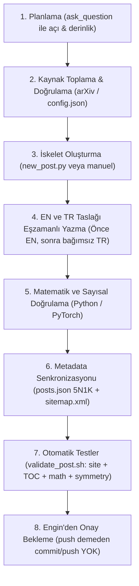

# Engin'in Makale Yazma, Araştırma ve Yayın Akışı

Bu blog (`muhendis.github.io`) statik, iki dilli ve derinlemesine sistem mühendisliği odaklıdır. Build adımı yoktur; Markdown tarayıcıda `marked` ve `KaTeX` ile yerel olarak render edilir.

Bu skill; **internetten bilgi arama ve birincil kaynak doğrulama disiplinini**, **pedagojik anlatım ve sayısal yürüyüş standardını**, **iki dilli (EN + TR) eşzamanlı yazım sürecini**, **yardımcı otomasyon scriptlerini** ve **yayın öncesi doğrulama adımlarını** tanımlar. Buradaki ilkeler pazarlıksızdır.

---

## 1. İnternette Bilgi Arama ve Kaynak Doğrulama Disiplini

Blogun temel ilkesi **"sıfır dedikodu, sıfır ikincil aktarım"**dır. Makale hazırlanırken internet aramaları ve bilgi toplama süreci katı bir filtreyle yürütülür:

### 1.1. Birincil Kaynak Otoritesi (Hiyerarşi)
1. **Orijinal Akademik Makaleler (arXiv / Seminal Papers):**
   - Her formül, mimari yenilik ve teorem doğrudan orijinal makalesinden (`arxiv.org`) okunur (Vaswani 2017, Su 2021 RoPE, Bahdanau 2014, FlashAttention 1/2/3, PagedAttention SOSP 2023, Orca OSDI 2022).
   - İkinci el özetler veya pop-tech yorumları kaynak kabul edilmez.
2. **Resmi Model Konfigürasyonları (`config.json`):**
   - Tensör boyutları ($d_{\text{model}}$, $d_k$, $d_v$), kafa sayıları ($h$), KV kafa sayısı ($n_{\text{kv\_heads}}$), katman sayısı, `vocab_size`, `rope_theta` ve tied embedding kararları Hugging Face veya resmi model depolarındaki orijinal `config.json` dosyasından teyit edilir.
3. **Resmi Çekirdek Kodlar:**
   - PyTorch (`torch.nn`), Hugging Face `transformers`, vLLM motoru ve CUDA/Triton çekirdekleri incelenerek kütüphane seviyesindeki uygulama detayları (ör. $\sqrt{d_k}$ normalizasyonu, attention maskeleri, KV cache blok tahsisi) doğrulanır.
4. **Laboratuvar Araştırma Raporları:**
   - Anthropic Research, Google DeepMind / Research, OpenAI Developers / Research ve Meta AI resmi teknik raporları.

> [!CAUTION]
> **Yasak Kaynaklar:** Medium makaleleri, Substack yazıları, LinkedIn/X (Twitter) sansasyonel paylaşımları, SEO odaklı içerik çiftlikleri veya doğrulanmamış model yanıtları kaynak olarak kabul edilmez.

### 1.2. Arama Taktikleri ve Araç Kullanımı
- `search_web` kullanırken doğrudan yazar adı, arXiv kimliği veya teknik terim sorgulanır:
  - `site:arxiv.org "rotary position embedding" Su`
  - `site:huggingface.co "google/gemma-3-1b" "config.json"`
- `read_url_content` ile bulunan sayfanın orijinal metni, denklem ve tabloları doğrudan çekilip taranır.

### 1.3. Sayısal Kesinlik ve Donanım Kısıtları
- **Sayı Uydurmak Yasaktır:** Her sayısal iddia birincil kaynaktan doğrulanır; teyit edilemeyen sayılar makaleye sokulmaz ya da "yaklaşık" ifadesiyle sınırlandırılır.
- **Tarihsel ve Donanımsal "Neden" Arayışı:** Bir mimari kararın arkasındaki donanım gerçeği araştırılır (ör. TPU HBM bellek darboğazı, GPU bellek bant genişliği vs compute-bound dengesi, sequential RNN bellek patlaması).
- Kapsamlı araştırma rehberi: [bilgi_arama_ve_kaynak_dogrulama.md](./references/bilgi_arama_ve_kaynak_dogrulama.md)
- Bellek ve donanım formülleri el kitabı: [muhendislik_hesaplari_ve_formuller.md](./references/muhendislik_hesaplari_ve_formuller.md)

---

## 2. Çalışma ve Etkileşim Akışı (Adım Adım)

Yeni bir makale yazılırken veya mevcut bir makale zenginleştirilirken şu sıra izlenir:



1. **Planla:**
   - Konu geldiğinde açı, derinlik veya odak belirsizse `ask_question` aracı ile kullanıcıya sorulur.
   - Varsayılan yaklaşım: Kendi özgün mühendislik sentezimiz; kaynaklar açıkça kredilendirilir; asla yüzeysel özet ya da doğrudan çeviri yapılmaz.
2. **Kaynakları Topla ve Doğrula:**
   - Kullanıcının verdiği linkler ve birincil kaynaklar (arXiv, resmi repo) `read_url_content` ile okunur.
   - Somut bir vaka çalışması (case study) seçilir (ör. Gemma 3 veya LLaMA 3.1).
3. **İskelet Oluştur (Scaffold):**
   - Yeni bir makale çifti açılacaksa `./.agents/skills/makale/scripts/new_post.py` çalıştırılarak dosya şablonları ve `posts.json` taslak girdileri hazır kurulur.
4. **EN ve TR'yi Eşzamanlı Yaz:**
   - Önce İngilizce metin (`en/blog/posts/<slug>.md`), hemen ardından bağımsız okunan akıcı Türkçe metin (`tr/blog/posts/<slug>.md`) yazılır.
5. **Sayısal Hesabı Python ile Doğrula:**
   - Makaledeki tüm matris çarpımları, softmax değerleri ve varyans hesapları bağımsız Python scripti ile çalıştırılıp konsol çıktısı alınarak teyit edilir.
6. **İndeksleri Güncelle:**
   - `tr/blog/posts.json` ve `en/blog/posts.json` dosyalarına 5N1K formatında özet eklenir.
   - `sitemap.xml` dosyasına iki dilli URL çifti eklenir.
7. **Otomatik Doğrulamaları Koş:**
   - `./.agents/skills/makale/scripts/validate_post.sh <slug>` komutuyla tüm testler (site doğrulaması, TOC linkleri, KaTeX math render, iki dilli simetri) koşturulur (0 hata şart).
8. **Commit ve Push Disiplini:**
   - **Engin "push" ya da "commit" demeden ASLA git commit veya git push yapılmaz.**

---

## 3. Makale Şablonu ve Pedagojik Standartlar

Makale dosyalarında YAML frontmatter ve `# H1` **kullanılmaz** (başlık `posts.json`'dan dinamik gelir); gövde doğrudan belirti-önce girişle başlar ve `##` başlıklarıyla yapılandırılır.

### 3.1. Belirti-Önce Giriş (Symptom-First Hook)
- Başlıksız 2–3 paragraf ile açılır.
- **Okura Ödev Verilmez:** *"Şunu kurun, şu kodu çalıştırın"* kalıbı yasaktır. Okur daha konuyu neden umursayacağını bilmezken laboratuvar kurmaz.
- **Somut Mühendislik Gerilimi:** Okurun içinde bulunduğu sahne veya paradoks anlatılır (*"strawberry kelimesindeki r'leri sayma arızası"*, *"1B modelin parametrelerinin %30'unu yutan lookup tablosu"*, *"GPU belleğinin %92'si tahsisliyken throughput'un çökmesi"*).
- Gerilim ölçülebilir bir kaynakla ifade edilir (VRAM, gecikme, FLOP, parametre payı).
- Girişin son cümlesi makalenin yol haritasını çizer (*"Bu yazı..."*).

### 3.2. İçindekiler Tablosu (TOC)
- Girişin hemen ardından `**In this article**` (EN) veya `**Bu yazıda**` (TR) başlığı altında manuel anchor listesi yer alır.

### 3.3. Dört Basamaklı Pedagojik İlerleme
Her teknik kavramda şu sıra izlenir:
1. **Sezgi & Analoji:** Zihinde canlanan somut fiziksel analoji (ör. *Fener, Rozet ve Çanta*, *Pasaport Masası* veya *vLLM bir Otel Resepsiyonudur*). Konu oturmuyorsa zorlama metafor yapılmaz, doğrudan mühendislik diliyle konuşulur.
2. **Matematiksel Model (KaTeX):** Blok formül `$$ ... $$`, satır içi `$ ... $`.
3. **Sembol Okuması (Zorunlu):** Formülün altına hemen *"Şöyle okuyun:"* denilerek sembol sembol ne anlama geldiği açıklanır.
4. **Adım Adım Küçük Sayısal Yürüyüş:**
   - Oyuncak boyut ($d=4$, 2 boyut, 3 kelime) kullanılır.
   - Ara adımlar asla atlanmaz (`bölen = \sqrt{4} = 2 \to 6 / 2 = 3` basamak basamak gösterilir).
   - Sayıların kaynağı açıkça belirtilir (öğrenilmiş mi, formülden mi hesaplanmış).
   - Adımlar ````text``` bloğunda hizalı yazılır.
5. **PyTorch Doğrulama Kodu:** Elle yapılan hesabın aynısını kuran, çıktısı gösterilen çalıştırılabilir kod bloğu.

### 3.4. İki Mühendislik Gözü: Training vs Inference (Pazarlıksız)
Her teknik makale konusunu hem **eğitim** hem **çıkarım** açısından ele alır:
- **Training:** Gradyan davranışı, optimizer bellek faturası (AdamW 16 bayt/parametre), loss spike'lar, all-reduce iletişim maliyeti, dondurma/ince ayar etkileri.
- **Inference:** VRAM'de yerleşik ağırlık, prefill (GEMM, compute-bound) vs decode (GEMV, memory-bandwidth-bound), KV cache faturası, TTFT/TPOT, nicemleme uygulanabilirliği.

### 3.5. Sabit Kapanış Üçlüsü
Her makale istisnasız şu üç bölümle biter:
1. `## The whole story in six lines` / `## Bütün hikâye altı satırda` (Tam 6 net ve somut madde; kuru mecaz değil).
2. `## Glossary` / `## Terimler sözlüğü` (Jargon + yalın karşılık + sezgi/sonuç cümlesi).
3. `## Going deeper` / `## Daha derine inmek için` (arXiv birincil linkleri + blog içi `post.html?slug=...` çapraz linkleri).

- Detaylı pedagoji ve şablon kuralları: [sablon_ve_pedagoji_rehberi.md](./references/sablon_ve_pedagoji_rehberi.md)
- Örnek makale taslağı: [ornek_makale_sablonu_tr.md](./examples/ornek_makale_sablonu_tr.md)

---

## 4. Türkçe Dil Kuralları ve Çift Dilli Eşzamanlılık

- **TR Bağımsız Okunur:** TR sürüm asla yapay zeka çevirisi gibi kokmamalıdır; Türkçe teknik makale yazan deneyimli bir mühendisin elinden çıkmış gibi akıcı olmalıdır.
- **Bölüm Bölüm Karşılaştırma:** EN'de düzeltilen veya güncellenen bir sayı, tablo veya formül TR'de de bağımsız olarak güncellenir.
- **Terim Kuralı:** Metot ve desen adları İngilizce kalır; İLK geçişte parantez içinde yerleşik Türkçe karşılığı verilir:
  - *self-attention (öz-dikkat)*, *context vector (bağlam vektörü)*, *tied embeddings (bağlı embedding katmanları)*, *emergent (ölçekle beliren)*, *reinforcement learning (pekiştirmeli öğrenme)*.
- **İngilizce Kalanlar:** prompt, token, embedding, few-shot, benchmark, eval, top-k, upsert, thinking.
- **Yerleşik Türkçe Karşılıklar:** retrieval=erişim, index=dizin, agent=ajan, sub-agent=alt ajan, reranking=yeniden sıralama (yeniden dizme DEĞİL).
- **Rakam Formatı:** Türkçe metinlerde ondalık virgülle (`%17,7`), binlik ayracı noktayla (`1.024`) yazılır.

---

## 5. Sistem Mekaniği, Anchor ve Metadata Kuralları

### 5.1. Anchor ve Slug Kuralları
- Anchor algoritması (`assets/js/blog-post.js`): textContent $\to$ lowercase $\to$ `[^\p{L}\p{N}\s-]` sil $\to$ trim $\to$ boşlukları tek tireye çevir.
- Türkçe karakterler anchor'da kalır (`#2-klasik-alet-çantası`); Türkçe "İ" harfi JavaScript'te `i\u0307` olduğu için regex combining mark'ı siler ve `#i-` kalır. Kesme işaretleri silinir (`Prompt'unuzda` $\to$ `promptunuzda`).

### 5.2. posts.json Sözleşmesi (5N1K Kuralı)
- Yeni makale `tr/blog/posts.json` ve `en/blog/posts.json` dosyalarında `posts` dizisinin **en üstüne** eklenir. `updated` alanına günün tarihi verilir.
- `summary` alanı `<meta name="description">` içine girdiği için **markdown işaretleri (`**bold**` vb.) KULLANILMAZ**, düz metin olarak yazılır.
- **Summary 5N1K'ya cevap verir:**
  - **Ne:** Konunun tek cümlelik özü.
  - **Neden önemli:** Ölçülebilir mühendislik gerilimi (VRAM, FLOP, gecikme, maliyet).
  - **Nasıl:** Makalede açılan mimari mekanizmalar ve çözümler.
  - **Nerede:** Vaka çalışması yapılan somut model (örn. Gemma 3).
  - **Kim için:** Hedef mühendislik profili.
  - **Ne zaman:** Hangi mimari karar ya da üretim darboğazı anında.
- Örnek 5N1K JSON yapısı: [ornek_posts_entry.json](./examples/ornek_posts_entry.json)

### 5.3. sitemap.xml Sözleşmesi
- Her makale için `en` ve `tr` olmak üzere iki `<url>` bloğu eklenir; üçlü hreflang (en, tr, x-default=en), `priority` 0.7 ve `lastmod` girilir.

---

## 6. Doğrulama Komutları ve Araçlar

Yazılan her makale yayına hazır kabul edilmeden önce doğrulanır:

```bash
# 1. Tek komutla tam doğrulama (Site Validator + TOC + KaTeX Math + İki Dilli Simetri)
./.agents/skills/makale/scripts/validate_post.sh <slug>

# 2. İki dilli yapısal simetri testi (Bölüm sayısı, formül, kod, 6 satır ve sözlük denetimi):
python3 .agents/skills/makale/scripts/check_bilingual_symmetry.py <slug>

# 3. Yeni makale çifti kurma (scaffolding):
python3 .agents/skills/makale/scripts/new_post.py <tr_slug> <en_slug> "TR Başlık" "EN Title"
```

---

## 7. Revizyon Döngüsü ve Push Onayı

- İlk taslaktan sonra iteratif iyileştirme beklenir: karmaşık yerleri sadeleştir, örneği güçlendir, sayıları bir kez daha birincil kaynaktan sağlama yap.
- Her revizyonda EN ve TR senkronize tutulur ve testler yeniden koşturulur.
- Engin **"push"** veya **"yayınla"** demeden hiçbir commit veya push işlemi yapılmaz.
