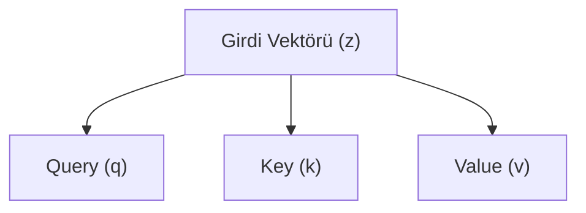

Giriş paragrafı 1: Okurun içinde bulunduğu sahne veya paradoksu anlat. Örnek: Pano GPU belleğinin %92'sinin tahsis edildiğini söylüyor, ancak işlem hacmi benchmark'ın üçte birinde sürünüyor. Kullanıcıya "kod yazın" diye ödev verme; doğrudan arızayı ve sahneyi yaşat.

Giriş paragrafı 2: Mühendislik gerilimini ölçülebilir bir kaynakla bağla (VRAM, gecikme, FLOP, parametre payı). Bu sahnede neyin neden kırıldığını ve teorik beklenti ile pratik gerçek arasındaki uçurumu aç.

Giriş paragrafı 3: Makalenin kapsamını ve yol haritasını çizen kilit cümle: Bu yazı, serimizin X. adımı olarak kaynak metindeki tüm mekanizmayı adım adım açıyor; sezgisel temelini, matematiksel ayrışma gerekçesini, elle yapılan küçük boyutlu hesap yürüyüşünü ve PyTorch doğrulamasını bütüncül bir dille ortaya koyuyor.

**Bu yazıda**

- [1. En yalın hâliyle temel sezgi: Analoji başlığı](#1-en-yalın-hâliyle-temel-sezgi-analoji-başlığı)
- [2. Matematiksel model ve formalizm](#2-matematiksel-model-ve-formalizm)
- [3. Adım adım elle sayısal hesap yürüyüşü](#3-adım-adım-elle-sayısal-hesap-yürüyüşü)
- [4. İki mühendislik gözü: Eğitim ve çıkarım ayrımı](#4-i̇ki-mühendislik-gözü-eğitim-ve-çıkarım-ayrımı)
- [5. PyTorch ile adım adım tam doğrulama](#5-pytorch-ile-adım-adım-tam-doğrulama)
- [Bütün hikâye altı satırda](#bütün-hikâye-altı-satırda)
- [Terimler sözlüğü](#terimler-sözlüğü)
- [Daha derine inmek için](#daha-derine-inmek-için)

---

## 1. En yalın hâliyle temel sezgi: Analoji başlığı

Kavramı zihinde somutlaştıran berrak bir analoji kurun (ör. Fener/Rozet/Çanta veya Pasaport Masası). Tek bir metafor seçin ve bölüm boyunca onu taşıyın. Zorlama metafor yapmayın; konu mühendislik odaklıysa doğrudan teknik bileşenlerle konuşun.



---

## 2. Matematiksel model ve formalizm

Matematiksel formülü blok olarak sunun:

$$\text{Attention}(Q, K, V) = \text{softmax}\left(\frac{Q K^T}{\sqrt{d_k}}\right) V$$

Şöyle okuyun: $Q$ sorgu matrisi, $K$ anahtar matrisi, $V$ ise aktarılacak değer matrisidir; $\sqrt{d_k}$ böleni iç çarpım varyansını $1$'e sabitleyerek softmax doygunluğunu önler.

> **Self-Attention (Öz-Dikkat)** = dizideki her token'ın diğer tüm token'larla anlamsal ilişkisini hesaplayıp ağırlıklı temsil üreten mekanizma.

---

## 3. Adım adım elle sayısal hesap yürüyüşü

Oyuncak boyut ($d=4$, 3 token) kullanarak tüm ara basamakları gösterin.

```text
Girdi Tensörü Z (3 token, d=4):
z_1 = [0.20, 0.80, 0.10, 0.40]
z_2 = [0.90, 0.10, 0.30, 0.20]

Adım 1: Ham iç çarpım hesabı
s_12 = (0.20 * 0.90) + (0.80 * 0.10) + (0.10 * 0.30) + (0.40 * 0.20)
     = 0.18 + 0.08 + 0.03 + 0.08 = 0.37

Adım 2: Ölçekleme (d_k = 4, sqrt(4) = 2)
s_scaled = 0.37 / 2 = 0.185
```

---

## 4. İki mühendislik gözü: Eğitim ve çıkarım ayrımı

| Boyut | Eğitim Tarafı (Training) | Çıkarım Tarafı (Inference) |
| :--- | :--- | :--- |
| **Bellek** | Ağırlıklar + Gradyanlar + AdamW 1. ve 2. momentleri (16B/parametre) | Yalnızca Ağırlıklar (FP16: 2B) + KV Cache ($O(L)$) |
| **Hesap Kısıtı** | Compute-bound (GEMM); Forward + Backward (~6P FLOP) | Prefill: Compute-bound, Decode: Memory-bandwidth-bound |
| **Kritik Risk** | Loss spike, all-reduce iletişim gecikmesi | TTFT/TPOT, KV cache bellek taşması |

---

## 5. PyTorch ile adım adım tam doğrulama

```python
import torch
import math

# 1. Girdi ve ağırlık tensörleri
Z = torch.tensor([[0.20, 0.80, 0.10, 0.40]], dtype=torch.float32)
W_Q = torch.eye(4)

# 2. Projeksiyon ve skor
Q = Z @ W_Q
print("Q tensörü:\n", Q)
```

Konsol çıktısı:

```text
Q tensörü:
 tensor([[0.2000, 0.8000, 0.1000, 0.4000]])
```

---

## Bütün hikâye altı satırda

- Birinci temel mimari gerçek ve mekanizmanın varoluş sebebi.
- İkinci ilke: Query, Key, Value veya bileşen rollerinin ayrışma gerekçesi.
- Üçüncü ilke: Matematiksel formülasyon ve varyans/ölçekleme normalizasyonu.
- Dördüncü ilke: Eğitim ile çıkarım arasındaki temel donanımsal asimetri.
- Beşinci ilke: Mimarideki emergent (kendiliğinden beliren) davranışlar ve donanım kazanımı.
- Altıncı ilke: Üretim sistemlerinde bu bileşenin maliyet, gecikme ve ölçeklenme faturası.

---

## Terimler sözlüğü

- **Self-Attention (Öz-Dikkat)** — token'lar arası dinamik ağırlıklı bağ kurma mekanizması; statik kelimeleri yaşayan bağlam vektörlerine dönüştürür.
- **Context Vector (Bağlam Vektörü)** — bir token'ın cümlenin geri kalanından topladığı ağırlıklı değer gösterimi; tek global vektör darboğazını ortadan kaldırır.

---

## Daha derine inmek için

- Vaswani et al., [Attention Is All You Need](https://arxiv.org/abs/1706.03762) (2017) — Orijinal Transformer ve Multi-Head Attention makalesi.
- Bu blogda: [Bir Prompt'un Yolculuğu (1): Tokenizasyon](post.html?slug=tokenizasyon-nasil-calisir) — masanın ilk adımı: metinden token ID'sine.
