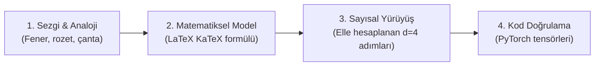

# Makale Şablonu, Pedagojik Akış ve Yazım Standartları

Bu rehber, blogun mimari yazım standardını, KaTeX formül kurallarını, adım adım sayısal hesap örneklerini, Türkçe üslup ilkelerini ve metadata sözleşmelerini tanımlar.

---

## 1. Makale Anatomisi

Her makale dosyasında (`en/blog/posts/<slug>.md` ve `tr/blog/posts/<slug>.md`) aşağıdaki yapı birebir korunur:

```markdown
[Başlıksız 2-3 paragraflık Giriş]
- Belirti-önce kurgu (somut arıza / gerilim)
- Ölçülebilir mühendislik kaynağı (VRAM, FLOP, gecikme, parametre payı)
- Ödev vermeyen anlatım
- Yol haritası cümlesi ("Bu yazı...")

**In this article** veya **Bu yazıda**
- [1. Bölüm Adı](#1-bolum-adi)
- ...
- [Bütün hikâye altı satırda](#butun-hikaye-alti-satirda)
- [Terimler sözlüğü](#terimler-sozlugu)
- [Daha derine inmek için](#daha-derine-inmek-icin)

---

## 1. Bölüm Adı
[Sezgi ve Analoji]
[Görsel / Mermaid Diyagramı]
[LaTeX Matematiksel Formülasyon]
[Sembol Açıklaması]
[Küçük Boyutlu Adım Adım Sayısal Hesap]

---

## 2. ... (İki Mühendislik Gözü: Training vs Inference)

---

## N. PyTorch ile Adım Adım Tam Doğrulama
[Çalıştırılabilir Python / PyTorch Kodu]
[Konsol Çıktısı]

---

## Bütün hikâye altı satırda
- 1. Madde
- 2. Madde
- 3. Madde
- 4. Madde
- 5. Madde
- 6. Madde

---

## Terimler sözlüğü
- **Terim (İngilizce)** — tanım + sezgi ya da somut mühendislik faturası.

---

## Daha derine inmek için
- Orijinal Makale 1 [arXiv Linki]
- Orijinal Makale 2 [arXiv Linki]
- Bu blogda: [Önceki Makale Adı](post.html?slug=...)
```

---

## 2. Pedagojik İlerleme Döngüsü

Teknik bir kavram okura aktarılırken dört basamaklı merdiven izlenir:



### 1. Sezgi ve Analoji
- Konu kendiliğinden bir analojiye oturuyorsa (ör. Fener/Rozet/Çanta veya Pasaport Masası) baştan sona **tek bir analoji** taşınır.
- Oturmuyorsa zorlama metafor yapılmaz; doğrudan mühendislik gerilimiyle konuşulur.

### 2. Matematiksel Formülasyon ve Sembol Okuması
- Blok formül `$$ ... $$`, satır içi `$ ... $`.
- **Sembol Okuması Zorunludur:** Formülün hemen altına "Şöyle okuyun:" denilerek denklemdeki her bir harf ve simge açıklanır. Sembol açıklaması olmayan formül süsten ibarettir.

### 3. Oyuncak Boyutlu Adım Adım Sayısal Yürüyüş
- Boyut küçük tutulur ($d = 4$, $2 \times 2$ veya 3 kelime).
- **Ara adımlar asla atlanmaz:** `\sqrt{4} = 2 \to 6 / 2 = 3` şeklinde her basamak gösterilir.
- Sayılar hizalı bir ````text``` bloğunda verilir.
- Sayıların nereden geldiği söylenir: *"öğrenilmiş ağırlık"*, *"hesaplanmış koordinat"* veya *"girdi tensörü"*.

### 4. PyTorch Doğrulama Kodu
- Sayısal yürüyüşte elle hesaplanan matrislerin aynısını kuran, tam çalıştırılabilir minimal PyTorch kodu sunulur.
- Kodun hemen altına gerçek konsol çıktısı eklenir.

---

## 3. İki Mühendislik Gözü: Training vs Inference (Pazarlıksız)

Her makalede ele alınan bileşenin iki ayrı dünyaya faturası incelenir:

| Boyut | Eğitim Tarafı (Training) | Çıkarım Tarafı (Inference) |
| :--- | :--- | :--- |
| **Bellek** | Ağırlıklar + Gradyanlar + Optimizer Durumları (AdamW: 16 bayt/parametre) | Yalnızca Ağırlıklar (FP16: 2 bayt, INT4: 0.5 bayt) + KV Cache |
| **Hesap** | Forward + Backward (kabaca 3x forward FLOP) | Yalnızca Forward; Prefill (compute-bound) vs Decode (memory-bandwidth bound) |
| **İletişim** | Dağıtık eğitimde all-reduce, pipeline / tensor parallelism | Dağıtık serviste tensor parallelism, KV cache replication |
| **Riskler** | Loss spike, vanishing/exploding gradient, numeric overflow | Gecikme (TTFT, TPOT), KV cache bellek taşması, nicemleme kaybı |

---

## 4. Türkçe Dil Kuralları ve Çift Dilli Simetri

- **Önce EN, Hemen Ardından TR:** Her makale aynı oturumda iki dilli olarak tamamlanır.
- **Bağımsız Okuma:** TR metin, çeviri hissi vermeyecek şekilde, Türkçe düşünen kıdemli bir sistem mühendisinin kaleme aldığı berraklıkta olmalıdır.
- **Teknik Terim Kuralı:** Metot, desen ve mimari adları İngilizce kalır; ilk geçişte parantez içinde yerleşik Türkçe karşılığı verilir:
  - *self-attention (öz-dikkat)*
  - *lookup table (arama tablosu)*
  - *context vector (bağlam vektörü)*
  - *emergent (kendiliğinden beliren)*
  - *tied embeddings (bağlı embedding katmanları)*
- **Rakam Formatı:** Türkçe metinlerde ondalık ayracı **virgül** (`%17,7`, `0,84`), binlik ayracı **nokta** (`1.024`, `10.000`) kullanılır.
- **Telgraf Cümlesi Yasağı:** Düzyazıda parçalı veya telgraf cümleler kurulmaz. Tam ve akıcı cümleler şarttır.

---

## 5. posts.json ve 5N1K Kuralı

`posts.json` içindeki `summary` alanı `<meta name="description">` olarak da kullanıldığı için markdown (`**bold**` vb.) içermez; düz metin olarak 5N1K yapısıyla yazılır:

- **Ne:** Konunun tek cümlelik teknik tanımı.
- **Neden önemli:** Ölçülebilir mühendislik gerilimi (VRAM, FLOP, gecikme, maliyet).
- **Nasıl:** Makalede adım adım incelenen mekanizmalar ve çözümler.
- **Nerede:** Vaka çalışması olarak seçilen somut model/sistem (örn. Gemma 3, vLLM).
- **Kim için:** Hedef kitle mühendis profili.
- **Ne zaman:** Hangi mimari karar veya üretim arızası eşiğinde okunmalı.
