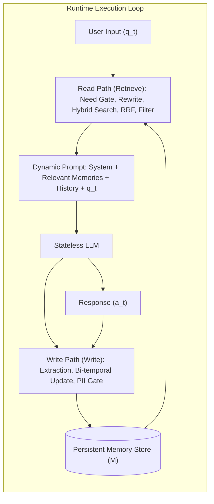
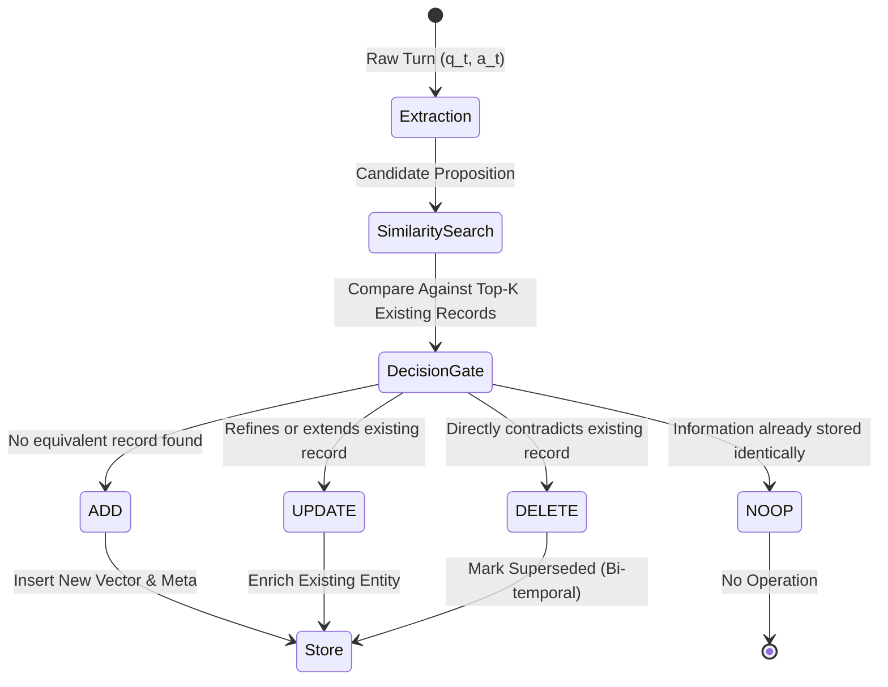
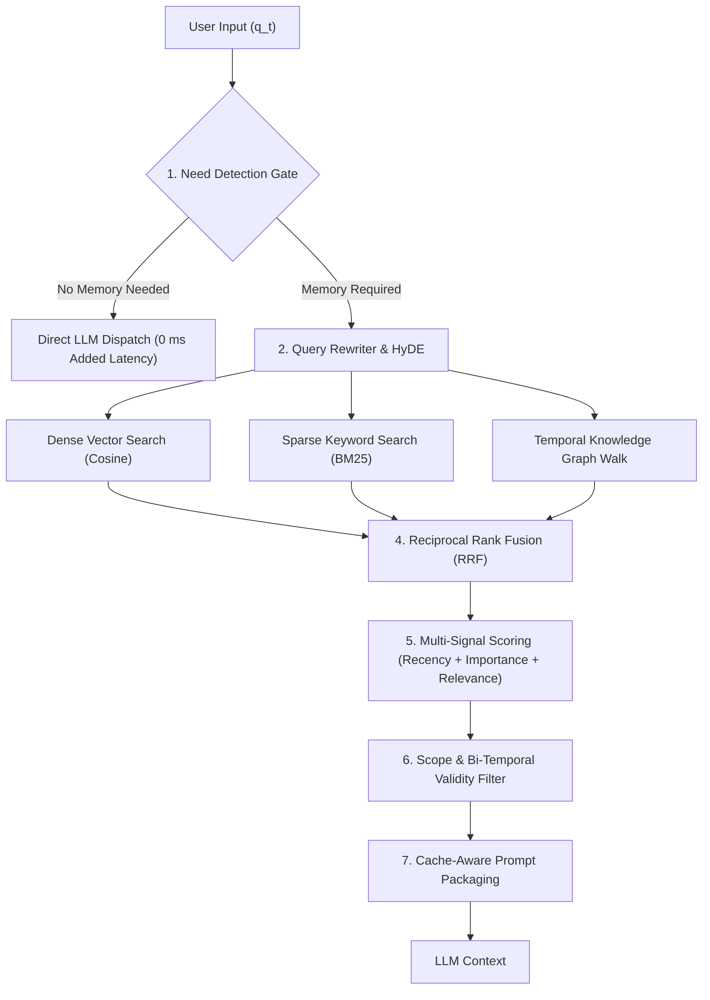
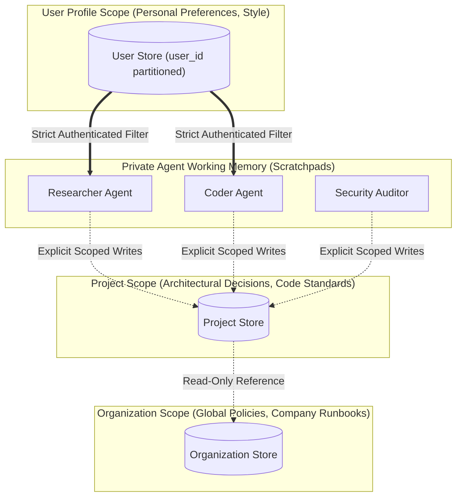

On Monday, a user tells your AI assistant, *"I moved to Berlin last week."* On Saturday, when asking for a hiking trail near their home, the assistant recommends a trail in the Belgrade Forest outside Istanbul without a hint of hesitation. Nothing crashed. Vector search performed as configured, cosine similarity was high, and the language model reasoned with grammatical fluency. The memory store did exactly what was asked of it: it retained both *"lives in Istanbul"* and *"moved to Berlin"*, but returned the older record because it had been retrieved more frequently in past sessions. The agent did not forget; it did something far more dangerous: **it remembered wrong**.

The two most common engineering reflexes to this problem fail predictably in production. The first reflex assumes that because modern context windows span 1 million tokens, one can simply concatenate the entire conversation history into every prompt. On the LOCOMO benchmark, this brute-force approach averages 26,000 tokens per query and drives p95 latency past 17 seconds. Worse, when conversation history reaches approximately 115,000 tokens, flagship models like GPT-4o degrade from 87.0% to 60.6% accuracy on LongMemEval—even while the ground-truth evidence remains inside the prompt. Literature terms this **Context Rot** and the **Lost-in-the-Middle** phenomenon. The second reflex—naive vector retrieval (RAG)—drops latency to 1.4 seconds, but lacking temporal awareness and relational knowledge graphs, it cannot recognize superseded facts, serving outdated assertions as active truths.

In modern AI systems engineering, memory is neither a simple key-value table, a vector database, nor an append-only log. Memory is an architectural system surrounding a stateless foundation model: a **write path** deciding what deserves retention, a **read path** filtering relevant state, an offline **dreaming / consolidation** cycle reconciling contradictions across sessions, and a **multi-agent governance layer** preventing workspace corruption and memory poisoning.

This article provides an end-to-end systems engineering blueprint of agent memory. Drawing from Anthropic's *Context Engineering* principles, NVIDIA NeMo Agent Toolkit's modular abstractions, Hugging Face `smolagents` execution tracing, and foundational research (CoALA cognitive taxonomy, MemGPT operating system virtual memory, Memory-R1 reinforcement learning memory management, Zep bi-temporal knowledge graphs, and HippoRAG hippocampal indexing), we trace the physical limits of context windows, write and read pipelines, Ebbinghaus decay mathematics, GPU KV cache formulas ($2 \times L \times H_{kv} \times d_{\text{head}} \times b$), memory poisoning vulnerabilities (AgentPoison, MINJA), and a reference Python implementation resolving the Berlin migration bug.

**In this article**

- [1. The model forgets, the loop remembers](#1-the-model-forgets-the-loop-remembers)
- [2. The desk: context window as working memory](#2-the-desk-context-window-as-working-memory)
  - [FIFO and token budgets](#fifo-and-token-budgets)
  - [Why a larger desk is not the solution](#why-a-larger-desk-is-not-the-solution)
  - [Compaction and memory pressure: MemGPT and Anthropic Compaction](#compaction-and-memory-pressure-memgpt-and-anthropic-compaction)
- [3. Cognitive taxonomy: Four memory types](#3-cognitive-taxonomy-four-memory-types)
- [4. The write path: deciding what to store](#4-the-write-path-deciding-what-to-store)
  - [Extraction and state transitions: ADD, UPDATE, DELETE, NOOP](#extraction-and-state-transitions-add-update-delete-noop)
  - [Importance and reflection](#importance-and-reflection)
  - [Supersession: The bi-temporal model](#supersession-the-bi-temporal-model)
  - [Designing forgetting: Ebbinghaus decay](#designing-forgetting-ebbinghaus-decay)
  - [Governance gate and safety](#governance-gate-and-safety)
  - [Hot path vs background workers](#hot-path-vs-background-workers)
- [5. The read path: retrieval is a pipeline](#5-the-read-path-retrieval-is-a-pipeline)
  - [Do we need memory? Need detection and Just-in-Time](#do-we-need-memory-need-detection-and-just-in-time)
  - [Query rewriting and HyDE](#query-rewriting-and-hyde)
  - [Scoring a memory: recency, importance, relevance](#scoring-a-memory-recency-importance-relevance)
  - [Step-by-step walkthrough](#step-by-step-walkthrough)
  - [Hybrid retrieval and RRF](#hybrid-retrieval-and-rrf)
  - [Packaging: provenance, positioning, and prompt caching](#packaging-provenance-positioning-and-prompt-caching)
- [6. Cross-session consolidation: sleep-time compute and dreaming](#6-cross-session-consolidation-sleep-time-compute-and-dreaming)
  - [The economics of sleep-time compute](#the-economics-of-sleep-time-compute)
  - [Dreaming in production: Anthropic and OpenAI](#dreaming-in-production-anthropic-and-openai)
  - [The context collapse trap and ACE architecture](#the-context-collapse-trap-and-ace-architecture)
- [7. Eight architectures, eight trade-offs](#7-eight-architectures-eight-trade-offs)
- [8. Multi-agent memory: scope before storage](#8-multi-agent-memory-scope-before-storage)
  - [Who can write where: Policy matrix](#who-can-write-where-policy-matrix)
  - [Six failure modes of shared memory](#six-failure-modes-of-shared-memory)
  - [Memory poisoning and indirect injection](#memory-poisoning-and-indirect-injection)
  - [Poisoning without direct store access: MINJA](#poisoning-without-direct-store-access-minja)
- [9. Two engineering lenses: training vs inference](#9-two-engineering-lenses-training-vs-inference)
  - [The training lens: Why parametric memory is not enough](#the-training-lens-why-parametric-memory-is-not-enough)
  - [The inference lens: The KV Cache bill](#the-inference-lens-the-kv-cache-bill)
- [10. In production, memory is a system](#10-in-production-memory-is-a-system)
  - [Minimal API](#minimal-api)
  - [Hot, warm, cold tiering](#hot-warm-cold-tiering)
  - [Three ways to isolate tenants](#three-ways-to-isolate-tenants)
  - [Where does p95 latency go: Latency budget](#where-does-p95-latency-go-latency-budget)
  - [The day you upgrade the embedding model](#the-day-you-upgrade-the-embedding-model)
  - [Evaluation: Five core capabilities](#evaluation-five-core-capabilities)
  - [Benchmark reality: LoCoMo vs LongMemEval](#benchmark-reality-locomo-vs-longmemeval)
- [11. The full loop in 60 lines of Python](#11-the-full-loop-in-60-lines-of-python)
- [The whole story in six lines](#the-whole-story-in-six-lines)
- [Glossary](#glossary)
- [Going deeper](#going-deeper)

---

## 1. The model forgets, the loop remembers

Large language models are fundamentally **stateless** forward-pass computation engines. When an inference call completes, token generation terminates, GPU registers clear, and the model weights retain zero residual traces of the user, the session, or the prompt processed milliseconds earlier. If an assistant appears to remember you across sessions, this intelligence does not stem from internal biological plasticity within the model; it is engineered by the **outer system loop** dynamically retrieving past state and reinjecting it into the input context.

Consider an intuitive physical analogy: Imagine a brilliant management consultant sitting at an office desk. Every morning, the consultant arrives with complete retrograde amnesia—they recognize no ongoing clients and recall no prior deliverables. Their operational world is strictly bounded by the physical papers currently placed on their desk.
- **The Consultant:** The stateless language model (LLM).
- **The Desk:** The context window.
- **The In-Tray:** The active user message ($q_t$).
- **The Archive Room:** The persistent external storage ($\mathcal{M}$).
- **The Filing Clerk:** The write pipeline deciding what warrants recording (`Write`).
- **The Research Librarian:** The read pipeline indexing and retrieving relevant dossiers onto the desk (`Retrieve`).

Whether the consultant behaves as a coherent, context-aware partner depends entirely on the discipline of the librarian and filing clerk.



Mathematically, agent interaction at step $t$ begins with the retrieval function assembling the context:

$$\text{prompt}_t = \text{System} \;\oplus\; \text{Retrieve}(q_t, \mathcal{M}_t) \;\oplus\; \text{History}_{t-k:t} \;\oplus\; q_t$$

Read this as: *The prompt at step $t$ is assembled by concatenating ($\oplus$) the fixed system prompt, dynamic memories retrieved from long-term store $\mathcal{M}_t$ for query $q_t$, recent uncompressed conversation history, and the incoming user message.*

Upon generating response $a_t$, the system updates state via the transition function:

$$\mathcal{M}_{t+1} = \text{Write}\big(\mathcal{M}_t,\; q_t,\; a_t\big)$$

Read this as: *The subsequent memory store $\mathcal{M}_{t+1}$ equals the prior store updated by the write path extracting atomic facts, reconciling contradictions, and superseding outdated records from the $(q_t, a_t)$ exchange.*

These two equations frame the core challenges of agent memory: what documents should `Retrieve` place on the desk, and how should `Write` manage archival contradictions?

---

## 2. The desk: context window as working memory

### FIFO and token budgets

The simplest approach to memory is omitting an external system entirely: prepending raw conversational transcripts into every new prompt. While conversations remain short, this provides optimal recall because self-attention operates across all past tokens. However, the physical boundary is immutable: the model's context window ($T_{\text{window}}$).

The budget allocated to historical dialogue is strictly bounded:

$$T_{\text{history}} = T_{\text{window}} - T_{\text{system}} - T_{\text{tools}} - T_{\text{memories}} - T_{\text{output}}$$

Read this as: *Usable history token capacity equals total window size minus system instructions, tool definitions, retrieved memory tokens, and reserved generation output.*

Consider a representative 8,192-token context window budget:

```text
T_window    = 8,192 tokens (Physical model boundary)
T_system    = 1,500 tokens (Persona, operational instructions)
T_tools     = 1,200 tokens (JSON Schema function signatures)
T_memories  =   800 tokens (Retrieved long-term records)
T_output    = 1,000 tokens (Reserved generation ceiling)
-----------------------------------------------------------------
T_history   = 8,192 - (1,500 + 1,200 + 800 + 1,000) = 3,692 tokens
```

When conversation transcripts exceed 3,692 tokens, eviction is mandatory. The default naive policy is **FIFO (First-In, First-Out)**: evicting the oldest turn first. Yet FIFO is deeply flawed for human interaction. Users state foundational constraints and permanent preferences early (*"I am vegetarian"*, *"Our database is PostgreSQL"*), while asking questions relying on those facts days later. FIFO methodically purges foundational premises first.

### Why a larger desk is not the solution

Frontier models expanding context windows to 128k, 1M, or 2M tokens prompted assertions that dedicated memory architectures are obsolete. Empirical measurements refute this across three dimensions:

1. **Lost in the Middle (Liu et al., Stanford/Berkeley, 2023):** Softmax normalization across massive sequences biases attention toward boundary tokens (the start and end of the prompt) while degrading retrieval for facts placed in the middle. Multi-document QA accuracy drops 20 to 30 absolute percentage points when target information is centered.
2. **Context Rot & LongMemEval (ICLR 2025):** On the LongMemEval benchmark, GPT-4o accuracy drops from 87.0% to 60.6% when evaluated against ~115,000 tokens of genuine multi-session chat history—a 30% relative drop despite ground-truth evidence remaining inside the prompt. As Anthropic's *Context Engineering* findings detail: uncurated history converts past conversational noise into **distractors**, diluting attention allocation.
3. **Hardware KV Cache Footprint:** Ingestion requires prefilling every token and caching Key-Value pairs in GPU memory throughout generation. For LLaMA-3-8B, the KV cache footprint is 128 KiB per token (derived in Section 9). Ingesting 100,000 historical tokens allocates **12.8 GiB of VRAM per concurrent user**, rendering multi-tenant serving economically intractable.

The context window lacks the essential architectural primitives of a database:

| Database Primitive | Context Window Reality | Architectural Remedy |
|---|---|---|
| **Query Optimization** | Full sequential scan on every inference pass | Need classification and targeted retrieval (Section 5) |
| **Indexing** | Positional sequence index only | Vector, BM25, and temporal graph indices (Section 5) |
| **Access Control (RBAC)** | Everything in prompt is exposed to model | Strict tenant isolation and scoping (Section 8) |
| **Time-to-Live (TTL)** | Persists until window eviction | Ebbinghaus decay scoring (Section 4) |
| **Conflict Resolution** | Contradictions coexist and confuse generation | Bi-temporal supersession (Section 4) |

### Compaction and memory pressure: MemGPT and Anthropic Compaction

To counter context overflow, modern systems employ structured compaction:

**MemGPT (Packer et al., UC Berkeley, 2023):** Adapts operating system virtual memory paradigms to LLM agents. MemGPT partitions the context window into:
- **Read-Only System:** Core operational rules.
- **Working Context:** A fixed-budget scratchpad modified via explicit function calls (`core_memory_append`, `core_memory_replace`).
- **FIFO Message Queue:** Ephemeral diyalog turns.

The queue manager monitors token volume and emits interrupts:

| Threshold | System Response |
|---|---|
| **70% Memory Pressure** | An internal system interrupt instructs the model: *"Context approaching capacity; persist critical facts to archival storage."* |
| **100% Eviction Threshold** | The manager evicts the oldest ~50% of messages, compresses them into an incremental summary block, and flushes raw events to disk-backed `recall storage`. |

**Anthropic Compaction:** In Claude-based engineering agents, server-side compaction summarizes aging conversational turns when capacity saturates. However, recursive summarization introduces **Context Collapse**: repeated compression rounds strip fine-grained error codes and specific variables, preserving only vague generalities.

---

## 3. Cognitive taxonomy: Four memory types

Cognitive psychology distinguishes memory systems by operational function. The **CoALA framework (Cognitive Architectures for Language Agents, Sumers et al., TMLR 2024)** formalizes this taxonomy for autonomous agents, mirrored in modern frameworks like Hugging Face `smolagents` and NVIDIA NeMo:

| Memory Type | Functional Definition | Write Policy | Retrieval Mechanism | Storage Substrate |
|---|---|---|---|---|
| **Working Memory** | Active task context, scratchpad reasoning, tool execution returns. | Reconstructed per LLM invocation. | In-context attention window. | Active Prompt / RAM |
| **Episodic Memory** | *"What happened and when?"* Execution traces, past trial sequences, error logs. | Appended post-session or task completion. | Timestamp and similarity filtered search. | Event Log + Vector Store |
| **Semantic Memory** | *"What is true about the user and world?"* Verified facts, preferences, constraints. | Extracted, deduplicated, and superseded. | Dense cosine, BM25, Knowledge Graph traversal. | pgvector, Qdrant, Graphiti |
| **Procedural Memory** | *"How are actions executed?"* Runbooks, tool schemas, code libraries, system prompts. | Developer deployment or offline RL fine-tuning. | Loaded at startup or via tool registry. | Git repo, Tool Registry |

Consider an operational example: The user asks, *"Plan a weekend hike similar to last Saturday."*
1. **Episodic Memory:** Identifies the specific trail executed last Saturday.
2. **Semantic Memory:** Retrieves current state constraints (*"Resides in Berlin"*, *"Prefers trails under 15 km"*).
3. **Procedural Memory:** Supplies the navigation API schema and invocation contracts.
4. **Working Memory:** Synthesizes these inputs within the prompt to generate the plan.

CoALA emphasizes a critical invariant: **Writing to procedural memory carries far higher operational risk than writing to semantic memory.** A semantic error affects an isolated output (*"recommending Istanbul instead of Berlin"*). Corrupting a procedural rule compromises **every subsequent agent invocation and safety boundary**.

Empirical validation highlights this taxonomy:
- **Voyager (Wang et al., 2023):** Accumulated executable JavaScript skills within a procedural `skill library` in Minecraft.
- **Reflexion (Shinn et al., NeurIPS 2023):** Maintained episodic reflections ($\Omega = 1..3$), improving HumanEval coding accuracy from 80% to 91%.
- **ReasoningBank (Google Cloud AI Research, 2025):** Distilled general heuristics from both successes and failures, boosting task completion by 20% while reducing redundant API steps by 16%.

---

## 4. The write path: deciding what to store

The majority of retrieval failures originate in the **write pipeline**. An uncurated write path allows contradictions to persist, fails to redact sensitive secrets, and pollutes vector indices with conversational noise.

### Extraction and state transitions: ADD, UPDATE, DELETE, NOOP

Writing raw transcripts into vector storage degrades retrieval precision. A turn stating *"Yes, like last time but with a friend"* carries zero standalone semantic utility six months later.

The write pipeline converts turns into **atomic facts**. **Mem0 (Chhikara et al., 2025)** organizes this via a two-stage state machine:
1. **Extraction:** An auxiliary model parses dialogue turns to generate candidate propositions.
2. **State Transition:** The candidate proposition is compared against the top-$k$ nearest neighbors in storage, triggering one of four operations:



The operational boundaries:
- **ADD:** *"User prefers morning trail running."*
- **UPDATE:** *"Prefers flat trails"* is refined to *"Prefers flat trails under 15 km."*
- **DELETE (Supersession):** *"I eat fish now"* invalidates *"User is strictly vegetarian."*
- **NOOP:** Repeated mention of an established fact.

Hard deletion is dangerous. If the system permanently deletes the Istanbul record upon learning the user moved to Berlin, it can never answer, *"Where did I live before moving to Germany?"* Production systems implement **bi-temporal supersession** rather than hard physical deletion.

### Importance and reflection

Not all extracted propositions warrant storage. A user stating they ate a sandwich carries minimal long-term value relative to a penicillin allergy.

**Generative Agents (Park et al., Stanford, 2023):** Employs an auxiliary model to score proposition importance on a scale of 1 to 10 at ingestion time:
- *"Brushed teeth"* $\to$ Importance: 1
- *"Initiated divorce proceedings"* $\to$ Importance: 9
- *"Accepted principal engineering offer"* $\to$ Importance: 8

This scalar is persisted within the record's metadata, eliminating repeated scoring overhead during read operations.

**Reflection:** When accumulated importance scores exceed a set threshold ($\sum \text{Importance} \ge 150$), background reflection triggers. The model synthesizes disparate episodic observations into abstract semantic beliefs: *"User values rigorous systems engineering over superficial demos."* This insight is stored with bidirectional pointers linking back to its evidential logs.

### Supersession: The bi-temporal model

Originating in temporal database theory and applied to agent graphs by **Zep / Graphiti (Rasmussen et al., 2025)**, the **Bi-temporal Model** resolves state contradiction by decoupling real-world truth from system knowledge.

Each memory record maintains four distinct timestamps across two independent timelines:

$$\text{MemoryRecord} = \big\langle \text{Fact},\; t_{\text{valid\_from}},\; t_{\text{valid\_to}},\; t'_{\text{created}},\; t'_{\text{expired}} \big\rangle$$

Read this as:
- $t_{\text{valid\_from}}$ and $t_{\text{valid\_to}}$: **Valid Time (World Time)**. Defines when the proposition holds true in the physical world.
- $t'_{\text{created}}$ and $t'_{\text{expired}}$: **Transaction Time (System Time)**. Records when the system ingested and superseded the record.

```text
[Record 1 - Historical State]
Fact: "User lives in Istanbul."
Valid Time:       [2020-01-01 -> 2026-09-20] (Superseded on Sep 20)
Transaction Time: [2026-01-15 -> 2026-09-21] (Learned and expired by system)

[Record 2 - Active State]
Fact: "User lives in Berlin."
Valid Time:       [2026-09-21 -> Infinity] (Currently true)
Transaction Time: [2026-09-21 -> Infinity]
```

This model enables deterministic temporal queries:
- *"Where do I live right now?"* $\to$ Filter: $t_{\text{valid\_from}} \le \text{now} < t_{\text{valid\_to}}$ $\implies$ **Berlin**.
- *"Where did I live last summer?"* $\to$ Filter: $t_{\text{valid\_from}} \le 2025 < t_{\text{valid\_to}}$ $\implies$ **Istanbul**.
- *"What did the assistant believe when answering on September 1st?"* $\to$ Filter: $t'_{\text{created}} \le \text{Sep 1} < t'_{\text{expired}}$ $\implies$ **Istanbul** (Auditability).

### Designing forgetting: Ebbinghaus decay

Unfiltered memory accumulation degrades vector retrieval precision. **MemoryBank (Zhong et al., 2023)** implements **Ebbinghaus' Forgetting Curve** to govern retention decay:

$$R(t) = e^{-\frac{t}{S}}$$

Read this as: *The retrieval retention score $R(t)$ decays exponentially as elapsed time $t$ increases since last access. The denominator $S$ represents memory strength.*

Through **Spaced Repetition**, retention resists decay:
1. Ingested memories initialize with strength $S = 1$.
2. Each time an item is retrieved or verified in dialogue, strength increments ($S \leftarrow S + 1$) and elapsed time resets ($t \leftarrow 0$).
3. Frequently referenced constraints stabilize, while one-off comments decay toward zero.

```text
Memory A (Ephemeral detail, never accessed again, S=1):
  t = 1 day:   R = e^(-1/1) = 0.368
  t = 3 days:  R = e^(-3/1) = 0.050
  t = 7 days:  R = e^(-7/1) = 0.001 (Functionally forgotten)

Memory B (Core preference, reinforced on days 1 and 3):
  t = Day 1 access: S = 2, t resets to 0
  t = Day 3 access: S = 3, t resets to 0
  t = Day 7 (4 days post-access): R = e^(-4/3) = 0.264 (Preserved)
```

Three engineering rules govern decay:
1. **Decay demotes, it does not purge:** Decayed items migrate from hot vector indices to cold archival logs.
2. **Importance overrides decay:** High-criticality items (medical allergies) are pinned ($S \to \infty$).
3. **Decay does not resolve contradictions:** The Berlin/Istanbul conflict requires bi-temporal invalidation, not passive decay.

### Governance gate and safety

Prior to persistence, candidate records pass through a **Governance Gate**:
- **Secret & PII Redaction:** Regex and local NER models scrub payment card numbers, credentials, and PII into `[REDACTED_SECRET]`.
- **Scope Enforcement:** Records are cryptographically tagged with explicit tenant and user IDs.
- **Provenance Tracking:** Ingestion logs differentiate direct user assertions from unverified third-party web scraper outputs.

### Hot path vs background workers

Architectures balance latency against consistency:
- **Hot Path:** Immediate, synchronous updates executed within the active user turn. Essential for intra-session continuity (*"Call me Alex from now on"*).
- **Background Workers:** Asynchronous processing (via Redis / SQS queues) handling heavy graph indexing, embedding generation, and reflection without inflating user TTFT latency.

---

## 5. The read path: retrieval is a pipeline

In production, memory retrieval is an orchestrator pipeline executing across multiple stages:



### Do we need memory? Need detection and Just-in-Time

Triggering vector retrieval for queries like *"How do I reverse a linked list in Rust?"* incurs 150–300 ms of latency and database load unnecessarily.

A lightweight classifier routes queries. Under **Anthropic's Just-in-Time Retrieval** principle, the context window maintains lightweight resource pointers; the memory engine executes retrieval exclusively for queries exhibiting state dependency.

### Query rewriting and HyDE

Raw conversational turns make poor standalone retrieval keys:
- User: *"Same as last time, but cheaper."*

Searching vector indices directly with this sentence fails completely.
- **Query Resolution:** An auxiliary model resolves conversational coreferences using recent turns: *"Lodging booking matching the cabin rental from September 14th with lower nightly rates."*
- **HyDE (Hypothetical Document Embeddings, Gao et al., 2022):** Users ask questions (*"Where do I live?"*), while memory stores contain declarative assertions (*"User resides in Berlin"*). HyDE generates a hypothetical response and embeds that declarative structure to bridge the embedding angle gap.

### Scoring a memory: recency, importance, relevance

Candidate items passing initial filters are ranked via three complementary dimensions:

1. **Recency:** Time elapsed since last retrieval:

$$\text{recency}(m) = \gamma^{\,\Delta t_m}, \qquad \gamma = 0.995$$

Read this as: *$\Delta t_m$ is the elapsed hours since last access. With $\gamma = 0.995$, half-life is ~138 hours.*

2. **Relevance:** Cosine similarity between query embedding $\mathbf{q}$ and memory embedding $\mathbf{m}$:

$$\text{relevance}(m) = \cos(\mathbf{q}, \mathbf{m}) = \frac{\mathbf{q} \cdot \mathbf{m}}{\lVert \mathbf{q} \rVert \, \lVert \mathbf{m} \rVert}$$

3. **Importance:** Static integer scalar ($1..10$) assigned at ingestion.

Candidate scores are normalized via **Min-Max Scaling**:

$$\hat{x}_m = \frac{x_m - \min_j x_j}{\max_j x_j - \min_j x_j}$$

The final composite score equals:

$$\text{score}(m) = \alpha_{\text{rec}} \, \widehat{\text{rec}}_m + \alpha_{\text{imp}} \, \widehat{\text{imp}}_m + \alpha_{\text{rel}} \, \widehat{\text{rel}}_m$$

### Step-by-step walkthrough

Assume system time is $t = 72$ hours. The user asks, *"Recommend hiking trails near my home."*
Query vector: $\mathbf{q} = [0.80, \; 0.60]$ with $\lVert \mathbf{q} \rVert = 1$.

Three valid candidates exist (superseded Istanbul records are pruned by temporal filters):
- **$m_1$ ("Hikes on Saturdays"):** Vector $\mathbf{m}_1 = [0.90, \; 0.30]$, Last accessed: $t=0$ ($\Delta t = 72$), Importance: 6
- **$m_2$ ("Lives in Berlin"):** Vector $\mathbf{m}_2 = [0.50, \; 0.80]$, Last accessed: $t=70$ ($\Delta t = 2$), Importance: 8
- **$m_3$ ("Ate sandwich for lunch"):** Vector $\mathbf{m}_3 = [-0.30, \; 0.40]$, Last accessed: $t=71$ ($\Delta t = 1$), Importance: 1

**Step 1: Compute Raw Signal Values**

```text
1. Recency:
   m1: 0.995^72 = 0.6970
   m2: 0.995^2  = 0.9900
   m3: 0.995^1  = 0.9950

2. Cosine Relevance:
   m1: (0.80*0.90 + 0.60*0.30) / sqrt(0.81 + 0.09) = 0.9000 / 0.9487 = 0.9487
   m2: (0.80*0.50 + 0.60*0.80) / sqrt(0.25 + 0.64) = 0.8800 / 0.9434 = 0.9328
   m3: (0.80*-0.30 + 0.60*0.40) / sqrt(0.09 + 0.16) = 0.0000 / 0.5000 = 0.0000

3. Importance:
   m1 = 6,  m2 = 8,  m3 = 1
```

**Step 2: Min-Max Normalization and Composite Ranking ($\alpha = 1$)**

```text
Recency Range: [0.6970 -> 0.9950], Delta = 0.2980
  m1_hat = (0.6970 - 0.6970) / 0.2980 = 0.000
  m2_hat = (0.9900 - 0.6970) / 0.2980 = 0.983
  m3_hat = (0.9950 - 0.6970) / 0.2980 = 1.000

Importance Range: [1 -> 8], Delta = 7
  m1_hat = (6 - 1) / 7 = 0.714
  m2_hat = (8 - 1) / 7 = 1.000
  m3_hat = (1 - 1) / 7 = 0.000

Relevance Range: [0.0000 -> 0.9487], Delta = 0.9487
  m1_hat = 0.9487 / 0.9487 = 1.000
  m2_hat = 0.9328 / 0.9487 = 0.983
  m3_hat = 0.0000 / 0.9487 = 0.000

FINAL COMPOSITE SCORE TABLE:
  m2 ("Lives in Berlin"):       0.983 + 1.000 + 0.983 = 2.966  --> [RANK 1]
  m1 ("Hikes on Saturdays"):    0.000 + 0.714 + 1.000 = 1.714  --> [RANK 2]
  m3 ("Ate sandwich"):          1.000 + 0.000 + 0.000 = 1.000  --> [RANK 3 - Pruned]
```

Top-2 selection injects $m_2$ and $m_1$ into the prompt, providing the exact spatial constraint and hobby context needed for the response.

### Hybrid retrieval and RRF

Dense vector embeddings excel at broad conceptual semantics, but falter on alphanumeric identifiers, specific API endpoints, and exact terminology. Conversely, BM25 handles exact tokens but lacks conceptual generalization.

Production architectures execute dense vector search, BM25, and graph lookups concurrently, fusing outputs via **Reciprocal Rank Fusion (RRF, Cormack et al., SIGIR 2009)**:

$$\text{RRF}(m) = \sum_{r \in \mathcal{R}} \frac{1}{k + \text{rank}_r(m)}, \qquad k = 60$$

Read this as: *Each retrieval engine $r$ awards reciprocal points based on the item's rank position ($k=60$ is the standard smoothing parameter). An item placing first in an engine gains $1/61 \approx 0.0163$ points. Points sum across all active retrievers.*

RRF avoids cross-engine calibration issues, seamlessly merging cosine similarities with BM25 scalar scores.

### Packaging: provenance, positioning, and prompt caching

Formatting injected memories directly influences model attention:
1. **Explicit Provenance Tags:** Memories should be structured within XML containers containing validity ranges and source attributions:
   ```xml
   <retrieved_memory timestamp="2026-09-27T10:00:00Z">
     <entry id="m2" valid_since="2026-09-21" source="user_statement">User resides in Berlin.</entry>
     <entry id="m1" valid_since="2026-01-10" source="user_statement">User enjoys Saturday trail hikes.</entry>
   </retrieved_memory>
   ```
2. **Prefix Caching Alignment:** Modern serving engines (Anthropic API, vLLM) cache the KV state of matching prompt prefixes, cutting prefill costs by 80–90%. Dynamic memories must be appended **after** static system prompts and tool schemas. Placing dynamic items at the top of the prompt invalidates the entire cache prefix on every turn.

---

## 6. Cross-session consolidation: sleep-time compute and dreaming

Online write operations are latency-constrained, processing narrow slices of information in real time. Over extended usage, memory indices accumulate redundancies, stale hypotheses, and minor contradictions. In biological systems, the brain addresses this during **sleep**, replaying hippocampal traces to prune noise and consolidate durable facts into neocortical structures.

### The economics of sleep-time compute

**Lin et al. (Letta & UC Berkeley, 2025):** Formalized this paradigm as **Sleep-time Compute**. The system runs offline reasoning jobs when the user is inactive, analyzing historical transcripts, anticipating future conversational needs, and restructuring graph representations.

The operational economics follow an amortization equation:

$$\text{Cost Per Query} = \frac{C_{\text{sleep}}}{N} + C_{\text{inference}}$$

Read this as: *Offline synthesis compute ($C_{\text{sleep}}$) is amortized across the subsequent $N$ operational user queries utilizing the consolidated context, significantly lowering online test-time reasoning costs ($C_{\text{inference}}$).*

Berkeley benchmarks demonstrate that sleep-time consolidation reduces online test-time compute by 5x while increasing multi-session task success by 18%.

### Dreaming in production: Anthropic and OpenAI

By 2026, leading AI research labs integrated consolidation into production:

- **Anthropic Claude Managed Agents (Dreams):** Background workers review 1 to 100 historical session transcripts to produce a consolidated, clean memory store. Crucially, Anthropic enforces an architectural safeguard: **Dreaming never overwrites memory in-place.** It operates as a versioned **Pull Request (PR)**, generating an immutable diff that consolidates duplicates and updates outdated assertions while allowing administrator inspection.
- **OpenAI ChatGPT Dreaming:** Scans multi-session history in the background to evolve future commitments into historical events (*"Traveling to Singapore in July"* transforms into *"Visited Singapore in July 2026"* once the temporal horizon passes).

### The context collapse trap and ACE architecture

Unconstrained memory rewriting introduces severe structural failure: **Context Collapse**.

**ACE (Agent Context Evolution, Zhang et al., ICLR 2026):** Evaluated models tasked with freely rewriting their own memory stores across iterations. Driven by an inherent **Brevity Bias**, the model compressed 18,282 tokens of nuanced operational edge-cases down to 122 tokens of generic platitudes (*"Be careful and avoid bugs"*), driving task success down from 66.7% to 57.1%.

ACE's architectural rule is foundational: **LLMs must never rewrite their complete memory store from scratch.** The model should propose atomic delta operations (`ADD`, `UPDATE`, `INVALIDATE`), which deterministic software merges into the persistent store.

---

## 7. Eight architectures, eight trade-offs

System architects combine these eight design patterns depending on task requirements:

| Architecture | Scalability | Structural Representation | Supersession Handling | Audit Trail | Reference Implementations |
|---|---|---|---|---|---|
| **1. Simple Buffer** | Extremely Limited | None (Raw text) | None (FIFO loss) | Native (Raw log) | Baseline chat wrappers |
| **2. Rolling Compaction** | Limited | None (Summary text) | Lossy (Details lost) | Weak | Claude Code / Cursor compaction |
| **3. Flat Vector Store** | Massive ($10^7+$) | Geometric (Cosine) | Policy-governed | Weak | pgvector, Qdrant, Pinecone |
| **4. Temporal Knowledge Graph** | High | Graph (Entities & Edges) | Native (Temporal edges) | Comprehensive | Zep / Graphiti |
| **5. Hierarchical OS** | Infinite | Tiered (RAM/Disk) | Function-driven | Strong | MemGPT / Letta |
| **6. Hippocampal Indexing** | High | Graph + Personalized PageRank | Graph pruning | Native | HippoRAG (NeurIPS 2024) |
| **7. Associative Zettelkasten** | High | Associative dynamic links | Self-evolving | Moderate | A-MEM (2025) |
| **8. Autonomous File-Tool** | Modular | Directory & Files | CRUD commands | Versioned Git / FS | Anthropic Memory Tool (`/memories`), NeMo |

Key structural takeaways:
- **HippoRAG (NeurIPS 2024):** Emulates hippocampal index theory. Ingested documents yield knowledge graph triples; queries execute **Personalized PageRank (PPR)** across graph nodes to resolve multi-hop associative queries in a single step, outperforming standard RAG by 20% while running 10–20x cheaper than iterative multi-call search.
- **Anthropic File-Based Memory Tool:** Equips agents with client-side CRUD tools targeting a `/memories` directory (`view`, `create`, `str_replace`, `delete`). System prompts instruct the model to assume unexpected context resets, treating the file system as an external persistent anchor.
- **NVIDIA NeMo Agent Toolkit:** Decouples storage backends from agent business logic via abstract `MemoryEditor` and `MemoryManager` interfaces, allowing transparent swapping between Redis, Qdrant, or graph backends.

---

## 8. Multi-agent memory: scope before storage

While single-agent memory addresses *"What do I remember?"*, multi-agent swarms face a more complex question: **"Which agent remembers which fact on whose behalf, and who has authorization to read it?"**

A shared, unstructured global memory pool inevitably causes catastrophic data contamination.



### Who can write where: Policy matrix

The golden security principle: **Memory is private to its authoring agent by default; cross-agent sharing requires explicit policy authorization.**

| Agent Role | Proposition Type | Target Scope | Access Policy |
|---|---|---|---|
| **Researcher Agent** | Temporary scraping scratchpad | Private | **Allowed** (Contained noise) |
| **Researcher Agent** | Verified dependency version constraint | Project | **Allowed** (Essential team context) |
| **Coder Agent** | Refactoring design pattern | Project | **Allowed** |
| **Support Agent** | Customer address / payment detail | User Profile | **Allowed** (Strictly isolated to user) |
| **Support Agent** | Customer complaint transcript | Project or Org | **BLOCKED** (Severe data breach risk) |
| **Any Agent** | System Prompt operational override | Organization | **Blocked (Human Approval Required)** |

### Six failure modes of shared memory

1. **Cross-Tenant Leakage:** A proprietary trade secret from Company A appears in outputs provided to Company B due to shared vector collections.
2. **Noise Pollution:** Verbose intermediate scratchpads flood the shared index, degrading global retrieval relevance.
3. **Poison Cascades:** One agent records an unverified hallucination into the shared store, poisoning downstream reasoning for all peer agents.
4. **Write Collisions:** Two agents concurrently write conflicting states for the same entity key.
5. **Stale Playbooks:** Deprecated procedural guidelines persist indefinitely, breaking new code generation.
6. **Loss of Attribution:** System cannot identify which agent or external source originated a stored assertion.

### Memory poisoning and indirect injection

A persistent memory store represents an expanded attack surface. A traditional prompt injection inside a web page affects only the active session; an injection persisted into long-term memory **re-executes across every subsequent session retrieving that record**.

**AgentPoison (Chen et al., NeurIPS 2024):** Demonstated that poisoning **less than 0.1%** of an agent's memory store achieves an 80%+ attack success rate against target tasks while leaving baseline accuracy unaffected.

### Poisoning without direct store access: MINJA

An adversary does not require direct write privileges to poison an agent. **MINJA (Dong et al., 2025)** demonstrated that an attacker posing as a regular user can steer dialogue over several conversational turns. The agent extracts these seemingly successful interactions as valid procedural memory. Subsequent benign users asking related queries retrieve these poisoned demonstrations, triggering unintended tool execution.

Defensive requirements:
- Quarantine all externally retrieved facts until user verification.
- Enforce immutable versioning and content hashes (`content_sha256`).
- Implement cascading deletion (`redact`) that purges records from vector, graph, and summary indices simultaneously.

---

## 9. Two engineering lenses: training vs inference

Designing agent memory requires balancing statistical machine learning against systems hardware constraints:

### The training lens: Why parametric memory is not enough

Model parameters represent **Parametric Memory**. Attempting to write user-specific, constantly updating memories into weights via fine-tuning fails across three engineering dimensions:
1. **Latency and Compute Overhead:** Ingesting a new user address cannot trigger an asynchronous backpropagation run.
2. **The Unlearning Impasse (GDPR Right to Be Forgotten):** Selectively excising individual facts from billions of interconnected neural weights without damaging unrelated representations remains an unsolved research challenge.
3. **Catastrophic Forgetting:** Targeted weight adjustments routinely destabilize core reasoning capabilities.

User memory must reside in external, non-parametric storage architectures.

**Memory-R1 (Yan et al., 2025):** The major breakthrough on the training frontier is utilizing **Reinforcement Learning** to train the memory manager itself. Memory-R1 trains a small backbone (LLaMA-3.1-8B) using PPO and GRPO. The manager learns when to trigger `ADD`, `UPDATE`, `DELETE`, or `NOOP` through exploration. Rewards are derived strictly from downstream question-answering accuracy. Memory-R1 outperformed rule-based Mem0 baselines by 28% in F1 score on LOCOMO.

### The inference lens: The KV Cache bill

At inference time, every memory token imposes physical hardware costs:
1. **Prefill Phase (Compute-Bound):** Input tokens pass through matrix multiplications (GEMM), scaling Time-to-First-Token (TTFT) latency.
2. **Decode Phase (Memory-Bandwidth-Bound):** Token representations reside in High Bandwidth Memory (HBM) as KV cache, read at every generation step.

The exact hardware formula for KV cache consumption per token is:

$$\text{KV Bytes / Token} = 2 \times L \times H_{kv} \times d_{\text{head}} \times b$$

Read this as:
- $2$: Accounts for both Key and Value tensors.
- $L$: Transformer layer count.
- $H_{kv}$: Key-Value head count (under Grouped-Query Attention).
- $d_{\text{head}}$: Vector dimension per attention head.
- $b$: Numerical precision bytes ($b = 2$ for FP16/BF16).

**LLaMA-3-8B Derivation:**
With $L = 32$, $H_{kv} = 8$, $d_{\text{head}} = 128$, and $b = 2$:

$$\text{KV Bytes / Token} = 2 \times 32 \times 8 \times 128 \times 2 = 131,072 \text{ bytes} = \mathbf{128 \text{ KiB / token}}$$

Applying this to our memory strategies:

```text
1. Full Conversation History (LOCOMO Mean: 26,031 tokens):
   26,031 × 128 KiB ≈ 3.18 GiB VRAM per concurrent user

2. Targeted Retrieved Memory (Mem0 / Zep Mean: 1,764 tokens):
   1,764 × 128 KiB  ≈ 0.22 GiB VRAM per concurrent user

3. Unbounded Long Context (LongMemEval: 115,000 tokens):
   115,000 × 128 KiB ≈ 14.04 GiB VRAM per concurrent user
```

Retaining full history locks **3.2 GiB of VRAM per user**, whereas targeted retrieval consumes only **0.22 GiB**—a **14x reduction** that directly dictates server concurrency and serving margins.

| Dimension | Training Lens | Inference Lens |
|---|---|---|
| **Substrate** | Model weights (Parametric): High cost, unlearning unresolved. | External stores (Non-parametric): Sub-millisecond writes, deterministic deletion. |
| **Hardware Bottleneck** | Distributed communication, gradient checkpointing. | HBM capacity and memory bandwidth (KV Cache saturation). |
| **Scale Limit** | Catastrophic forgetting, fine-tuning expense. | Context Rot, Lost-in-the-Middle, prefill TTFT inflation. |
| **Frontier Direction** | Training memory managers via RL (Memory-R1). | Prefix-cache-aware packaging and semantic KV compression. |

---

## 10. In production, memory is a system

Building enterprise memory requires implementing a standalone microservice featuring clear API contracts, storage tiering, tenant fencing, and latency SLAs.

### Minimal API

A production memory service exposes three primary endpoints:

```text
POST   /v1/memory/events
  Payload: { user_id, session_id, role, content, timestamp }
  Function: Ingests raw conversation events into an async processing queue.

POST   /v1/memory/search
  Payload: { user_id, query, scope, time_window, top_k }
  Function: Executes the hybrid retrieval pipeline with bi-temporal filtering.

DELETE /v1/memory/{memory_id}
  Payload: { user_id, reason, cascade: true }
  Function: Prunes target memory across vector, graph, summary, and cache indices.
```

### Hot, warm, cold tiering

Tiering storage by access latency optimizes cost:

| Tier | Contents & Format | Latency Target | Infrastructure | Cost Profile |
|---|---|---|---|---|
| **Hot** | Active session variables, user profile, core preferences. | < 5 ms | Redis / In-Memory KV | High RAM cost |
| **Warm** | Episodic summaries, semantic facts, knowledge graph nodes. | 30 - 80 ms | Qdrant / pgvector / Neo4j | Moderate (SSD + RAM) |
| **Cold** | Raw conversation logs, archived transcripts, audit traces. | > 500 ms | AWS S3 / Cloud Storage | Ultra-Low (Object Store) |

### Three ways to isolate tenants

Multi-tenant enterprise architectures isolate client data via three primary designs:
1. **Collection / Namespace per Tenant:** Complete physical isolation. Optimal for strict compliance, but creates high index overhead when managing thousands of small tenants.
2. **Metadata-Filtered Shared Collections:** High hardware utilization; queries apply mandatory tenant ID filters. Requires composite index tuning to prevent latency spikes.
3. **Hybrid Tiering:** Dedicated indices for enterprise clients; shared filtered collections for standard tiers.

### Where does p95 latency go: Latency budget

User experience budgets cap end-to-end retrieval at **400–500 ms** (p95). Parallelizing stages is critical:

```text
Pipeline Stage                 Typical Latency (ms)
---------------------------------------------------
1. Query Rewriter                   80 ms
2. Dense Vector Search              60 ms
3. Sparse BM25 Search               30 ms
4. Knowledge Graph Traversal        50 ms
5. Cross-Encoder Reranker          220 ms
6. Packaging & Formatting           15 ms
---------------------------------------------------
SERIAL EXECUTION TOTAL:            455 ms  (Borderline threshold)
PARALLEL EXECUTION (2, 3, 4 concurrent):
  80 + max(60, 30, 50) + 220 + 15 = 375 ms  (Within budget)
```

The **Need Detection Gate (Section 5.1)** provides the greatest efficiency, dropping retrieval latency to **0 ms** for non-stateful queries.

### The day you upgrade the embedding model

Deploying an upgraded embedding model invalidates historical vector spaces; cosine similarity between two disparate vector spaces is mathematically undefined.

Production systems manage this via **Dual-Writing and Shadow Backfills**:
1. Upon deploying the new model, incoming memories are dual-written to both legacy and next-generation indices.
2. Background workers re-embed cold storage logs into the new index.
3. Once parity is validated in shadow mode, read traffic flips to the new index via feature flags.

### Evaluation: Five core capabilities

Memory systems must be evaluated across the five operational capabilities formalized by **LongMemEval (ICLR 2025)**:
1. **Information Extraction:** Accurately retrieving fine-grained facts across sprawling contexts.
2. **Multi-Session Reasoning:** Synthesizing disparate premises across disconnected dialogues.
3. **Knowledge Updates:** Correctly prioritizing updated facts over obsolete historical state (Berlin vs Istanbul).
4. **Temporal Reasoning:** Understanding sequence chronologies (*"What happened the weekend prior to relocation?"*).
5. **Abstention:** Formulating explicit refusals (*"I do not have that information"*) when queried on unstated topics, avoiding hallucinations.

### Benchmark reality: LoCoMo vs LongMemEval

Vendor benchmarks must be evaluated critically. On the LOCOMO benchmark, Zep reported 84% accuracy, while competitor evaluations scored the same system between 58% and 66%.

This variance stems from dataset scale: LOCOMO dialogues average 16,000 to 26,000 tokens, which modern context windows can hold entirely. True architectural differentiation emerges in **LongMemEval-S**, where dialogues exceed 100,000 tokens and uncurated context windows fail.

---

## 11. The full loop in 60 lines of Python

The following self-contained script implements the core principles established throughout this article—bi-temporal supersession, PII redaction, Ebbinghaus decay, and multi-signal Min-Max normalization—using Python's standard library:

```python
import math
import re
from dataclasses import dataclass
from typing import Optional, List, Tuple

@dataclass
class MemoryItem:
    text: str
    key: str                # Semantic entity identifier (e.g., "home_city")
    vector: Tuple[float, float] # Toy 2D embedding
    importance: int         # 1 - 10 importance scalar
    valid_from: int         # Timestamp when fact became true (Valid Time)
    valid_to: Optional[int] = None # Timestamp when invalidated (None = active)
    last_access: int = 0    # Timestamp of most recent retrieval

PII_PATTERN = re.compile(r"\b(?:\d[ -]?){13,16}\b") # Card pattern regex

class AgentMemoryEngine:
    def __init__(self):
        self.storage: List[MemoryItem] = []

    def write(self, item: MemoryItem, current_time: int):
        # 1. Governance Gate: Secret Redaction
        if PII_PATTERN.search(item.text):
            masked_text = PII_PATTERN.sub("[CARD_REDACTED]", item.text)
            print(f"  [t={current_time:>2}] GOVERNANCE GATE: {masked_text}")
            return

        # 2. Bi-temporal Supersession: Invalidate existing records under identical key
        for old in self.storage:
            if old.key == item.key and old.valid_to is None:
                old.valid_to = item.valid_from
                print(f"  [t={current_time:>2}] SUPERSEDED: '{old.text}' (valid_to={item.valid_from})")

        item.last_access = current_time
        self.storage.append(item)
        print(f"  [t={current_time:>2}] WRITTEN (ADD): '{item.text}'")

    def search(self, query_vec: Tuple[float, float], current_time: int, top_k: int = 2) -> List[MemoryItem]:
        # 1. Temporal Validity Filter: Select active records only
        live = [m for m in self.storage if m.valid_to is None or m.valid_to > current_time]
        if not live:
            return []

        # 2. Compute Raw Signals
        cos_sim = lambda a, b: sum(x*y for x, y in zip(a, b)) / (math.hypot(*a) * math.hypot(*b))
        rec_scores = [0.995 ** (current_time - m.last_access) for m in live]
        imp_scores = [m.importance for m in live]
        rel_scores = [cos_sim(query_vec, m.vector) for m in live]

        # 3. Min-Max Normalization
        norm = lambda xs: [(x - min(xs)) / (max(xs) - min(xs)) if max(xs) > min(xs) else 1.0 for x in xs]
        r_hat, i_hat, l_hat = norm(rec_scores), norm(imp_scores), norm(rel_scores)

        # 4. Composite Scoring
        scored = []
        for idx, m in enumerate(live):
            total_score = r_hat[idx] + i_hat[idx] + l_hat[idx]
            scored.append((m, total_score, r_hat[idx], i_hat[idx], l_hat[idx]))

        scored.sort(key=lambda x: x[1], reverse=True)
        
        print(f"\n[READ PATH t={current_time}] Query Vector: {query_vec}")
        for m, total, r, i, l in scored:
            print(f"  -> Score: {total:.3f} (Recency: {r:.2f}, Importance: {i:.2f}, Relevance: {l:.2f}) | {m.text}")

        # Update access timestamp for retrieved items
        for m, *_ in scored[:top_k]:
            m.last_access = current_time
        return [m for m, *_ in scored[:top_k]]

if __name__ == "__main__":
    engine = AgentMemoryEngine()
    print("=== 1. EXECUTING WRITE PIPELINE ===")
    engine.write(MemoryItem("User lives in Istanbul.", "home_city", (0.5, 0.8), importance=8, valid_from=0), current_time=0)
    engine.write(MemoryItem("User hikes on Saturdays.", "hobby", (0.9, 0.3), importance=6, valid_from=0), current_time=0)
    engine.write(MemoryItem("User moved to Berlin.", "home_city", (0.5, 0.8), importance=8, valid_from=70), current_time=70)
    engine.write(MemoryItem("Credit card: 4111 2222 3333 4444", "finance", (0.1, 0.2), importance=9, valid_from=71), current_time=71)
    engine.write(MemoryItem("Ate sandwich for lunch.", "diet", (-0.3, 0.4), importance=1, valid_from=71), current_time=71)

    print("\n=== 2. EXECUTING READ PIPELINE (t=72, Query: 'Hiking trails near home?') ===")
    selected = engine.search(query_vec=(0.8, 0.6), current_time=72, top_k=2)
    print("\nMEMORIES INJECTED INTO PROMPT:")
    for item in selected:
        print(f"  * {item.text}")
```

Console Output:

```text
=== 1. EXECUTING WRITE PIPELINE ===
  [t= 0] WRITTEN (ADD): 'User lives in Istanbul.'
  [t= 0] WRITTEN (ADD): 'User hikes on Saturdays.'
  [t=70] SUPERSEDED: 'User lives in Istanbul.' (valid_to=70)
  [t=70] WRITTEN (ADD): 'User moved to Berlin.'
  [t=71] GOVERNANCE GATE: Credit card: [CARD_REDACTED]
  [t=71] WRITTEN (ADD): 'Ate sandwich for lunch.'

=== 2. EXECUTING READ PIPELINE (t=72, Query: 'Hiking trails near home?') ===

[READ PATH t=72] Query Vector: (0.8, 0.6)
  -> Score: 2.967 (Recency: 0.98, Importance: 1.00, Relevance: 0.98) | User moved to Berlin.
  -> Score: 1.714 (Recency: 0.00, Importance: 0.71, Relevance: 1.00) | User hikes on Saturdays.
  -> Score: 1.000 (Recency: 1.00, Importance: 0.00, Relevance: 0.00) | Ate sandwich for lunch.

MEMORIES INJECTED INTO PROMPT:
  * User moved to Berlin.
  * User hikes on Saturdays.
```

The superseded Istanbul record is pruned by the temporal filter prior to scoring; the recent Berlin relocation is correctly prioritized and injected into the prompt.

---

## The whole story in six lines

- Large language models are stateless functions; memory is not a model feature, but the engineering loop curating context per invocation.
- Treating the context window as a database is an expensive anti-pattern; beyond 100k tokens, models lose 30% accuracy via Context Rot while inflating KV cache memory costs.
- Robust write pipelines decompose dialogue into atomic propositions, handle ADD/UPDATE/DELETE/NOOP transitions, and invalidate stale facts via bi-temporal validity.
- Retrieval is a multi-stage pipeline: need detection, HyDE query expansion, hybrid search (dense + sparse + graph), and Reciprocal Rank Fusion.
- Cross-session consolidation (Sleep-time compute and dreaming) must function as an asynchronous PR-style diff, bounded by delta updates to prevent context collapse.
- Multi-agent architectures mandate strict scoping and tenant isolation to prevent cross-client data leaks and indirect injection attacks (AgentPoison, MINJA).

---

## Glossary

- **Working Memory** — the active prompt window containing instructions, recent history, and intermediate tool execution traces.
- **Episodic Memory** — time-indexed event logs recording an agent's historical interaction traces and execution outcomes.
- **Semantic Memory** — persistent knowledge representations storing verified world state, user profiles, and relational entities.
- **Procedural Memory** — executable skills, runbooks, and behavioral instructions defining how an agent executes workflows.
- **Bi-temporal Validity** — a data modeling paradigm separating physical world validity ($t_{\text{valid}}$) from system transaction time ($t_{\text{transaction}}$).
- **Supersession** — invalidating historical records by closing their temporal validity window rather than executing hard deletions.
- **Context Rot** — accuracy degradation in long-context models caused by distractor tokens diluting attention allocation.
- **Compaction** — recursively summarizing aging conversational context to free token capacity within working memory.
- **Sleep-time Compute** — offline reasoning workloads restructuring memory stores and consolidating contradictions while the user is inactive.
- **Reciprocal Rank Fusion (RRF)** — a rank-based fusion algorithm combining disparate search engine outputs without score calibration.
- **Hippocampal Indexing (HippoRAG)** — an associative retrieval architecture applying Personalized PageRank over knowledge graphs to resolve multi-hop queries.
- **Memory Poisoning** — an adversarial vulnerability where malicious inputs injected into persistent storage compromise future agent decisions (AgentPoison, MINJA).
- **Prefix Caching** — an inference optimization placing static instructions ahead of dynamic memories, reducing prefill latency and cost by 80–90%.

---

## Going deeper

- Sumers et al., [Cognitive Architectures for Language Agents (CoALA)](https://arxiv.org/abs/2309.02427) (TMLR 2024) — Theoretical taxonomy establishing working, episodic, semantic, and procedural memory boundaries.
- Packer et al., [MemGPT: Towards LLMs as Operating Systems](https://arxiv.org/abs/2310.08560) (2023) — Virtual memory management, context paging, and archival tiering.
- Park et al., [Generative Agents: Interactive Simulacra of Human Behavior](https://arxiv.org/abs/2304.03442) (UIST 2023) — Memory streams, recency-importance-relevance ranking, and periodic reflection.
- Yan et al., [Memory-R1: Enhancing Language Agents with Goal-Directed Memory Management via RL](https://arxiv.org/abs/2502.12140) (2025) — End-to-end reinforcement learning for memory state transitions (ADD/UPDATE/DELETE/NOOP).
- Gutiérrez et al., [HippoRAG: Neurobiologically Inspired Long-Term Memory for Large Language Models](https://arxiv.org/abs/2405.14831) (NeurIPS 2024) — Graph-based associative retrieval powered by Personalized PageRank.
- Rasmussen et al., [Graphiti: A Temporal Knowledge Graph for Dynamic Agent Memory](https://github.com/getzep/graphiti) (Zep, 2025) — Bi-temporal knowledge graph implementation for dynamic state reconciliation.
- Wu et al., [LongMemEval: Benchmarking Chat Assistants on Long-Term Interactive Memory](https://arxiv.org/abs/2410.10813) (ICLR 2025) — 115k-token evaluation framework targeting five core memory capabilities.
- Zhang et al., [ACE: Agent Context Evolution for Continual Self-Improvement](https://arxiv.org/abs/2510.04871) (ICLR 2026) — Mitigating context collapse and brevity bias through incremental delta updates.
- Chen et al., [AgentPoison: Red-teaming LLM Agents via Imperceptible Long-term Memory Poisoning](https://arxiv.org/abs/2407.12784) (NeurIPS 2024) — Stealthy backdoor injection attacks targeting agent long-term memory.
- Anthropic, [Context Engineering for AI Agents & Claude Managed Agents Documentation](https://docs.anthropic.com/) (2025-2026) — Compaction, file-based memory tools, versioned stores, and dreaming.
- NVIDIA, [NeMo Agent Toolkit Documentation](https://developer.nvidia.com/nemo) (2025-2026) — Modular, backend-agnostic MemoryEditor and MemoryManager architectures.
- On this blog: [A Prompt's Journey (4): Self-Attention](post.html?slug=inside-self-attention) — Query, Key, Value tensor geometry —, [LLM Systems in Production (1): Cost & Latency](post.html?slug=optimizing-llm-cost-and-latency) — TTFT, TPOT, and Prefix Caching mechanics —, and [RAG & Retrieval Architecture (1): Vector Databases](post.html?slug=what-a-vector-database-actually-does) — HNSW and filtered search dynamics.
