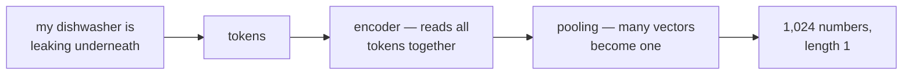

Somewhere in your RAG pipeline there is a box labeled **embed**, and
everything downstream trusts it blindly. It earns the trust in strange
ways: "my dishwasher is leaking underneath" retrieves the drain-hose
paragraph without sharing a single word with it — that looks like
magic. Then "the order was cancelled" and "the order was **not**
cancelled" land practically on top of each other — and that looks like
a production incident.

Both behaviors come from the same place. This article opens the box:
how a sentence becomes a point on a map of meaning, who drew the map,
what a similarity score actually measures, how the nearest points are
found in milliseconds among millions, which dials trade memory for
quality — and where the geometry goes blind.

**In this article**

- [1. From text to a point on a map](#1-from-text-to-a-point-on-a-map)
- [2. How the model learns where to place things](#2-how-the-model-learns-where-to-place-things)
- [3. Measuring closeness](#3-measuring-closeness)
- [4. Finding neighbors in milliseconds](#4-finding-neighbors-in-milliseconds)
- [5. The cost dials: dimensions and precision](#5-the-cost-dials-dimensions-and-precision)
- [6. Where the geometry goes blind](#6-where-the-geometry-goes-blind)
- [7. Choosing your setup, on one page](#7-choosing-your-setup-on-one-page)
  - [A concrete shortlist from Hugging Face](#a-concrete-shortlist-from-hugging-face)
  - [If you would rather call an API](#if-you-would-rather-call-an-api)
- [The whole story in six lines](#the-whole-story-in-six-lines)
- [Glossary](#glossary)
- [Going deeper](#going-deeper)

## 1. From text to a point on a map

Start with a system you already trust: color codes. A color is three
numbers — red is (255, 0, 0), a slightly warmer red is (250, 20, 10) —
and *close numbers mean similar colors*, so a paint shop can match your
sample without any human looking at it.

> **An embedding** = the same trick for meaning: a text becomes a list
> of numbers — its coordinates on a map — arranged so that close
> numbers mean similar meaning.

Color needs three numbers; meaning needs more. Typical models use
anywhere from 384 to 3,072 dimensions; this article's running examples
use **1,024**. [The LLM article](post.html?slug=how-llms-work) showed
the map for single words — *king*, *queen*, and the arrows between
them. Retrieval needs the next leap: one point for a whole *sentence*
or paragraph, so that a question and the passage answering it can be
neighbors.

That leap is made by an **encoder** — a small transformer that reads
the whole text with attention, so "leaking" is read in the light of
"dishwasher" and "underneath". It ends with two unglamorous steps:
**pooling** squeezes the per-token vectors into one (usually their
average), and **normalization** rescales that vector to length 1, so
every text in your corpus lives on the surface of the same sphere:



One sentence in, one point out. The interesting question is not the
mechanics — it is who decided *where* the points go.

## 2. How the model learns where to place things

Nobody labels the axes. The map is learned from pairs, by **contrastive
learning**:

> **Contrastive learning** = train on pairs that belong together
> (a question and the passage that answers it, duplicate questions,
> a sentence and its translation): pull each pair's points together,
> push everything else in the batch apart.

It is a wedding seating chart drawn by a stubborn planner: guests who
should talk end up at the same table, exes get opposite corners, and
after enough weddings the seating *is* the social map. Repeat at
industrial scale — the workhorse all-MiniLM-L6-v2 was trained this way
on **1.17 billion pairs** — and geometry becomes meaning: "leaking
underneath" ends up beside the drain-hose paragraph because millions
of casual questions were pulled toward the formal passages that
answered them.

Three practical consequences hide in that training recipe:

- **"Similar" means whatever the pairs said.** A model trained on
  question–answer pairs learns that a question and its answer are
  "similar" even though they look nothing alike. That is exactly the
  asymmetry retrieval needs — and it is a *learned* property, not a
  law of nature.
- **Many models expect a role tag.** Families like E5 train with
  `query:` and `passage:` prefixes so questions and documents get
  placed by different rules — the model card insists on them *"even
  for non-English texts"*. Each family has its own dialect
  (EmbeddingGemma wants `task: search result | query:`), and
  instruction-aware models like Qwen3-Embedding accept a free-form
  task description worth an extra 1–5% of quality. Drop the tag and
  nothing crashes — the placements are just quietly worse. Read your
  model's card.
- **The map is only detailed where the training data went.** A model
  raised on web Q&A has never seen your appliance-manual jargon. The
  MTEB leaderboard ranks models on public benchmarks; your corpus is
  not one of them. A hundred of your own question–passage pairs beat
  the leaderboard as a selection test.

The searcher this recipe produces is the **bi-encoder** — query and
document embedded separately, meeting only as points. Its accurate,
slow sibling, the **cross-encoder**, reads both texts together; [the
RAG article](post.html?slug=which-rag-pattern-do-you-need) uses it as
the judge that re-grades finalists.

## 3. Measuring closeness

Two points, one number. The standard choice is the angle:

> cos(a, b) = a · b ÷ (‖a‖ ‖b‖) — the **dot product** of the two
> vectors, divided by their lengths.

Direction carries the meaning; length is mostly a by-product of text
size and wording. Cosine ignores length by design, and normalization
(section 1) makes the lengths 1 anyway — so in practice **cosine and
dot product are the same number**, and even Euclidean distance ranks
neighbors identically (on unit vectors, d² = 2 − 2·cos). The metric
choice sounds important and rarely is; the *model* choice is what
moves quality.

Two dimensions are enough to see it. Put three texts on the map as
unit vectors — the leak question **a = (0.6, 0.8)**, the drain-hose
paragraph **b = (0.8, 0.6)**, a recipe page **c = (−0.8, 0.6)**:

<svg viewBox="0 0 480 320" role="img" aria-label="Three unit vectors drawn from one origin: the leak question a at coordinates 0.6, 0.8; the drain-hose paragraph b at 0.8, 0.6; a recipe page c at minus 0.8, 0.6. A small arc between a and b is labeled cosine 0.96; a wider arc between a and c is labeled cosine 0, ninety degrees" style="max-width:100%;height:auto;display:block;margin:var(--sp-5) auto;font-family:var(--font-sans)">
<defs>
<marker id="cos-arr" viewBox="0 0 10 10" refX="8" refY="5" markerWidth="7" markerHeight="7" orient="auto-start-reverse"><path d="M0 0 L10 5 L0 10 z" style="fill:var(--c-accent)"/></marker>
<marker id="cos-arr2" viewBox="0 0 10 10" refX="8" refY="5" markerWidth="7" markerHeight="7" orient="auto-start-reverse"><path d="M0 0 L10 5 L0 10 z" style="fill:var(--c-accent-2)"/></marker>
</defs>
<line x1="30" y1="260" x2="450" y2="260" style="stroke:var(--c-border);stroke-width:1.5"/>
<line x1="240" y1="300" x2="240" y2="40" style="stroke:var(--c-border);stroke-width:1.5"/>
<line x1="240" y1="260" x2="360" y2="100" marker-end="url(#cos-arr)" style="stroke:var(--c-accent);stroke-width:2.5"/>
<line x1="240" y1="260" x2="400" y2="140" marker-end="url(#cos-arr)" style="stroke:var(--c-accent);stroke-width:2.5"/>
<line x1="240" y1="260" x2="80" y2="140" marker-end="url(#cos-arr2)" style="stroke:var(--c-accent-2);stroke-width:2"/>
<path d="M 294 188 A 90 90 0 0 1 312 206" fill="none" style="stroke:var(--c-text-mute);stroke-width:1.5"/>
<path d="M 210 220 A 50 50 0 0 1 270 220" fill="none" style="stroke:var(--c-text-mute);stroke-width:1.5;stroke-dasharray:4 4"/>
<text x="330" y="192" text-anchor="start" style="fill:var(--c-text);font-size:13px">cos = 0.96</text>
<text x="240" y="196" text-anchor="middle" style="fill:var(--c-text-mute);font-size:12px">cos = 0 (90°)</text>
<text x="366" y="92" text-anchor="start" style="fill:var(--c-text);font-size:13px;font-style:italic">a — leak question (0.6, 0.8)</text>
<text x="406" y="136" text-anchor="start" style="fill:var(--c-text);font-size:13px;font-style:italic">b — drain-hose ¶ (0.8, 0.6)</text>
<text x="74" y="132" text-anchor="end" style="fill:var(--c-text);font-size:13px;font-style:italic">c — recipe page (−0.8, 0.6)</text>
</svg>

Check the picture with the formula, in the same order every time —
dot product, then lengths, then cosine:

> a · b = 0.6×0.8 + 0.8×0.6 = 0.48 + 0.48 = **0.96**
> ‖a‖ = ‖b‖ = √(0.36 + 0.64) = **1**
> cos(a, b) = 0.96 ÷ (1 × 1) = **0.96** — near neighbors
>
> a · c = 0.6×(−0.8) + 0.8×0.6 = −0.48 + 0.48 = **0**
> cos(a, c) = **0** — a right angle; nothing in common

Real embeddings play the same game across 1,024 dimensions instead of
two. One warning before you use the number: **a cosine of 0.83 means
nothing on its own.** Scores are only comparable within one model on
one corpus — model A's 0.83 can be a worse match than model B's 0.60,
so thresholds never survive a model swap. Rank with the scores; don't
worship them.

## 4. Finding neighbors in milliseconds

Now do it at scale. A million chunks at 1,024 float32 dimensions is
1,000,000 × 1,024 × 4 bytes ≈ **4.1 GB**, and answering one query
honestly means a million dot products — about a billion
multiply-adds, a few hundred milliseconds on one CPU core. Fine for
ten thousand vectors; a disaster at ten million with real traffic.

Vector databases escape by giving up a little correctness:

> **ANN (approximate nearest neighbor) search** = find *almost
> certainly* the nearest points at a fraction of the cost, measured by
> **recall** — the share of the true top-10 the index actually
> returned. Production setups usually tune for 95–99%.

The workhorse is **HNSW** (hierarchical navigable small world), and it
navigates the way you cross a country: motorway first, then avenues,
then streets. The index keeps a few layers of the same points — a
sparse top layer with long-range links, denser layers below, every
vector on the bottom. A search enters at the top, greedily hops to
whichever neighbor is closest to the query, and drops down a layer
each time it can't improve:

<svg viewBox="0 0 480 320" role="img" aria-label="Three stacked HNSW layers. The sparse top layer, labeled motorways, has three nodes; the middle layer, labeled avenues, has six; the bottom layer, labeled streets with every vector, has twelve. A highlighted path enters at the top left, hops right, descends through the middle layer, and ends at the target point on the bottom right" style="max-width:100%;height:auto;display:block;margin:var(--sp-5) auto;font-family:var(--font-sans)">
<defs>
<marker id="hnsw-arr" viewBox="0 0 10 10" refX="8" refY="5" markerWidth="7" markerHeight="7" orient="auto-start-reverse"><path d="M0 0 L10 5 L0 10 z" style="fill:var(--c-accent)"/></marker>
</defs>
<g style="stroke:var(--c-border);stroke-width:1.2">
<line x1="90" y1="60" x2="250" y2="60"/><line x1="250" y1="60" x2="390" y2="60"/>
<line x1="70" y1="150" x2="150" y2="150"/><line x1="150" y1="150" x2="230" y2="150"/><line x1="230" y1="150" x2="310" y2="150"/><line x1="310" y1="150" x2="390" y2="150"/>
<line x1="50" y1="240" x2="430" y2="240"/>
</g>
<g style="fill:var(--c-text-mute)">
<circle cx="90" cy="60" r="5"/><circle cx="250" cy="60" r="5"/><circle cx="390" cy="60" r="5"/>
<circle cx="70" cy="150" r="5"/><circle cx="150" cy="150" r="5"/><circle cx="230" cy="150" r="5"/><circle cx="310" cy="150" r="5"/><circle cx="390" cy="150" r="5"/>
<circle cx="50" cy="240" r="4"/><circle cx="85" cy="240" r="4"/><circle cx="120" cy="240" r="4"/><circle cx="155" cy="240" r="4"/><circle cx="190" cy="240" r="4"/><circle cx="225" cy="240" r="4"/><circle cx="260" cy="240" r="4"/><circle cx="295" cy="240" r="4"/><circle cx="330" cy="240" r="4"/><circle cx="365" cy="240" r="4"/><circle cx="400" cy="240" r="4"/><circle cx="430" cy="240" r="4"/>
</g>
<line x1="90" y1="60" x2="244" y2="60" marker-end="url(#hnsw-arr)" style="stroke:var(--c-accent);stroke-width:2.5"/>
<line x1="250" y1="66" x2="310" y2="144" marker-end="url(#hnsw-arr)" style="stroke:var(--c-accent);stroke-width:2.5;stroke-dasharray:6 5"/>
<line x1="310" y1="150" x2="384" y2="150" marker-end="url(#hnsw-arr)" style="stroke:var(--c-accent);stroke-width:2.5"/>
<line x1="390" y1="156" x2="398" y2="234" marker-end="url(#hnsw-arr)" style="stroke:var(--c-accent);stroke-width:2.5;stroke-dasharray:6 5"/>
<circle cx="90" cy="60" r="5" style="fill:var(--c-accent)"/>
<circle cx="400" cy="240" r="6.5" style="fill:var(--c-accent-2)"/>
<text x="90" y="42" text-anchor="middle" style="fill:var(--c-text);font-size:12px">enter here</text>
<text x="400" y="266" text-anchor="middle" style="fill:var(--c-text);font-size:12px">nearest neighbor</text>
<text x="452" y="64" text-anchor="end" style="fill:var(--c-text-mute);font-size:12px">motorways</text>
<text x="452" y="130" text-anchor="end" style="fill:var(--c-text-mute);font-size:12px">avenues</text>
<text x="452" y="296" text-anchor="end" style="fill:var(--c-text-mute);font-size:12px">streets — every vector</text>
</svg>

Instead of a million comparisons, the search touches a few thousand —
around a millisecond. One dial, usually named **efSearch**, sets how
many candidates each hop keeps: raise it and recall climbs while speed
falls. (The main alternative, **IVF**, clusters the map first and
searches only the few clusters nearest the query.)

**The price:** the graph lives in RAM next to the vectors, building it
takes real time, and deletes and updates are awkward — an index is a
house, not a whiteboard.

## 5. The cost dials: dimensions and precision

The 4.1 GB above was the polite scenario. Two dials shrink it, and
both work for the same reason: the map survives a thicker pen —
streets stay findable after the house numbers blur.

The first dial is **precision** — store each of the 1,024 numbers in
fewer bits, called **quantization**:

| precision, 1,024 dims | per vector | 1M vectors | vs float32 |
|---|---|---|---|
| float32 | 4,096 B | 4.1 GB | 1× |
| float16 | 2,048 B | 2.0 GB | 2× smaller |
| int8 | 1,024 B | 1.0 GB | 4× smaller |
| binary (1 bit/dim) | 128 B | 128 MB | **32× smaller** |

The standard play is coarse-then-fine: run the big search on int8 or
binary vectors, then re-score the top ~100 with full-precision vectors
(or hand them to a cross-encoder). And this is measured, not folklore:
in the sentence-transformers experiments behind Hugging Face's
embedding-quantization write-up, int8 plus a rescoring pass kept
**~99%** of retrieval quality at a 3.7× speedup, and binary kept
**~96%** at a 24.8× speedup and 1/32 of the memory.

The second dial is **dimensions**. **Matryoshka embeddings** are
trained so the information is front-loaded like the nesting doll: the
first coordinates carry the coarsest meaning, later ones refine it —
so truncating 1,024 to 256 keeps most of the quality at a quarter of
the cost, from the same model, no retraining. In Hugging Face's
experiment, a Matryoshka-trained model kept **98.4%** of its
performance on just **8.3%** of the dimensions, where a standard model
fell further. Production models ship with the dial built in:
EmbeddingGemma serves 768 dimensions truncatable to 512, 256, or 128;
Qwen3-Embedding goes from 1,024 down to 32.

Both dials now ship behind the big APIs too. OpenAI's
text-embedding-3-large defaults to 3,072 dimensions but takes a
`dimensions` argument, and the front-loading is real: shortened to
just 256, it still outperforms its previous-generation sibling
ada-002 using all 1,536 of its dimensions. Voyage's API turns the
*other* dial — an `output_dtype` parameter returns int8 or binary
vectors directly, no post-processing. Two boundaries are worth
respecting on the dimension dial: below roughly 256 dimensions
retrieval quality falls off noticeably for most corpora, and the
climb to 3,072 buys marginal gains at four times the storage —
which is what keeps 512–1,024 the comfortable middle ground.

The rule behind both dials: **quality lives in the model, not in the
storage format.** A strong model quantized to int8 beats a weak model
in full float32 — spend on the model, save on the bytes.

## 6. Where the geometry goes blind

Everything so far explains the magic. The same design explains the
incidents — four of them, each pointing at a treatment from [the RAG
article](post.html?slug=which-rag-pattern-do-you-need):

- **Negation.** "The order was cancelled" and "the order was **not**
  cancelled" share almost every word and every topic, so their points
  nearly coincide — contrastive training rewarded topic-matching, and
  polarity barely moves the needle. Never delegate yes-versus-no to
  the map; a cross-encoder reranker reads closely enough to catch it.
- **Rare literal tokens.** "Error E24" embeds as *appliance trouble in
  general*; the code itself is too rare to own a direction, so the
  overview chapter outranks the E24 entry. That is dense search's
  literal blindness — the reason hybrid retrieval keeps a lexical
  searcher like BM25 in the race.
- **Versions, dates, audiences.** The 2021 manual and the 2024 manual
  say nearly the same words, so they sit side by side — and similarity
  happily serves the wrong year. Validity is not on the map; metadata
  filtering checks it before the search runs.
- **Long text.** Embed a 1,024-token, ten-topic section into one point
  and you get the average of ten meanings — a blur near nothing in
  particular. That dilution is why chunking exists, and why patterns
  like small-to-big search with a small unit and read with a big one.

The second failure deserves its own vocabulary, because it splits
retrieval into two schools:

> **Dense vs sparse** = a dense embedding fills all 1,024 of its
> dimensions with learned values — pure meaning, no exact words. A
> sparse vector (BM25, TF-IDF) keeps one slot per vocabulary word,
> almost all of them zero — exact words, no meaning.

Everything in this article is the dense school. The sparse school
never confuses E24 with E25 — and never notices that "leaking" and
"dripping" are the same complaint. Each one is blind precisely where
the other sees, which is why hybrid retrieval runs both and lets a
judge merge the lists.

None of these are bugs to be patched out. The map encodes exactly what
contrastive training rewarded — topical similarity — and nothing else.
The patterns of the RAG article are not workarounds for a broken tool;
they are the missing senses, bolted on deliberately.

## 7. Choosing your setup, on one page

Defaults that survive contact with production, in order:

1. **Pick the model with your own data.** Collect ~100 real
   question–passage pairs from your domain and measure hit rate;
   treat the MTEB leaderboard as a shortlist, not a verdict.
2. **Follow the model card's prefixes** (`query:` / `passage:` or the
   instruction format) — the cheapest quality you will ever buy.
3. **Normalize and use cosine.** The metric debate is a distraction;
   settle it once.
4. **Start at 768–1,024 dimensions.** Go higher only when your own
   measurements say so; go lower via Matryoshka when cost says so.
5. **Use HNSW defaults** until you pass roughly a million vectors or
   latency complains; then tune efSearch against measured recall.
6. **Quantize when RAM becomes the bill** — int8 first, binary plus
   full-precision re-scoring at serious scale.

### A concrete shortlist from Hugging Face

Names to start the bake-off from — a shortlist, not a verdict; the
verdict comes from your own hundred pairs:

| model | params | dims | context | the point |
|---|---|---|---|---|
| all-MiniLM-L6-v2 | 22.7M | 384 | 256 | the English-only speed classic; trained on 1.17B pairs; ideal for prototypes |
| EmbeddingGemma | 308M | 768 → 128 | 2,048 | 100+ languages on-device; under 200 MB of RAM quantized |
| multilingual-e5-large | ~560M | 1,024 | 512 | 94 languages, Turkish included; `query:` / `passage:` mandatory |
| BGE-M3 | ~570M | 1,024 | 8,192 | dense + sparse + multi-vector from one model; no prefixes needed |
| Qwen3-Embedding-0.6B | 0.6B | 1,024 → 32 | 32,768 | instruction-aware, Apache 2.0; its 8B sibling leads the open MTEB multilingual board |

And the whole article, as five lines of sentence-transformers:

```python
from sentence_transformers import SentenceTransformer

model = SentenceTransformer("intfloat/multilingual-e5-large")
docs = model.encode([f"passage: {p}" for p in passages], normalize_embeddings=True)
query = model.encode("query: my dishwasher is leaking underneath", normalize_embeddings=True)
scores = query @ docs.T  # normalized, so this dot product is the cosine
```

Every argument is a section of this article: the model name is
section 2's training data decision, the prefixes come from the model
card, and `normalize_embeddings=True` is what makes the last line's
dot product a cosine.

### If you would rather call an API

The same rules apply; only the names change. **OpenAI**'s
text-embedding-3-small (1,536 dims) and text-embedding-3-large
(3,072 dims — 64.6% on MTEB against ada-002's 61.0%) expose the
Matryoshka dial as the `dimensions` request parameter and return
vectors already normalized to length 1, so everything in section 3
carries over unchanged. The generation gap is widest away from
English: on the multilingual MIRACL benchmark the move from ada-002
to 3-large jumps from 31.4% to 54.9% — worth knowing when your
corpus is Turkish. **Voyage AI** — the provider Anthropic's own
docs point to, since Anthropic ships no embedding model of its own —
serves the voyage-4 family with a 32,000-token context and 1,024
default dimensions truncatable down to 256, int8 and binary output
built into the API, and domain-tuned editions for law, code, and
finance. Even section 2's role tags survive the trip: Voyage's
`input_type="query"` / `"document"` parameter quietly prepends the
same kind of prefix that E5 makes you type by hand. And the verdict
rule is untouched — a hundred of your own question–passage pairs
pick the winner, not the vendor's benchmark table.

And when the misses are negations, codes, versions, or long blurry
chunks — that is not a tuning problem. Go to the [RAG decision
guide](post.html?slug=which-rag-pattern-do-you-need) and pick the
pattern that restores the missing sense.

## The whole story in six lines

1. An embedding is a point on a learned map of meaning — close points,
   similar meaning, exactly like close RGB codes are similar colors.
2. Contrastive training drew the map: pairs that belong together were
   pulled together, everything else pushed apart — so "similar" means
   what the training pairs said, nothing more.
3. Closeness is the cosine — on normalized vectors just a dot
   product — and scores only mean something *within* one model.
4. At scale, HNSW answers in about a millisecond by navigating
   motorway → avenue → street instead of checking every point.
5. Memory has two dials, precision and dimensions; quality lives in
   the model, so quantize the bytes and keep the model strong.
6. The map is blind to negation, rare codes, versions, and long
   blurred texts — the RAG patterns are the bolted-on senses.

Back to the two sentences from the opening: the leak question found
its paragraph because a million training pairs taught the map that
questions belong beside their answers — and the cancelled order
matched its own negation because nothing ever taught the map to care.
Same box, same geometry; now you know which half to trust.

## Glossary

The base vocabulary of the article, one line each:

- **embedding** — a list of numbers placing a text's meaning as a point on a map; close points, similar meaning.
- **encoder** — the transformer that reads a text and produces its embedding.
- **pooling** — squeezing the encoder's per-token vectors into one vector for the whole text.
- **normalization** — rescaling a vector to length 1 so only its direction carries information.
- **dot product** — multiply matching coordinates, add them up; on normalized vectors, this *is* the cosine.
- **cosine similarity** — closeness as the angle between two vectors: 1 same direction, 0 unrelated.
- **contrastive learning** — training that pulls matching pairs together and pushes non-matches apart.
- **bi-encoder / cross-encoder** — embeds query and document separately (fast, scales) / reads them together (accurate, slow).
- **dense / sparse vectors** — every dimension carries a learned value (meaning, no exact words) / one slot per vocabulary word, mostly zeros (exact words, no meaning).
- **ANN** — approximate nearest neighbor search: almost certainly the closest points, at a fraction of the cost.
- **recall** — the share of the true nearest neighbors the index actually returned.
- **HNSW** — the layered-graph ANN index searched motorway-to-street; the industry default.
- **efSearch** — HNSW's main dial: candidates kept per hop; more recall, less speed.
- **IVF** — the clustering alternative: partition the map, search only the nearest clusters.
- **quantization** — storing each coordinate in fewer bits (float32 → int8 → binary) to shrink memory.
- **Matryoshka embeddings** — embeddings trained front-loaded, so truncating dimensions degrades gracefully.
- **MTEB** — the public embedding benchmark suite; a shortlist-maker, not a substitute for your own test set.

## Going deeper

- Mikolov et al., [Efficient Estimation of Word Representations in Vector Space](https://arxiv.org/abs/1301.3781) (2013) — word2vec; where king − man + woman = queen entered the culture.
- Reimers & Gurevych, [Sentence-BERT: Sentence Embeddings using Siamese BERT-Networks](https://arxiv.org/abs/1908.10084) (2019) — the modern sentence-embedding recipe.
- Wang et al., [Text Embeddings by Weakly-Supervised Contrastive Pre-training](https://arxiv.org/abs/2212.03533) (2022) — E5 and the `query:` / `passage:` prefixes.
- Malkov & Yashunin, [Efficient and robust approximate nearest neighbor search using Hierarchical Navigable Small World graphs](https://arxiv.org/abs/1603.09320) (2016) — the HNSW paper.
- Kusupati et al., [Matryoshka Representation Learning](https://arxiv.org/abs/2205.13147) (2022).
- Muennighoff et al., [MTEB: Massive Text Embedding Benchmark](https://arxiv.org/abs/2210.07316) (2022) — the live [leaderboard](https://huggingface.co/spaces/mteb/leaderboard) lives on Hugging Face.
- The Hugging Face blog, [Binary and Scalar Embedding Quantization](https://huggingface.co/blog/embedding-quantization) — the ~99% / ~96% retention numbers, with code.
- The Hugging Face blog, [Introduction to Matryoshka Embeddings](https://huggingface.co/blog/matryoshka) — the 98.4%-at-8.3%-of-dimensions experiment.
- The Hugging Face blog, [Welcome EmbeddingGemma](https://huggingface.co/blog/embeddinggemma) — an on-device multilingual embedder, with its prompt dialect.
- OpenAI, [Embeddings guide](https://developers.openai.com/api/docs/guides/embeddings) — the `dimensions` parameter, the model comparison, and the shortened-3-large-beats-full-ada claim.
- Anthropic, [Embeddings](https://platform.claude.com/docs/en/build-with-claude/embeddings) — why they point to Voyage AI, with worked `input_type` and quantization examples.
- Inkeep, [Embeddings](https://inkeep.com/glossary/embeddings) — a practitioner's glossary view: dimension ranges and cost trade-offs in production semantic search.
- [sentence-transformers](https://sbert.net) — the library behind this article's code snippet and most of the models above.
- On this blog: [how LLMs work](post.html?slug=how-llms-work) — the token-level map this article zooms out from — and [which RAG pattern do you need](post.html?slug=which-rag-pattern-do-you-need) — what to do when the geometry goes blind.
