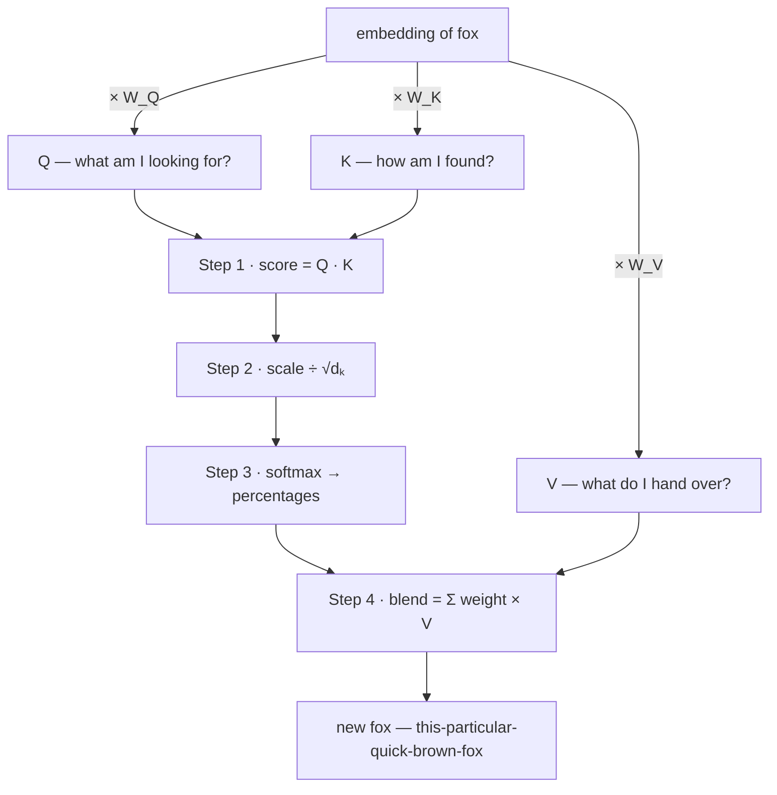
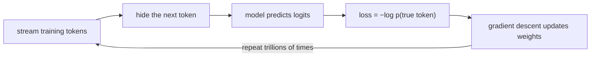
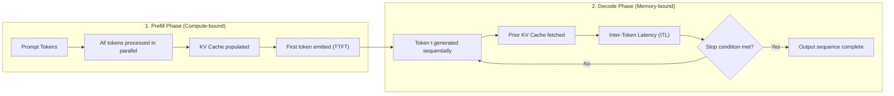

Before you finish this sentence, your mind has already started guessing
the next ___. See? "Once upon a ___." You could not stop it: the blank
filled itself, without asking your permission.

That reflex has a name — next-token prediction — and this article makes
one claim: every sentence a language model has ever written to you, every
essay, every code snippet, every apology for a mistake it just made, is
that same reflex scaled up by a factor of billions. Your phone keyboard
plays the pocket version when it offers *tomorrow* after "see you". How
does a game this simple pass exams and write software? Because its demand
is merciless: to predict the next word of human text *well*, you must
absorb grammar, facts, style, and a working imitation of reasoning.
Everything below is a footnote to that idea.

**In this article**

- [1. Text becomes numbers](#1-text-becomes-numbers)
- [2. Numbers with meaning](#2-numbers-with-meaning)
- [3. The transformer: a context machine](#3-the-transformer-a-context-machine)
  - [Q, K, V — the mechanism, with numbers](#q-k-v-the-mechanism-with-numbers)
  - [One direction only and the causal mask](#one-direction-only-and-the-causal-mask)
  - [Many heads](#many-heads)
  - [Model families: Why is everything decoder-only?](#model-families-why-is-everything-decoder-only)
- [4. Layers: where knowledge lives](#4-layers-where-knowledge-lives)
- [5. Training and scale](#5-training-and-scale)
- [6. From autocomplete to assistant](#6-from-autocomplete-to-assistant)
- [7. Inference and generation: a two-phase loop](#7-inference-and-generation-a-two-phase-loop)
  - [Prefill: parallel computation and TTFT](#prefill-parallel-computation-and-ttft)
  - [Decode: sequential loop and ITL](#decode-sequential-loop-and-itl)
  - [The true size of the KV cache and the memory wall](#the-true-size-of-the-kv-cache-and-the-memory-wall)
  - [Collocating prefill and decode: disaggregation](#collocating-prefill-and-decode-disaggregation)
  - [The three dials of sampling: temperature, top-k, top-p](#the-three-dials-of-sampling-temperature-top-k-top-p)
- [8. It does not remember you: the context window](#8-it-does-not-remember-you-the-context-window)
- [9. Why it makes things up](#9-why-it-makes-things-up)
- [10. Beyond autoregression: Diffusion LLMs (dLLMs)](#10-beyond-autoregression-diffusion-llms-dllms)
- [The whole story in six lines](#the-whole-story-in-six-lines)
- [Going deeper](#going-deeper)

---

## 1. Text becomes numbers

A neural network operates strictly on matrix arithmetic; it cannot
directly process characters or strings. Before any text reaches the
network, it must pass through **tokenization**. A **token** is the
smallest atomic unit of language an LLM uses to compute: depending on the
tokenizer, it may be a whole word, a subword, or a single character.

Each LLM relies on a fixed **vocabulary** established before training.
Every token in this vocabulary maps to a unique integer, known as its
**token ID**. During tokenization, raw text is converted into a sequence
of these IDs. For example, using a modern tokenizer on the sentence
`The quick brown fox jumps over the lazy dog.` yields the following
breakdown:

- **Tokens:** `"The"`, `" quick"`, `" brown"`, `" fox"`, `" jumps"`, `" over"`, `" the"`, `" lazy"`, `" dog"`, `"."`
- **Token IDs:** `[976, 4853, 19705, 68347, 65613, 1072, 290, 29082, 6446, 13]`

The standard algorithm performing this segmentation is **Byte-Pair
Encoding (BPE)**. Think of LEGO bricks: language is snapped apart into its
most reusable components. Frequent words remain intact as single tokens,
while rare words are assembled from subword fragments. A useful rule of
thumb: 100 tokens correspond to approximately 75 English words.

Because the model sees only these integer IDs and never raw letters,
counting the r's in "strawberry" was famously challenging. What seemed
like a failure of reasoning was simply a structural blind spot: by the
time the word reached the first layer, it was already three integer IDs
(`str`, `aw`, `berry`), and the individual letters were invisible. For an
in-depth analysis of BPE merge trees and vocabulary trade-offs, see
[How tokenization works](post.html?slug=how-tokenization-works).

## 2. Numbers with meaning

Raw integers cannot be multiplied meaningfully; there is no inherent
geometric connection between ID `4853` and ID `68347`. Therefore, at the
very first layer of the model, each token ID is transformed into an
**embedding** vector by reading a row from a weight table.

During input ingestion, this lookup requires zero arithmetic operations
(zero FLOPs); it is a straightforward row gather from memory into cache.
As detailed in [Inside the embedding layer](post.html?slug=inside-the-embedding-layer),
this mechanism maps discrete token indices into a continuous,
high-dimensional geometric space.

Think of this space as thousands of dials: one capturing formality, one
tense, and most capturing abstract features no human has ever named. On
this map, words with related meanings cluster together: *king* sits close
to *queen* and far from *spreadsheet*. Crucially, **directions** in this
space encode semantic relationships. We can illustrate this on a toy
two-dial coordinate system using four words: ***man* at (2, 1)**, ***woman*
at (5, 4)**, ***king* at (3, 6)**, and ***queen* at (6, 9)**:

<svg viewBox="0 0 480 320" role="img" aria-label="Four words as points on two dials: man at 2,1; woman at 5,4; king at 3,6; queen at 6,9. Solid parallel arrows man to woman and king to queen show the gender direction plus 3 plus 3; dashed parallel arrows man to king and woman to queen show the royalty direction plus 1 plus 5" style="max-width:100%;height:auto;display:block;margin:var(--sp-5) auto;font-family:var(--font-sans)">
<defs>
<marker id="emb-arr" viewBox="0 0 10 10" refX="8" refY="5" markerWidth="7" markerHeight="7" orient="auto-start-reverse"><path d="M0 0 L10 5 L0 10 z" style="fill:var(--c-accent)"/></marker>
<marker id="emb-arr2" viewBox="0 0 10 10" refX="8" refY="5" markerWidth="7" markerHeight="7" orient="auto-start-reverse"><path d="M0 0 L10 5 L0 10 z" style="fill:var(--c-accent-2)"/></marker>
</defs>
<line x1="40" y1="280" x2="460" y2="280" style="stroke:var(--c-border);stroke-width:1.5"/>
<line x1="40" y1="280" x2="40" y2="20" style="stroke:var(--c-border);stroke-width:1.5"/>
<g style="stroke:var(--c-border);stroke-width:1">
<line x1="120" y1="280" x2="120" y2="285"/><line x1="200" y1="280" x2="200" y2="285"/><line x1="280" y1="280" x2="280" y2="285"/><line x1="360" y1="280" x2="360" y2="285"/><line x1="440" y1="280" x2="440" y2="285"/>
<line x1="35" y1="228" x2="40" y2="228"/><line x1="35" y1="176" x2="40" y2="176"/><line x1="35" y1="124" x2="40" y2="124"/><line x1="35" y1="72" x2="40" y2="72"/><line x1="35" y1="20" x2="40" y2="20"/>
</g>
<g style="fill:var(--c-text-mute);font-size:11px" text-anchor="middle">
<text x="120" y="297">2</text><text x="200" y="297">4</text><text x="280" y="297">6</text><text x="360" y="297">8</text><text x="440" y="297">10</text>
</g>
<g style="fill:var(--c-text-mute);font-size:11px" text-anchor="end">
<text x="30" y="232">2</text><text x="30" y="180">4</text><text x="30" y="128">6</text><text x="30" y="76">8</text><text x="30" y="24">10</text>
</g>
<text x="455" y="311" text-anchor="end" style="fill:var(--c-text-mute);font-size:12px">dial 1</text>
<text x="18" y="150" transform="rotate(-90 18 150)" text-anchor="middle" style="fill:var(--c-text-mute);font-size:12px">dial 2</text>
<line x1="120" y1="254" x2="160" y2="124" marker-end="url(#emb-arr2)" style="stroke:var(--c-accent-2);stroke-width:1.8;stroke-dasharray:6 5"/>
<line x1="240" y1="176" x2="280" y2="46" marker-end="url(#emb-arr2)" style="stroke:var(--c-accent-2);stroke-width:1.8;stroke-dasharray:6 5"/>
<line x1="120" y1="254" x2="240" y2="176" marker-end="url(#emb-arr)" style="stroke:var(--c-accent);stroke-width:2"/>
<line x1="160" y1="124" x2="280" y2="46" marker-end="url(#emb-arr)" style="stroke:var(--c-accent);stroke-width:2"/>
<circle cx="120" cy="254" r="4.5" style="fill:var(--c-text)"/>
<circle cx="240" cy="176" r="4.5" style="fill:var(--c-text)"/>
<circle cx="160" cy="124" r="4.5" style="fill:var(--c-text)"/>
<circle cx="280" cy="46" r="4.5" style="fill:var(--c-text)"/>
<text x="120" y="272" text-anchor="middle" style="fill:var(--c-text);font-size:13px;font-style:italic">man (2, 1)</text>
<text x="252" y="182" text-anchor="start" style="fill:var(--c-text);font-size:13px;font-style:italic">woman (5, 4)</text>
<text x="148" y="118" text-anchor="end" style="fill:var(--c-text);font-size:13px;font-style:italic">king (3, 6)</text>
<text x="280" y="32" text-anchor="middle" style="fill:var(--c-text);font-size:13px;font-style:italic">queen (6, 9)</text>
<line x1="300" y1="116" x2="318" y2="116" style="stroke:var(--c-accent);stroke-width:2"/>
<text x="324" y="120" text-anchor="start" style="fill:var(--c-text-mute);font-size:12px">gender direction (+3, +3)</text>
<line x1="300" y1="226" x2="318" y2="226" style="stroke:var(--c-accent-2);stroke-width:1.8;stroke-dasharray:6 5"/>
<text x="324" y="230" text-anchor="start" style="fill:var(--c-text-mute);font-size:12px">royalty direction (+1, +5)</text>
</svg>

Vector arithmetic emerges naturally from this geometry:

> woman − man = (5, 4) − (2, 1) = **(+3, +3)** — the *gender* direction  
> queen − king = (6, 9) − (3, 6) = **(+3, +3)** — the same arrow, higher up  
> king − man = queen − woman = **(+1, +5)** — the *royalty* direction, repeated  

Combining the vectors produces the classic algebraic identity:

> king − man + woman = (3, 6) − (2, 1) + (5, 4) = **(6, 9) = queen**

Real embedding spaces construct this semantic geometry across thousands of
dimensions (for vector databases and cosine similarity mechanics, see
[How embeddings work](post.html?slug=how-embeddings-work)).

However, standard transformer architectures have an inherent limitation:
they are permutation invariant, treating inputs as an unordered set of
vectors. To distinguish "dog bites man" from "man bites dog", the network
requires **positional encoding**. While older architectures (like GPT-2)
added learned absolute position vectors to token embeddings, modern models
(such as Llama 3 and Gemma 3) employ **RoPE (Rotary Position Embedding)**,
which injects relative distance directly into the attention dot product by
rotating query and key vectors in the complex plane.

## 3. The transformer: a context machine

An embedding alone cannot determine what "bank" means — a financial
institution, a river edge, or tilting an aircraft? Meaning is determined by
context, and the **transformer** — the T in GPT — is engineered to resolve
that context.

At a high level, every modern LLM architecture consists of three core
stages:
1. **Input representation:** Token IDs mapped to embedding vectors and
   augmented with positional encodings (such as RoPE).
2. **Transformer layer stack:** A deep cascade of layers combining
   multi-head self-attention (mixing information across tokens) and
   feed-forward networks (transforming each token independently).
3. **Output projection head (`lm_head`):** Final hidden states mapped to
   vocabulary logits to compute the next-token probability distribution.

Older sequential architectures (such as RNNs and LSTMs) processed text
linearly, forcing context through a bottleneck that deteriorated over
long distances. The 2017 paper *Attention Is All You Need* replaced recurrence
with a single core principle: **attention**. Every token looks directly at
every other token simultaneously and determines how much importance to
assign to each.

Consider the classic example:

> The animal didn't cross the street because **it** was too *tired*.  
> The animal didn't cross the street because **it** was too *wide*.

A single adjective changes, and "it" switches referents: in the first, it
refers to the animal; in the second, to the street. Attention is how the
model resolves this ambiguity: **a token's updated representation is a
weighted blend of all other tokens, and attention's entire job is to compute
those weights.**

### Q, K, V — the mechanism, with numbers

Within each attention layer, three learned weight matrices ($W_Q, W_K,
W_V$) project each token's embedding into three distinct vectors:

- **Query (Q):** "What kind of information am I looking to collect?"
- **Key (K):** "What kind of information do I advertise to others?"
- **Value (V):** "If attended to, what substantive content do I deliver?"

Think of a video search engine: the search query you type is Q, the video
titles and tags are K, and the actual video stream is V. Raw embeddings
cannot serve this role directly because search requires isolating specific
features rather than matching on every attribute at once.

The calculation proceeds in four explicit steps:

**Step 1 — Score:** The target token's query is paired with every token's
key via dot product: $\text{score}_i = Q \cdot K_i$.  
**Step 2 — Scale:** Each score is divided by $\sqrt{d_k}$, the square root
of the key vector dimension. This prevents large dot products in high
dimensions from pushing the softmax function into regions with vanishingly
small gradients: $\text{scaled}_i = \text{score}_i \div \sqrt{d_k}$.  
**Step 3 — Softmax:** The scaled scores pass through a softmax function,
normalizing them into attention weights that sum to 1.  
**Step 4 — Blend:** The value vectors are weighted by these probabilities
and summed together.

> [!IMPORTANT]
> **Value (V) vectors play zero role in the scoring step.**
> Attention scores depend strictly on the alignment between Query (Q) and
> Key (K). The Value vector represents only the cargo transported once the
> attention distribution has been determined.

Tracking this computation for *fox* in "The quick brown fox":

| Pair | Score | e^Score | Attention Weight |
|---|---|---|---|
| Q(fox) · K(quick) | 2.1 | 8.2 | **3%** |
| Q(fox) · K(brown) | 4.0 | 54.6 | **19%** |
| Q(fox) · K(fox) | 5.4 | 221.4 | **78%** |

Due to exponential scaling in softmax, a score of 5.4 yields 78% weight,
four times larger than the 19% allocated to 4.0. The resulting vector is:

$$\text{fox}_{\text{new}} = 0.03 \cdot V(\text{quick}) + 0.19 \cdot V(\text{brown}) + 0.78 \cdot V(\text{fox})$$

It is no longer an isolated dictionary definition; it is now
*this-particular-quick-brown-fox*. The unified mathematical expression is:

$$\text{Attention}(Q, K, V) = \text{softmax}\left(\frac{QK^\top}{\sqrt{d_k}}\right)V$$

### One direction only and the causal mask

Self-attention is mathematically capable of attending across the entire
sequence at once. However, in an autoregressive language model, generating
the next token requires that **tokens cannot see future positions**. If a
token could attend forward during training, it would simply copy the target
word, bypassing the need to learn representations.

To prevent this leakage, decoder-only models enforce a **causal mask**
(also known as a look-ahead mask). For any position $t$, attention scores
corresponding to future positions ($> t$) are set to negative infinity
($-\infty$) before softmax:

$$e^{-\infty} = 0$$

This zeros out future attention weights, ensuring information flows
strictly from earlier tokens to later ones. Causal masking is critical
during training and the initial prompt ingestion (prefill) phase, where all
tokens are processed concurrently in parallel. During single-token decoding,
the causal constraint holds naturally because future tokens do not yet exist
in memory. Masks are also used to ignore padding tokens in batched sequences.

### Many heads

A single set of attention projections per layer would be restrictive; a
token must simultaneously resolve grammatical syntax, semantic association,
and long-range pronominal reference.

To accommodate this, each layer runs multiple **attention heads** in
parallel (Multi-Head Attention). The hidden dimension is split across
heads; for instance, a 4096-dimensional representation divided among 32
heads gives each head a 128-dimensional subspace to specialize in. One head
tracks syntactic subjects, another tense agreements, and another modifier
phrases.

### Model families: Why is everything decoder-only?

The transformer architecture originally branched into three structural
paradigms:

| Architecture | Representative Models | Prefill & Decode Phases | Primary Application |
|---|---|---|---|
| **Encoder-only** | BERT, RoBERTa | None. Single bidirectional forward pass; no generation. | Classification, search retrieval, embeddings |
| **Encoder-decoder** | T5, FLAN-T5, BART | Partial. Bidirectional encoder plus autoregressive decoder. | Classical translation, summarization |
| **Decoder-only** | GPT, Llama, Qwen, DeepSeek, Claude | Yes. Causal parallel prefill followed by autoregressive decode. | The standard for modern generative AI |

Virtually all frontier generative models today are **decoder-only**, driven
by three practical engineering advantages:
1. **Unified training objective:** Pre-training on next-token prediction
   naturally subsumes code completion, dialogue, and chain-of-thought
   reasoning without separate encoder-decoder pipelines.
2. **Frictionless KV caching:** Keys and values computed during prompt
   ingestion are reused seamlessly across all subsequent decode iterations.
3. **Hardware efficiency:** At massive scale, decoder-only architectures
   achieve superior compute density and predictable scaling curves on modern
   accelerator clusters.

## 4. Layers: where knowledge lives

One multi-head attention module and one feed-forward network (FFN) together
form a single **transformer layer**. Frontier models stack dozens or even
hundreds of these layers (32, 80, or 120+ floors):

- **Self-Attention (The Librarian):** Gathers context across tokens and
  mixes representations.
- **Feed-Forward Network / FFN (The Warehouse):** Transforms each token
  independently, acting as the primary repository of learned factual
  associations.
- **Residual Connections:** Adds each sub-layer's output directly back to
  its input ($x + \text{Layer}(x)$), preventing gradients from vanishing
  across deep networks.
- **Normalization (RMSNorm / LayerNorm):** Stabilizes activation scales
  between layers.

Roughly two-thirds of a model's total parameter count resides inside these
**feed-forward networks**. In **Mixture of Experts (MoE)** models (such as
Mixtral and DeepSeek), the dense FFN is replaced by multiple specialized
expert networks, with a routing mechanism activating only the top 1 or 2
experts per token.

At the top of the stack sits the **output projection head (`lm_head`)**. The
final hidden state of the last token is multiplied against the vocabulary
matrix, generating raw, unnormalized prediction scores known as **logits**:

$$\text{score}(\text{candidate}) = \text{final\_hidden\_state} \cdot W_{\text{lm\_head}}(\text{candidate})$$

In many architectures, `lm_head` shares weights directly with the input
`embed_tokens` matrix (weight tying).

## 5. Training and scale

Every weight in the model begins as pseudo-random noise. The process that
organizes these weights is **pre-training**: the model is fed trillions of
tokens of text, the next token is hidden, and the network is tasked with
predicting it. The training signal is self-supervised; the text provides its
own ground truth.

Prediction accuracy is quantified using **cross-entropy loss**:

$$\text{Loss} = -\log p(\text{target token})$$

Assigning 90% probability to the true token incurs a loss of $\approx 0.10$,
whereas assigning 20% incurs a loss of $\approx 1.60$. **Gradient descent**
computes the partial derivatives of this loss with respect to all parameters,
nudging weights downhill across trillions of iterations.

Scaling behavior is governed by empirical laws. The Kaplan and Chinchilla
**scaling laws** demonstrated that compute budget must be allocated
proportionately between model size and dataset volume, establishing an
optimal ratio of approximately **20 tokens per parameter**. This insight
explained why a compute-optimal 70B model could outperform older 280B
systems.

## 6. From autocomplete to assistant

Pre-training yields a **base model**: a powerful text completion engine,
nothing more. Asking it "What is the capital of France?" might return
"Paris", but it might just as easily generate a list of ten other geography
questions found in its training corpus.

Transforming a base model into a reliable assistant requires targeted
post-training:
1. **Supervised Fine-Tuning (SFT):** Training on hundreds of thousands of
   high-quality instruction-response dialogues.
2. **Reinforcement Learning from Human Feedback (RLHF / DPO):** Aligning the
   model with human preferences regarding helpfulness, tone, and safety.

Techniques like **LoRA (Low-Rank Adaptation)** allow fine-tuning by training
compact adapter matrices while keeping base model weights frozen, making
specialization accessible even on modest hardware.

## 7. Inference and generation: a two-phase loop

When an aligned model serves user requests in production, it operates in
**inference mode**. Serving workloads differ fundamentally from training,
dividing into **two distinct execution phases**.

### Prefill: parallel computation and TTFT

When a request arrives, the full prompt sequence is known upfront. The model
processes all input tokens simultaneously across the layer stack.

- **Hardware profile:** This phase is heavily **compute-bound**. Matrix
  multiplications saturate the GPU's Tensor Cores with high arithmetic
  intensity.
- **Key metric:** **Time to First Token (TTFT)** — the latency elapsed
  between submitting the prompt and receiving the very first output token.
- **Critical operation:** Prefill computes the Key (K) and Value (V)
  tensors for every token in the prompt, writing them into memory as the
  initial **KV cache**.

### Decode: sequential loop and ITL

Once the first token is emitted, the engine enters the **decode** phase.
Generating token 50 requires knowing token 49; therefore, decode proceeds
**autoregressively, one token at a time**.

- **Hardware profile:** This phase is heavily **memory-bandwidth bound**.
  For each generated token, the GPU must sweep all model parameters and the
  growing KV cache from High Bandwidth Memory (HBM) into on-chip cache.
  Arithmetic intensity drops precipitously, leaving compute units frequently
  idle while waiting on memory transfers.
- **Key metric:** **Inter-Token Latency (ITL)** — the time required to emit
  each subsequent token, which dictates perceived streaming speed.

### The true size of the KV cache and the memory wall

In self-attention, each newly generated token must attend to all preceding
tokens. Without caching, generating token 1,000 would require recomputing
keys and values for the 999 prior tokens, resulting in $O(n^2)$ computational
waste.

The **KV cache** avoids this by storing computed K and V vectors in VRAM. At
each decode step, the engine only computes Q, K, and V for the single new
token, fetches historical K and V vectors from cache, and appends the new
pair ($O(1)$ compute).

However, caching comes at a steep cost in memory capacity:

$$\text{KV Cache Size} = 2 \times \text{layers} \times \text{heads}_{\text{kv}} \times d_{\text{head}} \times \text{sequence\_length} \times \text{bytes\_per\_elem}$$

Consider a standard production deployment of **Llama-3-8B in FP16**:
- Model parameters occupy $\approx 16\text{ GB}$ of VRAM.
- A single 8,000-token (8K) request requires $\approx 1\text{ GB}$ of KV
  cache.
- On an 80 GB NVIDIA A100/H100 GPU, after reserving memory for model weights
  and runtime buffers, roughly 64 GB remains for KV cache.
- **The ceiling:** That single 80 GB accelerator can sustain at most
  **$\approx 60$ concurrent 8K requests**.

In high-concurrency production serving, the serving capacity ceiling is
dictated not by model weights, but by **KV cache exhaustion**. Modern
inference engines mitigate this bottleneck through three primary techniques:
1. [vLLM and PagedAttention](post.html?slug=vllm-from-paper-to-production):
   Applies virtual memory paging to KV storage, eliminating external and
   internal fragmentation to double or quadruple effective concurrency.
2. **Prefix Caching:** Retains KV blocks for common system prompts and
   few-shot examples across requests (detailed in
   [Optimizing LLM cost and latency](post.html?slug=optimizing-llm-cost-and-latency)).
3. [Quantization](post.html?slug=post-training-quantization-llm-inference):
   Compresses weights and the KV cache down to FP8 or INT4, halving memory
   pressure.

### Collocating prefill and decode: disaggregation

Conventional inference architectures schedule prefill and decode on the same
physical GPUs. However, because prefill operations saturate compute units, an
incoming prefill batch frequently stalls active decode streams, causing
severe ITL spikes and latency jitter.

Modern large-scale serving systems address this with **Prefill-Decode
Disaggregation**: requests undergo prefill on dedicated compute-heavy
nodes, and populated KV caches are transferred across ultra-fast network
fabrics to decode-optimized nodes, decoupling prompt processing from token
generation.

### The three dials of sampling: temperature, top-k, top-p

At each decode step, the model computes logit scores for every token in the
vocabulary. Converting these scores into text is governed by three
parameters:

- **Temperature ($T$):** Scales logits prior to softmax ($z_i \div T$).
  Lower temperatures ($T \to 0$) concentrate probability on the highest-scoring
  token, producing deterministic, greedy output (ideal for code and SQL).
  Higher temperatures flatten the distribution, encouraging creative variance.
- **Top-k:** Truncates the candidate pool to the $k$ most probable tokens,
  discarding the long tail.
- **Top-p (Nucleus Sampling):** Selects the smallest dynamic set of tokens
  whose cumulative probability reaches threshold $p$ (e.g., 0.90), adapting
  the candidate set based on model confidence.

## 8. It does not remember you: the context window

Once trained, an LLM's weights are **completely frozen**. When you ask a
model "What did I say earlier?", it does not recall past interactions from an
internal memory state.

Instead, the client application collects the entire preceding conversation
history and prepends it to the prompt in every new request. What appears to be
memory is simply the **context window**. The model's ability to adapt to
instructions without weight updates is known as **in-context learning
(ICL)**.

## 9. Why it makes things up

In the 2023 case *Mata v. Avianca*, attorneys submitted six fictitious legal
precedents generated by ChatGPT, resulting in court sanctions.

This behavior is not an anomalous system glitch; it reflects the fundamental
architecture: **an LLM is a statistical probability engine, not a relational
database.** It optimizes for syntactic and semantic plausibility rather than
verifiable truth. Where training data is rich, the most probable
continuation is usually correct; where data is sparse, the model generates
plausible-sounding text to satisfy the predictive objective.

Engineering remedies follow an ascending cost ladder:
1. **Prompt Engineering:** Enforcing explicit constraints within the prompt.
2. **Retrieval-Augmented Generation (RAG):** Supplying verified context
   retrieved from vector databases at query time.
3. **Fine-Tuning:** Embedding domain knowledge directly into model weights.

## 10. Beyond autoregression: Diffusion LLMs (dLLMs)

Autoregressive generation faces an unavoidable performance ceiling: producing
text token by token imposes an inherently sequential memory bandwidth
bottleneck.

**Diffusion LLMs (dLLMs)** invert this paradigm by adapting the continuous
denoising mechanics of image diffusion models (such as Stable Diffusion) to
discrete text generation:
1. The model initializes with a tensor of random noise spanning the target
   output length.
2. Over several iterative denoising steps, the network refines the noise
   representations in parallel.
3. The complete response crystallizes **simultaneously across all positions**,
   rather than one token at a time.

This parallel architecture removes the token-by-token latency bottleneck and
enables global revisions during generation, allowing models to self-correct
prior segments during synthesis. Early implementations include Inception
AI's **Mercury** and Google DeepMind's **Gemini Diffusion**. While
autoregressive decoder-only models remain the industry standard, diffusion
architectures represent an active research frontier for next-generation
inference.

## The whole story in six lines

1. Text $\to$ **tokens** $\to$ **embeddings** (discrete indices mapped to
   geometry; relative position encoded via RoPE).
2. **Attention** (Q, K, V) aggregates context (V does not participate in
   scoring); the causal mask enforces unidirectional order; FFNs store
   factual knowledge.
3. The dominant architecture is **decoder-only**; **pre-training** scales
   next-token prediction according to Chinchilla parameters (~20 tokens per
   weight).
4. Inference consists of two distinct phases: **Prefill** (parallel and
   compute-bound; TTFT) and **Decode** (sequential and memory-bound; ITL).
5. The **KV cache** prevents $O(n^2)$ recomputation but consumes substantial
   VRAM, forming the true operational ceiling on server concurrency.
6. Parameters are frozen; memory is an illusion of the context window; the
   model hallucinates because it optimizes for *plausibility* rather than
   truth.

The next time someone asks how these systems work — an interviewer, a
colleague, or your own curiosity — begin where the model begins: with the
next token.

## Going deeper

- Vaswani et al., [Attention Is All You Need](https://arxiv.org/abs/1706.03762) (2017) — the foundational transformer paper.
- Modular, [How does an LLM work?](https://handbook.modular.com/llms.txt) — inference lifecycle and system architecture handbook.
- Jay Alammar, [The Illustrated Transformer](https://jalammar.github.io/illustrated-transformer/) — classic visual guide to attention mechanics.
- Andrej Karpathy, [Let's build GPT from scratch](https://www.youtube.com/watch?v=kCc8FmEb1nY) — building a transformer from first principles in code.
- Related deep dives on this blog:
  - [How tokenization works](post.html?slug=how-tokenization-works) — BPE merge mechanics and vocabulary efficiency.
  - [Inside the embedding layer](post.html?slug=inside-the-embedding-layer) — discrete tokens to continuous geometry and $\sqrt{d_{\text{model}}}$ scaling.
  - [How embeddings work](post.html?slug=how-embeddings-work) — semantic search, geometry, and high-dimensional spaces.
  - [vLLM from paper to production](post.html?slug=vllm-from-paper-to-production) — PagedAttention, block management, and serving metrics.
  - [Optimizing LLM cost and latency](post.html?slug=optimizing-llm-cost-and-latency) — TTFT, ITL, memory bandwidth, and prefix caching.
  - [Post-training quantization for LLM inference](post.html?slug=post-training-quantization-llm-inference) — INT8, FP8, and INT4 compression strategies.
