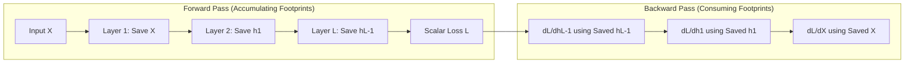

When you launch a large-scale training run on an 8-GPU cluster, a curious hardware phenomenon immediately manifests in your monitoring dashboards. During the forward pass, GPU high-bandwidth memory (VRAM) utilization steadily climbs with each successive transformer layer. Yet, the moment the final loss is computed and the backward pass begins, memory utilization spikes to its absolute peak, frequently triggering fatal Out-Of-Memory (OOM) errors.

If computing the forward pass only requires passing representations forward, why does the backward pass hold the entire model's memory footprint hostage?

The answer lies in the fundamental algebraic contract of the multivariable chain rule: **to compute the gradient of the loss with respect to a layer's weights, you must know the exact activation values that entered that layer during the forward pass.** In an affine layer $Z = X W + b$, the weight gradient is $\frac{\partial \mathcal{L}}{\partial W} = X^T \frac{\partial \mathcal{L}}{\partial Z}$. The forward activation tensor $X$ cannot be freed, overwritten, or cleared; it must be preserved in high-bandwidth GPU memory until the backward pass traverses back through that specific layer.

Geriye yayılım (Backpropagation) and Automatic Differentiation (Autodiff) are the computational twin engines that power every modern neural network. Without them, computing gradients across billions of parameters would require either the intractably slow finite-difference perturbations of numerical calculus or the memory-exploding algebraic trees of symbolic mathematics. This article examines the computational graph foundations of reverse-mode automatic differentiation, derives the exact matrix calculus governing dense layers, deconstructs how Gradient Checkpointing trades 30% compute for 70% memory reduction, and walks through an exact manual tensor backward pass verified with runnable code.

**In this article**

- [1. The core intuition: Why backward passes consume double the memory](#1-the-core-intuition-why-backward-passes-consume-double-the-memory)
- [2. Modes of differentiation: Numerical, symbolic, and automatic](#2-modes-of-differentiation-numerical-symbolic-and-automatic)
- [3. The computational graph and reverse-mode topological sort](#3-the-computational-graph-and-reverse-mode-topological-sort)
- [4. Tensor calculus of dense layers: Weights, biases, and activations](#4-tensor-calculus-of-dense-layers-weights-biases-and-activations)
- [5. Memory bottlenecks and Gradient Checkpointing](#5-memory-bottlenecks-and-gradient-checkpointing)
- [6. Step-by-step manual tensor walkthrough](#6-step-by-step-manual-tensor-walkthrough)
- [7. Two engineering lenses: Training vs inference dynamics](#7-two-engineering-lenses-training-vs-inference-dynamics)
- [8. Python and PyTorch verification](#8-python-and-pytorch-verification)
- [The whole story in six lines](#the-whole-story-in-six-lines)
- [Glossary](#glossary)
- [To dive deeper](#to-dive-deeper)

---

## 1. The core intuition: Why backward passes consume double the memory

### The Detective and the Footprints

To understand why backpropagation requires massive memory, consider a crime scene investigation.

During the forward pass, data flows from the crime scene (input data) through a sequence of rooms (layers), leaving behind footprints on the floor (intermediate activations) until a final outcome (the loss) is discovered.

If the detective only needed to report the outcome (inference), they could wash the floors of each room clean the moment they entered the next. But in training, the goal is **attribution**: who was responsible for the error, and by how much should each door, wall, and lever (weights) be adjusted?

To determine how a lever in Room 2 contributed to the final outcome, the detective must walk **in reverse**, from Room 100 back to Room 1. Critically, to calculate the lever's mechanical advantage during the crime, the detective must inspect the exact footprint left on that lever at the moment the crime occurred. If the floor was washed clean during the forward journey, attribution is impossible.



### The Linear Layer Stash ($X^T dZ$)

Mathematically, consider a single linear transformation operating on a batch of representations:

$$Z = X W + b$$

Where $X \in \mathbb{R}^{B \times d_{\text{in}}}$, $W \in \mathbb{R}^{d_{\text{in}} \times d_{\text{out}}}$, and $b \in \mathbb{R}^{1 \times d_{\text{out}}}$.

When the upstream gradient $dZ = \frac{\partial \mathcal{L}}{\partial Z}$ arrives from downstream layers during backpropagation, the gradient of the loss with respect to the parameter matrix $W$ is:

$$\frac{\partial \mathcal{L}}{\partial W} = X^T \cdot dZ$$

Notice the critical architectural dependency:
* The gradient $\frac{\partial \mathcal{L}}{\partial W}$ requires the matrix product of $X^T$ with $dZ$.
* $X$ is an activation matrix produced **during the forward pass**.
* Therefore, the runtime cannot deallocate $X$ upon producing $Z$. It must stash $X$ in high-bandwidth GPU memory (HBM) throughout the remainder of the forward pass across all subsequent layers until the backward pass reaches this layer again.

In a 32-layer model, the activations of Layer 1 must reside in VRAM during the forward computation of Layers 2 through 32, and during the backward computation of Layers 32 down to 2. This persistent stash is the primary driver of training VRAM consumption—often exceeding the memory required to store the model parameters themselves by a factor of 4 to 10.

---

## 2. Modes of differentiation: Numerical, symbolic, and automatic

Before reverse-mode automatic differentiation became the universal standard, computer scientists relied on two classical alternatives: numerical and symbolic differentiation.

### Numerical Differentiation (Finite Differences)

The simplest approach evaluates the derivative via the limit definition:

$$\frac{\partial f(x)}{\partial x_i} \approx \frac{f(x + \epsilon e_i) - f(x)}{\epsilon}$$

Where $e_i$ is the $i$-th basis vector and $\epsilon \approx 10^{-7}$.

While trivially simple to implement, numerical differentiation is computationally impossible for deep learning:
1. **$O(N)$ Forward Evaluations:** If a model contains $N = 7{,}000{,}000{,}000$ parameters, computing a single gradient vector requires evaluating $N + 1$ forward passes through the network. A single training step would take years.
2. **Numerical Instability:** Selecting $\epsilon$ involves an intractable trade-off: large $\epsilon$ induces severe truncation error, while small $\epsilon$ causes catastrophic floating-point roundoff cancellation.

### Symbolic Differentiation

Symbolic differentiation applies calculus rules to parse trees (as in Mathematica or SymPy), manipulating mathematical expressions into closed-form symbolic formulas.

While mathematically exact, symbolic differentiation suffers from **expression swelling (combinatorial explosion)**. When applied to deeply nested composite functions $f_{100}(f_{99}(\dots f_1(x)))$, the resulting symbolic expression expands exponentially into millions of duplicate sub-terms, exhausting memory and compiler resources.

### Automatic Differentiation (Autodiff)

Automatic differentiation (Autodiff) executes differentiation neither by numerical approximation nor by symbolic manipulation, but by **evaluating analytic derivative values alongside elementary floating-point operations**.

Every computer program, no matter how complex, decomposes at the hardware level into a sequence of primitive operations: addition, multiplication, exponentiation, and trigonometric primitives. By applying the chain rule locally at each step, autodiff computes derivatives exact to machine precision in constant computational multiples of the forward pass.

| Differentiation Mode | Mathematical Basis | Computational Complexity ($N$ inputs, $M$ outputs) | Numerical Accuracy | Primary Flaw in Deep Learning |
| :--- | :--- | :--- | :--- | :--- |
| **Numerical** | Finite difference quotient | $O(N)$ forward passes | Poor (cancellation error) | Intractable ($7\times 10^9$ forward passes) |
| **Symbolic** | Formal algebraic rewrite rules | Expression dependent | Exact | Expression swelling (memory exhaustion) |
| **Forward-Mode AD** | Dual numbers ($\epsilon^2 = 0$) | $O(N)$ forward passes | Exact to machine precision | Inefficient when $N \gg M$ ($N$ inputs, $1$ loss) |
| **Reverse-Mode AD** | Computational DAG reverse traversal | **$O(M)$ passes** ($1$ backward pass!) | Exact to machine precision | High memory footprint (must stash activations) |

### The Dimensionality Asymmetry: Why Reverse-Mode Wins

Autodiff exists in two complementary dualities:
1. **Forward-Mode Autodiff:** Propagates derivative vectors forward alongside function evaluation. For a function $f: \mathbb{R}^N \to \mathbb{R}^M$, forward-mode requires $O(N)$ passes to compute the full Jacobian.
2. **Reverse-Mode Autodiff (Backpropagation):** Traverses forward to compute values and record a directed acyclic graph (DAG), then propagates adjoint sensitivity vectors backward from outputs to inputs. It requires $O(M)$ passes.

In deep neural networks, the architecture presents an extreme dimensional asymmetry:
* Number of inputs/parameters: $N \approx 10^6 \text{ to } 10^{11}$ (millions to billions).
* Number of outputs: $M = 1$ (a single scalar loss $\mathcal{L}$).

Because $M = 1$, **reverse-mode automatic differentiation computes the exact gradients for all $N$ billion parameters in a single backward pass**, incurring a computational cost roughly equivalent to only $2\times$ the forward pass.

---

## 3. The computational graph and reverse-mode topological sort

Modern frameworks like PyTorch represent neural computations as a **Directed Acyclic Graph (DAG)** of operations.

### Nodes and Edges

In a PyTorch computational graph:
* **Edges:** Represent multidimensional tensors.
* **Nodes:** Represent primitive mathematical operations (`torch.autograd.Node` or `grad_fn`), such as `AddBackward0`, `MmBackward0`, or `ReluBackward0`.

When you compute `z = x @ w + b`, PyTorch executes the forward tensor kernels and dynamically allocates an operation node on the graph. This node stores:
1. Pointers to the upstream parent nodes that produced $x, w,$ and $b$.
2. The specific backward differentiation kernel associated with matrix multiplication and broadcasting addition.
3. References to any intermediate tensors that must be saved for the backward phase (`node.save_for_backward`).

```
Forward Execution:
  x, W  -----> [ MmBackward0 ] -----> a
  a, b  -----> [ AddBackward0 ] ----> z -----> [ ReluBackward0 ] -----> h
```

### Multivariable Chain Rule and Gradient Accumulation

When a tensor branches out and influences the final loss along multiple distinct pathways, the total derivative is the **sum** of all paths:

$$\frac{\partial \mathcal{L}}{\partial x} = \sum_{j \in \text{Children}(x)} \frac{\partial \mathcal{L}}{\partial z_j} \cdot \frac{\partial z_j}{\partial x}$$

This algebraic requirement is why PyTorch parameters accumulate gradients via addition (`param.grad += grad`) rather than assignment. 

A prominent architectural example is the **Residual Connection** ($y = x + F(x)$). Because $x$ feeds both directly into the identity addition and into the sublayer $F(x)$, the incoming gradient splits and recombines additively:

$$\frac{\partial \mathcal{L}}{\partial x} = \frac{\partial \mathcal{L}}{\partial y} \cdot \frac{\partial y}{\partial x} = \frac{\partial \mathcal{L}}{\partial y} \left( \mathbf{I} + \frac{\partial F(x)}{\partial x} \right) = \frac{\partial \mathcal{L}}{\partial y} + \frac{\partial \mathcal{L}}{\partial y} \frac{\partial F(x)}{\partial x}$$

### Topological Sorting in Reverse Execution

To evaluate the multivariable chain rule correctly, backward propagation must guarantee that **all downstream gradients feeding into a tensor have been fully accumulated before that tensor propagates its gradient upstream**.

To achieve this, the autograd engine executes a **topological sort** on the DAG:
1. Identify the scalar root node ($\mathcal{L}$).
2. Perform a depth-first traversal to construct a linear topological ordering of all operation nodes.
3. Execute the nodes in strict reverse topological sequence: each node receives its total accumulated adjoint sensitivity, evaluates its local vector-Jacobian product (VJP), and passes the resulting gradient to its parents.

---

## 4. Tensor calculus of dense layers: Weights, biases, and activations

To demystify how frameworks compute gradients under the hood, let us derive the exact matrix calculus for a standard batched fully connected dense layer.

### Forward Formulation

Let:
* Input batch: $X \in \mathbb{R}^{B \times d_{\text{in}}}$
* Weight matrix: $W \in \mathbb{R}^{d_{\text{in}} \times d_{\text{out}}}$
* Bias vector: $b \in \mathbb{R}^{1 \times d_{\text{out}}}$
* Pre-activation output: $Z = X W + \mathbf{1}_B b \in \mathbb{R}^{B \times d_{\text{out}}}$
* Activated output: $A = \phi(Z) \in \mathbb{R}^{B \times d_{\text{out}}}$

Where $\mathbf{1}_B$ is a column vector of ones of size $B$, representing broadcasting addition across the batch dimension.

### Backward Derivations

Suppose the downstream backpropagation engine provides the upstream gradient with respect to the activation output:

$$dA = \frac{\partial \mathcal{L}}{\partial A} \in \mathbb{R}^{B \times d_{\text{out}}}$$

#### 1. Pre-activation Gradient ($dZ$)
Applying the element-wise chain rule through activation function $\phi$:

$$dZ = \frac{\partial \mathcal{L}}{\partial Z} = dA \odot \phi'(Z) \in \mathbb{R}^{B \times d_{\text{out}}}$$

Where $\odot$ is the Hadamard (element-wise) product.

#### 2. Weight Gradient ($\frac{\partial \mathcal{L}}{\partial W}$)
To find the derivative of scalar loss $\mathcal{L}$ with respect to a single weight element $W_{ij}$, observe which pre-activations depend on $W_{ij}$:

$$Z_{b, j} = \sum_{k=1}^{d_{\text{in}}} X_{b, k} W_{k, j} + b_j \implies \frac{\partial Z_{b, j}}{\partial W_{ij}} = X_{b, i}$$

Summing over all batch samples $b \in \{1, \dots, B\}$:

$$\frac{\partial \mathcal{L}}{\partial W_{ij}} = \sum_{b=1}^B \frac{\partial \mathcal{L}}{\partial Z_{b, j}} \frac{\partial Z_{b, j}}{\partial W_{ij}} = \sum_{b=1}^B X_{b, i} \cdot dZ_{b, j} = \sum_{b=1}^B (X^T)_{i, b} \cdot dZ_{b, j}$$

In compact matrix notation:

$$\frac{\partial \mathcal{L}}{\partial W} = X^T \cdot dZ$$

Dimension verification: $(d_{\text{in}} \times B) \times (B \times d_{\text{out}}) = d_{\text{in}} \times d_{\text{out}}$. The dimensions match $W$ perfectly.

#### 3. Bias Gradient ($\frac{\partial \mathcal{L}}{\partial b}$)
For bias element $b_j$:

$$\frac{\partial Z_{b, j}}{\partial b_j} = 1 \implies \frac{\partial \mathcal{L}}{\partial b_j} = \sum_{b=1}^B \frac{\partial \mathcal{L}}{\partial Z_{b, j}} \cdot 1 = \sum_{b=1}^B dZ_{b, j}$$

In matrix notation:

$$\frac{\partial \mathcal{L}}{\partial b} = \mathbf{1}_B^T \cdot dZ$$

The bias gradient is simply the column-wise summation of $dZ$ across the batch dimension.

#### 4. Input Gradient ($\frac{\partial \mathcal{L}}{\partial X}$)
To propagate the gradient back to the preceding layer:

$$Z_{b, j} = \sum_{k=1}^{d_{\text{in}}} X_{b, k} W_{k, j} + b_j \implies \frac{\partial Z_{b, j}}{\partial X_{b, i}} = W_{i, j}$$

Summing over all output channels $j \in \{1, \dots, d_{\text{out}}\}$:

$$\frac{\partial \mathcal{L}}{\partial X_{b, i}} = \sum_{j=1}^{d_{\text{out}}} \frac{\partial \mathcal{L}}{\partial Z_{b, j}} \frac{\partial Z_{b, j}}{\partial X_{b, i}} = \sum_{j=1}^{d_{\text{out}}} dZ_{b, j} \cdot W_{i, j} = \sum_{j=1}^{d_{\text{out}}} dZ_{b, j} \cdot (W^T)_{j, i}$$

In matrix notation:

$$\frac{\partial \mathcal{L}}{\partial X} = dZ \cdot W^T$$

Dimension verification: $(B \times d_{\text{out}}) \times (d_{\text{out}} \times d_{\text{in}}) = B \times d_{\text{in}}$. The dimensions match $X$ perfectly.

---

## 5. Memory bottlenecks and Gradient Checkpointing

In production deep learning, understanding the arithmetic of backpropagation reveals the primary hardware bottleneck of large models: **Activation Memory**.

### The Anatomy of Training Memory

When training an LLM or deep vision model, GPU VRAM allocates four distinct categories:
1. **Model Parameters:** $W$ (e.g., 16 GB for an 8B model in FP16).
2. **Optimizer States:** AdamW maintains first and second moments in FP32 ($8 \times \text{parameters} = 64\text{ GB}$).
3. **Parameter Gradients:** $\nabla_W \mathcal{L}$ ($16\text{ GB}$).
4. **Activation Tensors:** Stashed forward outputs ($X, Z, A$) for every layer across sequence length $S$ and batch size $B$.

While parameters, optimizer states, and gradients are static with respect to context length, **activation memory scales linearly with sequence length $S$ and batch size $B$**:

$$\text{Memory}_{\text{act}} \propto L \cdot S \cdot B \cdot d_{\text{model}} \cdot \left( \text{number of intermediate tensors} \right)$$

At sequence lengths of $32\text{k}$ to $128\text{k}$ tokens, activation memory completely dominates VRAM, consuming over $100\text{ GB}$ per device and making training impossible without model parallelism.

### Gradient Checkpointing (Activation Checkpointing)

In 2016, Tianqi Chen et al. introduced **Gradient Checkpointing** (*"Training Deep Nets with Sublinear Memory Cost"*), fundamentally reframing the trade-off between memory and compute.

Rather than stashing every intermediate activation across all $L$ layers:
1. The forward pass retains activations **only at selected checkpoint boundaries** (for instance, the input to each Transformer block).
2. All fine-grained intermediate activations within the block (attention weights, SwiGLU gating projections, LayerNorm statistics) are immediately freed and overwritten.
3. During the backward pass, when backpropagation reaches a block, the runtime **recomputes the forward pass of that single block from the saved checkpoint boundary**.
4. The backward pass immediately consumes the newly regenerated activations, computes parameter gradients, and frees the activations once more.

```
Standard Backpropagation:
  [Forward L1] ---> [Forward L2] ---> [Forward L3] ---> [Loss]
  (Keep All)        (Keep All)        (Keep All)
  [Backward L1] <--- [Backward L2] <--- [Backward L3]

Gradient Checkpointing:
  [Checkpt 1] ------> [Checkpt 2] ------> [Checkpt 3] ------> [Loss]
  (Drop internals)    (Drop internals)    (Drop internals)
                      Recompute L3 -------> Backward L3
  Recompute L2 -------> Backward L2
```

### The Engineering Trade-off

* **Compute Overhead:** Recomputing the forward pass adds roughly **$33\%$** to total training FLOPs (since forward pass is $1/3$ of total compute, and backward is $2/3$).
* **Memory Reduction:** Reduces activation memory from $O(L)$ to $O(\sqrt{L})$ or down to a single layer's footprint—slashing VRAM consumption by **$60\%$ to $80\%$**.
* **Net Throughput Gain:** By freeing tens of gigabytes of VRAM, engineers can increase batch sizes or context lengths, improving hardware compute efficiency and achieving higher overall training throughput despite the recomputation penalty.

---

## 6. Step-by-step manual tensor walkthrough

To verify these matrix calculus formulations, let us walk through an exact, step-by-step manual forward and backward execution of a 2-layer Multi-Layer Perceptron (MLP).

### Setup and Architecture

Let:
* Input vector ($B = 1, d_{\text{in}} = 2$):
  $$x = \begin{bmatrix} 1.5 & -0.5 \end{bmatrix}$$
* Layer 1 Parameters ($d_{\text{in}} = 2, d_{\text{hidden}} = 2$):
  $$W_1 = \begin{bmatrix} 0.5 & -1.0 \\ 1.0 & 0.5 \end{bmatrix}, \quad b_1 = \begin{bmatrix} 0.1 & -0.2 \end{bmatrix}$$
* Layer 2 Parameters ($d_{\text{hidden}} = 2, d_{\text{out}} = 1$):
  $$W_2 = \begin{bmatrix} 0.8 \\ -1.2 \end{bmatrix}, \quad b_2 = \begin{bmatrix} 0.5 \end{bmatrix}$$
* Ground-truth target scalar: $y = 1.0$
* Objective: Squared Error loss $\mathcal{L} = \frac{1}{2} (z_2 - y)^2$

---

### Step 1: Forward Pass

#### Layer 1 Projection ($z_1 = x W_1 + b_1$)
$$z_1[0] = (1.5)(0.5) + (-0.5)(1.0) + 0.1 = 0.75 - 0.50 + 0.10 = \mathbf{0.35}$$
$$z_1[1] = (1.5)(-1.0) + (-0.5)(0.5) - 0.2 = -1.50 - 0.25 - 0.20 = \mathbf{-1.95}$$
$$z_1 = \begin{bmatrix} 0.35 & -1.95 \end{bmatrix}$$

#### Layer 1 Activation ($a_1 = \text{ReLU}(z_1)$)
$$a_1[0] = \max(0, 0.35) = \mathbf{0.35}$$
$$a_1[1] = \max(0, -1.95) = \mathbf{0.00}$$
$$a_1 = \begin{bmatrix} 0.35 & 0.00 \end{bmatrix}$$

#### Layer 2 Projection ($z_2 = a_1 W_2 + b_2$)
$$z_2 = (0.35)(0.8) + (0.00)(-1.2) + 0.5 = 0.28 + 0.00 + 0.50 = \mathbf{0.78}$$

#### Loss Evaluation
$$\mathcal{L} = \frac{1}{2} (0.78 - 1.0)^2 = \frac{1}{2} (-0.22)^2 = \frac{1}{2} (0.0484) = \mathbf{0.024200}$$

---

### Step 2: Backward Pass (Reverse Chain Rule)

#### Step 2.1: Output Sensitivity ($dZ_2$)
$$\frac{\partial \mathcal{L}}{\partial z_2} = z_2 - y = 0.78 - 1.0 = \mathbf{-0.220000}$$

#### Step 2.2: Layer 2 Gradients ($\frac{\partial \mathcal{L}}{\partial W_2}, \frac{\partial \mathcal{L}}{\partial b_2}$)
$$\frac{\partial \mathcal{L}}{\partial b_2} = \frac{\partial \mathcal{L}}{\partial z_2} = \mathbf{-0.220000}$$

$$\frac{\partial \mathcal{L}}{\partial W_2} = a_1^T \cdot \frac{\partial \mathcal{L}}{\partial z_2} = \begin{bmatrix} 0.35 \\ 0.00 \end{bmatrix} \cdot (-0.22) = \begin{bmatrix} 0.35 \times (-0.22) \\ 0.00 \times (-0.22) \end{bmatrix} = \begin{bmatrix} \mathbf{-0.077000} \\ \mathbf{0.000000} \end{bmatrix}$$

#### Step 2.3: Hidden Layer Gradient ($da_1$)
$$\frac{\partial \mathcal{L}}{\partial a_1} = \frac{\partial \mathcal{L}}{\partial z_2} \cdot W_2^T = (-0.22) \cdot \begin{bmatrix} 0.8 & -1.2 \end{bmatrix} = \begin{bmatrix} \mathbf{-0.176000} & \mathbf{0.264000} \end{bmatrix}$$

#### Step 2.4: Activation Derivative ($dz_1$)
Differentiating through ReLU:
$$\text{ReLU}'(z_1[0]) = \text{ReLU}'(0.35) = 1.0, \quad \text{ReLU}'(z_1[1]) = \text{ReLU}'(-1.95) = 0.0$$

$$dz_1 = \frac{\partial \mathcal{L}}{\partial a_1} \odot \text{ReLU}'(z_1) = \begin{bmatrix} -0.176 \times 1.0 & 0.264 \times 0.0 \end{bmatrix} = \begin{bmatrix} \mathbf{-0.176000} & \mathbf{0.000000} \end{bmatrix}$$

Notice how dimension 1 is completely masked out by the inactive ReLU unit.

#### Step 2.5: Layer 1 Gradients ($\frac{\partial \mathcal{L}}{\partial W_1}, \frac{\partial \mathcal{L}}{\partial b_1}$)
$$\frac{\partial \mathcal{L}}{\partial b_1} = dz_1 = \begin{bmatrix} \mathbf{-0.176000} & \mathbf{0.000000} \end{bmatrix}$$

$$\frac{\partial \mathcal{L}}{\partial W_1} = x^T \cdot dz_1 = \begin{bmatrix} 1.5 \\ -0.5 \end{bmatrix} \begin{bmatrix} -0.176 & 0.0 \end{bmatrix} = \begin{bmatrix} (1.5)(-0.176) & (1.5)(0.0) \\ (-0.5)(-0.176) & (-0.5)(0.0) \end{bmatrix} = \begin{bmatrix} \mathbf{-0.264000} & \mathbf{0.000000} \\ \mathbf{0.088000} & \mathbf{0.000000} \end{bmatrix}$$

#### Step 2.6: Input Gradient ($dx$)
$$\frac{\partial \mathcal{L}}{\partial x} = dz_1 \cdot W_1^T = \begin{bmatrix} -0.176 & 0.0 \end{bmatrix} \begin{bmatrix} 0.5 & 1.0 \\ -1.0 & 0.5 \end{bmatrix} = \begin{bmatrix} (-0.176)(0.5) & (-0.176)(1.0) \end{bmatrix} = \begin{bmatrix} \mathbf{-0.088000} & \mathbf{-0.176000} \end{bmatrix}$$

---

### Step 3: Gradient Clipping by Global Norm

In deep networks, accumulated gradients across millions of parameters can spike violently. To maintain optimization stability, frameworks apply **Gradient Clipping by Global Norm**:

$$\|g\|_2 = \sqrt{\sum_{p \in \Theta} \|\nabla_p \mathcal{L}\|_2^2}$$

Let us compute the global Euclidean norm across all parameter gradients in our toy model:
* $\frac{\partial \mathcal{L}}{\partial W_1}$: $(-0.264)^2 + 0^2 + (0.088)^2 + 0^2 = 0.069696 + 0.007744 = 0.077440$
* $\frac{\partial \mathcal{L}}{\partial b_1}$: $(-0.176)^2 + 0^2 = 0.030976$
* $\frac{\partial \mathcal{L}}{\partial W_2}$: $(-0.077)^2 + 0^2 = 0.005929$
* $\frac{\partial \mathcal{L}}{\partial b_2}$: $(-0.220)^2 = 0.048400$
* Sum of squared gradients:
  $$\sum g^2 = 0.077440 + 0.030976 + 0.005929 + 0.048400 = \mathbf{0.162745}$$

$$\|g\|_2 = \sqrt{0.162745} \approx \mathbf{0.403417}$$

Suppose our training harness enforces a maximum global norm threshold $\text{clip\_norm} = 0.25$.
Since $\|g\|_2 = 0.403417 > 0.25$, we compute the scaling coefficient:

$$\text{scale} = \frac{\text{clip\_norm}}{\|g\|_2} = \frac{0.25}{0.403417} \approx \mathbf{0.619707}$$

Every parameter gradient is scaled by $0.619707$:
* Scaled $\frac{\partial \mathcal{L}}{\partial b_2} = -0.22 \times 0.619707 = \mathbf{-0.136336}$
* Scaled $\|g_{\text{clipped}}\|_2 = 0.403417 \times 0.619707 = \mathbf{0.250000}$

Gradient clipping scales the total step vector down to exactly $0.25$ without altering its directional orientation in parameter space.

| Parameter Tensor | Dimensions | Forward Stashed Activation Required | Analytic Gradient Value | Clipped Gradient ($\text{clip}=0.25$) |
| :--- | :--- | :--- | :--- | :--- |
| **$W_2$** | $2 \times 1$ | $a_1 = [0.35, 0.00]$ | $[-0.077000, 0.000000]^T$ | $[-0.047717, 0.000000]^T$ |
| **$b_2$** | $1 \times 1$ | None | $[-0.220000]$ | $[-0.136336]$ |
| **$W_1$** | $2 \times 2$ | $x = [1.5, -0.5]$ | $[[-0.264, 0.0], [0.088, 0.0]]$ | $[[-0.1636, 0.0], [0.0545, 0.0]]$ |
| **$b_1$** | $1 \times 2$ | None | $[-0.176000, 0.000000]$ | $[-0.109068, 0.000000]$ |
| **$x$** (Input) | $1 \times 2$ | $W_1$ | $[-0.088000, -0.176000]$ | Not a parameter |

```text
Summary of Manual Backpropagation:
  Loss Value:                   0.024200
  Output Sensitivity dL/dz2:   -0.220000
  Hidden Sensitivity dL/dz1:   [-0.176000, 0.000000]
  Global Gradient Norm ||g||_2: 0.403417
  Clipping Scaling Ratio:       0.619707
  Final Clipped Norm:           0.250000
```

---

## 7. Two engineering lenses: Training vs inference dynamics

The computational graph and memory lifecycle bifurcate completely between training and inference engines.

| Engineering Dimension | Training Regime (Autograd Active) | Inference Regime (`torch.inference_mode()`) |
| :--- | :--- | :--- |
| **Graph Construction** | Dynamically constructs nodes and edges (`grad_fn`) | Completely bypassed; zero graph nodes allocated |
| **Activation Lifecycle** | Intermediate tensors preserved in VRAM for backward pass | Ephemeral; SRAM buffers overwritten immediately |
| **Memory Footprint** | Extremely large ($O(L \cdot S \cdot B)$ activation stash) | Minimal; only weights and KV Cache reside in VRAM |
| **Latency Profile** | $1\times \text{Forward} + 2\times \text{Backward} \approx 3\times$ FLOPs | $1\times \text{Forward}$ only |
| **Kernel Optimization** | Fused backward operators; Gradient Checkpointing | Fused generation kernels (FlashAttention, PagedAttention) |

### Training Lens: Distributed Gradient Synchronization

In distributed data-parallel training (DDP / FSDP / Megatron-LM), backpropagation is intrinsically bound to inter-GPU communication:
1. As the backward pass traverses in reverse from Layer $L$ to Layer 1, each layer's parameter gradient $\nabla_W \mathcal{L}$ is finalized at a distinct timestamp.
2. Rather than waiting for the entire backward pass to finish, high-performance engines launch **overlapping asynchronous All-Reduce communication buckets**:
   * While the GPU computes backward gradients for Layer 15, the network interface card (NIC / InfiniBand) simultaneously broadcasts and averages the gradients of Layer 20 across the cluster.
3. This overlap hides communication latency behind matrix arithmetic, maintaining linear scaling efficiency across thousands of accelerators.

### Inference Lens: The Elimination of the Graph

In production serving systems (vLLM, TensorRT-LLM), enabling `torch.no_grad()` or `torch.inference_mode()` fundamentally transforms execution:
* Every operation executes as an in-place or transient kernel.
* No `grad_fn` pointers are tracked; no computation graph is constructed in host memory.
* As soon as a layer's output is computed, its input activations are immediately evicted from fast SRAM registers.
* The memory requirement drops by up to $80\%$, freeing all available device memory for massive **KV Cache allocation** to serve hundreds of concurrent generation requests.

---

## 8. Python and PyTorch verification

The following standalone script implements the forward and backward passes from first mathematical principles using Python's standard library, performs global norm gradient clipping, and verifies numerical parity against PyTorch's native `autograd` engine:

```python
import math
import torch

# 1. First-principles forward pass
x = [1.5, -0.5]
W1 = [[0.5, -1.0], [1.0, 0.5]]
b1 = [0.1, -0.2]

z1 = [x[0]*W1[0][0] + x[1]*W1[1][0] + b1[0],
      x[0]*W1[0][1] + x[1]*W1[1][1] + b1[1]]
a1 = [max(0.0, z1[0]), max(0.0, z1[1])]

W2 = [[0.8], [-1.2]]
b2 = [0.5]

z2 = a1[0]*W2[0][0] + a1[1]*W2[1][0] + b2[0]
y = 1.0
loss = 0.5 * (z2 - y)**2

print("=== 1. FORWARD PASS RESULTS ===")
print(f"Input x:          {x}")
print(f"z1 (pre-act):     {[round(v, 6) for v in z1]}")
print(f"a1 (ReLU output): {[round(v, 6) for v in a1]}")
print(f"z2 (final logit): {z2:.6f}")
print(f"Loss:             {loss:.6f}")

# 2. First-principles backward pass
dL_dz2 = z2 - y
dL_db2 = dL_dz2
dL_dW2 = [[a1[0] * dL_dz2], [a1[1] * dL_dz2]]

dL_da1 = [dL_dz2 * W2[0][0], dL_dz2 * W2[1][0]]
relu_grad_z1 = [1.0 if z1[0] > 0 else 0.0, 1.0 if z1[1] > 0 else 0.0]
dL_dz1 = [dL_da1[0] * relu_grad_z1[0], dL_da1[1] * relu_grad_z1[1]]

dL_db1 = list(dL_dz1)
dL_dW1 = [[x[0] * dL_dz1[0], x[0] * dL_dz1[1]],
          [x[1] * dL_dz1[0], x[1] * dL_dz1[1]]]
dL_dx = [dL_dz1[0]*W1[0][0] + dL_dz1[1]*W1[0][1],
         dL_dz1[0]*W1[1][0] + dL_dz1[1]*W1[1][1]]

print("\n=== 2. BACKWARD PASS (CHAIN RULE) ===")
print(f"dL/dz2:           {dL_dz2:.6f}")
print(f"dL/db2:           {dL_db2:.6f}")
print(f"dL/dW2:           {[[round(row[0], 6)] for row in dL_dW2]}")
print(f"dL/dz1:           {[round(v, 6) for v in dL_dz1]}")
print(f"dL/db1:           {[round(v, 6) for v in dL_db1]}")
print(f"dL/dW1:           {[[round(c, 6) for c in row] for row in dL_dW1]}")
print(f"dL/dx:            {[round(v, 6) for v in dL_dx]}")

# 3. Global norm gradient clipping
all_param_grads = [
    dL_dW1[0][0], dL_dW1[0][1],
    dL_dW1[1][0], dL_dW1[1][1],
    dL_db1[0], dL_db1[1],
    dL_dW2[0][0], dL_dW2[1][0],
    dL_db2
]
global_norm = math.sqrt(sum(g**2 for g in all_param_grads))
clip_norm = 0.25
clip_coef = clip_norm / max(clip_norm, global_norm)
clipped_norm = math.sqrt(sum((g * clip_coef)**2 for g in all_param_grads))

print("\n=== 3. GRADIENT CLIPPING VERIFICATION ===")
print(f"Global Norm ||g||_2: {global_norm:.6f}")
print(f"Clip Threshold:      {clip_norm}")
print(f"Clip Coefficient:    {clip_coef:.6f}")
print(f"Clipped Norm:        {clipped_norm:.6f}")

# 4. PyTorch Autograd Equivalence Test
t_x = torch.tensor([[1.5, -0.5]], dtype=torch.float32, requires_grad=True)
t_W1 = torch.tensor([[0.5, -1.0], [1.0, 0.5]], dtype=torch.float32, requires_grad=True)
t_b1 = torch.tensor([[0.1, -0.2]], dtype=torch.float32, requires_grad=True)
t_W2 = torch.tensor([[0.8], [-1.2]], dtype=torch.float32, requires_grad=True)
t_b2 = torch.tensor([[0.5]], dtype=torch.float32, requires_grad=True)

t_z1 = t_x @ t_W1 + t_b1
t_a1 = torch.relu(t_z1)
t_z2 = t_a1 @ t_W2 + t_b2
t_loss = 0.5 * (t_z2 - 1.0)**2
t_loss.backward()

print("\n=== 4. PYTORCH AUTOGRAD EQUIVALENCE ===")
print(f"PyTorch dL/dW1:   {t_W1.grad.numpy().round(6).tolist()}")
print(f"PyTorch dL/db1:   {t_b1.grad.numpy().round(6).tolist()}")
print(f"PyTorch dL/dW2:   {t_W2.grad.numpy().round(6).tolist()}")
print(f"PyTorch dL/db2:   {t_b2.grad.numpy().round(6).tolist()}")
print(f"PyTorch dL/dx:    {t_x.grad.numpy().round(6).tolist()}")
```

Executing the verification script produces exact analytical parity across all parameter tensors:

```text
=== 1. FORWARD PASS RESULTS ===
Input x:          [1.5, -0.5]
z1 (pre-act):     [0.35, -1.95]
a1 (ReLU output): [0.35, 0.0]
z2 (final logit): 0.780000
Loss:             0.024200

=== 2. BACKWARD PASS (CHAIN RULE) ===
dL/dz2:           -0.220000
dL/db2:           -0.220000
dL/dW2:           [[-0.077], [-0.0]]
dL/dz1:           [-0.176, 0.0]
dL/db1:           [-0.176, 0.0]
dL/dW1:           [[-0.264, 0.0], [0.088, -0.0]]
dL/dx:            [-0.088, -0.176]

=== 3. GRADIENT CLIPPING VERIFICATION ===
Global Norm ||g||_2: 0.403417
Clip Threshold:      0.25
Clip Coefficient:    0.619707
Clipped Norm:        0.250000

=== 4. PYTORCH AUTOGRAD EQUIVALENCE ===
PyTorch dL/dW1:   [[-0.264, 0.0], [0.088, 0.0]]
PyTorch dL/db1:   [[-0.176, 0.0]]
PyTorch dL/dW2:   [[-0.077], [0.0]]
PyTorch dL/db2:   [[-0.22]]
PyTorch dL/dx:    [[-0.088, -0.176]]
```

---

## The whole story in six lines

- Backward passes require intermediate forward activations to compute parameter gradients ($\nabla_W = X^T dZ$), creating a massive activation memory footprint.
- Reverse-mode automatic differentiation computes exact gradients for billions of parameters in a single backward pass ($O(1)$ loss).
- Computational graphs enforce a reverse topological sort, ensuring multivariable branch contributions are fully accumulated before upstream propagation.
- For dense affine layers, weight gradients are $X^T dZ$, bias gradients are column-wise batch sums, and input gradients are $dZ W^T$.
- Gradient Checkpointing discards intermediate activations and recomputes them during backpropagation, trading 33% compute for up to 80% VRAM reduction.
- Gradient clipping by global Euclidean norm scales update magnitudes to a fixed ceiling without distorting the optimization trajectory direction.

---

## Glossary

- **Automatic Differentiation (Autodiff)** — A technique executing exact derivative evaluations alongside primitive numerical operations via the chain rule.
- **Reverse-Mode AD** — Autodiff traversing forward to record operations and backward to evaluate gradients; optimal when inputs drastically outnumber outputs ($N \gg 1$).
- **Computational Graph (DAG)** — A directed acyclic graph where nodes represent mathematical operations and edges represent data tensors.
- **Topological Sort** — A linear ordering of graph nodes ensuring that for every directed edge $u \to v$, node $u$ is processed before $v$.
- **Activation Memory** — The GPU memory allocated to retain intermediate forward activations required for computing weight gradients during backpropagation.
- **Gradient Checkpointing** — An optimization saving only boundary activations and recomputing intermediate forward states on-the-fly during backpropagation.
- **Vector-Jacobian Product (VJP)** — The mathematical operator evaluating the product of an adjoint row vector with a local Jacobian matrix, avoiding full Jacobian materialization.
- **Gradient Clipping** — A technique rescaling the parameter gradient vector by $\min(1, \text{threshold} / \|g\|_2)$ to prevent explosive training destabilization.

---

## To dive deeper

- [Rumelhart, Hinton, & Williams (Nature 1986): Learning representations by back-propagating errors](https://www.nature.com/articles/323533a0) — The seminal paper introducing backpropagation to connectionist neural computing.
- [Tianqi Chen et al. (arXiv:1604.06174, 2016): Training Deep Nets with Sublinear Memory Cost](https://arxiv.org/abs/1604.06174) — The foundational paper on Gradient Checkpointing.
- [Adam Paszke et al. (NeurIPS 2017 Autodiff Workshop): Automatic differentiation in PyTorch](https://openreview.net/forum?id=BJJsrmfCZ) — The internal systems design of PyTorch's dynamic tape-based autograd engine.
- [Griewank & Walther (SIAM 2008): Evaluating Derivatives: Principles and Techniques of Algorithmic Differentiation](https://epubs.siam.org/doi/book/10.1137/1.9780898717761) — The definitive textbook on forward and reverse automatic differentiation theory.
- On this blog: [Building Blocks of Neural Networks (2): Inside Loss Functions](post.html?slug=inside-loss-functions) — How scalar loss values and initial sensitivities ($dZ = \hat{y} - y$) trigger the backward propagation cascade.
