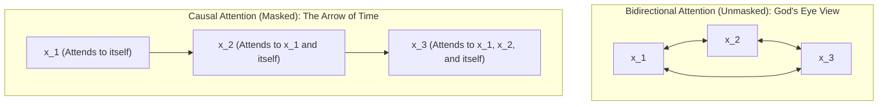

A team of engineers launches a pre-training run across a cluster of 64 H100 GPUs. Within the first two hours, the TensorBoard dashboard presents what appears to be a miracle: the cross-entropy training loss plummets in a sheer vertical drop from 11.2 to 0.04, and the validation perplexity registers an astonishing 1.02. High-fives are exchanged; the run seems to have achieved superhuman convergence at record speed.

Then, they load the checkpoint into an interactive inference endpoint and prompt it: `"The capital of France is"`.

Instead of completing the thought, the model enters a catastrophic, unrecoverable loop: `"is is is is is is is..."`. They bump the temperature, adjust top-p sampling, inject repetition penalties—nothing works. When forced to produce text, the weights spew degenerate gibberish.

The post-mortem reveals an expensive, agonizing truth: the cluster burned $120,000 of compute training on a broken attention kernel. An off-by-one index error or a misconfigured boolean flag in the attention block left the upper triangle exposed. Because the network could attend to future ground-truth tokens during training, the attention projection matrices ($W_Q W_K^T$) collapsed into trivial identity lookup channels. The model never learned to perform autoregressive deduction ($P(x_t \mid x_{<t})$); it simply learned to read the next token directly from the input matrix. The moment it reached inference—where future tokens do not yet exist—its internal state suffered an absolute vacuum, trapping the decoding loop in an inescapable local minimum.

This article dissects how the Transformer architecture enforces the unidirectional arrow of time: the mechanics of **Causal (Masked) Self-Attention**, lower triangular matrix geometry, the rigorous mathematical eradication of future tokens inside Softmax via $-\infty$, step-by-step manual tensor calculations matching our ongoing three-token toy sequence, the fundamental engineering split between parallel training and inference (including the mechanics of chunked prefill), IEEE 754 float16/bfloat16 numerical stability traps, how modern FlashAttention kernels eliminate the mask matrix in silicon, and how production models like **Llama 3, Gemma 2, Mistral, and DeepSeek** diverge from standard causal attention.

**In this article**

- [1. The arrow of time and the autoregressive imperative](#1-the-arrow-of-time-and-the-autoregressive-imperative)
- [2. A murder mystery with glued pages: The core intuition](#2-a-murder-mystery-with-glued-pages-the-core-intuition)
- [3. Lower triangular matrix mechanics: Masking the future](#3-lower-triangular-matrix-mechanics-masking-the-future)
- [4. Anatomy of masks: Causal, padding, and truncation](#4-anatomy-of-masks-causal-padding-and-truncation)
- [5. The math of the void: Why the mask MUST precede Softmax](#5-the-math-of-the-void-why-the-mask-must-precede-softmax)
- [6. Step-by-step manual tensor walk: Three tokens through causal attention](#6-step-by-step-manual-tensor-walk-three-tokens-through-causal-attention)
- [7. The two engineering lenses: Training vs. inference and chunked prefill](#7-the-two-engineering-lenses-training-vs-inference-and-chunked-prefill)
- [8. Hardware and numerical stability: IEEE 754, fp16 traps, and FlashAttention varlen](#8-hardware-and-numerical-stability-ieee-754-fp16-traps-and-flashattention-varlen)
- [9. PyTorch verification: Step-by-step code and tensors](#9-pytorch-verification-step-by-step-code-and-tensors)
- [10. Production frontiers: How modern models diverge (Llama 3, Gemma 2, Mistral, DeepSeek)](#10-production-frontiers-how-modern-models-diverge-llama-3-gemma-2-mistral-deepseek)
- [The whole story in six lines](#the-whole-story-in-six-lines)
- [Glossary](#glossary)
- [Going deeper](#going-deeper)

---

## 1. The arrow of time and the autoregressive imperative

In the physical universe, time has an uncompromising direction: the Second Law of Thermodynamics dictates that entropy increases, and physical causality establishes that an effect cannot precede its cause. Human language is a direct manifestation of this temporal asymmetry: speech propagates through air as chronological acoustic waveforms, writing advances token by token across a page, and human reasoning chains thoughts sequentially.

While discriminative and retrieval models (such as bidirectional encoders like BERT) inspect finished documents with complete all-to-all visibility, an open-ended autoregressive generative model must surrender to the unidirectional arrow of time: **a word that has not yet been spoken cannot influence the word being uttered right now.**

### 1. The Probabilistic Foundation: The Autoregressive Chain Rule

Autoregressive language generation rests on the fundamental probability chain rule. Given a sequence of $T$ discrete tokens $X = (x_1, x_2, \dots, x_T)$, the joint probability of the entire sequence factorizes strictly forward in time:

$$P(x_1, x_2, \dots, x_T) = \prod_{t=1}^T P(x_t \mid x_1, x_2, \dots, x_{t-1}) = \prod_{t=1}^T P(x_t \mid x_{<t})$$

**Read it as:**
- $P(x_1, \dots, x_T)$: The joint probability of observing the full sequence in that exact order.
- $\prod_{t=1}^T$: The cumulative product of all conditional step probabilities from step $1$ to $T$.
- $P(x_t \mid x_{<t})$: The probability of generating token $x_t$ conditioned exclusively on the past context ($x_1, \dots, x_{t-1}$).

This equation carries two profound mathematical implications:
1. **Zero Independence Assumptions:** This factorization is not an approximation or heuristic; it is an exact identity of probability theory. No token is assumed to be conditionally independent of any other.
2. **Physical Causality:** While mathematically the chain rule can factorize in any arbitrary permutation (e.g., from token $T$ down to $1$), language generation is only physically meaningful moving forward: **when predicting token $x_t$, future tokens ($x_{t+1}, \dots, x_T$) do not yet exist in the universe.**



### 2. Invariance of Past Representations and the Birth of KV Cache

The objective function of an autoregressive language model is to optimize next-token prediction at every step:

$$\mathcal{L} = -\sum_{t=1}^T \log P(x_t \mid x_{<t})$$

Under this objective, the causal attention mask endows the network with a fundamental property: **The Invariance Principle of Past Representations.**

Because of the causal attention mask, the hidden state $h_i$ at step $i$ is a deterministic function exclusively of tokens $x_1 \dots x_i$. For any future token $x_j$ ($j > i$):

$$\frac{\partial h_i}{\partial x_j} = \mathbf{0.0} \quad \forall j > i$$

This mathematical guarantee means that when token $1{,}000$ is appended to the sequence, the hidden states, Keys, and Values of tokens $1 \dots 999$ **are frozen in time; not a single bit changes.**
- **The Ground Truth of KV Caching:** If attention were unmasked, every newly emitted token would retroactively alter the representations of all preceding tokens across all layers, rendering caching mathematically impossible. Because causal attention guarantees representation invariance, past Keys and Values are computed once and stored in the **KV Cache**; at step $t+1$, the model computes a single Query vector ($Q \in \mathbb{R}^{1 \times d_k}$), takes its dot product against the historical cache, and emits the next token in $O(1)$ time per step.

### 3. Shortcut Collapse: Why Peeking at the Future Poisons the Network

*Why must we enforce the causal mask during pre-training? What happens to gradient descent if we do not?*

If a network trained on next-token prediction is given unmasked bidirectional self-attention, Query $Q_t$ immediately spots the Key badge of its target ($K_{t+1}$) in the very next column.

Gradient descent is ruthlessly opportunistic: rather than traversing 96 layers of deep abstractions to synthesize world knowledge, syntax, and logic, it collapses the weight matrices into an effortless shortcut:

$$W_Q W_K^T \to \text{Shift-by-1 Identity Lookup}$$

The network degenerates into a high-dimensional copper wire that reads position $t+1$ directly from memory and shunts it straight to the output logits. The training loss plummets to near-zero within minutes, creating an illusion of rapid convergence. But the moment the model reaches deployment—where future tokens do not yet exist—the circuit breaks, plunging the generator into infinite loops and utter incoherence.

| Architectural Feature | Bidirectional Attention (Unmasked) | Causal Attention (Masked) |
| :--- | :--- | :--- |
| **Attention Geometry** | Full Matrix ($T \times T$ all-to-all visibility) | Lower Triangular Matrix ($-\infty$ for $j > i$) |
| **Future Visibility** | Completely exposed (All future tokens visible) | **Completely eradicated** (Negative infinity well) |
| **Past Representation Invariance** | ABSENT ($\partial h_i / \partial x_j \neq 0$) | **GUARANTEED** ($\partial h_i / \partial x_j = 0, \forall j > i$) |
| **KV Cache Compatibility** | Impossible (New tokens mutate past states) | **Native & Essential** ($O(1)$ per-step latency) |
| **Training Objective** | Masked Language Modeling / Understanding | **Next-Token Prediction / Generation** |
| **Hardware Workload** | Standard dense compute-bound GEMM | Triangular GEMM / Hardware register skip |

---

## 2. A murder mystery with glued pages: The core intuition

In Part 4 of our series ([Inside Self-Attention](post.html?slug=inside-self-attention)), we established the physical intuition of attention using three items distributed to every token in the classroom:
- **Search Flashlight (Query - $Q$):** *"What semantic features am I looking for?"*
- **Name Badge (Key - $K$):** *"What features and role do I represent?"*
- **Information Bag (Value - $V$):** *"What payload will I pass to whoever attends to me?"*

In bidirectional self-attention, every token shines its flashlight at every badge across the entire room. Now picture that same room participating in a **serialized murder mystery reading club**. Seated in order are our three core tokens: **"dog"** ($t=0$), **"cat"** ($t=1$), and **"chased"** ($t=2$).

```text
[Token 0: 'dog']    --> Reading page 1. Must deduce clues with zero knowledge of the culprit.
[Token 1: 'cat']    --> Reading page 50. Remembers page 1, but future pages remain sealed.
[Token 2: 'chased'] --> Reading the final chapter. Possesses full context of the entire narrative.
```

If "dog" ($t=0$) is allowed to shine its Query flashlight ($Q_0$) at the Key badge of "chased" ($K_2$), the reader spots the revelation before the plot begins. True deduction vanishes; the reader merely copies the ending.

To preserve causality, **a one-way privacy partition is placed beside each reader.** A token may shine its flashlight at its own badge and the badges of those seated to its left (the past). If it attempts to aim its beam to the right (into the future), the light strikes an absorbing barrier—a mathematical void corresponding to a **$-\infty$ well**—where all energy is extinguished.

---

## 3. Lower triangular matrix mechanics: Masking the future

To translate this physical barrier into linear algebra, consider the interaction between the Query matrix $Q \in \mathbb{R}^{T \times d_k}$ and Key matrix $K \in \mathbb{R}^{T \times d_k}$. Their dot product yields the raw pairwise affinity matrix $S \in \mathbb{R}^{T \times T}$:

$$S = \frac{QK^T}{\sqrt{d_k}}$$

In this $T \times T$ grid, each row $i$ represents an observing Query at step $i$, while each column $j$ represents an observed Key at step $j$:

```text
                  Columns j (Observed Keys)
                   j = 0           j = 1           j = 2
Rows i     i = 0 [ S_00 (Present)  S_01 (FUTURE)   S_02 (FUTURE)  ]
(Observing i = 1 [ S_10 (Past)     S_11 (Present)  S_12 (FUTURE)  ]
 Queries)  i = 2 [ S_20 (Past)     S_21 (Past)     S_22 (Present) ]
```

All entries above the main diagonal ($j > i$) violate temporal order. We enforce causality by adding an additive mask matrix $M \in \mathbb{R}^{T \times T}$ shaped as a **Lower Triangular Matrix**:

$$M_{ij} = \begin{cases} 0 & \text{if } j \le i \\ -\infty & \text{if } j > i \end{cases}$$

**Read it as:**
- $M_{ij}$: The mask scalar added to the pre-softmax attention logit at row $i$ and column $j$.
- $j \le i$: Legitimate past and present positions. Adding $0$ leaves the scaled dot-product score unchanged ($S_{ij} + 0 = S_{ij}$).
- $j > i$: Illegal future positions. Adding $-\infty$ plunges the logit into negative infinity.

For a three-token sequence, the mask matrix $M$ appears as:

```text
M = [
  [   0.0,   -inf,   -inf ],   <-- Token 0 attends exclusively to Token 0
  [   0.0,    0.0,   -inf ],   <-- Token 1 attends to Tokens 0 and 1
  [   0.0,    0.0,    0.0 ]    <-- Token 2 attends to Tokens 0, 1, and 2
]
```

---

## 4. Anatomy of masks: Causal, padding, and truncation

Engineers frequently conflate the distinct masks operating across a Transformer pipeline. Each serves an independent function:

| Mechanism | Tensor Shape | Architectural Purpose | Pipeline Location |
| :--- | :--- | :--- | :--- |
| **Context Truncation** | $[B, L_{\max}]$ | Enforces hardware window limits by slicing sequences ($T \le L_{\max}$). | Data loader / Preprocessing |
| **Padding Mask** | $[B, 1, 1, T_{\text{key}}]$ | Prevents attention from attending to synthetic `[PAD]` placeholder tokens. | Attention layer (Batch alignment) |
| **Causal Mask** | $[1, 1, T_{\text{query}}, T_{\text{key}}]$ | Enforces temporal causality (lower triangular matrix). | Attention layer (Decoder invariant) |

Modern Transformer frameworks fuse these operations into a single **4D Fused Attention Mask**:

$$M_{\text{fused}} = M^{\text{causal}} + M^{\text{pad}}$$

If key position $j$ represents either an unread future step ($j > i$) **or** a padding artifact ($x_j = \text{PAD}$), the corresponding cell receives $-\infty$. The attention kernel dismisses both temporal violations and synthetic padding in a single broadcasted operation.

---

## 5. The math of the void: Why the mask MUST precede Softmax

A common design question arises: *Why inject $-\infty$ into raw logits before Softmax instead of computing standard bidirectional attention and zeroing the forbidden upper triangle afterward ($A \odot \text{Mask}$)?*

The answer lies in the non-linear normalisation physics of the Softmax operator.

Masked scaled dot-product attention is formally expressed as:

$$\text{Attention}(Q, K, V) = \text{Softmax}\left(\frac{QK^T}{\sqrt{d_k}} + M\right)V$$

**Read it as:**
- $\frac{QK^T}{\sqrt{d_k}}$: The unmasked pairwise correlation logits.
- $+ M$: The additive lower triangular mask setting future entries to $-\infty$.
- $\text{Softmax}(\cdot)$: The row-wise normalization converting logits into valid probabilities summing to $1.0$.
- $V$: The Value tensor containing semantic payloads.

Let $z_{ij} = \frac{q_i k_j^T}{\sqrt{d_k}} + M_{ij}$ denote the masked logit at row $i$, column $j$. The Softmax probability $A_{ij}$ is:

$$A_{ij} = \frac{e^{z_{ij}}}{\sum_{k=1}^T e^{z_{ik}}}$$

### For Future Tokens ($j > i$):

For any future key position, the mask sets $M_{ij} = -\infty$, driving $z_{ij} \to -\infty$. Applying the asymptotic limit of the natural exponential:

$$\lim_{z \to -\infty} e^z = 0$$

The numerator collapses identically to zero:

$$\text{Numerator} = e^{-\infty} = 0$$

Now inspect the normalisation denominator:

$$\sum_{k=1}^T e^{z_{ik}} = \sum_{k=1}^i e^{\frac{q_i k_k^T}{\sqrt{d_k}} + 0} + \sum_{k=i+1}^T e^{-\infty} = \sum_{k=1}^i e^{\frac{q_i k_k^T}{\sqrt{d_k}}} + 0 = \sum_{k=1}^i e^{\frac{q_i k_k^T}{\sqrt{d_k}}}$$

Notice the mathematical elegance: **future tokens are completely purged from the denominator.** The normalisation budget is distributed strictly among valid past and present positions ($k \le i$):

$$A_{ij} = \begin{cases} 
\dfrac{e^{\frac{q_i k_j^T}{\sqrt{d_k}}}}{\sum_{k=1}^i e^{\frac{q_i k_k^T}{\sqrt{d_k}}}} & \text{if } j \le i \\
0 & \text{if } j > i 
\end{cases}$$

When computing the final context vector $o_i$:

$$o_i = \sum_{j=1}^T A_{ij} v_j = \sum_{j=1}^i A_{ij} v_j + \sum_{j=i+1}^T (0 \cdot v_j) = \sum_{j=1}^i A_{ij} v_j$$

Future Value bags ($v_{i+1}, \dots, v_T$) are multiplied by exact mathematical zero. Not a single bit of future information can enter the updated token representation.

### The Fallacy of Post-Softmax Zeroing

Zeroing attention weights *after* standard Softmax ($\tilde{A} = \text{Softmax}(S) \odot \text{Mask}$) breaks the architecture in two distinct ways:

1. **Destruction of the Probability Measure:** Softmax forces row probabilities to sum to $1.0$. Post-hoc zeroing leaves the remaining probabilities summing to strictly less than unity ($\sum_{j=1}^i \tilde{A}_{ij} < 1.0$). Across 32 or 80 transformer layers, this systematic attenuation drives hidden activations toward zero.
2. **Denominator Contamination:** Even if you re-normalize the remaining entries, the calculation is permanently tainted. The initial Softmax denominator incorporated unmasked exponential terms from the future ($e^{S_{ik}}$ for $k > i$). If future tokens possess large raw logits, they inflate the denominator, artificially suppressing the weights of legitimate past tokens. **Future information leaks through the normalisation denominator itself.**

---

## 6. Step-by-step manual tensor walk: Three tokens through causal attention

To crystallize matrix mechanics, we trace our standardized running sequence from Part 4 with identical numbers, weights, and dimensions: **`["dog", "cat", "chased"]`** ($T = 3$, $d_{\text{model}} = 4$, $d_k = 4$).

Input representation matrix $Z \in \mathbb{R}^{3 \times 4}$:

```text
Z = [
  [0.21, 0.82, 0.13, 0.44],  # dog (t=0)
  [0.95, 0.16, 0.37, 0.28],  # cat (t=1)
  [0.19, 0.40, 1.01, 0.82]   # chased (t=2)
]
```

Projection weight matrices $W_Q, W_K, W_V \in \mathbb{R}^{4 \times 4}$ yield projected $Q, K, V$ tensors:

```text
Q = Z · W_Q:
  q_0 (dog)    = [0.340, 1.260, 0.650, 0.950]
  q_1 (cat)    = [1.320, 0.440, 1.230, 0.530]
  q_2 (chased) = [1.200, 1.220, 1.010, 1.410]

K = Z · W_K:
  k_0 (dog)    = [0.650, 1.030, 0.950, 0.570]
  k_1 (cat)    = [1.230, 1.110, 0.530, 0.650]
  k_2 (chased) = [1.010, 0.590, 1.410, 1.830]

V = Z · W_V:
  v_0 (dog)    = [0.340, 0.950, 1.260, 0.650]
  v_1 (cat)    = [1.320, 0.530, 0.440, 1.230]
  v_2 (chased) = [1.200, 1.410, 1.220, 1.010]
```

### Step 1: Raw Scores and Scaling

Matrix multiplication $S = Q K^T$ generates raw dot-product affinities, scaled by $\sqrt{d_k} = \sqrt{4} = 2.0$:

```text
Raw Scores (S = Q K^T):
  [ 2.678,  2.779,  3.742 ]
  [ 2.782,  3.108,  4.297 ]
  [ 3.800,  4.282,  5.936 ]

Scaled Scores (S_scaled = S / 2.0):
  [ 1.339,  1.389,  1.871 ]
  [ 1.391,  1.554,  2.149 ]
  [ 1.900,  2.141,  2.968 ]
```

### Step 2: Adding the Causal Mask ($S_{\text{scaled}} + M$)

Applying the additive lower triangular mask injects $-\infty$ into illegal future positions:

```text
Masked Logits (S_masked = S_scaled + M):
  Row 0: [ 1.339,    -inf,    -inf ]   <-- Token 0 attends exclusively to Token 0
  Row 1: [ 1.391,   1.554,    -inf ]   <-- Token 1 attends to Tokens 0 and 1
  Row 2: [ 1.900,   2.141,   2.968 ]   <-- Token 2 attends to Tokens 0, 1, and 2
```

### Step 3: Row-by-Row Softmax Computation

#### Row 0 ("dog", $t=0$):
Inputs: `[1.339, -inf, -inf]`
- $e^{1.339} = 3.815$
- $e^{-\infty} = 0.0$
- $e^{-\infty} = 0.0$
- Sum (Denominator) = $3.815 + 0 + 0 = 3.815$
- $A_{00} = 3.815 / 3.815 = \mathbf{1.000}$
- $A_{01} = 0 / 3.815 = \mathbf{0.000}$
- $A_{02} = 0 / 3.815 = \mathbf{0.000}$

**Row 0 Attention Distribution:** `[1.000, 0.000, 0.000]`

#### Row 1 ("cat", $t=1$):
Inputs: `[1.391, 1.554, -inf]`
- $e^{1.391} = 4.019$
- $e^{1.554} = 4.730$
- $e^{-\infty} = 0.0$
- Sum (Denominator) = $4.019 + 4.730 + 0 = 8.749$
- $A_{10} = 4.019 / 8.749 = \mathbf{0.459}$
- $A_{11} = 4.730 / 8.749 = \mathbf{0.541}$
- $A_{12} = 0 / 8.749 = \mathbf{0.000}$

**Row 1 Attention Distribution:** `[0.459, 0.541, 0.000]`

#### Row 2 ("chased", $t=2$):
Inputs: `[1.900, 2.141, 2.968]` (No future tokens exist; identical to bidirectional attention)
- $e^{1.900} = 6.686$
- $e^{2.141} = 8.508$
- $e^{2.968} = 19.453$
- Sum (Denominator) = $6.686 + 8.508 + 19.453 = 34.647$
- $A_{20} = 6.686 / 34.647 = \mathbf{0.193}$
- $A_{21} = 8.508 / 34.647 = \mathbf{0.246}$
- $A_{22} = 19.453 / 34.647 = \mathbf{0.562}$

**Row 2 Attention Distribution:** `[0.193, 0.246, 0.562]`

Final Causal Attention Matrix $A$:

```text
A = [
  [ 1.000,  0.000,  0.000 ],
  [ 0.459,  0.541,  0.000 ],
  [ 0.193,  0.246,  0.562 ]
]
```

### Step 4: Blending Values (Output Context Vectors $O = A V$)

Multiplying attention weights by the Value matrix yields the updated context representations:

```text
O_0 = 1.000 · v_0 + 0.000 · v_1 + 0.000 · v_2
    = [0.340, 0.950, 1.260, 0.650]

O_1 = 0.459 · v_0 + 0.541 · v_1 + 0.000 · v_2
    = 0.459 · [0.340, 0.950, 1.260, 0.650] + 0.541 · [1.320, 0.530, 0.440, 1.230]
    = [0.870, 0.723, 0.817, 0.964]

O_2 = 0.193 · v_0 + 0.246 · v_1 + 0.562 · v_2
    = [1.064, 1.105, 1.036, 0.995]
```

### Side-by-Side Comparison: Bidirectional (Part 4) vs. Causal (Part 5)

Contrasting these numerical distributions against Part 4 reveals the physical impact of the mask:

| Token | Bidirectional Attention (Part 4) | Causal Attention (Part 5) | Architectural Insight |
| :--- | :--- | :--- | :--- |
| **dog ($t=0$)** | `[0.266, 0.280, 0.454]` | `[1.000, 0.000, 0.000]` | In bidirectional attention, 45.4% of attention leaked to the ungenerated verb "chased". Under causality, attention to the future collapses to 0%, focusing 100% on itself. |
| **cat ($t=1$)** | `[0.232, 0.273, 0.495]` | `[0.459, 0.541, 0.000]` | The 49.5% leakage into "chased" vanishes completely; attention redistributes legitimately across the past subject ("dog") and itself. |
| **chased ($t=2$)** | `[0.193, 0.246, 0.561]` | `[0.193, 0.246, 0.562]` | Because the final token has no future to mask, causal and bidirectional computations yield bit-identical distributions. |

---

## 7. The two engineering lenses: Training vs. inference and chunked prefill

Mastering causal attention requires dissecting its computational profile across training clusters and live production serving engines. The two environments operate under diametrically opposed hardware regimes.

```text
                    TRAINING                                  INFERENCE
   (Parallel / Teacher Forcing / GEMM)            (Prefill vs Decode / GEMV)
┌────────────────────────────────────────┐     ┌────────────────────────────────────────┐
│ Full sequence passed simultaneously    │     │ 1. Prefill: Entire prompt ingested     │
│ Causal mask applied as T x T matrix    │     │    Causal mask applied across prompt   │
│ Backward: Masked gradient dL/dS = 0    │     │ 2. Decode: Token-by-token generation   │
│ Workload: Compute-bound dense GEMM     │     │    Q: [1, d_k] -> KV Cache: [T, d_k]   │
│                                        │     │    NO FUTURE TOKENS -> NO MASK NEEDED! │
└────────────────────────────────────────┘     └────────────────────────────────────────┘
```

### 1. The Training Lens: Teacher Forcing, Parallel GEMM, and Gradient Isolation

*   **The Sequential Paradox Resolved:** Autoregressive generation is strictly sequential ($O(T)$ sequential steps). If training were executed step by step, massive GPU clusters would sit idle. Under **Teacher Forcing**, the entire target sequence of $T$ tokens is fed concurrently into the model. The causal mask ensures that token $t$ predicts token $t+1$ without knowing it. All $T$ predictions execute in a **single compute-bound GEMM (General Matrix Multiply)** operation, driving Tensor Core utilization above 90%.
*   **Gradient Mechanics in the Backward Pass:** The gradient of the loss $\mathcal{L}$ with respect to the raw pre-softmax attention logit $S_{ij}$ follows the Softmax Jacobian:

$$\frac{\partial \mathcal{L}}{\partial S_{ij}} = \sum_{k=1}^T \frac{\partial \mathcal{L}}{\partial A_{ik}} \frac{\partial A_{ik}}{\partial S_{ij}} = A_{ij} \left( \frac{\partial \mathcal{L}}{\partial A_{ij}} - \sum_{k=1}^T \frac{\partial \mathcal{L}}{\partial A_{ik}} A_{ik} \right)$$

For any forbidden future entry ($j > i$), the forward pass established $A_{ij} \equiv 0$. Substituting $0$ into the equation yields:

$$\frac{\partial \mathcal{L}}{\partial S_{ij}} = 0 \cdot \left( \dots \right) = \mathbf{0.0} \quad \forall j > i$$

The gradient flowing backward into the upper triangle is **identically zero**. Future tokens cannot transmit a single bit of gradient signal into past representations during backpropagation.
*   **Memory Cost:** Activation memory must preserve the intermediate attention matrix for backpropagation. At $128\text{k}$ context, storing these scores across dozens of layers and heads easily surpasses hundreds of gigabytes, mandating activation checkpointing or on-the-fly recomputation via FlashAttention.

### 2. The Inference Lens: The Severe Shift from Prefill to Decode

Inference bifurcates into two completely distinct hardware execution modes:

| Phase | Input Shapes | Primary Kernel | Hardware Regime | Causal Mask Status |
| :--- | :--- | :--- | :--- | :--- |
| **Prefill** (Prompt) | $Q, K, V \in \mathbb{R}^{T_p \times d_k}$ | GEMM ($T_p \times T_p$) | Compute-bound (FLOPS) | **MANDATORY** (Lower Triangular) |
| **Decode** (Generation) | $Q \in \mathbb{R}^{1 \times d_k}, K, V \in \mathbb{R}^{T_{\text{past}} \times d_k}$ | GEMV ($1 \times T_{\text{past}}$) | Memory-bandwidth-bound (GB/s) | **DOES NOT EXIST / UNNECESSARY** |

*   **Why the Causal Mask Vanishes During Decode:** During the token-by-token generation loop, the Query tensor is a single vector ($Q \in \mathbb{R}^{1 \times d_k}$). The KV Cache contains only keys and values from tokens $0 \dots t-1$. **Future tokens do not physically exist in memory.** Because there are no future keys in the KV cache, there is no upper triangle to mask. The operation is simply an unmasked dot product of a single query vector against the historical cache: $q_t K_{\le t}^T / \sqrt{d_k}$. The causal mask is strictly a multi-token prefill and training construct.
*   **The Arithmetic Intensity Collapse:** In prefill, arithmetic intensity is high ($\sim T_p$ FLOPS/byte). In decode, generating a single token requires streaming the entire multi-gigabyte KV cache from HBM into SRAM to perform a single vector-matrix multiply. Arithmetic intensity collapses to $\sim 1$ FLOP/byte. The GPU's massive Tensor Cores sit starved, waiting on HBM memory bus bandwidth.

### 3. Production Engine Optimization: Chunked Prefill (vLLM / Sarathi-Serve)

In production serving systems (vLLM, SGLang, TensorRT-LLM), language models rarely serve a single user in isolation; they serve hundreds of concurrent clients simultaneously. In this multi-tenant environment, causal attention collides directly with one of the most critical systems bottlenecks in machine learning: **the hardware conflict between prefill and decode.**

**The Serving Crisis: Head-of-Line Blocking and the Prefill Bubble**

Consider the two fundamentally opposing workloads running on the same GPU cluster:
1. **Active Decode Streams:** The engine is actively streaming tokens to 64 existing users. Each decode step processes exactly one token per stream, operates in a strictly memory-bandwidth-bound regime (GEMV), and takes approximately **15–25 milliseconds** per step (Time-Per-Output-Token - TPOT). Users experience silky smooth, typewriter-like token generation.
2. **A Sudden Long Prefill Request:** A 65th user suddenly submits a massive 32,768-token prompt (such as a 70-page financial report or codebase) accompanied by a question.

In conventional inference engines, the scheduler ingests this entire 32k prompt in a single monolithic prefill pass. This massive compute-bound GEMM operation saturates the GPU's Tensor Cores at 100% capacity for **800 to 1,500 milliseconds (1.5 seconds!)**, locking out all other operations on the GPU.

**The Result is Catastrophic:**
- The streaming generation for all 64 active users completely freezes for 1.5 seconds.
- TPOT latency spikes from 20 ms to 1,500 ms—a **75x latency jitter**.
- In distributed systems and queueing theory, this phenomenon is known as **Head-of-Line Blocking** or the **Prefill Bubble**.

**The Architectural Remedy: Chunked Prefill (Sarathi-Serve / vLLM)**

To eliminate this scheduling crisis, Sarathi-Serve (Agrawal et al., OSDI 2024) introduced—and modern engines like vLLM V1 have standardized—the concept of **Chunked Prefill**.

The core premise is straightforward: rather than swallowing a 32k prompt in one monolithic 1.5-second gulp, the scheduler enforces a fixed per-iteration token budget (for example, chunks of size $C = 2048$ tokens).

In every forward pass, the engine constructs a hybrid execution batch (continuous batching with piggybacking):
- 64 active decode tokens (1 token for each streaming client).
- Exactly **one 2,048-token chunk** from the long prefill prompt (Chunk $k$).
- Total batch budget: $2048 + 64 = 2112$ tokens.

Every forward iteration now finishes in **~25–35 milliseconds**! The 64 streaming users continue receiving tokens with zero perceptible jitter, while the long document is steadily ingested into the KV cache chunk by chunk.

**Matrix Mechanics: The Hybrid Attention Mask**

How does causal attention operate during chunked execution without violating temporal correctness? How does the attention mask adapt across chunk boundaries?

Suppose a sequence contains 8 tokens, and our chunking budget is $C = 4$ tokens:
- **Iteration 1:** Chunk 1 ($T_{0 \dots 3}$) is evaluated using standard lower-triangular causal attention. The resulting Key and Value vectors ($K_0 \dots K_3, V_0 \dots V_3$) are written to the **KV Cache**.
- **Iteration 2:** Chunk 2 ($T_{4 \dots 7}$) arrives as the active Query chunk ($Q_4 \dots Q_7$). It must attend both to the historical context stored in the KV Cache and causally within itself.

This requires a **Hybrid Attention Mask**:

```text
Hybrid Attention Mask for Chunk 2 (Queries: q_4..q_7) given Chunk 1 in KV Cache:

                 Chunk 1 (Stored in KV Cache)      Chunk 2 (Active Query Chunk)
                     k_0   k_1   k_2   k_3             k_4   k_5   k_6   k_7
     q_4 (Chunk 2) [  0.0   0.0   0.0   0.0 ]       [  0.0  -inf  -inf  -inf ]  <-- Full access to Chunk 1
     q_5 (Chunk 2) [  0.0   0.0   0.0   0.0 ]       [  0.0   0.0  -inf  -inf ]  <-- Causal within Chunk 2
     q_6 (Chunk 2) [  0.0   0.0   0.0   0.0 ]       [  0.0   0.0   0.0  -inf ]
     q_7 (Chunk 2) [  0.0   0.0   0.0   0.0 ]       [  0.0   0.0   0.0   0.0 ]
                   └────────────────────────┘       └──────────────────────────┘
                     FULL CROSS-ATTENTION              LOWER TRIANGULAR CAUSAL
                   (Rectangular: C x T_past)               (Square: C x C)
```

**How the Two Mask Regions Operate:**
1. **Left Block (Cross-Chunk Attention - Rectangular Full Attention):** Queries $q_4, q_5, q_6, q_7$ are permitted to attend to all historical tokens $k_0, k_1, k_2, k_3$ already finalized in the KV Cache. There is zero masking here; this $[C \times T_{\text{past}}]$ rectangular region is filled entirely with **$0.0$**.
2. **Right Block (Intra-Chunk Attention - Square Causal Attention):** Within Chunk 2 ($q_4 \dots q_7$), tokens must strictly obey temporal order. Token $q_4$ cannot attend to upcoming keys $k_5, k_6, k_7$. Therefore, this $[C \times C]$ square submatrix enforces standard **lower-triangular $-\infty$ causal masking**.

**Hardware Execution: Integration with FlashAttention and PagedAttention**

In modern high-performance inference libraries (such as vLLM and FlashInfer), this operation never instantiates an explicit 2D floating-point mask matrix in GPU memory:
- Past chunks reside in non-contiguous physical DRAM memory blocks managed by **PagedAttention**.
- The FlashAttention kernel receives the active Query tensor ($Q \in \mathbb{R}^{C \times d_k}$) and physical page tables pointing to the historical KV cache.
- The CUDA warp loop checks causality directly in hardware registers: if a key originates from historical page tables (left block), it is accumulated without conditions; if a key belongs to the current chunk (right block), it is masked whenever `col > row`.

In this manner, mathematical causality is strictly preserved down to the bit, Tensor Cores are kept saturated with compute, and multi-tenant streaming latency remains rock-solid.

---

## 8. Hardware and numerical stability: IEEE 754, fp16 traps, and FlashAttention varlen

In abstract mathematics, $-\infty$ is an ideal concept. On physical silicon (such as NVIDIA H100, AMD MI300X, or TPU v5e), numbers must conform to IEEE 754 floating-point specifications.

### The Precision Trap: fp16 vs. bf16

Switching precision formats introduces subtle numerical bugs:

```text
IEEE 754 Precision Profiles:
• Float32:  Max Finite ≈ 3.40e+38  | 8 Exponent Bits  | Wide dynamic range
• Bfloat16: Max Finite ≈ 3.39e+38  | 8 Exponent Bits  | Same dynamic range as fp32
• Float16:  Max Finite = 65,504    | 5 Exponent Bits  | Min Finite = -65,504
```

*   **The Overflow Hazard:** Hardcoded constants like `-1e9` or `-1e4` in mixed-precision code will instantly overflow `float16`, evaluating directly to `-inf`.
*   **The Arithmetic Underflow Hazard:** Conversely, if attention scores $S_{ij}$ are large and positive (e.g., $+30.0$), adding `torch.finfo(torch.float16).min` ($-65,504$) produces $-65,474$. While $e^{-65,474}$ safely underflows to $0.0$, subtle precision mismatches during gradient backpropagation can trigger catastrophic `NaN` cascades.
*   **The All-Masked Row Disaster:** When packing sequences or handling invalid padding, an entire row may occasionally consist of $-\infty$. The Softmax denominator then evaluates to:

$$\sum_{k=1}^T e^{-\infty} = 0 \implies \frac{0}{0} = \mathbf{NaN}$$

A single `NaN` in row 0 poisons the subsequent LayerNorm or RMSNorm layer, corrupting the entire checkpoint within a single optimizer step.

**Production Solution:** Modern inference and training frameworks upcast logits to `torch.float32` before adding the mask and executing Softmax, casting back to low precision only for downstream matrix multiplications:

```python
def stable_causal_softmax(logits: torch.Tensor, mask: torch.Tensor) -> torch.Tensor:
    orig_dtype = logits.dtype
    # Upcast logits and mask to fp32 for numerical headroom
    logits_fp32 = logits.to(torch.float32)
    masked_logits = logits_fp32 + mask.to(torch.float32)
    # Compute softmax in fp32, cast back to native precision
    attn_weights = torch.softmax(masked_logits, dim=-1).to(orig_dtype)
    return attn_weights
```

### FlashAttention Varlen: Eliminating the Mask via cu_seqlens

At context lengths of $128\text{k}$, materializing a physical $T \times T$ mask and attention score tensor in GPU High Bandwidth Memory (HBM) is prohibitively expensive:

$$\text{Memory Footprint} = 128{,}000 \times 128{,}000 \times 2 \text{ bytes (FP16)} \approx \mathbf{32.76 \text{ GB per Attention Head}}$$

**FlashAttention (Dao et al., 2022/2023)** bypassed this memory wall: **it never materializes the $T \times T$ mask matrix in HBM.** 

In modern distributed training (Megatron-LM, Torchtitan), sequences are packed without padding using `flash_attn_varlen_func`. Cumulative sequence lengths (`cu_seqlens`) define document boundaries, and the CUDA warp loop evaluates causality directly in hardware registers:

```python
from flash_attn.flash_attn_interface import flash_attn_varlen_func

# Packed tensor without padding: [total_tokens, num_heads, head_dim]
# cu_seqlens defines document boundaries: e.g. [0, 1024, 3072, 8192]
output = flash_attn_varlen_func(
    q=q_unpadded,
    k=k_unpadded,
    v=v_unpadded,
    cu_seqlens_q=cu_seqlens,
    cu_seqlens_k=cu_seqlens,
    max_seqlen_q=max_len,
    max_seqlen_k=max_len,
    causal=True  # Enforces block-diagonal causal attention in SRAM!
)
```

Inside the kernel, causality is checked in GPU SRAM registers:

```c
// Conceptual warp loop inside FlashAttention CUDA kernel
int row = blockIdx.y * blockDim.y + threadIdx.y;
int col = blockIdx.x * blockDim.x + threadIdx.x;

// Causal check executed directly in hardware registers on SRAM:
if (is_causal && col > row) {
    // Skip HBM memory load, add zero to accumulator, and continue
    return;
}
```

This evaporates the $O(T^2)$ memory bandwidth bottleneck; on physical silicon, $-\infty$ is not stored as numbers, but executed as a conditional hardware register skip instruction.

---

## 9. PyTorch verification: Step-by-step code and tensors

This standalone PyTorch script executes the exact sequence from Section 6, verifying scaled scores, $-\infty$ masking, attention weights, and context outputs with bit-level fidelity:

```python
import math
import torch

# Format float displays
torch.set_printoptions(precision=3, sci_mode=False)

# 1. Input matrix Z (3 tokens, d_model = 4)
Z = torch.tensor([
    [0.21, 0.82, 0.13, 0.44],  # dog (t=0)
    [0.95, 0.16, 0.37, 0.28],  # cat (t=1)
    [0.19, 0.40, 1.01, 0.82]   # chased (t=2)
], dtype=torch.float32)

# 2. Projection weight matrices (4 x 4)
W_Q = torch.tensor([
    [1., 0., 1., 0.],
    [0., 1., 0., 1.],
    [1., 0., 0., 1.],
    [0., 1., 1., 0.]
])

W_K = torch.tensor([
    [1., 1., 0., 0.],
    [0., 1., 1., 0.],
    [0., 0., 1., 1.],
    [1., 0., 0., 1.]
])

W_V = torch.tensor([
    [1., 0., 0., 1.],
    [0., 1., 1., 0.],
    [1., 1., 0., 0.],
    [0., 0., 1., 1.]
])

# 3. Project Q, K, V
Q = Z @ W_Q
K = Z @ W_K
V = Z @ W_V

# 4. Raw and scaled attention scores
d_k = K.shape[-1]
S = Q @ K.T
S_scaled = S / math.sqrt(d_k)

# 5. Construct lower triangular causal mask
seq_len = Z.shape[0]
causal_bool = torch.tril(torch.ones((seq_len, seq_len), dtype=torch.bool))
M = torch.zeros((seq_len, seq_len)).masked_fill(~causal_bool, float("-inf"))

# 6. Masked logits and Softmax
S_masked = S_scaled + M
A = torch.softmax(S_masked, dim=-1)

# 7. Blended Output Context Vectors (O = A · V)
O = A @ V

print("Raw Scores (S):\n", S)
print("\nScaled Scores (S / 2):\n", S_scaled)
print("\nMasked Scores (S_masked):\n", S_masked)
print("\nCausal Attention Weights (A):\n", A)
print("\nBlended Output Vectors (O):\n", O)
```

Console Output:

```text
Raw Scores (S):
 tensor([[2.678, 2.779, 3.742],
        [2.782, 3.108, 4.297],
        [3.800, 4.282, 5.936]])

Scaled Scores (S / 2):
 tensor([[1.339, 1.389, 1.871],
        [1.391, 1.554, 2.149],
        [1.900, 2.141, 2.968]])

Masked Scores (S_masked):
 tensor([[ 1.339,   -inf,   -inf],
        [ 1.391,  1.554,   -inf],
        [ 1.900,  2.141,  2.968]])

Causal Attention Weights (A):
 tensor([[1.000, 0.000, 0.000],
        [0.459, 0.541, 0.000],
        [0.193, 0.246, 0.562]])

Blended Output Vectors (O):
 tensor([[0.340, 0.950, 1.260, 0.650],
        [0.870, 0.723, 0.817, 0.964],
        [1.064, 1.105, 1.036, 0.995]])
```

Every decimal matches our manual calculations bit-for-bit.

---

## 10. Production frontiers: How modern models diverge (Llama 3, Gemma 2, Mistral, DeepSeek)

Having mastered foundational mechanics, examine how frontier architectures (2024–2026) modify standard causal masking to bypass physical hardware bottlenecks:

```text
Llama 3 Sequence Packing: Document 1 (Tokens 0, 1) and Document 2 (Tokens 2, 3)

                     Document 1 (Keys)      Document 2 (Keys)
                       k_0     k_1            k_2     k_3
Doc 1 (Q)    q_0 [     0.0,   -inf ]     [   -inf,   -inf ]   <-- Doc 1 cannot see Doc 2
             q_1 [     0.0,    0.0 ]     [   -inf,   -inf ]
-----------------------------------------------------------
Doc 2 (Q)    q_2 [    -inf,   -inf ]     [    0.0,   -inf ]   <-- Doc 2 CANNOT SEE DOC 1!
             q_3 [    -inf,   -inf ]     [    0.0,    0.0 ]       (Cross-document isolation)
```

1. **Meta Llama 3 (Document Masking):** In "The Llama 3 Herd of Models" (Meta AI, 2024, arXiv:2407.21783), short documents are concatenated into a single 128k sequence. To prevent cross-contamination, Llama 3 deploys a **block-diagonal causal document mask**: each document attends causally only to its own tokens, with cross-document entries zeroed by $-\infty$.
2. **Google Gemma 2 & Gemma 3 (Alternating SWA):** Official configurations specify alternating layers: even layers employ a local **sliding window causal mask** ($W = 4096$), while odd layers run full global causal attention ($8192$). This cuts KV cache memory in half while retaining global receptive fields.
3. **Mistral 7B & Mixtral 8x7B (Rolling Buffer Cache):** Uses fixed $W = 4096$ sliding window attention (arXiv:2310.06825). In inference, newly generated keys and values overwrite position $t \pmod W$, bounding cache memory consumption to a strictly constant $O(W)$.
4. **DeepSeek V2 / V3 / R1 (MLA and MTP Chains):** Multi-Head Latent Attention (MLA) compresses Key/Value projections into low-rank latent vectors $c_t$ (DeepSeek-V3 Technical Report, 2024) while preserving strict causality. Its Multi-Token Prediction (MTP) modules generate sequential speculative tokens through consecutive causal attention sub-blocks.

---

## The whole story in six lines

- Causal attention acts as the architecture's temporal firewall, forcing each token to attend exclusively to itself and past positions to prevent autoregressive models from cheating during pre-training.
- Temporal causality is enforced by adding an additive lower triangular matrix ($M$) containing $0$ on and below the diagonal and $-\infty$ above it to the pre-softmax logits.
- Applying the mask prior to Softmax is mathematically mandatory: $e^{-\infty} = 0$ purges future tokens from the denominator, preventing future logits from distorting legitimate past probabilities.
- Teacher forcing enables all $T$ sequence predictions to run concurrently in a single compute-bound GEMM during training, with backpropagation gradients into the upper triangle identically zero.
- In inference, causal masking is required only during the multi-token prefill phase; token-by-token decode requires no mask matrix because future tokens do not yet exist in the KV cache.
- Modern production engines specialize this geometry: Llama 3 isolates packed documents via block-diagonal masks, Gemma and Mistral enforce sliding window attention, and FlashAttention implements causal masking in silicon registers without materializing a matrix.

---

## Glossary

- **Autoregressive Generation** — A probabilistic modeling paradigm where each sequential token is conditioned on the entire history of preceding tokens via the chain rule of probability.
- **Teacher Forcing** — A training procedure where the entire ground-truth sequence is fed concurrently into the model, parallelizing all prediction steps into a single forward pass.
- **Document Masking** — A block-diagonal causal masking strategy that prevents attention leakage across distinct documents concatenated inside the same context tensor.
- **Sliding Window Attention (SWA)** — A bounded attention pattern where tokens attend only to a fixed local window ($W$) of past tokens, enabling constant $O(W)$ rolling buffer cache memory.
- **Chunked Prefill** — An inference scheduling optimization that slices long prefill prompts into fixed token budgets, interleaving compute-bound prefill with memory-bound decode to stabilize latency.
- **Multi-Head Latent Attention (MLA)** — DeepSeek's attention architecture that projects Key and Value vectors into a low-rank compressed latent subspace to reduce memory bandwidth.
- **FlashAttention Varlen** — A hardware-accelerated GPU kernel that processes variable-length unpadded sequences using cumulative offsets (`cu_seqlens`), evaluating causality in SRAM registers.

---

## Going deeper

- Vaswani et al., [Attention Is All You Need](https://arxiv.org/abs/1706.03762) (2017) — The foundational paper introducing the Transformer and masked multi-head attention.
- Meta AI, [The Llama 3 Herd of Models](https://arxiv.org/abs/2407.21783) (2024) — Details on 128k context training and sequence-packed block-diagonal document masking.
- Jiang et al., [Mistral 7B](https://arxiv.org/abs/2310.06825) (2023) — Sliding Window Attention (SWA) and the rolling buffer cache mechanism.
- DeepSeek-AI, [DeepSeek-V3 Technical Report](https://arxiv.org/abs/2412.19437) (2024) — Low-rank Multi-Head Latent Attention (MLA) and sequential Multi-Token Prediction (MTP).
- Agrawal et al., [Taming Throughput-Latency Tradeoff in LLM Inference with Sarathi-Serve](https://arxiv.org/abs/2403.02310) (OSDI 2024) — The definitive paper on chunked prefill and stall-free inference batching.
- Dao et al., [FlashAttention: Fast and Memory-Efficient Exact Attention with IO-Awareness](https://arxiv.org/abs/2205.14135) (NeurIPS 2022) — Tiling self-attention in GPU SRAM to eliminate materialization of the $O(T^2)$ attention matrix.
- Other installments in this series on this blog: [A Prompt's Journey (1): Tokenization](post.html?slug=how-tokenization-works) — Byte-Pair Encoding from text to integers —, [A Prompt's Journey (2): The Embedding Layer](post.html?slug=inside-the-embedding-layer) — continuous geometry, lookup tables, and RoPE —, [A Prompt's Journey (3): Semantic Vectors](post.html?slug=how-embeddings-work) — coordinates of meaning and search spaces —, [A Prompt's Journey (4): Inside Self-Attention](post.html?slug=inside-self-attention) — Query, Key, Value mechanics and step-by-step matrix math —, and [A Prompt's Journey (6): Multi-Head Attention](post.html?slug=inside-multi-head-attention) — subspaces, symmetry breaking, and head pruning.
