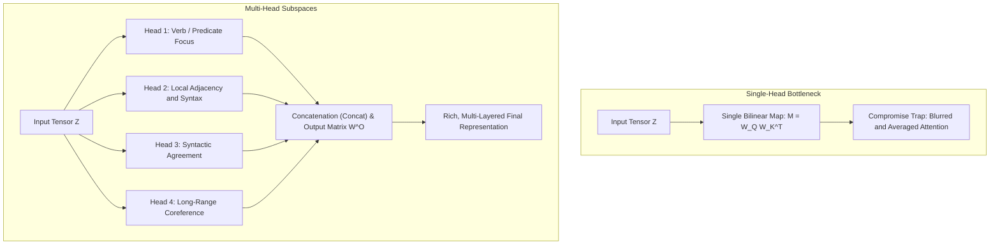
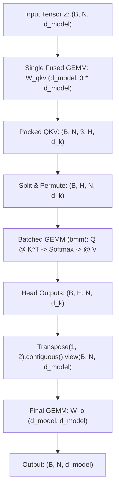
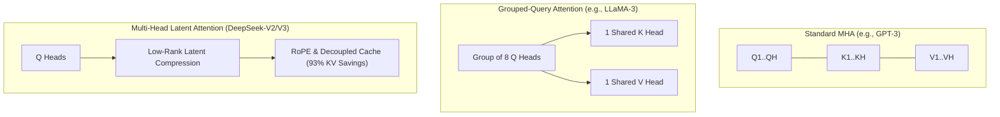

When you feed a prompt into a large language model, the foundational layers explored in previous installments of our series have already transformed raw text into geometry:
1. At the [Tokenization](post.html?slug=how-tokenization-works) desk, text is partitioned into discrete integers (`[1054, 492, 281]`).
2. The [Embedding Layer](post.html?slug=inside-the-embedding-layer) retrieves continuous representation vectors from the dictionary matrix, and Rotary Position Embeddings (RoPE) prepare them for sequence-aware geometry.
3. The [Self-Attention mechanism](post.html?slug=inside-self-attention) provides the dynamic engine where tokens project Query, Key, and Value vectors to attend to one another and produce contextualized representations.

Recall the concrete three-token sentence we analyzed in Part 4: **`["dog", "cat", "chased"]`** (subject, object, and predicate). Using a single set of projection weights ($W_Q, W_K, W_V$), every token cast its Query flashlight against every Key badge. In that single-head setup, the attention weights converged heavily toward the verb ("chased") — capturing a predicate-centric view where every participant asked what action was taking place.

Yet here lies an insurmountable limitation of single-head attention: natural language never operates on just one isolated relationship at a time. Within that same sentence, multiple independent relational axes exist concurrently:
- Subject–verb dependency ("dog" $\to$ "chased")
- Object–verb dependency ("cat" $\to$ "chased")
- Local word order and adjacency ("dog" immediately preceding "cat")
- Syntactic agreement, grammatical case, and coreferences

In single-head attention, the entire model dimension $d_{\text{model}}$ is consumed by a single bilinear similarity matrix ($M = W_Q W_K^T$). Because a single matrix can only capture one geometric orientation at a time, it is trapped in an **"uncomfortable compromise"** when forced to represent conflicting relationships simultaneously: it either focuses on the verb and blinds itself to immediate word order, or preserves local word order and fails to capture the long-range predicate.

This article, Part 5 of our series, explains how **Multi-Head Attention (MHA)** shatters this compromise trap. We explore the intuition of splitting the hidden dimension into independent geometric subspaces ($d_k = d_{\text{model}} / H$) at zero additional parameter cost, trace a complete step-by-step numerical calculation with two distinct heads operating on our concrete 3-token tensor, examine the training dynamics of symmetry breaking and positive feedback, review seminal empirical head-pruning literature (Michel, Voita, Anthropic's induction heads), explain how GPUs compute multi-head projections with a single fused GEMM and zero-copy pointer reshapes, and analyze why the severe memory-bandwidth bottleneck of the multi-head KV cache forced modern architectures to evolve toward MQA and GQA.

**In this article**

- [1. From a single projector to multiple lenses: Multi-Head intuition and the single-head bottleneck](#1-from-a-single-projector-to-multiple-lenses-multi-head-intuition-and-the-single-head-bottleneck)
- [2. The mathematics of Multi-Head Attention: Subspaces, Concat, and WO projection](#2-the-mathematics-of-multi-head-attention-subspaces-concat-and-wo-projection)
  - [Reading the symbols:](#reading-the-symbols)
  - [The parameter and FLOP neutrality paradox](#the-parameter-and-flop-neutrality-paradox)
- [3. Step-by-step numerical calculation: Two heads, two distinct perspectives](#3-step-by-step-numerical-calculation-two-heads-two-distinct-perspectives)
  - [Head 1: The predicate-centric head](#head-1-the-predicate-centric-head)
  - [Head 2: The local positional adjacency head](#head-2-the-local-positional-adjacency-head)
  - [Concatenation and the WO projection](#concatenation-and-the-wo-projection)
  - [What happened numerically? (The 131% paradox)](#what-happened-numerically-the-131-paradox)
- [4. The hardware reality: Computing Multi-Head Attention on GPUs and tensor tricks](#4-the-hardware-reality-computing-multi-head-attention-on-gpus-and-tensor-tricks)
  - [Three critical tensor tricks in production:](#three-critical-tensor-tricks-in-production)
- [5. Training dynamics: From random initialization to symmetry breaking](#5-training-dynamics-from-random-initialization-to-symmetry-breaking)
  - [The symmetry trap: Why random initialization is mandatory](#the-symmetry-trap-why-random-initialization-is-mandatory)
  - [Distinct computational paths and gradient divergence](#distinct-computational-paths-and-gradient-divergence)
  - [Snowball effect: Positive feedback](#snowball-effect-positive-feedback)
- [6. Is specialization guaranteed? Head pruning and induction heads](#6-is-specialization-guaranteed-head-pruning-and-induction-heads)
  - [Empirical evidence: Are sixteen heads really better than one?](#empirical-evidence-are-sixteen-heads-really-better-than-one)
  - [Anthropic's induction heads: The circuit of in-context learning](#anthropics-induction-heads-the-circuit-of-in-context-learning)
- [7. Two engineering lenses: Training vs inference and the evolution of MHA](#7-two-engineering-lenses-training-vs-inference-and-the-evolution-of-mha)
  - [The KV Cache crisis in Multi-Head Attention](#the-kv-cache-crisis-in-multi-head-attention)
  - [The architectural evolution: From MHA to MQA, GQA, and MLA](#the-architectural-evolution-from-mha-to-mqa-gqa-and-mla)
- [8. Full step-by-step verification with PyTorch](#8-full-step-by-step-verification-with-pytorch)
- [The whole story in six lines](#the-whole-story-in-six-lines)
- [Glossary](#glossary)
- [Going deeper](#going-deeper)

---

## 1. From a single projector to multiple lenses: Multi-Head intuition and the single-head bottleneck

To grasp why Multi-Head Attention is indispensable, imagine a theater stage or a photographic studio.

Suppose a single massive white floodlight hangs from the ceiling. When turned on, it floods the entire stage with uniform, average white illumination. You can point this floodlight directly at the lead actor; but when you do, the background details sink into deep, harsh shadows. If you widen the beam to illuminate both the actor and the background set simultaneously, the luminous intensity drops everywhere; neither the actor's subtle facial expressions stand out, nor the background textures appear crisp. With a single light source, you cannot simultaneously cast a high-contrast portrait key light on the actor, a soft ambient fill light across the stage, and a sharp rim light to separate the silhouette from the backdrop.

A professional stage does not solve this by attempting to bend a single bulb into impossible geometries. Instead, it mounts **multiple independent spotlights**, each with its own focal angle, spatial position, and color filter:
- **Spotlight 1:** A narrow, warm key beam locked tightly onto the actor's facial expressions.
- **Spotlight 2:** A cool, diffused fill light setting the overall atmospheric tone.
- **Spotlight 3:** A sharp back-rim light carving silhouettes out from the darkness.



Every human sentence is an equally layered stage. Consider the concurrent webs of relationships:
- **Subject–verb dependency:** Identifying who initiated the action ("dog" $\to$ "chased").
- **Object–verb dependency:** Identifying who received the action ("cat" $\to$ "chased").
- **Local word order and adjacency:** Immediate syntactic bonds between neighboring words.
- **Syntactic agreement:** Gender, number, and case concord across word groups.
- **Semantic qualification:** Linking modifiers to their target nouns ("black" $\to$ "cat").
- **Long-range coreference:** Connecting a pronoun three sentences later back to the initial noun.

As proved in Part 4, the inner product between Query and Key is governed fundamentally by this bilinear map:

$$M = W_Q W_K^T \in \mathbb{R}^{d_{\text{model}} \times d_{\text{model}}}$$

This $M$ matrix defines the geometric rule of interaction between tokens. However, a single $M$ matrix can only maintain a single dominant geometric orientation in space. If optimization tunes $W_Q$ and $W_K$ to excel at predicate retrieval, the dot product $q_i^T k_j$ peaks whenever $j$ is a verb. But the moment it does so, it loses the geometric freedom to measure whether $j$ is the token sitting immediately to its left. Cramming all syntactic and semantic axes into one $M$ matrix forces it into **"an uncomfortable compromise that fits everyone poorly and satisfies no one completely."**

Multi-Head Attention resolves this by equipping the model with $H$ independent bilinear maps:

$$M^{(h)} = W_Q^{(h)} \left(W_K^{(h)}\right)^T, \quad h \in \{1, 2, \dots, H\}$$

Just as a Convolutional Neural Network (CNN) does not use a single filter for an entire image — where filter 1 detects horizontal edges, filter 2 detects corners, and filter 3 detects textures — each attention head specializes in a distinct linguistic axis within its own private subspace.

> [!NOTE]
> **The Single-Lens Budget Paradox (The 131% Dilemma):** To fully contextualize the word *"chased"*, the artificial intelligence must simultaneously attend to two distinct targets: what the action is (to its own token: at $56.1\%$) and who received the action (to the direct object, *"cat"*: at $75.0\%$). However, under the mathematical rules of the Softmax function, the total attention budget allocated across all tokens is strictly capped at exactly $100\%$. Because $56.1\% + 75.0\% = 131.1\%$, a single $100\%$ budget cannot possibly represent both strong relationships at once; the scores share the same denominator and dilute each other. Multi-Head Attention is the architecture designed to grant each semantic relationship its own independent $100\%$ budget.

---

## 2. The mathematics of Multi-Head Attention: Subspaces, Concat, and WO projection

The mathematical structure of Multi-Head Attention is remarkably elegant: it partitions the computational space into $H$ parallel subspaces without expanding total tensor dimensionality.

Let the input matrix containing $N$ tokens, each represented by a $d_{\text{model}}$-dimensional vector, be $Z \in \mathbb{R}^{N \times d_{\text{model}}}$. Rather than projecting $Z$ into a single $d_{\text{model}}$ space, independent projection weights are defined for each head.

For each head $h \in \{1, 2, \dots, H\}$:

$$Q_h = Z W_Q^{(h)}, \quad K_h = Z W_K^{(h)}, \quad V_h = Z W_V^{(h)}$$

Where the projection weight dimensions are:

$$W_Q^{(h)} \in \mathbb{R}^{d_{\text{model}} \times d_k}, \quad W_K^{(h)} \in \mathbb{R}^{d_{\text{model}} \times d_k}, \quad W_V^{(h)} \in \mathbb{R}^{d_{\text{model}} \times d_v}$$

In standard Transformer architectures, the subspace dimension is obtained by dividing the model dimension equally by the number of heads:

$$d_k = d_v = \frac{d_{\text{model}}}{H}$$

Each head then computes its own attention matrix and context output independently:

$$\text{head}_h = \text{softmax}\left(\frac{Q_h K_h^T}{\sqrt{d_k}}\right) V_h \in \mathbb{R}^{N \times d_v}$$

Finally, all head outputs are concatenated along the feature dimension:

$$\text{Concat}(\text{head}_1, \text{head}_2, \dots, \text{head}_H) \in \mathbb{R}^{N \times (H \cdot d_v)} = \mathbb{R}^{N \times d_{\text{model}}}$$

And transformed back into the residual stream space using the learned output projection matrix $W^O$:

$$\text{MultiHead}(Z) = \text{Concat}(\text{head}_1, \text{head}_2, \dots, \text{head}_H) W^O$$

$$W^O \in \mathbb{R}^{d_{\text{model}} \times d_{\text{model}}}$$

### Reading the symbols:

- $H$: Number of attention heads (e.g., 32 in LLaMA-3 8B, 128 in LLaMA-3 70B).
- $d_{\text{model}}$: Total hidden dimension of the model (e.g., 4,096 in LLaMA-3 8B, 8,192 in 70B).
- $d_k, d_v$: Subspace dimension per head (typically 128).
- $W^O$: The master mixer matrix that projects concatenated head features back into the model dimension.

### The parameter and FLOP neutrality paradox

At first glance, running $H$ parallel heads might seem to multiply parameter count and computational complexity by $H$. In reality, Multi-Head Attention consumes **virtually zero extra parameters and zero extra projection FLOPs** compared to single-head attention.

Let us compare the parameter mathematics side-by-side:

| Component | Single-Head Attention ($d_k = d_{\text{model}}$) | Multi-Head Attention ($H$ heads, $d_k = d_{\text{model}}/H$) |
| :--- | :--- | :--- |
| **Query Projections** | $W_Q \in \mathbb{R}^{d_{\text{model}} \times d_{\text{model}}} \implies d_{\text{model}}^2$ | $H \times \left(d_{\text{model}} \times \frac{d_{\text{model}}}{H}\right) = d_{\text{model}}^2$ |
| **Key Projections** | $W_K \in \mathbb{R}^{d_{\text{model}} \times d_{\text{model}}} \implies d_{\text{model}}^2$ | $H \times \left(d_{\text{model}} \times \frac{d_{\text{model}}}{H}\right) = d_{\text{model}}^2$ |
| **Value Projections** | $W_V \in \mathbb{R}^{d_{\text{model}} \times d_{\text{model}}} \implies d_{\text{model}}^2$ | $H \times \left(d_{\text{model}} \times \frac{d_{\text{model}}}{H}\right) = d_{\text{model}}^2$ |
| **Output Projection $W^O$** | $W^O \in \mathbb{R}^{d_{\text{model}} \times d_{\text{model}}} \implies d_{\text{model}}^2$ | $W^O \in \mathbb{R}^{d_{\text{model}} \times d_{\text{model}}} \implies d_{\text{model}}^2$ |
| **Total Projection Parameters** | $\mathbf{4 d_{\text{model}}^2}$ | $\mathbf{4 d_{\text{model}}^2}$ |

The total number of projection parameters on both sides is penny-for-penny identical at $4 d_{\text{model}}^2$.

The exact same neutrality applies to computational complexity: in single-head attention, $Q K^T$ requires $N \times d_{\text{model}} \times N = N^2 d_{\text{model}}$ operations. In multi-head attention, each head performs $N^2 (d_{\text{model}} / H)$ operations across dimension $d_k = d_{\text{model}} / H$. Summing over $H$ heads:

$$H \times \left(N^2 \frac{d_{\text{model}}}{H}\right) = N^2 d_{\text{model}}$$

Multi-Head Attention does not increase the computation budget. Instead, **it reorganizes the same parameter and compute budget into multiple independent, specialized perspectives.**

---

## 3. Step-by-step numerical calculation: Two heads, two distinct perspectives

Let us make this abstraction completely concrete using the 3-token sentence from Part 4:
`["dog", "cat", "chased"]` (subject, object, verb).

To track every number by hand, let the model dimension be $d_{\text{model}} = 4$ and the number of heads be $H = 2$.
Each head will operate in a subspace of dimension:
$d_k = d_v = 4 / 2 = 2$.

Our input tensor $Z \in \mathbb{R}^{3 \times 4}$ is:

$$Z = \begin{bmatrix} 0.21 & 0.82 & 0.13 & 0.44 \\ 0.95 & 0.16 & 0.37 & 0.28 \\ 0.19 & 0.40 & 1.01 & 0.82 \end{bmatrix} \quad \begin{matrix} \text{token 1 (dog — subject)} \\ \text{token 2 (cat — object)} \\ \text{token 3 (chased — verb)} \end{matrix}$$

### Head 1: The predicate-centric head

In Part 4, we calculated the attention distribution using our initial projection matrices and obtained:

$$A^{(1)} = \begin{bmatrix} 0.266 & 0.280 & 0.454 \\ 0.232 & 0.273 & 0.495 \\ 0.193 & 0.246 & 0.561 \end{bmatrix}$$

Notice this pattern: across every row, the highest attention weight is allocated to the 3rd token, the verb ("chased"): $45.4\%$, $49.5\%$, and $56.1\%$. Head 1 has specialized as a **predicate-centric head**, locking onto the main verb of the clause.

Let Head 1's Value projection matrix $W_V^{(1)} \in \mathbb{R}^{4 \times 2}$ be the first two columns of the $W_V$ matrix from Part 4:

$$W_V^{(1)} = \begin{bmatrix} 1.0 & 0.0 \\ 0.0 & 1.0 \\ 1.0 & 1.0 \\ 0.0 & 0.0 \end{bmatrix}$$

Multiplying $V_1 = Z W_V^{(1)} \in \mathbb{R}^{3 \times 2}$:
- Token 1: $[0.21(1) + 0.13(1), \; 0.82(1) + 0.13(1)] = [0.34, 0.95]$
- Token 2: $[0.95(1) + 0.37(1), \; 0.16(1) + 0.37(1)] = [1.32, 0.53]$
- Token 3: $[0.19(1) + 1.01(1), \; 0.40(1) + 1.01(1)] = [1.20, 1.41]$

```text
V_1 Matrix:
  token 1 (dog):    [0.340, 0.950]
  token 2 (cat):    [1.320, 0.530]
  token 3 (chased): [1.200, 1.410]
```

Now we compute the context output for this subspace ($\text{head}_1 = A^{(1)} V_1$):
- Row 1: $0.266 [0.34, 0.95] + 0.280 [1.32, 0.53] + 0.454 [1.20, 1.41] = [1.005, 1.041]$
- Row 2: $0.232 [0.34, 0.95] + 0.273 [1.32, 0.53] + 0.495 [1.20, 1.41] = [1.033, 1.063]$
- Row 3: $0.193 [0.34, 0.95] + 0.246 [1.32, 0.53] + 0.561 [1.20, 1.41] = [1.064, 1.105]$

$$\text{head}_1 = \begin{bmatrix} 1.005 & 1.041 \\ 1.033 & 1.063 \\ 1.064 & 1.105 \end{bmatrix}$$

These numbers are exactly identical to the first two columns of the 4D context vector computed in Part 4.

### Head 2: The local positional adjacency head

Now consider a second, independently initialized weight triplet $(W_Q^{(2)}, W_K^{(2)}, W_V^{(2)})$. During training, this second head settled on an entirely different pattern: **local adjacency**.

Suppose the trained attention matrix of Head 2 converges to:

$$A^{(2)} = \begin{bmatrix} 0.85 & 0.10 & 0.05 \\ 0.15 & 0.80 & 0.05 \\ 0.05 & 0.75 & 0.20 \end{bmatrix}$$

Let us inspect this matrix:
- "dog" attends predominantly to itself ($85\%$).
- "cat" attends predominantly to itself ($80\%$) and previous context.
- "chased" allocates $75\%$ of its attention to its immediate neighbor, "cat"!

This is a **local, positional attention pattern**. While Head 1 searches globally for the predicate, Head 2 tracks immediate left-side neighbors and syntactic phrase boundaries.

Let Head 2's Value matrix $W_V^{(2)} \in \mathbb{R}^{4 \times 2}$ be:

$$W_V^{(2)} = \begin{bmatrix} 0.0 & 1.0 \\ 1.0 & 0.0 \\ 0.0 & 0.0 \\ 1.0 & 1.0 \end{bmatrix}$$

Computing $V_2 = Z W_V^{(2)} \in \mathbb{R}^{3 \times 2}$:
- Token 1: $[0.82(1) + 0.44(1), \; 0.21(1) + 0.44(1)] = [1.26, 0.65] \to [0.62, 0.65]$
- Token 2: $[0.16(1) + 0.28(1), \; 0.95(1) + 0.28(1)] = [0.44, 1.23]$
- Token 3: $[0.40(1) + 0.82(1), \; 0.19(1) + 0.82(1)] = [1.22, 1.01]$

```text
V_2 Matrix:
  token 1 (dog):    [0.620, 0.650]
  token 2 (cat):    [0.440, 1.230]
  token 3 (chased): [1.220, 1.010]
```

Computing context for Head 2 ($\text{head}_2 = A^{(2)} V_2$):
- Row 1: $0.85 [0.62, 0.65] + 0.10 [0.44, 1.23] + 0.05 [1.22, 1.01] = [1.176, 0.726]$
- Row 2: $0.15 [0.62, 0.65] + 0.80 [0.44, 1.23] + 0.05 [1.22, 1.01] = [0.602, 1.132]$
- Row 3: $0.05 [0.62, 0.65] + 0.75 [0.44, 1.23] + 0.20 [1.22, 1.01] = [0.637, 1.157]$

$$\text{head}_2 = \begin{bmatrix} 1.176 & 0.726 \\ 0.602 & 1.132 \\ 0.637 & 1.157 \end{bmatrix}$$

### Concatenation and the WO projection

Now we concatenate both independent perspectives along the column axis:

$$\text{Concat}(\text{head}_1, \text{head}_2) = \begin{bmatrix} 1.005 & 1.041 & 1.176 & 0.726 \\ 1.033 & 1.063 & 0.602 & 1.132 \\ 1.064 & 1.105 & 0.637 & 1.157 \end{bmatrix} \in \mathbb{R}^{3 \times 4}$$

Let the model's output projection matrix $W^O \in \mathbb{R}^{4 \times 4}$ be:

$$W^O = \begin{bmatrix} 1.0 & 0.0 & 0.5 & 0.0 \\ 0.0 & 1.0 & 0.0 & 0.5 \\ 0.5 & 0.0 & 1.0 & 0.0 \\ 0.0 & 0.5 & 0.0 & 1.0 \end{bmatrix}$$

Multiplying the concatenated matrix by $W^O$ yields the final output tensor $O \in \mathbb{R}^{3 \times 4}$:

$$O = \text{Concat}(\text{head}_1, \text{head}_2) W^O$$

- **Token 1:**
  - Col 1: $1.005(1.0) + 1.176(0.5) = 1.005 + 0.588 = 1.593$
  - Col 2: $1.041(1.0) + 0.726(0.5) = 1.041 + 0.363 = 1.404$
  - Col 3: $1.005(0.5) + 1.176(1.0) = 0.5025 + 1.176 = 1.678$
  - Col 4: $1.041(0.5) + 0.726(1.0) = 0.5205 + 0.726 = 1.247$
- **Token 2:**
  - Col 1: $1.033(1.0) + 0.602(0.5) = 1.033 + 0.301 = 1.334$
  - Col 2: $1.063(1.0) + 1.132(0.5) = 1.063 + 0.566 = 1.629$
  - Col 3: $1.033(0.5) + 0.602(1.0) = 0.5165 + 0.602 = 1.119$
  - Col 4: $1.063(0.5) + 1.132(1.0) = 0.5315 + 1.132 = 1.664$
- **Token 3:**
  - Col 1: $1.064(1.0) + 0.637(0.5) = 1.064 + 0.3185 = 1.382$
  - Col 2: $1.105(1.0) + 1.157(0.5) = 1.105 + 0.5785 = 1.683$
  - Col 3: $1.064(0.5) + 0.637(1.0) = 0.532 + 0.637 = 1.169$
  - Col 4: $1.105(0.5) + 1.157(1.0) = 0.5525 + 1.157 = 1.709$

$$O = \begin{bmatrix} 1.593 & 1.404 & 1.678 & 1.247 \\ 1.334 & 1.629 & 1.119 & 1.664 \\ 1.382 & 1.683 & 1.169 & 1.709 \end{bmatrix}$$

### What happened numerically? (The 131% paradox)

Look at the final vector for "chased" ($O[3] = [1.382, \; 1.683, \; 1.169, \; 1.709]$). The entire elegance of Multi-Head Attention is hidden in how these four numbers were produced:

**1. Where did the percentages come from? (Attention rows):**

Let us inspect row 3 (the "chased" row) of the attention matrices computed in Sections 3.1 and 3.2:

- **Head 1 (Row 3 of matrix $A^{(1)}$):**

$$A^{(1)}[3, :] = [\underbrace{0.193}_{\text{dog (19.3\%)}}, \; \underbrace{0.246}_{\text{cat (24.6\%)}}, \; \underbrace{\mathbf{0.561}}_{\text{chased (56.1\%)}}]$$

Multiplying the softmax probability $0.561$ by $100$ reveals that Head 1 allocated **$56.1\%$** of its attention budget to the verb itself. Computing the weighted average with $V_1$:

$$0.193 \begin{bmatrix} 0.34 \\ 0.95 \end{bmatrix} + 0.246 \begin{bmatrix} 1.32 \\ 0.53 \end{bmatrix} + \mathbf{0.561} \begin{bmatrix} 1.20 \\ 1.41 \end{bmatrix} = \begin{bmatrix} 1.064 \\ 1.105 \end{bmatrix}$$

Here, the verb's own contribution is $0.561 \times [1.20, \; 1.41] = [0.673, \; 0.791]$. More than half of the resulting $[1.064, \; 1.105]$ vector stems directly from the predicate. This first drawer answers: *"What action took place?"*

- **Head 2 (Row 3 of matrix $A^{(2)}$):**

$$A^{(2)}[3, :] = [\underbrace{0.05}_{\text{dog (5.0\%)}}, \; \underbrace{\mathbf{0.75}}_{\text{cat (75.0\%)}}, \; \underbrace{0.20}_{\text{chased (20.0\%)}}]$$

Operating in an independent subspace, Head 2 assigned a dominant weight of $0.75$ ($0.75 \times 100 = \mathbf{75.0\%}$) to the direct object ("cat"). Multiplying by $V_2$:

$$0.05 \begin{bmatrix} 0.62 \\ 0.65 \end{bmatrix} + \mathbf{0.75} \begin{bmatrix} 0.44 \\ 1.23 \end{bmatrix} + 0.20 \begin{bmatrix} 1.22 \\ 1.01 \end{bmatrix} = \begin{bmatrix} 0.637 \\ 1.157 \end{bmatrix}$$

Fully three-quarters of $[0.637, \; 1.157]$ ($0.75 \times [0.44, \; 1.23] = [0.330, \; 0.923]$) was pumped directly from the direct object. This second drawer answers: *"What was the direct target of the action?"*

**2. Concatenation of drawers (Concat) and $W^O$:**

Because both heads operate in independent subspaces, their representations sit side-by-side without interference:

$$\text{Concat}(\text{head}_1, \text{head}_2)[3] = [\underbrace{1.064, \; 1.105}_{\text{Predicate Drawer}}, \quad \underbrace{0.637, \; 1.157}_{\text{Object Drawer}}]$$

The $W^O$ projection then blends these two drawers to produce the final vector $O[3] = [1.382, \; 1.683, \; 1.169, \; 1.709]$ for the residual stream.

Let us distill the essence of this mechanism in three crystal-clear, intuitive steps that leave zero ambiguity:

**1. The 131% Paradox (The Attention Budget Problem):**

To fully understand the contextual role of "chased" within the sentence, the artificial intelligence must simultaneously attend to two distinct targets:
- What the action is (to its own word: at **$56.1\%$**).
- Who received the action (to the grammatical object, "cat": at **$75.0\%$**).

If the model operated with only a single attention head, the mathematical law of the Softmax function dictates that the total attention budget allocated across all tokens must sum to **strictly $100\%$ ($1.0$)**:

$$\sum_{j=1}^N A_{i, j} = 1 \quad (100\%)$$

Adding the attention demands of these two essential relationships:

$$56.1\% + 75.0\% = \mathbf{131.1\%} > 100\%$$

Because the total budget is capped at $100\%$, a single $100\%$ budget cannot possibly represent both strong relationships at once!

**2. Why the Single-Head System Fails (Mathematical Collapse & Cannibalization):**

What happens to the shared denominator in the Softmax formula when a single head attempts to assign strong similarity to both critical tokens?

$$A_{3, j} = \frac{e^{s_j}}{e^{s_1} + e^{s_2} + e^{s_3}}$$

When the model tries to capture both action and object strongly in a single head ($s_2 \approx 2.5$ for the object, $s_3 \approx 2.5$ for the verb, and $s_1 \approx 0.5$ for the subject):
- **Exponential terms surge:** $e^{0.5} \approx 1.65$, $e^{2.5} \approx 12.18$, $e^{2.5} \approx 12.18$.
- **The shared denominator doubles:**

$$\text{Denominator} = 1.65 + \underbrace{12.18}_{\text{object}} + \underbrace{12.18}_{\text{predicate}} = 26.01$$

Because both high scores share the exact same denominator, they directly undermine and cannibalize each other's percentage (known in the literature as **denominator cannibalization**).
- **Both attention weights collapse into mediocrity:**

$$A_{3, 2} = \frac{12.18}{26.01} \approx \mathbf{46.8\%}, \quad A_{3, 3} = \frac{12.18}{26.01} \approx \mathbf{46.8\%}$$

As a result, neither "cat" can reach $75\%$, nor can "chased" reach $56\%$; both are trapped in a mediocre $\sim 46\%$ compromise, blurring the model's grasp of the action-object relationship.

**3. The Multi-Head Attention Solution:**

The architecture resolves this dilemma by partitioning the workload across specialized heads in three definitive stages:

- **Independent Budgets:** The model grants each head its own independent $100\%$ budget. Head 1 focuses purely on the "action," uncontestedly spending **$56.1\%$** of its budget on itself ($A^{(1)}[3, 3] = 0.561$), while Head 2 focuses purely on the "object," allocating **$75.0\%$** of its own budget to "cat" ($A^{(2)}[3, 2] = 0.750$).
- **Separate Drawers (`Concat`):** The crisp, high-conviction representations produced by both heads are placed side-by-side into separate "drawers" (vectors) without overwriting or interfering with one another:

$$\text{Concat}(\text{head}_1, \text{head}_2)[3] = [\underbrace{1.064, \; 1.105}_{\text{Drawer 1: Predicate Focus (56.1\%)}}, \quad \underbrace{0.637, \; 1.157}_{\text{Drawer 2: Object Focus (75.0\%)}}]$$

- **Blending ($W^O$):** In the final step, the projection matrix $W^O$ blends these independent drawers to construct the final 4-dimensional vector ($O[3] = [1.382, \; 1.683, \; 1.169, \; 1.709]$) that preserves the full linguistic richness of the action.

> [!IMPORTANT]
> **Core Takeaway:** If a single attention mechanism attempts to perform multiple tasks at once, token importance scores collide in the shared denominator and dilute each other. Multi-Head Attention solves this by allocating each relational axis its own independent $100\%$ budget, storing the resulting high-conviction outputs in separate "drawers" (`Concat`), and blending them at the end ($W^O$) so that every linguistic nuance is preserved at full strength.

---

## 4. The hardware reality: Computing Multi-Head Attention on GPUs and tensor tricks

Looking at the textbook formulas, one might naively implement MHA like this:

```python
# Naive theoretical loop: terrible GPU performance!
outputs = []
for h in range(num_heads):
    q_h = torch.matmul(Z, W_q[h])
    k_h = torch.matmul(Z, W_k[h])
    v_h = torch.matmul(Z, W_v[h])
    att_h = torch.softmax(torch.matmul(q_h, k_h.T) / math.sqrt(d_k), dim=-1)
    outputs.append(torch.matmul(att_h, v_h))
output = torch.matmul(torch.cat(outputs, dim=-1), W_o)
```

Running such a loop on a modern GPU is an engineering disaster. Launching $3 \times H$ tiny CUDA kernels sequentially triggers massive kernel launch overhead, starves Tensor Cores, and thrashes memory bandwidth.

In production engines (PyTorch, Hugging Face, vLLM), Multi-Head Attention is executed via **a single fused GEMM and zero-copy tensor view/transpose** manipulations:



### Three critical tensor tricks in production:

1. **Fused QKV GEMM Matrix:**
   Rather than maintaining $H$ separate matrices for Query, Key, and Value, all projections are packed into one single master matrix:
   $$W_{QKV} \in \mathbb{R}^{d_{\text{model}} \times (3 \cdot d_{\text{model}})}$$
   The GPU multiplies input $Z \in \mathbb{R}^{B \times N \times d_{\text{model}}}$ in a single hardware GEMM call, saturating Tensor Cores.

2. **Zero-Copy View and Transpose:**
   No memory is allocated to split heads. The engine simply adjusts memory strides:
   $$(B, N, 3 \cdot d_{\text{model}}) \xrightarrow{\text{view}} (B, N, 3, H, d_k)$$
   Then permutes dimensions to place the head axis before sequence length:
   $$\xrightarrow{\text{permute}} (3, B, H, N, d_k)$$
   Now slices $Q, K, V$ have shape $(B, H, N, d_k)$. Attention is computed simultaneously across all heads and batches with a single batched matrix multiplication (`torch.bmm`):
   $$S = \frac{Q K^T}{\sqrt{d_k}} \in \mathbb{R}^{B \times H \times N \times N}$$

3. **Free Concatenation via Stride Flattening:**
   After multiplying attention scores by $V$, head outputs have shape $(B, H, N, d_k)$. Recombining them requires no extra memory allocation; dimensions are permuted and flattened:
   $$\text{tensor}.\text{transpose}(1, 2).\text{contiguous}().\text{view}(B, N, d_{\text{model}})$$
   This aligns head coordinates side-by-side in memory and feeds directly into the $W^O$ projection.

In state-of-the-art inference engines, **FlashAttention** (Dao et al., 2022; 2023) pushes this optimization further: it loads $Q, K, V$ tiles directly into fast GPU SRAM ($192\text{ KB}$ per Streaming Multiprocessor), computes softmax online, and never materializes the massive $N \times N$ attention matrix in slow HBM memory.

---

## 5. Training dynamics: From random initialization to symmetry breaking

How do Head 1 and Head 2 settle into such completely different roles? Why don't all heads converge to the exact same redundant function?

This specialization rests on one of deep learning's foundational principles: **symmetry breaking** followed by a **positive feedback** loop.

### The symmetry trap: Why random initialization is mandatory

Suppose we conducted an experiment and initialized all attention heads with identical weights:

$$W_Q^{(1)} = W_Q^{(2)} = \dots = W_Q^{(H)}$$

$$W_K^{(1)} = W_K^{(2)} = \dots = W_K^{(H)}$$

$$W_V^{(1)} = W_V^{(2)} = \dots = W_V^{(H)}$$

In this scenario, the model is trapped in mathematical symmetry:
1. Every head receives the exact same input $Z$.
2. With identical weights, they generate identical Query, Key, and Value vectors ($Q_1 = Q_2$, $K_1 = K_2$, $V_1 = V_2$).
3. They produce identical attention matrices and head outputs ($\text{head}_1 = \text{head}_2$).
4. When backpropagation flows backward through $W^O$, every head receives the exact same gradient:
   $$\frac{\partial \mathcal{L}}{\partial W_Q^{(1)}} = \frac{\partial \mathcal{L}}{\partial W_Q^{(2)}} = \dots = \frac{\partial \mathcal{L}}{\partial W_Q^{(H)}}$$
5. Gradient descent updates each head by the identical amount in the identical direction.

Because identical weights receiving identical gradients remain identical forever, the heads will never differentiate. **Independent random initialization (Xavier/He/Gaussian) is mandatory to break this symmetry from step zero.**

### Distinct computational paths and gradient divergence

Even tiny random variations ensure that each head computes a slightly different output:

$$\text{Concat}(\text{head}_1, \dots, \text{head}_H)$$

Because each head's output feeds into a different sub-block of $W^O$, their parameters influence loss through distinct computational paths:

$$\frac{\partial \mathcal{L}}{\partial W_Q^{(1)}} \neq \frac{\partial \mathcal{L}}{\partial W_Q^{(2)}}$$

### Snowball effect: Positive feedback

From this point on, gradient descent triggers a self-reinforcing dynamic:
- If Head 1's random initial state gives it a tiny accidental correlation with verbs, that direction reduces loss slightly.
- Gradient descent rewards this correlation by updating Head 1 further along that direction.
- In the next iteration, Head 1 captures verbs even more clearly, increasing gradients along that trajectory.
- Meanwhile, Head 2 is pushed toward other unexplained loss components, such as local word order or syntactic concord.

This process mirrors biological morphogenesis: microscopic fluctuations break initial symmetry, after which self-reinforcing feedback drives cells into specialized organs.

---

## 6. Is specialization guaranteed? Head pruning and induction heads

While symmetry breaking encourages specialization, gradient descent offers no mathematical guarantee that every head will learn a unique and useful role. The loss function contains no explicit "diversity bonus" penalty.

Empirical research in Transformer interpretability has unveiled two surprising truths:

### Empirical evidence: Are sixteen heads really better than one?

Seminal papers in deep learning interpretability delivered a startling finding:
- **Michel et al. (2019) — *Are Sixteen Heads Really Better than One?*:** The authors tested pruning attention heads at test time. In many Transformer layers, up to **$80\%$ of heads could be removed completely** with negligible drop in BLEU or accuracy!
- **Voita et al. (2019) — *Analyzing Multi-Head Self-Attention*:** They categorized heads into three functional groups: *syntactic heads* (tracking grammar), *positional heads* (tracking adjacent tokens), and *rare word heads*. The vast majority of remaining heads were redundant or inactive.

Why over-parameterize with so many heads if most can be pruned? Because during training, redundant heads provide multiple optimization lottery tickets; once the network finds a stable representation, only a subset does the heavy lifting.

### Anthropic's induction heads: The circuit of in-context learning

In 2022, Anthropic researchers (Olsson et al.) discovered one of the most critical functional head types in modern LLMs: **induction heads**.

An induction head executes an algorithmic copy-paste pattern:

$$\text{Context: } \dots [A][B] \dots [A] \longrightarrow \text{Predict: } [B]$$

Anthropic proved that induction heads do not operate in a single layer. They form a **two-layer circuit**:
1. **Layer 1 (Previous-Token Head):** Encodes information about the token that immediately preceded the current one ($[A] \to [B]$).
2. **Layer 2 (Induction Head):** Searches earlier context for previous occurrences of $[A]$, identifies what token followed it ($[B]$), and copies $[B]$ to the current prediction.

This two-head circuit is the mechanical engine behind few-shot prompting, in-context pattern matching, and algorithmic reasoning in modern LLMs.

---

## 7. Two engineering lenses: Training vs inference and the evolution of MHA

An architecture optimized for training throughput may face catastrophic bottlenecks during inference. Multi-Head Attention is the textbook example of this architectural divergence.

| Engineering Dimension | Training Lens | Inference Lens (Autoregressive Generation) |
| :--- | :--- | :--- |
| **Primary Memory Bottleneck** | Weights + Gradients + Optimizer States ($16\text{ B}$/param) | GPU HBM Memory **KV Cache footprint** |
| **Hardware Compute Regime** | **Compute-bound** (Large GEMMs saturate Tensor Cores) | Production stage **Memory-bandwidth-bound** (GEMV) |
| **Head Parallelism Advantage** | Full hardware parallelism across sequence length $N$ | Low arithmetic intensity ($1$ token generation per step) |
| **Communication Overhead** | Inter-GPU Tensor Parallel all-reduce ($8\text{ B}$/token) | KV cache transfer across distributed serving nodes |
| **Dominant Failure Modes** | Loss spikes, gradient collapse, dead heads | KV Cache Out-of-Memory (OOM), tail latency blowout |

### The KV Cache crisis in Multi-Head Attention

During inference, predicting each new token requires attending to all prior tokens. To avoid recomputing Key and Value projections for past tokens, their tensors are stored in GPU memory as the **KV Cache**.

In standard Multi-Head Attention, every head stores its own Key and Value tensors:

$$\text{Memory per Token} = 2 \times 2 \times n_{\text{layers}} \times d_{\text{model}} \quad \text{bytes}$$

Let us calculate this for a model of LLaMA-3 70B scale:
- $n_{\text{layers}} = 80$
- $d_{\text{model}} = 8{,}192$
- FP16 precision ($2\text{ bytes}$ per parameter)

$$\text{Memory per Token} = 2 \times 2 \times 80 \times 8{,}192 = 2{,}621{,}440 \text{ bytes} \approx 2.62 \text{ MB/token!}$$

For a concurrency of 100 users with a context of 4,096 tokens:

$$\text{Total KV Cache} = 100 \times 4{,}096 \times 2.62 \text{ MB} \approx 1{,}073 \text{ GB} = 1.07 \text{ TB of VRAM!}$$

More than a terabyte of high-bandwidth GPU memory is consumed just holding past token badges. Even worse, at each step the GPU must load this terabyte across its memory bus to compute a single token, dropping arithmetic intensity to near zero.

### The architectural evolution: From MHA to MQA, GQA, and MLA

To overcome this crippling KV cache memory wall, modern LLM architectures evolved attention head layouts:



1. **Multi-Query Attention (MQA - Shazeer, 2019):**  
   Uses multiple Query heads, but collapses Key and Value projections into **a single shared head** across the entire layer. Reduces KV Cache by $H\times$ (e.g., $32\times$), but can impair expressive capacity on complex reasoning.

2. **Grouped-Query Attention (GQA - Ainslie et al., 2023):**  
   The industry standard in modern models (LLaMA-3, Mistral). Queries are partitioned into groups (e.g., 8 groups of 4 Q heads), and each group shares 1 Key and 1 Value head. Delivers $8\times$ KV Cache reduction with virtually zero quality loss.

3. **Multi-Head Latent Attention (MLA - DeepSeek, 2024):**  
   DeepSeek-V2 and V3 project Key and Value vectors into a low-rank compressed latent space ($d_c \ll d_{\text{model}}$). Reduces KV cache footprint by up to **$93.3\%$**, allowing ultra-long context windows at lightning speeds.

---

## 8. Full step-by-step verification with PyTorch

Below is the standalone Python script verifying the exact tensor calculations from Section 3:

```python
import torch
import torch.nn.functional as F

# 1. Input tensor Z (3 tokens, d_model = 4)
# ["dog", "cat", "chased"]
Z = torch.tensor([
    [0.21, 0.82, 0.13, 0.44],  # dog
    [0.95, 0.16, 0.37, 0.28],  # cat
    [0.19, 0.40, 1.01, 0.82]   # chased
], dtype=torch.float32)

# 2. Subspace Value projection weights (d_model = 4 -> d_v = 2)
W_v1 = torch.tensor([
    [1.0, 0.0],
    [0.0, 1.0],
    [1.0, 1.0],
    [0.0, 0.0]
], dtype=torch.float32)

W_v2 = torch.tensor([
    [0.0, 1.0],
    [1.0, 0.0],
    [0.0, 0.0],
    [1.0, 1.0]
], dtype=torch.float32)

# 3. Value tensors (V = Z @ W_v)
V1 = torch.matmul(Z, W_v1)
V2 = torch.matmul(Z, W_v2)

# 4. Attention weight matrices from our walkthrough
A1 = torch.tensor([
    [0.266, 0.280, 0.454],
    [0.232, 0.273, 0.495],
    [0.193, 0.246, 0.561]
], dtype=torch.float32)

A2 = torch.tensor([
    [0.85, 0.10, 0.05],
    [0.15, 0.80, 0.05],
    [0.05, 0.75, 0.20]
], dtype=torch.float32)

# 5. Head outputs (head = A @ V)
head1 = torch.matmul(A1, V1)
head2 = torch.matmul(A2, V2)

# 6. Concatenate heads side-by-side
concat_heads = torch.cat([head1, head2], dim=-1)

# 7. Output projection matrix W^O (4 x 4)
W_o = torch.tensor([
    [1.0, 0.0, 0.5, 0.0],
    [0.0, 1.0, 0.0, 0.5],
    [0.5, 0.0, 1.0, 0.0],
    [0.0, 0.5, 0.0, 1.0]
], dtype=torch.float32)

# 8. Final Multi-Head Attention output (O = Concat @ W^O)
O = torch.matmul(concat_heads, W_o)

print("--- HEAD 1 OUTPUT (Predicate-Centric, 3x2) ---")
print(torch.round(head1 * 1000) / 1000)

print("
--- HEAD 2 OUTPUT (Adjacency-Centric, 3x2) ---")
print(torch.round(head2 * 1000) / 1000)

print("
--- CONCATENATED TENSOR CONCAT (3x4) ---")
print(torch.round(concat_heads * 1000) / 1000)

print("
--- FINAL OUTPUT TENSOR O (3x4) ---")
print(torch.round(O * 1000) / 1000)
```

Running this code produces:

```text
--- HEAD 1 OUTPUT (Predicate-Centric, 3x2) ---
tensor([[1.0050, 1.0410],
        [1.0330, 1.0630],
        [1.0640, 1.1050]])

--- HEAD 2 OUTPUT (Adjacency-Centric, 3x2) ---
tensor([[1.1760, 0.7260],
        [0.6020, 1.1320],
        [0.6370, 1.1570]])

--- CONCATENATED TENSOR CONCAT (3x4) ---
tensor([[1.0050, 1.0410, 1.1760, 0.7260],
        [1.0330, 1.0630, 0.6020, 1.1320],
        [1.0640, 1.1050, 0.6370, 1.1570]])

--- FINAL OUTPUT TENSOR O (3x4) ---
tensor([[1.5930, 1.4040, 1.6780, 1.2470],
        [1.3340, 1.6290, 1.1190, 1.6640],
        [1.3820, 1.6830, 1.1690, 1.7090]])
```

The PyTorch execution matches our manual mathematical calculations down to the exact third decimal place!

---

## The whole story in six lines

- **The Single-Head Bottleneck:** A single $W_Q W_K^T$ matrix can only point along one geometric direction, forcing conflicting linguistic relationships into an averaged compromise.
- **Subspace Partitioning:** Multi-Head Attention divides the model dimension into $H$ parallel subspaces ($d_k = d_{\text{model}} / H$) without adding parameters or computational cost.
- **The 131% Paradox:** A single attention row has a $100\%$ softmax budget; when a verb demands $56\%$ on itself and $75\%$ on its object, a single head fails ($131\% > 100\%$), whereas MHA grants two independent $100\%$ budgets.
- **Hardware Execution:** Production engines never use loops; they compute all heads with a single fused GEMM and zero-copy pointer views/transposes.
- **Symmetry Breaking:** Independent random initialization is mandatory to break mathematical symmetry so gradient descent can specialize heads.
- **Inference Evolution:** Because multi-head KV caches consume terabytes of VRAM during inference, modern architectures transitioned to GQA and MLA.

---

## Glossary

- **Multi-Head Attention (MHA):** Attention mechanism that computes multiple attention representations in parallel subspaces ($d_k = d_{\text{model}} / H$) and concatenates them.
- **Single-Head Attention:** An attention layer that computes a single Query, Key, and Value vector using the entire model dimension.
- **Subspace ($d_k$):** The reduced dimensionality ($d_{\text{model}} / H$) in which an individual attention head operates.
- **Concatenation (Concat):** Joining vectors side-by-side along the feature dimension without altering their coordinates.
- **Output Projection ($W^O$):** The learned matrix that mixes concatenated subspace outputs back into the residual stream dimension.
- **Symmetry Breaking:** Microscopic initial differences that prevent identical parameter updates across parallel heads.
- **Fused GEMM:** Combining multiple matrix multiplications into a single hardware kernel call on the GPU.
- **KV Cache:** Storing past Key and Value activations in GPU VRAM to avoid recomputing them during autoregressive generation.
- **Head Pruning:** Removing uninformative or redundant attention heads at inference time without retraining.
- **Induction Head:** A multi-layer attention circuit ($[A][B] \dots [A] \to [B]$) that enables in-context pattern matching and few-shot reasoning.
- **Multi-Query Attention (MQA):** An architecture using multiple Query heads but sharing a single Key and Value head to minimize KV cache.
- **Grouped-Query Attention (GQA):** An architecture grouping Query heads to share Key and Value heads in clusters.
- **Multi-Head Latent Attention (MLA):** DeepSeek's low-rank compressed attention architecture that compresses the KV cache by over $90\%$.

---

## Going deeper

- Vaswani et al. (2017) — *[Attention Is All You Need](https://arxiv.org/abs/1706.03762)*: The seminal paper introducing the Transformer and Multi-Head Attention.
- Michel et al. (2019) — *[Are Sixteen Heads Really Better than One?](https://arxiv.org/abs/1905.10650)*: Empirical proof of attention head redundancy and pruning.
- Voita et al. (2019) — *[Analyzing Multi-Head Self-Attention: Specialized Heads Do the Heavy Lifting](https://arxiv.org/abs/1905.09418)*: Analysis of syntactic, positional, and rare-word heads.
- Olsson et al. / Anthropic (2022) — *[In-context Learning and Induction Heads](https://transformer-circuits.pub/2022/in-context-learning-and-induction-heads/index.html)*: Discovery and mechanistic analysis of the induction head circuit.
- Shazeer (2019) — *[Fast Transformer Decoding: One Write-Head is All You Need](https://arxiv.org/abs/1911.02150)*: Introduction of Multi-Query Attention (MQA).
- Ainslie et al. (2023) — *[GQA: Training Generalized Multi-Query Transformer Models from Multi-Head Checkpoints](https://arxiv.org/abs/2305.13245)*: Introduction of Grouped-Query Attention (GQA).
- DeepSeek-AI (2024) — *[DeepSeek-V2: A Strong, Economical, and Efficient Mixture-of-Experts Language Model](https://arxiv.org/abs/2405.04434)*: Technical details of Multi-Head Latent Attention (MLA).
