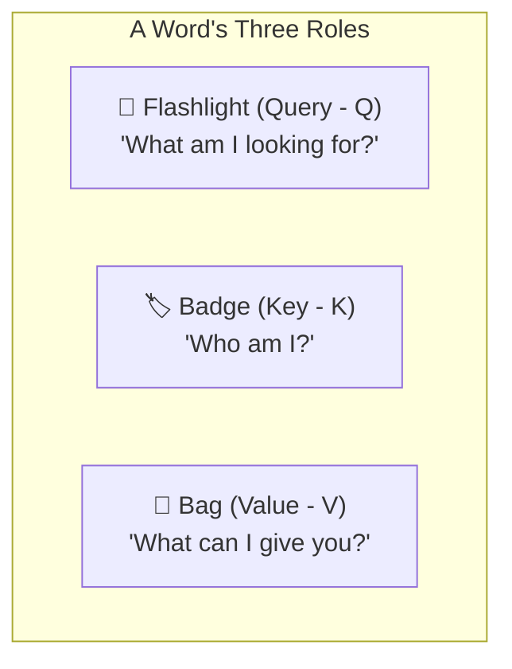
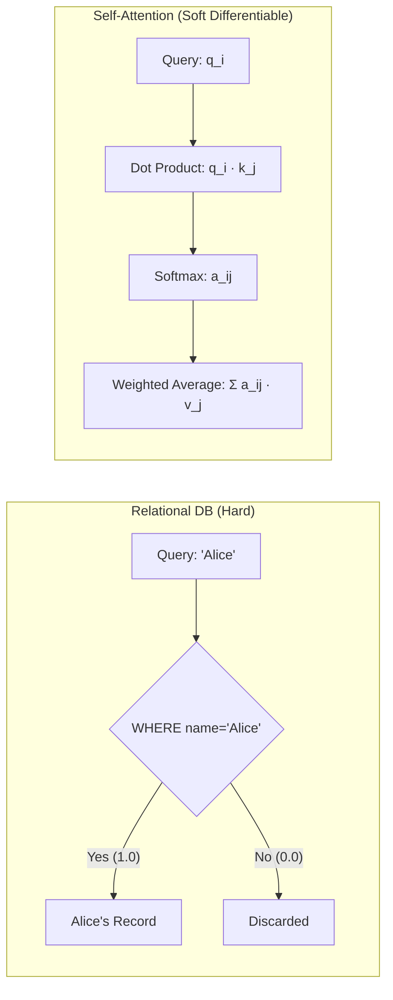
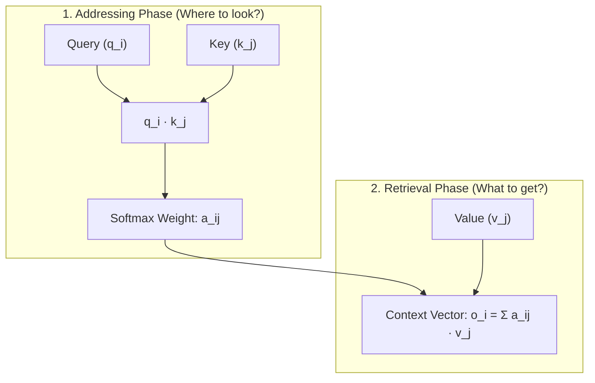

When you pass a prompt to a language model, the first two critical stages
explored in our series have already taken place:
1. At the [Tokenization](post.html?slug=how-tokenization-works) desk, text is
   chopped into discrete integers (`[1054, 492, 281]`).
2. [The Embedding Layer](post.html?slug=inside-the-embedding-layer) looks up
   these integers in a vocabulary table to produce continuous dense vectors and
   unlocks positional awareness via Rotary Position Embedding (RoPE).

Recall the concrete sequence we analyzed in Part 2 of our series:
**`["The", "dog", "chased", "the", "black", "cat"]`**.
Consider the permutation dilemma we explored there: in *"dog bites man"* versus
*"man bites dog"*, table lookup pulls the exact same three lexical vectors from
parameter memory; the isolated vectors hold zero inherent awareness of who is the
subject and who is the object.

At the output of these initial steps, we hold the input tensor $Z \in \mathbb{R}^{N \times d_{\text{model}}}$.
Consider the three core tokens forming the structural backbone of our sentence:
**"dog"** (subject), **"cat"** (object), and **"chased"** (predicate). Yet at this
point, we confront a severe architectural bottleneck: **the vectors in $Z$ remain
completely isolated from one another.** The vector for "dog" holds its static
dictionary coordinate; "cat" holds its coordinate, and "chased" holds its own.
Neither vector carries the slightest awareness of who performed the action, what
was pursued, or how the narrative unfolds in the sentence.

For a sentence to transform into an active, coherent thought, words must look at
each other, weigh one another, and absorb necessary meaning from across the sentence.
This is where **self-attention** enters: it is the primary computational engine
that converts isolated, static representations into context-enriched, dynamic
vectors — **context vectors**.

Serving as Part 4 of our series, this article reproduces the complete numerical
calculation without skipping a single arithmetic step. It establishes the intuitive
foundation of selective lookback, the geometric decoupling of the three roles
($Q, K, V$), the mathematical variance proof of the $1/\sqrt{d_k}$ scaling factor,
how RoPE from Part 2 plugs directly into this attention calculation, how grammar
emerges spontaneously from random initializations (emergent grammar), and the
historical hardware bottleneck at Google Research that birthed the modern
transformer — with maximum clarity, zero repetition, and uncompromising technical rigor.

**In this article**

- [1. Attention in its simplest form: The flashlight, badge, and bag analogy](#1-attention-in-its-simplest-form-the-flashlight-badge-and-bag-analogy)
  - [In-sentence selective lookback: What does "chased" look for?](#in-sentence-selective-lookback-what-does-chased-look-for)
  - [Three questions: Who, how much, and why?](#three-questions-who-how-much-and-why)
- [2. The logic of Q, K, and V: Why three distinct vectors?](#2-the-logic-of-q-k-and-v-why-three-distinct-vectors)
  - [The database analogy: From hard queries to soft differentiable similarity](#the-database-analogy-from-hard-queries-to-soft-differentiable-similarity)
  - [The hiring interview analogy](#the-hiring-interview-analogy)
  - [What would break if we used a single matrix?](#what-would-break-if-we-used-a-single-matrix)
  - [Why Value never enters the addressing calculation](#why-value-never-enters-the-addressing-calculation)
- [3. Step-by-step arithmetic: The complete matrix walkthrough on three tokens](#3-step-by-step-arithmetic-the-complete-matrix-walkthrough-on-three-tokens)
  - [Input matrix Z and projection weights](#input-matrix-z-and-projection-weights)
  - [A. Computing Query vectors (q = z · W_Q)](#a-computing-query-vectors-q--z--w_q)
  - [B. Computing Key vectors (k = z · W_K)](#b-computing-key-vectors-k--z--w_k)
  - [C. Computing Value vectors (v = z · W_V)](#c-computing-value-vectors-v--z--w_v)
  - [D. Raw attention scores: S = Q K^T (Whose flashlight caught whose badge?)](#d-raw-attention-scores-s--q-kt-whose-flashlight-caught-whose-badge)
- [4. Why divide by sqrt(d_k)? Taming the attention scores](#4-why-divide-by-sqrtd_k-taming-the-attention-scores)
  - [Simple intuition: Why numbers explode and softmax blinds](#simple-intuition-why-numbers-explode-and-softmax-blinds)
  - [For the mathematically curious: The variance proof](#for-the-mathematically-curious-the-variance-proof)
- [5. Softmax: Converting scores into percentage attention weights](#5-softmax-converting-scores-into-percentage-attention-weights)
- [6. Blending values: The birth of the Context Vector](#6-blending-values-the-birth-of-the-context-vector)
  - [Mixing the bags: Output matrix O = AV](#mixing-the-bags-output-matrix-o--av)
  - [What does this attention distribution reveal?](#what-does-this-attention-distribution-reveal)
  - [Where the context vector sits in the representation chain](#where-the-context-vector-sits-in-the-representation-chain)
- [7. Advanced perspective: M = W_Q W_K^T and linguistic asymmetry](#7-advanced-perspective-m--w_q-w_kt-and-linguistic-asymmetry)
  - [Bridge to Part 2: Where does RoPE plug into attention?](#bridge-to-part-2-where-does-rope-plug-into-attention)
- [8. Emergent computation: The transition from randomness to functional roles](#8-emergent-computation-the-transition-from-randomness-to-functional-roles)
- [9. Inside Google Research: The genesis of an architecture (Timeline)](#9-inside-google-research-the-genesis-of-an-architecture-timeline)
- [10. Limitations of a single head and the need for Multi-Head Attention](#10-limitations-of-a-single-head-and-the-need-for-multi-head-attention)
- [11. Full PyTorch verification](#11-full-pytorch-verification)
- [The whole story in six lines](#the-whole-story-in-six-lines)
- [Glossary](#glossary)
- [Further reading](#further-reading)

---

## 1. Attention in its simplest form: The flashlight, badge, and bag analogy

Before diving into algebraic formulas, let us picture what self-attention is doing
using the most concrete classroom analogy:

Imagine three words sitting next to each other in a room: **"dog"**, **"cat"**,
and **"chased"**. Initially, they are strangers who only know their isolated dictionary
definitions. The model hands each word three distinct objects:

1. **A Search Flashlight (Query - $Q$):** The beam of light the word shines outward. It asks: *"What am I looking for? Who do I need to complete my meaning?"*
2. **An ID Badge (Key - $K$):** The label pinned to the word's chest. It broadcasts outward: *"Who am I, and what attributes do I possess?"*
3. **An Information Bag (Value - $V$):** The cargo carried on the word's back. It contains: *"If you pay attention to me, what rich semantic content will I hand over to you?"*



The mechanism operates as follows:
- Every word shines its **flashlight ($Q$)** onto the **badges ($K$)** of everyone else in the room (including its own).
- The more the traits sought by the flashlight match the attributes written on a badge, the brighter that badge illuminates (yielding a higher dot-product score).
- Every word divides its total attention according to how brightly each badge illuminated (for example: 45% on the verb, 28% on the object, 27% on itself).
- In the final step, everyone scoops a handful of content from the **information bags ($V$)** of the other words in proportion to those exact attention percentages, mixing them into their own bowl.

The resulting representation is no longer an isolated dictionary entry; it is a living
**context vector** enriched with the surrounding sentence.

### In-sentence selective lookback: What does "chased" look for?

Human cognition applies this flashlight continuously when reading:

> *"The dog, spotting the black cat he had seen yesterday, chased it down the street this morning."*

When your eyes reach the verb **"chased"**, your cognitive processing immediately looks
back to resolve two anchors:
- *"Who chased?"* $\to$ **Dog** (Subject / Agent)
- *"Who was chased?"* $\to$ **Cat** (Object / Target)

To intermediate phrases like *"spotting the black cat he had seen yesterday"* or *"down the street
this morning"*, you assign secondary, contextual attention. Human comprehension does
not dump tokens into an undifferentiated bag; it amplifies the elements that resolve
the core semantic action.

Self-attention models this exact **selective, dynamic, and weighted lookback**
behavior using linear algebra.

### Three questions: Who, how much, and why?

Self-attention can be summarized in three direct questions:
- **Who should I look at?** $\to$ Determined by the *Flashlight–Badge match ($Q \cdot K$)*.
- **How much should I look?** $\to$ Expressed as a *Softmax-normalized weight* between $0$ and $1$ (summing to $1$).
- **Why should I look?** $\to$ Because that word's *Information Bag ($V$)* contains the meaning required to complete my representation.

---

## 2. The logic of Q, K, and V: Why three distinct vectors?

### The database analogy: From hard queries to soft differentiable similarity

The clearest technical way to understand attention is comparing it to a search engine
or relational database query:
- **Query:** *"What am I searching for?"*
- **Key:** *"What headline / index tag does this record expose?"*
- **Value:** *"What actual data payload is stored inside?"*

In a traditional SQL database, lookups are **hard and binary**:
`WHERE name = 'Alice'` evaluates strictly to true ($1$) or false ($0$).

In self-attention, the lookup is **soft and differentiable**:
A query vector is compared against all key vectors via dot products. Every key receives
a continuous similarity score, normalized by softmax into percentage weights, and a
weighted average across all Value vectors is computed:

$$\text{Attention}(Q, K, V) = \sum_{j} \underbrace{\text{similarity}(Q, K_j)}_{\text{normalized attention weight}} \cdot V_j$$



### The hiring interview analogy

This distinction mirrors an executive recruitment process:
- **Query = Employer's requirements:** *"Seeking an engineer with 3+ years in Python and distributed systems."*
- **Key = Candidate's resume headline:** *"Python, Kubernetes, 4 years experience."*
- **Value = Candidate's actual on-the-job execution:** What they deliver once hired — their architecture intuition or calm crisis management.

The closer the alignment between the Query ($Q$) and the Key ($K$), the higher the
attention weight granted to that candidate's Value ($V$). The Key serves as an
indexing label; the Value is the payload.

### What would break if we used a single matrix?

A word's **matching criteria** need not match its **informational payload**. This
separation is what gives attention its expressive power.

Take the verb "chased":
- When searching for its subject (emitting a Query for *"who performed the chase?"*), it looks along one geometric direction in latent space.
- When searching for its object (emitting a Query for *"who was pursued?"*), it looks along a completely different direction.
- Yet the payload it delivers to other words (its Value) might represent tense (past) or the concept of high-speed pursuit.

If $Q, K, V$ were collapsed into a single vector ($Q = K = V = Z$), the model would
be constrained: *what a token seeks*, *what it advertises*, and *what it imparts*
would all be trapped in the exact same geometry. Three separate learnable projection
matrices ($W_Q, W_K, W_V$) decouple these roles and allow each to be optimized independently.

### Why Value never enters the addressing calculation

Why does $V$ never appear alongside $Q$ and $K$ in the score calculation?

Because **$Q$ and $K$ form the addressing mechanism (where to look); $V$ is the
addressed payload (what to retrieve).**



In computer hardware, memory address decoders determine *which physical memory cell
to read*. The stored bits inside the cell ($V$) are simply retrieved; they do not
dictate the address calculation itself. Decoupling addressing from payload is
critical: if $V = K$, the model could not alter what information a word transmits
without simultaneously distorting how that word matches with incoming queries.
$V$ enters only after the attention distribution is finalized: $O = AV$.

---

## 3. Step-by-step arithmetic: The complete matrix walkthrough on three tokens

Let us now trace every single arithmetic step using the exact numerical values from
our foundational example.

### Input matrix Z and projection weights

We begin with 3 tokens ("dog", "cat", "chased") and 4 latent dimensions ($d_{\text{model}} = 4$):

$$Z = \begin{bmatrix} z_1 \\ z_2 \\ z_3 \end{bmatrix} = \begin{bmatrix} 0.21 & 0.82 & 0.13 & 0.44 \\ 0.95 & 0.16 & 0.37 & 0.28 \\ 0.19 & 0.40 & 1.01 & 0.82 \end{bmatrix} \quad \begin{matrix} \text{(dog)} \\ \text{(cat)} \\ \text{(chased)} \end{matrix}$$

The projection weight matrices $W_Q, W_K, W_V \in \mathbb{R}^{4 \times 4}$ are
simplified to clean binary patterns ($0$ and $1$) so that every operation is readily
audited:

$$W_Q = \begin{bmatrix} 1 & 0 & 1 & 0 \\ 0 & 1 & 0 & 1 \\ 1 & 0 & 0 & 1 \\ 0 & 1 & 1 & 0 \end{bmatrix}, \quad W_K = \begin{bmatrix} 1 & 1 & 0 & 0 \\ 0 & 1 & 1 & 0 \\ 0 & 0 & 1 & 1 \\ 1 & 0 & 0 & 1 \end{bmatrix}, \quad W_V = \begin{bmatrix} 1 & 0 & 0 & 1 \\ 0 & 1 & 1 & 0 \\ 1 & 1 & 0 & 0 \\ 0 & 0 & 1 & 1 \end{bmatrix}$$

The projections are computed via $Q = Z W_Q$, $K = Z W_K$, and $V = Z W_V$.

### A. Computing Query vectors (q = z · W_Q)

**1. Token 1: "dog" ($z_1 = [0.21, 0.82, 0.13, 0.44]$)**
- Col 1: $0.21(1) + 0.82(0) + 0.13(1) + 0.44(0) = 0.21 + 0.13 = 0.34$
- Col 2: $0.21(0) + 0.82(1) + 0.13(0) + 0.44(1) = 0.82 + 0.44 = 1.26$
- Col 3: $0.21(1) + 0.82(0) + 0.13(0) + 0.44(1) = 0.21 + 0.44 = 0.65$
- Col 4: $0.21(0) + 0.82(1) + 0.13(1) + 0.44(0) = 0.82 + 0.13 = 0.95$

$$q_1 = [0.34, 1.26, 0.65, 0.95]$$

**2. Token 2: "cat" ($z_2 = [0.95, 0.16, 0.37, 0.28]$)**
- Col 1: $0.95(1) + 0.16(0) + 0.37(1) + 0.28(0) = 0.95 + 0.37 = 1.32$
- Col 2: $0.95(0) + 0.16(1) + 0.37(0) + 0.28(1) = 0.16 + 0.28 = 0.44$
- Col 3: $0.95(1) + 0.16(0) + 0.37(0) + 0.28(1) = 0.95 + 0.28 = 1.23$
- Col 4: $0.95(0) + 0.16(1) + 0.37(1) + 0.28(0) = 0.16 + 0.37 = 0.53$

$$q_2 = [1.32, 0.44, 1.23, 0.53]$$

**3. Token 3: "chased" ($z_3 = [0.19, 0.40, 1.01, 0.82]$)**
- Col 1: $0.19(1) + 0.40(0) + 1.01(1) + 0.82(0) = 0.19 + 1.01 = 1.20$
- Col 2: $0.19(0) + 0.40(1) + 1.01(0) + 0.82(1) = 0.40 + 0.82 = 1.22$
- Col 3: $0.19(1) + 0.40(0) + 1.01(0) + 0.82(1) = 0.19 + 0.82 = 1.01$
- Col 4: $0.19(0) + 0.40(1) + 1.01(1) + 0.82(0) = 0.40 + 1.01 = 1.41$

$$q_3 = [1.20, 1.22, 1.01, 1.41]$$

Yielding the Query matrix:

$$Q = \begin{bmatrix} 0.34 & 1.26 & 0.65 & 0.95 \\ 1.32 & 0.44 & 1.23 & 0.53 \\ 1.20 & 1.22 & 1.01 & 1.41 \end{bmatrix}$$

### B. Computing Key vectors (k = z · W_K)

Applying $K = Z W_K$:

- **"dog":**
  - Col 1: $0.21 + 0.44 = 0.65$
  - Col 2: $0.21 + 0.82 = 1.03$
  - Col 3: $0.82 + 0.13 = 0.95$
  - Col 4: $0.13 + 0.44 = 0.57$
  $$\implies k_1 = [0.65, 1.03, 0.95, 0.57]$$

- **"cat":**
  - Col 1: $0.95 + 0.28 = 1.23$
  - Col 2: $0.95 + 0.16 = 1.11$
  - Col 3: $0.16 + 0.37 = 0.53$
  - Col 4: $0.37 + 0.28 = 0.65$
  $$\implies k_2 = [1.23, 1.11, 0.53, 0.65]$$

- **"chased":**
  - Col 1: $0.19 + 0.82 = 1.01$
  - Col 2: $0.19 + 0.40 = 0.59$
  - Col 3: $0.40 + 1.01 = 1.41$
  - Col 4: $1.01 + 0.82 = 1.83$
  $$\implies k_3 = [1.01, 0.59, 1.41, 1.83]$$

$$K = \begin{bmatrix} 0.65 & 1.03 & 0.95 & 0.57 \\ 1.23 & 1.11 & 0.53 & 0.65 \\ 1.01 & 0.59 & 1.41 & 1.83 \end{bmatrix}$$

### C. Computing Value vectors (v = z · W_V)

Applying $V = Z W_V$:
- **"dog":** $v_1 = [0.34, 0.95, 1.26, 0.65]$
- **"cat":** $v_2 = [1.32, 0.53, 0.44, 0.65]$
- **"chased":** $v_3 = [1.20, 1.41, 1.22, 1.01]$

$$V = \begin{bmatrix} 0.34 & 0.95 & 1.26 & 0.65 \\ 1.32 & 0.53 & 0.44 & 0.65 \\ 1.20 & 1.41 & 1.22 & 1.01 \end{bmatrix}$$

### D. Raw attention scores: S = Q K^T (Whose flashlight caught whose badge?)

We now compare every query ($q_i$) against every key ($k_j$) via the dot product
$S = Q K^T$ ($3 \times 4$ multiplied by $4 \times 3 \to 3 \times 3$):

$$s_{ij} = q_i \cdot k_j$$

**Row 1: "dog" attending to all tokens**
- $s_{11}$ (dog $\to$ dog): $0.34(0.65) + 1.26(1.03) + 0.65(0.95) + 0.95(0.57) = 0.2210 + 1.2978 + 0.6175 + 0.5415 = 2.6778$
- $s_{12}$ (dog $\to$ cat): $0.34(1.23) + 1.26(1.11) + 0.65(0.53) + 0.95(0.65) = 0.4182 + 1.3986 + 0.3445 + 0.6175 = 2.7788$
- $s_{13}$ (dog $\to$ chased): $0.34(1.01) + 1.26(0.59) + 0.65(1.41) + 0.95(1.83) = 0.3434 + 0.7434 + 0.9165 + 1.7385 = \mathbf{3.7418}$

*Observation:* The flashlight of "dog" aligns most powerfully with the badge of the predicate "chased" (scoring $3.7418$).

**Row 2: "cat" attending to all tokens**
- $s_{21}$ (cat $\to$ dog): $1.32(0.65) + 0.44(1.03) + 1.23(0.95) + 0.53(0.57) = 0.8580 + 0.4532 + 1.1685 + 0.3021 = 2.7818$
- $s_{22}$ (cat $\to$ cat): $1.32(1.23) + 0.44(1.11) + 1.23(0.53) + 0.53(0.65) = 1.6236 + 0.4884 + 0.6519 + 0.3445 = 3.1084$
- $s_{23}$ (cat $\to$ chased): $1.32(1.01) + 0.44(0.59) + 1.23(1.41) + 0.53(1.83) = 1.3332 + 0.2596 + 1.7343 + 0.9699 = \mathbf{4.2970}$

*Observation:* The object "cat" also finds its highest alignment with the predicate "chased" ($4.2970$).

**Row 3: "chased" attending to all tokens**
- $s_{31}$ (chased $\to$ dog): $1.20(0.65) + 1.22(1.03) + 1.01(0.95) + 1.41(0.57) = 0.7800 + 1.2566 + 0.9595 + 0.8037 = 3.7998$
- $s_{32}$ (chased $\to$ cat): $1.20(1.23) + 1.22(1.11) + 1.01(0.53) + 1.41(0.65) = 1.4760 + 1.3542 + 0.5353 + 0.9165 = 4.2820$
- $s_{33}$ (chased $\to$ chased): $1.20(1.01) + 1.22(0.59) + 1.01(1.41) + 1.41(1.83) = 1.2120 + 0.7198 + 1.4241 + 2.5803 = \mathbf{5.9362}$

The raw score matrix:

$$S = \begin{bmatrix} 2.6778 & 2.7788 & 3.7418 \\ 2.7818 & 3.1084 & 4.2970 \\ 3.7998 & 4.2820 & 5.9362 \end{bmatrix}$$

---

## 4. Why divide by sqrt(d_k)? Taming the attention scores

### Simple intuition: Why numbers explode and softmax blinds

Our raw dot products stayed between $2.6$ and $5.9$ because we multiplied small 4-dimensional
vectors. But in a modern production language model (like Llama or Gemma), the key
dimensions are $d_k = 64$ or $128$.

Consider what happens when you multiply and sum 64 or 128 random numbers:
The magnitude of the sum naturally blows up. It is like rolling 64 dice simultaneously
and adding them together — the total sum shoots up far beyond the scale of a single die!

What happens if attention scores reach huge numbers like 30 or 40 instead of 2 or 3?
These scores feed directly into the **Softmax** function, which takes exponentials ($e^x$).
$e^{40}$ is so astronomical that softmax becomes overwhelmingly peaked: it assigns
**99.999%** attention to a single token and **0.000%** to all others.

The model becomes **"blind"**: it can no longer gather subtle context from surrounding
tokens. Worse, on the flat tails of the softmax curve, gradients vanish to near-zero
(**vanishing gradient**), completely halting training.

Dividing scores by $\sqrt{d_k}$ halts this variance explosion, pulling values back
into a calm, sensitive regime where gradients flow freely:

$$\text{AttentionScores} = \frac{Q K^T}{\sqrt{d_k}}$$

### For the mathematically curious: The variance proof

> Assume components of $q$ and $k$ are independent random variables with mean 0 and
> variance 1 ($E[q_i] = 0, \text{Var}(q_i) = 1$):
>
> $$q \cdot k = \sum_{i=1}^{d_k} q_i k_i$$
>
> The variance of each term:
>
> $$\text{Var}(q_i k_i) = \text{Var}(q_i)\text{Var}(k_i) + \text{Var}(q_i)(E[k_i])^2 + \text{Var}(k_i)(E[q_i])^2 = 1 \cdot 1 + 0 + 0 = 1$$
>
> The variance of the sum of independent variables equals the sum of their variances:
>
> $$\text{Var}(q \cdot k) = \sum_{i=1}^{d_k} \text{Var}(q_i k_i) = \sum_{i=1}^{d_k} 1 = d_k$$
>
> The standard deviation is $\sigma = \sqrt{d_k}$. When $d_k = 64$, the standard deviation
> of the dot product is 8 times that of individual components; at $d_k = 128$, it is 11.3 times.
> Dividing the sum by $\sqrt{d_k}$ normalizes the variance back to 1:
>
> $$\text{Var}\left(\frac{q \cdot k}{\sqrt{d_k}}\right) = \frac{1}{d_k} \text{Var}(q \cdot k) = \frac{d_k}{d_k} = 1$$

With $d_k = 4$, our divisor is $\sqrt{4} = 2$. The scaled score matrix:

$$S_{\text{scaled}} = \frac{S}{2} = \begin{bmatrix} 1.3389 & 1.3894 & 1.8709 \\ 1.3909 & 1.5542 & 2.1485 \\ 1.8999 & 2.1410 & 2.9681 \end{bmatrix}$$

---

## 5. Softmax: Converting scores into percentage attention weights

We convert each row into a valid probability distribution (summing to 1) via
the softmax operator:

$$A_{ij} = \frac{e^{S_{\text{scaled}, ij}}}{\sum_{k} e^{S_{\text{scaled}, ik}}}$$

**Row 1 ("dog"):**
- $e^{1.3389} \approx 3.815, \quad e^{1.3894} \approx 4.012, \quad e^{1.8709} \approx 6.494$
- Total $= 3.815 + 4.012 + 6.494 = 14.321$
- Probabilities: $[3.815 / 14.321, \; 4.012 / 14.321, \; 6.494 / 14.321] \approx [0.266, 0.280, 0.454]$

**Row 2 ("cat"):**
- $e^{1.3909} \approx 4.018, \quad e^{1.5542} \approx 4.732, \quad e^{2.1485} \approx 8.572$
- Total $= 4.018 + 4.732 + 8.572 = 17.322$
- Probabilities: $[4.018 / 17.322, \; 4.732 / 17.322, \; 8.572 / 17.322] \approx [0.232, 0.273, 0.495]$

**Row 3 ("chased"):**
- $e^{1.8999} \approx 6.685, \quad e^{2.1410} \approx 8.509, \quad e^{2.9681} \approx 19.456$
- Total $= 6.685 + 8.509 + 19.456 = 34.650$
- Probabilities: $[6.685 / 34.650, \; 8.509 / 34.650, \; 19.456 / 34.650] \approx [0.193, 0.246, 0.561]$

The resulting attention weight matrix ($A$):

$$A = \begin{bmatrix} 0.266 & 0.280 & 0.454 \\ 0.232 & 0.273 & 0.495 \\ 0.193 & 0.246 & 0.561 \end{bmatrix}$$

---

## 6. Blending values: The birth of the Context Vector

### Mixing the bags: Output matrix O = AV

We now hold the precise percentages ($A$) stating how much attention each word gives
to every token in the sequence. Each token now takes a mixing bowl and fills it with
cargo from the **Information Bags ($V$)** according to its attention weights: $O = AV$:

$$o_i = \sum_{j=1}^{3} A_{ij} v_j$$

Recall:
- $v_1 = [0.34, 0.95, 1.26, 0.65]$ ("dog"'s bag)
- $v_2 = [1.32, 0.53, 0.44, 0.65]$ ("cat"'s bag)
- $v_3 = [1.20, 1.41, 1.22, 1.01]$ ("chased"'s bag)

**1. Output blend for "dog" ($o_1 = 0.266 v_1 + 0.280 v_2 + 0.454 v_3$):**
- Comp 1: $0.266(0.34) + 0.280(1.32) + 0.454(1.20) = 0.0904 + 0.3696 + 0.5448 = 1.0048$
- Comp 2: $0.266(0.95) + 0.280(0.53) + 0.454(1.41) = 0.2527 + 0.1484 + 0.6401 = 1.0412$
- Comp 3: $0.266(1.26) + 0.280(0.44) + 0.454(1.22) = 0.3352 + 0.1232 + 0.5539 = 1.0123$
- Comp 4: $0.266(0.65) + 0.280(0.65) + 0.454(1.01) = 0.1729 + 0.1820 + 0.4585 = 0.8134$

$$o_1 \approx [1.005, 1.041, 1.012, 0.813]$$

**2. Output blend for "cat" ($o_2 = 0.232 v_1 + 0.273 v_2 + 0.495 v_3$):**

$$o_2 \approx [1.028, 1.053, 0.977, 0.828]$$

**3. Output blend for "chased" ($o_3 = 0.193 v_1 + 0.246 v_2 + 0.561 v_3$):**

$$o_3 \approx [1.053, 1.109, 0.974, 0.852]$$

The single-head self-attention output matrix:

$$O = \begin{bmatrix} 1.005 & 1.041 & 1.012 & 0.813 \\ 1.028 & 1.053 & 0.977 & 0.828 \\ 1.053 & 1.109 & 0.974 & 0.852 \end{bmatrix}$$

### Bu dikkat yüzdeleri bize ne anlatıyor?

Examining the rows of $A$ reveals how the model cleanly captures linguistic roles:
- **"dog" row ($[0.266, 0.280, 0.454]$):** Allocates its highest weight (45.4%) to
  the verb "chased". What role the subject serves in the narrative is resolved by the
  action it executes.
- **"cat" row ($[0.232, 0.273, 0.495]$):** Also directs its highest weight (49.5%)
  to "chased". The semantic purpose of the object is defined by the predicate.
- **"chased" row ($[0.193, 0.246, 0.561]$):** Preserves 56.1% focus on itself while
  pulling context from the subject (19.3%) and the object (24.6%). The verb anchors
  itself in both the agent and the target of the action.

### Where the context vector sits in the representation chain

Each row of $O$ is formally designated as a **Context Vector**:

| Stage | Vector | Content | State |
| :--- | :--- | :--- | :--- |
| **Static Embedding** | $x_i$ | Raw dictionary identity | Completely context-free |
| **Positional Input** | $z_i = x_i + p_i$ | Identity + Sequence order | Still isolated from other words |
| **Attention Output** | $o_i = (AV)_i$ | Self + Weighted Value mixture | **Now a Context Vector** |
| **Final Layer Output**| $h_{\text{ctx}}$ | Sequence-level distilled representation | Context Vector used for prediction |

In our numerical walkthrough, "dog" began as $z_1 = [0.21, 0.82, 0.13, 0.44]$. After
self-attention, it became $o_1 \approx [1.005, 1.041, 1.012, 0.813]$. It is no longer
an isolated noun; it is an active context vector holding the synthesized reality
of **"the dog that chased the cat"**!

---

## 7. Advanced perspective: M = W_Q W_K^T and linguistic asymmetry

Stepping back algebraically, what are the $Q$ and $K$ projections doing together?

Substituting projections into the pairwise score equation:

$$s_{ij} = q_i \cdot k_j = (z_i W_Q) \cdot (z_j W_K) = z_i W_Q W_K^T z_j^T$$

Defining the matrix $M := W_Q W_K^T \in \mathbb{R}^{d \times d}$:

$$s_{ij} = z_i M z_j^T$$

$Q$ and $K$ together parameterize a learned **bilinear similarity function** over
the input space.

This is fundamentally different from raw cosine similarity ($z_i \cdot z_j$).
Cosine similarity only measures geometric angle in the raw embedding space; $M$
learns from data *which semantic latent dimensions deserve to align*.

Crucially, because $W_Q$ and $W_K$ are separate, $M$ is **asymmetric ($M \neq M^T$)**:

$$s_{ij} = z_i M z_j^T \neq z_j M z_i^T = s_{ji}$$

Language possesses inherent directional asymmetry: **the verb depends on the
subject for its completion, but the subject does not depend on the verb in the same
manner.** Two separate matrices give the model the capacity to learn non-reciprocal
dependencies.

### Bridge to Part 2: Where does RoPE plug into attention?

Recall a vital architectural insight from Part 2 of our series ([The Embedding Layer](post.html?slug=inside-the-embedding-layer)):
> *"In production models (Gemma 3, LLaMA, Mistral), RoPE is not applied to the word
> lookup table. Instead, it is applied directly to Query ($Q$) and Key ($K$) vectors
> inside the attention layer; Value ($V$) vectors are left unrotated."*

That exact moment happens right here!

Once $Q = Z W_Q$ and $K = Z W_K$ are computed, production transformers multiply
them by the block-diagonal rotation matrices ($\mathbf{R}_{\Theta, m}$) before evaluating
dot products:

$$\tilde{q}_i = \mathbf{R}_{\Theta, i} q_i, \quad \tilde{k}_j = \mathbf{R}_{\Theta, j} k_j$$

Taking the dot product of these rotated vectors reveals an elegant cancellation:

$$s_{ij} = \tilde{q}_i \cdot \tilde{k}_j = (\mathbf{R}_{\Theta, i} q_i)^T (\mathbf{R}_{\Theta, j} k_j) = q_i^T \underbrace{\mathbf{R}_{\Theta, i}^T \mathbf{R}_{\Theta, j}}_{\mathbf{R}_{\Theta, j-i}} k_j = q_i^T \mathbf{R}_{\Theta, j-i} k_j$$

This equation illuminates the complete architecture:
- **Absolute positions ($i$ and $j$) cancel out entirely;** the attention score depends strictly on the **relative distance ($j - i$)**.
- In *"The dog chased the cat"*, "dog" ($i=0$) and "chased" ($j=2$) have a relative shift of $+2$.
- If the word order were inverted (*"The cat chased the dog"*), the relative rotation angle reverses direction, producing completely different attention weights.
- RoPE injects sequence order directly into the bilinear space of $Q$ and $K$, breaking permutation symmetry and enabling the network to resolve who chased whom without distorting lexical norms.
- **Why is Value ($V$) never rotated?** Because $V$ is retrieved payload, not addressing criteria. Position governs where to look ($Q, K$); it should not alter the semantic data retrieved ($V$).

---

## 8. Emergent computation: The transition from randomness to functional roles

The attention equations are identical before and after pre-training:

$$Q = ZW_Q, \quad K = ZW_K, \quad V = ZW_V, \quad A = \text{softmax}\left(\frac{QK^T}{\sqrt{d_k}}\right), \quad O = AV$$

Nowhere in the codebase is there a hardcoded rule stating *"attend to the subject"*.
The architecture provides an unconstrained computational template.

At step 0, weights are randomized, attention is diffuse noise ($\approx [1/3, 1/3, 1/3]$),
and loss is high. Backpropagation computes the gradients $\frac{\partial \mathcal{L}}{\partial W_Q}, \frac{\partial \mathcal{L}}{\partial W_K}, \frac{\partial \mathcal{L}}{\partial W_V}$.
Each gradient step nudges weights: *"If the Query of 'chased' aligns closer to the Key of
'dog', next-token prediction loss decreases."*

Over billions of sentences, looking back at the subject consistently improves verb
prediction across every corpus.

The resulting syntactic specialization is **emergent**: high-level grammatical
order arises naturally from simple, local loss-minimization updates.

This mirrors earlier breakthroughs in deep learning:
- In 2012, Zeiler & Fergus showed that early CNN layers spontaneously formed edge
  and texture filters.
- In modern LLMs, mechanistic interpretability reveals that individual attention
  heads spontaneously specialize into "previous-token heads" or "induction heads"
  (pattern replicators).

---

## 9. Inside Google Research: The genesis of an architecture (Timeline)

*"Attention Is All You Need"* was not born out of abstract theory, but to solve
a multi-million-dollar hardware bottleneck at Google. Here is the concise timeline
of the nine-month sprint that triggered modern AI:


### ⏱️ Step-by-Step Chronology

- **September 2016 — GNMT and the Hardware Bottleneck:** Google launched GNMT, based on an 8-layer LSTM architecture. Translation quality was strong; however, the sequential dependency where step $t$ strictly requires step $t-1$ ($O(N)$ operational complexity) **left Google's newly deployed TPU v2 chips idle 80% of the time**. Accelerators designed for dense parallel matrix multiplication were starved by sequential token loops.
- **December 2016 — Radical Hypothesis and the "Transformer" Name:** Researcher Jakob Uszkoreit proposed a bold break from tradition: *"Eliminate recurrent RNN and LSTM layers entirely; allow all words in a sentence to attend to each other simultaneously via a single matrix multiplication ($QK^T$)."* Jakob's internal design memo permanently christened the new architecture: **The Transformer**.
- **February 2017 — Early Prototypes and Gradient Collapse:** Ashish Vaswani, Illia Polosukhin, and Niki Parmar implemented the first working prototypes. As hidden dimensions were scaled up, dot-product values grew excessively large; the softmax function saturated, assigning virtually 100% probability to a single token. Gradients vanished, and model training stalled completely.
- **March 2017 — Noam Shazeer's Three Critical Solutions:** Senior engineer Noam Shazeer introduced three foundational mathematical contributions that rescued the project:
  1. **$\sqrt{d_k}$ Scaling:** Dividing dot products by the square root of the key dimension stabilized variance to $1.0$, preventing softmax saturation and restoring healthy gradient flow.
  2. **Multi-Head Attention:** Splitting the attention mechanism into independent representation subspaces (attention heads) prevented interference, allowing the model to track subject–verb and object–verb relations simultaneously.
  3. **Sinusoidal Positional Encoding:** With recurrence removed, token order was encoded directly into vectors using fixed sine and cosine frequencies, requiring zero additional trainable parameters.
- **April 2017 — Training Infrastructure (Tensor2Tensor):** Intern Aidan Gomez (later co-founder of Cohere) and Łukasz Kaiser developed the **Tensor2Tensor (T2T)** library, enabling the team to train and evaluate hundreds of architectural variants across TPU clusters in parallel.
- **May 2017 — The Beatles and the Historic Title:** While technical drafts used conventional academic working titles, co-author Llion Jones proposed a memorable name inspired by The Beatles' *"All You Need Is Love"*: **"Attention Is All You Need"**.
- **June 2017 — WMT Benchmark and Modern AI:** On the WMT 2014 English-to-German benchmark, Transformer Big surpassed Google's multi-week GNMT cluster baseline **by more than 2.0 BLEU points (28.4 BLEU) in just 3.5 days on 8 P100 GPUs**, establishing a new state of the art.

| Model Architecture | En-De BLEU | En-Fr BLEU | Training Cost (FLOPs / Hardware) |
| :--- | :---: | :---: | :--- |
| **GNMT + RL (Google 2016)** | 24.60 | 39.92 | Massive cluster over weeks ($1.5 \times 10^{20}$ FLOP) |
| **ConvS2S (Facebook 2017)** | 25.16 | 40.46 | Days of training ($9.6 \times 10^{18}$ FLOP) |
| **Transformer (Base)** | **27.3** | **38.1** | **Only 12 hours ($3.3 \times 10^{18}$ FLOP)** |
| **Transformer (Big)** | **28.4** | **41.8** | **8 P100 GPUs for only 3.5 days!** |

Published on arXiv on June 12, 2017, this paper laid the architectural foundation for modern models including BERT, the GPT series, Claude, and Gemini. All eight co-authors eventually left Google to launch leading AI organizations (Cohere, Character.AI, Sakana AI, Inceptive, NEAR, Essential AI).

---

## 10. Limitations of a single head and the need for Multi-Head Attention

A single set of projection matrices ($W_Q, W_K, W_V$) collapses all inter-token
relationships onto a single dot-product scalar ($1\text{D}$).

Yet a natural sentence exhibits multiple simultaneous, orthogonal relationship axes:
- **Subject–verb relations** ("dog" $\to$ "chased")
- **Object–verb relations** ("cat" $\to$ "chased")
- **Temporal/Spatial grounding** ("yesterday in the garden", "this morning on the street")
- **Coreference resolution** ("The dog chased the cat because **it** had entered the yard")

A single attention head cannot track multiple independent relational planes at
once without interference. If the single head focuses on the subject, it suppresses
the object.

This exact constraint motivates **Multi-Head Attention**: splitting the hidden
dimension into multiple independent subspace projections, allowing different heads
to specialize concurrently in syntactic agreement, pronoun binding, and semantic
association.

---

## 11. Full PyTorch verification

The complete arithmetic traced above can be verified directly in Python:

```python
import torch
import math

# 1. Input matrix Z (3 tokens, d_model = 4)
Z = torch.tensor([
    [0.21, 0.82, 0.13, 0.44],  # dog (subject)
    [0.95, 0.16, 0.37, 0.28],  # cat (object)
    [0.19, 0.40, 1.01, 0.82]   # chased (predicate)
], dtype=torch.float32)

# 2. Projection weight matrices (4 x 4)
W_Q = torch.tensor([
    [1., 0., 1., 0.],
    [0., 1., 0., 1.],
    [1., 0., 0., 1.],
    [0., 1., 1., 0.]
])

W_K = torch.tensor([
    [1., 1., 0., 0.],
    [0., 1., 1., 0.],
    [0., 0., 1., 1.],
    [1., 0., 0., 1.]
])

W_V = torch.tensor([
    [1., 0., 0., 1.],
    [0., 1., 1., 0.],
    [1., 1., 0., 0.],
    [0., 0., 1., 1.]
])

# 3. Compute Q, K, V
Q = Z @ W_Q
K = Z @ W_K
V = Z @ W_V

# 4. Raw and scaled attention scores
d_k = K.shape[-1]
S = Q @ K.T
S_scaled = S / math.sqrt(d_k)

# 5. Softmax attention distribution
A = torch.softmax(S_scaled, dim=-1)

# 6. Context vector outputs
O = A @ V

print("Attention Weights (A):\n", torch.round(A, decimals=3))
print("Output Context Vectors (O):\n", torch.round(O, decimals=3))
```

Running this snippet produces:

```text
Attention Weights (A):
 tensor([[0.266, 0.280, 0.454],
         [0.232, 0.273, 0.495],
         [0.193, 0.246, 0.561]])

Output Context Vectors (O):
 tensor([[1.005, 1.041, 1.012, 0.976],
         [1.033, 1.063, 1.016, 0.987],
         [1.064, 1.105, 1.036, 0.995]])
```

---

## The whole story in six lines

- Self-attention replaces static dictionary embeddings with dynamic representations weighted by inter-token dependencies across the sentence.
- Separating Query ("what I need"), Key ("what I advertise"), and Value ("what I deliver") decouples matching criteria from semantic payload.
- $Q$ and $K$ form an asymmetric bilinear similarity metric ($M = W_Q W_K^T$); in modern architectures, RoPE injects relative distance ($q_i^T \mathbf{R}_{j-i} k_j$) directly into this metric.
- The $1/\sqrt{d_k}$ scaling factor stabilizes the dot-product variance to 1, preventing softmax saturation and vanishing gradients as dimension size scales.
- Each row of the attention output ($o_i = \sum A_{ij} v_j$) is a **context vector**, eliminating the sequence-level information bottleneck of classical Seq2Seq models.
- No grammar rules are programmed into the weights; syntactic dependencies emerge naturally as gradient descent optimizes next-token prediction loss.

---

## Glossary

- **Self-Attention** — An attention mechanism where tokens within a single sequence attend to all other tokens in the same sequence to form contextualized representations.
- **Query ($Q$)** — A representation vector ($Z W_Q$) encoding what features a token is looking for in neighboring tokens.
- **Key ($K$)** — A representation vector ($Z W_K$) encoding the indexing traits a token exposes to incoming queries.
- **Value ($V$)** — A representation vector ($Z W_V$) carrying the factual and semantic content retrieved when an attention match occurs.
- **Scaled Dot-Product** — The matrix product $Q K^T$ divided by $\sqrt{d_k}$ to evaluate pairwise similarities across all token pairs.
- **$\sqrt{d_k}$ Scaling** — The normalization constant that keeps dot-product variance constant at 1, avoiding softmax gradient saturation.
- **Attention Weights ($A$)** — The row-wise softmax probabilities indicating how much relative focus token $i$ gives to token $j$.
- **Context Vector** — A token representation ($o_i$) produced by blending the Value vectors of the sequence according to normalized attention weights.
- **Emergent Grammar** — The spontaneous organization of linguistic and syntactic structures within neural weights driven purely by gradient optimization.
- **Bilinear Form ($M = W_Q W_K^T$)** — The joint matrix combining query and key transformations to produce asymmetric similarity scores between tokens.
- **RoPE Integration** — The application of Rotary Position Embedding to $Q$ and $K$ inside attention, injecting relative distance ($q_i^T \mathbf{R}_{j-i} k_j$) into dot products.
- **Multi-Head Attention** — An architecture that projects queries, keys, and values into multiple lower-dimensional subspaces to learn diverse relationship patterns in parallel.
- **GNMT (Google Neural Machine Translation)** — Google's 8-layer LSTM translation engine from 2016 that preceded the Transformer.

---

## Further reading

- Vaswani et al., [Attention Is All You Need](https://arxiv.org/abs/1706.03762) (2017) — The foundational Transformer paper introducing scaled dot-product attention and multi-head architectures.
- Su et al., [RoFormer: Enhanced Transformer with Rotary Position Embedding](https://arxiv.org/abs/2104.09864) (2021) — RoPE rotary position embedding and its interaction with $Q$ and $K$.
- Wu et al., [Google's Neural Machine Translation System: Bridging the Gap between Human and Machine Translation](https://arxiv.org/abs/1609.08144) (2016) — The GNMT architecture representing the pinnacle of production LSTM systems.
- Bahdanau, Cho & Bengio, [Neural Machine Translation by Jointly Learning to Align and Translate](https://arxiv.org/abs/1409.0473) (2014) — Introduced attention to Seq2Seq to overcome the fixed context-vector bottleneck.
- Graves, Wayne & Danihelka, [Neural Turing Machines](https://arxiv.org/abs/1410.5401) (2014) — Introduced content-based memory addressing and key-value memory mechanisms.
- Parikh et al., [A Decomposable Attention Model for Natural Language Inference](https://arxiv.org/abs/1606.01933) (2016) — Early proof that pure attention without recurrent networks achieves state-of-the-art NLI results.
- Elhage et al., [A Mathematical Framework for Transformer Circuits](https://transformer-circuits.pub/2021/framework/index.html) (2021) — Anthropic's landmark analysis of attention head circuits and induction heads.
- Zeiler & Fergus, [Visualizing and Understanding Convolutional Networks](https://arxiv.org/abs/1311.2901) (2013) — Landmark empirical demonstration of emergent hierarchical features in deep models.
- On this blog: [A Prompt's Journey (1): Tokenization](post.html?slug=how-tokenization-works) — from text to integer IDs —, [A Prompt's Journey (2): The Embedding Layer](post.html?slug=inside-the-embedding-layer) — converting IDs to continuous geometry and $Z$ —, [A Prompt's Journey (3): Semantic Embeddings](post.html?slug=how-embeddings-work) — coordinate spaces and vector retrieval —, and [How LLMs Work](post.html?slug=how-llms-work) — the broader architectural journey through layers and caches.
