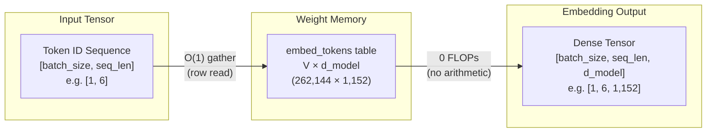

When you feed a prompt to a language model, the tokenizer breaks the
text into pieces and assigns each one an integer ID: `[1054, 492, 281]`.
Yet a transformer cannot compute on discrete integers; the only language
neural networks understand is continuous vector spaces and matrix
multiplications. The **embedding layer** stands precisely at this boundary:
it is the first translator in the architecture, turning discrete token
indices into rich geometric coordinates that the model can reason over.

At first glance, this layer appears deceptively simple. As prompt tokens
enter the model, it executes zero arithmetic operations — it merely
gathers rows from memory into cache (zero FLOPs). Yet it is often one of the
largest weight blocks in the entire network, sometimes accounting for nearly
a third of all parameters. Furthermore, it does far more than map tokens to
static vectors: it anchors positional order, enforces numerical stability
via $\sqrt{d_{\text{model}}}$ scaling, and anchors the final token projection
at generation time via weight tying (`lm_head`).

This guide walks through that entry threshold where integers become
geometry: lookup table mechanics and tensor layouts, the silent
$\sqrt{d_{\text{model}}}$ scaling trap, the evolution of positional
encodings from absolute tables to RoPE, pre-training loss spikes and their
remedies — and the starkly split economics of the same weight matrix
between training and serving.

**In this article**

- [1. Why an LLM needs an embedding layer](#1-why-an-llm-needs-an-embedding-layer)
- [2. Lookup table mechanics](#2-lookup-table-mechanics)
- [3. Vector scaling and where it hides](#3-vector-scaling-and-where-it-hides)
- [4. How positional encoding evolved](#4-how-positional-encoding-evolved)
  - [A. Learned absolute (GPT-2, BERT)](#a-learned-absolute-gpt-2-bert)
  - [B. Sinusoidal (Vaswani et al., 2017)](#b-sinusoidal-vaswani-et-al-2017)
  - [C. RoPE: Rotary Position Embedding (Gemma 3, Llama)](#c-rope-rotary-position-embedding-gemma-3-llama)
  - [Distance comes out for free](#distance-comes-out-for-free)
  - [Direct comparison across schemes](#direct-comparison-across-schemes)
- [5. Loss spikes and WeSaR](#5-loss-spikes-and-wesar)
- [6. Training cost versus serving cost](#6-training-cost-versus-serving-cost)
- [7. PyTorch walkthrough](#7-pytorch-walkthrough)
- [The whole story in six lines](#the-whole-story-in-six-lines)
- [Glossary](#glossary)
- [Going deeper](#going-deeper)

---

## 1. Why an LLM needs an embedding layer

Deep learning models operate strictly on matrix multiplications and
continuous vector spaces. A neural network cannot multiply the string
"cat". Three approaches have been tried to map text into continuous spaces:

- **Word-level.** Splitting on words requires a vocabulary of hundreds of
  thousands of terms. Any missing word triggers an Out-Of-Vocabulary (OOV)
  error, maps to a catch-all `[UNK]` token, and loses its semantic identity.
- **Character-level.** The vocabulary is compact (~256 entries) and OOV is
  eliminated, but sequences explode in length. Because a single character
  carries negligible semantic signal, the quadratic attention context window
  is consumed rapidly by trivial units.
- **Subword.** The standard equilibrium used by modern LLMs (BPE, WordPiece,
  SentencePiece). Frequent words remain whole; rare ones decompose into
  meaningful sub-fragments. For full details on this boundary, see the
  companion article on
  [How tokenization works](post.html?slug=how-tokenization-works).

Tokenization leaves us with integers called **token IDs**. For the input
`"the capital of united states"`, Gemma 3 produces `[2, 1437, 5279, 529, 26974, 5022]`.
These integers have no inherent geometric magnitude, direction, or distance:
ID 5279 being numerically larger than 1437 means nothing semantically.

The embedding layer converts these discrete integers into dense continuous
vectors that act as coordinates in a high-dimensional semantic space.

---

## 2. Lookup table mechanics

> **Embedding layer (`embed_tokens`)** = A trainable weight table with one
> row per vocabulary entry. Its job is not to transform the input mathematically,
> but to *replace* each integer with the row vector it indexes — closer to
> opening a dictionary at a page number than to executing arithmetic.

`embed_tokens` is a weight matrix of shape $V \times d_{\text{model}}$, where
$V$ is the vocabulary size and $d_{\text{model}}$ is the hidden dimension:



- **Lookup table ($O(1)$) logic.** Rather than performing a matrix
  multiplication, `embed_tokens` retrieves the row corresponding to the incoming
  token ID directly from the weight matrix — a **gather** operation, which is a
  memory read rather than arithmetic. Textbooks often define this as multiplying
  a one-hot vector by matrix $E$; that is mathematically equivalent but
  computationally absurd, since 262,144 multiplications minus $d_{\text{model}}$
  are multiplications by zero.
- **Tensor transformation.** An integer array of shape `[batch_size, seq_len]`
  expands into a semantic continuous tensor of shape
  `[batch_size, seq_len, d_model]` after the gather.
- **Model examples.** Gemma-3-1B's table is $262,144 \times 1,152$; on
  Gemma-3-27B it expands to $262,208 \times 5,376$. The 64-row difference is
  real — multimodal variants allocate extra rows for visual tokens.
- **Parameter footprint.** $262,144 \times 1,152 \approx 302\text{M}$
  parameters accounts for ~30% of a 1B model. On Gemma-3-27B, the same
  vocabulary represents only ~5% of total parameters. A wide vocabulary
  exerts severe VRAM pressure primarily on smaller models.
- **Context-blind and order-blind.** The same token ID returns the exact same
  row vector every time. Row 5279 is identical in "river bank" and "bank loan";
  resolving context is the job of subsequent self-attention layers, not this table.
- **`padding_idx`.** Batching requires uniform sequence lengths, so shorter
  inputs are padded with a pad token. Gemma sets `padding_idx=config.pad_token_id`,
  which zeroes out gradient updates for that specific row during backpropagation,
  ensuring the padding representation remains constant.

---

## 3. Vector scaling and where it hides

In Gemma and the original Transformer architecture, vectors leaving the
embedding table are scaled by $\sqrt{d_{\text{model}}}$ ($\sqrt{1152} \approx 33.94$
on Gemma-3-1B) before entering the first transformer block:

$$\mathbf{x}_{\text{scaled}} = \mathbf{x}_{\text{embed}} \times \sqrt{d_{\text{model}}}$$

Read it as: *The raw row retrieved from the table is multiplied by a single
fixed scalar constant.*

- $\mathbf{x}_{\text{embed}}$: The raw row vector read directly from the table.
- $\sqrt{d_{\text{model}}}$: The square root of the hidden dimension, constant
  throughout the model's lifetime (33.94 in Gemma-3-1B).
- $\mathbf{x}_{\text{scaled}}$: The scaled vector injected into the residual
  stream of the first transformer layer.

Where does this number come from, and why is it necessary? A weight stored in
the table typically starts near `0.02` (Gemma uses `initializer_range = 0.02`).
Tracing the arithmetic:

```text
d_model               = 1152
scale factor          = √1152 = 33.94
raw table value       = 0.02
scaled input value    = 0.02 × 33.94 = 0.68
```

Because every element in the row is multiplied by the same 33.94, the vector's
direction in geometric space remains unchanged; only its Euclidean norm grows
by a factor of 33.94.

The reason lies in weight tying (Section 6). One matrix serves simultaneously
as the input embedding table and the output un-embedding projection (`lm_head`),
and those two roles demand conflicting initialization scales: the output side
feeds a softmax, so its weights must begin small (`0.02`) to avoid saturating
the logits and vanishing gradients. However, this small variance leaves the
input vectors far below the unit variance expected by the initial residual
stream. Multiplying by $\sqrt{d_{\text{model}}}$ bridges this structural gap.
*Attention Is All You Need* (§3.4) introduces weight sharing and the
$\sqrt{d_{\text{model}}}$ multiplier in the exact same sentence.

**The PyTorch trap.** In Gemma, this multiplication is implemented directly
inside the embedding module rather than the model's forward backbone:

```python
class Gemma3TextScaledWordEmbedding(nn.Embedding):
    def forward(self, input_ids):
        return super().forward(input_ids) * self.embed_scale.to(self.weight.dtype)
```

Consequently, calling `embed_tokens(ids)` yields **already scaled** vectors,
whereas standard `F.embedding(ids, weight)` returns **unscaled** raw values.
Furthermore, `embed_scale` is a non-persistent buffer excluded from the saved
checkpoint `state_dict`. Any custom serving pipeline that naively loads the
weights and bypasses this module runs without error, yet produces completely
degraded outputs.

Llama-style architectures eliminate weight tying and embedding scaling
altogether, relying instead on input RMSNorm layers at each block boundary.

---

## 4. How positional encoding evolved

Consider two sentences: "dog bites man" and "man bites dog". As shown in
Section 2, table lookup returns the exact same three row vectors for both
sentences; the table possesses zero sequential awareness. Self-attention
cannot resolve this alone either: attention calculates relevance using dot
products, and the dot product is commutative ($q \cdot k = k \cdot q$). It
cannot discern which word came first.

Sequence order must therefore be directly injected into the numeric vectors
before attention operates. The goal is not merely telling a token "you are at
index 4,517," but encoding **how far apart two tokens sit** (relative distance).

Three distinct paradigms have been deployed:

- **A. Learned absolute** — Maintain a second trainable table, one row per
  slot index, and add it element-wise to the token vector.
- **B. Sinusoidal** — Compute fixed trigonometric wave coordinates and add
  them element-wise to the token vector.
- **C. RoPE** — Abandon addition entirely. Rotate the vector in 2D coordinate
  planes by an angle proportional to its slot index and dimension-specific frequency.

```text
A. Learned Absolute (GPT-2, BERT)   B. Sinusoidal (Vaswani 2017)   C. RoPE (Llama, Gemma 3)
   Vector Addition                     Trigonometric Addition         Vector Rotation
   x_i = TokenEmbed + PosEmbed         x_i = TokenEmbed + PE_pos      x_i = R(Θ, i) · TokenEmbed
   (Hard limit: L_max)                 (Norm inflation / drift)       (Exact norm preservation, ||x|| = const)
```

To compare these mechanics cleanly across all three paradigms, we trace a
concrete 6-token sentence across 4-dimensional representations ($d = 4$):

$$\text{Sequence: } [\text{"The"}, \ \text{"dog"}, \ \text{"chased"}, \ \text{"the"}, \ \text{"black"}, \ \text{"cat"}] \implies m \in \{0, 1, 2, 3, 4, 5\}$$

Let their raw lexical embeddings gathered from the lookup table be:

- **Slot 0 ("The"):** $\mathbf{x}_{(0)} = [0.80, \ 0.60, \ 0.50, \ 0.50]^T \implies \Vert{}\mathbf{x}_{(0)}\Vert{} = \sqrt{0.80^2 + 0.60^2 + 0.50^2 + 0.50^2} = \sqrt{1.50} \approx 1.2247$
- **Slot 1 ("dog"):** $\mathbf{x}_{(1)} = [0.70, \ 0.10, \ 0.40, \ 0.80]^T \implies \Vert{}\mathbf{x}_{(1)}\Vert{} = \sqrt{0.70^2 + 0.10^2 + 0.40^2 + 0.80^2} = \sqrt{1.30} \approx 1.1402$
- **Slot 2 ("chased"):** $\mathbf{x}_{(2)} = [0.50, \ 0.80, \ 0.30, \ 0.60]^T \implies \Vert{}\mathbf{x}_{(2)}\Vert{} = \sqrt{0.50^2 + 0.80^2 + 0.30^2 + 0.60^2} = \sqrt{1.34} \approx 1.1576$
- **Slot 3 ("the"):** $\mathbf{x}_{(3)} = [0.80, \ 0.60, \ 0.50, \ 0.50]^T \implies \Vert{}\mathbf{x}_{(3)}\Vert{} = \sqrt{0.80^2 + 0.60^2 + 0.50^2 + 0.50^2} = \sqrt{1.50} \approx 1.2247$
- **Slot 4 ("black"):** $\mathbf{x}_{(4)} = [0.60, \ 0.20, \ 0.70, \ 0.30]^T \implies \Vert{}\mathbf{x}_{(4)}\Vert{} = \sqrt{0.60^2 + 0.20^2 + 0.70^2 + 0.30^2} = \sqrt{0.98} \approx 0.9899$
- **Slot 5 ("cat"):** $\mathbf{x}_{(5)} = [0.30, \ 0.90, \ 0.60, \ 0.20]^T \implies \Vert{}\mathbf{x}_{(5)}\Vert{} = \sqrt{0.30^2 + 0.90^2 + 0.60^2 + 0.20^2} = \sqrt{1.30} \approx 1.1402$

### A. Learned absolute (GPT-2, BERT)

A second trainable matrix of shape $L_{\max} \times d_{\text{model}}$ is stored
in parameter memory. Each token representation is the element-wise sum of its
token vector and position vector:

$$\mathbf{x}_i = \text{TokenEmbed}(w_i) + \text{PosEmbed}(i)$$

Suppose training gradients have initialized or updated the learned position
rows to:
- $\text{PosEmbed}(0) = [0.00, \ 0.20, \ 0.10, \ 0.00]$
- $\text{PosEmbed}(1) = [0.20, \ -0.10, \ 0.00, \ 0.10]$
- $\text{PosEmbed}(2) = [-0.10, \ 0.10, \ 0.20, \ -0.10]$
- $\text{PosEmbed}(3) = [0.10, \ 0.00, \ -0.10, \ 0.20]$
- $\text{PosEmbed}(4) = [0.00, \ -0.10, \ 0.10, \ 0.10]$
- $\text{PosEmbed}(5) = [-0.10, \ 0.20, \ -0.10, \ 0.00]$

Summing token representations with position vectors:

```text
Slot 0 ("The"):
  TokenEmbed("The") = [ 0.80   0.60   0.50   0.50 ]
  PosEmbed(0)       = [ 0.00   0.20   0.10   0.00 ]
  x_0 (sum)         = [ 0.80   0.80   0.60   0.50 ]  ──> Norm: 1.37  (warped from 1.22)

Slot 1 ("dog"):
  TokenEmbed("dog") = [ 0.70   0.10   0.40   0.80 ]
  PosEmbed(1)       = [ 0.20  -0.10   0.00   0.10 ]
  x_1 (sum)         = [ 0.90   0.00   0.40   0.90 ]  ──> Norm: 1.33  (warped from 1.14)

Slot 2 ("chased"):
  TokenEmbed("cha") = [ 0.50   0.80   0.30   0.60 ]
  PosEmbed(2)       = [-0.10   0.10   0.20  -0.10 ]
  x_2 (sum)         = [ 0.40   0.90   0.50   0.50 ]  ──> Norm: 1.21  (warped from 1.16)

Slot 3 ("the"):
  TokenEmbed("the") = [ 0.80   0.60   0.50   0.50 ]
  PosEmbed(3)       = [ 0.10   0.00  -0.10   0.20 ]
  x_3 (sum)         = [ 0.90   0.60   0.40   0.70 ]  ──> Norm: 1.35  (warped from 1.22)

Slot 4 ("black"):
  TokenEmbed("bla") = [ 0.60   0.20   0.70   0.30 ]
  PosEmbed(4)       = [ 0.00  -0.10   0.10   0.10 ]
  x_4 (sum)         = [ 0.60   0.10   0.80   0.40 ]  ──> Norm: 1.08  (warped from 0.99)

Slot 5 ("cat"):
  TokenEmbed("cat") = [ 0.30   0.90   0.60   0.20 ]
  PosEmbed(5)       = [-0.10   0.20  -0.10   0.00 ]
  x_5 (sum)         = [ 0.20   1.10   0.50   0.20 ]  ──> Norm: 1.24  (warped from 1.14)
```

- **Drawback 1 (Hard context ceiling):** If trained on 2,048 slots, slot 2,049
  has no row in the weight matrix. The model cannot process sequences beyond
  $L_{\max}$ without adding uninitialized parameters.
- **Drawback 2 (No structural relative awareness):** The distance between
  "dog" (Slot 1) and "cat" (Slot 5) ($5 - 1 = 4$) is learned completely
  independently from the exact same 4-token separation occurring at Slots 101
  and 105.

### B. Sinusoidal (Vaswani et al., 2017)

Position coordinates are calculated analytically using geometric frequency series:

$$PE_{(pos, 2j)} = \sin\left(\frac{pos}{10000^{2j/d}}\right), \quad PE_{(pos, 2j+1)} = \cos\left(\frac{pos}{10000^{2j/d}}\right)$$

Where $pos \in \{0, 1, 2, 3, 4, 5\}$, dimension index $j \in \{0, 1\}$, and model dimension $d = 4$:
- For $j = 0$ (channels 0 and 1): $\text{denom} = 10000^0 = 1.0 \implies \text{freq} = 1.0 \text{ rad/step}$
- For $j = 1$ (channels 2 and 3): $\text{denom} = 10000^{2/4} = 100.0 \implies \text{freq} = 0.01 \text{ rad/step}$

Evaluating wave coordinates for each slot:

```text
Slot 0 (pos = 0):
  PE_0 = [ sin(0.0), cos(0.0), sin(0.00), cos(0.00) ]
       ≈ [ 0.0000,   1.0000,   0.0000,   1.0000   ]

Slot 1 (pos = 1):
  PE_1 = [ sin(1.0), cos(1.0), sin(0.01), cos(0.01) ]
       ≈ [ 0.8415,   0.5403,   0.0100,   1.0000   ]

Slot 2 (pos = 2):
  PE_2 = [ sin(2.0), cos(2.0), sin(0.02), cos(0.02) ]
       ≈ [ 0.9093,  -0.4161,   0.0200,   0.9998   ]

Slot 3 (pos = 3):
  PE_3 = [ sin(3.0), cos(3.0), sin(0.03), cos(0.03) ]
       ≈ [ 0.1411,  -0.9900,   0.0300,   0.9996   ]

Slot 4 (pos = 4):
  PE_4 = [ sin(4.0), cos(4.0), sin(0.04), cos(0.04) ]
       ≈ [-0.7568,  -0.6536,   0.0400,   0.9992   ]

Slot 5 (pos = 5):
  PE_5 = [ sin(5.0), cos(5.0), sin(0.05), cos(0.05) ]
       ≈ [-0.9589,   0.2837,   0.0500,   0.9988   ]
```

Applying vector addition ($\mathbf{x}_m = \text{TokenEmbed}(w_m) + PE_m$):

```text
Slot 0 ("The"):
  x_0 (sum) = [ 0.80 + 0.0000, 0.60 + 1.0000, 0.50 + 0.0000, 0.50 + 1.0000 ]
            = [ 0.8000,        1.6000,        0.5000,        1.5000 ]      ──> Norm: 2.39  (inflated +95%)

Slot 1 ("dog"):
  x_1 (sum) = [ 0.70 + 0.8415, 0.10 + 0.5403, 0.40 + 0.0100, 0.80 + 1.0000 ]
            = [ 1.5415,        0.6403,        0.4100,        1.8000 ]      ──> Norm: 2.49  (inflated +118%)

Slot 2 ("chased"):
  x_2 (sum) = [ 0.50 + 0.9093, 0.80 - 0.4161, 0.30 + 0.0200, 0.60 + 0.9998 ]
            = [ 1.4093,        0.3839,        0.3200,        1.5998 ]      ──> Norm: 2.19  (inflated +89%)

Slot 3 ("the"):
  x_3 (sum) = [ 0.80 + 0.1411, 0.60 - 0.9900, 0.50 + 0.0300, 0.50 + 0.9996 ]
            = [ 0.9411,       -0.3900,        0.5300,        1.4996 ]      ──> Norm: 1.89  (inflated +54%)

Slot 4 ("black"):
  x_4 (sum) = [ 0.60 - 0.7568, 0.20 - 0.6536, 0.70 + 0.0400, 0.30 + 0.9992 ]
            = [-0.1568,       -0.4536,        0.7400,        1.2992 ]      ──> Norm: 1.57  (inflated +59%)

Slot 5 ("cat"):
  x_5 (sum) = [ 0.30 - 0.9589, 0.90 + 0.2837, 0.60 + 0.0500, 0.20 + 0.9988 ]
            = [-0.6589,        1.1837,        0.6500,        1.1988 ]      ──> Norm: 1.92  (inflated +69%)
```

- **Drawback (Severe semantic distortion & norm drift):** Addition drastically
  deforms vector lengths. Identical vectors ("The" at Slot 0 and "the" at Slot 3)
  end up with wildly different norms ($2.39$ vs $1.89$), distorting the base
  lexical signal based purely on where they land in a sentence.

### C. RoPE: Rotary Position Embedding (Gemma 3, Llama)

Learned absolute and sinusoidal encodings (Schemes A and B) inject position
through vector addition ($\mathbf{x} + \mathbf{p}$). But as demonstrated above,
adding two vectors distorts the original lexical vector's length (norm), inflating
it from $1.22$ to $2.39$ and roughly quadrupling unscaled attention dot products.
This destabilizes the softmax distribution and washes out gradients.

**RoPE's foundational insight:** Can we alter a vector's spatial orientation
based on its sequence position *without changing its magnitude by a single fraction*?
Yes: **by vector rotation!** If you hold a 10 cm pencil on a table and rotate it
by any angle, its length remains strictly 10 cm. Instead of stretching or shrinking
vectors, RoPE rotates them across geometric manifolds based on position.

$$\mathbf{x}_m = \mathbf{R}_{\Theta, m}^{d} \cdot \text{TokenEmbed}(w_m)$$

Read it as: *The raw lexical vector retrieved from the embedding table is multiplied
by an orthogonal block-diagonal rotation matrix computed from slot position $m$
and subspace frequencies; its direction rotates while its Euclidean length remains
strictly locked.*

Every symbol in this formulation has a concrete mathematical and architectural role:
- **$\text{TokenEmbed}(w_m)$:** The raw $d$-dimensional lexical embedding vector
  fetched from parameter memory. It contains zero sequential awareness; the token
  "The" outputs the exact same numbers regardless of where it appears.
- **$m$:** The token's slot index in the sequence ($m = 0, 1, 2, 3, \dots$). In
  RoPE, this index functions as a discrete "time step".
- **$\Theta = \{\theta_1, \theta_2, \dots, \theta_{d/2}\}$:** The fixed set of
  base angular frequencies (rotation velocities) assigned across coordinate pairs.
- **$\mathbf{R}_{\Theta, m}^{d}$:** The $d \times d$ orthogonal block-diagonal
  rotation matrix assembled for token slot $m$.
- **$\mathbf{x}_m$:** The rotated, position-aware $d$-dimensional output vector.

**Why slice $d$-dimensional space into $d/2$ two-dimensional (2D) subspaces?**
Rotating a 128-dimensional vector as a monolithic rigid body in 128D space is
computationally intractable—it requires complex rotation tensors with hundreds of
coupled rotation planes. RoPE solves this with an elegant decomposition: it pairs
consecutive or split channels into independent 2-element coordinates:
$$(x_1, x_2), \ (x_3, x_4), \ \dots, \ (x_{d-1}, x_d)$$
Each pair forms an independent point on a simple 2D plane (like a clock face or a
compass dial). Rotating a point $(x, y)$ around the origin on a 2D plane is basic
high school trigonometry:
$$\tilde{x}_1 = x_1 \cos\phi - x_2 \sin\phi$$
$$\tilde{x}_2 = x_1 \sin\phi + x_2 \cos\phi$$

**Proof of exact norm preservation ($\cos^2\phi + \sin^2\phi = 1$):**
Evaluating the sum of squares of the rotated components:
$$\tilde{x}_1^2 + \tilde{x}_2^2 = (x_1 \cos\phi - x_2 \sin\phi)^2 + (x_1 \sin\phi + x_2 \cos\phi)^2 = (x_1^2 + x_2^2)(\cos^2\phi + \sin^2\phi) = x_1^2 + x_2^2$$
Because $\cos^2\phi + \sin^2\phi = 1$ for any angle $\phi$, the Euclidean length
never inflates or shrinks; norm drift is strictly 0%.

**What "frequency" ($\theta_j$) actually means in RoPE.** In wave physics,
frequency dictates how rapidly a wave oscillates per unit of time. In RoPE,
**sequence position $m$ serves as discrete time**, and each 2D subspace $j$ is
assigned an **angular velocity** $\theta_j$:

$$\theta_j = \text{base}^{-\frac{2(j-1)}{d}} = \frac{1}{\text{base}^{\frac{2(j-1)}{d}}} \quad [\text{radians per token step}]$$

Deconstructing the formula components:
- **$\text{base}$:** Standardized at $10{,}000$ in original RoPE. It controls the
  dynamic velocity range between the fastest and slowest rotating dimensions.
- **$j$:** The 2D subspace index ($j = 1, 2, \dots, d/2$).
- **$d$:** Hidden feature dimension ($d = 4$ in our toy walkthrough, $128$ per
  head in modern LLMs).
- As $j$ increases toward higher channel pairs, the exponent grows, driving the
  denominator into massive values. Consequently, **low-index channels spin rapidly,
  while high-index channels barely budge.**

**Why multiple speeds? The clock hands analogy (Second, Minute, Hour):**
If all dimensions rotated at the exact same angular velocity, language models
would break:
- If all rotated fast: They would complete a $360^\circ$ circle within a few words;
  token 50 would align at the exact same angle as token 1, triggering **phase
  wrapping** (loss of distinction).
- If all rotated slow: Adjacent words ("dog" and "chased") would experience barely
  any angular displacement, and the model could not determine word order.

Picture an analog clock with three hands:
- **Second Hand (Fast frequency, $\theta_1 = 1.0\text{ rad} \approx 57.3^\circ$):**
  Takes large steps with every single tick. Architectural role: **Local syntax**;
  sharply separates immediate neighbors ("The" $\to$ "dog").
- **Minute Hand (Mid frequencies):** Tracks phrase- and sentence-level relationships.
- **Hour Hand (Slow frequency, $\theta_2 = 0.01\text{ rad} \approx 0.57^\circ$):**
  Creeps forward by barely half a degree per token. Architectural role: **Global
  order**; maintains monotonic sequential progression across thousands of tokens
  without wrapping around.

**Rotation period (wavelength $T_j$):**
The number of tokens required for a 2D pair to complete one full $360^\circ$
($2\pi$ radian) revolution and return to its starting direction:
$$T_j = \frac{2\pi}{\theta_j} = 2\pi \cdot \text{base}^{\frac{2(j-1)}{d}}$$

For our 4-dimensional representation ($d = 4$, $j \in \{1, 2\}$) with base $10{,}000$:
- **Pair 1 ($j=1$, channels 1–2):**
  $$\theta_1 = 10000^{-\frac{2(0)}{4}} = 10000^0 = 1.0 \text{ rad/step} \quad (\approx 57.3^\circ/\text{step})$$
  $$T_1 = \frac{2\pi}{1.0} \approx 6.28 \text{ tokens} \quad (\text{One full turn every } \approx 6 \text{ words})$$
- **Pair 2 ($j=2$, channels 3–4):**
  $$\theta_2 = 10000^{-\frac{2(1)}{4}} = 10000^{-0.5} = \frac{1}{\sqrt{10000}} = 0.01 \text{ rad/step} \quad (\approx 0.573^\circ/\text{step})$$
  $$T_2 = \frac{2\pi}{0.01} \approx 628.3 \text{ tokens} \quad (\text{One full turn takes 628 words})$$

| Subspace | Angular Velocity ($\theta_j$) | Turn per Token | Period ($T_j = 2\pi/\theta_j$) | Architectural Role ("What it does") |
| :--- | :---: | :---: | :---: | :--- |
| **Pair 1 ($j=1$, channels 1–2)** | $1.0\text{ rad}$ | $\approx 57.3^\circ$ | $T_1 \approx 6.28\text{ tokens}$ | **Microscope / Second Hand:** Rotates rapidly; sharply distinguishes adjacent tokens ("The" $\to$ "dog"). |
| **Pair 2 ($j=2$, channels 3–4)** | $0.01\text{ rad}$ | $\approx 0.57^\circ$ | $T_2 \approx 628.3\text{ tokens}$ | **Telescope / Hour Hand:** Rotates slowly; preserves global sequence order across long contexts. |

**Why `rope_theta` (the base) was scaled to 500,000 and 1,000,000:**
LLaMA 1 and 2 operated on context windows of 2,048 to 4,096 tokens, where
`base = 10000` was sufficient. When modern architectures (LLaMA 3, Gemma 3)
expanded contexts to 131,072 (128k) tokens, `base = 10000` would cause even the
slowest hour hands to complete dozens of full revolutions, triggering catastrophic
**phase wrapping**. Scaling `rope_theta` to `1,000,000` stretches the slowest periods
into millions of tokens, ensuring every token across a 128k window receives a
globally unique angular signature.

**How frequency is applied: the 4-step pipeline.** To transform a token vector
$\mathbf{x} = [x_1, x_2, x_3, x_4]^T$ at position $m$:

1. **Partition into 2D pairs:** Channels are grouped into independent coordinate planes:
   - Pair 1: $(x_1, x_2)$
   - Pair 2: $(x_3, x_4)$
2. **Compute rotation angles ($\phi_j$) for slot $m$:**
   Each coordinate pair rotates by the product of its angular velocity and position index:
   $$\phi_1(m) = m \cdot \theta_1 = m \times 1.0 \text{ rad}, \quad \phi_2(m) = m \cdot \theta_2 = m \times 0.01 \text{ rad}$$
3. **Rotate each 2D pair independently (2D rotation formula):**
   $$\begin{pmatrix} \tilde{x}_1 \\ \tilde{x}_2 \end{pmatrix} = \begin{pmatrix} \cos(\phi_1) & -\sin(\phi_1) \\ \sin(\phi_1) & \cos(\phi_1) \end{pmatrix} \begin{pmatrix} x_1 \\ x_2 \end{pmatrix} = \begin{pmatrix} x_1 \cos(\phi_1) - x_2 \sin(\phi_1) \\ x_1 \sin(\phi_1) + x_2 \cos(\phi_1) \end{pmatrix}$$
   $$\begin{pmatrix} \tilde{x}_3 \\ \tilde{x}_4 \end{pmatrix} = \begin{pmatrix} \cos(\phi_2) & -\sin(\phi_2) \\ \sin(\phi_2) & \cos(\phi_2) \end{pmatrix} \begin{pmatrix} x_3 \\ x_4 \end{pmatrix} = \begin{pmatrix} x_3 \cos(\phi_2) - x_4 \sin(\phi_2) \\ x_3 \sin(\phi_2) + x_4 \cos(\phi_2) \end{pmatrix}$$
4. **Assemble the block-diagonal rotation matrix $\mathbf{R}_{\Theta, m}^{4}$:**
   The transformations can be expressed as a single matrix multiplication:
   $$\mathbf{R}_{\Theta, m}^{4} = \begin{bmatrix} \cos(m\theta_1) & -\sin(m\theta_1) & 0 & 0 \\ \sin(m\theta_1) & \cos(m\theta_1) & 0 & 0 \\ 0 & 0 & \cos(m\theta_2) & -\sin(m\theta_2) \\ 0 & 0 & \sin(m\theta_2) & \cos(m\theta_2) \end{bmatrix}$$
   Two $2 \times 2$ rotation blocks lie along the diagonal; all other entries are zero.
   When multiplied by $\mathbf{x}$, each channel pair rotates strictly in its own 2D
   plane without inter-channel leakage.

Applying this transformation across our 6-token sequence:

**Slot 0 ($m = 0$): "The"**
- Angles: $\phi_1 = 0 \times 1.0 = 0.0 \text{ rad}$ ($\cos = 1.0000, \sin = 0.0000$), $\phi_2 = 0 \times 0.01 = 0.00 \text{ rad}$ ($\cos = 1.00000, \sin = 0.0000$)
- Transformation:
  $$x_{0, 1} = 0.80(1.0000) - 0.60(0.0000) = 0.8000, \quad x_{0, 2} = 0.80(0.0000) + 0.60(1.0000) = 0.6000$$
  $$x_{0, 3} = 0.50(1.00000) - 0.50(0.0000) = 0.5000, \quad x_{0, 4} = 0.50(0.0000) + 0.50(1.00000) = 0.5000$$
  $$\mathbf{x}_{\text{rotated}(0)} = [0.8000, \ 0.6000, \ 0.5000, \ 0.5000]^T \implies \text{Norm} = \mathbf{1.2247} \quad (\text{Preserved})$$

**Slot 1 ($m = 1$): "dog"**
- Angles: $\phi_1 = 1 \times 1.0 = 1.0 \text{ rad}$ ($\cos \approx 0.5403, \sin \approx 0.8415$), $\phi_2 = 1 \times 0.01 = 0.01 \text{ rad}$ ($\cos \approx 0.99995, \sin \approx 0.0100$)
- Transformation:
  $$x_{1, 1} = 0.70(0.5403) - 0.10(0.8415) = 0.2941, \quad x_{1, 2} = 0.70(0.8415) + 0.10(0.5403) = 0.6431$$
  $$x_{1, 3} = 0.40(0.99995) - 0.80(0.0100) = 0.3920, \quad x_{1, 4} = 0.40(0.0100) + 0.80(0.99995) = 0.8040$$
  $$\mathbf{x}_{\text{rotated}(1)} = [0.2941, \ 0.6431, \ 0.3920, \ 0.8040]^T \implies \text{Norm} = \mathbf{1.1402} \quad (\text{Preserved})$$

**Slot 2 ($m = 2$): "chased"**
- Angles: $\phi_1 = 2 \times 1.0 = 2.0 \text{ rad}$ ($\cos \approx -0.4161, \sin \approx 0.9093$), $\phi_2 = 2 \times 0.01 = 0.02 \text{ rad}$ ($\cos \approx 0.99980, \sin \approx 0.0200$)
- Transformation:
  $$x_{2, 1} = 0.50(-0.4161) - 0.80(0.9093) = -0.9355, \quad x_{2, 2} = 0.50(0.9093) + 0.80(-0.4161) = 0.1217$$
  $$x_{2, 3} = 0.30(0.99980) - 0.60(0.0200) = 0.2879, \quad x_{2, 4} = 0.30(0.0200) + 0.60(0.99980) = 0.6059$$
  $$\mathbf{x}_{\text{rotated}(2)} = [-0.9355, \ 0.1217, \ 0.2879, \ 0.6059]^T \implies \text{Norm} = \mathbf{1.1576} \quad (\text{Preserved})$$

**Slot 3 ($m = 3$): "the"**
- Angles: $\phi_1 = 3 \times 1.0 = 3.0 \text{ rad}$ ($\cos \approx -0.9900, \sin \approx 0.1411$), $\phi_2 = 3 \times 0.01 = 0.03 \text{ rad}$ ($\cos \approx 0.99955, \sin \approx 0.0300$)
- Transformation:
  $$x_{3, 1} = 0.80(-0.9900) - 0.60(0.1411) = -0.8767, \quad x_{3, 2} = 0.80(0.1411) + 0.60(-0.9900) = -0.4811$$
  $$x_{3, 3} = 0.50(0.99955) - 0.50(0.0300) = 0.4848, \quad x_{3, 4} = 0.50(0.0300) + 0.50(0.99955) = 0.5148$$
  $$\mathbf{x}_{\text{rotated}(3)} = [-0.8767, \ -0.4811, \ 0.4848, \ 0.5148]^T \implies \text{Norm} = \mathbf{1.2247} \quad (\text{Preserved})$$

**Slot 4 ($m = 4$): "black"**
- Angles: $\phi_1 = 4 \times 1.0 = 4.0 \text{ rad}$ ($\cos \approx -0.6536, \sin \approx -0.7568$), $\phi_2 = 4 \times 0.01 = 0.04 \text{ rad}$ ($\cos \approx 0.99920, \sin \approx 0.0400$)
- Transformation:
  $$x_{4, 1} = 0.60(-0.6536) - 0.20(-0.7568) = -0.2408, \quad x_{4, 2} = 0.60(-0.7568) + 0.20(-0.6536) = -0.5848$$
  $$x_{4, 3} = 0.70(0.99920) - 0.30(0.0400) = 0.6874, \quad x_{4, 4} = 0.70(0.0400) + 0.30(0.99920) = 0.3278$$
  $$\mathbf{x}_{\text{rotated}(4)} = [-0.2408, \ -0.5848, \ 0.6874, \ 0.3278]^T \implies \text{Norm} = \mathbf{0.9899} \quad (\text{Preserved})$$

**Slot 5 ($m = 5$): "cat"**
- Angles: $\phi_1 = 5 \times 1.0 = 5.0 \text{ rad}$ ($\cos \approx 0.2837, \sin \approx -0.9589$), $\phi_2 = 5 \times 0.01 = 0.05 \text{ rad}$ ($\cos \approx 0.99875, \sin \approx 0.0500$)
- Transformation:
  $$x_{5, 1} = 0.30(0.2837) - 0.90(-0.9589) = 0.9481, \quad x_{5, 2} = 0.30(-0.9589) + 0.90(0.2837) = -0.0324$$
  $$x_{5, 3} = 0.60(0.99875) - 0.20(0.0500) = 0.5893, \quad x_{5, 4} = 0.60(0.0500) + 0.20(0.99875) = 0.2297$$
  $$\mathbf{x}_{\text{rotated}(5)} = [0.9481, \ -0.0324, \ 0.5893, \ 0.2297]^T \implies \text{Norm} = \mathbf{1.1402} \quad (\text{Preserved})$$

**Reference PyTorch implementation: applying RoPE in $O(d)$.** In production
LLMs (LLaMA, Gemma, Mistral), dense matrix multiplications with
$\mathbf{R}_{\Theta, m}^{d}$ are never instantiated. Instead, the rotation is
executed directly on Query ($Q$) and Key ($K$) tensors using element-wise vector
operations in $O(d)$ time:

```python
import torch

def get_rotary_position_encoding(
    input: torch.Tensor,
    base: float = 10000.0,
    device: str = "cpu"
) -> torch.Tensor:
    """
    Applies Rotary Position Embedding (RoPE) to a tensor of shape [context_length, dimension].
    
    Uses the split-half channel layout standard in LLaMA / Hugging Face:
      - First half:  input[:, :dimension // 2]
      - Second half: input[:, dimension // 2:]
    """
    context_length, dimension = input.shape
    assert dimension % 2 == 0, "Feature dimension must be even"

    half_dimension = dimension // 2

    # Step 1: Base angular frequencies for each 2D subspace:
    # theta_j = 1 / (base ** (2 * j / dimension))
    freqs_indices = torch.arange(0, half_dimension, device=device, dtype=torch.float32)
    freqs = 1.0 / (base ** (2.0 * freqs_indices / dimension))

    # Step 2: Outer product creates angles grid: phi(m, j) = m * theta_j
    # Shape: [context_length, 1] * [1, half_dimension] -> [context_length, half_dimension]
    positions = torch.arange(0, context_length, device=device, dtype=torch.float32).unsqueeze(1)
    angles = positions * freqs

    sin_angles = torch.sin(angles)
    cos_angles = torch.cos(angles)

    # Step 3: Split into two halves (pairs dimension i with dimension i + d/2):
    input_first = input[:, :half_dimension]
    input_second = input[:, half_dimension:]

    # Step 4: 2D rotation matrix formula:
    # [x1']   [cos  -sin] [x1]   [x1 * cos - x2 * sin]
    # [x2'] = [sin   cos] [x2] = [x1 * sin + x2 * cos]
    input_first_rotated = input_first * cos_angles - input_second * sin_angles
    input_second_rotated = input_first * sin_angles + input_second * cos_angles

    # Step 5: Reassemble rotated channels
    input_rotated = torch.empty_like(input)
    input_rotated[:, :half_dimension] = input_first_rotated
    input_rotated[:, half_dimension:] = input_second_rotated

    return input_rotated

# Demonstration: exact norm preservation across all 6 tokens
torch.manual_seed(1)
context_length = 6
random_input = torch.randn(context_length, 4)

pos_rotary_encodings = get_rotary_position_encoding(random_input)

# Verification: norms are identical before and after rotation
print("Original norms:", random_input.norm(dim=-1))
print("Rotated norms: ", pos_rotary_encodings.norm(dim=-1))
assert torch.allclose(random_input.norm(dim=-1), pos_rotary_encodings.norm(dim=-1))
```

> **Implementation Note (Interleaved vs. Split-Half):** The original RoFormer
> paper (Su et al.) paired consecutive dimensions $(x_0, x_1), (x_2, x_3)$
> using stride slices (`input[:, 0::2]` and `input[:, 1::2]`). Production engines
> (LLaMA, Hugging Face `rotate_half`) split the tensor down the middle into
> two contiguous halves (`[:dimension//2]` and `[dimension//2:]`). Both perform
> $d/2$ independent 2D plane rotations with identical mathematical properties,
> but split-half preserves GPU memory coalescing and executes significantly faster.

### Distance comes out for free

When calculating the attention dot product between a Query at slot $m$ and a
Key at slot $n$, the orthogonal property of rotation matrices
($\mathbf{R}_m^T \mathbf{R}_n = \mathbf{R}_{n-m}$) factors out:

$$\langle \mathbf{R}_m Q_m, \ \mathbf{R}_n K_n \rangle = (\mathbf{R}_m Q_m)^T (\mathbf{R}_n K_n) = Q_m^T \mathbf{R}_m^T \mathbf{R}_n K_n = Q_m^T \mathbf{R}_{n-m} K_n$$

Read it as: *The dot product of two rotated vectors depends strictly on their
relative index separation $(n - m)$, completely independent of their absolute
positions in the context.*

We can verify this directly using our sentence. Consider the query for "dog"
($m = 1$) attending to the key for "cat" ($n = 5$):
- Relative separation: $n - m = 5 - 1 = 4$ slots.
- The relative rotation operator $\mathbf{R}_{5-1} = \mathbf{R}_4$ applies:
  - Subspace 1 relative angle: $\Delta\phi_1 = 4 \times 1.0 = 4.0 \text{ rad}$
  - Subspace 2 relative angle: $\Delta\phi_2 = 4 \times 0.01 = 0.04 \text{ rad}$

Whether this pair sits at indices $1 \to 5$ or at indices $10,001 \to 10,005$
in a 128k sequence, $(n - m) = 4$ remains invariant. The absolute positions
($m=1, n=5$) cancel out of the dot product entirely; only the exact 4-step
relative relationship is computed. Furthermore, adjacent word pairs—such as
"The" ($m=0$) attending to "dog" ($n=1$), and "the" ($m=3$) attending to
"black" ($n=4$)—both share the exact same $(n - m) = 1$ step offset and receive
identical positional rotation transformations.

### Direct comparison across schemes

| Metric / Behavior | A. Learned Absolute | B. Sinusoidal | C. RoPE |
| :--- | :---: | :---: | :---: |
| **Slot 0 ("The") Output** | `[0.80, 0.80, 0.60, 0.50]` | `[0.80, 1.60, 0.50, 1.50]` | `[0.80, 0.60, 0.50, 0.50]` |
| **Slot 0 Norm** | 1.37 | 2.39 | **1.22 (0% drift)** |
| **Slot 1 ("dog") Output** | `[0.90, 0.00, 0.40, 0.90]` | `[1.54, 0.64, 0.41, 1.80]` | `[0.29, 0.64, 0.39, 0.80]` |
| **Slot 1 Norm** | 1.33 | 2.49 | **1.14 (0% drift)** |
| **Slot 2 ("chased") Norm** | 1.21 | 2.19 | **1.16 (0% drift)** |
| **Slot 3 ("the") Norm** | 1.35 | 1.89 | **1.22 (0% drift)** |
| **Slot 4 ("black") Norm** | 1.08 | 1.57 | **0.99 (0% drift)** |
| **Slot 5 ("cat") Norm** | 1.24 | 1.92 | **1.14 (0% drift)** |
| **Vector Length Distorted?** | Yes | Yes (Severe) | **No (Strictly Preserved)** |
| **Relative Distance Aware?** | No | Partial | **Yes (Exact $n-m$)** |
| **Trainable Parameters** | $L_{\max} \times d_{\text{model}}$ | 0 | **0** |

**Why vector length must not distort (norm preservation).** Attention scores
scale with vector magnitudes: $\mathbf{u} \cdot \mathbf{v} = \Vert{}\mathbf{u}\Vert{} \Vert{}\mathbf{v}\Vert{} \cos(\theta)$.
Inflating a vector's norm from $1.22$ to $2.39$ as in Scheme B roughly quadruples
its unscaled dot products, driving softmax into extreme saturation. One token
hoards the attention distribution while other gradients vanish. RoPE rotates
vectors across geometric manifolds without stretching them, locking the norm
at its clean embedding magnitude.

**Why natural relative distance matters (context generalization).** Syntax
depends on relative displacement, not absolute rank: the relationship between
subject ("dog") and verb ("chased") remains a 1-slot offset whether the phrase
occurs on page 1 or page 500. This pair difference ($(n - m)$) provides three
key capabilities:

1. **Translation invariance:** Linguistic structures are shift-invariant.
   Because $(n - m) = 1$ produces the exact same rotation $\mathbf{R}_1$, the
   model applies identical syntactic attention anywhere in a document.
2. **Length extrapolation:** Learned absolute tables fail at slot 2,049
   because index 2,049 was never allocated in weights. In RoPE, the model never
   treats position 100,001 as an unknown entity; it evaluates the familiar
   interval $(n - m) = 2$, a relationship observed billions of times during
   pre-training.
3. **Natural frequency decay:** Fast-rotating dimensions ($\theta_1 = 1.0$)
   oscillate rapidly, isolating local syntax. Slow-rotating dimensions
   ($\theta_2 = 0.01$) rotate barely $0.01$ radians per step, preserving
   long-range semantic coherence across thousands of tokens without decaying
   into noise.

---

## 5. Loss spikes and WeSaR

A **loss spike** — the sudden, pathological divergence of loss during
pre-training — is fundamentally tied to parameter scale imbalances across
deep layers.

```text
Residual scaling (1/sqrt(2N)) ──> Parameter norms shrink (||W_d|| ≈ 0.002)
                                                │
                                                ▼
                              High relative update ratio (||ΔW|| / ||W||)
                                                │
                                                ▼
                                   Extreme instability & LOSS SPIKE
```

**Why it happens (norm imbalance).** To stabilize gradients in very deep
transformers, residual branches use depth-based scaling ($1/\sqrt{2N}$).
This causes down-projection matrices ($W_d$, $W_o$) to initialize with
exceptionally small weight norms (`0.002`). When updated via Adam, whose step
sizes are normalized by historical gradient variance, updates are roughly
uniform in magnitude (`0.001`) regardless of base weight scale:

| Matrix State | Typical Weight Magnitude | Adam Step Size | Relative Change ($\Vert \Delta W \Vert / \Vert W \Vert$) |
| :--- | ---: | ---: | ---: |
| Standard initialization | 0.02 | 0.001 | 5% |
| Shrunk by $1/\sqrt{2N}$ | 0.002 | 0.001 | **50%** |

A 50% relative shift in a single optimization step destabilizes activation
distributions across adjacent layers, triggering a destructive loss spike.

**The WeSaR solution.** Weight Scaling as Reparameterization (WeSaR) decouples
the matrix's operational magnitude from its storage scale using a single
trainable scalar $\alpha$:

$$\bar{W} = \alpha W, \quad \text{where } W \sim \mathcal{N}(0, \sigma^2)$$

- $W$: The underlying weight matrix, stored and updated using standard scale
  $\sigma \approx 0.02$.
- $\alpha$: A trainable scalar parameter ($\alpha \approx 0.1$).
- $\bar{W}$: The effective weight matrix seen during the forward pass
  ($0.1 \times 0.02 = 0.002$).

```text
Conventional: store 0.002 directly             → W = 0.002
WeSaR:        store 0.02, maintain α = 0.1     → W̄ = 0.1 × 0.02 = 0.002
```

The forward pass receives the required small scale ($0.002$), but Adam
updates a matrix scaled at $0.02$. The relative update ratio remains stable
at 5%, insulating the network from optimization shocks.

---

## 6. Training cost versus serving cost

The embedding layer presents completely different engineering bottlenecks
between training and inference:

| Dimension | Training Profile | Inference / Serving Profile |
| :--- | :--- | :--- |
| **Primary Bottleneck** | Gradient memory and bandwidth across $E$ | VRAM memory residency and bandwidth |
| **Embedding Compute** | Negligible ($O(1)$ gather) | Negligible ($O(1)$ gather) |
| **Tied Component (`lm_head`)** | Shared backward gradient accumulation | $2 \times d_{\text{model}} \times V$ FLOPs per generated token |
| **Gemma-3-1B Footprint** | ~302M weights + optimizer states | ~0.60 GB VRAM resident |
| **Key Optimizations** | Sparse gradients, layer freezing | Quantization, vocabulary parallelism |

- **Weight Tying.** Gemma 3 sets `tie_word_embeddings = True`. Both
  `embed_tokens.weight` and `lm_head.weight` share the exact same physical
  memory pointer (`data_ptr()`). Training updates to one immediately mutate the other.
- **Training Gradients.** Even when a training micro-batch contains only 4,096
  active tokens, PyTorch defaults to allocating a full dense gradient tensor of
  shape $262,144 \times 1,152$, creating massive memory bandwidth overhead
  dominated by 99% zeros.
- **Serving Compute.** During inference, `embed_tokens` is purely an index-based
  gather (0 FLOPs). However, its tied twin `lm_head` computes a full matrix
  multiplication against all $V$ rows for every generated token:
  - Gemma-3-1B: $2 \times 1,152 \times 262,144 \approx 0.60\text{ GFLOP}$ per token.
  - Gemma-3-27B: $2 \times 5,376 \times 262,208 \approx 2.82\text{ GFLOP}$ per token.
  Production serving engines split this burden using `VocabParallelEmbedding`
  and `ParallelLMHead` across distributed GPUs.

---

## 7. PyTorch walkthrough

Verifying embedding lookup, hidden tensor shapes, scaling factors, and weight
tying on Gemma-3-1B:

```python
import torch
from transformers import AutoTokenizer, Gemma3ForCausalLM

# 1. Load model and tokenizer
model_id = "google/gemma-3-1b-it"
tokenizer = AutoTokenizer.from_pretrained(model_id)
model = Gemma3ForCausalLM.from_pretrained(model_id)

prompt = "the capital of united states"
tokens = tokenizer.encode(prompt, return_tensors="pt")
# tokens: tensor([[2, 1437, 5279, 529, 26974, 5022]])

# 2. Embedding layer lookup
# Gemma3TextScaledWordEmbedding applies sqrt(d_model) internally
embed_layer = model.model.embed_tokens
embeddings = embed_layer(tokens)

# 3. Direct unscaled tensor gather
raw_lookup = torch.nn.functional.embedding(tokens, embed_layer.weight)

print("Tokens shape        :", tokens.shape)      # torch.Size([1, 6])
print("Embedding output    :", embeddings.shape)  # torch.Size([1, 6, 1152])
print("Raw weight lookup   :", raw_lookup.shape)  # torch.Size([1, 6, 1152])

# Verify scaling factor: sqrt(1152) ≈ 33.94
ratio = (embeddings.norm() / raw_lookup.norm()).item()
print(f"Norm ratio          : {ratio:.2f}")       # 33.94

# Confirm weight tying via storage pointer
print("Tied Config         :", model.config.text_config.tie_word_embeddings)
print("Same Memory Buffer  :", embed_layer.weight.data_ptr() == model.lm_head.weight.data_ptr())
```

---

## The whole story in six lines

- The embedding layer performs an $O(1)$ memory gather rather than matrix arithmetic during input processing.
- The table accounts for ~30% of parameters in Gemma-3-1B, dropping to ~5% in Gemma-3-27B.
- The $\sqrt{d_{\text{model}}}$ factor balances the scale of the tied output projection and runs silently inside Gemma's embedding forward method.
- Modern architectures decouple position from embeddings: RoPE rotates queries and keys inside self-attention.
- At inference time, the lookup costs zero compute, while its tied twin `lm_head` consumes $2 \times d_{\text{model}} \times V$ FLOPs per token.
- Loss spikes during pre-training can be mitigated by reparameterization methods like WeSaR that stabilize optimizer step sensitivity.

---

## Glossary

Key concepts with intuition and engineering impact:

- **embedding layer (`embed_tokens`)** — the trainable lookup table translating token IDs into dense hidden vectors. Like looking up a page number in a dictionary; accounts for nearly a third of all weights in a 1B model.
- **lookup / gather** — direct indexed memory retrieval of row $k$ ($O(1)$). Identical mathematically to one-hot multiplication, but avoids 262,144 wasteful zero-multiplications and massive tensor allocations.
- **$d_{\text{model}}$** — the hidden representation dimension preserved across Transformer layers. Measures 1,152 in Gemma-3-1B; sets the semantic capacity of the residual stream.
- **$V$ (vocabulary size)** — total discrete symbols defined by the tokenizer. Measures 262,144 in Gemma-3-1B; wide vocabularies shorten sequence lengths but penalize parameter budgets in small models.
- **vector norm** — Euclidean length of an embedding vector ($\sqrt{\sum x_i^2}$). Direction encodes semantics, while norm reflects signal strength inside the model.
- **residual stream** — the central tensor highway flowing through sequential layers. Every block reads from and accumulates back onto this stream.
- **$\sqrt{d_{\text{model}}}$ scaling** — multiplicative constant reconciling output softmax initialization with input residual stream variance. Implemented as an unpersisted buffer in Gemma, making it easy to omit during custom ports.
- **non-persistent buffer** — a PyTorch module tensor registered in runtime memory but omitted from checkpoint `state_dict` files. Easily lost during manual model conversions.
- **weight tying** — parameter sharing between input embeddings and output un-embedding projection heads. Saves ~302M parameters in Gemma-3-1B.
- **`lm_head`** — the linear projection mapping hidden states back into vocabulary logits. The tied twin of embeddings, incurring massive compute per generated token at inference.
- **`padding_idx`** — vocabulary index masked from receiving gradient updates during backpropagation. Keeps padding vectors stationary and stabilizes batches.
- **permutation symmetry** — the order-invariance of self-attention dot products without position injection. Erases the distinction between "dog bites man" and "man bites dog".
- **RoPE (Rotary Position Embedding)** — position encoding method applying coordinate rotations to $Q$ and $K$. Retains vector norms perfectly while exposing relative distance ($n-m$) directly through dot products.
- **loss spike** — sudden, catastrophic divergence in training loss caused by gradient and parameter scale imbalances. Can ruin days of multi-node training runs in a single step.
- **relative update ratio** — $||\Delta W|| / ||W||$, measuring parameter change relative to underlying weight magnitude. The crucial indicator of whether Adam will over-update small layers.
- **WeSaR** — Weight Scaling as Reparameterization, improving training stability by scaling matrices via dedicated scalar multipliers. Decouples the forward scale from the optimization scale.
- **vocabulary parallelism** — tensor parallelism strategy sharding large vocabulary tables across distributed GPU ranks. Used by engines like vLLM to partition VRAM and latency.

---

## Going deeper

- Vaswani et al., [Attention Is All You Need](https://arxiv.org/abs/1706.03762) (2017) — Original Transformer architecture, sinusoidal encoding, and $\sqrt{d_{\text{model}}}$ scaling.
- Press & Wolf, [Using the Output Embedding to Improve Language Models](https://arxiv.org/abs/1608.05859) (2016) — Foundational principles of weight tying.
- Su et al., [RoFormer: Enhanced Transformer with Rotary Position Embedding](https://arxiv.org/abs/2104.09864) (2021) — The RoPE formulation and geometric properties.
- Nishida et al., [Initialization of Large Language Models via Reparameterization to Mitigate Loss Spikes](https://arxiv.org/abs/2410.05052) (2024) — Analysis of loss spikes and the WeSaR reparameterization method.
- Google DeepMind, [Gemma 3 technical report](https://arxiv.org/abs/2503.19786) (2025) — Architecture details and multimodal vocabulary expansion.
- On this blog: [How tokenization works](post.html?slug=how-tokenization-works) — the preceding step: from raw text to token IDs —, [How LLMs work](post.html?slug=how-llms-work) — how layers process vectors —, and [How embeddings work](post.html?slug=how-embeddings-work) — semantic search and vector spaces.
