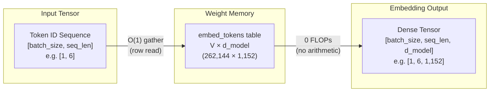

When you feed a prompt to a language model, the tokenizer breaks the
text into pieces and assigns each one an integer ID: `[1054, 492, 281]`.
Yet a transformer cannot compute on discrete integers; the only language
neural networks understand is continuous vector spaces and matrix
multiplications. The **embedding layer** stands precisely at this boundary:
it is the first translator in the architecture, turning discrete token
indices into rich geometric coordinates that the model can reason over.

At first glance, this layer appears deceptively simple. As prompt tokens
enter the model, it executes zero arithmetic operations — it merely
gathers rows from memory into cache (zero FLOPs). Yet it is often one of the
largest weight blocks in the entire network, sometimes accounting for nearly
a third of all parameters. Furthermore, it does far more than map tokens to
static vectors: it anchors positional order, enforces numerical stability
via $\sqrt{d_{\text{model}}}$ scaling, and anchors the final token projection
at generation time via weight tying (`lm_head`).

This guide walks through that entry threshold where integers become
geometry: lookup table mechanics and tensor layouts, the silent
$\sqrt{d_{\text{model}}}$ scaling trap, the evolution of positional
encodings from absolute tables to RoPE, pre-training loss spikes and their
remedies — and the starkly split economics of the same weight matrix
between training and serving.

**In this article**

- [1. Why an LLM needs an embedding layer](#1-why-an-llm-needs-an-embedding-layer)
- [2. Lookup table mechanics](#2-lookup-table-mechanics)
- [3. Vector scaling and where it hides](#3-vector-scaling-and-where-it-hides)
- [4. How positional encoding evolved](#4-how-positional-encoding-evolved)
  - [A. Learned absolute (GPT-2, BERT)](#a-learned-absolute-gpt-2-bert)
  - [B. Sinusoidal (Vaswani et al., 2017)](#b-sinusoidal-vaswani-et-al-2017)
  - [C. RoPE: Rotary Position Embedding (Gemma 3, Llama)](#c-rope-rotary-position-embedding-gemma-3-llama)
  - [Distance comes out for free](#distance-comes-out-for-free)
  - [Direct comparison across schemes](#direct-comparison-across-schemes)
- [5. Loss spikes and WeSaR](#5-loss-spikes-and-wesar)
- [6. Training cost versus serving cost](#6-training-cost-versus-serving-cost)
- [7. PyTorch walkthrough](#7-pytorch-walkthrough)
- [The whole story in six lines](#the-whole-story-in-six-lines)
- [Glossary](#glossary)
- [Going deeper](#going-deeper)

---

## 1. Why an LLM needs an embedding layer

Deep learning models operate strictly on matrix multiplications and
continuous vector spaces. A neural network cannot multiply the string
"cat". Three approaches have been tried to map text into continuous spaces:

- **Word-level.** Splitting on words requires a vocabulary of hundreds of
  thousands of terms. Any missing word triggers an Out-Of-Vocabulary (OOV)
  error, maps to a catch-all `[UNK]` token, and loses its semantic identity.
- **Character-level.** The vocabulary is compact (~256 entries) and OOV is
  eliminated, but sequences explode in length. Because a single character
  carries negligible semantic signal, the quadratic attention context window
  is consumed rapidly by trivial units.
- **Subword.** The standard equilibrium used by modern LLMs (BPE, WordPiece,
  SentencePiece). Frequent words remain whole; rare ones decompose into
  meaningful sub-fragments. For full details on this boundary, see the
  companion article on
  [How tokenization works](post.html?slug=how-tokenization-works).

Tokenization leaves us with integers called **token IDs**. For the input
`"the capital of united states"`, Gemma 3 produces `[2, 1437, 5279, 529, 26974, 5022]`.
These integers have no inherent geometric magnitude, direction, or distance:
ID 5279 being numerically larger than 1437 means nothing semantically.

The embedding layer converts these discrete integers into dense continuous
vectors that act as coordinates in a high-dimensional semantic space.

---

## 2. Lookup table mechanics

> **Embedding layer (`embed_tokens`)** = A trainable weight table with one
> row per vocabulary entry. Its job is not to transform the input mathematically,
> but to *replace* each integer with the row vector it indexes — closer to
> opening a dictionary at a page number than to executing arithmetic.

`embed_tokens` is a weight matrix of shape $V \times d_{\text{model}}$, where
$V$ is the vocabulary size and $d_{\text{model}}$ is the hidden dimension:



- **Lookup table ($O(1)$) logic.** Rather than performing a matrix
  multiplication, `embed_tokens` retrieves the row corresponding to the incoming
  token ID directly from the weight matrix — a **gather** operation, which is a
  memory read rather than arithmetic. Textbooks often define this as multiplying
  a one-hot vector by matrix $E$; that is mathematically equivalent but
  computationally absurd, since 262,144 multiplications minus $d_{\text{model}}$
  are multiplications by zero.
- **Tensor transformation.** An integer array of shape `[batch_size, seq_len]`
  expands into a semantic continuous tensor of shape
  `[batch_size, seq_len, d_model]` after the gather.
- **Model examples.** Gemma-3-1B's table is $262,144 \times 1,152$; on
  Gemma-3-27B it expands to $262,208 \times 5,376$. The 64-row difference is
  real — multimodal variants allocate extra rows for visual tokens.
- **Parameter footprint.** $262,144 \times 1,152 \approx 302\text{M}$
  parameters accounts for ~30% of a 1B model. On Gemma-3-27B, the same
  vocabulary represents only ~5% of total parameters. A wide vocabulary
  exerts severe VRAM pressure primarily on smaller models.
- **Context-blind and order-blind.** The same token ID returns the exact same
  row vector every time. Row 5279 is identical in "river bank" and "bank loan";
  resolving context is the job of subsequent self-attention layers, not this table.
- **`padding_idx`.** Batching requires uniform sequence lengths, so shorter
  inputs are padded with a pad token. Gemma sets `padding_idx=config.pad_token_id`,
  which zeroes out gradient updates for that specific row during backpropagation,
  ensuring the padding representation remains constant.

---

## 3. Vector scaling and where it hides

In Gemma and the original Transformer architecture, vectors leaving the
embedding table are scaled by $\sqrt{d_{\text{model}}}$ ($\sqrt{1152} \approx 33.94$
on Gemma-3-1B) before entering the first transformer block:

$$\mathbf{x}_{\text{scaled}} = \mathbf{x}_{\text{embed}} \times \sqrt{d_{\text{model}}}$$

Read it as: *The raw row retrieved from the table is multiplied by a single
fixed scalar constant.*

- $\mathbf{x}_{\text{embed}}$: The raw row vector read directly from the table.
- $\sqrt{d_{\text{model}}}$: The square root of the hidden dimension, constant
  throughout the model's lifetime (33.94 in Gemma-3-1B).
- $\mathbf{x}_{\text{scaled}}$: The scaled vector injected into the residual
  stream of the first transformer layer.

Where does this number come from, and why is it necessary? A weight stored in
the table typically starts near `0.02` (Gemma uses `initializer_range = 0.02`).
Tracing the arithmetic:

```text
d_model               = 1152
scale factor          = √1152 = 33.94
raw table value       = 0.02
scaled input value    = 0.02 × 33.94 = 0.68
```

Because every element in the row is multiplied by the same 33.94, the vector's
direction in geometric space remains unchanged; only its Euclidean norm grows
by a factor of 33.94.

The reason lies in weight tying (Section 6). One matrix serves simultaneously
as the input embedding table and the output un-embedding projection (`lm_head`),
and those two roles demand conflicting initialization scales: the output side
feeds a softmax, so its weights must begin small (`0.02`) to avoid saturating
the logits and vanishing gradients. However, this small variance leaves the
input vectors far below the unit variance expected by the initial residual
stream. Multiplying by $\sqrt{d_{\text{model}}}$ bridges this structural gap.
*Attention Is All You Need* (§3.4) introduces weight sharing and the
$\sqrt{d_{\text{model}}}$ multiplier in the exact same sentence.

**The PyTorch trap.** In Gemma, this multiplication is implemented directly
inside the embedding module rather than the model's forward backbone:

```python
class Gemma3TextScaledWordEmbedding(nn.Embedding):
    def forward(self, input_ids):
        return super().forward(input_ids) * self.embed_scale.to(self.weight.dtype)
```

Consequently, calling `embed_tokens(ids)` yields **already scaled** vectors,
whereas standard `F.embedding(ids, weight)` returns **unscaled** raw values.
Furthermore, `embed_scale` is a non-persistent buffer excluded from the saved
checkpoint `state_dict`. Any custom serving pipeline that naively loads the
weights and bypasses this module runs without error, yet produces completely
degraded outputs.

Llama-style architectures eliminate weight tying and embedding scaling
altogether, relying instead on input RMSNorm layers at each block boundary.

---

## 4. How positional encoding evolved

Consider two sentences: "dog bites man" and "man bites dog". As shown in Section
2, table lookup returns the exact same three row vectors for both sentences; the
table possesses zero sequential awareness. Self-attention cannot resolve this
alone either: attention calculates relevance using dot products, and the dot
product is commutative ($q \cdot k = k \cdot q$). It cannot discern which word
came first.

Sequence order must therefore be directly injected into the numeric vectors
before attention operates. The goal is not merely telling a token "you are at
index 4,517," but encoding how far apart two tokens sit (relative distance).

Three distinct paradigms have been deployed:
- **A. Learned absolute:** Maintain a second trainable table, one row per slot
  index, and add it element-wise to the token vector.
- **B. Sinusoidal:** Compute fixed trigonometric wave coordinates and add them
  element-wise to the token vector.
- **C. RoPE:** Abandon addition entirely. Rotate the vector in 2D coordinate
  planes by an angle proportional to its slot index and dimension-specific frequency.

```text
A. Learned Absolute (GPT-2, BERT)   B. Sinusoidal (Vaswani 2017)   C. RoPE (Llama, Gemma 3)
   Vector Addition                     Trigonometric Addition         Vector Rotation
   x_i = TokenEmbed + PosEmbed         x_i = TokenEmbed + PE_pos      x_i = R(Θ, i) · TokenEmbed
   (Hard limit: L_max)                 (Norm inflation / drift)       (Exact norm preservation, ||x|| = const)
```

To compare these mechanics cleanly across all three paradigms, we trace a
concrete 6-token sentence across **8-dimensional representations ($d = 8$)**:

$$\text{Sequence: } [\text{"The"}, \ \text{"dog"}, \ \text{"chased"}, \ \text{"the"}, \ \text{"black"}, \ \text{"cat"}] \implies m \in \{0, 1, 2, 3, 4, 5\}$$

Let their raw lexical embeddings gathered from the lookup table be:
- **Slot 0 ("The"):** $\mathbf{x}_{(0)} = [0.80, \ 0.60, \ 0.40, \ 0.20, \ 0.50, \ 0.10, \ 0.30, \ 0.20]^T \implies \Vert \mathbf{x}_{(0)}\Vert = \sqrt{1.59} \approx 1.2610$
- **Slot 1 ("dog"):** $\mathbf{x}_{(1)} = [0.70, \ 0.10, \ 0.30, \ 0.50, \ 0.20, \ 0.40, \ 0.60, \ 0.10]^T \implies \Vert \mathbf{x}_{(1)}\Vert = \sqrt{1.41} \approx 1.1874$
- **Slot 2 ("chased"):** $\mathbf{x}_{(2)} = [0.50, \ 0.80, \ 0.20, \ 0.30, \ 0.40, \ 0.20, \ 0.10, \ 0.50]^T \implies \Vert \mathbf{x}_{(2)}\Vert = \sqrt{1.48} \approx 1.2166$
- **Slot 3 ("the"):** $\mathbf{x}_{(3)} = [0.80, \ 0.60, \ 0.40, \ 0.20, \ 0.50, \ 0.10, \ 0.30, \ 0.20]^T \implies \Vert \mathbf{x}_{(3)}\Vert = \sqrt{1.59} \approx 1.2610$
- **Slot 4 ("black"):** $\mathbf{x}_{(4)} = [0.60, \ 0.20, \ 0.50, \ 0.10, \ 0.30, \ 0.60, \ 0.20, \ 0.40]^T \implies \Vert \mathbf{x}_{(4)}\Vert = \sqrt{1.31} \approx 1.1446$
- **Slot 5 ("cat"):** $\mathbf{x}_{(5)} = [0.30, \ 0.90, \ 0.10, \ 0.40, \ 0.50, \ 0.20, \ 0.40, \ 0.10]^T \implies \Vert \mathbf{x}_{(5)}\Vert = \sqrt{1.53} \approx 1.2369$

*(Note that Slot 0 "The" and Slot 3 "the" retrieve identical lexical vectors and share an exact baseline norm of $1.2610$.)*

### A. Learned absolute (GPT-2, BERT)

A second trainable matrix of shape $L_{\max} \times d_{\text{model}}$ is stored
in parameter memory. Each token representation is the element-wise sum of its
token vector and position vector:

$$\mathbf{x}_i = \text{TokenEmbed}(w_i) + \text{PosEmbed}(i)$$

Suppose training gradients have optimized the 8-dimensional position rows to
the following values:
- $\text{PosEmbed}(0) = [0.00, \ 0.20, \ 0.10, \ 0.00, \ 0.10, \ -0.10, \ 0.00, \ 0.10]$
- $\text{PosEmbed}(1) = [0.20, \ -0.10, \ 0.00, \ 0.10, \ -0.10, \ 0.10, \ 0.10, \ 0.00]$
- $\text{PosEmbed}(2) = [-0.10, \ 0.10, \ 0.20, \ -0.10, \ 0.00, \ 0.10, \ -0.10, \ 0.10]$
- $\text{PosEmbed}(3) = [0.10, \ 0.00, \ -0.10, \ 0.20, \ 0.10, \ 0.00, \ 0.10, \ -0.10]$
- $\text{PosEmbed}(4) = [0.00, \ -0.10, \ 0.10, \ 0.10, \ -0.10, \ 0.00, \ 0.10, \ 0.10]$
- $\text{PosEmbed}(5) = [-0.10, \ 0.20, \ -0.10, \ 0.00, \ 0.10, \ -0.10, \ 0.00, \ 0.10]$

Summing token representations with position vectors:

```text
Slot 0 ("The"):
  TokenEmbed("The") = [ 0.80   0.60   0.40   0.20   0.50   0.10   0.30   0.20 ]
  PosEmbed(0)       = [ 0.00   0.20   0.10   0.00   0.10  -0.10   0.00   0.10 ]
  x_0 (sum)         = [ 0.80   0.80   0.50   0.20   0.60   0.00   0.30   0.30 ]  ──> Norm: 1.45  (drifted from 1.26)

Slot 1 ("dog"):
  TokenEmbed("dog") = [ 0.70   0.10   0.30   0.50   0.20   0.40   0.60   0.10 ]
  PosEmbed(1)       = [ 0.20  -0.10   0.00   0.10  -0.10   0.10   0.10   0.00 ]
  x_1 (sum)         = [ 0.90   0.00   0.30   0.60   0.10   0.50   0.70   0.10 ]  ──> Norm: 1.42  (drifted from 1.19)

Slot 2 ("chased"):
  TokenEmbed("cha") = [ 0.50   0.80   0.20   0.30   0.40   0.20   0.10   0.50 ]
  PosEmbed(2)       = [-0.10   0.10   0.20  -0.10   0.00   0.10  -0.10   0.10 ]
  x_2 (sum)         = [ 0.40   0.90   0.40   0.20   0.40   0.30   0.00   0.60 ]  ──> Norm: 1.33  (drifted from 1.22)

Slot 3 ("the"):
  TokenEmbed("the") = [ 0.80   0.60   0.40   0.20   0.50   0.10   0.30   0.20 ]
  PosEmbed(3)       = [ 0.10   0.00  -0.10   0.20   0.10   0.00   0.10  -0.10 ]
  x_3 (sum)         = [ 0.90   0.60   0.30   0.40   0.60   0.10   0.40   0.10 ]  ──> Norm: 1.40  (drifted from 1.26)

Slot 4 ("black"):
  TokenEmbed("bla") = [ 0.60   0.20   0.50   0.10   0.30   0.60   0.20   0.40 ]
  PosEmbed(4)       = [ 0.00  -0.10   0.10   0.10  -0.10   0.00   0.10   0.10 ]
  x_4 (sum)         = [ 0.60   0.10   0.60   0.20   0.20   0.60   0.30   0.50 ]  ──> Norm: 1.23  (drifted from 1.14)

Slot 5 ("cat"):
  TokenEmbed("cat") = [ 0.30   0.90   0.10   0.40   0.50   0.20   0.40   0.10 ]
  PosEmbed(5)       = [-0.10   0.20  -0.10   0.00   0.10  -0.10   0.00   0.10 ]
  x_5 (sum)         = [ 0.20   1.10   0.00   0.40   0.60   0.10   0.40   0.20 ]  ──> Norm: 1.41  (drifted from 1.24)
```

- **Drawback 1 (Hard context ceiling):** If the model is trained with 2,048
  slots, there is no row 2,049 in the weight matrix. The model cannot handle
  sequences longer than $L_{\max}$ without initializing brand new parameters.
- **Drawback 2 (No inherent relative distance awareness):** The 4-slot distance
  between "dog" (Slot 1) and "cat" (Slot 5) must be learned independently from the
  same 4-slot distance appearing at slots 101 and 105.

### B. Sinusoidal (Vaswani et al., 2017)

Position coordinates are computed analytically using geometric frequency
progressions:

$$PE_{(pos, 2j)} = \sin\left(\frac{pos}{10000^{2j/d}}\right), \quad PE_{(pos, 2j+1)} = \cos\left(\frac{pos}{10000^{2j/d}}\right)$$

Where $pos \in \{0, 1, 2, 3, 4, 5\}$, channel pair index $j \in \{0, 1, 2, 3\}$, and dimension $d = 8$:
- For $j = 0$ (channels 0–1): $\text{divisor} = 10000^{0/8} = 10000^0 = 1.0 \implies \text{frequency} = 1.0\text{ rad/step}$
- For $j = 1$ (channels 2–3): $\text{divisor} = 10000^{2/8} = 10000^{1/4} = 10.0 \implies \text{frequency} = 0.1\text{ rad/step}$
- For $j = 2$ (channels 4–5): $\text{divisor} = 10000^{4/8} = 10000^{1/2} = 100.0 \implies \text{frequency} = 0.01\text{ rad/step}$
- For $j = 3$ (channels 6–7): $\text{divisor} = 10000^{6/8} = 10000^{3/4} = 1000.0 \implies \text{frequency} = 0.001\text{ rad/step}$

Wave coordinates across each slot:

```text
Slot 0 (pos = 0):
  PE_0 = [ sin(0.0), cos(0.0), sin(0.00), cos(0.00), sin(0.000), cos(0.000), sin(0.0000), cos(0.0000) ]
       ≈ [ 0.0000,   1.0000,   0.0000,   1.0000,   0.0000,    1.0000,    0.0000,     1.0000     ]

Slot 1 (pos = 1):
  PE_1 = [ sin(1.0), cos(1.0), sin(0.10), cos(0.10), sin(0.010), cos(0.010), sin(0.0010), cos(0.0010) ]
       ≈ [ 0.8415,   0.5403,   0.0998,   0.9950,   0.0100,    1.0000,    0.0010,     1.0000     ]

Slot 2 (pos = 2):
  PE_2 = [ sin(2.0), cos(2.0), sin(0.20), cos(0.20), sin(0.020), cos(0.020), sin(0.0020), cos(0.0020) ]
       ≈ [ 0.9093,  -0.4161,   0.1987,   0.9801,   0.0200,    0.9998,    0.0020,     1.0000     ]

Slot 3 (pos = 3):
  PE_3 = [ sin(3.0), cos(3.0), sin(0.30), cos(0.30), sin(0.030), cos(0.030), sin(0.0030), cos(0.0030) ]
       ≈ [ 0.1411,  -0.9900,   0.2955,   0.9553,   0.0300,    0.9996,    0.0030,     1.0000     ]

Slot 4 (pos = 4):
  PE_4 = [ sin(4.0), cos(4.0), sin(0.40), cos(0.40), sin(0.040), cos(0.040), sin(0.0040), cos(0.0040) ]
       ≈ [-0.7568,  -0.6536,   0.3894,   0.9211,   0.0400,    0.9992,    0.0040,     1.0000     ]

Slot 5 (pos = 5):
  PE_5 = [ sin(5.0), cos(5.0), sin(0.50), cos(0.50), sin(0.050), cos(0.050), sin(0.0050), cos(0.0050) ]
       ≈ [-0.9589,   0.2837,   0.4794,   0.8776,   0.0500,    0.9988,    0.0050,     1.0000     ]
```

Applying vector addition ($\mathbf{x}_m = \text{TokenEmbed}(w_m) + PE_m$):

```text
Slot 0 ("The"):
  x_0 (sum) = [ 0.80+0.0000, 0.60+1.0000, 0.40+0.0000, 0.20+1.0000, 0.50+0.0000, 0.10+1.0000, 0.30+0.0000, 0.20+1.0000 ]
            = [ 0.8000,      1.6000,      0.4000,      1.2000,      0.5000,      1.1000,      0.3000,      1.2000 ]  ──> Norm: 2.79  (inflated +121%)

Slot 1 ("dog"):
  x_1 (sum) = [ 0.70+0.8415, 0.10+0.5403, 0.30+0.0998, 0.50+0.9950, 0.20+0.0100, 0.40+1.0000, 0.60+0.0010, 0.10+1.0000 ]
            = [ 1.5415,      0.6403,      0.3998,      1.4950,      0.2100,      1.4000,      0.6010,      1.1000 ]  ──> Norm: 2.96  (inflated +149%)

Slot 2 ("chased"):
  x_2 (sum) = [ 0.50+0.9093, 0.80-0.4161, 0.20+0.1987, 0.30+0.9801, 0.40+0.0200, 0.20+0.9998, 0.10+0.0020, 0.50+1.0000 ]
            = [ 1.4093,      0.3839,      0.3987,      1.2801,      0.4200,      1.1998,      0.1020,      1.5000 ]  ──> Norm: 2.79  (inflated +130%)

Slot 3 ("the"):
  x_3 (sum) = [ 0.80+0.1411, 0.60-0.9900, 0.40+0.2955, 0.20+0.9553, 0.50+0.0300, 0.10+0.9996, 0.30+0.0030, 0.20+1.0000 ]
            = [ 0.9411,     -0.3900,      0.6955,      1.1553,      0.5300,      1.0996,      0.3030,      1.2000 ]  ──> Norm: 2.42  (inflated +92%)

Slot 4 ("black"):
  x_4 (sum) = [ 0.60-0.7568, 0.20-0.6536, 0.50+0.3894, 0.10+0.9211, 0.30+0.0400, 0.60+0.9992, 0.20+0.0040, 0.40+1.0000 ]
            = [-0.1568,     -0.4536,      0.8894,      1.0211,      0.3400,      1.5992,      0.2040,      1.4000 ]  ──> Norm: 2.60  (inflated +127%)

Slot 5 ("cat"):
  x_5 (sum) = [ 0.30-0.9589, 0.90+0.2837, 0.10+0.4794, 0.40+0.8776, 0.50+0.0500, 0.20+0.9988, 0.40+0.0050, 0.10+1.0000 ]
            = [-0.6589,      1.1837,      0.5794,      1.2776,      0.5500,      1.1988,      0.4050,      1.1000 ]  ──> Norm: 2.63  (inflated +113%)
```

- **Drawback (Severe semantic distortion & norm drift):** Addition drastically
  deforms vector lengths. Identical vectors ("The" at Slot 0 and "the" at Slot 3)
  end up with wildly different norms ($2.79$ vs $2.42$), distorting the base
  lexical signal based purely on where they land in a sentence.

### C. RoPE: Rotary Position Embedding (Gemma 3, Llama)

The fatal flaw of earlier methods (Learned Absolute and Sinusoidal) was that they
injected position by **adding vectors** ($\mathbf{x} + \mathbf{p}$). As shown above,
adding two vectors deforms the token's original lexical vector, inflating its norm
from $1.26$ up to $2.96$ (up to +149% inflation!). In the attention layer, this artificial
surge squares unscaled dot products and destabilizes the softmax distribution.

**RoPE's core insight can be stated in a single question:**
> *"How can we encode sequence order without changing a token's vector length (semantic identity) by even 0.001%?"*

**The Answer: Stop adding vectors—rotate them like compass needles instead!**

Imagine a 10 cm compass needle resting on a table. No matter how many degrees you
turn the needle around its pivot, its length remains strictly 10 cm. Instead of
stretching or shrinking vectors, **RoPE (Rotary Position Embedding)** rotates token
vectors across geometric coordinate planes based purely on where they land in a
sentence.

$$\mathbf{x}_m = \mathbf{R}_{\Theta, m}^{d} \cdot \text{TokenEmbed}(w_m)$$

**Reading the formula in plain language:**
*The raw lexical vector retrieved from the embedding table ($\text{TokenEmbed}$) is
multiplied by a rotation matrix ($\mathbf{R}$) computed for token position $m$.
Its Euclidean length remains perfectly locked while its orientation points in a
direction unique to that slot.*

The core building blocks of this formula:
- **$\text{TokenEmbed}(w_m)$:** The raw semantic vector ($d = 8$ dimensions)
  retrieved from the embedding table. Carries zero positional information; "The"
  produces the exact same lookup values wherever it appears.
- **$m$:** The token's slot index in the sequence ($m = 0, 1, 2, 3, \dots$), acting
  like discrete time steps.
- **$\Theta = \{\theta_1, \theta_2, \dots, \theta_{d/2}\}$:** The set of
  dimension-specific base angular velocities (4 pairs for $d = 8$).
- **$\mathbf{R}_{\Theta, m}^{d}$:** The $8 \times 8$ block-diagonal rotation
  matrix assembled for slot $m$.
- **$\mathbf{x}_m$:** The rotated output vector, preserving 100% of its base norm
  while directionally encoding position.

---

#### 1. The Core Rule: Angle = Position × Angular Velocity

The intuition behind RoPE is as simple as a spinning wheel:

$$\text{Rotation Angle} = \text{Position} \times \text{Angular Velocity} \implies \phi(m) = m \cdot \theta$$

- **Position 0 ($m = 0$):** $0 \times \theta = 0^\circ$ rotation. The needle stays at its original orientation (12 o'clock).
- **Position 1 ($m = 1$):** Nudges forward by $1 \times \theta$.
- **Position 2 ($m = 2$):** Advances forward by $2 \times \theta$.
- **Position 50 ($m = 50$):** Sweeps forward by $50 \times \theta$.

The further a token sits in a sentence, the further its needle has advanced. The
word's intrinsic semantic content (vector length) remains entirely untouched; only
its orientation shifts smoothly with sequence position.

---

#### 2. The 2D Plane Trick: How to Rotate an 8-Dimensional Vector

Instead of attempting to rotate an 8-dimensional vector as a monolithic body in 8D
space, RoPE resolves this with an **ingenious decomposition trick**:
It slices the 8-dimensional vector into **4 independent pairs of 2D numbers**:

$$(x_1, x_2), \quad (x_3, x_4), \quad (x_5, x_6), \quad (x_7, x_8)$$

Picture this as **4 little clock dials sitting side by side on a desk**. Each dial
has a 2D coordinate arrow $(x, y)$. Rotating a 2D arrow around the origin by an
angle $\phi$ is basic high school trigonometry:

$$\tilde{x}_1 = x_1 \cos\phi - x_2 \sin\phi$$
$$\tilde{x}_2 = x_1 \sin\phi + x_2 \cos\phi$$

*(For complex number enthusiasts: This is identical to multiplying the complex
number $z = x_1 + i x_2$ by $e^{i\phi}$; since $|e^{i\phi}| = 1$ via Euler's
identity, the magnitude never changes!)*

**Why vector length never distorts (Mathematical Proof):**
Summing the squares of the rotated components:
$$\tilde{x}_1^2 + \tilde{x}_2^2 = (x_1 \cos\phi - x_2 \sin\phi)^2 + (x_1 \sin\phi + x_2 \cos\phi)^2 = (x_1^2 + x_2^2)(\cos^2\phi + \sin^2\phi)$$
Because $\cos^2\phi + \sin^2\phi = 1$ for any angle $\phi$:
$$\tilde{x}_1^2 + \tilde{x}_2^2 = x_1^2 + x_2^2$$
The vector length does not inflate by a single fraction. Across all 4 coordinate
pairs, norm drift is strictly **0.00%**!

---

#### 3. Why Multiple Speeds? The Clock Hands Analogy

"Do all 4 dimension pairs rotate at the same angular velocity ($\theta$)?"
**No.** Picture an analog wristwatch. Why does a watch have a second hand, a
minute hand, and an hour hand?

- **If a watch only had a second hand:** It would spin wildly fast and complete a
  full circle every 60 seconds. You could never tell what hour of the day it was
  (12:00 and 24:00 look identical—known as **phase wrapping**).
- **If a watch only had an hour hand:** It would crawl so slowly that you could
  never tell which second had just ticked by.

RoPE assigns different angular velocities ($\theta_j$) across our 4 dimension
pairs on the exact same principle:

These velocities are computed analytically (for $d = 8$ and $\text{base} = 10,000$):

$$\theta_j = \text{base}^{-\frac{2(j-1)}{d}} = \frac{1}{\text{base}^{\frac{2(j-1)}{d}}} \quad [\text{radians per token step}]$$

Because $10,000 = 10^4$, across our $d = 8$ model the fractional exponents simplify cleanly into powers of 10:

- **Pair 1 ($j = 1$, channels 1–2):**  
  Exponent: $\frac{2(1-1)}{8} = \frac{0}{8} = 0 \implies \theta_1 = \frac{1}{10000^0} = \frac{1}{1} = \mathbf{1.0\text{ rad/step}} \ (\approx 57.3^\circ)$
- **Pair 2 ($j = 2$, channels 3–4):**  
  Exponent: $\frac{2(2-1)}{8} = \frac{2}{8} = \frac{1}{4} \implies \theta_2 = \frac{1}{10000^{1/4}} = \frac{1}{\sqrt[4]{10^4}} = \frac{1}{10} = \mathbf{0.1\text{ rad/step}} \ (\approx 5.73^\circ)$
- **Pair 3 ($j = 3$, channels 5–6):**  
  Exponent: $\frac{2(3-1)}{8} = \frac{4}{8} = \frac{1}{2} \implies \theta_3 = \frac{1}{10000^{1/2}} = \frac{1}{\sqrt{10000}} = \frac{1}{100} = \mathbf{0.01\text{ rad/step}} \ (\approx 0.57^\circ)$
- **Pair 4 ($j = 4$, channels 7–8):**  
  Exponent: $\frac{2(4-1)}{8} = \frac{6}{8} = \frac{3}{4} \implies \theta_4 = \frac{1}{10000^{3/4}} = \frac{1}{(\sqrt[4]{10^4})^3} = \frac{1}{10^3} = \frac{1}{1000} = \mathbf{0.001\text{ rad/step}} \ (\approx 0.057^\circ)$

With standard $\text{base} = 10,000$, the angular velocities and revolution
periods for our 4 pairs:

| Subspace | Angular Velocity ($\theta_j$) | Turn per Token | Period ($T_j = 2\pi/\theta_j$) | Clock Analogy & Role |
| :--- | :---: | :---: | :---: | :--- |
| **Pair 1 ($j=1$, channels 1–2)** | $1.0\text{ rad}$ | $\approx 57.3^\circ$ | $T_1 = 2\pi / 1.0 \approx 6.28\text{ tokens}$ | **Second Hand (Microscope):** Sweeps fast; sharply distinguishes neighboring tokens ("The" $\to$ "dog"). |
| **Pair 2 ($j=2$, channels 3–4)** | $0.1\text{ rad}$ | $\approx 5.73^\circ$ | $T_2 = 2\pi / 0.1 \approx 62.83\text{ tokens}$ | **Fast Minute Hand:** Measures clause-level distances (10–60 tokens). |
| **Pair 3 ($j=3$, channels 5–6)** | $0.01\text{ rad}$ | $\approx 0.57^\circ$ | $T_3 = 2\pi / 0.01 \approx 628.3\text{ tokens}$ | **Slow Minute Hand:** Preserves paragraph-level relationships. |
| **Pair 4 ($j=4$, channels 7–8)** | $0.001\text{ rad}$ | $\approx 0.057^\circ$ | $T_4 = 2\pi / 0.001 \approx 6283.2\text{ tokens}$ | **Hour Hand (Telescope):** Rotates slowly; preserves global order across long books. |

**Why `rope_theta` Was Scaled to 1,000,000:**
When LLaMA 1 operated on 2,048-token contexts, `base = 10000` was sufficient because
the slowest hour hand took 6,283 tokens to complete a circle. But when modern models
(LLaMA 3, Gemma 3) expanded context windows to **131,072 (128k) tokens**, `base = 10000`
caused even the slowest hands to loop dozens of times, triggering catastrophic
**phase wrapping** (tokens 50 and 65,000 landing on identical angles). Raising
`rope_theta` to `1,000,000` stretches the slowest revolution into **millions of
tokens**, guaranteeing every position across a 128k sequence receives a globally
unique angular signature.

---

#### 4. Applying RoPE in Practice: The 4-Step Pipeline

Given a token vector $\mathbf{x} = [x_1, x_2, x_3, x_4, x_5, x_6, x_7, x_8]^T$,
RoPE transforms it for slot $m$ in 4 steps:

1. **Partition into 2D Pairs:** Group channels into 4 independent planes:
   - Pair 1: $(x_1, x_2)$
   - Pair 2: $(x_3, x_4)$
   - Pair 3: $(x_5, x_6)$
   - Pair 4: $(x_7, x_8)$
2. **Compute Angles:** Multiply position index by subspace angular velocities:
   $$\phi_1(m) = m \times 1.0, \quad \phi_2(m) = m \times 0.1, \quad \phi_3(m) = m \times 0.01, \quad \phi_4(m) = m \times 0.001$$
3. **Rotate Each Pair Independently (2D Trigonometry):**
   $$\begin{pmatrix} \tilde{x}_1 \\ \tilde{x}_2 \end{pmatrix} = \begin{pmatrix} x_1 \cos(\phi_1) - x_2 \sin(\phi_1) \\ x_1 \sin(\phi_1) + x_2 \cos(\phi_1) \end{pmatrix}, \quad \begin{pmatrix} \tilde{x}_3 \\ \tilde{x}_4 \end{pmatrix} = \begin{pmatrix} x_3 \cos(\phi_2) - x_4 \sin(\phi_2) \\ x_3 \sin(\phi_2) + x_4 \cos(\phi_2) \end{pmatrix}$$
   $$\begin{pmatrix} \tilde{x}_5 \\ \tilde{x}_6 \end{pmatrix} = \begin{pmatrix} x_5 \cos(\phi_3) - x_6 \sin(\phi_3) \\ x_5 \sin(\phi_3) + x_6 \cos(\phi_3) \end{pmatrix}, \quad \begin{pmatrix} \tilde{x}_7 \\ \tilde{x}_8 \end{pmatrix} = \begin{pmatrix} x_7 \cos(\phi_4) - x_8 \sin(\phi_4) \\ x_7 \sin(\phi_4) + x_8 \cos(\phi_4) \end{pmatrix}$$
4. **Assemble into Block-Diagonal Matrix:** Express the transformation compactly:
   $$\mathbf{R}_{\Theta, m}^{8} = \begin{bmatrix} \mathbf{R}_{\phi_1} & 0 & 0 & 0 \\ 0 & \mathbf{R}_{\phi_2} & 0 & 0 \\ 0 & 0 & \mathbf{R}_{\phi_3} & 0 \\ 0 & 0 & 0 & \mathbf{R}_{\phi_4} \end{bmatrix}, \quad \text{where } \mathbf{R}_{\phi_j} = \begin{bmatrix} \cos(m\theta_j) & -\sin(m\theta_j) \\ \sin(m\theta_j) & \cos(m\theta_j) \end{bmatrix}$$
   The matrix contains four $2 \times 2$ rotation blocks along the diagonal; all
   other entries are zero. Each coordinate pair rotates strictly within its own 2D
   plane without inter-channel leakage.

Applying this transformation step-by-step across our 6-token sequence:

**Slot 0 ($m = 0$): "The" — Step-by-Step Calculation**
- **Raw lexical vector:** $\mathbf{x}_{(0)} = [0.80, \ 0.60, \ 0.40, \ 0.20, \ 0.50, \ 0.10, \ 0.30, \ 0.20]^T$
- **Angles calculation ($m = 0$, so all angles are $0$ rad):**
  - $\phi_1(0) = 0 \times 1.0 = 0.0\text{ rad} \implies \cos(0) = 1.0, \quad \sin(0) = 0.0$
  - $\phi_2(0) = 0 \times 0.1 = 0.0\text{ rad} \implies \cos(0) = 1.0, \quad \sin(0) = 0.0$
  - $\phi_3(0) = 0 \times 0.01 = 0.0\text{ rad} \implies \cos(0) = 1.0, \quad \sin(0) = 0.0$
  - $\phi_4(0) = 0 \times 0.001 = 0.0\text{ rad} \implies \cos(0) = 1.0, \quad \sin(0) = 0.0$
- **2D rotation applied to each coordinate pair:**
  - Pair 1: $\tilde{x}_1 = 0.80(1.0) - 0.60(0.0) = 0.8000, \quad \tilde{x}_2 = 0.80(0.0) + 0.60(1.0) = 0.6000$
  - Pair 2: $\tilde{x}_3 = 0.40(1.0) - 0.20(0.0) = 0.4000, \quad \tilde{x}_4 = 0.40(0.0) + 0.20(1.0) = 0.2000$
  - Pair 3: $\tilde{x}_5 = 0.50(1.0) - 0.10(0.0) = 0.5000, \quad \tilde{x}_6 = 0.50(0.0) + 0.10(1.0) = 0.1000$
  - Pair 4: $\tilde{x}_7 = 0.30(1.0) - 0.20(0.0) = 0.3000, \quad \tilde{x}_8 = 0.30(0.0) + 0.20(1.0) = 0.2000$
- **Rotated vector and preserved norm:**
  $$\mathbf{x}_{\text{rotated}(0)} = [0.8000, \ 0.6000, \ 0.4000, \ 0.2000, \ 0.5000, \ 0.1000, \ 0.3000, \ 0.2000]^T$$
  $$\Vert \mathbf{x}_{\text{rotated}(0)}\Vert = \sqrt{0.80^2 + 0.60^2 + 0.40^2 + 0.20^2 + 0.50^2 + 0.10^2 + 0.30^2 + 0.20^2} = \sqrt{1.59} \approx \mathbf{1.2610} \quad (\text{Preserved exactly})$$

**Slot 1 ($m = 1$): "dog" — Step-by-Step Calculation**
- **Raw lexical vector:** $\mathbf{x}_{(1)} = [0.70, \ 0.10, \ 0.30, \ 0.50, \ 0.20, \ 0.40, \ 0.60, \ 0.10]^T$
- **Angles calculation ($m = 1$ step forward):**
  - $\phi_1(1) = 1 \times 1.0 = 1.0\text{ rad} \implies \cos(1.0) \approx 0.5403, \quad \sin(1.0) \approx 0.8415$
  - $\phi_2(1) = 1 \times 0.1 = 0.1\text{ rad} \implies \cos(0.1) \approx 0.9950, \quad \sin(0.1) \approx 0.0998$
  - $\phi_3(1) = 1 \times 0.01 = 0.01\text{ rad} \implies \cos(0.01) \approx 1.0000, \quad \sin(0.01) \approx 0.0100$
  - $\phi_4(1) = 1 \times 0.001 = 0.001\text{ rad} \implies \cos(0.001) \approx 1.0000, \quad \sin(0.001) \approx 0.0010$
- **2D rotation applied to each coordinate pair:**
  - Pair 1: $\tilde{x}_1 = 0.70(0.5403) - 0.10(0.8415) = 0.2941, \quad \tilde{x}_2 = 0.70(0.8415) + 0.10(0.5403) = 0.6431$
  - Pair 2: $\tilde{x}_3 = 0.30(0.9950) - 0.50(0.0998) = 0.2486, \quad \tilde{x}_4 = 0.30(0.0998) + 0.50(0.9950) = 0.5275$
  - Pair 3: $\tilde{x}_5 = 0.20(1.0000) - 0.40(0.0100) = 0.1960, \quad \tilde{x}_6 = 0.20(0.0100) + 0.40(1.0000) = 0.4020$
  - Pair 4: $\tilde{x}_7 = 0.60(1.0000) - 0.10(0.0010) = 0.5999, \quad \tilde{x}_8 = 0.60(0.0010) + 0.10(1.0000) = 0.1006$
- **Rotated vector and preserved norm:**
  $$\mathbf{x}_{\text{rotated}(1)} = [0.2941, \ 0.6431, \ 0.2486, \ 0.5275, \ 0.1960, \ 0.4020, \ 0.5999, \ 0.1006]^T \implies \Vert \mathbf{x}_{\text{rotated}(1)}\Vert = \sqrt{1.41} \approx \mathbf{1.1874} \quad (\text{Preserved})$$

**Slot 2 ($m = 2$): "chased"**
- Angles: $\phi_1 = 2.0\text{ rad}, \ \phi_2 = 0.2\text{ rad}, \ \phi_3 = 0.02\text{ rad}, \ \phi_4 = 0.002\text{ rad}$
- $\mathbf{x}_{\text{rotated}(2)} = [-0.9355, \ 0.1217, \ 0.1364, \ 0.3338, \ 0.3959, \ 0.2080, \ 0.0990, \ 0.5002]^T \implies \text{Norm} = \mathbf{1.2166} \quad (\text{Preserved})$

**Slot 3 ($m = 3$): "the"**
- Angles: $\phi_1 = 3.0\text{ rad}, \ \phi_2 = 0.3\text{ rad}, \ \phi_3 = 0.03\text{ rad}, \ \phi_4 = 0.003\text{ rad}$
- $\mathbf{x}_{\text{rotated}(3)} = [-0.8767, \ -0.4811, \ 0.3230, \ 0.3093, \ 0.4968, \ 0.1150, \ 0.2994, \ 0.2009]^T \implies \text{Norm} = \mathbf{1.2610} \quad (\text{Preserved})$

**Slot 4 ($m = 4$): "black"**
- Angles: $\phi_1 = 4.0\text{ rad}, \ \phi_2 = 0.4\text{ rad}, \ \phi_3 = 0.04\text{ rad}, \ \phi_4 = 0.004\text{ rad}$
- $\mathbf{x}_{\text{rotated}(4)} = [-0.2408, \ -0.5848, \ 0.4216, \ 0.2868, \ 0.2758, \ 0.6115, \ 0.1984, \ 0.4008]^T \implies \text{Norm} = \mathbf{1.1446} \quad (\text{Preserved})$

**Slot 5 ($m = 5$): "cat"**
- Angles: $\phi_1 = 5.0\text{ rad}, \ \phi_2 = 0.5\text{ rad}, \ \phi_3 = 0.05\text{ rad}, \ \phi_4 = 0.005\text{ rad}$
- $\mathbf{x}_{\text{rotated}(5)} = [0.9481, \ -0.0324, \ -0.1040, \ 0.3990, \ 0.4894, \ 0.2247, \ 0.3995, \ 0.1020]^T \implies \text{Norm} = \mathbf{1.2369} \quad (\text{Preserved})$

**Reference PyTorch implementation: applying RoPE in $O(d)$.** In production
LLMs (LLaMA, Gemma, Mistral), dense matrix multiplications with
$\mathbf{R}_{\Theta, m}^{d}$ are never instantiated. Instead, the rotation is
executed directly on vector slices in $O(d)$ time. For readers who want to run and
test these exact calculations, here is the complete self-contained script using our
6-token, 8-dimensional mock embeddings:

```python
import torch

def get_rotary_position_encoding(
    input: torch.Tensor,
    base: float = 10000.0,
    device: str = "cpu"
) -> torch.Tensor:
    """
    Applies Rotary Position Embedding (RoPE) to a tensor of shape [context_length, dimension].
    Directly matches the interleaved consecutive 2D pairs from our theoretical walkthrough:
      - Pair 1: (x1, x2) = (input[:, 0], input[:, 1])
      - Pair 2: (x3, x4) = (input[:, 2], input[:, 3])
      - Pair 3: (x5, x6) = (input[:, 4], input[:, 5])
      - Pair 4: (x7, x8) = (input[:, 6], input[:, 7])
    """
    context_length, dimension = input.shape
    assert dimension % 2 == 0, "Feature dimension must be even"

    half_dimension = dimension // 2

    # Step 1: Base angular frequencies for each 2D subspace: theta_j = 1 / base^(2j/d)
    freqs_indices = torch.arange(0, half_dimension, device=device, dtype=torch.float32)
    freqs = 1.0 / (base ** (2.0 * freqs_indices / dimension))

    # Step 2: Outer product creates angles grid: phi(m, j) = m * theta_j
    positions = torch.arange(0, context_length, device=device, dtype=torch.float32).unsqueeze(1)
    angles = positions * freqs

    sin_angles = torch.sin(angles)
    cos_angles = torch.cos(angles)

    # Step 3: Extract even and odd coordinates (consecutive 2D pairs):
    x_even = input[:, 0::2]  # channels 0, 2, 4, 6 (x1, x3, x5, x7)
    x_odd  = input[:, 1::2]  # channels 1, 3, 5, 7 (x2, x4, x6, x8)

    # 2D rotation formulas: [x1*cos - x2*sin, x1*sin + x2*cos]
    x_even_rotated = x_even * cos_angles - x_odd * sin_angles
    x_odd_rotated  = x_even * sin_angles + x_odd * cos_angles

    # Step 4: Reassemble into original channel layout
    input_rotated = torch.empty_like(input)
    input_rotated[:, 0::2] = x_even_rotated
    input_rotated[:, 1::2] = x_odd_rotated

    return input_rotated

# -------------------------------------------------------------
# Verification with Mock Embeddings from the Article:
# Sequence: ["The", "dog", "chased", "the", "black", "cat"]
# -------------------------------------------------------------
mock_embeddings = torch.tensor([
    [0.80, 0.60, 0.40, 0.20, 0.50, 0.10, 0.30, 0.20],  # Slot 0 ("The")
    [0.70, 0.10, 0.30, 0.50, 0.20, 0.40, 0.60, 0.10],  # Slot 1 ("dog")
    [0.50, 0.80, 0.20, 0.30, 0.40, 0.20, 0.10, 0.50],  # Slot 2 ("chased")
    [0.80, 0.60, 0.40, 0.20, 0.50, 0.10, 0.30, 0.20],  # Slot 3 ("the")
    [0.60, 0.20, 0.50, 0.10, 0.30, 0.60, 0.20, 0.40],  # Slot 4 ("black")
    [0.30, 0.90, 0.10, 0.40, 0.50, 0.20, 0.40, 0.10],  # Slot 5 ("cat")
], dtype=torch.float32)

# Apply RoPE:
pos_rotary_encodings = get_rotary_position_encoding(mock_embeddings)

print("Raw Input Embeddings:\n", mock_embeddings)
print("\nRotated Embeddings (RoPE):\n", pos_rotary_encodings.round(decimals=4))

# Verification: Norms before and after rotation match exactly (0% drift)
print("\nOriginal norms: ", mock_embeddings.norm(dim=-1).round(decimals=4))
print("Rotated norms:  ", pos_rotary_encodings.norm(dim=-1).round(decimals=4))
assert torch.allclose(mock_embeddings.norm(dim=-1), pos_rotary_encodings.norm(dim=-1))
```

> **Production context 1: where RoPE is actually injected in Gemma 3 & LLaMA.**  
> In this walkthrough, we apply RoPE directly to lexical vectors to illustrate
> mechanics clearly. In production architectures (Gemma 3, LLaMA, Mistral, Qwen), RoPE
> is **never applied to the lexical embedding table**. Instead, it is injected
> directly onto the **Query ($Q$) and Key ($K$)** projections inside each attention
> head; Value ($V$) projections receive zero rotation. This maintains a clean
> separation between lexical semantics and positional geometry until the exact
> instant dot-product attention computes token-to-token affinity.

> **Production context 2: Interleaved vs. Split-Half dimension pairing.**  
> In practical engineering, frameworks partition the feature vector into 2D pairs
> following two distinct design patterns:
> 
> 1. **Interleaved / Alternating (GPT-J & Original RoFormer Style):**
>    Pairs adjacent even and odd coordinates: $(x_0, x_1), (x_2, x_3), (x_4, x_5), (x_6, x_7)$.
>    Implemented via strided slicing in PyTorch: `input[:, 0::2]` and `input[:, 1::2]`.
>    This was introduced in the seminal **RoFormer** paper (Su et al.) and EleutherAI's **GPT-J**.
>    It is mathematically and geometrically the most transparent formulation
>    (which is why our reference code implements this layout for pedagogical clarity).
> 
> 2. **Split-Half / Rotate-Half (LLaMA, Gemma, Mistral, Qwen & Hugging Face Style):**
>    Splits the head dimension down the middle into two contiguous halves: $[0 \dots d/2-1]$
>    and $[d/2 \dots d-1]$. It pairs channel $i$ with channel $i + d/2$: $(x_i, x_{i + d/2})$.
>    Implemented via contiguous slicing in PyTorch: `input[:, :d//2]` and `input[:, d//2:]`.
>    This is the signature pattern found in **LLaMA (Meta)**, **Gemma (Google)**, **Mistral**,
>    **Qwen**, and the standard Hugging Face `rotate_half` utility.
> 
> **Why did production architectures switch to split-half?**  
> Solely for **GPU memory efficiency (memory coalescing)**: on modern GPUs (CUDA and Triton
> kernels), loading contiguous blocks of memory (`[:d//2]`) allows vectorized SIMD instructions
> and maximizes cache line bandwidth, avoiding the strided memory fragmentation caused by `0::2`.
> 
> *Engineering Note:* Both patterns perform $d/2$ independent 2D planar rotations and are
> mathematically **isomorphic** (identical in representational capacity). However, because their
> channel mappings differ, weights trained with interleaved pairing cannot be loaded into a
> split-half runtime without reordering. This is why Hugging Face's official model conversion scripts
> (`convert_llama_weights_to_hf.py`) include a dedicated permutation step (`permute`) to align
> raw checkpoint tensors with the `rotate_half` memory layout.

### Distance comes out for free

When calculating dot-product attention between Query at slot $m$ and Key at
slot $n$, the orthogonal structure of rotation matrices
($\mathbf{R}_m^T \mathbf{R}_n = \mathbf{R}_{n-m}$) delivers relative position
awareness naturally:

$$\langle \mathbf{R}_m Q_m, \ \mathbf{R}_n K_n \rangle = (\mathbf{R}_m Q_m)^T (\mathbf{R}_n K_n) = Q_m^T \mathbf{R}_m^T \mathbf{R}_n K_n = Q_m^T \mathbf{R}_{n-m} K_n$$

Read it as: *The dot product of two rotated vectors depends strictly on their
relative distance ($(n - m)$), completely independent of their absolute positions.*

We can verify this directly on our sequence. Consider the attention from "dog"
($m = 1$) to "cat" ($n = 5$):
- Relative distance: $n - m = 5 - 1 = 4$ slots.
- Relative rotation operator $\mathbf{R}_{5-1} = \mathbf{R}_4$ governs the interaction:
  - Subspace 1 relative angle: $\Delta\phi_1 = 4 \times 1.0 = 4.0\text{ rad}$
  - Subspace 2 relative angle: $\Delta\phi_2 = 4 \times 0.1 = 0.4\text{ rad}$
  - Subspace 3 relative angle: $\Delta\phi_3 = 4 \times 0.01 = 0.04\text{ rad}$
  - Subspace 4 relative angle: $\Delta\phi_4 = 4 \times 0.001 = 0.004\text{ rad}$

Whether this token pair appears at indices $1 \to 5$ or $10,001 \to 10,005$ in a
128k document, $(n - m) = 4$ is identical. Absolute positions ($m=1, n=5$)
vanish entirely from the inner product, leaving strictly their 4-step relative
geometry.

### Direct comparison across schemes

| Metric / Behavior | A. Learned Absolute | B. Sinusoidal | C. RoPE |
| :--- | :---: | :---: | :---: |
| **Slot 0 ("The") Output** | `[0.80, 0.80, 0.50, 0.20, 0.60, 0.00, 0.30, 0.30]` | `[0.80, 1.60, 0.40, 1.20, 0.50, 1.10, 0.30, 1.20]` | `[0.80, 0.60, 0.40, 0.20, 0.50, 0.10, 0.30, 0.20]` |
| **Slot 0 Norm** | 1.45 | 2.79 | **1.26 (0% drift)** |
| **Slot 1 ("dog") Output** | `[0.90, 0.00, 0.30, 0.60, 0.10, 0.50, 0.70, 0.10]` | `[1.54, 0.64, 0.40, 1.50, 0.21, 1.40, 0.60, 1.10]` | `[0.29, 0.64, 0.25, 0.53, 0.20, 0.40, 0.60, 0.10]` |
| **Slot 1 Norm** | 1.42 | 2.96 | **1.19 (0% drift)** |
| **Slot 2 ("chased") Norm** | 1.33 | 2.79 | **1.22 (0% drift)** |
| **Slot 3 ("the") Norm** | 1.40 | 2.42 | **1.26 (0% drift)** |
| **Slot 4 ("black") Norm** | 1.23 | 2.60 | **1.14 (0% drift)** |
| **Slot 5 ("cat") Norm** | 1.41 | 2.63 | **1.24 (0% drift)** |
| **Norm Inflation?** | Yes | Yes (Severe) | **No (Strictly Preserved)** |
| **Relative Distance Inherent?** | No | Partial | **Yes (Exact $n-m$)** |
| **Trainable Parameters** | $L_{\max} \times d_{\text{model}}$ | 0 | **0** |

**Why vector length must not distort (norm preservation).** Attention scores
are computed by dot products: $\mathbf{u} \cdot \mathbf{v} = \Vert \mathbf{u}\Vert \Vert \mathbf{v}\Vert \cos(\theta)$.
Under scheme B, inflating a vector norm from $1.26$ to $2.96$ multiplies
unscaled dot products by roughly $5\times$, pushing softmax logits into extreme
saturation. One token monopolizes the distribution, driving gradients for all
other tokens to zero. RoPE rotates vectors across geometric planes without
stretching or shrinking them, locking norms at their initial magnitudes.

**Why relative distance matters (context generalization).** Syntax relies on
relative displacement: the subject-verb dependency between "dog" and "chased"
is a 1-slot displacement whether it occurs on page 1 or page 500. This distance
awareness provides three vital capabilities:

1. **Translation invariance:** Linguistic grammar is position-agnostic. Because
   $(n - m) = 1$ produces the exact same relative rotation $\mathbf{R}_1$
   everywhere, the model applies identical attention dynamics across the entire document.
2. **Context extrapolation:** While learned absolute tables break past $L_{\max}$,
   relative rotations generalize smoothly across longer sequences.
3. **Natural length decay:** Fast-rotating channels ($\theta_1 = 1.0$) oscillate
   rapidly to isolate local syntax. Slow-rotating channels ($\theta_4 = 0.001$)
   decay gently, preserving long-range thematic coherence across thousands of tokens.

## 5. Loss spikes and WeSaR

A **loss spike** — the sudden, pathological divergence of loss during
pre-training — is fundamentally tied to parameter scale imbalances across
deep layers.

```text
Residual scaling (1/sqrt(2N)) ──> Parameter norms shrink (||W_d|| ≈ 0.002)
                                                │
                                                ▼
                              High relative update ratio (||ΔW|| / ||W||)
                                                │
                                                ▼
                                   Extreme instability & LOSS SPIKE
```

**Why it happens (norm imbalance).** To stabilize gradients in very deep
transformers, residual branches use depth-based scaling ($1/\sqrt{2N}$).
This causes down-projection matrices ($W_d$, $W_o$) to initialize with
exceptionally small weight norms (`0.002`). When updated via Adam, whose step
sizes are normalized by historical gradient variance, updates are roughly
uniform in magnitude (`0.001`) regardless of base weight scale:

| Matrix State | Typical Weight Magnitude | Adam Step Size | Relative Change ($\Vert \Delta W \Vert / \Vert W \Vert$) |
| :--- | ---: | ---: | ---: |
| Standard initialization | 0.02 | 0.001 | 5% |
| Shrunk by $1/\sqrt{2N}$ | 0.002 | 0.001 | **50%** |

A 50% relative shift in a single optimization step destabilizes activation
distributions across adjacent layers, triggering a destructive loss spike.

**The WeSaR solution.** Weight Scaling as Reparameterization (WeSaR) decouples
the matrix's operational magnitude from its storage scale using a single
trainable scalar $\alpha$:

$$\bar{W} = \alpha W, \quad \text{where } W \sim \mathcal{N}(0, \sigma^2)$$

- $W$: The underlying weight matrix, stored and updated using standard scale
  $\sigma \approx 0.02$.
- $\alpha$: A trainable scalar parameter ($\alpha \approx 0.1$).
- $\bar{W}$: The effective weight matrix seen during the forward pass
  ($0.1 \times 0.02 = 0.002$).

```text
Conventional: store 0.002 directly             → W = 0.002
WeSaR:        store 0.02, maintain α = 0.1     → W̄ = 0.1 × 0.02 = 0.002
```

The forward pass receives the required small scale ($0.002$), but Adam
updates a matrix scaled at $0.02$. The relative update ratio remains stable
at 5%, insulating the network from optimization shocks.

---

## 6. Training cost versus serving cost

The embedding layer presents completely different engineering bottlenecks
between training and inference:

| Dimension | Training Profile | Inference / Serving Profile |
| :--- | :--- | :--- |
| **Primary Bottleneck** | Gradient memory and bandwidth across $E$ | VRAM memory residency and bandwidth |
| **Embedding Compute** | Negligible ($O(1)$ gather) | Negligible ($O(1)$ gather) |
| **Tied Component (`lm_head`)** | Shared backward gradient accumulation | $2 \times d_{\text{model}} \times V$ FLOPs per generated token |
| **Gemma-3-1B Footprint** | ~302M weights + optimizer states | ~0.60 GB VRAM resident |
| **Key Optimizations** | Sparse gradients, layer freezing | Quantization, vocabulary parallelism |

- **Weight Tying.** Gemma 3 sets `tie_word_embeddings = True`. Both
  `embed_tokens.weight` and `lm_head.weight` share the exact same physical
  memory pointer (`data_ptr()`). Training updates to one immediately mutate the other.
- **Training Gradients.** Even when a training micro-batch contains only 4,096
  active tokens, PyTorch defaults to allocating a full dense gradient tensor of
  shape $262,144 \times 1,152$, creating massive memory bandwidth overhead
  dominated by 99% zeros.
- **Serving Compute.** During inference, `embed_tokens` is purely an index-based
  gather (0 FLOPs). However, its tied twin `lm_head` computes a full matrix
  multiplication against all $V$ rows for every generated token:
  - Gemma-3-1B: $2 \times 1,152 \times 262,144 \approx 0.60\text{ GFLOP}$ per token.
  - Gemma-3-27B: $2 \times 5,376 \times 262,208 \approx 2.82\text{ GFLOP}$ per token.
  Production serving engines split this burden using `VocabParallelEmbedding`
  and `ParallelLMHead` across distributed GPUs.

---

## 7. PyTorch walkthrough

Verifying embedding lookup, hidden tensor shapes, scaling factors, and weight
tying on Gemma-3-1B:

```python
import torch
from transformers import AutoTokenizer, Gemma3ForCausalLM

# 1. Load model and tokenizer
model_id = "google/gemma-3-1b-it"
tokenizer = AutoTokenizer.from_pretrained(model_id)
model = Gemma3ForCausalLM.from_pretrained(model_id)

prompt = "the capital of united states"
tokens = tokenizer.encode(prompt, return_tensors="pt")
# tokens: tensor([[2, 1437, 5279, 529, 26974, 5022]])

# 2. Embedding layer lookup
# Gemma3TextScaledWordEmbedding applies sqrt(d_model) internally
embed_layer = model.model.embed_tokens
embeddings = embed_layer(tokens)

# 3. Direct unscaled tensor gather
raw_lookup = torch.nn.functional.embedding(tokens, embed_layer.weight)

print("Tokens shape        :", tokens.shape)      # torch.Size([1, 6])
print("Embedding output    :", embeddings.shape)  # torch.Size([1, 6, 1152])
print("Raw weight lookup   :", raw_lookup.shape)  # torch.Size([1, 6, 1152])

# Verify scaling factor: sqrt(1152) ≈ 33.94
ratio = (embeddings.norm() / raw_lookup.norm()).item()
print(f"Norm ratio          : {ratio:.2f}")       # 33.94

# Confirm weight tying via storage pointer
print("Tied Config         :", model.config.text_config.tie_word_embeddings)
print("Same Memory Buffer  :", embed_layer.weight.data_ptr() == model.lm_head.weight.data_ptr())
```

---

## The whole story in six lines

- The embedding layer performs an $O(1)$ memory gather rather than matrix arithmetic during input processing.
- The table accounts for ~30% of parameters in Gemma-3-1B, dropping to ~5% in Gemma-3-27B.
- The $\sqrt{d_{\text{model}}}$ factor balances the scale of the tied output projection and runs silently inside Gemma's embedding forward method.
- Modern architectures decouple position from embeddings: RoPE rotates queries and keys inside self-attention.
- At inference time, the lookup costs zero compute, while its tied twin `lm_head` consumes $2 \times d_{\text{model}} \times V$ FLOPs per token.
- Loss spikes during pre-training can be mitigated by reparameterization methods like WeSaR that stabilize optimizer step sensitivity.

---

## Glossary

Key concepts with intuition and engineering impact:

- **embedding layer (`embed_tokens`)** — the trainable lookup table translating token IDs into dense hidden vectors. Like looking up a page number in a dictionary; accounts for nearly a third of all weights in a 1B model.
- **lookup / gather** — direct indexed memory retrieval of row $k$ ($O(1)$). Identical mathematically to one-hot multiplication, but avoids 262,144 wasteful zero-multiplications and massive tensor allocations.
- **$d_{\text{model}}$** — the hidden representation dimension preserved across Transformer layers. Measures 1,152 in Gemma-3-1B; sets the semantic capacity of the residual stream.
- **$V$ (vocabulary size)** — total discrete symbols defined by the tokenizer. Measures 262,144 in Gemma-3-1B; wide vocabularies shorten sequence lengths but penalize parameter budgets in small models.
- **vector norm** — Euclidean length of an embedding vector ($\sqrt{\sum x_i^2}$). Direction encodes semantics, while norm reflects signal strength inside the model.
- **residual stream** — the central tensor highway flowing through sequential layers. Every block reads from and accumulates back onto this stream.
- **$\sqrt{d_{\text{model}}}$ scaling** — multiplicative constant reconciling output softmax initialization with input residual stream variance. Implemented as an unpersisted buffer in Gemma, making it easy to omit during custom ports.
- **non-persistent buffer** — a PyTorch module tensor registered in runtime memory but omitted from checkpoint `state_dict` files. Easily lost during manual model conversions.
- **weight tying** — parameter sharing between input embeddings and output un-embedding projection heads. Saves ~302M parameters in Gemma-3-1B.
- **`lm_head`** — the linear projection mapping hidden states back into vocabulary logits. The tied twin of embeddings, incurring massive compute per generated token at inference.
- **`padding_idx`** — vocabulary index masked from receiving gradient updates during backpropagation. Keeps padding vectors stationary and stabilizes batches.
- **permutation symmetry** — the order-invariance of self-attention dot products without position injection. Erases the distinction between "dog bites man" and "man bites dog".
- **RoPE (Rotary Position Embedding)** — position encoding method applying coordinate rotations to $Q$ and $K$. Retains vector norms perfectly while exposing relative distance ($n-m$) directly through dot products.
- **loss spike** — sudden, catastrophic divergence in training loss caused by gradient and parameter scale imbalances. Can ruin days of multi-node training runs in a single step.
- **relative update ratio** — $||\Delta W|| / ||W||$, measuring parameter change relative to underlying weight magnitude. The crucial indicator of whether Adam will over-update small layers.
- **WeSaR** — Weight Scaling as Reparameterization, improving training stability by scaling matrices via dedicated scalar multipliers. Decouples the forward scale from the optimization scale.
- **vocabulary parallelism** — tensor parallelism strategy sharding large vocabulary tables across distributed GPU ranks. Used by engines like vLLM to partition VRAM and latency.

---

## Going deeper

- Vaswani et al., [Attention Is All You Need](https://arxiv.org/abs/1706.03762) (2017) — Original Transformer architecture, sinusoidal encoding, and $\sqrt{d_{\text{model}}}$ scaling.
- Press & Wolf, [Using the Output Embedding to Improve Language Models](https://arxiv.org/abs/1608.05859) (2016) — Foundational principles of weight tying.
- Su et al., [RoFormer: Enhanced Transformer with Rotary Position Embedding](https://arxiv.org/abs/2104.09864) (2021) — The RoPE formulation and geometric properties.
- Nishida et al., [Initialization of Large Language Models via Reparameterization to Mitigate Loss Spikes](https://arxiv.org/abs/2410.05052) (2024) — Analysis of loss spikes and the WeSaR reparameterization method.
- Google DeepMind, [Gemma 3 technical report](https://arxiv.org/abs/2503.19786) (2025) — Architecture details and multimodal vocabulary expansion.
- On this blog: [A Prompt's Journey (1): Tokenization](post.html?slug=how-tokenization-works) — the preceding step: from raw text to token IDs —, [A Prompt's Journey (3): Semantic Embeddings](post.html?slug=how-embeddings-work) — semantic search and vector spaces —, [A Prompt's Journey (4): Inside Self-Attention](post.html?slug=inside-self-attention) — from the Z matrix to Q, K, V and context vectors —, and [The Big Picture (1): An LLM, End to End](post.html?slug=how-llms-work) — how layers process vectors.
