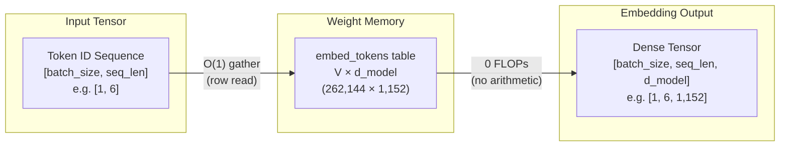

When you feed a prompt to a language model, the tokenizer breaks the
text into pieces and assigns each one an integer ID: `[1054, 492, 281]`.
Yet a transformer cannot compute on discrete integers; the only language
neural networks understand is continuous vector spaces and matrix
multiplications. The **embedding layer** stands precisely at this boundary:
it is the first translator in the architecture, turning discrete token
indices into rich geometric coordinates that the model can reason over.

At first glance, this layer appears deceptively simple. As prompt tokens
enter the model, it executes zero arithmetic operations — it merely
gathers rows from memory into cache (zero FLOPs). Yet it is often one of the
largest weight blocks in the entire network, sometimes accounting for nearly
a third of all parameters. Furthermore, it does far more than map tokens to
static vectors: it anchors positional order, enforces numerical stability
via $\sqrt{d_{\text{model}}}$ scaling, and anchors the final token projection
at generation time via weight tying (`lm_head`).

This guide walks through that entry threshold where integers become
geometry: lookup table mechanics and tensor layouts, the silent
$\sqrt{d_{\text{model}}}$ scaling trap, the evolution of positional
encodings from absolute tables to RoPE, pre-training loss spikes and their
remedies — and the starkly split economics of the same weight matrix
between training and serving.

**In this article**

- [1. Why an LLM needs an embedding layer](#1-why-an-llm-needs-an-embedding-layer)
- [2. Lookup table mechanics](#2-lookup-table-mechanics)
- [3. Vector scaling and where it hides](#3-vector-scaling-and-where-it-hides)
- [4. How positional encoding evolved](#4-how-positional-encoding-evolved)
  - [A. Learned absolute (GPT-2, BERT)](#a-learned-absolute-gpt-2-bert)
  - [B. Sinusoidal (Vaswani et al., 2017)](#b-sinusoidal-vaswani-et-al-2017)
  - [C. RoPE: Rotary Position Embedding (Gemma 3, Llama)](#c-rope-rotary-position-embedding-gemma-3-llama)
  - [Distance comes out for free](#distance-comes-out-for-free)
  - [Direct comparison across schemes](#direct-comparison-across-schemes)
- [5. Loss spikes and WeSaR](#5-loss-spikes-and-wesar)
- [6. Training cost versus serving cost](#6-training-cost-versus-serving-cost)
- [7. PyTorch walkthrough](#7-pytorch-walkthrough)
- [The whole story in six lines](#the-whole-story-in-six-lines)
- [Glossary](#glossary)
- [Going deeper](#going-deeper)

---

## 1. Why an LLM needs an embedding layer

Deep learning models operate strictly on matrix multiplications and
continuous vector spaces. A neural network cannot multiply the string
"cat". Three approaches have been tried to map text into continuous spaces:

- **Word-level.** Splitting on words requires a vocabulary of hundreds of
  thousands of terms. Any missing word triggers an Out-Of-Vocabulary (OOV)
  error, maps to a catch-all `[UNK]` token, and loses its semantic identity.
- **Character-level.** The vocabulary is compact (~256 entries) and OOV is
  eliminated, but sequences explode in length. Because a single character
  carries negligible semantic signal, the quadratic attention context window
  is consumed rapidly by trivial units.
- **Subword.** The standard equilibrium used by modern LLMs (BPE, WordPiece,
  SentencePiece). Frequent words remain whole; rare ones decompose into
  meaningful sub-fragments. For full details on this boundary, see the
  companion article on
  [How tokenization works](post.html?slug=how-tokenization-works).

Tokenization leaves us with integers called **token IDs**. For the input
`"the capital of united states"`, Gemma 3 produces `[2, 1437, 5279, 529, 26974, 5022]`.
These integers have no inherent geometric magnitude, direction, or distance:
ID 5279 being numerically larger than 1437 means nothing semantically.

The embedding layer converts these discrete integers into dense continuous
vectors that act as coordinates in a high-dimensional semantic space.

---

## 2. Lookup table mechanics

> **Embedding layer (`embed_tokens`)** = A trainable weight table with one
> row per vocabulary entry. Its job is not to transform the input mathematically,
> but to *replace* each integer with the row vector it indexes — closer to
> opening a dictionary at a page number than to executing arithmetic.

`embed_tokens` is a weight matrix of shape $V \times d_{\text{model}}$, where
$V$ is the vocabulary size and $d_{\text{model}}$ is the hidden dimension:



- **Lookup table ($O(1)$) logic.** Rather than performing a matrix
  multiplication, `embed_tokens` retrieves the row corresponding to the incoming
  token ID directly from the weight matrix — a **gather** operation, which is a
  memory read rather than arithmetic. Textbooks often define this as multiplying
  a one-hot vector by matrix $E$; that is mathematically equivalent but
  computationally absurd, since 262,144 multiplications minus $d_{\text{model}}$
  are multiplications by zero.
- **Tensor transformation.** An integer array of shape `[batch_size, seq_len]`
  expands into a semantic continuous tensor of shape
  `[batch_size, seq_len, d_model]` after the gather.
- **Model examples.** Gemma-3-1B's table is $262,144 \times 1,152$; on
  Gemma-3-27B it expands to $262,208 \times 5,376$. The 64-row difference is
  real — multimodal variants allocate extra rows for visual tokens.
- **Parameter footprint.** $262,144 \times 1,152 \approx 302\text{M}$
  parameters accounts for ~30% of a 1B model. On Gemma-3-27B, the same
  vocabulary represents only ~5% of total parameters. A wide vocabulary
  exerts severe VRAM pressure primarily on smaller models.
- **Context-blind and order-blind.** The same token ID returns the exact same
  row vector every time. Row 5279 is identical in "river bank" and "bank loan";
  resolving context is the job of subsequent self-attention layers, not this table.
- **`padding_idx`.** Batching requires uniform sequence lengths, so shorter
  inputs are padded with a pad token. Gemma sets `padding_idx=config.pad_token_id`,
  which zeroes out gradient updates for that specific row during backpropagation,
  ensuring the padding representation remains constant.

---

## 3. Vector scaling and where it hides

In Gemma and the original Transformer architecture, vectors leaving the
embedding table are scaled by $\sqrt{d_{\text{model}}}$ ($\sqrt{1152} \approx 33.94$
on Gemma-3-1B) before entering the first transformer block:

$$\mathbf{x}_{\text{scaled}} = \mathbf{x}_{\text{embed}} \times \sqrt{d_{\text{model}}}$$

Read it as: *The raw row retrieved from the table is multiplied by a single
fixed scalar constant.*

- $\mathbf{x}_{\text{embed}}$: The raw row vector read directly from the table.
- $\sqrt{d_{\text{model}}}$: The square root of the hidden dimension, constant
  throughout the model's lifetime (33.94 in Gemma-3-1B).
- $\mathbf{x}_{\text{scaled}}$: The scaled vector injected into the residual
  stream of the first transformer layer.

Where does this number come from, and why is it necessary? A weight stored in
the table typically starts near `0.02` (Gemma uses `initializer_range = 0.02`).
Tracing the arithmetic:

```text
d_model               = 1152
scale factor          = √1152 = 33.94
raw table value       = 0.02
scaled input value    = 0.02 × 33.94 = 0.68
```

Because every element in the row is multiplied by the same 33.94, the vector's
direction in geometric space remains unchanged; only its Euclidean norm grows
by a factor of 33.94.

The reason lies in weight tying (Section 6). One matrix serves simultaneously
as the input embedding table and the output un-embedding projection (`lm_head`),
and those two roles demand conflicting initialization scales: the output side
feeds a softmax, so its weights must begin small (`0.02`) to avoid saturating
the logits and vanishing gradients. However, this small variance leaves the
input vectors far below the unit variance expected by the initial residual
stream. Multiplying by $\sqrt{d_{\text{model}}}$ bridges this structural gap.
*Attention Is All You Need* (§3.4) introduces weight sharing and the
$\sqrt{d_{\text{model}}}$ multiplier in the exact same sentence.

**The PyTorch trap.** In Gemma, this multiplication is implemented directly
inside the embedding module rather than the model's forward backbone:

```python
class Gemma3TextScaledWordEmbedding(nn.Embedding):
    def forward(self, input_ids):
        return super().forward(input_ids) * self.embed_scale.to(self.weight.dtype)
```

Consequently, calling `embed_tokens(ids)` yields **already scaled** vectors,
whereas standard `F.embedding(ids, weight)` returns **unscaled** raw values.
Furthermore, `embed_scale` is a non-persistent buffer excluded from the saved
checkpoint `state_dict`. Any custom serving pipeline that naively loads the
weights and bypasses this module runs without error, yet produces completely
degraded outputs.

Llama-style architectures eliminate weight tying and embedding scaling
altogether, relying instead on input RMSNorm layers at each block boundary.

---

## 4. How positional encoding evolved

Consider two sentences: "dog bites man" and "man bites dog". As shown in
Section 2, table lookup returns the exact same three row vectors for both
sentences; the table possesses zero sequential awareness. Self-attention
cannot resolve this alone either: attention calculates relevance using dot
products, and the dot product is commutative ($q \cdot k = k \cdot q$). It
cannot discern which word came first.

Sequence order must therefore be directly injected into the numeric vectors
before attention operates. The goal is not merely telling a token "you are at
index 4,517," but encoding **how far apart two tokens sit** (relative distance).

Three distinct paradigms have been deployed:

- **A. Learned absolute** — Maintain a second trainable table, one row per
  slot index, and add it element-wise to the token vector.
- **B. Sinusoidal** — Compute fixed trigonometric wave coordinates and add
  them element-wise to the token vector.
- **C. RoPE** — Abandon addition entirely. Rotate the vector in 2D coordinate
  planes by an angle proportional to its slot index.

```text
A. Learned Absolute (GPT-2, BERT)   B. Sinusoidal (Vaswani 2017)   C. RoPE (Llama, Gemma 3)
   Vector Addition                     Trigonometric Addition         Vector Rotation
   x_i = TokenEmbed + PosEmbed         x_i = TokenEmbed + PE_pos      x_i = R(θ, i) · TokenEmbed
   (Hard limit: L_max)                 (Norm inflation / drift)       (Pure semantic isolation, norm = 1)
```

To compare these mechanics cleanly, let us trace the **exact same word (`"the"`)**,
represented by the **exact same 2D unit vector** ($1.00$), across **Slot 0**
and **Slot 1**:

$$\text{TokenEmbed}(\text{"the"}) = [0.80, \ 0.60] \quad \left(\text{Norm} = \sqrt{0.80^2 + 0.60^2} = 1.00\right)$$

### A. Learned absolute (GPT-2, BERT)

A second trainable matrix of shape $L_{\max} \times d_{\text{model}}$ is stored.
Each token representation is the element-wise sum of its token vector and
position vector:

$$\mathbf{x}_i = \text{TokenEmbed}(w_i) + \text{PosEmbed}(i)$$

- $\text{TokenEmbed}(w_i)$: The lexical vector for token $w_i$.
- $\text{PosEmbed}(i)$: The learned vector for position index $i$.
- $\mathbf{x}_i$: The combined input vector.

Suppose training gradients have shifted the learned position rows to:
- $\text{PosEmbed}(0) = [0.00, \ 0.20]$ (learned via backpropagation)
- $\text{PosEmbed}(1) = [0.20, \ -0.10]$ (learned via backpropagation)

```text
Slot 0:
  TokenEmbed("the") = [ 0.80   0.60 ]
  PosEmbed(0)       = [ 0.00   0.20 ]   ← learned row 0
  x_0 (sum)         = [ 0.80   0.80 ]   ──> Norm: 1.13

Slot 1:
  TokenEmbed("the") = [ 0.80   0.60 ]
  PosEmbed(1)       = [ 0.20  -0.10 ]   ← learned row 1
  x_1 (sum)         = [ 1.00   0.50 ]   ──> Norm: 1.12
```

- **Drawback 1 (Hard context ceiling):** If trained on 2,048 slots, slot 2,049
  has no entry in the table; the model cannot extrapolate to longer contexts.
- **Drawback 2 (No structural relative awareness):** Slots 3 and 5 are learned
  independently from slots 7 and 9; the model cannot structurally generalize
  that "separated by 2 slots" represents the same relationship.

### B. Sinusoidal (Vaswani et al., 2017)

Position coordinates are calculated deterministically using trigonometric waves:

$$PE_{(pos, 2i)} = \sin\left(\frac{pos}{10000^{2i/d}}\right), \quad PE_{(pos, 2i+1)} = \cos\left(\frac{pos}{10000^{2i/d}}\right)$$

- $pos$: Position index along the sequence ($0, 1, 2, \dots$).
- $i$: Dimension index ($0 \le i < d/2$).
- $d$: Model dimension ($d_{\text{model}}$).

For our 2D vector ($d = 2$, $i = 0$):

```text
denominator = 10000^(2×0 / 2) = 10000^0 = 1.00

Slot 0 (pos = 0):
  PE_0[0] = sin(0 / 1) = sin(0) = 0.00
  PE_0[1] = cos(0 / 1) = cos(0) = 1.00
  PE(0)   = [ 0.00   1.00 ]

Slot 1 (pos = 1):
  PE_1[0] = sin(1 / 1) = sin(1) ≈ 0.84
  PE_1[1] = cos(1 / 1) = cos(1) ≈ 0.54
  PE(1)   = [ 0.84   0.54 ]
```

Applying vector addition:

```text
Slot 0:
  TokenEmbed("the") = [ 0.80   0.60 ]
  PE(0)             = [ 0.00   1.00 ]   ← calculated wave
  x_0 (sum)         = [ 0.80   1.60 ]   ──> Norm: 1.79  (inflated)

Slot 1:
  TokenEmbed("the") = [ 0.80   0.60 ]
  PE(1)             = [ 0.84   0.54 ]   ← calculated wave
  x_1 (sum)         = [ 1.64   1.14 ]   ──> Norm: 2.00  (inflated)
```

- **Drawback (Semantic Distortion):** Addition warps vector lengths. Starting
  with a pristine norm of $1.00$, `"the"` arrives at $1.79$ in Slot 0 and
  $2.00$ in Slot 1. Semantic magnitude shifts arbitrarily depending on sentence
  position.

### C. RoPE: Rotary Position Embedding (Gemma 3, Llama)

Do not add anything to the embedding vector. Instead, rotate the vector in 2D
coordinate planes by an angle proportional to its sequence index:

$$\mathbf{x}_i = \mathbf{R}_{\theta, i} \cdot \text{TokenEmbed}(w_i)$$

- $\mathbf{R}_{\theta, i}$: The 2D rotation matrix proportional to slot $i$.
- $\text{TokenEmbed}(w_i)$: The lexical embedding vector.
- $\mathbf{x}_i$: The rotated vector (Euclidean length is strictly preserved).

Our vector $[0.80, 0.60]$ has an initial base angle $\arctan(0.60 / 0.80) \approx 36.87^\circ$.
Assigning a rotation speed of $30^\circ$ per slot:

```text
Slot 0 (0 × 30° = 0° rotation):
  Angle             = 36.87°
  x_0               = [ 0.80   0.60 ]   ──> Norm: 1.00  (preserved)

Slot 1 (1 × 30° = 30° rotation):
  Angle             = 36.87° + 30° = 66.87°
  x_1               = [ cos(66.87°), sin(66.87°) ]
  x_1               = [ 0.39   0.92 ]   ──> Norm: 1.00  (preserved)
```

In modern architectures, this rotation is applied inside self-attention directly
to Query ($Q$) and Key ($K$) representations:

$$Q_m = \mathbf{R}_{\Theta, m} W_q x_m, \quad K_n = \mathbf{R}_{\Theta, n} W_k x_n$$

### Distance comes out for free

When calculating the attention dot product between $Q$ at slot $m$ and $K$ at
slot $n$, the orthogonal property of rotation matrices factors out:

$$(R_m Q_m)^T (R_n K_n) = Q_m^T R_m^T R_n K_n = Q_m^T R_{n-m} K_n$$

Read it as: *The dot product of two rotated vectors depends strictly on their
relative index separation $(n - m)$, completely independent of absolute positions.*

We can prove this arithmetically. Suppose two tokens sit 2 slots apart
(a net angle difference of $2 \times 30^\circ = 60^\circ$):

```text
Case 1: Tokens sit at Slot 1 and Slot 3 (m = 1, n = 3)
  Net angle difference = (3 - 1) × 30° = 60°
  Dot product score    = cos(60°) = 0.50

Case 2: Tokens sit at Slot 4 and Slot 6 (m = 4, n = 6)
  Net angle difference = (6 - 4) × 30° = 60°
  Dot product score    = cos(60°) = 0.50
```

Compare this to Scheme B: there, vectors were pushed into distorted corners.
Here, the absolute locations (1-3 versus 4-6) vanish entirely from the equation;
only the 2-step gap survives. Relative distance is captured naturally with zero
norm inflation.

### Direct comparison across schemes

| Metric / Behavior | A. Learned Absolute | B. Sinusoidal | C. RoPE |
| :--- | :---: | :---: | :---: |
| **Slot 0 Output** | `[0.80, 0.80]` | `[0.80, 1.60]` | `[0.80, 0.60]` |
| **Slot 0 Norm** | 1.13 | 1.79 | **1.00** |
| **Slot 1 Output** | `[1.00, 0.50]` | `[1.64, 1.14]` | `[0.39, 0.92]` |
| **Slot 1 Norm** | 1.12 | 2.00 | **1.00** |
| **Vector Length Distorted?** | Yes | Yes (Severe) | **No (0% Distortion)** |
| **Relative Distance Aware?** | No | Partial | **Yes (Exact $n-m$)** |

**Why vector length must not distort (norm preservation).** Attention
scores scale with vector magnitudes: $\mathbf{u} \cdot \mathbf{v} = \|\mathbf{u}\| \|\mathbf{v}\| \cos(\theta)$.
Inflating a vector from $1.00$ to $2.00$ doubles its dot products and drives
softmax into saturation: one token hoards attention mass while other
gradients vanish. It also corrupts semantics by varying a word's energy
based on where it appears. RoPE rotates without stretching, locking the
norm at $1.00$ and preserving pure semantic coordinates.

**Why natural relative distance matters (context generalization).** Syntax
cares about relative spacing, not absolute rank: an adjective sits 1 step
before its noun whether at token 10 or token 100,000. This pair difference
($(n - m)$) is critical for three fundamental reasons:

1. **Translation invariance:** Linguistic rules do not care where on the
   page a phrase begins. The syntactic binding between "red" and "apple" is
   identical on page 1 and page 500. Because $(n - m) = 1$ is invariant, the
   model applies the exact same attention mechanics anywhere in the document.
2. **Length extrapolation:** Learned absolute tables (GPT-2) learn slots
   3–5 independently from 103–105 and hard-fail beyond their training context
   ceiling (e.g., 2,048 tokens), having never allocated weights for slot 2,049.
   In RoPE, the model never learns position 100,001 as an isolated entity;
   it only evaluates the 2-step gap, an interval seen billions of times
   during pre-training. This analytical invariance is what unlocks 128k+
   context scaling.
3. **Natural distance decay:** As the relative displacement $|n - m|$ grows,
   the summation of sinusoidal components with differing frequencies naturally
   decays on expectation. The model inherits an intrinsic locality bias —
   attending sharply to adjacent tokens without letting distant noise
   pollute the softmax distribution.

---

## 5. Loss spikes and WeSaR

A **loss spike** — the sudden, pathological divergence of loss during
pre-training — is fundamentally tied to parameter scale imbalances across
deep layers.

```text
Residual scaling (1/sqrt(2N)) ──> Parameter norms shrink (||W_d|| ≈ 0.002)
                                                │
                                                ▼
                              High relative update ratio (||ΔW|| / ||W||)
                                                │
                                                ▼
                                   Extreme instability & LOSS SPIKE
```

**Why it happens (norm imbalance).** To stabilize gradients in very deep
transformers, residual branches use depth-based scaling ($1/\sqrt{2N}$).
This causes down-projection matrices ($W_d$, $W_o$) to initialize with
exceptionally small weight norms (`0.002`). When updated via Adam, whose step
sizes are normalized by historical gradient variance, updates are roughly
uniform in magnitude (`0.001`) regardless of base weight scale:

| Matrix State | Typical Weight Magnitude | Adam Step Size | Relative Change ($\Vert \Delta W \Vert / \Vert W \Vert$) |
| :--- | ---: | ---: | ---: |
| Standard initialization | 0.02 | 0.001 | 5% |
| Shrunk by $1/\sqrt{2N}$ | 0.002 | 0.001 | **50%** |

A 50% relative shift in a single optimization step destabilizes activation
distributions across adjacent layers, triggering a destructive loss spike.

**The WeSaR solution.** Weight Scaling as Reparameterization (WeSaR) decouples
the matrix's operational magnitude from its storage scale using a single
trainable scalar $\alpha$:

$$\bar{W} = \alpha W, \quad \text{where } W \sim \mathcal{N}(0, \sigma^2)$$

- $W$: The underlying weight matrix, stored and updated using standard scale
  $\sigma \approx 0.02$.
- $\alpha$: A trainable scalar parameter ($\alpha \approx 0.1$).
- $\bar{W}$: The effective weight matrix seen during the forward pass
  ($0.1 \times 0.02 = 0.002$).

```text
Conventional: store 0.002 directly             → W = 0.002
WeSaR:        store 0.02, maintain α = 0.1     → W̄ = 0.1 × 0.02 = 0.002
```

The forward pass receives the required small scale ($0.002$), but Adam
updates a matrix scaled at $0.02$. The relative update ratio remains stable
at 5%, insulating the network from optimization shocks.

---

## 6. Training cost versus serving cost

The embedding layer presents completely different engineering bottlenecks
between training and inference:

| Dimension | Training Profile | Inference / Serving Profile |
| :--- | :--- | :--- |
| **Primary Bottleneck** | Gradient memory and bandwidth across $E$ | VRAM memory residency and bandwidth |
| **Embedding Compute** | Negligible ($O(1)$ gather) | Negligible ($O(1)$ gather) |
| **Tied Component (`lm_head`)** | Shared backward gradient accumulation | $2 \times d_{\text{model}} \times V$ FLOPs per generated token |
| **Gemma-3-1B Footprint** | ~302M weights + optimizer states | ~0.60 GB VRAM resident |
| **Key Optimizations** | Sparse gradients, layer freezing | Quantization, vocabulary parallelism |

- **Weight Tying.** Gemma 3 sets `tie_word_embeddings = True`. Both
  `embed_tokens.weight` and `lm_head.weight` share the exact same physical
  memory pointer (`data_ptr()`). Training updates to one immediately mutate the other.
- **Training Gradients.** Even when a training micro-batch contains only 4,096
  active tokens, PyTorch defaults to allocating a full dense gradient tensor of
  shape $262,144 \times 1,152$, creating massive memory bandwidth overhead
  dominated by 99% zeros.
- **Serving Compute.** During inference, `embed_tokens` is purely an index-based
  gather (0 FLOPs). However, its tied twin `lm_head` computes a full matrix
  multiplication against all $V$ rows for every generated token:
  - Gemma-3-1B: $2 \times 1,152 \times 262,144 \approx 0.60\text{ GFLOP}$ per token.
  - Gemma-3-27B: $2 \times 5,376 \times 262,208 \approx 2.82\text{ GFLOP}$ per token.
  Production serving engines split this burden using `VocabParallelEmbedding`
  and `ParallelLMHead` across distributed GPUs.

---

## 7. PyTorch walkthrough

Verifying embedding lookup, hidden tensor shapes, scaling factors, and weight
tying on Gemma-3-1B:

```python
import torch
from transformers import AutoTokenizer, Gemma3ForCausalLM

# 1. Load model and tokenizer
model_id = "google/gemma-3-1b-it"
tokenizer = AutoTokenizer.from_pretrained(model_id)
model = Gemma3ForCausalLM.from_pretrained(model_id)

prompt = "the capital of united states"
tokens = tokenizer.encode(prompt, return_tensors="pt")
# tokens: tensor([[2, 1437, 5279, 529, 26974, 5022]])

# 2. Embedding layer lookup
# Gemma3TextScaledWordEmbedding applies sqrt(d_model) internally
embed_layer = model.model.embed_tokens
embeddings = embed_layer(tokens)

# 3. Direct unscaled tensor gather
raw_lookup = torch.nn.functional.embedding(tokens, embed_layer.weight)

print("Tokens shape        :", tokens.shape)      # torch.Size([1, 6])
print("Embedding output    :", embeddings.shape)  # torch.Size([1, 6, 1152])
print("Raw weight lookup   :", raw_lookup.shape)  # torch.Size([1, 6, 1152])

# Verify scaling factor: sqrt(1152) ≈ 33.94
ratio = (embeddings.norm() / raw_lookup.norm()).item()
print(f"Norm ratio          : {ratio:.2f}")       # 33.94

# Confirm weight tying via storage pointer
print("Tied Config         :", model.config.text_config.tie_word_embeddings)
print("Same Memory Buffer  :", embed_layer.weight.data_ptr() == model.lm_head.weight.data_ptr())
```

---

## The whole story in six lines

- The embedding layer performs an $O(1)$ memory gather rather than matrix arithmetic during input processing.
- The table accounts for ~30% of parameters in Gemma-3-1B, dropping to ~5% in Gemma-3-27B.
- The $\sqrt{d_{\text{model}}}$ factor balances the scale of the tied output projection and runs silently inside Gemma's embedding forward method.
- Modern architectures decouple position from embeddings: RoPE rotates queries and keys inside self-attention.
- At inference time, the lookup costs zero compute, while its tied twin `lm_head` consumes $2 \times d_{\text{model}} \times V$ FLOPs per token.
- Loss spikes during pre-training can be mitigated by reparameterization methods like WeSaR that stabilize optimizer step sensitivity.

---

## Glossary

Key concepts with intuition and engineering impact:

- **embedding layer (`embed_tokens`)** — the trainable lookup table translating token IDs into dense hidden vectors. Like looking up a page number in a dictionary; accounts for nearly a third of all weights in a 1B model.
- **lookup / gather** — direct indexed memory retrieval of row $k$ ($O(1)$). Identical mathematically to one-hot multiplication, but avoids 262,144 wasteful zero-multiplications and massive tensor allocations.
- **$d_{\text{model}}$** — the hidden representation dimension preserved across Transformer layers. Measures 1,152 in Gemma-3-1B; sets the semantic capacity of the residual stream.
- **$V$ (vocabulary size)** — total discrete symbols defined by the tokenizer. Measures 262,144 in Gemma-3-1B; wide vocabularies shorten sequence lengths but penalize parameter budgets in small models.
- **vector norm** — Euclidean length of an embedding vector ($\sqrt{\sum x_i^2}$). Direction encodes semantics, while norm reflects signal strength inside the model.
- **residual stream** — the central tensor highway flowing through sequential layers. Every block reads from and accumulates back onto this stream.
- **$\sqrt{d_{\text{model}}}$ scaling** — multiplicative constant reconciling output softmax initialization with input residual stream variance. Implemented as an unpersisted buffer in Gemma, making it easy to omit during custom ports.
- **non-persistent buffer** — a PyTorch module tensor registered in runtime memory but omitted from checkpoint `state_dict` files. Easily lost during manual model conversions.
- **weight tying** — parameter sharing between input embeddings and output un-embedding projection heads. Saves ~302M parameters in Gemma-3-1B.
- **`lm_head`** — the linear projection mapping hidden states back into vocabulary logits. The tied twin of embeddings, incurring massive compute per generated token at inference.
- **`padding_idx`** — vocabulary index masked from receiving gradient updates during backpropagation. Keeps padding vectors stationary and stabilizes batches.
- **permutation symmetry** — the order-invariance of self-attention dot products without position injection. Erases the distinction between "dog bites man" and "man bites dog".
- **RoPE (Rotary Position Embedding)** — position encoding method applying coordinate rotations to $Q$ and $K$. Retains vector norms perfectly while exposing relative distance ($n-m$) directly through dot products.
- **loss spike** — sudden, catastrophic divergence in training loss caused by gradient and parameter scale imbalances. Can ruin days of multi-node training runs in a single step.
- **relative update ratio** — $||\Delta W|| / ||W||$, measuring parameter change relative to underlying weight magnitude. The crucial indicator of whether Adam will over-update small layers.
- **WeSaR** — Weight Scaling as Reparameterization, improving training stability by scaling matrices via dedicated scalar multipliers. Decouples the forward scale from the optimization scale.
- **vocabulary parallelism** — tensor parallelism strategy sharding large vocabulary tables across distributed GPU ranks. Used by engines like vLLM to partition VRAM and latency.

---

## Going deeper

- Vaswani et al., [Attention Is All You Need](https://arxiv.org/abs/1706.03762) (2017) — Original Transformer architecture, sinusoidal encoding, and $\sqrt{d_{\text{model}}}$ scaling.
- Press & Wolf, [Using the Output Embedding to Improve Language Models](https://arxiv.org/abs/1608.05859) (2016) — Foundational principles of weight tying.
- Su et al., [RoFormer: Enhanced Transformer with Rotary Position Embedding](https://arxiv.org/abs/2104.09864) (2021) — The RoPE formulation and geometric properties.
- Nishida et al., [Initialization of Large Language Models via Reparameterization to Mitigate Loss Spikes](https://arxiv.org/abs/2410.05052) (2024) — Analysis of loss spikes and the WeSaR reparameterization method.
- Google DeepMind, [Gemma 3 technical report](https://arxiv.org/abs/2503.19786) (2025) — Architecture details and multimodal vocabulary expansion.
- On this blog: [How tokenization works](post.html?slug=how-tokenization-works) — the preceding step: from raw text to token IDs —, [How LLMs work](post.html?slug=how-llms-work) — how layers process vectors —, and [How embeddings work](post.html?slug=how-embeddings-work) — semantic search and vector spaces.
