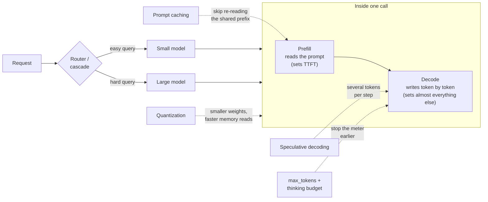

The feature worked beautifully in the demo. One user, short
prompts, answers in a second or two, a bill measured in cents. Then
it shipped. Three weeks later two graphs land on your desk: the API
bill, climbing a slope you did not budget for, and the p95 latency
chart, showing that a slice of your users waits eight seconds for an
answer they will not read past the second sentence. Nothing about
the model changed. What changed is that production traffic multiplied
everything the demo let you ignore.

Here is the lens that makes both graphs legible: an LLM call is a
taxi ride with a peculiar meter. The wait for the car to show up is
your time-to-first-token. Reading your prompt is the cheap pickup
fee. But the meter itself runs on the *output* — every token the
model writes is another tick, and output tokens cost several times
what input tokens do, in both money and milliseconds. Almost every
optimization in this article is a way to shorten the ride, share it,
skip it, or stop calling a limousine for a grocery run. We will walk
the stack in order of risk: first the metrics that explain the bill,
then the lossless wins (caching, batching, budgets), then model
choice and routing, then the serving room, then the techniques that
can start costing you accuracy, and finally what happens when agents
start calling taxis of their own.

**In this article**

- [1. The meter runs on output](#1-the-meter-runs-on-output)
  - [Prefill and decode](#prefill-and-decode)
  - [The price asymmetry](#the-price-asymmetry)
  - [Streaming buys perceived speed](#streaming-buys-perceived-speed)
- [2. Lossless wins first: caching, batching, budgets](#2-lossless-wins-first-caching-batching-budgets)
  - [Prompt caching: stop paying for the same prefix](#prompt-caching-stop-paying-for-the-same-prefix)
  - [Batch APIs: half price for patience](#batch-apis-half-price-for-patience)
  - [Output and thinking budgets](#output-and-thinking-budgets)
  - [The queue and the retry tax](#the-queue-and-the-retry-tax)
- [3. Pick a smaller brain: routing, cascades, and model economics](#3-pick-a-smaller-brain-routing-cascades-and-model-economics)
  - [The price gap in numbers](#the-price-gap-in-numbers)
  - [Cascades and routers](#cascades-and-routers)
  - [Where routing breaks](#where-routing-breaks)
  - [Why small models got so good](#why-small-models-got-so-good)
  - [Distillation and the small specialist](#distillation-and-the-small-specialist)
- [4. The serving room: where self-hosters win](#4-the-serving-room-where-self-hosters-win)
  - [Continuous batching and PagedAttention](#continuous-batching-and-pagedattention)
  - [Speculative decoding](#speculative-decoding)
  - [Choosing a serving stack](#choosing-a-serving-stack)
- [5. Compression: the first techniques that can hurt accuracy](#5-compression-the-first-techniques-that-can-hurt-accuracy)
  - [Quantization](#quantization)
  - [Shrinking the KV cache](#shrinking-the-kv-cache)
  - [Prompt compression and semantic caching](#prompt-compression-and-semantic-caching)
  - [Long context is not free either](#long-context-is-not-free-either)
- [6. Agents multiply the meter](#6-agents-multiply-the-meter)
- [7. The whole toolbox on one page](#7-the-whole-toolbox-on-one-page)
  - [The decision table](#the-decision-table)
  - [One workload, end to end](#one-workload-end-to-end)
  - [A phased roadmap](#a-phased-roadmap)
  - [Symptom to fix](#symptom-to-fix)
- [The whole story in six lines](#the-whole-story-in-six-lines)
- [Glossary](#glossary)
- [Going deeper](#going-deeper)

## 1. The meter runs on output

### Prefill and decode

Every LLM call has two phases, and they behave nothing alike.

> **Prefill** = the model reads your entire prompt in one parallel
> pass and fills its KV cache with it. This phase determines how
> long you wait before the first token appears.

> **Decode** = the model writes the answer one token at a time, each
> token requiring a full pass through the network. This phase
> determines everything after the first token.

Prefill is the taxi driving to your door: it happens once, it
processes thousands of tokens in a single sweep, and modern GPUs are
extremely good at it. Decode is the ride itself, and it is stubbornly
sequential — token 500 cannot be written before token 499, because
each new token depends on all the ones before it. (Why generation
must be one-token-at-a-time, and what the KV cache saves you from
recomputing, is the subject of
[the LLM article](post.html?slug=how-llms-work) on this blog.)

Two metrics fall straight out of the two phases:

> **TTFT (time to first token)** = how long until the first output
> token arrives. Dominated by queueing plus prefill.

> **TPOT (time per output token)**, also called inter-token latency
> = the pace of the tokens after the first one. Dominated by decode.

Now do the arithmetic that explains most latency complaints. Say
TTFT is 200 milliseconds and TPOT is 80 milliseconds — respectable
numbers. A 500-token answer then spends 0.2 seconds in prefill and
**40 seconds** in decode. The wait for the taxi was rounding error;
the ride was the whole trip. Any optimization that shortens the
answer attacks the dominant term. Any optimization that only
polishes prefill attacks the rounding error.

### The price asymmetry

Providers price the two phases differently, and the asymmetry is
large: output tokens typically cost around four to five times as
much as input tokens on the major APIs (the exact multiple varies by
provider and model). The pricing mirrors the physics — a thousand
input tokens are one cheap parallel pass, a thousand output tokens
are a thousand sequential passes. So the single most consequential
number in your cost profile is not your prompt length. It is your
average answer length, multiplied by your request volume.

This is why the highest-leverage question in an LLM cost review is
embarrassingly simple: *does the model write more than the user
needs?* A chatbot that answers in three paragraphs when one would do
is paying triple, in money and in seconds, for text nobody reads.

### Streaming buys perceived speed

Streaming does not make decode faster — it makes the wait honest.
Instead of staring at a spinner for 40 seconds, the user reads along
as tokens arrive. And here human bandwidth does you a favor: the
average adult silent-reading speed is about 240 words per minute
(Brysbaert's 2019 meta-analysis of 190 studies), roughly 4 words per
second. A stream of 20 tokens per second comfortably outruns almost
every reader. Past that point, lowering TPOT further improves a chat
experience by exactly nothing — the reader is the bottleneck, not
the model.

The caveat: this comfort applies to humans watching text arrive. In
a pipeline or an agent loop, nothing "reads along" — each step waits
for the *complete* answer before acting, so end-to-end time is what
matters, and long outputs hurt in full. Keep the two cases separate
when someone quotes a tokens-per-second number at you.

Here is the whole battlefield on one map — the life of a request,
and where each family of optimizations attacks it:

## 2. Lossless wins first: caching, batching, budgets

The techniques in this section share a property that makes them the
right place to start: they change what you pay and how long you
wait, and nothing else. The answer bytes are the same or the quality
is untouched. Reach for these before anything that trades accuracy.

### Prompt caching: stop paying for the same prefix

Look at what your requests actually contain. A system prompt, tool
definitions, maybe a long document or a few worked examples — and
then, at the very end, the one part that changes: the user's
question. In most production workloads the first 90% of the prompt
is byte-identical across thousands of requests, and without caching
you pay full prefill price to have the model re-read it every single
time. It is the taxi driver demanding the full route explanation on
every ride to the same office.

Prompt caching lets the provider store the processed prefix and
resume from it. The numbers are dramatic because prefill on a long
prefix is genuinely expensive. Anthropic reports up to 90% cost
reduction and up to 85% latency reduction on long prompts; their
worked example — chatting with a cached 100,000-token book — drops
time-to-first-token from 11.5 seconds to 2.4. The pricing mechanics
(as retrieved September 4, 2026): writing to the cache costs 1.25x
the base input rate, reading from it costs 0.1x. OpenAI's caching is automatic above a minimum prefix
length (1,024 tokens on recent models), with cache reads discounted
up to 90% on its newest models. Google and AWS offer the same idea
under their own names.

One architectural rule makes or breaks it: **caching matches the
prefix byte for byte, so static content goes first and dynamic
content goes last.** Put the timestamp, the user's name, or a
request ID at the top of your system prompt and you have invalidated
the cache for every request. This is a five-minute prompt-layout
review that routinely turns out to be the single highest-ROI change
in the whole stack.

*How to use it: on Anthropic, add `cache_control` breakpoints after
the static blocks of your request; on OpenAI, simply order your
prompt static-first and the cache engages by itself. Then watch the
`cached_tokens` field in responses — if your hit rate is low, the
cause is almost always a dynamic value smuggled into the prefix.*

### Batch APIs: half price for patience

Every major provider sells the same trade: submit requests
asynchronously, get results within a generous window (up to 24
hours, usually much faster), pay 50% of the normal price. If a job
does not have a human waiting on the other end — nightly
summarization, embedding backfills, evaluation runs, report
generation — running it interactively is paying a rush fee for a
package nobody is rushing to open. Batch discounts stack with prompt
caching on the shared prefix, which is how offline pipelines with
heavy system prompts end up paying a small fraction of the naive
price.

### Output and thinking budgets

Since the meter runs on output, cap the output. Three dials, in
increasing order of subtlety:

**max_tokens** is the hard stop. It is not a suggestion to the model
— it is enforced by the API — which makes it your circuit breaker
against the occasional answer that rambles to ten times normal
length.

**Instructions and structure** shape the answer before the cap ever
triggers. "Answer in at most three sentences", a JSON schema, a
required output format — these cut decode time roughly in
proportion to the tokens they remove. Verbosity is a habit, and it
is a habit you are billed for.

**Thinking budgets** are the new heavyweight. Reasoning models spend
tokens deliberating before they answer, and the spend is enormous:
one measurement on identical physics problems found DeepSeek-R1
averaging 14,698 output tokens where the non-reasoning DeepSeek-V3
averaged 4,035 — about 3.6x, before any answer quality enters the
discussion. The returns on those tokens flatten: studies of thinking
budgets consistently find a plateau after which additional
deliberation buys nothing measurable. And you cannot rely on the
model's manners — reasoning models have been documented blowing
straight through politely requested token limits, so the budget must
be enforced by the API parameter (or max_tokens), not by the prompt.
Which tasks deserve extended thinking at all — and which techniques
reasoning models absorbed — is covered in
[the prompting techniques article](post.html?slug=prompting-techniques).

A fourth dial arrived with the reasoning generation: **effort**.
Modern APIs expose a request-level effort parameter (low through
high tiers) that scales how much deliberation the model spends — a
single knob over thinking depth, tool-call chattiness, and answer
length. It is the first lever to reach for after the free wins:
dropping a route that does not need deep reasoning from high to low
effort cuts both spend and latency on the *same* model, with no
re-prompting and no second system to operate. Keep it per route,
not global — the workloads that repay high effort (coding, long
agentic tasks) are not the ones answering FAQ traffic.

### The queue and the retry tax

One more lossless family lives in plain reliability engineering,
and it explains why the p95 chart from the introduction misbehaves
while your averages look fine. Recall that TTFT is queueing *plus*
prefill — and under load, the queue is the part that grows. Your
median user sees 300 milliseconds; your p95 user is standing behind
a burst of traffic, a rate limit, and somebody's retry storm. Three
unglamorous practices pay for themselves:

- **Retries double-pay.** A timeout on a long generation burns
  tokens you already bought; a blind retry buys them all again.
  Stream instead of waiting (a stream that dies mid-answer lets you
  salvage or abort cheaply), set client timeouts longer than your
  true p99 generation time, and retry only genuinely retryable
  errors — rate limits and server errors — with backoff.
- **The tail is made of long outputs.** p95 and p99 inflate from
  the small fraction of answers that run very long, plus the
  retries they trigger. That is one more argument for max_tokens
  caps, and for monitoring percentiles rather than averages — a
  healthy mean with a rotten p99 is the normal failure mode, not an
  anomaly.
- **Steady load can buy a queue-free lane.** For predictable,
  sustained traffic, providers sell provisioned or dedicated
  throughput at a fixed price: you trade elasticity for a latency
  distribution that stops surprising you. For spiky offline work,
  the batch API is the pressure valve.

## 3. Pick a smaller brain: routing, cascades, and model economics

Frontier models and small models differ in price by roughly two
orders of magnitude per token. That gap is the entire economic case
for this section: if even half of your traffic is questions a small
model answers correctly, sending everything to the frontier model
means paying a 100x premium on the easy half. You do not call a
limousine to pick up groceries.

### The price gap in numbers

To make the gap concrete, here is the landscape — figures retrieved
from the providers' official pricing pages on **September 4, 2026**
(rounded, per million tokens; prices age quickly, so re-verify
before any production decision):

| Tier | Example | Input $/M | Output $/M |
|---|---|---|---|
| Top frontier | Claude Fable 5, OpenAI flagship | $10 | $50 |
| Frontier | Claude Opus 5 | $5 | $25 |
| Mid | Claude Sonnet 5 | $2 | $10 |
| Mid | Gemini 3.1 Pro (≤200K prompt) | $2 | $12 |
| Small | Claude Haiku 4.5 | $1 | $5 |
| Small-fast | Gemini 3.8 Flash | $0.75 | $3.75 |
| Open-weights via API | DeepSeek-R1 (OpenRouter) | $0.70 | $2.50 |
| Nano | cheapest OpenAI nano tier | $0.20 | $1.25 |

Three things to read off this table. First, the spread from nano to
top frontier is roughly 50x on input and 40x on output — the two
orders of magnitude that make routing worth building. Second, every
row shows the same output premium (~5x input) from section 1.
Third, these are *list* prices before the stacking discounts:
batch APIs halve everything, and cache reads cost ~0.1x input — a
cached, batched request on a mid-tier model costs a rounding error
of a naive frontier call.

### Cascades and routers

Two architectures exploit the gap. A **cascade** tries models in
order of price: the cheap model answers first, a verification signal
(self-reported confidence, a scoring model, agreement between
samples) decides whether the answer stands, and only failures
escalate. FrugalGPT (Stanford, 2023) is the canonical study: on its
benchmarks a cascade matched the best individual LLM's performance
with up to 98% cost reduction — the headline number comes from one
favorable dataset, but the pattern held broadly.

A **router** decides *before* the call, classifying the query and
dispatching it to the right tier directly — no wasted first attempt,
no added latency on hard queries. RouteLLM (Berkeley/LMSYS, ICLR
2025) trained routers on human preference data and reports keeping
95% of GPT-4's benchmark performance while cutting costs 85% on
MT-Bench, 45% on MMLU, and 35% on GSM8K; its best router needed the
expensive model for only 14% of MT-Bench queries.

If you have read [the RAG patterns
article](post.html?slug=which-rag-pattern-do-you-need), this is an
old friend: query routing to the right index and model routing to
the right brain are the same reflex — classify first, spend second.

### Where routing breaks

Routing's aggregate numbers hide a failure mode: they average over a
benchmark's difficulty mix, and your traffic is not that mix.
Follow-up robustness studies found categories — code among them —
where nearly every query genuinely needs the strong model, and a
router trained on general preference data quietly degrades exactly
there. The practical defense is unglamorous: pin known-hard
categories (code, math, anything compliance-critical) to the strong
model unconditionally, let the router arbitrate only the middle, and
track quality per category rather than in aggregate.

And run the null hypothesis before building any of it: the newest
strong model at *lower effort* on the same traffic. It often
matches a previous generation's full-effort quality at a fraction
of the cost, and one model means one cache namespace — a cascade
forfeits prompt-cache reuse across its tiers, which can quietly eat
back the savings the router earned. Only when the
single-model-lower-effort baseline still overshoots your budget
does a router earn its complexity.

### Why small models got so good

Two research threads explain why the cheap tier is worth routing to
at all. The first is inference-aware scaling. The Chinchilla result
(2022) showed a 70B model trained on more data beating a 175B model
trained on less — compute-optimal training wants roughly 20 tokens
per parameter. But "Beyond Chinchilla-Optimal" (2024) added the
production twist: if a model will serve billions of requests, its
lifetime cost is dominated by inference, and the rational choice
shifts to a *smaller* model trained far *longer* than
compute-optimal. That is precisely the recipe behind the modern crop
of small models that punch above their size — the overtraining is
the point.

The second thread is mixture-of-experts (MoE), which decouples what
a model knows from what you pay per token. Mixtral 8x7B carries
46.7B total parameters but activates about 13B per token, and with
that fraction outperforms Llama 2 70B with roughly 6x faster
inference; DeepSeek-V3 scales the same idea to 671B total, 37B
active. The fine print: all the parameters must still sit in GPU
memory, and serving MoE well is operationally harder than serving a
dense model. You are paying in memory and complexity for what you
save in per-token compute.

### Distillation and the small specialist

For a narrow, high-volume task there is a step beyond routing:
make a small model of your own that imitates a big one. The idea
has a long pedigree. DistilBERT (2019) showed a model 40% smaller
and 60% faster could retain 97% of BERT's language understanding —
compression with almost nothing lost, because most of a big model's
capacity is not needed for any single task. The modern version is
starker: Zephyr-7B, trained with distilled direct preference
optimization (dDPO) on AI-generated feedback, surpassed
Llama2-Chat-70B — a model ten times its size — on MT-Bench, with a
few hours of training and no human annotation at all.

Fine-tuning closes the loop economically. QLoRA made it cheap — it
fine-tuned a 65B model on a single 48GB GPU while matching full
16-bit fine-tuning quality; a 7B specialist needs far less. The
break-even arithmetic is simple: training is a one-time cost, and
the per-request saving (frontier API price minus small-model
serving cost) multiplies by volume forever after. Past a modest
scale, on a task narrow enough to capture in training data, the
small specialist wins decisively — and unlike a router, it cannot
misroute.

One honest line in the ledger before you commit: the training
compute is the *smallest* of the specialist's costs. Curating the
training data, building the eval harness that proves the specialist
matches the frontier on your task, and maintenance — re-training
when the task drifts, or when the next base-model generation resets
the bar — are recurring costs the break-even must carry. A
fine-tuned model is a product you now own, not a call you make.

## 4. The serving room: where self-hosters win

If you call a provider's API, this section is background knowledge —
your provider does all of it, and it explains where their prices
come from. If you self-host, this is where the biggest multipliers
live, and every one of them is lossless.

### Continuous batching and PagedAttention

A GPU serving one request at a time is a bus running with one
passenger: decode barely touches its compute. Batching many requests
recovers the throughput, but naive *static* batching has a flaw —
the whole batch waits until its longest answer finishes, so
short-answer passengers ride the full route. **Continuous batching**
(introduced by the Orca paper, OSDI 2022) reschedules at every
decode step instead: finished sequences leave the batch immediately,
waiting requests board immediately, the bus never runs empty seats.

The companion problem is memory. Each request's KV cache was
traditionally allocated as one contiguous block sized for the
maximum possible length, and the fragmentation plus over-reservation
wasted most of the space. **PagedAttention** (the core idea of vLLM,
SOSP 2023) manages KV memory in small pages, exactly like an
operating system manages RAM — near-zero waste, and identical
prefixes can share pages outright. The vLLM paper measures 2-4x
throughput over the previous state of the art at the same latency;
vendor measurements against truly naive static-batching setups reach
into the double digits. One refinement completes the picture:
**chunked prefill** (the Sarathi-Serve idea) splits a very long
prefill into pieces and weaves them between decode steps, so one
user's giant prompt does not stall every other user's token stream —
it is the knob that balances TTFT against TPOT under mixed traffic.
If you serve an open-weights model in 2026 and are not using
continuous batching with paged KV memory, you are leaving the
largest single serving win on the table.

### Speculative decoding

Decode's tragedy is that a giant model does a full forward pass to
produce one token, and most tokens are easy — the "the", the
closing bracket, the obvious next word of a sentence any small model
could finish. Speculative decoding exploits this: a small, fast
draft model proposes several tokens ahead, and the large model
verifies the whole proposal in a single parallel pass, accepting the
prefix that matches what it would have produced. The mathematical
guarantee is the beautiful part: the output distribution is
*provably identical* to the large model decoding alone. This is a
speedup with zero quality trade, the taxi letting a scooter scout
the route and only driving the stretches the scooter got wrong.

The lineage is short and worth knowing. Two 2023 papers (Leviathan
et al. at ICML, and Chen et al.) formulated the technique and
proved the losslessness. Medusa simplified deployment by bolting
extra decoding heads onto the target model itself instead of
running a separate draft model. The current state of the art, the
EAGLE line, trains a lightweight draft head on the target model's
own internal features and reports speedups up to 6.5x over vanilla
autoregressive decoding (EAGLE-3, NeurIPS 2025), strongest on
predictable text like code.

The honest caveat: the free lunch shrinks as batches grow. Verification
spends spare compute, and a busy server has less of it — at batch
size 64 the measured gain drops to around 1.4x. Speculative decoding
shines for latency-sensitive, low-concurrency serving; at high
utilization it fades toward neutral.

A quick word on **FlashAttention**, because it appears in every
serving stack's release notes: it computes exact attention (no
approximation) but reorganizes the computation to avoid shuttling
the big attention matrix through GPU memory, which is the actual
bottleneck. Successive versions keep re-tuning this for each new GPU
generation. As a user you mostly just want it on — modern engines
enable it by default.

### Choosing a serving stack

The open-source serving field has consolidated enough that the
choice is legible:

| Engine | Superpower | Reach for it when |
|---|---|---|
| vLLM | PagedAttention, broadest model/hardware support, fast iteration | Default choice; mixed models, fast-moving needs |
| SGLang | RadixAttention — automatic reuse of shared prefixes across requests | Agent and RAG traffic where many requests share long prefixes |
| TensorRT-LLM | Compiled engines, top raw throughput on NVIDIA | One model, maximum scale, engineering budget for the build step |
| llama.cpp | Runs anywhere — CPU, laptop, edge | Local and edge deployment, not datacenter throughput |

(TGI, the former HuggingFace default, is in maintenance mode; its
own platform now serves models with vLLM under the hood.)

## 5. Compression: the first techniques that can hurt accuracy

Everything so far was lossless. This section crosses a line: the
techniques here shrink something — weights, KV cache, the prompt
itself — and each can measurably degrade answers if pushed too far.
The discipline that keeps them safe is the same for all: **exhaust
the lossless wins first, compress conservatively, and benchmark on
your own task, not on a leaderboard.**

### Quantization

A model's weights ship as 16-bit numbers; quantization stores them
in 8 or 4 bits. Since decode speed is limited by how fast weights
stream from GPU memory, halving the bytes roughly halves the memory
footprint and speeds up the streaming — often the difference between
needing two GPUs and needing one.

The accuracy picture has sharpened into a few reliable rules,
anchored by a large systematic evaluation of instruction-tuned
models up to 405B parameters:

1. A quantized big model usually still beats a full-precision model
   of half its size — quantizing down is generally better than
   stepping down a tier.
2. But the deficits concentrate exactly where production cares
   most: instruction following and hallucination-sensitive tasks
   degrade before headline benchmarks do, and the same evaluation's
   LLM-judged tests showed coding and STEM declining most.
3. Method choice matters: FP8 (hardware-supported on modern GPUs)
   is the most robust option across tasks, and among weight-only
   methods the activation-aware AWQ tends to beat the older GPTQ.
   Methods that also quantize activations (the SmoothQuant family)
   buy extra inference speed at some accuracy cost — weight-only
   preserves quality better.
4. Small models suffer most. A study of Qwen3 quantization makes it
   concrete: the 0.6B model's MMLU score fell from 52.3 at FP16 to
   47.3 with AWQ 4-bit — and to 40.4 with GPTQ 4-bit. A big model
   shrugs off what cripples a small one.

The operational rule follows directly: 8-bit (FP8 or AWQ) by
default and treat it as a near-free win; 4-bit only on larger
models, only with an activation-aware method, and only with a
benchmark on *your* task showing the drop is acceptable.

### Shrinking the KV cache

In long-context and agentic workloads the KV cache — not the
weights — becomes the memory bottleneck: it grows with every token
of context, and it is what caps your batch size. KV-cache
quantization compresses it independently of the weights. KIVI (ICML
2024) squeezes the cache to 2 bits with a tuning-free asymmetric
scheme and reports 2.6x lower peak memory, enabling up to 4x larger
batches and 2.35-3.47x higher throughput at comparable quality;
KVQuant reaches 3-bit with negligible perplexity change and reports
serving million-token contexts on a single GPU. If your workload is
long conversations or big retrieved contexts, this is the
compression to evaluate first — it attacks the resource you are
actually short of.

### Prompt compression and semantic caching

Two application-level techniques round out the family, both with
sharper edges than their marketing suggests.

**Prompt compression** (the LLMLingua line of work) uses a small
model to delete tokens the big model would find redundant —
reported ratios reach 20x on benchmark tasks with little loss. The
edge: independent evaluations find accuracy falling off a cliff at
aggressive ratios, in the worst cases approaching what the model
scores with no context at all — compression that destroys the
information it was supposed to deliver. Keep ratios conservative
(2-3x), prefer query-aware variants that know what the question is
while compressing, and re-validate on your task.

**Semantic caching** answers repeated questions from a cache keyed
by embedding similarity rather than exact match — "how do I reset
my password" and "password reset how" hit the same entry. In
high-repetition traffic like support and FAQ, studies report well
over half of calls served from cache at near-zero marginal cost and
latency. The edge here is the false hit: set the similarity
threshold too loose and a user asking a *different* question gets a
confidently wrong cached answer, which is indistinguishable from a
hallucination to them. The second edge is staleness: a correctly
matched answer can still be wrong *now* — the price changed, the
policy changed — so entries need a TTL and an invalidation hook
tied to the content they were derived from. And the cache is a
shared surface: security researchers have shown collision-style
attacks on semantic caches, where crafted queries hit — or poison —
entries meant for other users. Run it with a strict threshold, a
TTL, per-tenant isolation, and false-positive monitoring, and
reserve it for traffic where the same questions genuinely recur.

### Long context is not free either

There is a quieter cost to long prompts than the prefill bill: the
model reads unevenly. The "Lost in the Middle" study (TACL 2024)
tested six model families and found a U-shaped curve — accuracy is
highest when the relevant information sits at the beginning or end
of the context and drops sharply when it sits in the middle. Newer
long-context models have partially improved, but a 2025 evaluation
across 18 models (the "context rot" report) still found performance
growing less reliable as input length grows, even on simple tasks.

The practical consequences run against the "just stuff more context
in" instinct. Retrieval precision beats context volume: ten
carefully chosen chunks outperform fifty mediocre ones that bury
the good ones in the middle. Order matters: put the most relevant
material at the edges of the prompt, not the center. And every
unnecessary chunk costs three times — prefill money, TTFT, and a
measurable accuracy tax. The retrieval-side fixes (hybrid search,
reranking, reordering) are covered in
[the RAG patterns article](post.html?slug=which-rag-pattern-do-you-need).

## 6. Agents multiply the meter

Everything above assumed one request, one answer. An agent breaks
that assumption: it loops — think, call a tool, read the result,
think again — and every lap through the loop is a fresh LLM call
carrying the *entire* accumulated context. The taxi is now calling
taxis of its own, and each new taxi re-drives the whole route so
far.

Anthropic published rare production numbers on the multiplier:
agents consume about 4x the tokens of a chat interaction, and their
multi-agent research system about 15x. The system earned its
premium — it outperformed a single-agent baseline by 90.2% on their
research evaluation, and token spend alone explained 80% of
performance variance on a browsing benchmark — but the direction of
the lesson is unambiguous: multi-agent is a deliberate luxury for
tasks that genuinely parallelize, not a default architecture. Their
own guidance says as much.

For a sense of the ceiling, Anthropic's most extreme published
experiment (February 2026) had 16 Claude agents working in parallel
for nearly two weeks to write a C compiler from scratch: almost
2,000 sessions, 2 billion input tokens, 140 million output tokens,
just under $20,000 in API cost — for a 100,000-line Rust compiler
that built Linux 6.9 on three architectures. Two readings of the
same numbers: the pessimist sees a $20K bill; the optimist sees a
compiler for the price of one engineer-month. But notice the ratio —
input tokens outnumber output 14 to 1, because every lap of every
agent's loop re-reads its accumulated context. That ratio is the
agentic cost problem in one number, and it is exactly what prompt
caching attacks.

The multiplier compounds through mundane failure: a recursive
subagent, a tool that returns a 50,000-token JSON blob into the
context, a loop that retries without a stop condition. One bad
trajectory can cost more than a thousand normal ones. The defenses
are boring and essential:

- **Hard budgets per run** — a step limit and a token/cost cap, with
  a circuit breaker that halts any trajectory exceeding a multiple
  (say 3x) of the expected budget. Enforced by your code, not
  requested in the prompt.
- **Cache-friendly loop layout** — the agent's system prompt and
  tool definitions are identical on every lap, which makes an agent
  loop the single best customer of prompt caching. But only if the
  prefix stays byte-stable: working memory that changes every step
  must live *outside* the cached prefix. One team's fix of moving
  dynamic memory out of the system prompt took their cache hit rate
  from single digits to over 80% and cut spend by more than half.
- **Tool-result hygiene** — truncate, summarize, or reference-by-ID
  large tool outputs instead of pasting them wholesale into context.
  (Tool-use policy and output discipline are exactly the sections of
  [the agent prompt anatomy article](post.html?slug=anatomy-of-an-agent-prompt)
  that earn their keep here.)

## 7. The whole toolbox on one page

### The decision table

The table worth memorizing — every technique in the article, with
the two questions that order them: what does it save, and what can
it break?

| Technique | Cost effect | Latency effect | Accuracy risk | Layer |
|---|---|---|---|---|
| Prompt caching | Cache reads ~0.1x input price | TTFT down up to ~80% | **None** | API / prompt layout |
| Batch API | 50% off | Hours-scale turnaround — not for interactive paths | **None** | Workflow |
| max_tokens + shorter outputs | Proportional to tokens cut | Proportional | None if answers stay complete | Prompt |
| Thinking budget / effort cap | Large on reasoning models (~3-4x tokens at stake) | Proportional | Moderate on genuinely hard tasks | API parameter |
| Routing / cascade | Up to 85-98% on favorable mixes | Faster on easy queries | Low-moderate; brittle on code/math | Gateway |
| Continuous batching + PagedAttention | 2-4x+ throughput per GPU | Better p50 | **None** | Serving |
| Speculative decoding | — | Up to ~6x, fades at high batch | **None** (provably lossless) | Serving |
| 8-bit quantization | ~2x memory | Modest speedup | Low | Model |
| 4-bit quantization | ~4x memory | Speedup | **Moderate** — validate per task | Model |
| KV-cache quantization | 2.6x+ memory, bigger batches | 2-3x throughput | Low at 2-3 bit per papers | Serving |
| Prompt compression | Up to token ratio | Up to ~2-6x | **High at aggressive ratios** | Prompt |
| Semantic caching | Up to hit rate | Near-instant on hits | **Moderate** — false hits | Application |
| Small model + fine-tuning | Large at volume | Small-model speed | Low on narrow tasks | Model strategy |

### One workload, end to end

To watch the levers compound, price one concrete workload: a
support assistant handling 100,000 requests a day. Each request
carries a 6,000-token prompt — 5,000 tokens of stable system
prompt, tool definitions, and product documentation, plus 1,000
tokens of user question and history — and returns an 800-token
answer from a mid-tier model at $2/$10 per million tokens.

- **Naive bill:** 600M input tokens a day ($1,200) plus 80M output
  tokens ($800) — $2,000 a day, roughly $60,000 a month.
- **Prompt caching:** the 5,000 stable tokens become cache reads at
  ~0.1x the input price. The input line drops from $1,200 to about
  $300 a day.
- **Output budget:** tighter format instructions bring answers from
  800 to 500 tokens. The output line drops from $800 to $500.
- **Routing:** 60% of the queries are FAQ-grade and move to a small
  model at half the price; the whole bill scales by 0.7 — about
  $560 a day.

Total: from $60,000 a month to roughly $17,000 — a 72% cut — and
the only step that touched quality at all was the routed share,
which is exactly what the per-category monitoring from section 3
guards. Notice how unheroic the arithmetic is: no quantization, no
compression, nothing from the sharp-edges shelf. That is the point.
Most of the money was sitting in the first two phases, waiting for
a prompt-layout review and a shorter answer.

### A phased roadmap

The techniques order themselves into a rollout sequence, each phase
with a gate you should pass before moving on:

**Phase 0 — Measure (week 1).** Token accounting split by
input/output/cached, cost attribution per request (and per agent,
if you have agents), TTFT/TPOT/throughput dashboards — via
OpenTelemetry's GenAI conventions, an LLM-observability platform
(Langfuse, LangSmith), or vLLM's built-in metrics if you
self-host. This is the
FinOps floor: without it, nothing else in this article can be
proven to have worked. *Gate: do not proceed until you know your
input/output/cached ratios and your p95 TTFT.*

**Phase 1 — Lossless wins (weeks 2-4).** Turn on prompt caching and
restructure prompts cache-first (static up top, dynamic at the
end). Cap output length (max_tokens, format instructions). Cap
thinking budgets at the plateau, enforced by the API. Move
non-interactive jobs to the batch API. On self-hosted stacks,
modern serving (vLLM or SGLang). *Gate: if your cache hit rate is
below ~50%, fix the prompt layout before adding anything else.*

**Phase 2 — Routing (month 1-2).** A router or cascade at the
gateway, hard categories pinned to the strong model, quality
tracked per category. *Gate: if any category's quality drops below
your bar, pin it and re-measure before widening the router's
authority.*

**Phase 3 — Agentic controls (month 2-3).** Step and budget caps,
circuit breakers, cache-stable loop prefixes, tool-result hygiene.
*Gate: any trajectory exceeding 3x its expected budget should halt
automatically — verify this fires before trusting agents with
volume.*

**Phase 4 — Compression and specialists (month 3+).** 8-bit
quantization where memory binds; KV-cache quantization for long
contexts; QLoRA fine-tuning of a small specialist for narrow
high-volume tasks (compute the break-even against your actual
volume). *Gate: any task-benchmark drop beyond 1-2% means raise
the bit-width or the compression ratio back up.*

**Phase 5 — The sharp edges (optional).** Prompt compression at
conservative ratios in long-context RAG; semantic caching on
high-repetition traffic with strict thresholds. *Gate: measurable
false hits or accuracy near the no-context baseline mean back off
immediately.*

### Symptom to fix

When a specific symptom walks in, start here:

| Symptom | Reach for | Why it works |
|---|---|---|
| Bill high, answers long | Output limits, format instructions, thinking budget | The meter runs on output; cut the dominant term |
| Bill high, prompts repetitive | Prompt caching, prompt layout review | Stop re-paying prefill on an unchanged prefix |
| Bill high, queries mostly easy | Router or cascade, pin hard categories | Two orders of magnitude sit between model tiers |
| TTFT slow | Caching, shorter prompts, chunked prefill | TTFT is queueing plus prefill |
| Stream feels slow beyond ~20 tok/s | Nothing — ship it | Readers process ~4 words/second; you already outrun them |
| Self-hosted GPU underused | vLLM/SGLang, continuous batching | Decode alone cannot saturate a GPU; batching can |
| GPU out of memory on long contexts | KV-cache quantization, paged KV | The cache, not the weights, is the long-context bottleneck |
| Agent costs erratic and spiky | Step/token caps, circuit breaker, cache-stable prefix | Loops compound; one bad trajectory outspends a thousand good ones |

## The whole story in six lines

1. An LLM call bills and delays mostly on output tokens — decode is
   sequential, so answer length drives both the invoice and the
   wait.
2. Prompt caching, batch APIs, and output/thinking budgets cut cost
   massively with zero accuracy risk; they come first, always.
3. Model tiers differ in price by ~100x, so route easy queries to
   cheap models — but pin code, math, and critical categories to the
   strong one.
4. Self-hosting wins come from the serving room: continuous
   batching, paged KV memory, and speculative decoding are all
   lossless multipliers.
5. Quantization, prompt compression, and semantic caching save real
   money but can degrade answers — compress conservatively and
   benchmark on your own task.
6. Agents multiply every cost by their loop count; hard budgets,
   circuit breakers, and a cache-stable prompt prefix keep the
   multiplier civilized.

## Glossary

The base vocabulary of the article, one line each:

- **prefill** — the parallel pass where the model reads the whole
  prompt; sets time-to-first-token.
- **decode** — the sequential phase where the model writes one token
  per forward pass; dominates total time and cost.
- **TTFT** — time to first token; what "the app feels slow to start"
  measures.
- **TPOT / inter-token latency** — the pace of output tokens after
  the first; what "the text crawls" measures.
- **KV cache** — stored attention keys/values that spare the model
  re-reading the whole context for every new token.
- **effort** — a request-level dial on how much deliberation a
  reasoning model spends; the first cost lever after the free wins.
- **prompt caching** — provider-side reuse of an identical prompt
  prefix, skipping its prefill and most of its price.
- **semantic caching** — answering a query from a cache of previous
  answers matched by embedding similarity, not exact text.
- **speculative decoding** — a small draft proposes several tokens,
  the big model verifies them in one pass; provably identical
  output, faster decode.
- **continuous batching** — rescheduling the GPU batch at every
  decode step so finished requests leave and new ones join
  instantly.
- **chunked prefill** — splitting a long prefill into pieces woven
  between decode steps, so one giant prompt does not stall everyone
  else's tokens.
- **PagedAttention** — managing KV-cache memory in small pages like
  an OS manages RAM; near-zero waste, shareable prefixes.
- **quantization** — storing weights (or the KV cache) in fewer bits
  to cut memory and speed up inference, at some accuracy risk.
- **MoE (mixture of experts)** — an architecture that activates only
  a fraction of its parameters per token, decoupling capacity from
  per-token compute.
- **cascade / router** — trying models cheap-to-expensive with
  escalation, versus classifying the query upfront and dispatching
  to the right tier.
- **distillation** — training a small model to imitate a large one,
  trading a one-time cost for permanently cheaper inference.

## Going deeper

- Chen, Zaharia &amp; Zou,
  [FrugalGPT](https://arxiv.org/abs/2305.05176) (2023) — the
  cascade paper; matching top-model performance with up to 98% cost
  reduction.
- Ong et al., [RouteLLM](https://arxiv.org/abs/2406.18665) (ICLR
  2025) — preference-trained routers; 95% of GPT-4 performance at a
  fraction of the calls.
- Kwon et al., [Efficient Memory Management for LLM Serving with
  PagedAttention](https://arxiv.org/abs/2309.06180) (SOSP 2023) —
  the vLLM paper.
- Li et al., [EAGLE-3](https://arxiv.org/abs/2503.01840) (NeurIPS
  2025) — state-of-the-art speculative decoding, up to 6.5x.
- Liu et al., [KIVI: 2-bit KV cache
  quantization](https://arxiv.org/abs/2402.02750) (ICML 2024) —
  2.6x memory, 2.35-3.47x throughput.
- Jiang et al., [LLMLingua](https://arxiv.org/abs/2310.05736)
  (EMNLP 2023) — prompt compression and its limits.
- Sardana et al., [Beyond
  Chinchilla-Optimal](https://arxiv.org/abs/2401.00448) (2024) —
  why inference-heavy deployments want smaller, longer-trained
  models.
- Liu et al., [Lost in the
  Middle](https://arxiv.org/abs/2307.03172) (TACL 2024) — the
  U-curve of where models actually read their context.
- Dettmers et al., [QLoRA](https://arxiv.org/abs/2305.14314)
  (NeurIPS 2023) — fine-tuning a 65B model on one 48GB GPU.
- Tunstall et al., [Zephyr](https://arxiv.org/abs/2310.16944)
  (2023) — a distilled 7B passing a 70B on MT-Bench without human
  annotation.
- [Symbolic or Numerical?](https://arxiv.org/abs/2507.01334)
  (2025) — the measurement behind the 14,698-vs-4,035 reasoning
  token gap.
- [A Comprehensive Evaluation of Quantized Instruction-Tuned
  LLMs](https://arxiv.org/abs/2409.11055) (IJCAI 2025) — the
  quantization rules of thumb, up to 405B.
- Anthropic, [Building a C compiler with a team of parallel
  Claudes](https://www.anthropic.com/engineering/building-c-compiler)
  (2026) — the $20K, 2-billion-input-token agentic ceiling case.
- Anthropic, [Prompt caching](https://claude.com/blog/prompt-caching)
  and [How we built our multi-agent research
  system](https://www.anthropic.com/engineering/built-multi-agent-research-system)
  — the caching mechanics and the 4x/15x agent token measurements.
- On this blog: [How LLMs work](post.html?slug=how-llms-work) — why
  decode is sequential and what the KV cache stores — [Prompting
  techniques](post.html?slug=prompting-techniques) — thinking
  budgets and what reasoning models absorbed — [Which RAG pattern do
  you need](post.html?slug=which-rag-pattern-do-you-need) — routing
  as a reflex and why stuffed context hurts — [Anatomy of an agent
  prompt](post.html?slug=anatomy-of-an-agent-prompt) — the tool-use
  and output discipline that keeps agent loops affordable.
