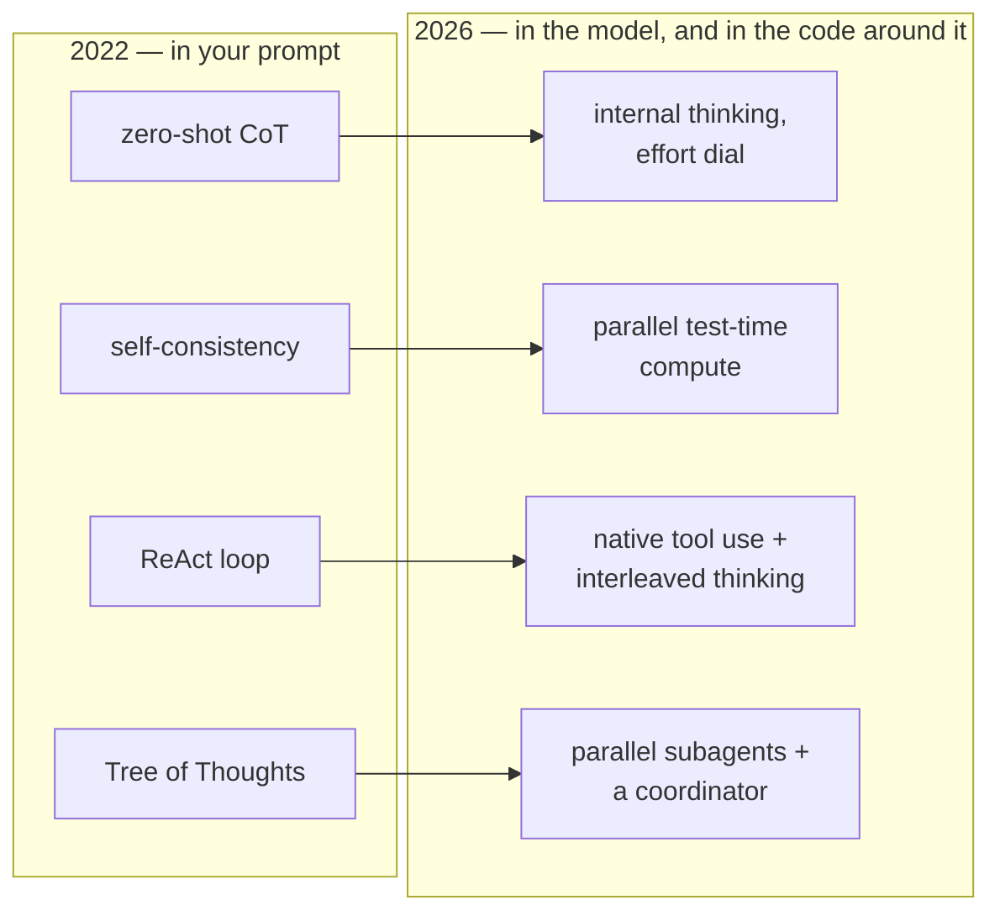

The most famous prompt advice in the field is one sentence long: add
"think step by step". In 2022 that sentence was close to magic — on
one arithmetic benchmark it lifted a top model's accuracy from 17.7%
to 78.7%, without changing a single weight. A family of relatives
followed: chains of thought, trees of thought, majority votes over
many chains, loops of reasoning and acting.

Then the models changed. Today's reasoning models think before
answering whether you ask them to or not, and Anthropic's current
guidance files manual step-by-step prompting under "fallback". So
where did the advice go? It did not die: it moved. This article
tracks the move — why the sentence worked, the techniques worth
knowing cold, which of them the models swallowed, what still
belongs in your prompt, and a three-question diagnosis from symptom
to fix.

**In this article**

- [1. Why one sentence worked miracles](#1-why-one-sentence-worked-miracles)
- [2. The classic toolbox](#2-the-classic-toolbox)
- [3. What reasoning models swallowed](#3-what-reasoning-models-swallowed)
- [4. What still belongs in your prompt](#4-what-still-belongs-in-your-prompt)
- [5. From symptom to technique, on one page](#5-from-symptom-to-technique-on-one-page)
- [The whole story in six lines](#the-whole-story-in-six-lines)
- [Glossary](#glossary)
- [Going deeper](#going-deeper)

## 1. Why one sentence worked miracles

Picture a student forced to answer a multi-step math problem by
writing *only* the final number — no scratch paper. That was every
LLM before 2022. [The LLM article](post.html?slug=how-llms-work)
explained why: a transformer spends a roughly fixed amount of
computation per token. If the answer must appear in the very next
token, all the reasoning has to fit into one **forward pass** — a
single trip through the network. For anything multi-step, one trip
is not enough.

> **Chain-of-thought (CoT)** = prompting the model to write out
> intermediate reasoning steps before the final answer, so the
> computation spreads across many tokens instead of cramming into
> one. In short: handing the model scratch paper.

The scratch paper works because generation is autoregressive: each
written step becomes visible input for the next one. Wei et al.
showed **few-shot CoT** — worked examples whose answers *contain
reasoning*. Eight such examples roughly tripled a 540B model's
GSM8K math score, from about 18% to 57%, beating models specially
retrained for the task. Kojima et al. then dropped the examples:
the bare trigger *"Let's think step by step"* — **zero-shot CoT** —
took GPT-3's instruction-tuned variant from 17.7% to 78.7% on
arithmetic word problems. The guide's apple problem shows the whole
effect:

```text
I went to the market and bought 10 apples. I gave 2 apples to the
neighbor and 2 to the repairman. I then bought 5 more apples and
ate 1. How many apples did I have left?

Without the trigger:               11 apples        ✗
With "Let's think step by step":   10 → gave 2+2 → 6 left
                                   → bought 5 → 11 → ate 1
                                   → 10 apples      ✓
```

To use it, append the trigger as the last line of the user message;
nothing else changes. One caveat both papers carried: CoT is an
**emergent ability**. A small model prompted this way produces
step-shaped nonsense — scratch paper only helps a student who can
actually do the steps.

## 2. The classic toolbox

CoT's success bred a family. Each technique names a real failure
mode, and the failure modes did not go away. Two one-liners first:
**role prompting** ("You are a senior growth marketer with twenty
years in SaaS") steers vocabulary and assumptions by shifting
probabilities, not theater — [the agent-prompt
article](post.html?slug=anatomy-of-an-agent-prompt) covers it in
depth; and Salesforce's checklist is a good pre-flight for any
prompt: instruction, context, persona, format.

**Few-shot prompting** — show worked input–output pairs; the model
imitates. Min et al.'s strange finding: *randomize the labels* and
performance barely drops. Examples teach the *shape* of the task
more than its truth, so spend your effort on realistic inputs and a
rigidly consistent format, not on polishing labels. For recurring
tasks, the examples live in the system prompt.

**Self-consistency** — one chain of thought can wander off a cliff
at any step. So sample several chains with the **temperature** up
(the randomness dial, so each run takes a different path) and take
the majority vote:

```text
Q: When I was 6, my sister was half my age.
   Now I'm 70, how old is my sister?

Run 1: at 6 the sister was 3 → three years younger → 67
Run 2: "half my age" → 70 / 2 → 35
Run 3: at 6 the sister was 3 → 67

Majority vote: 67 ✓   (a single run had answered 35)
```

Runs 1 and 3 work the problem; run 2 grabs the surface pattern and
halves 70. Wang et al. measured +17.9 points on GSM8K. Note that
this is a loop in your code, not a prompt — and ten votes cost ten
times the tokens, which is why it now lives mostly in evals.

**Prompt chaining** — split the task into sequential calls: first
"extract the quotes relevant to the question", then "answer from
the document plus the quotes". Two API calls, and your code checks
the seam between them. If call 1 finds no quotes, stop and say "not
found" instead of letting call 2 improvise. The seam is the point:
it can be tested, cached, and reviewed.

**ReAct** — interleave reasoning with acting: `Thought → Action →
Observation`, looped until the model can answer. This is the 2022
technique that won outright — the cycle is exactly what runs inside
every modern agent. Only the plumbing changed: tool-calling APIs
run the loop for you, so you define tools instead of parsing
`Action:` lines. Its weakness survived too: when a search returns
junk, the reasoning follows it off the road.

**Reflexion** — after a failed attempt, an evaluator scores it and
a *verbal* lesson ("I wasted turns searching the wrong room") is
written into memory for the next try. Paired with ReAct it solved
130 of 134 AlfWorld household tasks. Today the retry-with-feedback
loop ships inside agent frameworks; what transfers is the idea.

**Tree of Thoughts (ToT)** — treat reasoning as search: branch,
have the model grade its own candidates, backtrack from dead ends.
In Game of 24 (make 24 from four numbers with +−×÷), GPT-4 jumped
from 4% with CoT to 74% with the tree. It never left the lab: a
reasoning model at high `effort` now solves most of what the tree
was built for, and where branching still pays, the scaffold does it
with parallel subagents (section 3).

| Technique | The move | The price | 2026 status |
|---|---|---|---|
| few-shot | show worked examples | tokens on every call | alive and well |
| zero-shot CoT | "think step by step" | longer outputs | absorbed by thinking models |
| self-consistency | N chains, majority vote | N× cost | niche: evals, high-stakes |
| prompt chaining | one task, several calls | latency, plumbing | alive where you need seams |
| ReAct | reason ↔ act loop | tool-call rounds | became the agent loop |
| Reflexion | verbal lessons in memory | evaluate/reflect calls | became agent self-correction |
| Tree of Thoughts | branch, score, backtrack | exploding calls | became parallel subagents |

## 3. What reasoning models swallowed

The 2022 toolbox used *your* prompt and *your* budget to buy the
model computation time. The generation that began with OpenAI's o1
and Claude's extended thinking made the purchase at training time:
**reinforcement learning** rewarded reasoning that reached right
answers, until long internal chains became a reflex.



- **Zero-shot CoT → internal thinking.** Current models decide when
  and how much to reason, dialed by `effort` — the same name on both
  sides of the fence: Anthropic's `effort`, OpenAI's
  `reasoning.effort` (levels like minimal / low / medium / high). On
  the newest models thinking cannot even be switched off.
- **Self-consistency → test-time compute.** Premium reasoning tiers
  sample parallel paths and reconcile them behind the API — the
  majority vote industrialized.
- **ReAct → native tool use**, with thinking interleaved between
  calls.
- **ToT → the scaffold**: the code around the model launches
  parallel subagents and a coordinator merges results — the same
  tree, drawn in infrastructure instead of text.

The migration inverted the old advice: **prefer general
instructions over prescriptive steps**. "Think thoroughly before
answering" now often beats a hand-written plan, because the model's
own reasoning frequently exceeds what a human would prescribe.
There was an early omen: in 2022 the APE project had a model
*search* for a better trigger phrase, and its find beat the
human-written "Let's think step by step" on the math benchmarks.
The most famous sentence in prompt engineering was out-written by
the thing it was written for.

## 4. What still belongs in your prompt

Swallowed does not mean gone. Four moves remain.

**Fallback CoT.** When thinking is off or the model is small, the
2022 move still works — with the scratch paper separated from the
answer:

```text
Think through the problem in <thinking> tags first.
Then give only the final answer in <answer> tags.
```

These two lines go in the system prompt; your code parses only
`<answer>`. (Dialect note: GPT-family models lean on Markdown for
structure, Claude on XML tags.)

**Examples that carry reasoning.** Put `<thinking>` inside your
few-shot examples — Anthropic's own guidance — and the model copies
what the thinking *attends to*, not the words:

```text
Q: Ticket: "I was charged twice for March, and the app shows
   error B-114 when I open the billing page."
<thinking>Two signals: a duplicate charge and an error code. The
charge is the actionable problem; B-114 is its symptom, not a
separate bug. Money issues outrank UI issues.</thinking>
<answer>category: billing · severity: high</answer>
```

**Nudges over scripts.** Steer depth with the effort dial — on
OpenAI's API literally `reasoning={"effort": "low"}` — not with a
numbered plan that caps the model at your ceiling. Two sourced
one-liners worth memorizing: append *"Before you finish, verify
your answer against [your test criteria]"* for math and code; and
for a model that circles its own decisions, Anthropic's
over-thinking wrap — *"choose an approach and commit to it"* — in
the system prompt, paired with lower `effort`.

**Seams where you must see the steps.** Self-consistency lives on
as a reliability check in evals: sample N times, alert on
disagreement — low consistency means the model is guessing. Prompt
chaining lives on wherever a stage must be inspected or approved,
because an internal chain cannot be unit-tested, cached, or
audited.

## 5. From symptom to technique, on one page

Start from the symptom and ask three questions, in order. **First:
is thinking the problem at all?** Wrong context makes perfect
reasoning worthless — fix
[retrieval](post.html?slug=which-rag-pattern-do-you-need) — and a
wrong output *shape* is a formatting problem, which examples fix
faster. **Second: too little thinking or too much?** Shallow or
unstable answers mean too little; trivial tasks burning tokens mean
too much. Both are the same dial: raise or lower `effort`.
**Third: do you need to *see* the steps?** Then tags, a chain, or a
full [agent loop](post.html?slug=anatomy-of-an-agent-prompt). And
one empirical rule the practitioner guides agree on: the same
prompt behaves differently across models — verify on the model you
ship.

| Symptom | Reach for | Why this works |
|---|---|---|
| wrong on math/logic — thinking off, or a small model | zero-shot CoT, `<thinking>`/`<answer>` split | writing steps buys the compute the model is not spending internally |
| right format, wrong reasoning pattern | few-shot examples with `<thinking>` inside | examples teach the shape of the work; the pattern transfers |
| same question, different answers each run | self-consistency check; raise `effort` | disagreement reveals guessing; votes converge on correct chains |
| shallow answers on genuinely hard problems | raise `effort`; "think thoroughly" nudge | the model under-budgeted its thinking |
| trivial tasks slow and expensive | lower `effort`; bound the reasoning | thinking is spend, and here it buys nothing |
| model follows your steps off a cliff | delete the script, state the goal | a hand-written plan caps the model at your ceiling |
| must inspect or approve intermediate results | prompt chaining | only a seam between calls can be tested and reviewed |
| multi-step work against real systems | agent loop with tools | reasoning alone cannot fetch facts or act |
| wrong answers because the context is wrong | [fix retrieval](post.html?slug=which-rag-pattern-do-you-need) | perfect reasoning over the wrong page is still wrong |

## The whole story in six lines

1. A model does a fixed amount of work per token, so it cannot
   solve a multi-step problem in one jump. Asking it to write its
   reasoning first spreads the work across many tokens — that is
   chain-of-thought, and one sentence raised math accuracy about
   four-fold.
2. Each classic technique fixes one concrete failure: examples fix
   the output format (few-shot), voting over several runs catches a
   single unlucky chain (self-consistency), splitting into calls
   makes each step checkable (chaining), tool loops pull in real
   data instead of guesses (ReAct), and search helps on puzzles
   where a bad first step ruins everything (ToT).
3. Reasoning models learned to do most of this internally during
   training: they think before answering, sample parallel paths,
   and run tool loops on their own.
4. So the advice reversed: state the goal and let the model plan.
   A hand-written step list now often makes results worse, because
   the model's own plan is usually better.
5. What you still write in prompts: thinking/answer tags for models
   without built-in thinking, examples that show *how* to reason,
   the effort setting to buy more or less thinking, and separate
   calls when a step must be reviewed by a human or a test.
6. Debug from the symptom, not from the technique list — and if the
   model was given the wrong information, more thinking will never
   fix the answer.

So, where did "think step by step" go? Into the model — trained in,
not pasted in. What you own now is not the thinking but the
*decisions about* thinking: when to buy more, when to cap it, when
to demand it on paper.

## Glossary

The base vocabulary of the article, one line each:

- **chain-of-thought (CoT)** — prompting the model to write intermediate reasoning before the answer; scratch paper for a transformer.
- **forward pass** — one trip of the input through the network; the fixed unit of work behind every generated token.
- **zero-shot / few-shot CoT** — triggering reasoning with a bare instruction / with worked examples that contain reasoning.
- **temperature** — the sampling dial that adds randomness; higher values let runs diverge.
- **self-consistency** — sampling several reasoning chains and taking the majority-vote answer.
- **prompt chaining** — splitting a task into sequential model calls; every seam is inspectable.
- **ReAct** — the reason-act-observe loop over tools; ancestor of today's agent loop.
- **Reflexion** — writing a verbal lesson after a failure, read before the next attempt.
- **Tree of Thoughts (ToT)** — reasoning as tree search: branch, evaluate, backtrack.
- **reasoning model** — a model RL-trained to think internally before its visible answer.
- **effort** — the API dial that scales how much internal reasoning the model spends; `effort` on Anthropic's API, `reasoning.effort` (minimal → high) on OpenAI's.
- **test-time compute** — buying accuracy with more computation at answer time instead of bigger weights.
- **scaffold** — the code wrapped around a model that decides what to call and when.

## Going deeper

- Wei et al., [Chain-of-Thought Prompting Elicits Reasoning in Large Language Models](https://arxiv.org/abs/2201.11903) (2022) — the paper that started it.
- Kojima et al., [Large Language Models are Zero-Shot Reasoners](https://arxiv.org/abs/2205.11916) (2022) — "Let's think step by step".
- Wang et al., [Self-Consistency Improves Chain of Thought Reasoning](https://arxiv.org/abs/2203.11171) (2022) — majority voting over sampled chains.
- Yao et al., [ReAct](https://arxiv.org/abs/2210.03629) (2022) — the reason-act loop that grew into the agent pattern.
- Yao et al., [Tree of Thoughts](https://arxiv.org/abs/2305.10601) (2023) — reasoning as search.
- Min et al., [Rethinking the Role of Demonstrations](https://arxiv.org/abs/2202.12837) (2022) — the random-labels finding.
- Shinn et al., [Reflexion](https://arxiv.org/abs/2303.11366) (2023) — verbal reinforcement and the AlfWorld results.
- Zhou et al., [Large Language Models are Human-Level Prompt Engineers](https://arxiv.org/abs/2211.01910) (2022) — APE's machine-found trigger phrase.
- Anthropic, [Prompting best practices](https://platform.claude.com/docs/en/build-with-claude/prompt-engineering/claude-prompting-best-practices) — the source for this article's 2026 half.
- OpenAI, [Reasoning guide](https://developers.openai.com/api/docs/guides/reasoning) — the `reasoning.effort` parameter and its levels.
- [The Prompting Guide](https://www.promptingguide.ai/techniques) — the maintained technique catalog behind the worked examples here.
- Salesforce, [Prompt engineering techniques](https://www.salesforce.com/artificial-intelligence/prompt-engineering/techniques/) and IBM, [Prompt engineering techniques](https://www.ibm.com/think/topics/prompt-engineering-techniques) — the practitioner views: role prompting, the four-part checklist, testing per model.
- On this blog: [Anatomy of an agent prompt](post.html?slug=anatomy-of-an-agent-prompt) — where these techniques sit inside a full system prompt — [How LLMs actually work](post.html?slug=how-llms-work) — why CoT works — and [Which RAG pattern do you need](post.html?slug=which-rag-pattern-do-you-need) — for the failures thinking cannot fix.
