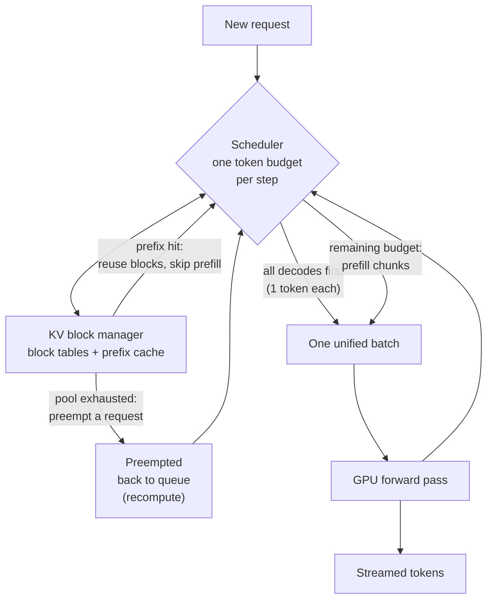

The dashboard says your GPU memory is 92% allocated, yet the
throughput is a third of what the launch benchmark promised. p95
TTFT looks fine all morning, then someone pastes a 30-page document
and every other user's stream freezes for a second. And a counter
you have never alerted on — `vllm:num_preemptions_total` — has been
climbing quietly since Tuesday. None of these are bugs. All of them
are the serving engine making a scheduling decision you have not
tuned yet.

This article assumes you already know *why* vLLM won the serving
race — continuous batching plus paged KV memory, covered in [the
cost and latency guide](post.html?slug=optimizing-llm-cost-and-latency)
on this blog — and goes inside the engine instead: how the block
table and prefix cache actually work, what the scheduler does every
step, what changed in the V1 rewrite, which of the many flags
matter, and what to watch in production. One image will carry us
through: vLLM as a hotel. The naive engine books a whole floor per
guest; vLLM runs a very good front desk.

**In this article**

- [1. The floor you are standing on](#1-the-floor-you-are-standing-on)
- [2. The memory desk: block tables, prefix caching, preemption](#2-the-memory-desk-block-tables-prefix-caching-preemption)
  - [The block table](#the-block-table)
  - [Prefix caching: rooms shared between guests](#prefix-caching-rooms-shared-between-guests)
  - [Preemption: when the hotel overbooks](#preemption-when-the-hotel-overbooks)
- [3. The scheduler and the V1 engine](#3-the-scheduler-and-the-v1-engine)
  - [One token budget, one batch](#one-token-budget-one-batch)
  - [Why V1 exists](#why-v1-exists)
  - [CUDA graphs in one table](#cuda-graphs-in-one-table)
- [4. The accelerators: speculative, structured, quantized](#4-the-accelerators-speculative-structured-quantized)
- [5. From one GPU to a cluster](#5-from-one-gpu-to-a-cluster)
- [6. The tuning triangle](#6-the-tuning-triangle)
- [7. Running it in production](#7-running-it-in-production)
- [8. When vLLM is not the answer](#8-when-vllm-is-not-the-answer)
- [The whole story in six lines](#the-whole-story-in-six-lines)
- [Glossary](#glossary)
- [Going deeper](#going-deeper)

## 1. The floor you are standing on

A quick recap, one paragraph per idea, because the rest of the
article builds on it. Every LLM call has two phases: **prefill**
reads the whole prompt in one parallel pass and fills the KV cache;
**decode** writes the answer one token per forward pass, re-reading
that cache every time. The KV cache is why generation does not cost
quadratic recomputation — and it grows with every token of context.
(For the full mechanics, [how LLMs
work](post.html?slug=how-llms-work) walks through it slowly; the
two sentences above are enough to follow this article.)

Two asymmetries hide in that sentence pair, and half of serving
engineering falls out of them. First, the cache holds keys and
values but no queries: a past token's K and V are re-read by
every future token, while its query was needed exactly once, so
storing it would buy nothing. Second, the two phases stress
different hardware. Prefill does a lot of math per byte of
weights it touches — thousands of prompt tokens multiply through
each matrix in one pass — so it is **compute-bound**. Decode
must stream *every weight of the model* through the GPU to
produce one token per sequence, so it is **memory-bandwidth-
bound**, and the compute units sit half idle. That idleness is
exactly what batching sells back: the weights are streamed once
per step whether the batch holds one sequence or two hundred, so
stacking decodes amortizes the most expensive read in the
system. Keep this pair in your pocket — it answers "why batch",
"why does prefill spike everyone's latency", and "which GPU
should I buy" all at once.

Two latency words recur on every page that follows, so let's pin
them down once:

> **TTFT (time to first token)** = how long the user waits before
> anything appears; queueing plus prefill. **ITL (inter-token
> latency)**, also called TPOT = the gap between tokens while the
> answer streams; set by decode. A serving engine is permanently
> negotiating between these two and total throughput.

Before vLLM, serving systems allocated each request's KV cache as
one contiguous slab sized for the *maximum possible* context — a
hotel that books the entire floor for every guest, however long
they actually stay. The vLLM team measured existing systems wasting
60–80% of KV memory to fragmentation and over-reservation.
**PagedAttention** (SOSP 2023) is the front desk that ends this: KV
memory is split into small fixed blocks — 16 tokens each by
default — and a guest gets rooms one at a time, as their stay
grows. Waste drops under 4%, and the freed space becomes batch
capacity, which is why the paper reports 2–4x the throughput of
FasterTransformer and Orca at the same latency.

The second half of the baseline is **continuous batching** — the
Orca paper's contribution (OSDI 2022), a year before vLLM's paper
contributed the memory manager; interviewers like the two kept
apart. Static
batching serves a group of requests like a tour bus: nobody gets
off until the longest answer finishes, so short requests idle in
their seats. Continuous batching re-forms the batch at *every
decode step* — finished sequences leave immediately, queued
requests board immediately, the GPU never runs empty seats. Paged
memory is what makes the boarding cheap: admitting a request no
longer requires finding a contiguous slab, just any free rooms.
That pairing is the baseline you are already running. Now let's
meet the desk clerk.

## 2. The memory desk: block tables, prefix caching, preemption

### The block table

> **Block table** = the per-request map from logical KV blocks
> ("my 3rd block of 16 tokens") to physical blocks anywhere in GPU
> memory — exactly a process's page table in an operating system,
> reincarnated inside an inference engine.

A request's blocks do not need to be contiguous, so there is
nothing to fragment: any free room in the hotel will do, the
front-desk ledger records who is where, and the attention kernel
walks the ledger blockwise. The OS analogy runs deeper than
allocation. When one prompt generates several parallel completions,
or beam search explores branches, the shared prefix occupies *one*
physical copy referenced by all sequences. The moment a sequence
needs to write into a shared block, vLLM performs
**copy-on-write** — clone the room, edit your own copy — the same
semantics an OS uses for `fork()`. The original announcement
measured this sharing cutting memory use by up to 55% in
beam-search-style workloads.

### Prefix caching: rooms shared between guests

Sharing within one request is automatic. Sharing *across* requests
is **automatic prefix caching (APC)**, and its mechanics are worth
knowing because they explain its limits. Every full block gets a
hash computed as a chain: the parent block's hash, plus this
block's token IDs, plus "extra keys" — the LoRA adapter ID, hashes
of any image inputs, and an optional **cache salt** that isolates
tenants from each other. The chaining is the correctness guarantee:
a hit on block *n* proves the entire prefix up to *n* matches
token-for-token, not just that one block. A hit bumps the physical
block's reference count; only blocks with `ref_cnt = 0` are
eligible for eviction, oldest-unused first. Two practical
consequences: caching is greedy at block boundaries (a 15-token
shared prefix shares nothing), and in multi-tenant serving the
cache salt is a security control, not an optimization. Since
v0.11 the default hash is sha256; a CBOR-serialized variant exists
when you need hashes reproducible across processes and languages.

Why is this on by default when many workloads share no prefixes at
all? Because V1 rebuilt the bookkeeping around constant-time
structures: the measured throughput penalty at a 0% hit rate is
under 1%. With a stable system prompt in front of every request —
the norm in agent and RAG traffic — the shared prefix's prefill
cost collapses toward zero. Your system prompt is the hotel lobby:
built once, walked through by everyone. (This is also the
machinery underneath the "prompt caching" line on API providers'
price lists — the discount you rent from them is the mechanism
you operate yourself when self-hosting.)

### Preemption: when the hotel overbooks

Continuous batching admits requests as long as there are free
blocks. Sooner or later a burst of long generations exhausts the
pool, and the front desk must ask a guest to step out.

> **Preemption** = evicting a running request's KV blocks to make
> room for others, then re-admitting it later. Two flavors:
> **recompute** (drop the blocks, redo the prefill on return) and
> **swap** (park the blocks in CPU RAM over PCIe, load them back).

V1 defaults to recompute, which carries lower overhead in the new
architecture — and note the asymmetry: re-prefilling costs grow
roughly with the *square* of sequence length, while swapping grows
linearly, so very long sequences are where swap earns its PCIe
bill. The operational point matters more than the mechanism: every
preemption is work done twice. A `num_preemptions_total` counter
that climbs steadily under normal load is the engine telling you
its KV pool is undersized for your traffic — raise
`gpu_memory_utilization`, lower `max_model_len` to what requests
actually use, or add capacity. Occasional preemptions under bursts
are normal; a steady climb is a capacity signal, and it shows up
in this counter before your users see it in p99.

## 3. The scheduler and the V1 engine

### One token budget, one batch

Older schedulers (vLLM V0 included) treated prefill and decode as
different kinds of work: prefill-first policies optimized TTFT and
made running streams stutter. The V1 scheduler dissolves the
distinction. Its entire decision each step is a dictionary —
`{request_id: how_many_tokens_to_process}` — and a single budget,
`max_num_batched_tokens`, that the step may not exceed. Decodes
are cheap (one token per running sequence) and go first; whatever
budget remains is given to prefills, and a long prefill is sliced
into chunks that fit — **chunked prefill**, on by default.

This one mechanism is the head-of-line-blocking cure: a 32K-token
prompt no longer occupies the GPU for hundreds of milliseconds
while every other user's stream stalls; it trickles in beside their
decodes. And the budget is the single most direct latency knob you
have. A small budget (say 2,048 tokens) means decodes share each
step with little prefill work — smooth inter-token latency, slower
first tokens. A large budget (the docs recommend above 8,192 for
throughput on big GPUs) swallows prompts quickly — better TTFT and
throughput, more prefill interference in each step. Where the
default lands actually depends on your hardware and entry point;
current code picks 8,192 for online serving on an H100 but 2,048
on smaller GPUs, which is one more reason to check your running
version rather than a blog post, this one included.



Read the diagram as the life of one request, because "walk me
through a request" is a question worth having rehearsed: an API
server process tokenizes it and hands it over ZeroMQ; it waits in
the queue until the block manager can seat it, any prefix hit
already counted in its favor; its prefill runs as chunks inside
the shared budget; it joins the decode crowd at one token per
step until it finishes — or gets preempted back to the queue;
and on completion its blocks flow back to the cache, reusable
until evicted. Every row of the symptom table at the end of this
article is a failure at one of those five stops.

### Why V1 exists

By 2024 the GPUs had gotten fast enough to expose everyone else.
A Llama-8B forward pass on an H100 takes roughly 5 milliseconds;
if tokenization, scheduling, detokenization, and streaming — all
CPU work — take a few milliseconds too, the accelerator idles
while Python thinks. V1 (default since v0.8.0, March 2025) is a
rewrite aimed almost entirely at that overhead: an isolated
`EngineCore` process that does nothing but schedule and execute,
talking to the API server over ZeroMQ so CPU work overlaps GPU
work (a tensor-parallel-4 deployment is six processes: one API
server, one engine core, four GPU workers — and under heavy
request parsing the API server itself can be replicated with
`--api-server-count`); a **persistent batch**
that caches input tensors and applies only diffs between steps;
`torch.compile` for kernel generation. The result is up to 1.7x
the throughput of V0 with *the same* GPU kernels — the gain is
pure CPU-overhead removal, which tells you exactly how much the
old engine was leaving on the table. V0 froze in mid-2025 and its
code is gone; if a guide mentions `--num-scheduler-steps` or
swap-by-default, it is describing a museum piece.

### CUDA graphs in one table

The last CPU overhead is kernel *launching*: decode steps run many
small kernels, and dispatching each from Python costs more than
some kernels take to run. CUDA graphs record the whole sequence
once and replay it as one unit. V1 exposes the strategy as a mode:

| Mode | What it does | When |
|---|---|---|
| `FULL_AND_PIECEWISE` (default) | Full graphs for decode steps, piecewise elsewhere | Best performance, most memory |
| `PIECEWISE` | Graphs everything except attention | Widest compatibility |
| `FULL_DECODE_ONLY` | Full graphs only for pure-decode batches | Decode-side instances |
| `NONE` | No graphs | Debugging |

Two caveats. Only FlashAttention 3 handles full graphs across
mixed batches; other attention backends silently constrain the
mode. And `enforce_eager=True` — the flag every quickstart
reaches for when something crashes — disables graphs *and*
compilation: fastest startup, lowest memory, and a steady-state
decode penalty you will pay on every token thereafter. Fine for
debugging, wrong for serving.

## 4. The accelerators: speculative, structured, quantized

**Speculative decoding.** Decode's frustration is that a huge
model does a full forward pass per token, and most tokens are
easy. So a cheap drafter proposes several tokens ahead, and the
big model verifies the whole proposal in *one* parallel pass,
keeping the prefix it agrees with — the output is provably
identical to the big model decoding alone, just delivered in
fewer passes (the full theory and lineage are in
[the cost guide](post.html?slug=optimizing-llm-cost-and-latency)).
In vLLM it is one flag, `--speculative-config`, and a method
choice: **n-gram** drafts from the prompt itself (zero extra VRAM —
excellent for tasks that copy input, like editing and extraction),
**EAGLE**-family heads give the best acceptance rates, **Medusa**
sits in between. Watch the mean acceptance length τ in the
metrics before anything else: if the model rejects most drafts,
you are burning compute for nothing. And remember the free lunch
shrinks with load — at high batch sizes, verification competes
with real traffic for compute, and a fixed speculation length can
push total throughput *down*. The 2026 answer is adaptive
verification (the DSpark line): a confidence head decides per step
how many draft tokens are worth verifying, so the engine behaves
like a long speculator when idle and a short one when saturated.

**Structured output.** Constrained decoding compiles your JSON
schema or grammar into a per-step bitmask over the vocabulary —
the model literally cannot emit an invalid token. XGrammar is the
default backend and caches compiled grammars, so repeated schemas
cost little after the first request. The V1 note worth knowing: in
V0 a single constrained request could stall the whole batch while
its mask was built; V1 builds masks in the scheduler, off the
critical path. If your product parses model output with a regex,
this feature replaces a whole class of retry loops.

**Quantizing the cache, not just the weights.** Quantization
stores numbers in fewer bits — 16-bit values squeezed to 8 or
4 — trading a little precision for memory and bandwidth. Applied
to *weights* it shrinks the model and speeds up decode (choosing
methods and their accuracy costs is
[its own topic](post.html?slug=optimizing-llm-cost-and-latency));
the serving-specific lever is `--kv-cache-dtype fp8`, which halves
the KV cache and therefore roughly doubles how many tokens of
context fit in the pool. For long-context and reasoning traffic
this is often the single cheapest capacity win: a 30K-token
reasoning trace on a GQA 70B model holds roughly 9 GB of cache at
16-bit and half that at FP8 (the arithmetic is in section 7).
Attention-heavy layer types react differently — sliding-window
layers are more sensitive, and a skip-layers flag exists for
exactly that reason. As with all lossy compression: benchmark on
your task before trusting it.

## 5. From one GPU to a cluster

The parallelisms answer different shortages, and picking by
symptom keeps them straight. **Tensor parallelism** splits every
layer's weight matrices across GPUs — reach for it when the model
does not fit on one GPU, or when it fits but leaves no room for KV
cache; the price is an all-reduce synchronization every layer, so
it belongs inside a node with fast interconnect. **Pipeline
parallelism** splits the model into stages of layers — the
standard multi-node recipe is TP = GPUs per node, PP = number of
nodes (for two 8-GPU nodes: `--tensor-parallel-size 8
--pipeline-parallel-size 2`). For MoE models the roles flip:
**expert parallelism** spreads the experts while attention often
runs data-parallel, which is how DeepSeek-class models with MLA
attention are served at scale. And a 2026 addition closes a gap TP
never covered: **decode context parallelism** shards the KV cache
along the *sequence* dimension, for models whose few KV heads made
TP replicate the whole cache on every GPU — on long-context
agentic traffic the vLLM team reports roughly 3x per-GPU
throughput from this alone.

The frontier of cluster serving is **prefill/decode
disaggregation**: separate vLLM instances for the two phases, with
a connector streaming KV blocks from prefill nodes to decode
nodes — the hotel finally splitting the check-in desk from room
service. The logic follows from phase physics: prefill saturates
compute, decode saturates memory bandwidth, so co-locating them
means each phase's bursts pollute the other's latency. Separating
them lets you tune TTFT and inter-token latency independently,
scale the two pools independently, even put them on different
hardware. The cost is moving the cache: a 4K-token prompt on a
GQA 70B is over a gigabyte of KV to transfer, which is why the
connector layer (llm-d, NVIDIA Dynamo, and vendor fabrics) is
where the engineering lives. Meta runs vLLM disaggregated in
production and reports improving both TTFT and inter-token
latency against its internal stack. If you run a single node,
file this under "know it exists": it becomes relevant when one
pool of identical replicas stops being able to hold both your
TTFT and your ITL targets at once.

## 6. The tuning triangle

Every flag below moves you inside one triangle: time to first
token, inter-token latency, total throughput. Nothing buys all
three; tuning is deciding which corner your product lives in.

| Parameter | What it does | Guidance |
|---|---|---|
| `gpu_memory_utilization` (0.90) | Fraction of GPU memory vLLM claims; weights first, KV pool gets the rest | Raise to 0.92–0.95 on dedicated GPUs; first move when preemptions climb |
| `max_num_batched_tokens` | Per-step token budget | ~2K favors ITL; 8–16K favors TTFT/throughput; hardware-dependent default |
| `max_num_seqs` | Max concurrent sequences per step | Cap on concurrency; sweep it while watching the latency you care about |
| `max_model_len` | Max context length | Set to what traffic actually uses — every unused token of headroom is KV pool you paid for |
| `enable_prefix_caching` | APC (on by default in V1) | Leave on; add a cache salt in multi-tenant serving |
| `kv_cache_dtype` | FP8 KV cache | ~2x context capacity; benchmark quality on your task |
| `tensor_parallel_size` / `pipeline_parallel_size` | Weight / stage splitting | TP inside a node (also frees KV room); PP across nodes |
| `--speculative-config` | Speculative decoding | Watch acceptance length τ; shorten or disable under high concurrency |
| `enforce_eager` | Disables compile + CUDA graphs | Debugging only — costs steady-state decode speed |
| `block_size` (16) | Tokens per KV block | Rarely touched; caching shares only whole blocks |

**Where the VRAM actually goes.** Every flag above is really
pushing on one of three regions of GPU memory:

| Region | What fills it | Governed by |
|---|---|---|
| Model weights (static) | parameters × bytes per value | `dtype`, weight quantization |
| KV cache pool (dynamic) | context length × concurrent sequences | `max_model_len`, `max_num_seqs`, `kv_cache_dtype` |
| Activation scratch (transient) | the working memory of one forward pass | `max_num_batched_tokens` |

At startup vLLM loads the weights, profiles a forward pass to
reserve activation scratch (plus CUDA graph memory), and hands
*everything left* inside `gpu_memory_utilization` to the KV pool.
It then prints the result — "KV cache size: N tokens" — in the
boot log, and that N is your real concurrency budget, worth
reading before any benchmark. (Why does the default stop at 0.90
rather than 1.0? Because the GPU is never quite yours alone —
CUDA context, allocator fragmentation, and activation spikes all
need slack. Push to 0.95 on a dedicated card; 1.0 is an OOM with
extra steps.) Note the built-in rivalry: a bigger
step budget inflates the transient scratch, and bigger
concurrency inflates the KV pool, and both are carved from the
same fixed VRAM. Raise both at once and the boot succeeds while
the OOM waits for your first long-prompt burst.

**The arithmetic, worked once.** Take Llama-3-8B in bfloat16 on
a single 80 GB H100. Per token, the KV cache costs 2 (K and V) ×
32 layers × 8 KV heads × 128 head dimension × 2 bytes = 0.125 MB.
Now walk the budget:

- Weights: 8B parameters × 2 bytes ≈ **16 GB**, fixed.
- Pool: 80 GB × 0.90 utilization = 72 GB claimed; minus weights,
  minus roughly 2 GB of activation scratch and CUDA graphs ≈
  **54 GB for KV cache**.
- Capacity: 54 GB ÷ 0.125 MB ≈ **~430,000 tokens** in flight —
  for example ~100 concurrent requests at 4K context each.
- Demand check: `max_model_len 8192 × max_num_seqs 256`
  *authorizes* ~2.1M tokens — five times the supply. Fine if real
  requests stay short; a preemption storm the day they don't.
- One flag, `--kv-cache-dtype fp8`, doubles the capacity to
  ~860,000 tokens without touching the weights.

The same walk explains most OOM incidents and most "why is my
concurrency so low" tickets: authorize more than you supply and
the gap is paid in preemptions; oversize the step budget and the
scratch region takes the pool's memory instead. Two starting
points, to be tuned against your own SLOs rather than copied:

```bash
# Chat: protect the stream (ITL corner)
vllm serve MODEL \
  --max-num-batched-tokens 2048 \
  --max-num-seqs 64 \
  --gpu-memory-utilization 0.90

# Batch / RAG ingestion: fill the GPU (throughput corner)
vllm serve MODEL \
  --max-num-batched-tokens 16384 \
  --max-num-seqs 256 \
  --gpu-memory-utilization 0.95 \
  --kv-cache-dtype fp8
```

## 7. Running it in production

**Metrics.** vLLM exposes Prometheus metrics at `/metrics`; six
earn a permanent dashboard: `time_to_first_token_seconds`,
`inter_token_latency_seconds`, `e2e_request_latency_seconds`,
`num_requests_running` and `_waiting` (queue depth),
`gpu_cache_usage_perc` (KV pool pressure), and
`num_preemptions_total`. Alert on p95/p99, never p50 — a server
can pass every health check while its tail latency ruins the
product. And treat metric *names* as version-specific: they have
been renamed across releases, so validate alerts against the
`/metrics` output of the build you actually run.

**Capacity is arithmetic, not vibes.** Section 6 walked the
per-token formula — 2 × layers × KV heads × head dimension ×
bytes — for one model; scaled across architectures it becomes
your capacity-planning table, and it is why attention design
matters more than parameter count. The acronyms in it are one
definition apart:

> **MHA / GQA / MLA** = how many key-value heads attention
> keeps. Multi-head attention (MHA) gives every query head its
> own K/V pair. Grouped-query attention (GQA) makes groups of
> query heads *share* one — Llama-3's 64 query heads read from
> just 8 KV heads. Multi-head latent attention (MLA, DeepSeek)
> compresses the lot into one small latent vector. Fewer KV
> heads means a smaller cache per token, at no cost in
> parameter count — which is why every modern open model ships
> with GQA or better.

| Model | KV per token (16-bit) | 4K context | 128K context |
|---|---|---|---|
| Llama-2-70B (MHA, 64 KV heads) | ~2.5 MB | ~10 GB | ~320 GB |
| Llama-3-70B (GQA, 8 KV heads) | ~0.31 MB | ~1.25 GB | ~40 GB |
| DeepSeek-class (MLA) | compressed latent, far smaller still | — | — |

Same layer count, same size class — an 8x difference from the
attention design alone, before FP8 halves it again. Weights come
first (a 16-bit 70B is ~140 GB — two 80 GB GPUs before a single
token of cache), and keep 15–20% headroom for activations and
CUDA context. This table is also your GPU shopping guide: prefill
wants FLOPS, decode wants memory bandwidth, and which one you are
short of depends on your input/output length mix.

**Optimize goodput, not throughput.**

> **Goodput** = requests per second that *meet your SLOs* (e.g.
> TTFT under 500 ms and ITL under 50 ms) — the only throughput
> number your product actually experiences.

Raw tokens/s climbs with concurrency long after the experience
has collapsed. `vllm bench serve` measures goodput directly: give
it your SLO thresholds, replay realistic prompt/response length
distributions (not fixed-length synthetics — length mix changes
every conclusion), and sweep concurrency until goodput peaks.
That peak, not the throughput plateau, is a replica's true
capacity, and it is the number your autoscaler should target.
On Kubernetes, the vLLM production-stack, KServe, and Ray Serve
all wire this up; one router feature is worth singling out:
**prefix-aware routing**, which sends requests sharing a prefix
to the same replica so section 2's cache actually gets hits
instead of being sprayed across the pool.

**The checklist the industry converged on.** Beyond metrics and
math, a handful of operational practices show up in nearly every
serious vLLM deployment writeup:

- **Probes that respect startup.** A vLLM pod spends minutes
  loading weights, compiling, and capturing CUDA graphs before
  `/health` goes green — give Kubernetes a generous startup probe
  and keep liveness separate from readiness, or the orchestrator
  will kill pods that were about to be fine.
- **Warm before traffic.** First requests after boot pay
  compilation and cache-warming costs; send a few representative
  warm-up prompts before the replica joins the load balancer.
- **Pre-stage the weights.** Pull model files onto a volume via an
  init container instead of downloading inside the server —
  restarts stop costing a re-download.
- **Roll, never drain-all.** Each replica holds a warm prefix
  cache and a queue; update with `maxUnavailable: 0`-style rolling
  deploys so capacity and cache never vanish at once.
- **Autoscale on queue depth, not utilization.** CPU sits at 5%
  while requests pile up, and "GPU utilization" reads high even
  when the engine is memory-starved; scale on
  `num_requests_waiting` (KEDA reads it straight from `/metrics`)
  and on KV-pool pressure.
- **Tune in order.** The sequence practitioners recommend:
  replica-versus-GPU topology first, then `gpu_memory_utilization`
  upward (0.90 → 0.95), then FP8 KV cache with a quality check,
  then a `max_num_seqs` sweep against your SLOs — one change at a
  time, re-benchmarked each step.
- **Pin your versions.** Defaults, flags, and metric names move
  between releases; a minor upgrade is a config review, not a
  routine bump.

**Multi-LoRA, briefly.** One base model plus per-request adapters
(`--enable-lora`, `--max-loras`) serves many fine-tuned variants
from one GPU — the standard multi-tenant customization pattern.
The prefix-cache hash already includes the adapter ID, so tenants
never share cached blocks. One warning: runtime adapter loading
(`VLLM_ALLOW_RUNTIME_LORA_UPDATING`) turns "load a file" into an
API call — keep it off outside isolated environments.

## 8. When vLLM is not the answer

An honest map of the field, sharpened from
[the earlier comparison](post.html?slug=optimizing-llm-cost-and-latency)
now that you know the internals:

| Engine | Where it wins | The price |
|---|---|---|
| vLLM | Fastest to production, broadest model/hardware support, no build step | Rarely the peak number on any single benchmark |
| TensorRT-LLM | Highest sustained raw throughput on NVIDIA in most third-party tests (single-digit to ~low-teens percent ahead) | Engine builds, slow iteration, vendor lock-in |
| SGLang | Prefix-heavy traffic (agents, RAG) via RadixAttention — a live prefix *tree* over the KV cache, reusing shared context at finer grain than vLLM's block hashes; gap narrows on very large models | Smaller ecosystem than vLLM |

Treat all cross-engine percentages as weather reports: model,
GPU, concurrency, and prompt mix decide the winner, and published
benchmarks disagree with each other for exactly that reason —
at least one well-run test crowns each of the three. Benchmark on
your hardware with your traffic before committing; the flags in
section 6 change results by more than the engines differ.

The rate of change is also a real decision input. In roughly one
year: V0 removed entirely; Blackwell GPUs with FP4 weights
reported at up to ~4x Hopper throughput at similar latency;
disaggregated GB200 racks pushing past 20K tokens/s per GPU on
frontier MoE models; adaptive speculative verification; decode
context parallelism. An engine choice is a bet on a project's
velocity as much as on today's benchmark.

Close the loop the way the engine itself would — symptom first:

| Symptom | Move | Why it works |
|---|---|---|
| `num_preemptions_total` climbing steadily | Raise `gpu_memory_utilization`; cut `max_model_len`; add capacity | KV demand exceeds the pool; preemption is work done twice |
| p95 TTFT over SLO, ITL fine | Raise `max_num_batched_tokens` | Prompts wait for step budget; a bigger budget swallows them sooner |
| p95 ITL degrading, TTFT fine | Lower `max_num_batched_tokens` | Less prefill interference inside each decode step |
| Same system prompt everywhere, low cache hits | Check prefix-aware routing and block-boundary alignment | APC shares whole blocks on identical prefixes, per replica |
| Speculative decoding, throughput fell under load | Shorten speculation or go adaptive; check τ | Verification competes with real traffic for compute |
| Prefix-heavy agent traffic still underperforms | Evaluate SGLang | RadixAttention reuses prefixes at tree granularity |
| One model, NVIDIA-only, chasing peak tokens/s | Evaluate TensorRT-LLM | Compiled engines win sustained-load benchmarks |

## The whole story in six lines

1. PagedAttention allocates KV cache in 16-token blocks through a
   page table, cutting memory waste from 60–80% to under 4% — the
   freed memory becomes batch capacity, which becomes throughput.
2. Prefix caching hashes block chains so identical prefixes are
   stored once; V1 made its overhead near zero, so it is always
   on, and your system prompt's prefill is nearly free.
3. The V1 scheduler runs one token budget per step — decodes
   first, chunked prefills in the remainder — and that budget,
   `max_num_batched_tokens`, is the main TTFT-versus-ITL dial.
4. V1's 1.7x over V0 came from removing CPU overhead, not faster
   kernels; `enforce_eager` gives some of it back, so leave it
   for debugging.
5. Capacity is arithmetic: KV bytes per token × context ×
   concurrent sequences must fit the pool, or you pay in
   preemptions — and `num_preemptions_total` warns you before
   your users do.
6. Tune for goodput — requests meeting your TTFT and ITL SLOs —
   on your own hardware and traffic; engine-versus-engine
   percentages from other people's benchmarks do not transfer.

## Glossary

- **PagedAttention** — KV cache management in small fixed blocks
  mapped through per-request block tables, like OS virtual memory.
- **block table** — the ledger mapping a request's logical KV
  blocks to physical GPU blocks; enables non-contiguous allocation
  and sharing.
- **copy-on-write** — cloning a shared KV block only when a
  sequence needs to write into it; how parallel sampling shares
  prefixes safely.
- **automatic prefix caching (APC)** — cross-request reuse of KV
  blocks via chained hashes; a hit proves the whole prefix
  matches.
- **cache salt** — extra key mixed into block hashes to keep
  tenants' caches isolated in shared deployments.
- **preemption** — evicting a running request's KV blocks under
  memory pressure; V1 re-prefills on return (recompute).
- **chunked prefill** — slicing long prompts into pieces that
  share each step with decodes, preventing head-of-line blocking.
- **CUDA graph** — pre-recorded kernel sequence replayed as one
  launch, removing per-kernel CPU dispatch cost from decode.
- **acceptance length (τ)** — average drafted tokens accepted per
  step in speculative decoding; the first metric to check.
- **goodput** — throughput counting only requests that meet
  latency SLOs.
- **P/D disaggregation** — running prefill and decode on separate
  instances, streaming KV between them, tuning each phase
  independently.
- **GQA (grouped-query attention)** — query heads share a smaller
  set of KV heads, shrinking the cache per token; Llama-3 pairs
  64 query heads with 8 KV heads.
- **MLA** — DeepSeek's latent-compressed attention; shrinks KV
  cache dramatically compared to MHA/GQA.

## Going deeper

- Kwon et al., *Efficient Memory Management for LLM Serving with
  PagedAttention* (SOSP 2023) —
  [arxiv.org/abs/2309.06180](https://arxiv.org/abs/2309.06180)
- vLLM: *Easy, fast, and cheap LLM serving* (2023 announcement) —
  [vllm.ai/blog/2023-06-20-vllm](https://vllm.ai/blog/2023-06-20-vllm)
- *vLLM V1: a major upgrade to the core architecture* —
  [vllm.ai/blog/2025-01-27-v1-alpha-release](https://vllm.ai/blog/2025-01-27-v1-alpha-release)
- vLLM docs: [optimization &
  tuning](https://docs.vllm.ai/en/stable/configuration/optimization/),
  [prefix caching
  design](https://docs.vllm.ai/en/stable/design/prefix_caching/),
  [CUDA graphs](https://docs.vllm.ai/en/stable/design/cuda_graphs/)
- RFC: *Deprecating vLLM V0* —
  [github.com/vllm-project/vllm/issues/18571](https://github.com/vllm-project/vllm/issues/18571)
- Red Hat Developer, *Practical strategies for vLLM performance
  tuning* —
  [developers.redhat.com](https://developers.redhat.com/articles/2026/03/03/practical-strategies-vllm-performance-tuning)
- *Disaggregated inference at scale with PyTorch & vLLM* (Meta) —
  [pytorch.org/blog](https://pytorch.org/blog/disaggregated-inference-at-scale-with-pytorch-vllm/)
- Aleksa Gordić, *Inside vLLM: anatomy of a high-throughput
  inference system* —
  [aleksagordic.com/blog/vllm](https://www.aleksagordic.com/blog/vllm)
- On this blog: [Optimizing LLM cost and
  latency](post.html?slug=optimizing-llm-cost-and-latency) — the
  serving room this article unpacks —
  [How LLMs work](post.html?slug=how-llms-work) — prefill, decode,
  and what the KV cache stores —
  [Anatomy of an agent prompt](post.html?slug=anatomy-of-an-agent-prompt)
  — the stable-prefix traffic that prefix caching rewards —
  [Which RAG pattern do you need](post.html?slug=which-rag-pattern-do-you-need)
  — where long shared contexts come from.
