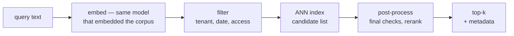

On a laptop, vector search is twenty lines of code. Load FAISS, add a
million embeddings, query — flawless neighbors in a few milliseconds,
and it is tempting to conclude the problem is solved. Then production
arrives with three perfectly ordinary requests: a customer exercises
their right to be deleted, the product team asks for "search, but only
within this tenant's documents", and someone notices that the file
uploaded yesterday still cannot be found today. None of these are
search problems. All three take the demo apart.

That gap has a shape. An ANN index is a brilliantly organized *shelf*;
production needs the whole *library building* around it — lending and
returns, a catalog, member cards, new acquisitions shelved daily. This
article walks through the building: what separates an index from a
database, what happens to one query from arrival to top-k, which index
families pay which costs, why filters break demos, what living data
demands, what scale looks like — and, at the end, whether you need any
of it at all.

**In this article**

- [1. An index is not a database](#1-an-index-is-not-a-database)
- [2. The life of one query](#2-the-life-of-one-query)
- [3. The index families](#3-the-index-families)
- [4. Filtering: the question that breaks demos](#4-filtering-the-question-that-breaks-demos)
- [5. Living data: upserts, deletes, freshness](#5-living-data-upserts-deletes-freshness)
- [6. Scale and operations](#6-scale-and-operations)
- [7. Do you actually need one?](#7-do-you-actually-need-one)
- [The whole story in six lines](#the-whole-story-in-six-lines)
- [Glossary](#glossary)
- [Going deeper](#going-deeper)

## 1. An index is not a database

[The embeddings article](post.html?slug=how-embeddings-work) ended its
tour of HNSW with a warning: *the index is a house, not a whiteboard*.
Libraries like FAISS and hnswlib build that house beautifully — given
a pile of vectors, they answer "which are closest to this one?" faster
than anything else you can run. That is the shelf: perfectly ordered,
astonishingly quick, and completely indifferent to everything else a
real system needs.

> **A vector database** = a datastore built to store, index, and query
> high-dimensional embedding vectors at scale: an ANN index plus the
> machinery that makes it safe to run — create/update/delete,
> metadata and filters, replication, backups, access control.

The difference is easiest to see as a checklist of what the shelf
does not do:

| The building provides | What it means in practice |
|---|---|
| Data management | insert, update, delete single vectors without touching the rest |
| Metadata | each vector carries its source URL, tenant, date, permissions |
| Filtering | "similar to this, but only tenant B, only after 2025" |
| Real-time updates | new documents become searchable without a full rebuild |
| Scaling | data spread across machines; capacity grows without downtime |
| Backups | snapshots you can restore after a bad deploy |
| Multitenancy | customer A can never retrieve customer B's documents |

A traditional database is not the answer either, just the mirror
image of the problem: Postgres is superb at exact matches and
structured filters (`WHERE tenant_id = 'b7'`) and, out of the box,
helpless at "the 10 rows most similar in meaning to this paragraph".
A vector database is the marriage of the two — similarity search in
high-dimensional space *and* the structured filters, run together.
How they run together is the story of the next three sections, and it
starts with the path a single query takes.

## 2. The life of one query

Every vector database, whatever its logo, pushes a query through the
same three stages: the corpus was **indexed** ahead of time, the query
is **matched** against that index, and the raw candidates are
**post-processed** into an answer.

The embedding step reuses the exact model that embedded the corpus —
[the embeddings article](post.html?slug=how-embeddings-work) explained
why scores from different models cannot be compared, and a database
quietly enforces that rule per collection. The filter step narrows the
candidate universe using metadata (more on the traps in section 4).
The ANN step is the shelf doing what it does best. Post-processing is
where the candidate list becomes an answer: dropping anything the
filter should have caught, optionally reranking with a more expensive
scorer, and attaching the metadata — source URL, title, permissions —
that the application actually renders.

All of this is fast enough to sit inside a chat request. Across the
public ANN benchmarks, a well-tuned setup answers at a **p95 of
10–50 ms**; Qdrant reports around 4 ms at the median and 25 ms at
p99, and Milvus reports ~6 ms medians with GPU-accelerated indexes.
The latency budget of a RAG pipeline is spent almost entirely on the
LLM; retrieval, done right, is a rounding error.

## 3. The index families

The speed comes from the index, and every index buys it with the same
currency — build time, memory, and a little recall. Four families
cover practically everything in production.

**HNSW** is the default and the one worth understanding deeply — the
[embeddings article](post.html?slug=how-embeddings-work) walks its
layered motorway–avenue–street graph step by step. The short version:
a multi-layer graph searched greedily from the top, about a
millisecond per query at a million vectors, recall dialed by
`efSearch`. Its cost is memory and build time: the graph lives in RAM
next to the vectors, and building it takes real hours at real scale.

**IVF** partitions the map into clusters with k-means and searches
only the few clusters nearest the query. It builds much faster than
HNSW and holds less in memory, but needs a training pass and degrades
as live inserts drift away from the original clusters. pgvector makes
the tuning concrete: create roughly `rows / 1000` clusters up to a
million rows (`sqrt(rows)` beyond), then probe around `sqrt(lists)`
of them per query — one probe is fast and blind, more probes buy
recall with latency.

**Quantization** is not a competing index but a compression layer
under either one. Scalar quantization (float32 → int8) cuts vector
storage by about 75%, and product quantization — splitting each
vector into segments and replacing each segment with a code from a
learned codebook — cuts it by 90% or more, at a modest recall cost.
These are the same dials the embeddings article measured (~96–99%
quality retention); the database just operates them for you. **LSH**,
which hashes similar vectors into shared buckets, rounds out the
family album but rarely wins benchmarks today.

The reason this menu keeps growing is a wall you can compute on a
napkin. One million 1,024-dimensional float32 vectors ≈ 4.1 GB —
fine. One hundred million ≈ **400 GB of RAM** — no longer a machine,
a budget. Two escape routes matter: **DiskANN** keeps most of the
graph on NVMe SSD and still answers in single-digit milliseconds, and
GPU graph indexes such as **CAGRA** trade money for massively parallel
search. Production targets stay where the embeddings article left
them: recall tuned to roughly 95–99%, occasionally lower where speed
is worth more than the last few neighbors.

| Family | Build | Memory | Query | Live data |
|---|---|---|---|---|
| HNSW | slow | high — graph in RAM | ~1 ms, best recall/speed | inserts fine, deletes lazy |
| IVF | fast | moderate | good with enough probes | drifts as data changes |
| + quantization | adds a training pass | −75% to −90%+ | tiny recall cost | unchanged |
| DiskANN | slow | low — index on SSD | ~2–3 ms | rebuild-oriented |

## 4. Filtering: the question that breaks demos

The demo dies on a sentence any product manager will eventually say:
"like this ticket, but only tenant B, and only from 2025 onwards."
Similarity search and structured filtering pull in opposite
directions, and there are only three ways to combine them.

> **Pre-filtering** = apply the metadata filter first, then search
> only the survivors. **Post-filtering** = search first, then throw
> away candidates that fail the filter. **Filter-aware search** =
> teach the index itself to skip non-matching vectors during the
> walk.

Post-filtering is what most systems do by default, and it fails
arithmetically. pgvector's own documentation gives the numbers: HNSW
returns `ef_search = 40` candidates by default, so if your filter
keeps only 10% of rows, roughly **4 results** survive — you asked for
ten, you get four, and nobody raises an error. Pre-filtering fixes
recall but breaks the index instead: with the candidate set reduced
to a scattered subset, the HNSW graph loses the connectivity it
navigates by, and at high selectivity the honest option is brute-force
scanning the survivors.

Filter-aware search is the grown-up answer, and it is a database
feature, not a library feature. Qdrant asks you to declare **payload
indexes** on the fields you filter by — tenant, date, category —
before ingesting, then evaluates arbitrarily nested `must` / `should`
/ `must_not` conditions *during* the graph walk. pgvector reaches a
similar end with iterative index scans: it keeps scanning deeper into
the index until enough survivors accumulate. Either way, the lesson
is identical: decide which fields you will filter on before you
ingest, and tell the database — retrofitting filters onto a full
collection is the expensive version of the same work.

## 5. Living data: upserts, deletes, freshness

A shelf assumes the books never change. HNSW happily accepts new
vectors, but deleting one is another matter — remove a node carelessly
and the routes through it collapse, so libraries either forbid
deletion or quietly mark nodes dead and search around them. IVF ages
differently: its clusters were fit to last month's data, and every
insert since drifts a little further from them. Standalone indexes
answer both problems the same way — rebuild — which is fine nightly
and unacceptable mid-afternoon.

Databases carry three mechanisms for exactly this:

- **Tombstones.** A delete marks the vector dead instead of
  extracting it from the graph; searches skip the corpses, and a
  background compaction rebuilds affected segments on its own
  schedule. Deletes are instant for the caller, paid off gradually.
- **A freshness layer.** New vectors land in a small unindexed buffer
  that is brute-force searched; every query fans out to both the
  buffer and the main index, and the buffer's contents are folded
  into the index in the background. That is how yesterday's upload is
  findable today, before any rebuild.
- **Upserts.** When a source document changes, its vector must be
  replaced, not duplicated — an upsert keyed on your document ID is
  the difference between updating knowledge and hoarding stale copies
  that outrank fresh ones.

One operational trap deserves bold type, because no error message
will ever point at it: **an embedding model version is part of your
schema**. Vectors from model v1 and model v2 live on different maps —
cosine scores between them are noise, as the
[embeddings article](post.html?slug=how-embeddings-work) showed.
Upgrading the model means re-embedding the entire collection; the
sane pattern is one model version per collection, recorded in
metadata, migrated the way you would migrate a database schema —
never mixed in place.

## 6. Scale and operations

Everything so far fits on one machine. Past that point, a vector
database stops being an index with an API and becomes a distributed
system — Milvus describes the architecture as four layers, and the
description generalizes: a **storage** layer persisting vectors and
metadata, an **index** layer maintaining the ANN structures, a
**query** layer planning and executing searches, and a **service**
layer handling clients, security, and tenants. The point of the
separation is that the layers scale independently: a read-heavy
workload grows query nodes, a write-heavy one grows index nodes.

Two mechanisms do the heavy lifting. **Sharding** splits a collection
across nodes; a query runs on every shard in parallel and the results
are merged — scatter-gather — so ten shards search a billion vectors
in roughly the time one shard searches a hundred million.
**Replication** keeps copies of each shard on multiple nodes, for
survival and read throughput, and forces the one genuine choice:

| Consistency | You read | Cost |
|---|---|---|
| Eventual | possibly seconds-stale data | lowest latency, highest availability |
| Strong | exactly what was last written | every read waits on replicas |

For retrieval workloads, eventual consistency is usually the right
answer — a document appearing seconds late is invisible; doubled p99
latency is not. **Multitenancy** rides on the same machinery:
namespaces isolate tenants inside a collection, and managed platforms
place hot tenants on fast hardware while cold ones share cheap
storage, keeping isolation without per-tenant cost.

What you monitor follows from the architecture: latency at p50, p95,
and p99 (tail latency is where users live), throughput in queries per
second, **recall@k** sampled offline against exact search — the
silent one, because an index can degrade recall without any error —
and index freshness, the lag between a write and its searchability.

## 7. Do you actually need one?

After six sections of machinery, the honest question. The answer is a
ladder — climb only as high as your symptoms force you.

| Rung | Your situation | Reach for |
|---|---|---|
| Library | static corpus, batch jobs, one machine | FAISS, hnswlib |
| Postgres you already run | < ~1M vectors, filters via SQL | pgvector |
| Embedded | one growing app, no ops team | Milvus Lite, Qdrant local, Chroma |
| Dedicated | tens of millions of vectors, tenants, live data | Milvus, Qdrant, Weaviate, Pinecone |

The pgvector rung deserves a concrete word, because it is where most
projects should start: vectors up to 16,000 dimensions (2,000 for
indexed vectors — plenty, given [the 512–1,024 sweet
spot](post.html?slug=how-embeddings-work)), `halfvec` to halve
storage, both HNSW and IVFFlat, cosine distance as the `<=>`
operator — inside the database that already holds your application
data, with JOINs, transactions, and backups you already trust. The
dedicated rung earns its complexity the day your symptoms are the
ones from sections 4–6: filters cutting recall, tenants multiplying,
deletes and upserts arriving continuously, RAM bills replacing
latency as the pain.

When comparing candidates on the top rung, Milvus's selection
framework asks the right three questions: **functionality** (the
index menu, filtered/hybrid/grouped search, multitenancy),
**performance** (p50/p95/p99, QPS, recall@k — measured on production-
like workloads, not just benchmark datasets), and **ecosystem**
(integrations, operational tooling, a community that will still exist
in three years). Their closing advice transfers verbatim: use the
framework to shortlist, then run a proof of concept **on your own
data** — every benchmark corpus is somebody else's distribution.

## The whole story in six lines

1. An ANN index is a shelf; a vector database is the library built
   around it — CRUD, metadata, replication, and access control are
   what turn search into infrastructure.
2. Every query lives the same life: embed with the corpus's model,
   filter, walk the ANN index, post-process — tens of milliseconds at
   p95, a rounding error next to the LLM.
3. Indexes trade build time, RAM, and recall: HNSW is the default,
   IVF the frugal alternative, quantization shrinks either, and
   DiskANN or GPUs answer the 400-GB-of-RAM wall.
4. Filters break demos arithmetically — post-filtering starves your
   top-k — so declare filterable fields up front and let a
   filter-aware index handle them mid-walk.
5. Living data runs on tombstones, a freshness layer, and upserts —
   and the embedding model version is schema: one version per
   collection, migrated, never mixed.
6. Climb the ladder only as far as your symptoms force you: library →
   pgvector → embedded → dedicated, and settle the finalists with a
   proof of concept on your own data.

Back to the three requests that broke the demo: the deletion request
lands on a tombstone, the tenant filter on a payload index, and
yesterday's upload in the freshness layer. None of them ever was a
search problem — they were the building, and now you have seen the
floor plan.

## Glossary

The base vocabulary of the article, one line each:

- **vector database** — a datastore that keeps, indexes, and queries embedding vectors at scale, with CRUD, filters, and replication around the index.
- **ANN** — approximate nearest neighbor search: almost certainly the closest points, at a fraction of exact search's cost.
- **recall@k** — the share of the true top-k an index actually returns; the metric that degrades silently.
- **HNSW** — the layered-graph ANN index searched motorway-to-street; the industry default.
- **IVF** — the clustering alternative: partition the map with k-means, search only the nearest clusters.
- **product quantization** — compressing vectors by encoding segments against a learned codebook; 90%+ smaller, slight recall cost.
- **DiskANN** — a graph index that lives mostly on NVMe SSD, trading RAM for a couple of milliseconds.
- **pre- / post-filtering** — filter before the search (breaks the graph) or after it (starves the top-k).
- **filter-aware search** — evaluating metadata conditions during the index walk; needs filterable fields declared up front.
- **payload index** — a metadata index (tenant, date, category) that makes filters cheap during vector search.
- **upsert** — insert-or-replace keyed on your document ID; how a changed document updates instead of duplicating.
- **tombstone** — a deletion marker; searches skip the vector now, compaction removes it later.
- **freshness layer** — a small brute-force buffer for new vectors, searched alongside the main index until they are folded in.
- **sharding** — splitting a collection across nodes; queries scatter to all shards and gather the merged top-k.
- **replication** — keeping shard copies on multiple nodes for durability and read throughput.
- **eventual / strong consistency** — reads may briefly trail writes (fast) / reads always see the latest write (slow).
- **multitenancy** — hard isolation between customers inside one deployment, usually via namespaces.

## Going deeper

- Inkeep, [Vector database](https://inkeep.com/glossary/vector-database) — the practitioner's glossary view this article started from: definitions, latency figures, and the operations checklist.
- Milvus, [What is a vector database?](https://milvus.io/blog/what-is-a-vector-database.md) — the four-layer architecture, DiskANN and CAGRA, and the napkin math on RAM.
- Milvus, [Choosing the right vector database](https://milvus.io/blog/choosing-the-right-vector-database-for-your-ai-apps.md) — the functionality / performance / ecosystem framework and the case for PoCs on your own data.
- Pinecone, [What is a vector database?](https://www.pinecone.io/learn/vector-database/) — index-versus-database, the query pipeline, and the serverless ideas (freshness layer, storage–compute separation).
- [pgvector](https://github.com/pgvector/pgvector) — the README is a compact course in index tuning: `lists`, `probes`, `ef_search`, iterative scans, and the filtering caveats quoted here.
- Qdrant, [Filtering](https://qdrant.tech/documentation/concepts/filtering/) — payload indexes and the must/should/must_not filter algebra.
- [ANN Benchmarks](https://ann-benchmarks.com) — the standing public comparison of ANN algorithms' recall–speed curves.
- Microsoft, [DiskANN](https://github.com/microsoft/DiskANN) — the SSD-resident graph index behind the billion-scale numbers.
- On this blog: [how embeddings work](post.html?slug=how-embeddings-work) — the geometry these databases serve, including HNSW layer by layer — and [which RAG pattern do you need](post.html?slug=which-rag-pattern-do-you-need) — what to bolt on when good retrieval still returns the wrong thing.
