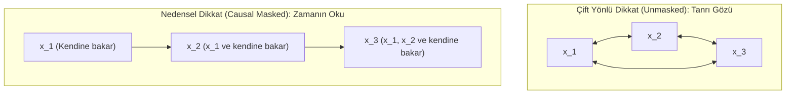

Mühendislik ekibi, 64 adet H100 GPU'dan oluşan büyük bir kümede sıfırdan bir dil modeli ön eğitimi (pre-training) başlatır. İlk iki saatin sonunda TensorBoard paneli âdeta bir mucize müjdeler: cross-entropy eğitim kaybı (training loss) 11,2 seviyesinden dik bir düşüşle 0,04'e çakılmış, doğrulama şaşkınlığı (validation perplexity) ise akıl almaz bir biçimde 1,02'ye oturmuştur. Salonda tebrikler havada uçuşur; koşunun rekor bir hızla insanüstü bir yakınsama yakaladığı düşünülür.

Ardından kontrol noktası (checkpoint) etkileşimli bir çıkarım (inference) uç noktasına yüklenir ve ilk komut verilir: `"Türkiye'nin başkenti"`.

Model cümleyi tamamlamak yerine kurtarılamaz bir kısır döngüye saplanır: `"Ankara Ankara Ankara Ankara Ankara..."`. Sıcaklık (temperature) artırılır, top-p örnekleme değiştirilir, tekrar cezaları uygulanır—hiçbiri fayda etmez. Model serbest metin üretmeye zorlandığında ise tamamen anlamsız karakter dizileri kusmaya başlar.

Yapılan kök neden analizi (post-mortem), 120.000 dolarlık GPU bütçesini çöpe atan acı gerçeği ortaya çıkarır: dikkat çekirdeğindeki (attention kernel) bir indis kayması (`off-by-one`) veya yanlış ayarlanmış bir boolean bayrağı yüzünden üst üçgen açık kalmıştır. Model eğitim sırasında bir sonraki token'a doğrudan erişebildiği için, dikkat projeksiyon ağırlıkları ($W_Q W_K^T$) önemsiz bir birim arama (identity lookup) kanalına çökmüştür. Model özbağlanımlı bir akıl yürütme ($P(x_t \mid x_{<t})$) öğrenmemiş; yalnızca girdideki bir sonraki token'ı doğrudan kopyalamayı ezberlemiştir. Çıkarım anına gelindiğinde—yani gelecekteki token'lar fiziksel olarak henüz var olmadığında—modelin iç durumu mutlak bir boşluğa düşmüş ve kod çözme döngüsü çıkışı olmayan bir yerel minimuma kilitlenmiştir.

Bu yazı, serimizin 5. adımı olarak transformer mimarisinin zamanın tek yönlü okunu nasıl dayattığını inceliyor: **Causal (Masked) Self-Attention** mekanizması, alt üçgensel matris geometrisi, $-\infty$ değerinin Softmax içinde gelecek token'ları matematiksel olarak nasıl yok ettiği, serimizin önceki bölümündeki somut üç kelimelik tensörler üzerinden adım adım sayısal hesabı, paralel eğitim ile çıkarım (inference) arasındaki donanımsal kırılma ve parçalı ön doldurma (chunked prefill) mimarisi, IEEE 754 float16/bfloat16 sayısal kararlılık tuzakları, FlashAttention çekirdeklerinin maske matrisini silikon üzerinde nasıl buharlaştırdığı ve **Llama 3, Gemma 2, Mistral, DeepSeek** gibi üretim modellerinin standart nedensel dikkatten nasıl farklılaştığı.

**Bu yazıda**

- [1. Zamanın oku ve özbağlanımlı üretim zorunluluğu](#1-zamanın-oku-ve-özbağlanımlı-üretim-zorunluluğu)
- [2. Sayfaları yapıştırılmış cinayet romanı: Temel sezgi](#2-sayfaları-yapıştırılmış-cinayet-romanı-temel-sezgi)
- [3. Alt üçgensel matris mekaniği: Geleceği maskelemek](#3-alt-üçgensel-matris-mekaniği-geleceği-maskelemek)
- [4. Maskelerin anatomisi: Causal, padding ve truncation farkı](#4-maskelerin-anatomisi-causal-padding-ve-truncation-farkı)
- [5. Yokluğun matematiği: Maske neden Softmax'ten ÖNCE uygulanmak zorundadır?](#5-yokluğun-matematiği-maske-neden-softmaxten-önce-uygulanmak-zorundadır)
- [6. Adım adım elle sayısal yürüyüş: Üç kelimenin nedensel matris hesabı](#6-adım-adım-elle-sayısal-yürüyüş-üç-kelimenin-nedensel-matris-hesabı)
- [7. İki mühendislik gözü: Eğitim, çıkarım ve chunked prefill](#7-iki-mühendislik-gözü-eğitim-çıkarım-ve-chunked-prefill)
- [8. Donanım ve sayısal kararlılık: IEEE 754, fp16 tuzakları ve FlashAttention varlen](#8-donanım-ve-sayısal-kararlılık-ieee-754-fp16-tuzakları-ve-flashattention-varlen)
- [9. PyTorch ile adım adım tam doğrulama](#9-pytorch-ile-adım-adım-tam-doğrulama)
- [10. Üretimdeki son gelişmeler: Güncel modeller nasıl farklılaşıyor? (Llama 3, Gemma 2, Mistral, DeepSeek)](#10-üretimdeki-son-gelişmeler-güncel-modeller-nasıl-farklılaşıyor-llama-3-gemma-2-mistral-deepseek)
- [Bütün hikâye altı satırda](#bütün-hikâye-altı-satırda)
- [Terimler sözlüğü](#terimler-sözlüğü)
- [Daha derine inmek için](#daha-derine-inmek-için)

---

## 1. Zamanın oku ve özbağlanımlı üretim zorunluluğu

Fiziksel evrende zaman tek yönlüdür: Termodinamiğin ikinci yasası entropinin arttığını, nedensellik ilkesi ise bir sonucun ancak kendisinden önce gelen bir nedene dayanabileceğini söyler. İnsan dili de bu zamansal asimetrinin (temporal asymmetry) doğrudan bir aynasıdır: Konuşma havada ardışık ses dalgaları olarak yayılır, yazı satır satır ilerler ve zihindeki akıl yürütme düşünce zincirleri hâlinde birbirine eklemlenir.

Sınıflandırma ve arama modelleri (BERT gibi çift yönlü kodlayıcılar) baştan sona tamamlanmış bir metni analiz ederken cümlenin tamamına aynı anda serbestçe ("tanrı gözüyle") bakabilir. Ancak açık uçlu yeni metin üreten özbağlanımlı (autoregressive) bir model için evren zamanın tek yönlü okuna teslim olmak zorundadır: **henüz söylenmemiş bir kelime, söylenmekte olan kelimeyi etkileyemez.**

### 1. Olasılıksal Temel: Özbağlanımlı Çarpım Zincir Kuralı

Doğal dilde metin üretimi, olasılık teorisinin en temel ve kesin kurallarından birine — **özbağlanımlı çarpım zincir kuralına (autoregressive chain rule)** — dayanır. $T$ adet ayrık token'dan oluşan bir $X = (x_1, x_2, \dots, x_T)$ dizisinin ortak olasılığı, koşullu olasılıkların çarpımı olarak eksiksiz ifade edilir:

$$P(x_1, x_2, \dots, x_T) = \prod_{t=1}^T P(x_t \mid x_1, x_2, \dots, x_{t-1}) = \prod_{t=1}^T P(x_t \mid x_{<t})$$

**Şöyle okuyun:**
- $P(x_1, \dots, x_T)$: Cümlenin tamamının bir arada var olma ortak olasılığı (joint probability).
- $\prod_{t=1}^T$: Birinci adımdan $T$. adıma kadar tüm adımların kümülatif olasılık çarpımı.
- $P(x_t \mid x_{<t})$: Kendisinden önceki tüm kelimeler ($x_1, \dots, x_{t-1}$) biliniyorken, $t$. sıradaki kelimenin ne olacağını belirleyen koşullu dağılım.

Bu denklemin derin iki teorik sonucu vardır:
1. **Sıfır Bağımsızlık Varsayımı:** Bu ifade bir yaklaşım ya da basitleştirme değildir; olasılık aksiyomlarının mutlak bir matematiksel özdeşliğidir. Hiçbir token'ın bir diğerinden bağımsız olduğu varsayılmaz.
2. **Fiziksel Kısıt:** Matematiksel olarak zincir kuralı herhangi bir permütasyonla da yazılabilir (örneğin $T$'den $1$'e doğru). Fakat insan dilinde nedenler sonuçları öncelediği için modelleme yalnızca ileriye doğru anlamlıdır: **$x_t$ token'ı tahmin edilirken, $x_{t+1}, \dots, x_T$ token'ları evrende henüz fiziksel olarak mevcut değildir.**



### 2. Geçmiş Temsillerin Değişmezliği ve KV Cache'in Doğuşu

Özbağlanımlı bir dil modelinin amaç fonksiyonu, her pozisyonda bir sonraki kelimeyi tahmin etmektir:

$$\mathcal{L} = -\sum_{t=1}^T \log P(x_t \mid x_{<t})$$

Bu hedefi gerçekleştirirken nedensel dikkat maskesi mimariye kritik bir matematiksel özellik kazandırır: **Geçmiş Temsillerin Değişmezliği (Invariance of Past Representations).**

Nedensel dikkat sayesinde, $i$. pozisyondaki gizli durum vektörü $h_i$, yalnızca ve yalnızca $x_1, \dots, x_i$ token'larının fonksiyonudur. Gelecekteki herhangi bir $x_j$ ($j > i$) için:

$$\frac{\partial h_i}{\partial x_j} = \mathbf{0.0} \quad \forall j > i$$

Bu formül şu olağanüstü mühendislik gerçeğini garanti eder: Sisteme 1.000. yeni kelime eklendiğinde, 1. kelimeden 999. kelimeye kadar hesaplanmış olan tüm aktivasyonlar, Key ve Value vektörleri **zamanda donmuştur; tek bir biti bile değişmez.**
- **KV Cache'in Varoluş Sebebi:** Eğer dikkat çift yönlü olsaydı, her yeni kelime üretildiğinde kendisinden önceki tüm kelimelerin vektör temsilleri geriye dönük olarak değişir ve önbellekleme imkânsız olurdu. Causal attention'ın sağladığı bu matematiksel değişmezlik sayesinde, her yeni kelime üretilirken tüm cümleyi baştan hesaplamayız. Önceki adımların Key ve Value tensörleri bellekte (KV Cache) saklanır; yeni adımda yalnızca tek bir Query vektörü ($Q \in \mathbb{R}^{1 \times d_k}$) hesaplanarak önbellekle çarpılır ve üretim adım başına $O(1)$ sürede tamamlanır.

### 3. Kestirme Çöküşü (Shortcut Collapse): Geleceğe Bakış Modeli Nasıl Zehirler?

*Neden bir dil modelini eğitirken geleceği maskelemek zorundayız? Eğer maskelemezsek ne olur?*

Eğer bir sonraki kelimeyi tahmin etmek üzere tasarlanan bir modele çift yönlü serbest dikkat (unmasked attention) verirseniz, $t$ anındaki Query arama feneri ($Q_t$), bir sonraki sütunda duran $t+1$ hedefinin Key rozetini ($K_{t+1}$) apaçık karşısında görür.

Gradyan inişi (gradient descent) doğası gereği en az dirençli yolu seçer: 96 katman boyunca gramer, dünya bilgisi, fizik veya mantıksal çıkarım öğrenmek yerine, projeksiyon matrislerini şu tek satırlık kestirmeye kilitler:

$$W_Q W_K^T \to \text{Shift-by-1 Identity Lookup}$$

Ağ, girdideki $t$ kelimesinden sonra gelen kelimeyi doğrudan bellek adresinden okuyup çıktı kafasına kopyalayan yüksek boyutlu bir "kısa devreye" dönüşür. Eğitim kaybı (training loss) dakikalar içinde $0$'a vurur, grafikler mükemmel görünür; fakat çıkarım anında gelecekteki token henüz mevcut olmadığından model mutlak bir felce uğrar.

| Mimari Özellik | Çift Yönlü Dikkat (Unmasked) | Nedensel Dikkat (Causal Masked) |
| :--- | :--- | :--- |
| **Dikkat Geometrisi** | Tam matris ($T \times T$ serbest etkileşim) | Alt üçgensel matris ($j > i$ için $-\infty$) |
| **Gelecek Görünürlüğü** | Tam açık (Gelecekteki tüm token'lar görünür) | **Tamamen kapalı** (Sonsuz karanlık kuyusu) |
| **Geçmiş Temsil Değişmezliği** | YOKTUR ($\partial h_i / \partial x_j \neq 0$) | **KESİNDİR** ($\partial h_i / \partial x_j = 0, \forall j > i$) |
| **KV Cache Uyumluluğu** | İmkânsız (Yeni token tüm geçmişi bozar) | **Yerel ve Doğal** ($O(1)$ adım başı üretim) |
| **Eğitim Hedefi** | Maskeli Dil Modellemesi / Anlama Görevleri | **Gelecek Token Tahmini (Next-Token Prediction)** |
| **Donanım İş Yükü** | Standart simetrik GEMM | Alt üçgensel GEMM / SRAM register maskelemesi |

---

## 2. Sayfaları yapıştırılmış cinayet romanı: Temel sezgi

Serimizin 4. bölümünde ([Self-Attention Derinlemesine](post.html?slug=self-attention-derinlemesine)) dikkat mekanizmasını somutlaştırmak için sınıfta yan yana oturan üç kelimeyi ve rollerini incelemiştik:
- **Arama Feneri (Query - $Q$):** *"Ben ne arıyorum?"*
- **İsim Rozeti (Key - $K$):** *"Ben kimim?"*
- **Bilgi Çantası (Value - $V$):** *"Sana hangi içeriği aktaracağım?"*

Standart self-attention katmanında herkes odadaki herkesin yakasına fener tutabiliyordu. Şimdi bu sınıfın bir **cinayet romanı kulübü** olduğunu hayal edin. Masada sırasıyla üç kelimemiz oturuyor: **"köpek"** ($t=0$), **"kediyi"** ($t=1$) ve **"kovaladı"** ($t=2$).

```text
[Kelime 0: 'köpek']    --> Romanın 1. sayfasında. Katilin kim olduğunu asla bilemez.
[Kelime 1: 'kediyi']   --> Romanın 50. sayfasında. 1. sayfayı hatırlar, sonrasını göremez.
[Kelime 2: 'kovaladı'] --> Romanın son sayfasında. Bütün hikâyeye hâkimdir.
```

Eğer "köpek" ($t=0$) kelimesinin fenerini ($Q_0$), romanın sonundaki "kovaladı" ($K_2$) kelimesinin rozetine tutmasına izin verirseniz, dedektif daha ipuçlarını toplamadan katilin adını öğrenir. Akıl yürütme çürür.

Bu felaketi önlemek için kural çok basittir: **Her öğrencinin sağ tarafına tek yönlü karartılmış bir cam yerleştirilir.** Öğrenci fenerini yalnızca kendi rozetine ve kendisinden önce oturanların rozetine tutabilir. Gelecekteki bir öğrencinin rozetine fener tuttuğu anda, o ışık hiçbir yere yansımaz; mutlak bir kara deliğe — matematikteki karşılığıyla **$-\infty$ kuyusuna** — düşer ve tamamen yutulur.

---

## 3. Alt üçgensel matris mekaniği: Geleceği maskelemek

Matematiksel olarak bu zamansal engeli nasıl inşa ederiz? 

Girdi dizimizin Query matrisi $Q \in \mathbb{R}^{T \times d_k}$ ile Key matrisi $K \in \mathbb{R}^{T \times d_k}$ çarpıldığında, her satırın bir sorgulayıcıyı (gözlemciyi), her sütunun ise sorgulanan bir rozeti temsil ettiği ham benzerlik matrisi $S \in \mathbb{R}^{T \times T}$ elde edilir:

$$S = \frac{QK^T}{\sqrt{d_k}}$$

Bu $T \times T$ ızgarada köşegenin üstünde kalan bölge ($j > i$), zaman koordinatlarında "geleceği" temsil eder:

```text
                  Sütun j (Sorgulanan Anahtarlar - Keys)
                   j = 0           j = 1           j = 2
Satır i    i = 0 [ S_00 (Bugün)    S_01 (GELECEK)  S_02 (GELECEK) ]
(Sorgu     i = 1 [ S_10 (Geçmiş)   S_11 (Bugün)    S_12 (GELECEK) ]
 Queries)  i = 2 [ S_20 (Geçmiş)   S_21 (Geçmiş)   S_22 (Bugün)   ]
```

Bu matrisi nedensel (causal) kılmak için üzerine bir **maske matrisi ($M$)** ekleriz. Maske kuralı bir alt üçgensel matris (lower triangular matrix) yapısındadır:

$$M_{ij} = \begin{cases} 0 & \text{eğer } j \le i \\ -\infty & \text{eğer } j > i \end{cases}$$

**Şöyle okuyun:**
- $M_{ij}$: $i$. satır ve $j$. sütundaki maske değeri.
- $j \le i$: Geçmişe veya kelimenin kendi anına denk gelen yasal pozisyonlar. $0$ değeri eklenir; çünkü logite $0$ eklemek skoru değiştirmez ($S_{ij} + 0 = S_{ij}$).
- $j > i$: Geleceğe işaret eden yasa dışı pozisyonlar. Buraya $-\infty$ eklenerek logit sonsuz karanlığa gömülür.

Üç kelimelik bir girdi için maske matrisi $M$ şu şekildedir:

```text
M = [
  [   0.0,   -inf,   -inf ],   <-- 0. kelime yalnızca 0. kelimeyi görür
  [   0.0,    0.0,   -inf ],   <-- 1. kelime 0 ve 1. kelimeleri görür
  [   0.0,    0.0,    0.0 ]    <-- 2. kelime 0, 1 ve 2. kelimeleri görür
]
```

---

## 4. Maskelerin anatomisi: Causal, padding ve truncation farkı

Sistem mimarisinde en sık yapılan kavram yanılgılarından biri, dizileri yöneten farklı maskeleme mekanizmalarını birbirine karıştırmaktır. Bir LLM boru hattında üç ayrı katmanda üç farklı kısıt çalışır:

| Mekanizma | Boyut | Amacı | Uygulandığı Yer |
| :--- | :--- | :--- | :--- |
| **Context Truncation** | $[B, L_{\max}]$ | Donanım sınırını aşan dizileri kesip atmak ($T \le L_{\max}$). | Veri ön işleme (Data Pipeline) |
| **Padding Mask** | $[B, 1, 1, T_{\text{key}}]$ | Farklı uzunluktaki cümleleri tek batch'te toplarken eklenen sentetik `[PAD]` token'larını yok saymak. | Dikkat katmanı (Batch hizalama) |
| **Causal Mask** | $[1, 1, T_{\text{query}}, T_{\text{key}}]$ | Özbağlanımlı üretim kuralını korumak; geleceğe bakışı engellemek. | Dikkat katmanı (Mimari zorunluluk) |

Modern transformer kütüphanelerinde (örneğin Hugging Face `transformers` veya PyTorch `F.scaled_dot_product_attention`) bu iki maske tensör toplama işlemiyle tek bir **4D Kaynaşık Maske (4D Fused Mask)** hâline getirilir:

$$M_{\text{fused}} = M^{\text{causal}} + M^{\text{pad}}$$

Eğer bir pozisyon geleceğe denk geliyorsa ($j > i$) **veya** bir padding dolgusuysa ($x_j = \text{PAD}$), o hücreye $-\infty$ basılır. Böylece dikkat mekanizması tek bir hamlede hem zamansal geometriyi korur hem de batch içindeki yapay boşlukları eler.

---

## 5. Yokluğun matematiği: Maske neden Softmax'ten ÖNCE uygulanmak zorundadır?

Şimdi en kritik mühendislik sorusuna geliyoruz: *Madem gelecekteki token'ları istemiyoruz, neden standart dikkat matrisini hesaplayıp Softmax'ten sonra üst üçgeni sıfırla çarpmıyoruz ($A \odot \text{Mask}$)? Neden $-\infty$ gibi uç bir sayıyı Softmax'in içine sokmak zorundayız?*

Cevap, Softmax fonksiyonunun normalize edici yapısında saklıdır.

Nedensel ölçeklenmiş nokta çarpım dikkatinin (causal scaled dot-product attention) formülü şöyledir:

$$\text{Attention}(Q, K, V) = \text{Softmax}\left(\frac{QK^T}{\sqrt{d_k}} + M\right)V$$

**Şöyle okuyun:**
- $\frac{QK^T}{\sqrt{d_k}}$: Ham dikkat skorları matrisi.
- $+ M$: Gelecek pozisyonlara $-\infty$ ekleyen nedensel maske.
- $\text{Softmax}(\cdot)$: Her satırı $0$ ile $1$ arasında değişen ve toplamı tam $1,0$ olan bir olasılık dağılımına dönüştüren işlem.
- $V$: Elde edilen dikkat yüzdeleriyle ağırlıklı ortalaması alınacak bilgi çantaları matrisi.

Softmax'e giren toplam skora $z_{ij} = \frac{q_i k_j^T}{\sqrt{d_k}} + M_{ij}$ diyelim. $i$. satırdaki $j$. token için dikkat ağırlığı $A_{ij}$ şöyle hesaplanır:

$$A_{ij} = \frac{e^{z_{ij}}}{\sum_{k=1}^T e^{z_{ik}}}$$

### Gelecek Pozisyonlar İçin ($j > i$):

Gelecekteki bir token için maske değeri $M_{ij} = -\infty$'dur. Dolayısıyla $z_{ij} \to -\infty$ olur. Doğal üstel fonksiyonun sınır değerini hatırlayalım:

$$\lim_{z \to -\infty} e^z = 0$$

Pay doğrudan sıfıra çöker:

$$\text{Pay} = e^{-\infty} = 0$$

Şimdi paydadaki normalizasyon toplamına bakalım:

$$\sum_{k=1}^T e^{z_{ik}} = \sum_{k=1}^i e^{\frac{q_i k_k^T}{\sqrt{d_k}} + 0} + \sum_{k=i+1}^T e^{-\infty} = \sum_{k=1}^i e^{\frac{q_i k_k^T}{\sqrt{d_k}}} + 0 = \sum_{k=1}^i e^{\frac{q_i k_k^T}{\sqrt{d_k}}}$$

Buradaki mucizeye dikkat edin: **Gelecekteki token'lar paydadan tamamen silinmiştir.** Paydadaki normalizasyon bütçesi yalnızca yasal geçmiş token'lar ($k \le i$) arasında paylaştırılır:

$$
A_{ij} = \begin{cases} 
\dfrac{e^{\frac{q_i k_j^T}{\sqrt{d_k}}}}{\sum_{k=1}^i e^{\frac{q_i k_k^T}{\sqrt{d_k}}}} & \text{eğer } j \le i \\
0 & \text{eğer } j > i 
\end{cases}
$$

Nihai bağlam vektörü $o_i$ hesaplanırken:

$$o_i = \sum_{j=1}^T A_{ij} v_j = \sum_{j=1}^i A_{ij} v_j + \sum_{j=i+1}^T (0 \cdot v_j) = \sum_{j=1}^i A_{ij} v_j$$

Geleceğe ait $v_{i+1}, \dots, v_T$ çantaları doğrudan $0$ ile çarpılır. Temsilin içine gelecekten tek bir bit sızamaz.

### Softmax Sonrası Sıfırlama Yanılgısı (Post-Softmax Fallacy)

Eğer maskeyi Softmax'ten *sonra* uygulasaydınız ($\tilde{A} = \text{Softmax}(S) \odot \text{Mask}$), sistem iki açıdan çökerdi:

1. **Olasılık Ölçüsünün Yıkımı:** Softmax başlangıçta tüm satırın toplamını $1,0$ yapacak şekilde çalışır. Üst üçgeni sonradan sıfırladığınızda, geriye kalan ağırlıkların toplamı $1,0$'ın altına düşer ($\sum_{j=1}^i \tilde{A}_{ij} < 1,0$). Her katmanda vektörün normu küçülür; derin ağlarda aktivasyonlar sönümlenir.
2. **Payda Zehirlenmesi (Denominator Contamination):** *"Sonradan tekrar normalize ederiz"* deseniz dahi matematik kurtulamaz. Çünkü ilk Softmax paydasında geleceğe ait $e^{S_{ik}}$ terimleri zaten yer almıştır. Eğer gelecekteki bir kelimenin ham skoru çok yüksekse, paydayı devasa oranda şişirir. Bu şişkin payda, geçmişteki meşru kelimelerin paylarını haksız yere ezer ve küçültür. **Gelecek, payda üzerinden geçmişin olasılık dağılımını çoktan bozmuş ve bilgi sızdırmış olur.**

---

## 6. Adım adım elle sayısal yürüyüş: Üç kelimenin nedensel matris hesabı

Kavramı kristalleştirmek için, serimizin 4. bölümünde ele aldığımız aynı tensörleri, aynı üç kelimeyi ve aynı ağırlık matrislerini kullanalım. Böylece nedensel maskenin aynı sayılar üzerinde neyi değiştirdiğini çıplak gözle göreceğiz.

Cümlemiz: **`["köpek", "kediyi", "kovaladı"]`** ($T = 3$). Boyutumuz $d_{\text{model}} = 4$, kafa boyutu $d_k = 4$.

Girdi matrisimiz $Z \in \mathbb{R}^{3 \times 4}$:

```text
Z = [
  [0.21, 0.82, 0.13, 0.44],  # köpek (t=0)
  [0.95, 0.16, 0.37, 0.28],  # kediyi (t=1)
  [0.19, 0.40, 1.01, 0.82]   # kovaladı (t=2)
]
```

Projeksiyon matrislerimiz $W_Q, W_K, W_V \in \mathbb{R}^{4 \times 4}$ ile çarpım sonucu elde edilen $Q, K, V$ vektörleri:

```text
Q = Z · W_Q:
  q_0 (köpek)    = [0.340, 1.260, 0.650, 0.950]
  q_1 (kediyi)   = [1.320, 0.440, 1.230, 0.530]
  q_2 (kovaladı) = [1.200, 1.220, 1.010, 1.410]

K = Z · W_K:
  k_0 (köpek)    = [0.650, 1.030, 0.950, 0.570]
  k_1 (kediyi)   = [1.230, 1.110, 0.530, 0.650]
  k_2 (kovaladı) = [1.010, 0.590, 1.410, 1.830]

V = Z · W_V:
  v_0 (köpek)    = [0.340, 0.950, 1.260, 0.650]
  v_1 (kediyi)   = [1.320, 0.530, 0.440, 1.230]
  v_2 (kovaladı) = [1.200, 1.410, 1.220, 1.010]
```

### 1. Adım: Ham Skorlar ve Ölçekleme

$S = Q K^T$ matris çarpımıyla ham iç çarpımları hesaplarız. Ardından $\sqrt{d_k} = \sqrt{4} = 2,0$ değerine böleriz:

```text
Ham Skorlar (S = Q K^T):
  [ 2.678,  2.779,  3.742 ]
  [ 2.782,  3.108,  4.297 ]
  [ 3.800,  4.282,  5.936 ]

Ölçeklenmiş Skorlar (S_scaled = S / 2.0):
  [ 1.339,  1.389,  1.871 ]
  [ 1.391,  1.554,  2.149 ]
  [ 1.900,  2.141,  2.968 ]
```

### 2. Adım: Causal Maske Ekleme ($S_{\text{scaled}} + M$)

Şimdi alt üçgen kuralımızı işleterek köşegenin üstündeki tüm hücrelere $-\infty$ ekliyoruz:

```text
Maskelenmiş Skorlar (S_masked = S_scaled + M):
  Satır 0: [ 1.339,    -inf,    -inf ]   <-- 0. kelime yalnızca kendine bakar
  Satır 1: [ 1.391,   1.554,    -inf ]   <-- 1. kelime 0 ve 1'e bakar
  Satır 2: [ 1.900,   2.141,   2.968 ]   <-- 2. kelime hepsine bakar
```

### 3. Adım: Satır Satır Softmax Hesabı

#### Satır 0 ("köpek", $t=0$):
Girdiler: `[1.339, -inf, -inf]`
- $e^{1.339} = 3.815$
- $e^{-\infty} = 0.0$
- $e^{-\infty} = 0.0$
- Toplam (Payda) = $3.815 + 0 + 0 = 3.815$
- $A_{00} = 3.815 / 3.815 = \mathbf{1.000}$
- $A_{01} = 0 / 3.815 = \mathbf{0.000}$
- $A_{02} = 0 / 3.815 = \mathbf{0.000}$

**Satır 0 Dikkat Dağılımı:** `[1.000, 0.000, 0.000]`

#### Satır 1 ("kediyi", $t=1$):
Girdiler: `[1.391, 1.554, -inf]`
- $e^{1.391} = 4.019$
- $e^{1.554} = 4.730$
- $e^{-\infty} = 0.0$
- Toplam (Payda) = $4.019 + 4.730 + 0 = 8.749$
- $A_{10} = 4.019 / 8.749 = \mathbf{0.459}$
- $A_{11} = 4.730 / 8.749 = \mathbf{0.541}$
- $A_{12} = 0 / 8.749 = \mathbf{0.000}$

**Satır 1 Dikkat Dağılımı:** `[0.459, 0.541, 0.000]`

#### Satır 2 ("kovaladı", $t=2$):
Girdiler: `[1.900, 2.141, 2.968]` (Gelecek olmadığı için maske eklenmedi)
- $e^{1.900} = 6.686$
- $e^{2.141} = 8.508$
- $e^{2.968} = 19.453$
- Toplam (Payda) = $6.686 + 8.508 + 19.453 = 34.647$
- $A_{20} = 6.686 / 34.647 = \mathbf{0.193}$
- $A_{21} = 8.508 / 34.647 = \mathbf{0.246}$
- $A_{22} = 19.453 / 34.647 = \mathbf{0.562}$

**Satır 2 Dikkat Dağılımı:** `[0.193, 0.246, 0.562]`

Nihai Causal Dikkat Matrisi $A$:

```text
A = [
  [ 1.000,  0.000,  0.000 ],
  [ 0.459,  0.541,  0.000 ],
  [ 0.193,  0.246,  0.562 ]
]
```

### 4. Adım: Değerlerin Harmanlanması (Çıktı Bağlam Vektörleri $O = A V$)

Her çıktı satırı, ilgili satırın dikkat ağırlıklarıyla $V$ satırlarının ağırlıklı toplamıdır:

```text
O_0 = 1.000 · v_0 + 0.000 · v_1 + 0.000 · v_2
    = [0.340, 0.950, 1.260, 0.650]

O_1 = 0.459 · v_0 + 0.541 · v_1 + 0.000 · v_2
    = 0.459 · [0.340, 0.950, 1.260, 0.650] + 0.541 · [1.320, 0.530, 0.440, 1.230]
    = [0.870, 0.723, 0.817, 0.964]

O_2 = 0.193 · v_0 + 0.246 · v_1 + 0.562 · v_2
    = [1.064, 1.105, 1.036, 0.995]
```

### Bölüm 4 (Çift Yönlü) ile Bölüm 5 (Nedensel) Karşılaştırması

Şimdi iki makaledeki dikkat ağırlıklarını yan yana koyalım:

| Token | Çift Yönlü Dikkat (Bölüm 4) | Nedensel Dikkat (Bölüm 5) | Mühendislik Yorumu |
| :--- | :--- | :--- | :--- |
| **köpek ($t=0$)** | `[0.266, 0.280, 0.454]` | `[1.000, 0.000, 0.000]` | Çift yönlüde henüz cümlede olmayan "kovaladı"ya %45,4 dikkat veriyordu! Nedenselde ise geleceğe %0, yalnızca kendine %100 odaklandı. |
| **kediyi ($t=1$)** | `[0.232, 0.273, 0.495]` | `[0.459, 0.541, 0.000]` | Gelecekteki eyleme giden %49,5'lik sızıntı sıfırlandı; dikkat geçmişteki fail ("köpek") ile kendi arasına dağıldı. |
| **kovaladı ($t=2$)** | `[0.193, 0.246, 0.561]` | `[0.193, 0.246, 0.562]` | Son kelime olduğu için önünde maskelenecek bir gelecek yoktu; iki hesaplama tıpatıp aynı sonuca ulaştı! |

---

## 7. İki mühendislik gözü: Eğitim, çıkarım ve chunked prefill

Nedensel dikkati (causal attention) eksiksiz kavramak, onun eğitim kümesindeki davranışıyla canlı üretim sunucusundaki donanım faturasını ayrı ayrı incelemeyi gerektirir. Bu iki ortam, taban tabana zıt donanım rejimlerinde çalışır.

```text
                    TRAINING                                  INFERENCE
   (Paralel / Teacher Forcing / GEMM)            (Prefill vs Decode / GEMV)
┌────────────────────────────────────────┐     ┌────────────────────────────────────────┐
│ Tüm dizi GPU'ya tek seferde verilir    │     │ 1. Prefill: Promptun tamamı işlenir    │
│ Causal maske T x T matrisi uygulanır   │     │    Causal maske prompta uygulanır      │
│ Backward: Maskeli gradyan dL/dS = 0    │     │ 2. Decode: Token-token üretim yapılır  │
│ İş Yükü: Compute-bound yoğun GEMM      │     │    Q: [1, d_k] -> KV Cache: [T, d_k]   │
│                                        │     │    GELECEK YOKTUR -> MASKE GEREKMEZ!   │
└────────────────────────────────────────┘     └────────────────────────────────────────┘
```

### 1. Eğitim Gözü: Teacher Forcing, Paralel GEMM ve Gradyan Yalıtımı

*   **Sıralı Paradoksun Çözümü:** Özbağlanımlı metin üretimi doğası gereği kesinlikle sıralıdır ($O(T)$ ardışık adım). Eğer model eğitimi adım adım koşturulsaydı, devasa GPU kümeleri neredeyse tamamen atıl kalırdı. **Teacher Forcing (Öğretmen Zorlaması)** yöntemi sayesinde, $T$ token'lık hedef dizinin tamamı modele aynı anda verilir. Nedensel maske, $t$. token'ın $t+1$. token'ı görmeden tahmin etmesini güvenceye alır. $T$ adet adımın tamamı **tek bir compute-bound GEMM (General Matrix Multiply)** matris çarpımıyla koşulur ve Tensor Çekirdeği (Tensor Core) verimi %90'ın üzerine çıkar.
*   **Geriye Yayılımda (Backward Pass) Gradyan Davranışı:** Kayıp fonksiyonunun ($\mathcal{L}$) Softmax öncesi ham dikkat skoruna ($S_{ij}$) göre türevi Softmax Jacobian matrisi üzerinden akar:

$$\frac{\partial \mathcal{L}}{\partial S_{ij}} = \sum_{k=1}^T \frac{\partial \mathcal{L}}{\partial A_{ik}} \frac{\partial A_{ik}}{\partial S_{ij}} = A_{ij} \left( \frac{\partial \mathcal{L}}{\partial A_{ij}} - \sum_{k=1}^T \frac{\partial \mathcal{L}}{\partial A_{ik}} A_{ik} \right)$$

Yasaklı gelecek pozisyonları ($j > i$) için ileri geçişte (forward pass) $A_{ij} \equiv 0$ olduğu kanıtlanmıştı. Bu sıfır değeri denkleme yerleştirildiğinde:

$$\frac{\partial \mathcal{L}}{\partial S_{ij}} = 0 \cdot \left( \dots \right) = \mathbf{0.0} \quad \forall j > i$$

Üst üçgene doğru geriye akan gradyan **kesinlikle ve özdeş olarak sıfırdır**. Geriye yayılım sırasında gelecekteki token'lardan geçmişin temsillerine tek bir bitlik bile gradyan sinyali sızamaz.
*   **Bellek Faturası:** Geriye yayılımda türev alabilmek için ara dikkat matrislerinin aktivasyon belleğinde (activation memory) saklanması gerekir. $128\text{k}$ bağlam uzunluğunda bu skorları onlarca katman ve kafa boyunca saklamak yüzlerce gigabaytı aşar; bu da aktivasyon kontrol noktası (activation checkpointing) veya FlashAttention ile anında yeniden hesaplama (recomputation) zorunluluğu doğurur.

### 2. Çıkarım Gözü: Prefill ile Decode Arasındaki Keskin Kırılma

Çıkarım (inference) mimarisi iki tamamen farklı donanım çalışma moduna ayrılır:

| Aşama | Girdi Tensör Boyutları | Birincil Çekirdek (Kernel) | Donanım Rejimi | Nedensel Maske Durumu |
| :--- | :--- | :--- | :--- | :--- |
| **Prefill** (Ön Doldurma) | $Q, K, V \in \mathbb{R}^{T_p \times d_k}$ | GEMM ($T_p \times T_p$) | Compute-bound (FLOPS) | **ZORUNLU** (Alt Üçgensel) |
| **Decode** (Kod Çözme) | $Q \in \mathbb{R}^{1 \times d_k}, K, V \in \mathbb{R}^{T_{\text{past}} \times d_k}$ | GEMV ($1 \times T_{\text{past}}$) | Memory-bandwidth-bound (GB/s) | **FİZİKSEL OLARAK YOK / GEREKSİZ** |

*   **Decode Sırasında Nedensel Maske Neden Buharlaşır?** Token-token üretim döngüsünde Query tensörü tek bir vektördür ($Q \in \mathbb{R}^{1 \times d_k}$). KV Cache ise yalnızca geçmiş $0 \dots t-1$ arasındaki token'ların anahtar ve değerlerini içerir. **Gelecekteki token'lar fiziksel olarak bellekte mevcut bile değildir.** KV Cache içinde geleceğe ait anahtarlar bulunmadığından, maskelenecek bir üst üçgen de yoktur. Yapılan işlem, tek bir sorgu vektörünün geçmiş önbellekle olan saf nokta çarpımından ibarettir: $q_t K_{\le t}^T / \sqrt{d_k}$. Nedensel maske yalnızca çoklu token içeren prefill ve eğitim aşamalarına özgüdür.
*   **Aritmetik Yoğunluk Çöküşü (Arithmetic Intensity Collapse):** Prefill aşamasında aritmetik yoğunluk yüksektir ($\sim T_p$ FLOPS/bayt). Decode aşamasında ise tek bir yeni token üretebilmek için devasa gigabaytlarca KV cache verisinin HBM'den SRAM'e taşınması ve tek bir vektör-matris çarpımı (GEMV) yapılması gerekir. Aritmetik yoğunluk dramatik bir çöküşle $\sim 1$ FLOP/bayt seviyesine iner. GPU'nun devasa Tensor Çekirdekleri aç kalır; darboğaz tamamen HBM bellek veri yolu bant genişliğidir.

### 3. Üretim Sunucusu Optimizasyonu: Parçalı Ön Doldurma (Chunked Prefill)

Canlı üretim ortamında (vLLM, SGLang, TensorRT-LLM) dil modelleri tek bir kullanıcıya değil, eşzamanlı yüzlerce kullanıcıya hizmet verir. İşte bu çok kullanıcılı (multi-tenant) ortamda nedensel dikkat mekanizması, sunucu mühendisliğinin en büyük krizlerinden biriyle karşılaşır: **Prefill ile Decode arasındaki donanımsal savaş.**

**Kriz: Ön Sıra Tıkanması (Head-of-Line Blocking) ve Prefill Balonu**

Bir LLM sunucusunda çalışan iki işlem türünü hatırlayalım:
1. **Decode İstekleri:** Model hâlihazırda 64 kullanıcıya kelime kelime yanıt üretmektedir. Her adımda tek bir token üretilir, işlem hafıza bant genişliğine kilitlidir (memory-bound) ve token başına üretim süresi (TPOT) yaklaşık **15–25 milisaniyedir**. Kullanıcı ekranda akıcı, harf harf dökülen bir metin görür.
2. **Yeni Gelen Prefill İsteği:** Tam bu esnada 65. bir kullanıcı sisteme 32.768 token'lık (yaklaşık 70 sayfalık) devasa bir PDF dokümanı ve bir soru yollar.

Geleneksel servis motorlarında zamanlayıcı (scheduler) bu devasa prompt'u tek bir blok hâlinde ön doldurmaya (prefill) alır. Bu devasa GEMM matris çarpımı, GPU'nun Tensor Çekirdeklerini %100 doyumla kilitler ve **800 ile 1.500 milisaniye (1,5 saniye!)** boyunca GPU'da başka hiçbir işlemin çalışmasına izin vermez.

**Sonuç bir felakettir:**
- Devam eden 64 kullanıcının ekranındaki metin akışı 1,5 saniye boyunca tamamen donar (hitching).
- TPOT gecikmesi 20 ms'den 1.500 ms'ye fırlayarak **75 katlık bir gecikme dalgalanması (jitter)** yaratır.
- Bu donanımsal tıkanıklığa literatürde **Ön Sıra Tıkanması (Head-of-Line Blocking)** veya **Prefill Balonu (Prefill Bubble)** denir.

**Çözüm: Sarathi-Serve ve vLLM'in Parçalı Ön Doldurma Mimarisi**

Bu krizi çözmek için Sarathi-Serve (Agrawal et al., OSDI 2024) tarafından geliştirilen ve günümüzde vLLM V1 ile modern motorlarda endüstri standardı olan **Parçalı Ön Doldurma (Chunked Prefill)** tekniği uygulanır.

Fikir şudur: 32k'lık dev prompt'u tek bir devasa lokmada yutmak yerine, zamanlayıcı sabit bir token bütçesi (örneğin $C = 2048$ token'lık parçalar) belirler.

Her ileri geçiş adımında zamanlayıcı karma bir batch (piggybacking batch) oluşturur:
- 64 adet devam eden decode isteği (64 token).
- 32k'lık promptun yalnızca **2.048 token'lık tek bir parçası** (Chunk $k$).
- Toplam batch boyutu: $2048 + 64 = 2112$ token.

Böylece her adım yalnızca **~25–35 milisaniyede** tamamlanır! 64 kullanıcının ekranındaki metin akışı tek bir milisaniye bile takılmadan akmaya devam ederken, dev doküman da adım adım parçalar hâlinde KV önbelleğine sindirilir.

**Matris Mekaniği: Hibrit Çapraz ve Nedensel Maske (Hybrid Mask)**

Peki bu parçalama sırasında nedensel dikkat maskesi nasıl çalışır? Matematiksel nedenselliğin bozulmaması için maske geometrisi nasıl ayarlanır?

Diyelim ki 8 token'lık bir prompt'umuz var ve parçalama bütçemiz $C = 4$ token:
- **1. İterasyon:** 1. Parça ($T_{0 \dots 3}$) işlenir, alt üçgensel nedensel maske uygulanır ve üretilen $K_0 \dots K_3$ ile $V_0 \dots V_3$ vektörleri **KV Cache** belleğine yazılır.
- **2. İterasyon:** Sıra 2. Parçaya ($T_{4 \dots 7}$) gelir. Bu parçadaki sorguların ($Q_4 \dots Q_7$), hem bellekteki 1. Parçayla hem de kendi içindeki token'larla etkileşime girmesi gerekir.

İşte tam bu noktada **Hibrit Dikkat Maskesi (Hybrid Attention Mask)** devreye girer:

```text
2. Parça (Sorgular: q_4..q_7) için Hibrit Dikkat Maskesi Matrisi:

                 1. Parça (KV Cache'te Kayıtlı)     2. Parça (Aktif Sorgu Parçası)
                     k_0   k_1   k_2   k_3             k_4   k_5   k_6   k_7
     q_4 (Parça 2) [  0.0   0.0   0.0   0.0 ]       [  0.0  -inf  -inf  -inf ]  <-- 1. Parçanın tamamını görür
     q_5 (Parça 2) [  0.0   0.0   0.0   0.0 ]       [  0.0   0.0  -inf  -inf ]  <-- Parça 2 içinde nedenseldir
     q_6 (Parça 2) [  0.0   0.0   0.0   0.0 ]       [  0.0   0.0   0.0  -inf ]
     q_7 (Parça 2) [  0.0   0.0   0.0   0.0 ]       [  0.0   0.0   0.0   0.0 ]
                   └────────────────────────┘       └──────────────────────────┘
                     TAM ÇAPRAZ DİKKAT               ALT ÜÇGENSEL NEDENSEL DİKKAT
                   (Dikdörtgen: C x T_past)              (Kare: C x C)
```

**Maskenin İki Bölgesinin Çalışma Prensibi:**
1. **Sol Blok (Parçalar Arası Çapraz Dikkat - Rectangular Full Attention):** $q_4, q_5, q_6, q_7$ sorgularının tamamı, kendilerinden önce üretilmiş ve KV Cache'te saklanan $k_0, k_1, k_2, k_3$ anahtarlarının tamamına erişebilir. Burada hiçbir maskeleme yoktur; matrisin bu $[C \times T_{\text{past}}]$ boyutundaki dikdörtgen bölgesi tamamen **$0.0$** ile doludur.
2. **Sağ Blok (Parça İçi Nedensel Dikkat - Square Causal Attention):** 2. Parçanın kendi içindeki token'lar ($q_4 \dots q_7$), birbirleri arasındaki zamansal sırayı korumak zorundadır. $q_4$ henüz üretilmemiş $k_5, k_6, k_7$ token'larını göremez. Bu yüzden bu $[C \times C]$ boyutundaki kare bölgeye standart **alt üçgensel $-\infty$ nedensel maskesi** uygulanır.

**Donanımdaki İcra: FlashAttention ve PagedAttention Entegrasyonu**

Modern servis motorlarında (örneğin vLLM ve FlashInfer) bu işlem fiziksel olarak RAM'de devasa bir maske matrisi oluşturularak yapılmaz:
- Geçmiş parçalar GPU'nun HBM belleğinde sayfalara ayrılmış dağınık bloklarda (**PagedAttention**) saklanır.
- FlashAttention çekirdeğine aktif parçanın Query tensörü ($Q \in \mathbb{R}^{C \times d_k}$) ve KV Cache göstericileri (pointers) verilir.
- CUDA çekirdeği yazmaç (register) seviyesinde şu kuralı işletir: Eğer taranan anahtar geçmiş sayfalardaysa (sol blok), nedensellik kontrolü yapmadan doğrudan akümülatöre ekler; eğer anahtar aktif parçanın içindeyse (sağ blok), yalnızca `col <= row` şartını sağlayan hücreleri işler.

Böylece matematiksel nedensellik tek bir bit bile feda edilmeden korunur, GPU'nun Tensor Çekirdekleri yüksek verimle beslenir ve yüzlerce eşzamanlı kullanıcının akıcı çıkarım deneyimi güvence altına alınır.

---

## 8. Donanım ve sayısal kararlılık: IEEE 754, fp16 tuzakları ve FlashAttention varlen

Teorik yapay zekâda $-\infty$ soyut bir kavramdır; ancak silikon yongalar üzerinde (NVIDIA H100, AMD MI300X veya TPU v5e) her sayı IEEE 754 kayan nokta standardına uymak zorundadır.

### fp16 vs bf16: Sayısal Çöküş Tuzağı

Mixed-precision (yarı duyarlılık) eğitiminde en yaygın hata, sabit bir maske katsayısı kullanmaktır:

```text
IEEE 754 Kayan Nokta Formatları:
• Float32:  Maks finite ≈ 3.40e+38  | Dinamik aralık geniş
• Bfloat16: Maks finite ≈ 3.39e+38  | Üstel biti Float32 ile aynı (8 bit)
• Float16:  Maks finite = 65.504    | Min finite = -65.504 (Yalnızca 5 bit üstel!)
```

*   **`-1e9` Taşma Felaketi:** Kod tabanında legacy olarak kalmış `-1e9` veya `-1e4` gibi sabitler `torch.float16` tensörüne eklendiğinde, `-1e9` değeri fp16'nın minimum sınırı olan $-65.504$'ü anında aşar ve donanım seviyesinde taşarak doğrudan `-inf`'e dönüşür. 
*   **Tersine Taşma (Arithmetic Underflow):** Eğer $S_{ij}$ skoru pozitif ve büyükse (örneğin $+30,0$), buna `torch.finfo(torch.float16).min` ($-65.504$) eklendiğinde sonuç $-65.474$ olur. Bu değer $e^{-65.474}$ ile sıfıra inse de, geriye yayılım sırasında gradyan hesaplanırken beklenmedik `NaN` (Not a Number) patlamalarına yol açabilir.
*   **Tamamen Maskelenmiş Satır (All-Masked Row) Faciası:** Dizi paketleme (sequence packing) veya hatalı batch padding yapıldığında, bazen bir satırın tamamı $-\infty$ ile dolar. Bu durumda Softmax paydası:

$$\sum_{k=1}^T e^{-\infty} = 0 \implies \frac{0}{0} = \mathbf{NaN}$$

Tek bir satırdaki bu `NaN`, bir sonraki LayerNorm veya RMSNorm katmanında tüm tensöre yayılır ve tüm checkpoint'i saniyeler içinde zehirler.

**Endüstri Standardı Çözüm:** Softmax işlemi öncesinde logitleri `torch.float32` türüne yükseltmek (upcast) ve maske değerini doğrudan tensörün veri tipinden dinamik türetmektir:

```python
def stable_causal_softmax(logits: torch.Tensor, mask: torch.Tensor) -> torch.Tensor:
    orig_dtype = logits.dtype
    # Maskeyi ve logitleri fp32'ye yükselt
    logits_fp32 = logits.to(torch.float32)
    masked_logits = logits_fp32 + mask.to(torch.float32)
    # Softmax'i fp32'de hesapla, orijinal tipe geri dön
    attn_weights = torch.softmax(masked_logits, dim=-1).to(orig_dtype)
    return attn_weights
```

### Donanım Devrimi: FlashAttention Varlen ve cu_seqlens

Klasik dikkat mekanizmasında $128\text{k}$ bağlam uzunluğunda bir model çalıştırdığınızda, $128.000 \times 128.000$ boyutundaki maske ve dikkat matrisini GPU'nun ana belleğinde (HBM) oluşturmak tam bir intihardır:

$$\text{Bellek Faturası} = 128.000 \times 128.000 \times 2 \text{ bayt (FP16)} \approx \mathbf{32{,}76 \text{ GB (Kafa Başına!)}}$$

**FlashAttention (Dao et al., 2022/2023)** mimarisi bu sorunu kökünden çözdü: **HBM belleğinde $T \times T$ boyutunda bir maske matrisi asla oluşturulmaz.** 

Modern dağıtık eğitimde (Megatron-LM, Torchtitan), diziler dolgusuz olarak `flash_attn_varlen_func` ile paketlenir. Kümülatif dizi uzunlukları (`cu_seqlens`) belge sınırlarını çizer ve CUDA warp çekirdeği seviyesinde alt üçgen kuralı doğrudan denetlenir:

```python
from flash_attn.flash_attn_interface import flash_attn_varlen_func

# Dolgusuz paketlenmiş tensör: [toplam_token, kafa_sayisi, kafa_boyutu]
# cu_seqlens belge sınırlarını tanımlar: örn. [0, 1024, 3072, 8192]
output = flash_attn_varlen_func(
    q=q_unpadded,
    k=k_unpadded,
    v=v_unpadded,
    cu_seqlens_q=cu_seqlens,
    cu_seqlens_k=cu_seqlens,
    max_seqlen_q=max_len,
    max_seqlen_k=max_len,
    causal=True  # SRAM üzerinde blok-köşegen nedensel dikkat sağlar!
)
```

CUDA çekirdeği içinde nedensellik kontrolü donanım yazmacında (register) koşulur:

```c
// FlashAttention CUDA çekirdeğindeki kavramsal kontrol
int row = blockIdx.y * blockDim.y + threadIdx.y;
int col = blockIdx.x * blockDim.x + threadIdx.x;

// Nedensellik kısıtı doğrudan donanım yazmacında (register) denetlenir:
if (is_causal && col > row) {
    // HBM'den hiçbir şey okuma, softmax akümülatörüne 0 ekle ve çık!
    return;
}
```

Böylece $O(T^2)$ bellek bant genişliği maliyeti tamamen buharlaşır; $-\infty$ matrisi silikon üzerinde saf bir mantıksal atlama komutuna dönüşür.

---

## 9. PyTorch ile adım adım tam doğrulama

5. Bölümde elle hesapladığımız matrisleri, ölçeklenmiş skorları, $-\infty$ maskesini, dikkat ağırlıklarını ve çıktı bağlam vektörlerini birebir doğrulayan tam çalıştırılabilir PyTorch kodu:

```python
import math
import torch

# Ondalık gösterim ayarı
torch.set_printoptions(precision=3, sci_mode=False)

# 1. Girdi matrisi Z (3 token, d_model = 4)
Z = torch.tensor([
    [0.21, 0.82, 0.13, 0.44],  # köpek (t=0)
    [0.95, 0.16, 0.37, 0.28],  # kediyi (t=1)
    [0.19, 0.40, 1.01, 0.82]   # kovaladı (t=2)
], dtype=torch.float32)

# 2. Projeksiyon ağırlıkları (4 x 4)
W_Q = torch.tensor([
    [1., 0., 1., 0.],
    [0., 1., 0., 1.],
    [1., 0., 0., 1.],
    [0., 1., 1., 0.]
])

W_K = torch.tensor([
    [1., 1., 0., 0.],
    [0., 1., 1., 0.],
    [0., 0., 1., 1.],
    [1., 0., 0., 1.]
])

W_V = torch.tensor([
    [1., 0., 0., 1.],
    [0., 1., 1., 0.],
    [1., 1., 0., 0.],
    [0., 0., 1., 1.]
])

# 3. Q, K, V projeksiyonları
Q = Z @ W_Q
K = Z @ W_K
V = Z @ W_V

# 4. Ham ve ölçeklenmiş dikkat skorları
d_k = K.shape[-1]
S = Q @ K.T
S_scaled = S / math.sqrt(d_k)

# 5. Alt üçgensel Causal Maske inşası
seq_len = Z.shape[0]
causal_bool = torch.tril(torch.ones((seq_len, seq_len), dtype=torch.bool))
M = torch.zeros((seq_len, seq_len)).masked_fill(~causal_bool, float("-inf"))

# 6. Maskeli Logitler ve Softmax
S_masked = S_scaled + M
A = torch.softmax(S_masked, dim=-1)

# 7. Çıktı Bağlam Vektörleri (O = A · V)
O = A @ V

print("Ham Skorlar (S):\n", S)
print("\nÖlçeklenmiş Skorlar (S / 2):\n", S_scaled)
print("\nMaskelenmiş Skorlar (S_masked):\n", S_masked)
print("\nCausal Dikkat Ağırlıkları (A):\n", A)
print("\nÇıktı Bağlam Vektörleri (O):\n", O)
```

Konsol çıktısı:

```text
Ham Skorlar (S):
 tensor([[2.678, 2.779, 3.742],
        [2.782, 3.108, 4.297],
        [3.800, 4.282, 5.936]])

Ölçeklenmiş Skorlar (S / 2):
 tensor([[1.339, 1.389, 1.871],
        [1.391, 1.554, 2.149],
        [1.900, 2.141, 2.968]])

Maskelenmiş Skorlar (S_masked):
 tensor([[ 1.339,   -inf,   -inf],
        [ 1.391,  1.554,   -inf],
        [ 1.900,  2.141,  2.968]])

Causal Dikkat Ağırlıkları (A):
 tensor([[1.000, 0.000, 0.000],
        [0.459, 0.541, 0.000],
        [0.193, 0.246, 0.562]])

Çıktı Bağlam Vektörleri (O):
 tensor([[0.340, 0.950, 1.260, 0.650],
        [0.870, 0.723, 0.817, 0.964],
        [1.064, 1.105, 1.036, 0.995]])
```

Elle adım adım hesapladığımız her bir ondalık basamak, PyTorch tensör çıktısıyla bit düzeyinde örtüşmektedir.

---

## 10. Üretimdeki son gelişmeler: Güncel modeller nasıl farklılaşıyor? (Llama 3, Gemma 2, Mistral, DeepSeek)

Temel mekanizmaları ve matematiği kavradıktan sonra, güncel üretim modellerinin (2024–2026) fiziksel donanım kısıtlarını aşmak için standart nedensel maskeyi nasıl özelleştirdiğine bakalım:

```text
Llama 3'te Dizi Paketleme: Belge 1 (Token 0, 1) ve Belge 2 (Token 2, 3)

                     Belge 1 (Keys)         Belge 2 (Keys)
                       k_0     k_1            k_2     k_3
Belge 1 (Q)  q_0 [     0.0,   -inf ]     [   -inf,   -inf ]   <-- Belge 1, Belge 2'yi göremez
             q_1 [     0.0,    0.0 ]     [   -inf,   -inf ]
-----------------------------------------------------------
Belge 2 (Q)  q_2 [    -inf,   -inf ]     [    0.0,   -inf ]   <-- Belge 2, BELGE 1'İ GÖREMEZ!
             q_3 [    -inf,   -inf ]     [    0.0,    0.0 ]       (Belgeler arası yalıtım tam)
```

1. **Meta Llama 3 (Belge Seviyesinde Maskeleme):** "The Llama 3 Herd of Models" (Meta AI, 2024, arXiv:2407.21783) raporunda açıklandığı üzere, kısa belgeler tek bir 128k tensörde paketlendiğinde belgeler arası dikkat sızıntısını önlemek için **blok-köşegen nedensel maske (document mask)** kullanılır. Her belge kendi içinde nedenseldir; belgeler arası dikkat $-\infty$ ile kesilir.
2. **Google Gemma 2 & Gemma 3 (Almaşıklı SWA):** Resmi model konfigürasyonlarında (`sliding_window: 4096`), katmanlar çift ve tek olarak ayrılır: çift katmanlar $W = 4096$ boyutunda **kayan pencere nedensel maskesi (SWA)**, tek katmanlar ise 8.192'lik tam küresel nedensel dikkat çalıştırır. Böylece KV cache bellek faturası yarıya inerken küresel bağlam korunur.
3. **Mistral 7B & Mixtral 8x7B (SWA ve Dönen Halka Önbellek):** Sabit $W = 4096$ kayan pencere maskesiyle çalışır (arXiv:2310.06825). Çıkarımda yeni üretilen her token KV cache'te $t \pmod W$ hücresine yazılarak bellek tüketimi dizi uzunluğundan bağımsız $O(W)$ ile sabitlenir.
4. **DeepSeek V2 / V3 / R1 (MLA ve MTP Zincirleri):** Key ve Value vektörlerini $c_t$ gizil uzayına sıkıştıran Multi-Head Latent Attention (MLA) mimarisiyle nedensel zinciri korur (DeepSeek-V3 Technical Report, 2024); Multi-Token Prediction (MTP) katmanlarında ise ardışık gelecek token tahminlerini sıralı bir nedensel zincirle üretir.

---

## Bütün hikâye altı satırda

- Causal attention, her token'ın yalnızca geçmişe ve kendine bakmasını şart koşarak dil modelinin eğitim sırasında geleceği kopyalamasını engelleyen zamansal emniyet sübabıdır.
- Zamansal kısıt, $T \times T$ dikkat ızgarasında köşegenin üzerindeki geleceğe ait pozisyonlara ($j > i$) $-\infty$ ekleyen bir alt üçgensel matrisle ($L$) kurulur.
- Maskenin Softmax'ten önce uygulanması zorunludur; çünkü $e^{-\infty} = 0$ dönüşümü, gelecek token'ların normalizasyon paydasında ağırlık çalmasını ve geçmişin dağılımını bozmasını engeller.
- Eğitim sırasında "teacher forcing" sayesinde tüm cümle tek bir paralel GEMM operasyonuyla işlenirken, geriye yayılımda geleceğe akan gradyan tam sıfırdır.
- Çıkarımda (inference) nedensel maske yalnızca prompt'un işlendiği prefill aşamasında gereklidir; token-token üretim yapılan decode aşamasında gelecek zaten var olmadığı için maske matrisi hesaplanmaz.
- Güncel üretim modelleri bu yapıyı pratik gereksinimlerle zenginleştirir: Llama 3 blok-köşegen belge maskesi, Gemma 2 ve Mistral kayan pencere (SWA) varyantları, FlashAttention ise `cu_seqlens` ile donanım seviyesinde bloklama kullanır.

---

## Terimler sözlüğü

- **Autoregressive Generation (Özbağlanımlı Üretim)** — her yeni çıktının kendisinden önce üretilmiş tüm çıktıların geçmişine koşullanarak adım adım üretildiği olasılıksal modelleme biçimi.
- **Teacher Forcing (Öğretmen Zorlaması)** — modelin kendi hatalı tahminleri yerine gerçek hedef token dizisi üzerinden tek seferde paralel olarak eğitilmesini sağlayan yöntem.
- **Document Masking (Belge Maskeleme)** — tek bir tensöre paketlenmiş bağımsız belgeler arasında dikkat sızıntısını önleyen blok-köşegen nedensel maskeleme stratejisi.
- **Sliding Window Attention (Kayan Pencere Dikkati)** — her token'ın dikkatini sabit bir yerel pencereyle ($W$) sınırlayarak çıkarımda dönen önbellekle bellek tüketimini sabitleyen mimari.
- **Chunked Prefill (Parçalı Ön Doldurma)** — uzun prompt ön doldurma adımlarını parçalara bölerek Tensor Core verimini koruyan ve decode gecikmesini önleyen sunucu optimizasyonu.
- **Multi-Head Latent Attention (MLA)** — DeepSeek tarafından geliştirilen ve Key/Value değerlerini dar bir gizil vektöre sıkıştırarak çıkarım belleğini rahatlatan ileri seviye dikkat tasarımı.
- **FlashAttention Varlen** — dolgusuz paketlenmiş değişken uzunluktaki dizileri kümülatif indislerle (`cu_seqlens`) GPU SRAM önbelleğinde işleyen donanım çekirdeği.

---

## Daha derine inmek için

- Vaswani et al., [Attention Is All You Need](https://arxiv.org/abs/1706.03762) (2017) — Transformer mimarisinin ve masked multi-head attention mekanizmasının doğduğu seminal makale.
- Meta AI, [The Llama 3 Herd of Models](https://arxiv.org/abs/2407.21783) (2024) — 128k bağlam eğitimi ve belge seviyesinde nedensel maskeleme (document mask) detayları.
- Jiang et al., [Mistral 7B](https://arxiv.org/abs/2310.06825) (2023) — Sliding Window Attention (SWA) ve dönen halka önbellek (rolling buffer cache) mimarisi.
- DeepSeek-AI, [DeepSeek-V3 Technical Report](https://arxiv.org/abs/2412.19437) (2024) — Multi-Head Latent Attention ve Multi-Token Prediction nedensel zinciri.
- Agrawal et al., [Taming Throughput-Latency Tradeoff in LLM Inference with Sarathi-Serve](https://arxiv.org/abs/2403.02310) (OSDI 2024) — Parçalı ön doldurma (chunked prefill) algoritması.
- Dao et al., [FlashAttention: Fast and Memory-Efficient Exact Attention with IO-Awareness](https://arxiv.org/abs/2205.14135) (NeurIPS 2022) — $O(T^2)$ bellek darboğazını ve açık maske matrisi tahsisini ortadan kaldıran GPU çekirdeği.
- Bu blogda serinin diğer adımları: [Bir Prompt'un Yolculuğu (1): Tokenizasyon](post.html?slug=tokenizasyon-nasil-calisir) — metinden tamsayılara BPE mekaniği —, [Bir Prompt'un Yolculuğu (2): Embedding Katmanı](post.html?slug=embedding-katmani-derinlemesine) — sürekli geometri, lookup tablosu ve RoPE —, [Bir Prompt'un Yolculuğu (3): Anlamsal Embedding'ler](post.html?slug=embeddingler-derinlemesine) — anlamın koordinatları ve arama uzayı —, [Bir Prompt'un Yolculuğu (4): Self-Attention](post.html?slug=self-attention-derinlemesine) — Query, Key, Value mantığı ve adım adım matris matematiği — ve [Bir Prompt'un Yolculuğu (6): Multi-Head Attention](post.html?slug=multi-head-attention-derinlemesine) — alt uzaylar, simetri kırılması ve kafa budama.
