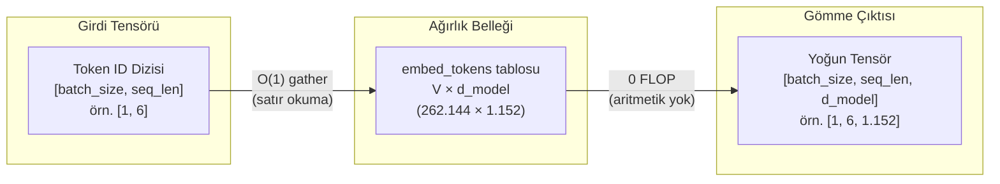

Bir dil modeline bir cümle verdiğinizde, tokenizer metni parçalar ve
her birine bir tamsayı damgası vurur: `[1054, 492, 281]`. Ancak bir
transformer tamsayılarla düşünemez; sinir ağlarının anlayabildiği tek
dil, sürekli vektör uzayları ve matris çarpımlarıdır. İşte **gömme katmanı
(embedding layer)** tam bu sınır çizgisinde durur: ayrık token numaralarını,
modelin üzerinde işlem yapabileceği zengin geometrik koordinatlara
dönüştüren ilk çevirmendir.

İlk bakışta bu katman şaşırtıcı derecede yalındır: prompt içeri girerken
tek bir çarpma bile yapmaz, yalnızca bellekten satır okur (sıfır FLOP).
Ancak bir transformer'ın en büyük ağırlık bloklarından biridir — kimi
modellerde toplam parametrelerin üçte birini tek başına tutar. Üstelik
sadece anlamı değil; kelimelerin cümle içindeki sırasını (pozisyonel
kodlama), sayısal kararlılığı ($\sqrt{d_{\text{model}}}$ ölçeklemesi) ve
çıkarım anındaki çıktı projeksiyonunu (`lm_head`) da bu mekanizma yönetir.

Bu yazı, tamsayıların geometriye dönüştüğü o ilk eşiğin anatomisini
çıkarıyor: lookup table mekaniği ve tensör boyutları, sessizce hatalara
yol açan $\sqrt{d_{\text{model}}}$ ölçekleme tuzağı, mutlak konumlardan
RoPE'a uzanan pozisyonel kodlama evrimi, ön eğitimdeki kayıp sıçramaları
(loss spikes) ve aynı ağırlık matrisinin eğitim ile çıkarım arasındaki
zıt yüzü.

**Bu yazıda**

- [1. Bir LLM neden gömme katmanına ihtiyaç duyar?](#1-bir-llm-neden-gömme-katmanına-ihtiyaç-duyar)
- [2. Arama tablosu mekaniği](#2-arama-tablosu-mekaniği)
- [3. Vektör ölçekleme ve gizlendiği yer](#3-vektör-ölçekleme-ve-gizlendiği-yer)
- [4. Pozisyonel kodlama nasıl evrildi?](#4-pozisyonel-kodlama-nasıl-evrildi)
  - [A. Öğrenilmiş mutlak pozisyon (GPT-2, BERT)](#a-öğrenilmiş-mutlak-pozisyon-gpt-2-bert)
  - [B. Sinüzoidal dalga (Vaswani et al., 2017)](#b-sinüzoidal-dalga-vaswani-et-al-2017)
  - [C. RoPE: Döner pozisyonel gömme (Gemma 3, Llama)](#c-rope-döner-pozisyonel-gömme-gemma-3-llama)
  - [Göreli mesafenin doğal kazanımı](#göreli-mesafenin-doğal-kazanımı)
  - [Üç yöntemin karşılaştırma tablosu](#üç-yöntemin-karşılaştırma-tablosu)
- [5. Kayıp sıçramaları ve WeSaR](#5-kayıp-sıçramaları-ve-wesar)
- [6. Eğitim maliyeti ile sunum maliyeti karşılaştırması](#6-eğitim-maliyeti-ile-sunum-maliyeti-karşılaştırması)
- [7. PyTorch adım adım inceleme](#7-pytorch-adım-adım-inceleme)
- [Bütün hikâye altı satırda](#bütün-hikâye-altı-satırda)
- [Terimler sözlüğü](#terimler-sözlüğü)
- [Daha derine inmek için](#daha-derine-inmek-için)

---

## 1. Bir LLM neden gömme katmanına ihtiyaç duyar?

Derin öğrenme modelleri matris çarpımları ve sürekli vektör uzayları
üzerinde çalışır. "kedi" metnini doğrudan bir matrisle çarpamazsınız.
Metni bu ağlara aktarmanın üç yolu denenmiştir:

- **Kelime düzeyi (Word-level).** Metni kelimelere bölmek yüz binlerce
  terimlik devasa bir sözlük gerektirir. Sözlükte bulunmayan her yeni
  kelime Out-Of-Vocabulary (OOV) hatası üretir, `[UNK]` token'ına
  indirgenir ve anlamsal içeriğini tamamen kaybeder.
- **Karakter düzeyi (Character-level).** Kelime dağarcığı küçüktür
  (~256 girdi) ve OOV problemi yaşanmaz; ancak diziler aşırı uzar.
  Tek bir harf neredeyse hiçbir anlamsal yük taşımadığından, modelin
  karesel dikkat (attention) penceresi anlamsız parçalarla hızla tükenir.
- **Alt kelime (Subword).** Modern LLM'lerin uzlaştığı dengedir (BPE,
  WordPiece, SentencePiece). Sık kullanılan kelimeler tek parça kalırken,
  nadir kelimeler anlamlı alt köklere ve eklere bölünür. Ayrıntılı
  işleyiş için bu blogdaki
  [Tokenizasyon nasıl çalışır](post.html?slug=tokenizasyon-nasil-calisir)
  rehberine bakabilirsiniz.

Tokenizasyon işlemi bize **token ID** adı verilen tamsayıları verir.
Örneğin `"the capital of united states"` girdisi için Gemma 3 şu diziyi
üretir: `[2, 1437, 5279, 529, 26974, 5022]`. Bu tamsayıların kendi
başlarına bir büyüklükleri, geometrik yönleri ya da birbirlerine
uzaklıkları yoktur: 5279 değerinin 1437'den sayısal olarak büyük olması
semantik açıdan hiçbir anlam taşımaz.

Gömme katmanı, bu ayrık tamsayıları çok boyutlu uzayda anlamsal
koordinatlar olarak işlev gören yoğun (dense) vektörlere dönüştürür.

---

## 2. Arama tablosu mekaniği

> **Gömme katmanı (`embed_tokens`)** = Kelime dağarcığındaki her girdi
> için bir satır tutan eğitilebilir bir tablodur. Görevi girdiyi
> matematiksel olarak dönüştürmek değil, her tamsayıyı işaret ettiği
> satırla *değiştirmektir* — aritmetik bir işlem yapmaktan çok bir
> sözlüğü sayfa numarasından açmaya benzer.

`embed_tokens`, $V \times d_{\text{model}}$ boyutunda bir ağırlık
matrisidir; burada $V$ kelime dağarcığı boyutu (vocabulary size),
$d_{\text{model}}$ ise gizli katman boyutudur (hidden dimension):



- **Arama tablosu ($O(1)$) mantığı.** Bir matris çarpımı yapmak yerine
  `embed_tokens`, gelen token ID'sine karşılık gelen satırı doğrudan
  ağırlık matrisinden çeker — bu işlem bir **gather** operasyonudur; yani
  aritmetik değil, doğrudan bir bellek okumasıdır. Ders kitapları bunu
  one-hot vektör ile $E$ matrisini çarpmak olarak tanımlar; bu matematiksel
  olarak özdeş olsa da hesaplama açısından anlamsızdır, çünkü 262.144
  çarpmanın $d_{\text{model}}$ kadarı hariç tümü sıfırla yapılır.
- **Tensör dönüşümü.** `[batch_size, seq_len]` boyutundaki bir tamsayı
  dizisi, arama işleminden sonra `[batch_size, seq_len, d_model]`
  boyutunda semantik bir tensöre genişler.
- **Model örnekleri.** Gemma-3-1B matrisi $262.144 \times 1.152$
  boyutundadır; Gemma-3-27B modelinde ise $262.208 \times 5.376$ boyutuna
  ulaşır. Aradaki 64 satırlık fark gerçektir — büyük çok modlu
  (multimodal) modeller görüntü token'ları için ek satırlar barındırır.
- **Parametre maliyeti.** $262.144 \times 1.152 \approx 302\text{M}$
  parametre, 1B parametreli bir modelin yaklaşık %30'una denk gelir.
  27B modelinde ise aynı kelime dağarcığı toplam parametrelerin yaklaşık
  %5'ini oluşturur. Geniş kelime dağarcığı yalnızca küçük ölçekli
  modellerde ciddi bir VRAM baskısı yaratır.
- **Sıradan ve bağlamdan bağımsız.** Aynı ID her seferinde aynı vektörü
  döndürür. 5279 numaralı satır "river bank" (nehir kıyısı) ve "bank loan"
  (banka kredisi) ifadelerinde tamamen aynıdır; anlam ayrımını burada
  gömme katmanı değil, sonraki dikkat (attention) katmanları çözer.
- **`padding_idx`.** Toplu işlem (batching) eşit uzunluklar gerektirir,
  bu nedenle kısa diziler doldurma (pad) token'ı ile tamamlanır. Gemma
  bu durumu `padding_idx=config.pad_token_id` ile yönetir; bu parametre
  ilgili satırı gradyan güncellemelerinden muaf tutarak dolgu vektörünün
  eğitim boyunca sabit kalmasını sağlar.

---

## 3. Vektör ölçekleme ve gizlendiği yer

Gemma modelinde ve orijinal Transformer mimarisinde, gömme tablosundan
çıkan vektörler ilk bloğa ulaşmadan önce $\sqrt{d_{\text{model}}}$ ile
çarpılır (Gemma-3-1B için $\sqrt{1152} \approx 33,94$):

$$\mathbf{x}_{\text{ölçekli}} = \mathbf{x}_{\text{gömme}} \times \sqrt{d_{\text{model}}}$$

Şöyle okuyun: *Tablodan okunan ham satır vektörü, model boyunca sabit
kalan tek bir skaler katsayı ile çarpılır.*

- $\mathbf{x}_{\text{gömme}}$: Gömme tablosundan doğrudan çekilen ham satır
  vektörü.
- $\sqrt{d_{\text{model}}}$: Gizli katman boyutunun karekökü olan sabit
  çarpan (Gemma-3-1B'de $\sqrt{1152} \approx 33,94$).
- $\mathbf{x}_{\text{ölçekli}}$: İlk transformer bloğunun artık akışına
  (residual stream) teslim edilen ölçeklenmiş girdi vektörü.

Bu sayı nereden geliyor ve neden gereklidir? Tabloda depolanan tipik bir
ağırlık başlangıçta `0,02` civarındadır (Gemma `initializer_range = 0.02`
kullanır). Adım adım hesaplarsak:

```text
d_model               = 1152
ölçek katsayısı       = √1152 = 33,94
ham değer             = 0,02
ölçeklenmiş değer     = 0,02 × 33,94 = 0,68
```

Satırdaki tüm sayılar aynı 33,94 katsayısıyla çarpıldığından vektörün
uzaydaki yönü değişmez; yalnızca boyu (Öklid normu) 33,94 katına çıkar.

Bunun temel nedeni ağırlık bağlama (weight tying) yöntemidir (Bölüm 6).
Tek bir matris hem girdi tablosu hem de çıktı projeksiyonu (`lm_head`)
olarak görev yapar ve bu iki görev farklı ölçekler talep eder: Çıktı tarafı
bir softmax katmanını beslediği için ağırlıklarının küçük başlaması
şarttır; aksi takdirde softmax doygunluğa ulaşır ve gradyanlar sıfırlanır.
Ancak bu küçük değerler, girdi tarafındaki vektör normlarının transformer
bloğunun beklediği birim varyans seviyesinin çok altında kalmasına yol
açar. Sabit $\sqrt{d_{\text{model}}}$ katsayısı bu iki karşıt gereksinimi
birbirine bağlar. *Attention Is All You Need* makalesinin 3.4 numaralı
bölümü ağırlık paylaşımı ile $\sqrt{d_{\text{model}}}$ faktörünü aynı
cümlede tanımlar.

**PyTorch tuzağı.** Gemma mimarisinde bu çarpım model omurgasının genel
`forward` akışında değil, gömme modülünün kendi sınıfı içinde gerçekleşir:

```python
class Gemma3TextScaledWordEmbedding(nn.Embedding):
    def forward(self, input_ids):
        return super().forward(input_ids) * self.embed_scale.to(self.weight.dtype)
```

Dolayısıyla `embed_tokens(ids)` çağrısı **zaten ölçeklenmiş** vektör
döndürürken, standart `F.embedding(ids, weight)` fonksiyonu **ölçeklenmemiş**
ham değerleri verir. Dahası `embed_scale`, model kontrol noktasında
(checkpoint) yer almayan kalıcı olmayan bir arabellektir (non-persistent
buffer). Ağırlıkları safça yükleyip bu ölçek katsayısını gözden kaçıran
özel bir implementasyon hata vermeden çalışır fakat model performansını
sessizce çökertir.

Llama tarzı modeller ise ağırlık bağlama ve gömme ölçeklemesi yapmaz;
bunun yerine her blok girişindeki RMSNorm katmanının normalizasyonuna
güvenir.

---

## 4. Pozisyonel kodlama nasıl evrildi?

"Köpek adamı ısırdı" ve "Adam köpeği ısırdı" cümlelerini ele alalım.
Bölüm 2'de gösterildiği gibi, arama işlemi her iki cümle için de tamamen
aynı üç satırı döndürür; tablo sıra bilgisine sahip değildir. Dikkat
mekanizması da bunu tek başına çözemez: Dikkat katmanı token çiftlerini
iç çarpım (dot product) ile puanlar ve iç çarpım işlemi simetriktir
($q \cdot k = k \cdot q$). Hangi kelimenin önce geldiğini ayırt edemez.

Bu nedenle sıra bilgisinin dikkat katmanından önce doğrudan sayıların içine
yazılması gerekir. Buradaki asıl amaç bir token'a sadece "sen 4.517 numaralı
yuvadasın" demek değil, **iki token'ın birbirine ne kadar uzak olduğunu**
(göreli mesafeyi) kodlamaktır.

Bu alanda üç ana yaklaşım geliştirilmiştir:

- **A. Öğrenilmiş (Learned)** — Her pozisyon için ayrı bir satır içeren
  ikinci bir eğitilebilir tablo tutulur ve kelime vektörüne eklenir.
- **B. Sinüzoidal (Sinusoidal)** — Sabit trigonometrik dalga formülleriyle
  pozisyon koordinatları hesaplanır ve kelime vektörüne eklenir.
- **C. RoPE** — Vektör toplama işlemi tamamen terk edilir; kelime vektörü
  dikkat katmanı içinde slot açısına göre döndürülür (rotasyon).

```text
A. Learned Absolute (GPT-2, BERT)   B. Sinusoidal (Vaswani 2017)   C. RoPE (Llama, Gemma 3)
   Vektör Toplama                      Trigonometrik Toplama          Vektör Döndürme
   x_i = TokenEmbed + PosEmbed         x_i = TokenEmbed + PE_pos      x_i = R(θ, i) · TokenEmbed
   (Sabit tavan: L_max)                (Norm şişmesi / semantik kayma)(Saf semantik koruma, norm = 1)
```

Farkları net görmek için **aynı `"the"` kelimesini**, birim uzunluktaki
($1,00$) **aynı 2 boyutlu vektörü** ve **Slot 0 ile Slot 1** pozisyonlarını
kullanalım:

$$\text{TokenEmbed}(\text{"the"}) = [0,80, \ 0,60] \quad \left(\text{Uzunluk} = \sqrt{0,80^2 + 0,60^2} = 1,00\right)$$

### A. Öğrenilmiş mutlak pozisyon (GPT-2, BERT)

$L_{\max} \times d_{\text{model}}$ boyutunda eğitilebilir ikinci bir tablo
oluşturulur. Her kelime vektörüne bulunduğu pozisyonun satırı eklenir:

$$\mathbf{x}_i = \text{TokenEmbed}(w_i) + \text{PosEmbed}(i)$$

- $\text{TokenEmbed}(w_i)$: $w_i$ kelimesinin kelime tablosundaki satırı.
- $\text{PosEmbed}(i)$: $i$. sıra için eğitilerek öğrenilmiş pozisyon satırı.
- $\mathbf{x}_i$: İlk bloğa giren toplam vektör.

Eğitim sürecinde öğrenilen pozisyon satırlarının şu değerleri aldığını
varsayalım:
- $\text{PosEmbed}(0) = [0,00, \ 0,20]$ (rastgele başlayıp gradyanla öğrenildi)
- $\text{PosEmbed}(1) = [0,20, \ -0,10]$ (rastgele başlayıp gradyanla öğrenildi)

```text
Slot 0:
  TokenEmbed("the") = [ 0,80   0,60 ]
  PosEmbed(0)       = [ 0,00   0,20 ]   ← eğitilerek öğrenilen satır 0
  x_0 (toplam)      = [ 0,80   0,80 ]   ──> Uzunluk: 1,13

Slot 1:
  TokenEmbed("the") = [ 0,80   0,60 ]
  PosEmbed(1)       = [ 0,20  -0,10 ]   ← eğitilerek öğrenilen satır 1
  x_1 (toplam)      = [ 1,00   0,50 ]   ──> Uzunluk: 1,12
```

- **Dezavantaj 1 (Sabit bağlam tavanı):** Model 2.048 slot için
  eğitildiyse, 2.049. pozisyonun tabloda karşılığı yoktur; bağlam uzatılamaz.
- **Dezavantaj 2 (Göreli mesafe soyutlanamaz):** 3 ve 5 arasındaki fark
  ile 7 ve 9 arasındaki fark birbirinden bağımsız parametrelerle öğrenilir;
  model "aralarında 2 adım var" genellemesini yapısal olarak kuramaz.

### B. Sinüzoidal dalga (Vaswani et al., 2017)

Pozisyon vektörleri öğrenilmek yerine sabit bir dalga formülüyle hesaplanır:

$$PE_{(pos, 2i)} = \sin\left(\frac{pos}{10000^{2i/d}}\right), \quad PE_{(pos, 2i+1)} = \cos\left(\frac{pos}{10000^{2i/d}}\right)$$

- $pos$: Dizideki pozisyon indeksi ($0, 1, 2, \dots$).
- $i$: Vektör boyutu indeksi ($0 \le i < d/2$).
- $d$: Model boyutu ($d_{\text{model}}$).

2 boyutlu uzayımız için ($d = 2$, $i = 0$):

```text
bölen (payda) = 10000^(2×0 / 2) = 10000^0 = 1,00

Slot 0 (pos = 0):
  PE_0[0] = sin(0 / 1) = sin(0) = 0,00
  PE_0[1] = cos(0 / 1) = cos(0) = 1,00
  PE(0)   = [ 0,00   1,00 ]

Slot 1 (pos = 1):
  PE_1[0] = sin(1 / 1) = sin(1) ≈ 0,84
  PE_1[1] = cos(1 / 1) = cos(1) ≈ 0,54
  PE(1)   = [ 0,84   0,54 ]
```

Vektör toplama işlemi uygulandığında:

```text
Slot 0:
  TokenEmbed("the") = [ 0,80   0,60 ]
  PE(0)             = [ 0,00   1,00 ]   ← formülden hesaplandı
  x_0 (toplam)      = [ 0,80   1,60 ]   ──> Uzunluk: 1,79  (şişti)

Slot 1:
  TokenEmbed("the") = [ 0,80   0,60 ]
  PE(1)             = [ 0,84   0,54 ]   ← formülden hesaplandı
  x_1 (toplam)      = [ 1,64   1,14 ]   ──> Uzunluk: 2,00  (şişti)
```

- **Dezavantaj (Semantik Bozulma):** Vektör toplama işlemi vektörün boyunu
  değiştirir. Başlangıçta uzunluğu $1,00$ olan kelime vektörü, Slot 0'da
  $1,79$, Slot 1'de ise $2,00$ büyüklüğe ulaşır. Kelimenin semantik
  ağırlığı cümlenin neresinde geçtiğine bağlı olarak yapay şekilde kayar.

### C. RoPE: Döner pozisyonel gömme (Gemma 3, Llama)

Kelime vektörüne doğrudan hiçbir şey eklenmez. Vektörün normu (uzunluğu)
tamamen korunarak, slot indeksiyle orantılı bir açı kadar 2D düzlemde
döndürülür:

$$\mathbf{x}_i = \mathbf{R}_{\theta, i} \cdot \text{TokenEmbed}(w_i)$$

- $\mathbf{R}_{\theta, i}$: $i$. slot indeksi ile orantılı 2D dönüş matrisi.
- $\text{TokenEmbed}(w_i)$: Ham kelime gömme vektörü.
- $\mathbf{x}_i$: Döndürülmüş vektör (uzunluğu kesinlikle değişmez).

`[0,80, 0,60]` vektörünün başlangıç açısı $\arctan(0,60 / 0,80) \approx 36,87^\circ$'dir.
Her slot için $30^\circ$'lik bir dönme uygulandığında:

```text
Slot 0 (0 × 30° = 0° dönüş):
  Açı               = 36,87°
  x_0               = [ 0,80   0,60 ]   ──> Uzunluk: 1,00  (korundu)

Slot 1 (1 × 30° = 30° dönüş):
  Açı               = 36,87° + 30° = 66,87°
  x_1               = [ cos(66,87°), sin(66,87°) ]
  x_1               = [ 0,39   0,92 ]   ──> Uzunluk: 1,00  (korundu)
```

Modern mimarilerde bu döndürme işlemi gömme katmanında değil, dikkat
katmanı içerisinde Query ($Q$) ve Key ($K$) vektörlerine uygulanır:

$$Q_m = \mathbf{R}_{\Theta, m} W_q x_m, \quad K_n = \mathbf{R}_{\Theta, n} W_k x_n$$

### Göreli mesafenin doğal kazanımı

$m$ slotundaki $Q$ ile $n$ slotundaki $K$ vektörlerinin iç çarpımı
hesaplandığında rotasyon matrislerinin ortogonal yapısı devreye girer:

$$(R_m Q_m)^T (R_n K_n) = Q_m^T R_m^T R_n K_n = Q_m^T R_{n-m} K_n$$

Şöyle okuyun: *Döndürülmüş iki vektörün iç çarpımı, mutlak indekslerden
tamamen bağımsızdır; yalnızca aralarındaki açı farkına ($(n - m)$) bağlıdır.*

Bunu sayılarla kanıtlayalım. İki kelime arasında 2 adımlık mesafe olsun
(yuva başına $30^\circ$ dönmeden net açı farkı $2 \times 30^\circ = 60^\circ$):

```text
Durum 1: Kelimeler Slot 1 ve Slot 3'te (m = 1, n = 3)
  Net açı farkı     = (3 - 1) × 30° = 60°
  İç çarpım skoru   = cos(60°) = 0,50

Durum 2: Kelimeler Slot 4 ve Slot 6'da (m = 4, n = 6)
  Net açı farkı     = (6 - 4) × 30° = 60°
  İç çarpım skoru   = cos(60°) = 0,50
```

B'deki tabloyla karşılaştırın: orada vektörler keyfî yönlere itilip
şişiriliyordu. Burada ise kelimelerin cümlenin neresinde geçtiği
(Slot 1-3 ya da Slot 4-6) tamamen denklemden düşmüş, geriye yalnızca 2
adımlık mesafe kalmıştır. Vektör boyu sıfır bozulmayla korunurken göreli
mesafe bedavaya gelir.

### Üç yöntemin karşılaştırma tablosu

| Metrik / Davranış | A. Learned Absolute | B. Sinusoidal | C. RoPE |
| :--- | :---: | :---: | :---: |
| **Slot 0 Çıktısı** | `[0,80, 0,80]` | `[0,80, 1,60]` | `[0,80, 0,60]` |
| **Slot 0 Normu** | 1,13 | 1,79 | **1,00** |
| **Slot 1 Çıktısı** | `[1,00, 0,50]` | `[1,64, 1,14]` | `[0,39, 0,92]` |
| **Slot 1 Normu** | 1,12 | 2,00 | **1,00** |
| **Vektör Boyu Şişti mi?** | Evet | Evet (Aşırı) | **Hayır (0 Bozulma)** |
| **Göreli Mesafe Doğal mı?** | Hayır | Kısmen | **Evet (Doğrudan $n-m$)** |

**Vektör boyu neden bozulmamalı (norm koruma).** Dikkat puanı iç çarpımla
hesaplanır: $\mathbf{u} \cdot \mathbf{v} = \|\mathbf{u}\| \|\mathbf{v}\| \cos(\theta)$.
Vektör boyu $1,00$'den $2,00$'ye şiştiğinde iç çarpım iki katına çıkar ve
softmax'i doygunluğa (saturation) iter: tek bir token tüm dikkati haksızca
üstüne çekerken diğerlerinin gradyanı sıfırlanır. Dahası, aynı kelime
konumuna göre farklı büyüklük alarak semantik saflığını kaybeder. RoPE
yalnızca döndürdüğü için normu sabit ($1,00$) tutar; semantiği korur.

**Göreli mesafe neden doğal çıkmalı (bağlam genellemesi).** Dilde önemli
olan mutlak sıra değil, aralıktır (sıfatın isimden 1 adım önce gelmesi
gibi). Bu ikili farkın ($(n - m)$) kritik olmasının üç somut nedeni vardır:

1. **Kayma değişmezliği (translation invariance):** Dilin kuralları metnin
   hangi sayfada olduğuna bakmaz. Kitabın 1. sayfasındaki "kırmızı elma"
   tamlaması ile 500. sayfasındaki "kırmızı elma" arasındaki sözdizimsel
   bağ tıpatıp aynıdır. $(n - m) = 1$ korunduğu sürece model, cümlenin
   başında öğrendiği gramer refleksini metnin 100. sayfasında da aynı
   geometrik kesinlikle uygular.
2. **Eğitim sınırının ötesine genelleme (extrapolation):** Mutlak tablolarda
   (GPT-2) model 2.048 token ile eğitildiyse, 2.049. pozisyon için
   hafızasında hiçbir ağırlık yoktur ve model saçmalar. RoPE'ta ise model
   100.001 sayısını tek başına öğrenmez; yalnızca iki token arasındaki
   2 adımlık aralığı görür. 2 adımlık mesafeyi eğitimde milyarlarca kez
   gördüğü için, daha önce hiç görmediği 100.000+ derinliklerde bile
   şaşırmaz. Modellerin 128k+ bağlama uzatılabilmesinin (context scaling)
   sırrı budur.
3. **Doğal mesafe sönümlemesi (decay):** Frekans bileşenlerinin matematiği
   gereği mesafe $|n - m|$ açıldıkça iç çarpım puanı ortalama olarak
   kendiliğinden sönümlenir. Model böylece yakınındaki kelimelere keskin
   bir odaklanma (yerellik yanlılığı / locality bias) gösterirken, çok
   uzaktaki alakasız kelimelerin dikkat havuzunu boğmasını engeller.

---

## 5. Kayıp sıçramaları ve WeSaR

Bir **kayıp sıçraması (loss spike)** — ön eğitim sırasında eğitim kaybının
aniden fırlaması ve optimizasyonun diverjans göstermesi — katman ölçekleme
dengesizlikleriyle yakından ilişkilidir.

```text
Artık bağlantı ölçeklemesi (1/sqrt(2N)) ──> Parametre normları küçülür (||W_d|| ≈ 0,002)
                                                          │
                                                          ▼
                               Yüksek bağıl güncelleme oranı (||ΔW|| / ||W||)
                                                          │
                                                          ▼
                                     Aşırı duyarlılık ve LOSS SPIKE
```

**Neden gerçekleşir (norm dengesizliği).** Derin ağlarda patlayan
gradyanları engellemek için artık (residual) dallar derinliğe bağlı
faktörlerle ($1/\sqrt{2N}$) ölçeklenir. Bu durum alt-projeksiyon
matrislerinin ($W_d$, $W_o$) normlarını başlangıçta çok küçük hale
getirir (`0,002`). Güncelleme adımlarını gradyan varyansına göre normalize
eden Adam optimizer'ı altında, parametreler taban büyüklüklerinden
bağımsız olarak yaklaşık aynı büyüklükte (`0,001`) güncellenir:

| Matris Durumu | Tipik Ağırlık Büyüklüğü | Adam Adım Büyüklüğü | Bağıl Değişim ($\Vert \Delta W \Vert / \Vert W \Vert$) |
| :--- | ---: | ---: | ---: |
| Standart başlatma | 0,02 | 0,001 | %5 |
| $1/\sqrt{2N}$ ile küçültülmüş | 0,002 | 0,001 | **%50** |

Tek bir optimizasyon adımında ağırlıkların %50 oranında değişmesi,
katmanlar arası aktivasyon dengesini bozar ve loss spike felaketine yol
açar.

**WeSaR çözümü.** Yeniden Parametreleştirme Yoluyla Ağırlık Ölçekleme
(Weight Scaling as Reparameterization - WeSaR), matrisin gerçek normunu
eğitilebilir bir $\alpha$ skaler katsayısı ile matrisin kendisinden ayırır:

$$\bar{W} = \alpha W, \quad \text{burada } W \sim \mathcal{N}(0, \sigma^2)$$

- $W$: Modelde standart başlatma ölçeğiyle ($\sigma \approx 0,02$) saklanan
  ve Adam tarafından güncellenen ana matris.
- $\alpha$: Matrisin yanında tutulan eğitilebilir tek bir skaler katsayı
  ($\alpha \approx 0,1$).
- $\bar{W}$: İleri geçişte aktivasyonlarla çarpılan efektif küçük ağırlık
  matrisi ($0,1 \times 0,02 = 0,002$).

```text
Geleneksel: doğrudan 0,002 sakla               → W = 0,002
WeSaR:      0,02 sakla, yanında α = 0,1 tut   → W̄ = 0,1 × 0,02 = 0,002
```

İleri geçiş (forward pass) yine $0,002$ efektif değerini görür; ancak Adam
optimizer $0,02$ ölçeğindeki bir matrisi günceller. Bağıl güncelleme oranı
%5 seviyesinde sabit kalarak eğitim kararlılığını korur.

---

## 6. Eğitim maliyeti ile sunum maliyeti karşılaştırması

Gömme katmanı eğitim ve çıkarım (inference) aşamalarında tamamen farklı
mühendislik darboğazları üretir:

| Boyut | Eğitim Profili (Training) | Çıkarım / Sunum Profili (Inference / Serving) |
| :--- | :--- | :--- |
| **Temel Darboğaz** | $E$ üzerindeki gradyan trafiği ve bant genişliği | VRAM bellek yerleşimi ve transfer hızı |
| **Gömme Hesaplama Yükü** | İhmal edilebilir ($O(1)$ gather) | İhmal edilebilir ($O(1)$ gather) |
| **Bağlı Bileşen (`lm_head`)** | Paylaşımlı geri yayılım | Üretilen token başına $2 \times d_{\text{model}} \times V$ FLOP |
| **Gemma-3-1B Üzerindeki Etki** | ~302M parametre + optimizer durumları | ~0,60 GB yerleşik VRAM |
| **Temel Optimizasyonlar** | Seyrek gradyanlar, dondurma (freezing) | Kuantizasyon, sözlük paralelleştirme |

- **Ağırlık Bağlama (Weight Tying).** Gemma 3 modelinde `tie_word_embeddings = True`
  olarak ayarlanmıştır. `embed_tokens.weight` ve `lm_head.weight` bellekte
  tamamen aynı işaretçiyi (`data_ptr()`) paylaşır. Eğitimde birine yapılan
  güncelleme diğerine doğrudan yansır.
- **Eğitim Gradyanları.** Bir eğitim grubu (batch) yalnızca 4.096 farklı
  token içerse bile, PyTorch varsayılan olarak $262.144 \times 1.152$
  boyutundaki tam yoğun gradyan tensörünü oluşturur. Bu da %99'u sıfırlardan
  oluşan büyük bir bellek bant genişliği yükü yaratır.
- **Sunum Hesaplama Yükü.** Çıkarım sırasında `embed_tokens` yalnızca
  indeks tabanlı bir bellek okumasıdır (0 FLOP). Ancak aynı ağırlığı
  paylaşan `lm_head`, üretilen her bir token için tüm kelime dağarcığıyla
  tam bir matris çarpımı yapar:
  - Gemma-3-1B için token başına: $2 \times 1.152 \times 262.144 \approx 0,60\text{ GFLOP}$.
  - Gemma-3-27B için token başına: $2 \times 5.376 \times 262.208 \approx 2,82\text{ GFLOP}$.
  Modern çıkarım motorları bu yükü `VocabParallelEmbedding` ve
  `ParallelLMHead` katmanları ile GPU kümeleri arasında paylaştırır.

---

## 7. PyTorch adım adım inceleme

Gemma-3-1B üzerinde arama işlemi, tensör şekilleri, ölçekleme katsayısı ve
ağırlık bağlama doğrulaması:

```python
import torch
from transformers import AutoTokenizer, Gemma3ForCausalLM

# 1. Model ve tokenizer yükleme
model_id = "google/gemma-3-1b-it"
tokenizer = AutoTokenizer.from_pretrained(model_id)
model = Gemma3ForCausalLM.from_pretrained(model_id)

prompt = "the capital of united states"
tokens = tokenizer.encode(prompt, return_tensors="pt")
# tokens: tensor([[2, 1437, 5279, 529, 26974, 5022]])

# 2. Gömme katmanından geçiş
# Gemma3TextScaledWordEmbedding forward içinde sqrt(d_model) ile çarpar
embed_layer = model.model.embed_tokens
embeddings = embed_layer(tokens)

# 3. Ölçeklenmemiş ham satır okuması (gather)
raw_lookup = torch.nn.functional.embedding(tokens, embed_layer.weight)

print("Tokens şekli         :", tokens.shape)      # torch.Size([1, 6])
print("Gömme çıktısı        :", embeddings.shape)  # torch.Size([1, 6, 1152])
print("Ham tablo okuması    :", raw_lookup.shape)  # torch.Size([1, 6, 1152])

# Ölçekleme faktörünü doğrula: sqrt(1152) ≈ 33.94
ratio = (embeddings.norm() / raw_lookup.norm()).item()
print(f"Norm oranı           : {ratio:.2f}")       # 33.94

# Bellek işaretçisi üzerinden ağırlık bağlamayı doğrula
print("Bağlama Yapılandırması:", model.config.text_config.tie_word_embeddings)
print("Aynı Bellek Alanı     :", embed_layer.weight.data_ptr() == model.lm_head.weight.data_ptr())
```

---

## Bütün hikâye altı satırda

- Gömme katmanı girdi aşamasında matris aritmetiği yapmaz; $O(1)$ maliyetli bir bellek satırı okuması (gather) gerçekleştirir.
- Bu tablo Gemma-3-1B modelinde parametrelerin yaklaşık %30'unu, Gemma-3-27B modelinde ise yalnızca %5'ini oluşturur.
- $\sqrt{d_{\text{model}}}$ faktörü, tied çıkış projeksiyonunun ölçeğini dengelemek için kullanılır ve Gemma'da modülün `forward` metodunun içinde yer alır.
- Modern mimarilerde pozisyon bilgisi bu katmandan ayrılmıştır: RoPE, dikkat katmanı içinde $Q$ ve $K$ vektörlerini döndürerek çalışır.
- Çıkarım (inference) anında gömme tablosu neredeyse hiç işlem gücü harcamaz; ancak bağlı ikizi olan `lm_head`, token başına $2 \times d_{\text{model}} \times V$ işlem yükü üretir.
- Ön eğitimdeki kayıp sıçramaları (loss spikes), optimizasyon hassasiyetini dengeleyen WeSaR gibi yeniden parametreleştirme yöntemleriyle kontrol altına alınabilir.

---

## Terimler sözlüğü

Yazının temel kavramları, sezgi ve mühendislik sonuçlarıyla:

- **gömme katmanı (`embed_tokens`)** — ayrık token ID'lerini ağın işleyebileceği yoğun vektörlere çeviren eğitilebilir tablo. Tıpkı sözlükte sayfa numarasına bakmak gibidir; 1B bir modelde ağırlıkların yaklaşık üçte birini tek başına kaplar.
- **lookup / gather** — satır indeksini bellekten doğrudan çekme işlemi ($O(1)$). One-hot matris çarpımıyla matematiksel olarak aynıdır ama 262.144 satırlık gereksiz sıfır çarpımını ve devasa tensör tahsisini önler.
- **$d_{\text{model}}$** — model boyunca korunan gizli katman vektör genişliği. Gemma-3-1B'de 1.152'dir; modelin anlamsal taşıma kapasitesini belirler.
- **$V$ (kelime dağarcığı boyutu)** — tokenizer tarafından tanımlanan toplam ayrık sembol sayısı. Gemma-3-1B'de 262.144'tür; geniş dağarcık dizileri kısaltır ama küçük modellerde parametre bütçesini zorlar.
- **vektör normu** — bir gömme vektörünün Öklid uzunluğu ($\sqrt{\sum x_i^2}$). Vektörün yönü semantiği, normu ise model içindeki sinyal gücünü temsil eder.
- **artık akış (residual stream)** — katmanlar boyunca akan ana durum tensörü. Her blok bu akıştan okur ve kendi katkısını üzerine toplar.
- **$\sqrt{d_{\text{model}}}$ ölçeklemesi** — başlangıç ağırlık varyansı ile artık akışın beklediği genliği dengeleyen sabit çarpan. Gemma'da checkpoint dışı gizli bir buffer olarak çalıştığından port ederken unutulması en yaygın arızadır.
- **kalıcı olmayan arabellek (non-persistent buffer)** — PyTorch modülünde bulunan fakat `state_dict` içine kaydedilmeyen tensör. Ağırlıkları dosyadakiyle birebir eşleseniz dahi çalışma anında sessizce kaybolabilir.
- **weight tying (ağırlık bağlama)** — girdi gömme tablosu ile çıktı lojit projeksiyon matrisinin aynı ağırlıkları paylaşması. Gemma-3-1B'de ~302M parametre tasarrufu sağlar.
- **`lm_head`** — son gizli durumu kelime olasılık skorlarına (lojiklere) dönüştüren doğrusal projeksiyon katmanı. Gömme tablosunun bağlı ikizidir ve çıkarımda token başına devasa bir matris çarpımı faturası keser.
- **`padding_idx`** — doldurma token'ına karşılık gelen ve gradyan güncellemesi alması engellenen satır indeksi. Dolgu vektörünün rastgele kaymasını önleyerek eğitim kararlılığı sağlar.
- **permütasyon simetrisi** — pozisyon bilgisi olmadan dikkat matris çarpımının token sırasına duyarsız olması durumu. "Köpek adamı ısırdı" ile "Adam köpeği ısırdı" arasındaki farkı yok eder.
- **RoPE (Rotary Position Embedding)** — $Q$ ve $K$ vektörlerini koordinat düzlemlerinde döndürerek pozisyonu kodlayan yöntem. Vektör normunu hiç bozmadan göreli mesafeyi ($n-m$) doğrudan iç çarpıma yansıtır.
- **loss spike (kayıp sıçraması)** — gradyan ve parametre normu dengesizliklerinden kaynaklanan ani eğitim kaybı sapması. Günlerce süren GPU eğitim koşularını tek bir adımda çöpe atabilir.
- **bağıl güncelleme oranı** — bir optimizasyon adımında parametrenin büyüklüğüne göre değişim oranı ($||\Delta W|| / ||W||$). Adam'ın küçük normlu katmanları aşırı güncellemesini ölçen kritik göstergedir.
- **WeSaR** — ağırlıkları skaler bir katsayı ile yeniden parametreleştirerek eğitim kararlılığını artıran mimari yöntem. İleri geçişin gördüğü ölçekle optimizer'ın güncellediği ölçeği birbirinden ayırır.
- **sözlük paralelleştirme (Vocabulary Parallelism)** — çok büyük gömme tablolarını GPU kümeleri arasında paylaştıran tensör paralelliği. Servis motorlarında `VocabParallelEmbedding` katmanı ile VRAM ve gecikmeyi dağıtır.

---

## Daha derine inmek için

- Vaswani et al., [Attention Is All You Need](https://arxiv.org/abs/1706.03762) (2017) — Orijinal Transformer mimarisi, sinüzoidal kodlama ve $\sqrt{d_{\text{model}}}$ ölçeklemesi.
- Press & Wolf, [Using the Output Embedding to Improve Language Models](https://arxiv.org/abs/1608.05859) (2016) — Ağırlık bağlama (weight tying) yönteminin temelleri.
- Su et al., [RoFormer: Enhanced Transformer with Rotary Position Embedding](https://arxiv.org/abs/2104.09864) (2021) — RoPE döner pozisyonel gömme mekaniği.
- Nishida et al., [Initialization of Large Language Models via Reparameterization to Mitigate Loss Spikes](https://arxiv.org/abs/2410.05052) (2024) — WeSaR ve kayıp sıçramalarının analizi.
- Google DeepMind, [Gemma 3 technical report](https://arxiv.org/abs/2503.19786) (2025) — Gemma 3 mimarisi ve çok modlu token genişlemesi.
- Bu blogda: [Tokenizasyon nasıl çalışır](post.html?slug=tokenizasyon-nasil-calisir) — masanın bir önceki adımı: metinden token ID'sine —, [LLM nasıl çalışır](post.html?slug=llm-nasil-calisir) — vektörlerin katmanlar arasındaki yolculuğu — ve [Embedding'ler derinlemesine](post.html?slug=embeddingler-derinlemesine) — anlamsal arama ve vektör uzayları.
