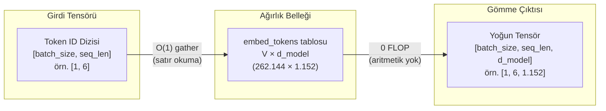

Bir dil modeline bir cümle verdiğinizde, tokenizer metni parçalar ve
her birine bir tamsayı damgası vurur: `[1054, 492, 281]`. Ancak bir
transformer tamsayılarla düşünemez; sinir ağlarının anlayabildiği tek
dil, sürekli vektör uzayları ve matris çarpımlarıdır. İşte **gömme katmanı
(embedding layer)** tam bu sınır çizgisinde durur: ayrık token numaralarını,
modelin üzerinde işlem yapabileceği zengin geometrik koordinatlara
dönüştüren ilk çevirmendir.

İlk bakışta bu katman şaşırtıcı derecede yalındır: prompt içeri girerken
tek bir çarpma bile yapmaz, yalnızca bellekten satır okur (sıfır FLOP).
Ancak bir transformer'ın en büyük ağırlık bloklarından biridir — kimi
modellerde toplam parametrelerin üçte birini tek başına tutar. Üstelik
sadece anlamı değil; kelimelerin cümle içindeki sırasını (pozisyonel
kodlama), sayısal kararlılığı ($\sqrt{d_{\text{model}}}$ ölçeklemesi) ve
çıkarım anındaki çıktı projeksiyonunu (`lm_head`) da bu mekanizma yönetir.

Bu yazı, tamsayıların geometriye dönüştüğü o ilk eşiğin anatomisini
çıkarıyor: lookup table mekaniği ve tensör boyutları, sessizce hatalara
yol açan $\sqrt{d_{\text{model}}}$ ölçekleme tuzağı, mutlak konumlardan
RoPE'a uzanan pozisyonel kodlama evrimi, ön eğitimdeki kayıp sıçramaları
(loss spikes) ve aynı ağırlık matrisinin eğitim ile çıkarım arasındaki
zıt yüzü.

**Bu yazıda**

- [1. Bir LLM neden gömme katmanına ihtiyaç duyar?](#1-bir-llm-neden-gömme-katmanına-ihtiyaç-duyar)
- [2. Arama tablosu mekaniği](#2-arama-tablosu-mekaniği)
- [3. Vektör ölçekleme ve gizlendiği yer](#3-vektör-ölçekleme-ve-gizlendiği-yer)
- [4. Pozisyonel kodlama nasıl evrildi?](#4-pozisyonel-kodlama-nasıl-evrildi)
  - [A. Öğrenilmiş mutlak pozisyon (GPT-2, BERT)](#a-öğrenilmiş-mutlak-pozisyon-gpt-2-bert)
  - [B. Sinüzoidal dalga (Vaswani et al., 2017)](#b-sinüzoidal-dalga-vaswani-et-al-2017)
  - [C. RoPE: Döner pozisyonel gömme (Gemma 3, Llama)](#c-rope-döner-pozisyonel-gömme-gemma-3-llama)
  - [Göreli mesafenin doğal kazanımı](#göreli-mesafenin-doğal-kazanımı)
  - [Üç yöntemin karşılaştırma tablosu](#üç-yöntemin-karşılaştırma-tablosu)
- [5. Kayıp sıçramaları ve WeSaR](#5-kayıp-sıçramaları-ve-wesar)
- [6. Eğitim maliyeti ile sunum maliyeti karşılaştırması](#6-eğitim-maliyeti-ile-sunum-maliyeti-karşılaştırması)
- [7. PyTorch adım adım inceleme](#7-pytorch-adım-adım-inceleme)
- [Bütün hikâye altı satırda](#bütün-hikâye-altı-satırda)
- [Terimler sözlüğü](#terimler-sözlüğü)
- [Daha derine inmek için](#daha-derine-inmek-için)

---

## 1. Bir LLM neden gömme katmanına ihtiyaç duyar?

Derin öğrenme modelleri matris çarpımları ve sürekli vektör uzayları
üzerinde çalışır. "kedi" metnini doğrudan bir matrisle çarpamazsınız.
Metni bu ağlara aktarmanın üç yolu denenmiştir:

- **Kelime düzeyi (Word-level).** Metni kelimelere bölmek yüz binlerce
  terimlik devasa bir sözlük gerektirir. Sözlükte bulunmayan her yeni
  kelime Out-Of-Vocabulary (OOV) hatası üretir, `[UNK]` token'ına
  indirgenir ve anlamsal içeriğini tamamen kaybeder.
- **Karakter düzeyi (Character-level).** Kelime dağarcığı küçüktür
  (~256 girdi) ve OOV problemi yaşanmaz; ancak diziler aşırı uzar.
  Tek bir harf neredeyse hiçbir anlamsal yük taşımadığından, modelin
  karesel dikkat (attention) penceresi anlamsız parçalarla hızla tükenir.
- **Alt kelime (Subword).** Modern LLM'lerin uzlaştığı dengedir (BPE,
  WordPiece, SentencePiece). Sık kullanılan kelimeler tek parça kalırken,
  nadir kelimeler anlamlı alt köklere ve eklere bölünür. Ayrıntılı
  işleyiş için bu blogdaki
  [Tokenizasyon nasıl çalışır](post.html?slug=tokenizasyon-nasil-calisir)
  rehberine bakabilirsiniz.

Tokenizasyon işlemi bize **token ID** adı verilen tamsayıları verir.
Örneğin `"the capital of united states"` girdisi için Gemma 3 şu diziyi
üretir: `[2, 1437, 5279, 529, 26974, 5022]`. Bu tamsayıların kendi
başlarına bir büyüklükleri, geometrik yönleri ya da birbirlerine
uzaklıkları yoktur: 5279 değerinin 1437'den sayısal olarak büyük olması
semantik açıdan hiçbir anlam taşımaz.

Gömme katmanı, bu ayrık tamsayıları çok boyutlu uzayda anlamsal
koordinatlar olarak işlev gören yoğun (dense) vektörlere dönüştürür.

---

## 2. Arama tablosu mekaniği

> **Gömme katmanı (`embed_tokens`)** = Kelime dağarcığındaki her girdi
> için bir satır tutan eğitilebilir bir tablodur. Görevi girdiyi
> matematiksel olarak dönüştürmek değil, her tamsayıyı işaret ettiği
> satırla *değiştirmektir* — aritmetik bir işlem yapmaktan çok bir
> sözlüğü sayfa numarasından açmaya benzer.

`embed_tokens`, $V \times d_{\text{model}}$ boyutunda bir ağırlık
matrisidir; burada $V$ kelime dağarcığı boyutu (vocabulary size),
$d_{\text{model}}$ ise gizli katman boyutudur (hidden dimension):



- **Arama tablosu ($O(1)$) mantığı.** Bir matris çarpımı yapmak yerine
  `embed_tokens`, gelen token ID'sine karşılık gelen satırı doğrudan
  ağırlık matrisinden çeker — bu işlem bir **gather** operasyonudur; yani
  aritmetik değil, doğrudan bir bellek okumasıdır. Ders kitapları bunu
  one-hot vektör ile $E$ matrisini çarpmak olarak tanımlar; bu matematiksel
  olarak özdeş olsa da hesaplama açısından anlamsızdır, çünkü 262.144
  çarpmanın $d_{\text{model}}$ kadarı hariç tümü sıfırla yapılır.
- **Tensör dönüşümü.** `[batch_size, seq_len]` boyutundaki bir tamsayı
  dizisi, arama işleminden sonra `[batch_size, seq_len, d_model]`
  boyutunda semantik bir tensöre genişler.
- **Model örnekleri.** Gemma-3-1B matrisi $262.144 \times 1.152$
  boyutundadır; Gemma-3-27B modelinde ise $262.208 \times 5.376$ boyutuna
  ulaşır. Aradaki 64 satırlık fark gerçektir — büyük çok modlu
  (multimodal) modeller görüntü token'ları için ek satırlar barındırır.
- **Parametre maliyeti.** $262.144 \times 1.152 \approx 302\text{M}$
  parametre, 1B parametreli bir modelin yaklaşık %30'una denk gelir.
  27B modelinde ise aynı kelime dağarcığı toplam parametrelerin yaklaşık
  %5'ini oluşturur. Geniş kelime dağarcığı yalnızca küçük ölçekli
  modellerde ciddi bir VRAM baskısı yaratır.
- **Sıradan ve bağlamdan bağımsız.** Aynı ID her seferinde aynı vektörü
  döndürür. 5279 numaralı satır "river bank" (nehir kıyısı) ve "bank loan"
  (banka kredisi) ifadelerinde tamamen aynıdır; anlam ayrımını burada
  gömme katmanı değil, sonraki dikkat (attention) katmanları çözer.
- **`padding_idx`.** Toplu işlem (batching) eşit uzunluklar gerektirir,
  bu nedenle kısa diziler doldurma (pad) token'ı ile tamamlanır. Gemma
  bu durumu `padding_idx=config.pad_token_id` ile yönetir; bu parametre
  ilgili satırı gradyan güncellemelerinden muaf tutarak dolgu vektörünün
  eğitim boyunca sabit kalmasını sağlar.

---

## 3. Vektör ölçekleme ve gizlendiği yer

Gemma modelinde ve orijinal Transformer mimarisinde, gömme tablosundan
çıkan vektörler ilk bloğa ulaşmadan önce $\sqrt{d_{\text{model}}}$ ile
çarpılır (Gemma-3-1B için $\sqrt{1152} \approx 33,94$):

$$\mathbf{x}_{\text{ölçekli}} = \mathbf{x}_{\text{gömme}} \times \sqrt{d_{\text{model}}}$$

Şöyle okuyun: *Tablodan okunan ham satır vektörü, model boyunca sabit
kalan tek bir skaler katsayı ile çarpılır.*

- $\mathbf{x}_{\text{gömme}}$: Gömme tablosundan doğrudan çekilen ham satır
  vektörü.
- $\sqrt{d_{\text{model}}}$: Gizli katman boyutunun karekökü olan sabit
  çarpan (Gemma-3-1B'de $\sqrt{1152} \approx 33,94$).
- $\mathbf{x}_{\text{ölçekli}}$: İlk transformer bloğunun artık akışına
  (residual stream) teslim edilen ölçeklenmiş girdi vektörü.

Bu sayı nereden geliyor ve neden gereklidir? Tabloda depolanan tipik bir
ağırlık başlangıçta `0,02` civarındadır (Gemma `initializer_range = 0.02`
kullanır). Adım adım hesaplarsak:

```text
d_model               = 1152
ölçek katsayısı       = √1152 = 33,94
ham değer             = 0,02
ölçeklenmiş değer     = 0,02 × 33,94 = 0,68
```

Satırdaki tüm sayılar aynı 33,94 katsayısıyla çarpıldığından vektörün
uzaydaki yönü değişmez; yalnızca boyu (Öklid normu) 33,94 katına çıkar.

Bunun temel nedeni ağırlık bağlama (weight tying) yöntemidir (Bölüm 6).
Tek bir matris hem girdi tablosu hem de çıktı projeksiyonu (`lm_head`)
olarak görev yapar ve bu iki görev farklı ölçekler talep eder: Çıktı tarafı
bir softmax katmanını beslediği için ağırlıklarının küçük başlaması
şarttır; aksi takdirde softmax doygunluğa ulaşır ve gradyanlar sıfırlanır.
Ancak bu küçük değerler, girdi tarafındaki vektör normlarının transformer
bloğunun beklediği birim varyans seviyesinin çok altında kalmasına yol
açar. Sabit $\sqrt{d_{\text{model}}}$ katsayısı bu iki karşıt gereksinimi
birbirine bağlar. *Attention Is All You Need* makalesinin 3.4 numaralı
bölümü ağırlık paylaşımı ile $\sqrt{d_{\text{model}}}$ faktörünü aynı
cümlede tanımlar.

**PyTorch tuzağı.** Gemma mimarisinde bu çarpım model omurgasının genel
`forward` akışında değil, gömme modülünün kendi sınıfı içinde gerçekleşir:

```python
class Gemma3TextScaledWordEmbedding(nn.Embedding):
    def forward(self, input_ids):
        return super().forward(input_ids) * self.embed_scale.to(self.weight.dtype)
```

Dolayısıyla `embed_tokens(ids)` çağrısı **zaten ölçeklenmiş** vektör
döndürürken, standart `F.embedding(ids, weight)` fonksiyonu **ölçeklenmemiş**
ham değerleri verir. Dahası `embed_scale`, model kontrol noktasında
(checkpoint) yer almayan kalıcı olmayan bir arabellektir (non-persistent
buffer). Ağırlıkları safça yükleyip bu ölçek katsayısını gözden kaçıran
özel bir implementasyon hata vermeden çalışır fakat model performansını
sessizce çökertir.

Llama tarzı modeller ise ağırlık bağlama ve gömme ölçeklemesi yapmaz;
bunun yerine her blok girişindeki RMSNorm katmanının normalizasyonuna
güvenir.

---

## 4. Pozisyonel kodlama nasıl evrildi?

"Köpek adamı ısırdı" ile "adam köpeği ısırdı" cümlelerini ele alalım. Bölüm
2'de gördüğümüz gibi arama tablosu her iki cümle için de sözlükten tıpatıp aynı
üç satır vektörünü çeker; arama tablosunun sıra farkındalığı kesinlikle sıfırdır.
Öz-dikkat (self-attention) mekanizması da bunu tek başına çözemez: dikkat
ağırlıkları iç çarpımlarla hesaplanır ve iç çarpım değişmelidir ($q \cdot k = k \cdot q$). Hangi kelimenin önce, hangisinin sonra geldiğini ayırt edemez.

Dolayısıyla dizi sırası, dikkat katmanı çalışmadan önce doğrudan sayısal
vektörlerin içine enjekte edilmelidir. Amaç sadece token'a "sen 4.517. sıradasın"
etiketi yapıştırmak değil, iki kelimenin birbirinden kaç adım uzakta olduğunu
(göreli mesafeyi) doğal olarak hissettirmektir.

Tarihsel olarak üç farklı paradigma kullanılmıştır:
- **A. Öğrenilmiş mutlak:** Pozisyon başına ikinci bir eğitilebilir ağırlık
  tablosu tutulur ve kelime vektörüyle eleman düzeyinde toplanır.
- **B. Sinüzoidal:** Sabit trigonometrik dalga koordinatları hesaplanır ve
  kelime vektörüyle toplanır.
- **C. RoPE:** Vektör toplamayı tamamen terk eder. Vektörü 2D koordinat
  düzlemlerinde pozisyonuna ve boyut frekansına orantılı açılarla döndürür.

```text
A. Öğrenilmiş Mutlak (GPT-2, BERT)   B. Sinüzoidal (Vaswani 2017)   C. RoPE (Llama, Gemma 3)
   Vektör Toplama                       Trigonometrik Toplama          Vektör Döndürme
   x_i = TokenEmbed + PosEmbed          x_i = TokenEmbed + PE_pos      x_i = R(Θ, i) · TokenEmbed
   (Sert sınır: L_max)                  (Norm şişmesi / kayması)       (Tam norm koruma, ||x|| = sabit)
```

Bu üç mekanizmayı temiz biçimde karşılaştırmak için **8 boyutlu temsiller ($d = 8$)**
üzerinden 6 token'lık somut bir cümleyi adım adım izliyoruz:

$$\text{Dizi: } [\text{"The"}, \ \text{"dog"}, \ \text{"chased"}, \ \text{"the"}, \ \text{"black"}, \ \text{"cat"}] \implies m \in \{0, 1, 2, 3, 4, 5\}$$

Sözlük tablosundan okunan ham kelime vektörleri şunlar olsun:
- **Slot 0 ("The"):** $\mathbf{x}_{(0)} = [0,80, \ 0,60, \ 0,40, \ 0,20, \ 0,50, \ 0,10, \ 0,30, \ 0,20]^T \implies \Vert \mathbf{x}_{(0)}\Vert = \sqrt{1,59} \approx 1,2610$
- **Slot 1 ("dog"):** $\mathbf{x}_{(1)} = [0,70, \ 0,10, \ 0,30, \ 0,50, \ 0,20, \ 0,40, \ 0,60, \ 0,10]^T \implies \Vert \mathbf{x}_{(1)}\Vert = \sqrt{1,41} \approx 1,1874$
- **Slot 2 ("chased"):** $\mathbf{x}_{(2)} = [0,50, \ 0,80, \ 0,20, \ 0,30, \ 0,40, \ 0,20, \ 0,10, \ 0,50]^T \implies \Vert \mathbf{x}_{(2)}\Vert = \sqrt{1,48} \approx 1,2166$
- **Slot 3 ("the"):** $\mathbf{x}_{(3)} = [0,80, \ 0,60, \ 0,40, \ 0,20, \ 0,50, \ 0,10, \ 0,30, \ 0,20]^T \implies \Vert \mathbf{x}_{(3)}\Vert = \sqrt{1,59} \approx 1,2610$
- **Slot 4 ("black"):** $\mathbf{x}_{(4)} = [0,60, \ 0,20, \ 0,50, \ 0,10, \ 0,30, \ 0,60, \ 0,20, \ 0,40]^T \implies \Vert \mathbf{x}_{(4)}\Vert = \sqrt{1,31} \approx 1,1446$
- **Slot 5 ("cat"):** $\mathbf{x}_{(5)} = [0,30, \ 0,90, \ 0,10, \ 0,40, \ 0,50, \ 0,20, \ 0,40, \ 0,10]^T \implies \Vert \mathbf{x}_{(5)}\Vert = \sqrt{1,53} \approx 1,2369$

*(Dikkat ederseniz Slot 0 "The" ve Slot 3 "the" kelimeleri sözlükte aynı satıra denk geldiğinden tamamen özdeş ham vektörlere ve $1,2610$ normuna sahiptir.)*

### A. Öğrenilmiş mutlak pozisyon (GPT-2, BERT)

Parametre belleğinde $L_{\max} \times d_{\text{model}}$ boyutunda eğitilebilir
ikinci bir matris saklanır. Her token temsili, kelime vektörü ile pozisyon
vektörünün eleman düzeyinde toplamıdır:

$$\mathbf{x}_i = \text{TokenEmbed}(w_i) + \text{PosEmbed}(i)$$

Eğitim gradyanlarının öğrenilmiş 8 boyutlu pozisyon satırlarını şu değerlere
getirdiğini varsayalım:
- $\text{PosEmbed}(0) = [0,00, \ 0,20, \ 0,10, \ 0,00, \ 0,10, \ -0,10, \ 0,00, \ 0,10]$
- $\text{PosEmbed}(1) = [0,20, \ -0,10, \ 0,00, \ 0,10, \ -0,10, \ 0,10, \ 0,10, \ 0,00]$
- $\text{PosEmbed}(2) = [-0,10, \ 0,10, \ 0,20, \ -0,10, \ 0,00, \ 0,10, \ -0,10, \ 0,10]$
- $\text{PosEmbed}(3) = [0,10, \ 0,00, \ -0,10, \ 0,20, \ 0,10, \ 0,00, \ 0,10, \ -0,10]$
- $\text{PosEmbed}(4) = [0,00, \ -0,10, \ 0,10, \ 0,10, \ -0,10, \ 0,00, \ 0,10, \ 0,10]$
- $\text{PosEmbed}(5) = [-0,10, \ 0,20, \ -0,10, \ 0,00, \ 0,10, \ -0,10, \ 0,00, \ 0,10]$

Kelime temsillerini pozisyon vektörleriyle toplayalım:

```text
Slot 0 ("The"):
  TokenEmbed("The") = [ 0,80   0,60   0,40   0,20   0,50   0,10   0,30   0,20 ]
  PosEmbed(0)       = [ 0,00   0,20   0,10   0,00   0,10  -0,10   0,00   0,10 ]
  x_0 (toplam)      = [ 0,80   0,80   0,50   0,20   0,60   0,00   0,30   0,30 ]  ──> Norm: 1,45  (1,26'dan saptı)

Slot 1 ("dog"):
  TokenEmbed("dog") = [ 0,70   0,10   0,30   0,50   0,20   0,40   0,60   0,10 ]
  PosEmbed(1)       = [ 0,20  -0,10   0,00   0,10  -0,10   0,10   0,10   0,00 ]
  x_1 (toplam)      = [ 0,90   0,00   0,30   0,60   0,10   0,50   0,70   0,10 ]  ──> Norm: 1,42  (1,19'dan saptı)

Slot 2 ("chased"):
  TokenEmbed("cha") = [ 0,50   0,80   0,20   0,30   0,40   0,20   0,10   0,50 ]
  PosEmbed(2)       = [-0,10   0,10   0,20  -0,10   0,00   0,10  -0,10   0,10 ]
  x_2 (toplam)      = [ 0,40   0,90   0,40   0,20   0,40   0,30   0,00   0,60 ]  ──> Norm: 1,33  (1,22'den saptı)

Slot 3 ("the"):
  TokenEmbed("the") = [ 0,80   0,60   0,40   0,20   0,50   0,10   0,30   0,20 ]
  PosEmbed(3)       = [ 0,10   0,00  -0,10   0,20   0,10   0,00   0,10  -0,10 ]
  x_3 (toplam)      = [ 0,90   0,60   0,30   0,40   0,60   0,10   0,40   0,10 ]  ──> Norm: 1,40  (1,26'dan saptı)

Slot 4 ("black"):
  TokenEmbed("bla") = [ 0,60   0,20   0,50   0,10   0,30   0,60   0,20   0,40 ]
  PosEmbed(4)       = [ 0,00  -0,10   0,10   0,10  -0,10   0,00   0,10   0,10 ]
  x_4 (toplam)      = [ 0,60   0,10   0,60   0,20   0,20   0,60   0,30   0,50 ]  ──> Norm: 1,23  (1,14'ten saptı)

Slot 5 ("cat"):
  TokenEmbed("cat") = [ 0,30   0,90   0,10   0,40   0,50   0,20   0,40   0,10 ]
  PosEmbed(5)       = [-0,10   0,20  -0,10   0,00   0,10  -0,10   0,00   0,10 ]
  x_5 (toplam)      = [ 0,20   1,10   0,00   0,40   0,60   0,10   0,40   0,20 ]  ──> Norm: 1,41  (1,24'ten saptı)
```

- **Dezavantaj 1 (Sert bağlam tavanı):** Model 2.048 yuva ile eğitildiyse,
  ağırlık matrisinde 2.049. satır yoktur. Model, ilklendirilmemiş yeni
  parametreler eklemeden $L_{\max}$ ötesindeki dizileri işleyemez.
- **Dezavantaj 2 (Yapısal göreli mesafe farkındalığı yok):** "dog" (Slot 1) ile
  "cat" (Slot 5) arasındaki 4 adımlık mesafe ($5 - 1 = 4$), 101 ve 105.
  yuvalarda geçen aynı 4 adımlık mesafeden tamamen bağımsız olarak öğrenilir.

### B. Sinüzoidal dalga (Vaswani et al., 2017)

Pozisyon koordinatları geometrik frekans serileri kullanılarak analitik
biçimde hesaplanır:

$$PE_{(pos, 2j)} = \sin\left(\frac{pos}{10000^{2j/d}}\right), \quad PE_{(pos, 2j+1)} = \cos\left(\frac{pos}{10000^{2j/d}}\right)$$

Burada $pos \in \{0, 1, 2, 3, 4, 5\}$, çift indeksi $j \in \{0, 1, 2, 3\}$ ve model boyutu $d = 8$'dir:
- $j = 0$ için (0 ve 1. kanallar): $\text{bölen} = 10000^{0/8} = 10000^0 = 1,0 \implies \text{frekans} = 1,0\text{ rad/adım}$
- $j = 1$ için (2 ve 3. kanallar): $\text{bölen} = 10000^{2/8} = 10000^{1/4} = 10,0 \implies \text{frekans} = 0,1\text{ rad/adım}$
- $j = 2$ için (4 ve 5. kanallar): $\text{bölen} = 10000^{4/8} = 10000^{1/2} = 100,0 \implies \text{frekans} = 0,01\text{ rad/adım}$
- $j = 3$ için (6 ve 7. kanallar): $\text{bölen} = 10000^{6/8} = 10000^{3/4} = 1000,0 \implies \text{frekans} = 0,001\text{ rad/adım}$

Her yuva için 8 boyutlu dalga koordinatları:

```text
Slot 0 (pos = 0):
  PE_0 = [ sin(0,0), cos(0,0), sin(0,00), cos(0,00), sin(0,000), cos(0,000), sin(0,0000), cos(0,0000) ]
       ≈ [ 0,0000,   1,0000,   0,0000,   1,0000,   0,0000,    1,0000,    0,0000,     1,0000     ]

Slot 1 (pos = 1):
  PE_1 = [ sin(1,0), cos(1,0), sin(0,10), cos(0,10), sin(0,010), cos(0,010), sin(0,0010), cos(0,0010) ]
       ≈ [ 0,8415,   0,5403,   0,0998,   0,9950,   0,0100,    1,0000,    0,0010,     1,0000     ]

Slot 2 (pos = 2):
  PE_2 = [ sin(2,0), cos(2,0), sin(0,20), cos(0,20), sin(0,020), cos(0,020), sin(0,0020), cos(0,0020) ]
       ≈ [ 0,9093,  -0,4161,   0,1987,   0,9801,   0,0200,    0,9998,    0,0020,     1,0000     ]

Slot 3 (pos = 3):
  PE_3 = [ sin(3,0), cos(3,0), sin(0,30), cos(0,30), sin(0,030), cos(0,030), sin(0,0030), cos(0,0030) ]
       ≈ [ 0,1411,  -0,9900,   0,2955,   0,9553,   0,0300,    0,9996,    0,0030,     1,0000     ]

Slot 4 (pos = 4):
  PE_4 = [ sin(4,0), cos(4,0), sin(0,40), cos(0,40), sin(0,040), cos(0,040), sin(0,0040), cos(0,0040) ]
       ≈ [-0,7568,  -0,6536,   0,3894,   0,9211,   0,0400,    0,9992,    0,0040,     1,0000     ]

Slot 5 (pos = 5):
  PE_5 = [ sin(5,0), cos(5,0), sin(0,50), cos(0,50), sin(0,050), cos(0,050), sin(0,0050), cos(0,0050) ]
       ≈ [-0,9589,   0,2837,   0,4794,   0,8776,   0,0500,    0,9988,    0,0050,     1,0000     ]
```

Vektör toplama işlemi uygulandığında ($\mathbf{x}_m = \text{TokenEmbed}(w_m) + PE_m$):

```text
Slot 0 ("The"):
  x_0 (toplam) = [ 0,80+0,0000, 0,60+1,0000, 0,40+0,0000, 0,20+1,0000, 0,50+0,0000, 0,10+1,0000, 0,30+0,0000, 0,20+1,0000 ]
               = [ 0,8000,      1,6000,      0,4000,      1,2000,      0,5000,      1,1000,      0,3000,      1,2000 ]  ──> Norm: 2,79  (+%121 şişti)

Slot 1 ("dog"):
  x_1 (toplam) = [ 0,70+0,8415, 0,10+0,5403, 0,30+0,0998, 0,50+0,9950, 0,20+0,0100, 0,40+1,0000, 0,60+0,0010, 0,10+1,0000 ]
               = [ 1,5415,      0,6403,      0,3998,      1,4950,      0,2100,      1,4000,      0,6010,      1,1000 ]  ──> Norm: 2,96  (+%149 şişti)

Slot 2 ("chased"):
  x_2 (toplam) = [ 0,50+0,9093, 0,80-0,4161, 0,20+0,1987, 0,30+0,9801, 0,40+0,0200, 0,20+0,9998, 0,10+0,0020, 0,50+1,0000 ]
               = [ 1,4093,      0,3839,      0,3987,      1,2801,      0,4200,      1,1998,      0,1020,      1,5000 ]  ──> Norm: 2,79  (+%130 şişti)

Slot 3 ("the"):
  x_3 (toplam) = [ 0,80+0,1411, 0,60-0,9900, 0,40+0,2955, 0,20+0,9553, 0,50+0,0300, 0,10+0,9996, 0,30+0,0030, 0,20+1,0000 ]
               = [ 0,9411,     -0,3900,      0,6955,      1,1553,      0,5300,      1,0996,      0,3030,      1,2000 ]  ──> Norm: 2,42  (+%92 şişti)

Slot 4 ("black"):
  x_4 (toplam) = [ 0,60-0,7568, 0,20-0,6536, 0,50+0,3894, 0,10+0,9211, 0,30+0,0400, 0,60+0,9992, 0,20+0,0040, 0,40+1,0000 ]
               = [-0,1568,     -0,4536,      0,8894,      1,0211,      0,3400,      1,5992,      0,2040,      1,4000 ]  ──> Norm: 2,60  (+%127 şişti)

Slot 5 ("cat"):
  x_5 (toplam) = [ 0,30-0,9589, 0,90+0,2837, 0,10+0,4794, 0,40+0,8776, 0,50+0,0500, 0,20+0,9988, 0,40+0,0050, 0,10+1,0000 ]
               = [-0,6589,      1,1837,      0,5794,      1,2776,      0,5500,      1,1988,      0,4050,      1,1000 ]  ──> Norm: 2,63  (+%113 şişti)
```

- **Dezavantaj (Ağır semantik bozulma ve norm kayması):** Vektör toplama işlemi
  vektör boylarını dramatik biçimde deforme eder. Birebir aynı sözlük vektörüne
  sahip olan "The" (Slot 0) ve "the" (Slot 3) kelimeleri tamamen farklı normlara
  ($2,79$ ve $2,42$) ulaşır; temel anlamsal sinyal cümlenin neresinde geçtiğine
  bağlı olarak bozulur.

### C. RoPE: Döner pozisyonel gömme (Gemma 3, Llama)

Önceki iki yöntemin (Öğrenilmiş Mutlak ve Sinüzoidal) temel çıkmazını gördük: Pozisyon bilgisini kelime vektörüne **vektör toplama ($\mathbf{x} + \mathbf{p}$)** yoluyla ekliyorlardı. Bu toplama işlemi, kelimenin orijinal anlam vektörünün boyunu (normunu) $1,26$'dan $2,96$'ya kadar (%149'a varan oranda) şişirdi. Dikkat katmanında bu yapay şişme, iç çarpımları fırlatarak softmax dengesini altüst eder.

**RoPE'un dâhiyane çıkış noktası tek bir soruyla özetlenebilir:**
> *"Bir kelimenin anlamını (vektör boyunu) hiç bozmadan, sadece cümledeki sırasını nasıl kodlayabiliriz?"*

**Cevap: Vektöre bir şey ekleme, onu bir pusula iğnesi gibi döndür!**

Masada duran 10 cm uzunluğunda bir pusula iğnesini düşünün. İğneyi masanın üzerinde kaç derece çevirirseniz çevirin, boyu kuruşu kuruşuna 10 cm kalır. İşte **RoPE (Rotary Position Embedding)** tam olarak bunu yapar: Kelime vektörlerinin boyunu (öz anlamını) kesinlikle değiştirmeden, yalnızca uzaydaki yönünü token'ın cümledeki sırasına göre döndürür.

$$\mathbf{x}_m = \mathbf{R}_{\Theta, m}^{d} \cdot \text{TokenEmbed}(w_m)$$

**Formülü sade bir dille okuyalım:**
*Sözlük tablosundan okunan ham kelime vektörü ($\text{TokenEmbed}$), $m$. pozisyon için hesaplanan bir rotasyon (döndürme) matrisi ($\mathbf{R}$) ile çarpılır. Vektörün boyu milimetrik olarak korunurken, yönü kelimenin cümledeki sırasına göre döner.*

Bu formüldeki yapı taşları:
- **$\text{TokenEmbed}(w_m)$:** Sözlük tablosundan çekilen ham anlamsal vektör ($d = 8$ boyutlu). Pozisyon içermez; "The" kelimesi cümlenin neresinde geçerse geçsin aynı ham sayılarla gelir.
- **$m$:** Token'ın cümledeki sıra indeksidir ($m = 0, 1, 2, 3, \dots$). Fiziksel sistemlerdeki "ayrık zaman adımı" gibidir.
- **$\Theta = \{\theta_1, \theta_2, \dots, \theta_{d/2}\}$:** Boyut çiftlerine atanan açısal dönüş hızları kümesidir ($d = 8$ için 4 adet hız).
- **$\mathbf{R}_{\Theta, m}^{d}$:** $m$. yuva için oluşturulan $8 \times 8$ boyutundaki blok-köşegen döndürme matrisidir.
- **$\mathbf{x}_m$:** Boyu hiç bozulmamış, yönüne pozisyon bilgisi kusursuzca mühürlenmiş nihai vektördür.

---

#### 1. Temel Kural: Açı = Pozisyon × Açısal Hız

RoPE'ta bir kelimenin ne kadar döneceği, dönen bir saatin ibresi kadar yalındır:

$$\text{Dönüş Açısı} = \text{Pozisyon} \times \text{Açısal Hız} \implies \phi(m) = m \cdot \theta$$

- **0. pozisyondaki kelime ($m = 0$):** $0 \times \theta = 0^\circ$ döner. İbre tam başlangıç noktasındadır (12 yönü, orijinal doğrultusunda kalır).
- **1. pozisyondaki kelime ($m = 1$):** $1 \times \theta$ kadar ileri döner.
- **2. pozisyondaki kelime ($m = 2$):** $2 \times \theta$ kadar ileri döner.
- **50. pozisyondaki kelime ($m = 50$):** $50 \times \theta$ kadar ileri döner.

Kelime cümlede ne kadar ilerideyse, ibresi o kadar ileri dönmüştür. Kelimenin öz anlamı (vektörün boyu) zerre kadar değişmez; yalnızca yönü cümledeki sırasına göre adım adım kayar.

---

#### 2. İki Boyutlu (2D) Düzlem Hilesi: 8 Boyut Nasıl Döndürülür?

8 boyutlu bir vektörü 8 boyutta tek bir katı cisim gibi döndürmek yerine RoPE bunu **zarif bir parçalama hilesiyle** çözer:
8 boyutlu vektörü ikişerli sayılardan oluşan **4 bağımsız 2D çifte (kadran)** böler:

$$(x_1, x_2), \quad (x_3, x_4), \quad (x_5, x_6), \quad (x_7, x_8)$$

Bunu bir masa üzerinde yan yana duran **4 küçük saat kadranı** gibi hayal edin. Her kadranın üzerinde iki boyutlu bir $(x, y)$ oku vardır. İki boyutlu bir oku merkez etrafında $\phi$ açısıyla döndürmek ise lise geometrisidir:

$$\tilde{x}_1 = x_1 \cos\phi - x_2 \sin\phi$$
$$\tilde{x}_2 = x_1 \sin\phi + x_2 \cos\phi$$

*(Karmaşık sayılarla düşünenler için: Bu işlem, $z = x_1 + i x_2$ sayısını $e^{i\phi}$ ile çarpmaktan ibarettir; Euler özdeşliği $|e^{i\phi}| = 1$ olduğundan büyüklük asla değişmez!)*

**Vektör boyu neden asla bozulmaz? (Matematiksel İspat):**
Döndürülmüş bileşenlerin karelerini topladığımızda:
$$\tilde{x}_1^2 + \tilde{x}_2^2 = (x_1 \cos\phi - x_2 \sin\phi)^2 + (x_1 \sin\phi + x_2 \cos\phi)^2 = (x_1^2 + x_2^2)(\cos^2\phi + \sin^2\phi)$$
Trigonometrinin temel özdeşliği gereği $\cos^2\phi + \sin^2\phi = 1$ olduğundan:
$$\tilde{x}_1^2 + \tilde{x}_2^2 = x_1^2 + x_2^2$$
Vektörün uzunluğunda milimetrik bir sapma bile oluşmaz; 4 çiftin dördünde de norm kayması kesinlikle **%0**'dır!

---

#### 3. Neden Tek Bir Hız Yetmez? Saat İbreleri Analojisi

"Peki 4 kadranın hepsi aynı hızla ($\theta$) mı döner?"
**Kesinlikle hayır.** Bir kol saatini düşünün: Bir saatte neden hem saniye, hem yelkovan, hem de akrep ibresi vardır?

- **Eğer saatte sadece saniye ibresi olsaydı:** İbre her 60 saniyede bir tam tur atıp başa dönerdi. Öğlen 12:00 ile gece 24:00 birbirinin aynısı görünürdü (buna **faz çakışması / phase wrapping** denir).
- **Eğer saatte sadece akrep ibresi olsaydı:** İbre o kadar yavaş kıpırdardı ki, hangi saniyede olduğunuzu asla ayırt edemezdiniz.

RoPE, 8 boyutlu modelimizdeki 4 koordinat çiftine tam olarak bu mantıkla 4 farklı hız ($\theta_j$) atar:

Bu açısal hızlar geometrik frekans serisiyle formüle edilir ($d = 8$ ve $\text{base} = 10.000$ için):

$$\theta_j = \text{base}^{-\frac{2(j-1)}{d}} = \frac{1}{\text{base}^{\frac{2(j-1)}{d}}} \quad [\text{token başına radyan}]$$

Burada $10.000 = 10^4$ olduğundan, $d = 8$ boyutunda 4 çiftin üsleri tam olarak $10$'un katları şeklinde sadeleşir:

- **1. Çift ($j = 1$, kanallar 1–2):**  
  Üs: $\frac{2(1-1)}{8} = \frac{0}{8} = 0 \implies \theta_1 = \frac{1}{10000^0} = \frac{1}{1} = \mathbf{1{,}0\text{ rad/adım}} \ (\approx 57{,}3^\circ)$
- **2. Çift ($j = 2$, kanallar 3–4):**  
  Üs: $\frac{2(2-1)}{8} = \frac{2}{8} = \frac{1}{4} \implies \theta_2 = \frac{1}{10000^{1/4}} = \frac{1}{\sqrt[4]{10^4}} = \frac{1}{10} = \mathbf{0{,}1\text{ rad/adım}} \ (\approx 5{,}73^\circ)$
- **3. Çift ($j = 3$, kanallar 5–6):**  
  Üs: $\frac{2(3-1)}{8} = \frac{4}{8} = \frac{1}{2} \implies \theta_3 = \frac{1}{10000^{1/2}} = \frac{1}{\sqrt{10000}} = \frac{1}{100} = \mathbf{0{,}01\text{ rad/adım}} \ (\approx 0{,}57^\circ)$
- **4. Çift ($j = 4$, kanallar 7–8):**  
  Üs: $\frac{2(4-1)}{8} = \frac{6}{8} = \frac{3}{4} \implies \theta_4 = \frac{1}{10000^{3/4}} = \frac{1}{(\sqrt[4]{10^4})^3} = \frac{1}{10^3} = \frac{1}{1000} = \mathbf{0{,}001\text{ rad/adım}} \ (\approx 0{,}057^\circ)$

Standart $\text{base} = 10.000$ ile 4 çiftin açısal hızları ve tam tur süreleri:

| Alt Uzay | Açısal Hız ($\theta_j$) | Adım Başına Dönüş | Tam Tur Süresi ($T_j = 2\pi/\theta_j$) | İbre Analojisi ve Görevi |
| :--- | :---: | :---: | :---: | :--- |
| **1. Çift ($j=1$, 1–2. kanallar)** | $1,0\text{ rad}$ | $\approx 57,3^\circ$ | $T_1 = 2\pi / 1,0 \approx 6,28\text{ token}$ | **Saniye İbresi (Mikroskop):** Hızlı döner; komşu kelimeleri ("The" $\to$ "dog") keskin biçimde ayırır. |
| **2. Çift ($j=2$, 3–4. kanallar)** | $0,1\text{ rad}$ | $\approx 5,73^\circ$ | $T_2 = 2\pi / 0,1 \approx 62,83\text{ token}$ | **Hızlı Yelkovan:** Yan tümceler ve cümle içi mesafeleri (10–60 token) ölçer. |
| **3. Çift ($j=3$, 5–6. kanallar)** | $0,01\text{ rad}$ | $\approx 0,57^\circ$ | $T_3 = 2\pi / 0,01 \approx 628,3\text{ token}$ | **Yavaş Yelkovan:** Paragraf düzeyindeki ilişkileri korur. |
| **4. Çift ($j=4$, 7–8. kanallar)** | $0,001\text{ rad}$ | $\approx 0,057^\circ$ | $T_4 = 2\pi / 0,001 \approx 6283,2\text{ token}$ | **Akrep İbresi (Teleskop):** Çok yavaş döner; binlerce token boyunca küresel sırayı korur. |

**`rope_theta` Neden 10.000'den 1 Milyona Çıkarıldı?**
LLaMA 1 döneminde modeller yalnızca 2.048 token okuyabiliyordu; en yavaş ibrenin tam bir turu ($6.283$ token) bu uzunluk için yeterliydi. Fakat LLaMA 3 ve Gemma 3 bağlamı **131.072 (128k) token'a** çıkardığında, $10.000$ tabanı yetersiz kaldı; çünkü en yavaş akrep ibreleri bile onlarca kez tam tur atarak yönünü şaşırır ve **faz çakışmasına (phase wrapping)** düşerdi. Tabanın `1.000.000` yapılması, en yavaş akrebin bir tam turunu **milyonlarca token'a** yayar; böylece 128k'lık dev belgelerde bile hiçbir pozisyon bir diğeriyle aynı açıya denk gelmez.

---

#### 4. Frekansın Vektöre Uygulanışı: 4 Adımlı Dönüşüm Hattı

Bir token'ın ham 8 boyutlu vektörü $\mathbf{x} = [x_1, x_2, x_3, x_4, x_5, x_6, x_7, x_8]^T$ verildiğinde, $m$. pozisyon için RoPE şu 4 adımla uygulanır:

1. **2D Çiftlere Ayır:** Vektörü 4 bağımsız düzlem halinde grupla:
   - 1. Çift: $(x_1, x_2)$
   - 2. Çift: $(x_3, x_4)$
   - 3. Çift: $(x_5, x_6)$
   - 4. Çift: $(x_7, x_8)$
2. **Açıları Hesapla:** Pozisyon numarasıyla açısal hızları çarp:
   $$\phi_1(m) = m \times 1,0, \quad \phi_2(m) = m \times 0,1, \quad \phi_3(m) = m \times 0,01, \quad \phi_4(m) = m \times 0,001$$
3. **Her Çifti Kendi Açısıyla Döndür (2D trigonometri):**
   $$\begin{pmatrix} \tilde{x}_1 \\ \tilde{x}_2 \end{pmatrix} = \begin{pmatrix} x_1 \cos(\phi_1) - x_2 \sin(\phi_1) \\ x_1 \sin(\phi_1) + x_2 \cos(\phi_1) \end{pmatrix}, \quad \begin{pmatrix} \tilde{x}_3 \\ \tilde{x}_4 \end{pmatrix} = \begin{pmatrix} x_3 \cos(\phi_2) - x_4 \sin(\phi_2) \\ x_3 \sin(\phi_2) + x_4 \cos(\phi_2) \end{pmatrix}$$
   $$\begin{pmatrix} \tilde{x}_5 \\ \tilde{x}_6 \end{pmatrix} = \begin{pmatrix} x_5 \cos(\phi_3) - x_6 \sin(\phi_3) \\ x_5 \sin(\phi_3) + x_6 \cos(\phi_3) \end{pmatrix}, \quad \begin{pmatrix} \tilde{x}_7 \\ \tilde{x}_8 \end{pmatrix} = \begin{pmatrix} x_7 \cos(\phi_4) - x_8 \sin(\phi_4) \\ x_7 \sin(\phi_4) + x_8 \cos(\phi_4) \end{pmatrix}$$
4. **Matris Olarak Birleştir:** Bu 4 bağımsız dönüş, tek bir blok-köşegen matris çarpımı olarak yazılabilir:
   $$\mathbf{R}_{\Theta, m}^{8} = \begin{bmatrix} \mathbf{R}_{\phi_1} & 0 & 0 & 0 \\ 0 & \mathbf{R}_{\phi_2} & 0 & 0 \\ 0 & 0 & \mathbf{R}_{\phi_3} & 0 \\ 0 & 0 & 0 & \mathbf{R}_{\phi_4} \end{bmatrix}, \quad \text{burada } \mathbf{R}_{\phi_j} = \begin{bmatrix} \cos(m\theta_j) & -\sin(m\theta_j) \\ \sin(m\theta_j) & \cos(m\theta_j) \end{bmatrix}$$
   Köşegendeki 4 adet $2 \times 2$'lik döndürme bloğu dışında her yer sıfırdır; kanallar birbirine taşmadan sadece kendi düzleminde döner.

Bu dönüşümü 6 token'lık dizimize adım adım uygulayalım:

**Slot 0 ($m = 0$): "The" — Adım Adım Hesaplama**
- **Ham vektör:** $\mathbf{x}_{(0)} = [0,80, \ 0,60, \ 0,40, \ 0,20, \ 0,50, \ 0,10, \ 0,30, \ 0,20]^T$
- **Açıların hesabı ($m = 0$ olduğu için tüm açılar $0$ radyan):**
  - $\phi_1(0) = 0 \times 1,0 = 0,0\text{ rad} \implies \cos(0) = 1,0, \quad \sin(0) = 0,0$
  - $\phi_2(0) = 0 \times 0,1 = 0,0\text{ rad} \implies \cos(0) = 1,0, \quad \sin(0) = 0,0$
  - $\phi_3(0) = 0 \times 0,01 = 0,0\text{ rad} \implies \cos(0) = 1,0, \quad \sin(0) = 0,0$
  - $\phi_4(0) = 0 \times 0,001 = 0,0\text{ rad} \implies \cos(0) = 1,0, \quad \sin(0) = 0,0$
- **4 çiftin bağımsız 2D rotasyon hesabı:**
  - 1. Çift: $\tilde{x}_1 = 0,80(1,0) - 0,60(0,0) = 0,8000, \quad \tilde{x}_2 = 0,80(0,0) + 0,60(1,0) = 0,6000$
  - 2. Çift: $\tilde{x}_3 = 0,40(1,0) - 0,20(0,0) = 0,4000, \quad \tilde{x}_4 = 0,40(0,0) + 0,20(1,0) = 0,2000$
  - 3. Çift: $\tilde{x}_5 = 0,50(1,0) - 0,10(0,0) = 0,5000, \quad \tilde{x}_6 = 0,50(0,0) + 0,10(1,0) = 0,1000$
  - 4. Çift: $\tilde{x}_7 = 0,30(1,0) - 0,20(0,0) = 0,3000, \quad \tilde{x}_8 = 0,30(0,0) + 0,20(1,0) = 0,2000$
- **Döndürülmüş vektör ve korunan norm:**
  $$\mathbf{x}_{\text{rotated}(0)} = [0,8000, \ 0,6000, \ 0,4000, \ 0,2000, \ 0,5000, \ 0,1000, \ 0,3000, \ 0,2000]^T$$
  $$\Vert \mathbf{x}_{\text{rotated}(0)}\Vert = \sqrt{0,80^2 + 0,60^2 + 0,40^2 + 0,20^2 + 0,50^2 + 0,10^2 + 0,30^2 + 0,20^2} = \sqrt{1,59} \approx \mathbf{1,2610} \quad (\text{Kuruşu kuruşuna korundu})$$

**Slot 1 ($m = 1$): "dog" — Adım Adım Hesaplama**
- **Ham vektör:** $\mathbf{x}_{(1)} = [0,70, \ 0,10, \ 0,30, \ 0,50, \ 0,20, \ 0,40, \ 0,60, \ 0,10]^T$
- **Açıların hesabı ($m = 1$ adımı):**
  - $\phi_1(1) = 1 \times 1,0 = 1,0\text{ rad} \implies \cos(1,0) \approx 0,5403, \quad \sin(1,0) \approx 0,8415$
  - $\phi_2(1) = 1 \times 0,1 = 0,1\text{ rad} \implies \cos(0,1) \approx 0,9950, \quad \sin(0,1) \approx 0,0998$
  - $\phi_3(1) = 1 \times 0,01 = 0,01\text{ rad} \implies \cos(0,01) \approx 1,0000, \quad \sin(0,01) \approx 0,0100$
  - $\phi_4(1) = 1 \times 0,001 = 0,001\text{ rad} \implies \cos(0,001) \approx 1,0000, \quad \sin(0,001) \approx 0,0010$
- **4 çiftin bağımsız 2D rotasyon hesabı:**
  - 1. Çift: $\tilde{x}_1 = 0,70(0,5403) - 0,10(0,8415) = 0,2941, \quad \tilde{x}_2 = 0,70(0,8415) + 0,10(0,5403) = 0,6431$
  - 2. Çift: $\tilde{x}_3 = 0,30(0,9950) - 0,50(0,0998) = 0,2486, \quad \tilde{x}_4 = 0,30(0,0998) + 0,50(0,9950) = 0,5275$
  - 3. Çift: $\tilde{x}_5 = 0,20(1,0000) - 0,40(0,0100) = 0,1960, \quad \tilde{x}_6 = 0,20(0,0100) + 0,40(1,0000) = 0,4020$
  - 4. Çift: $\tilde{x}_7 = 0,60(1,0000) - 0,10(0,0010) = 0,5999, \quad \tilde{x}_8 = 0,60(0,0010) + 0,10(1,0000) = 0,1006$
- **Döndürülmüş vektör ve korunan norm:**
  $$\mathbf{x}_{\text{rotated}(1)} = [0,2941, \ 0,6431, \ 0,2486, \ 0,5275, \ 0,1960, \ 0,4020, \ 0,5999, \ 0,1006]^T \implies \Vert \mathbf{x}_{\text{rotated}(1)}\Vert = \sqrt{1,41} \approx \mathbf{1,1874} \quad (\text{Korundu})$$

**Slot 2 ($m = 2$): "chased"**
- Açılar: $\phi_1 = 2,0\text{ rad}, \ \phi_2 = 0,2\text{ rad}, \ \phi_3 = 0,02\text{ rad}, \ \phi_4 = 0,002\text{ rad}$
- $\mathbf{x}_{\text{rotated}(2)} = [-0,9355, \ 0,1217, \ 0,1364, \ 0,3338, \ 0,3959, \ 0,2080, \ 0,0990, \ 0,5002]^T \implies \text{Norm} = \mathbf{1.2166} \quad (\text{Korundu})$

**Slot 3 ($m = 3$): "the"**
- Açılar: $\phi_1 = 3,0\text{ rad}, \ \phi_2 = 0,3\text{ rad}, \ \phi_3 = 0,03\text{ rad}, \ \phi_4 = 0,003\text{ rad}$
- $\mathbf{x}_{\text{rotated}(3)} = [-0,8767, \ -0,4811, \ 0,3230, \ 0,3093, \ 0,4968, \ 0,1150, \ 0,2994, \ 0,2009]^T \implies \text{Norm} = \mathbf{1.2610} \quad (\text{Korundu})$

**Slot 4 ($m = 4$): "black"**
- Açılar: $\phi_1 = 4,0\text{ rad}, \ \phi_2 = 0,4\text{ rad}, \ \phi_3 = 0,04\text{ rad}, \ \phi_4 = 0,004\text{ rad}$
- $\mathbf{x}_{\text{rotated}(4)} = [-0,2408, \ -0,5848, \ 0,4216, \ 0,2868, \ 0,2758, \ 0,6115, \ 0,1984, \ 0,4008]^T \implies \text{Norm} = \mathbf{1.1446} \quad (\text{Korundu})$

**Slot 5 ($m = 5$): "cat"**
- Açılar: $\phi_1 = 5,0\text{ rad}, \ \phi_2 = 0,5\text{ rad}, \ \phi_3 = 0,05\text{ rad}, \ \phi_4 = 0,005\text{ rad}$
- $\mathbf{x}_{\text{rotated}(5)} = [0,9481, \ -0,0324, \ -0,1040, \ 0,3990, \ 0,4894, \ 0,2247, \ 0,3995, \ 0,1020]^T \implies \text{Norm} = \mathbf{1.2369} \quad (\text{Korundu})$

**Referans PyTorch uygulaması: $O(d)$ sürede RoPE hesaplama.** Üretimdeki LLM'lerde
(LLaMA, Gemma, Mistral) $\mathbf{R}_{\Theta, m}^{d}$ yoğun matrisi asla bellekte
oluşturulmaz. Bunun yerine rotasyon işlemi doğrudan vektör dilimleri üzerinde
$O(d)$ karmaşıklıkla işletilir. Makalemizdeki hesaplamaları doğrudan test etmek
isteyenler için metindeki 6 kelimelik 8 boyutlu mock tensörle birlikte kod şöyledir:

```python
import torch

def get_rotary_position_encoding(
    input: torch.Tensor,
    base: float = 10000.0,
    device: str = "cpu"
) -> torch.Tensor:
    """
    Applies Rotary Position Embedding (RoPE) to a tensor of shape [context_length, dimension].
    Makaledeki ardışık 2D çiftler (interleaved) kurgusuyla birebir eşleşir:
      - 1. Çift: (x1, x2) = (input[:, 0], input[:, 1])
      - 2. Çift: (x3, x4) = (input[:, 2], input[:, 3])
      - 3. Çift: (x5, x6) = (input[:, 4], input[:, 5])
      - 4. Çift: (x7, x8) = (input[:, 6], input[:, 7])
    """
    context_length, dimension = input.shape
    assert dimension % 2 == 0, "Boyut çift sayı olmalıdır"

    half_dimension = dimension // 2

    # Adım 1: Her 2D alt uzay için temel açısal frekanslar (theta_j = 1 / base^(2j/d))
    freqs_indices = torch.arange(0, half_dimension, device=device, dtype=torch.float32)
    freqs = 1.0 / (base ** (2.0 * freqs_indices / dimension))

    # Adım 2: Pozisyonlar ile frekansların dış çarpımı: phi(m, j) = m * theta_j
    positions = torch.arange(0, context_length, device=device, dtype=torch.float32).unsqueeze(1)
    angles = positions * freqs

    sin_angles = torch.sin(angles)
    cos_angles = torch.cos(angles)

    # Adım 3: Ardışık 2D çiftlerin (çift ve tek indekslerin) ayrılması:
    x_even = input[:, 0::2]  # kanallar 0, 2, 4, 6 (x1, x3, x5, x7)
    x_odd  = input[:, 1::2]  # kanallar 1, 3, 5, 7 (x2, x4, x6, x8)

    # 2D rotasyon formülü: [x1*cos - x2*sin, x1*sin + x2*cos]
    x_even_rotated = x_even * cos_angles - x_odd * sin_angles
    x_odd_rotated  = x_even * sin_angles + x_odd * cos_angles

    # Adım 4: Özgün kanal düzenine geri birleştirme
    input_rotated = torch.empty_like(input)
    input_rotated[:, 0::2] = x_even_rotated
    input_rotated[:, 1::2] = x_odd_rotated

    return input_rotated

# -------------------------------------------------------------
# Makaledeki 6 Token'lık 8 Boyutlu Mock Verilerle Doğrulama:
# ["The", "dog", "chased", "the", "black", "cat"]
# -------------------------------------------------------------
mock_embeddings = torch.tensor([
    [0.80, 0.60, 0.40, 0.20, 0.50, 0.10, 0.30, 0.20],  # Slot 0 ("The")
    [0.70, 0.10, 0.30, 0.50, 0.20, 0.40, 0.60, 0.10],  # Slot 1 ("dog")
    [0.50, 0.80, 0.20, 0.30, 0.40, 0.20, 0.10, 0.50],  # Slot 2 ("chased")
    [0.80, 0.60, 0.40, 0.20, 0.50, 0.10, 0.30, 0.20],  # Slot 3 ("the")
    [0.60, 0.20, 0.50, 0.10, 0.30, 0.60, 0.20, 0.40],  # Slot 4 ("black")
    [0.30, 0.90, 0.10, 0.40, 0.50, 0.20, 0.40, 0.10],  # Slot 5 ("cat")
], dtype=torch.float32)

# RoPE uygula:
pos_rotary_encodings = get_rotary_position_encoding(mock_embeddings)

print("Ham Girdi Vektörleri:\n", mock_embeddings)
print("\nDöndürülmüş Vektörler (RoPE):\n", pos_rotary_encodings.round(decimals=4))

# Doğrulama: Normlar rotasyondan önce ve sonra birebir aynıdır (%0 sapma)
print("\nOrijinal normlar:  ", mock_embeddings.norm(dim=-1).round(decimals=4))
print("Döndürülmüş normlar:", pos_rotary_encodings.norm(dim=-1).round(decimals=4))
assert torch.allclose(mock_embeddings.norm(dim=-1), pos_rotary_encodings.norm(dim=-1))
```

> **Üretim Ortamı Notu 1: Gemma 3 ve LLaMA'da RoPE Gerçekte Nereye Uygulanır?**  
> Bu bölümde sezgiyi canlı tutmak için RoPE'u doğrudan kelime gömme vektörlerine
> uyguladık. Ancak üretim modellerinde (Gemma 3, LLaMA, Mistral, Qwen) RoPE kelime
> arama tablosuna **kesinlikle uygulanmaz**. Bunun yerine, dikkat (attention)
> katmanındaki **Query ($Q$) ve Key ($K$)** vektörlerine doğrudan her dikkat
> başlığında (attention head) ayrı ayrı uygulanır; Değer ($V$) vektörleri ise
> döndürülmez. Böylece dilin öz anlamsal içeriği ile geometrik pozisyonu, dikkat
> iç çarpımının tam hesaplandığı âna kadar birbirinden tertemiz ayrılmış kalır.

> **Üretim Ortamı Notu 2: İki Farklı Dilimleme Deseni — Aralıklı (Interleaved) vs. İkiye Bölmeli (Split-Half)**  
> Pratik kodlamada 8 boyutlu (veya üretimdeki 128 boyutlu) vektörün 2D çiftlere nasıl
> bölündüğü konusunda LLM dünyasında iki farklı ekol vardır:
> 
> 1. **Aralıklı / Birer Boşluklu (Interleaved / GPT-J ve Orijinal RoFormer Stili):**
>    Vektörün ardışık kanalları yan yana çiftlenir: $(x_0, x_1), (x_2, x_3), (x_4, x_5), (x_6, x_7)$.
>    PyTorch'ta tek ve çift indeks dilimleriyle (`input[:, 0::2]` ve `input[:, 1::2]`) işletilir.
>    Su et al.'ın orijinal **RoFormer** makalesinde ve EleutherAI'ın **GPT-J** modelinde bu desen kullanılmıştır.
>    Matematiksel ve geometrik açıdan 2D rotasyon matrisini doğrudan yansıttığı için kavraması en kolay formdur
>    (makalemizdeki kod da bu sezgisel yapıyı temel almıştır).
> 
> 2. **İkiye Bölmeli / Yarı Yarıya (Split-Half / Rotate-Half / LLaMA, Gemma, Mistral Stili):**
>    Vektör tam ortadan ikiye kesilir: birinci yarı $[0 \dots d/2-1]$ ile ikinci yarı $[d/2 \dots d-1]$.
>    $i$. kanal ile $(i + d/2)$. kanal bir 2D çift oluşturur: $(x_i, x_{i + d/2})$.
>    PyTorch'ta `input[:, :d//2]` ve `input[:, d//2:]` şeklinde dilimlenir.
>    **LLaMA (Meta)**, **Gemma (Google)**, **Mistral**, **Qwen** ve Hugging Face Transformers
>    kütüphanesindeki meşhur `rotate_half` fonksiyonu bu deseni kullanır.
> 
> **Peki modern modeller neden ikiye bölmeyi (split-half) tercih etti?**  
> Cevap tamamen **GPU bellek mimarisidir (memory coalescing)**: GPU donanımında (CUDA ve Triton
> çekirdeklerinde) bellekte peş peşe duran bitişik (contiguous) blokları okumak (`[:d//2]`),
> atlamalı bellek adreslerini okumaktan (`0::2`) katbekat daha hızlıdır; önbellek satırlarını parçalamaz.
> 
> *Önemli Mühendislik Notu:* İki yöntem de uzayda $d/2$ adet bağımsız 2D rotasyon yaptığı için matematiksel
> olarak tamamen **izomorftur** (özdeş temsil gücüne sahiptir). Ancak kanal eşleşmeleri farklı olduğundan,
> "interleaved" formatında eğitilmiş ağırlıklar "split-half" çalıştıran bir motorda doğrudan kullanılamaz.
> İşte bu nedenle Hugging Face'in LLaMA ağırlık dönüştürücüsünde (`convert_llama_weights_to_hf.py`),
> tensör boyutlarını bu iki düzen arasında hizalayan özel bir matris permütasyon adımı (`permute`) yer alır.

### Göreli mesafenin doğal kazanımı

$m$ slotundaki Query ile $n$ slotundaki Key arasındaki dikkat iç çarpımı
hesaplandığında rotasyon matrislerinin ortogonal yapısı
($\mathbf{R}_m^T \mathbf{R}_n = \mathbf{R}_{n-m}$) devreye girer:

$$\langle \mathbf{R}_m Q_m, \ \mathbf{R}_n K_n \rangle = (\mathbf{R}_m Q_m)^T (\mathbf{R}_n K_n) = Q_m^T \mathbf{R}_m^T \mathbf{R}_n K_n = Q_m^T \mathbf{R}_{n-m} K_n$$

Şöyle okuyun: *Döndürülmüş iki vektörün iç çarpımı, mutlak bağlam
pozisyonlarından tamamen bağımsızdır; yalnızca aralarındaki göreli indeks
farkına ($(n - m)$) bağlıdır.*

Bunu cümlemiz üzerinden doğrudan doğrulayabiliriz. "dog" ($m = 1$)
sorgusunun "cat" ($n = 5$) anahtarına dikkatini ele alalım:
- Göreli mesafe: $n - m = 5 - 1 = 4$ yuva.
- Göreli rotasyon operatörü $\mathbf{R}_{5-1} = \mathbf{R}_4$ devreye girer:
  - 1. alt uzay göreli açısı: $\Delta\phi_1 = 4 \times 1,0 = 4,0\text{ rad}$
  - 2. alt uzay göreli açısı: $\Delta\phi_2 = 4 \times 0,1 = 0,4\text{ rad}$
  - 3. alt uzay göreli açısı: $\Delta\phi_3 = 4 \times 0,01 = 0,04\text{ rad}$
  - 4. alt uzay göreli açısı: $\Delta\phi_4 = 4 \times 0,001 = 0,004\text{ rad}$

Bu token çifti ister $1 \to 5$ indekslerinde, isterse 128k'lık bir belgenin
$10.001 \to 10.005$ indekslerinde yer alsın; $(n - m) = 4$ değişmez kalır.
Mutlak pozisyonlar ($m=1, n=5$) iç çarpım hesabından tamamen düşer; yalnızca
aralarındaki tam 4 adımlık göreli ilişki hesaplanır.

### Üç yöntemin karşılaştırma tablosu

| Metrik / Davranış | A. Learned Absolute | B. Sinusoidal | C. RoPE |
| :--- | :---: | :---: | :---: |
| **Slot 0 ("The") Çıktısı** | `[0,80, 0,80, 0,50, 0,20, 0,60, 0,00, 0,30, 0,30]` | `[0,80, 1,60, 0,40, 1,20, 0,50, 1,10, 0,30, 1,20]` | `[0,80, 0,60, 0,40, 0,20, 0,50, 0,10, 0,30, 0,20]` |
| **Slot 0 Normu** | 1,45 | 2,79 | **1,26 (%0 kayma)** |
| **Slot 1 ("dog") Çıktısı** | `[0,90, 0,00, 0,30, 0,60, 0,10, 0,50, 0,70, 0,10]` | `[1,54, 0,64, 0,40, 1,50, 0,21, 1,40, 0,60, 1,10]` | `[0,29, 0,64, 0,25, 0,53, 0,20, 0,40, 0,60, 0,10]` |
| **Slot 1 Normu** | 1,42 | 2,96 | **1,19 (%0 kayma)** |
| **Slot 2 ("chased") Normu** | 1,33 | 2,79 | **1,22 (%0 kayma)** |
| **Slot 3 ("the") Normu** | 1,40 | 2,42 | **1,26 (%0 kayma)** |
| **Slot 4 ("black") Normu** | 1,23 | 2,60 | **1,14 (%0 kayma)** |
| **Slot 5 ("cat") Normu** | 1,41 | 2,63 | **1,24 (%0 kayma)** |
| **Vektör Boyu Şişti mi?** | Evet | Evet (Aşırı) | **Hayır (Kesinlikle Korundu)** |
| **Göreli Mesafe Doğal mı?** | Hayır | Kısmen | **Evet (Tam $n-m$)** |
| **Eğitilebilir Parametre** | $L_{\max} \times d_{\text{model}}$ | 0 | **0** |

**Vektör boyu neden bozulmamalı (norm koruma).** Dikkat puanı iç çarpımla
hesaplanır: $\mathbf{u} \cdot \mathbf{v} = \Vert \mathbf{u}\Vert \Vert \mathbf{v}\Vert \cos(\theta)$.
B yöntemindeki gibi bir vektörün normunun $1,26$'dan $2,96$'ya kadar şişmesi,
ölçeklenmemiş iç çarpımlarını yaklaşık 5 katına çıkararak softmax'i aşırı
doygunluğa (saturation) iter. Tek bir token dikkat dağılımını tekeline alırken
diğerlerinin gradyanı sıfırlanır. RoPE, vektörleri uzatıp bükmeden geometrik
yüzeylerde döndürür ve normu tertemiz başlangıç büyüklüğünde kilitler.

**Göreli mesafe neden doğal çıkmalı (bağlam genellemesi).** Sözdizimi mutlak
sıraya değil, göreli yer değiştirmeye dayanır: özne ("dog") ile fiil ("chased")
arasındaki 1 yuvalık ilişki, tümce ister 1. sayfada ister 500. sayfada geçsin
aynı kalır. Bu çift farkı ($(n - m)$) modele üç temel yetenek kazandırır:

1. **Kayma değişmezliği (translation invariance):** Dil yapıları kaymaya
   duyarsızdır. $(n - m) = 1$ tıpatıp aynı $\mathbf{R}_1$ dönüşünü ürettiğinden,
   model belgenin neresinde olursa olsun özdeş sözdizimsel dikkati uygular.
2. **Bağlam dışdeğerleme (extrapolation):** Mutlak pozisyon tabloları eğitim
   uzunluğu ($L_{\max}$) ile sınırlıyken, göreli rotasyon açıları periyodik
   olarak sonsuz uzunluktaki diziler boyunca işlemeye devam eder.
3. **Doğal uzunluk sönümlenmesi (decay):** Hızlı dönen boyutlar
   ($\theta_1 = 1,0$) süratle salınarak yerel sözdizimini yalıtır. Yavaş dönen
   boyutlar ($\theta_4 = 0,001$) ise binlerce token boyunca genel anlamsal
   bağlamı canlı tutar.

## 5. Kayıp sıçramaları ve WeSaR

Bir **kayıp sıçraması (loss spike)** — ön eğitim sırasında eğitim kaybının
aniden fırlaması ve optimizasyonun diverjans göstermesi — katman ölçekleme
dengesizlikleriyle yakından ilişkilidir.

```text
Artık bağlantı ölçeklemesi (1/sqrt(2N)) ──> Parametre normları küçülür (||W_d|| ≈ 0,002)
                                                          │
                                                          ▼
                               Yüksek bağıl güncelleme oranı (||ΔW|| / ||W||)
                                                          │
                                                          ▼
                                     Aşırı duyarlılık ve LOSS SPIKE
```

**Neden gerçekleşir (norm dengesizliği).** Derin ağlarda patlayan
gradyanları engellemek için artık (residual) dallar derinliğe bağlı
faktörlerle ($1/\sqrt{2N}$) ölçeklenir. Bu durum alt-projeksiyon
matrislerinin ($W_d$, $W_o$) normlarını başlangıçta çok küçük hale
getirir (`0,002`). Güncelleme adımlarını gradyan varyansına göre normalize
eden Adam optimizer'ı altında, parametreler taban büyüklüklerinden
bağımsız olarak yaklaşık aynı büyüklükte (`0,001`) güncellenir:

| Matris Durumu | Tipik Ağırlık Büyüklüğü | Adam Adım Büyüklüğü | Bağıl Değişim ($\Vert \Delta W \Vert / \Vert W \Vert$) |
| :--- | ---: | ---: | ---: |
| Standart başlatma | 0,02 | 0,001 | %5 |
| $1/\sqrt{2N}$ ile küçültülmüş | 0,002 | 0,001 | **%50** |

Tek bir optimizasyon adımında ağırlıkların %50 oranında değişmesi,
katmanlar arası aktivasyon dengesini bozar ve loss spike felaketine yol
açar.

**WeSaR çözümü.** Yeniden Parametreleştirme Yoluyla Ağırlık Ölçekleme
(Weight Scaling as Reparameterization - WeSaR), matrisin gerçek normunu
eğitilebilir bir $\alpha$ skaler katsayısı ile matrisin kendisinden ayırır:

$$\bar{W} = \alpha W, \quad \text{burada } W \sim \mathcal{N}(0, \sigma^2)$$

- $W$: Modelde standart başlatma ölçeğiyle ($\sigma \approx 0,02$) saklanan
  ve Adam tarafından güncellenen ana matris.
- $\alpha$: Matrisin yanında tutulan eğitilebilir tek bir skaler katsayı
  ($\alpha \approx 0,1$).
- $\bar{W}$: İleri geçişte aktivasyonlarla çarpılan efektif küçük ağırlık
  matrisi ($0,1 \times 0,02 = 0,002$).

```text
Geleneksel: doğrudan 0,002 sakla               → W = 0,002
WeSaR:      0,02 sakla, yanında α = 0,1 tut   → W̄ = 0,1 × 0,02 = 0,002
```

İleri geçiş (forward pass) yine $0,002$ efektif değerini görür; ancak Adam
optimizer $0,02$ ölçeğindeki bir matrisi günceller. Bağıl güncelleme oranı
%5 seviyesinde sabit kalarak eğitim kararlılığını korur.

---

## 6. Eğitim maliyeti ile sunum maliyeti karşılaştırması

Gömme katmanı eğitim ve çıkarım (inference) aşamalarında tamamen farklı
mühendislik darboğazları üretir:

| Boyut | Eğitim Profili (Training) | Çıkarım / Sunum Profili (Inference / Serving) |
| :--- | :--- | :--- |
| **Temel Darboğaz** | $E$ üzerindeki gradyan trafiği ve bant genişliği | VRAM bellek yerleşimi ve transfer hızı |
| **Gömme Hesaplama Yükü** | İhmal edilebilir ($O(1)$ gather) | İhmal edilebilir ($O(1)$ gather) |
| **Bağlı Bileşen (`lm_head`)** | Paylaşımlı geri yayılım | Üretilen token başına $2 \times d_{\text{model}} \times V$ FLOP |
| **Gemma-3-1B Üzerindeki Etki** | ~302M parametre + optimizer durumları | ~0,60 GB yerleşik VRAM |
| **Temel Optimizasyonlar** | Seyrek gradyanlar, dondurma (freezing) | Kuantizasyon, sözlük paralelleştirme |

- **Ağırlık Bağlama (Weight Tying).** Gemma 3 modelinde `tie_word_embeddings = True`
  olarak ayarlanmıştır. `embed_tokens.weight` ve `lm_head.weight` bellekte
  tamamen aynı işaretçiyi (`data_ptr()`) paylaşır. Eğitimde birine yapılan
  güncelleme diğerine doğrudan yansır.
- **Eğitim Gradyanları.** Bir eğitim grubu (batch) yalnızca 4.096 farklı
  token içerse bile, PyTorch varsayılan olarak $262.144 \times 1.152$
  boyutundaki tam yoğun gradyan tensörünü oluşturur. Bu da %99'u sıfırlardan
  oluşan büyük bir bellek bant genişliği yükü yaratır.
- **Sunum Hesaplama Yükü.** Çıkarım sırasında `embed_tokens` yalnızca
  indeks tabanlı bir bellek okumasıdır (0 FLOP). Ancak aynı ağırlığı
  paylaşan `lm_head`, üretilen her bir token için tüm kelime dağarcığıyla
  tam bir matris çarpımı yapar:
  - Gemma-3-1B için token başına: $2 \times 1.152 \times 262.144 \approx 0,60\text{ GFLOP}$.
  - Gemma-3-27B için token başına: $2 \times 5.376 \times 262.208 \approx 2,82\text{ GFLOP}$.
  Modern çıkarım motorları bu yükü `VocabParallelEmbedding` ve
  `ParallelLMHead` katmanları ile GPU kümeleri arasında paylaştırır.

---

## 7. PyTorch adım adım inceleme

Gemma-3-1B üzerinde arama işlemi, tensör şekilleri, ölçekleme katsayısı ve
ağırlık bağlama doğrulaması:

```python
import torch
from transformers import AutoTokenizer, Gemma3ForCausalLM

# 1. Model ve tokenizer yükleme
model_id = "google/gemma-3-1b-it"
tokenizer = AutoTokenizer.from_pretrained(model_id)
model = Gemma3ForCausalLM.from_pretrained(model_id)

prompt = "the capital of united states"
tokens = tokenizer.encode(prompt, return_tensors="pt")
# tokens: tensor([[2, 1437, 5279, 529, 26974, 5022]])

# 2. Gömme katmanından geçiş
# Gemma3TextScaledWordEmbedding forward içinde sqrt(d_model) ile çarpar
embed_layer = model.model.embed_tokens
embeddings = embed_layer(tokens)

# 3. Ölçeklenmemiş ham satır okuması (gather)
raw_lookup = torch.nn.functional.embedding(tokens, embed_layer.weight)

print("Tokens şekli         :", tokens.shape)      # torch.Size([1, 6])
print("Gömme çıktısı        :", embeddings.shape)  # torch.Size([1, 6, 1152])
print("Ham tablo okuması    :", raw_lookup.shape)  # torch.Size([1, 6, 1152])

# Ölçekleme faktörünü doğrula: sqrt(1152) ≈ 33.94
ratio = (embeddings.norm() / raw_lookup.norm()).item()
print(f"Norm oranı           : {ratio:.2f}")       # 33.94

# Bellek işaretçisi üzerinden ağırlık bağlamayı doğrula
print("Bağlama Yapılandırması:", model.config.text_config.tie_word_embeddings)
print("Aynı Bellek Alanı     :", embed_layer.weight.data_ptr() == model.lm_head.weight.data_ptr())
```

---

## Bütün hikâye altı satırda

- Gömme katmanı girdi aşamasında matris aritmetiği yapmaz; $O(1)$ maliyetli bir bellek satırı okuması (gather) gerçekleştirir.
- Bu tablo Gemma-3-1B modelinde parametrelerin yaklaşık %30'unu, Gemma-3-27B modelinde ise yalnızca %5'ini oluşturur.
- $\sqrt{d_{\text{model}}}$ faktörü, tied çıkış projeksiyonunun ölçeğini dengelemek için kullanılır ve Gemma'da modülün `forward` metodunun içinde yer alır.
- Modern mimarilerde pozisyon bilgisi bu katmandan ayrılmıştır: RoPE, dikkat katmanı içinde $Q$ ve $K$ vektörlerini döndürerek çalışır.
- Çıkarım (inference) anında gömme tablosu neredeyse hiç işlem gücü harcamaz; ancak bağlı ikizi olan `lm_head`, token başına $2 \times d_{\text{model}} \times V$ işlem yükü üretir.
- Ön eğitimdeki kayıp sıçramaları (loss spikes), optimizasyon hassasiyetini dengeleyen WeSaR gibi yeniden parametreleştirme yöntemleriyle kontrol altına alınabilir.

---

## Terimler sözlüğü

Yazının temel kavramları, sezgi ve mühendislik sonuçlarıyla:

- **gömme katmanı (`embed_tokens`)** — ayrık token ID'lerini ağın işleyebileceği yoğun vektörlere çeviren eğitilebilir tablo. Tıpkı sözlükte sayfa numarasına bakmak gibidir; 1B bir modelde ağırlıkların yaklaşık üçte birini tek başına kaplar.
- **lookup / gather** — satır indeksini bellekten doğrudan çekme işlemi ($O(1)$). One-hot matris çarpımıyla matematiksel olarak aynıdır ama 262.144 satırlık gereksiz sıfır çarpımını ve devasa tensör tahsisini önler.
- **$d_{\text{model}}$** — model boyunca korunan gizli katman vektör genişliği. Gemma-3-1B'de 1.152'dir; modelin anlamsal taşıma kapasitesini belirler.
- **$V$ (kelime dağarcığı boyutu)** — tokenizer tarafından tanımlanan toplam ayrık sembol sayısı. Gemma-3-1B'de 262.144'tür; geniş dağarcık dizileri kısaltır ama küçük modellerde parametre bütçesini zorlar.
- **vektör normu** — bir gömme vektörünün Öklid uzunluğu ($\sqrt{\sum x_i^2}$). Vektörün yönü semantiği, normu ise model içindeki sinyal gücünü temsil eder.
- **artık akış (residual stream)** — katmanlar boyunca akan ana durum tensörü. Her blok bu akıştan okur ve kendi katkısını üzerine toplar.
- **$\sqrt{d_{\text{model}}}$ ölçeklemesi** — başlangıç ağırlık varyansı ile artık akışın beklediği genliği dengeleyen sabit çarpan. Gemma'da checkpoint dışı gizli bir buffer olarak çalıştığından port ederken unutulması en yaygın arızadır.
- **kalıcı olmayan arabellek (non-persistent buffer)** — PyTorch modülünde bulunan fakat `state_dict` içine kaydedilmeyen tensör. Ağırlıkları dosyadakiyle birebir eşleseniz dahi çalışma anında sessizce kaybolabilir.
- **weight tying (ağırlık bağlama)** — girdi gömme tablosu ile çıktı lojit projeksiyon matrisinin aynı ağırlıkları paylaşması. Gemma-3-1B'de ~302M parametre tasarrufu sağlar.
- **`lm_head`** — son gizli durumu kelime olasılık skorlarına (lojiklere) dönüştüren doğrusal projeksiyon katmanı. Gömme tablosunun bağlı ikizidir ve çıkarımda token başına devasa bir matris çarpımı faturası keser.
- **`padding_idx`** — doldurma token'ına karşılık gelen ve gradyan güncellemesi alması engellenen satır indeksi. Dolgu vektörünün rastgele kaymasını önleyerek eğitim kararlılığı sağlar.
- **permütasyon simetrisi** — pozisyon bilgisi olmadan dikkat matris çarpımının token sırasına duyarsız olması durumu. "Köpek adamı ısırdı" ile "Adam köpeği ısırdı" arasındaki farkı yok eder.
- **RoPE (Rotary Position Embedding)** — $Q$ ve $K$ vektörlerini koordinat düzlemlerinde döndürerek pozisyonu kodlayan yöntem. Vektör normunu hiç bozmadan göreli mesafeyi ($n-m$) doğrudan iç çarpıma yansıtır.
- **loss spike (kayıp sıçraması)** — gradyan ve parametre normu dengesizliklerinden kaynaklanan ani eğitim kaybı sapması. Günlerce süren GPU eğitim koşularını tek bir adımda çöpe atabilir.
- **bağıl güncelleme oranı** — bir optimizasyon adımında parametrenin büyüklüğüne göre değişim oranı ($||\Delta W|| / ||W||$). Adam'ın küçük normlu katmanları aşırı güncellemesini ölçen kritik göstergedir.
- **WeSaR** — ağırlıkları skaler bir katsayı ile yeniden parametreleştirerek eğitim kararlılığını artıran mimari yöntem. İleri geçişin gördüğü ölçekle optimizer'ın güncellediği ölçeği birbirinden ayırır.
- **sözlük paralelleştirme (Vocabulary Parallelism)** — çok büyük gömme tablolarını GPU kümeleri arasında paylaştıran tensör paralelliği. Servis motorlarında `VocabParallelEmbedding` katmanı ile VRAM ve gecikmeyi dağıtır.

---

## Daha derine inmek için

- Vaswani et al., [Attention Is All You Need](https://arxiv.org/abs/1706.03762) (2017) — Orijinal Transformer mimarisi, sinüzoidal kodlama ve $\sqrt{d_{\text{model}}}$ ölçeklemesi.
- Press & Wolf, [Using the Output Embedding to Improve Language Models](https://arxiv.org/abs/1608.05859) (2016) — Ağırlık bağlama (weight tying) yönteminin temelleri.
- Su et al., [RoFormer: Enhanced Transformer with Rotary Position Embedding](https://arxiv.org/abs/2104.09864) (2021) — RoPE döner pozisyonel gömme mekaniği.
- Nishida et al., [Initialization of Large Language Models via Reparameterization to Mitigate Loss Spikes](https://arxiv.org/abs/2410.05052) (2024) — WeSaR ve kayıp sıçramalarının analizi.
- Google DeepMind, [Gemma 3 technical report](https://arxiv.org/abs/2503.19786) (2025) — Gemma 3 mimarisi ve çok modlu token genişlemesi.
- Bu blogda: [Tokenizasyon nasıl çalışır](post.html?slug=tokenizasyon-nasil-calisir) — masanın bir önceki adımı: metinden token ID'sine —, [LLM nasıl çalışır](post.html?slug=llm-nasil-calisir) — vektörlerin katmanlar arasındaki yolculuğu — ve [Embedding'ler derinlemesine](post.html?slug=embeddingler-derinlemesine) — anlamsal arama ve vektör uzayları.
