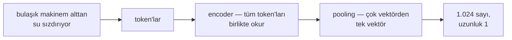

RAG boru hattınızın bir yerinde üzerinde **embed** yazan bir kutu var
ve akıştaki her şey ona körü körüne güveniyor. Bu güveni tuhaf
yollarla kazanıyor: "bulaşık makinem alttan su sızdırıyor" cümlesi,
tek bir ortak kelime taşımadığı tahliye hortumu paragrafını buluyor —
bu, sihir gibi görünüyor. Sonra "sipariş iptal edildi" ile "sipariş
iptal **edilmedi**" neredeyse aynı noktaya düşüyor — bu da bir üretim
kazası gibi görünüyor.

İki davranış da aynı yerden geliyor. Bu yazı o kutuyu açıyor: bir
cümle anlam haritasında nasıl tek noktaya dönüşür, haritayı kim çizdi,
benzerlik puanı gerçekte neyi ölçer, milyonlarca nokta arasından en
yakınları milisaniyede nasıl bulunur, hangi düğme belleği kaliteyle
takas eder — ve geometri nerede kör kalır.

**Bu yazıda**

- [1. Metinden haritadaki noktaya](#1-metinden-haritadaki-noktaya)
- [2. Model neyi nereye koyacağını nasıl öğreniyor](#2-model-neyi-nereye-koyacağını-nasıl-öğreniyor)
- [3. Yakınlığı ölçmek](#3-yakınlığı-ölçmek)
- [4. Milisaniyede komşu bulmak](#4-milisaniyede-komşu-bulmak)
- [5. Maliyet düğmeleri: boyut ve hassasiyet](#5-maliyet-düğmeleri-boyut-ve-hassasiyet)
- [6. Geometrinin kör kaldığı yerler](#6-geometrinin-kör-kaldığı-yerler)
- [7. Kurulumunuz, tek sayfada](#7-kurulumunuz-tek-sayfada)
  - [Hugging Face'ten somut bir kısa liste](#hugging-faceten-somut-bir-kısa-liste)
  - [API çağırmayı tercih ediyorsanız](#api-çağırmayı-tercih-ediyorsanız)
- [Bütün hikâye altı satırda](#bütün-hikâye-altı-satırda)
- [Terimler sözlüğü](#terimler-sözlüğü)
- [Daha derine inmek için](#daha-derine-inmek-için)

## 1. Metinden haritadaki noktaya

Zaten güvendiğiniz bir sistemle başlayalım: renk kodları. Bir renk üç
sayıdır — kırmızı (255, 0, 0), biraz daha sıcak bir kırmızı
(250, 20, 10) — ve *yakın sayılar benzer renkler demektir*; boya
dükkânı bu sayede numunenizi hiçbir insan bakmadan eşleyebilir.

> **Gömme (embedding)** = aynı numaranın anlama uygulanması: metin,
> bir sayı listesine — haritadaki koordinatlarına — dönüşür ve sayılar
> öyle yerleştirilir ki yakın sayılar benzer anlam taşır.

Renge üç sayı yetiyor; anlam daha fazlasını istiyor. Tipik modeller
384 ile 3.072 arasında boyut kullanır; bu yazının örnekleri **1.024**
boyutla çalışacak. [LLM yazısı](post.html?slug=llm-nasil-calisir) bu
haritayı tek kelimeler için göstermişti — *kral*, *kraliçe* ve
aralarındaki oklar. Erişimin ihtiyacı bir sonraki sıçrama: bütün bir
*cümleye* ya da paragrafa tek nokta vermek; soru ile onu cevaplayan
pasaj ancak o zaman komşu olabilir.

O sıçramayı bir **encoder** yapar — metnin tamamını attention'la
okuyan küçük bir transformer; "sızdırıyor" kelimesi böylece "bulaşık
makinesi" ve "alttan" ışığında okunur. İş, iki gösterişsiz adımla
biter: **pooling (havuzlama)**, token başına üretilen vektörleri tek
vektöre indirger (çoğunlukla ortalamalarını alır); normalize etme de o
vektörü uzunluğu 1 olacak şekilde ölçekler — korpustaki her metin
artık aynı kürenin yüzeyinde yaşar:



Bir cümle girer, bir nokta çıkar. İlginç soru mekanikte değil —
noktaların *nereye* gideceğine kimin karar verdiğinde.

## 2. Model neyi nereye koyacağını nasıl öğreniyor

Eksenleri kimse etiketlemez. Harita, çiftlerden öğrenilir; yöntemin
adı **contrastive learning**:

> **Contrastive learning (karşıtlıkla öğrenme)** = birbirine ait
> çiftlerle eğitmek (soru ile onu cevaplayan pasaj, aynı anlama gelen
> iki soru, bir cümle ile çevirisi): her çiftin noktalarını birbirine
> çek, aynı batch'teki diğer her şeyi it.

İnatçı bir organizatörün çizdiği düğün oturma planı gibidir:
konuşması gerekenler aynı masaya düşer, küsler zıt köşelere gider ve
yeterince düğünden sonra oturma düzeninin kendisi sosyal haritaya
dönüşür. Bunu endüstriyel ölçekte tekrarlayın — işin klasik beygiri
all-MiniLM-L6-v2 tam **1,17 milyar çiftle** böyle eğitildi — geometri
anlam olur. "Alttan su sızdırıyor" cümlesi hortum paragrafının yanına
düşer, çünkü milyonlarca gündelik soru, onları cevaplayan resmî
pasajlara doğru çekilmiştir.

Bu eğitim tarifinin içinde üç pratik sonuç saklı:

- **"Benzer"in tanımını eğitim çiftleri koyar.** Soru–cevap
  çiftleriyle eğitilen model, hiç benzeşmeseler bile sorunun ve
  cevabının "benzer" olduğunu öğrenir. Erişimin ihtiyacı olan asimetri
  tam da budur — ama bu *öğrenilmiş* bir özelliktir, doğa kanunu
  değil.
- **Birçok model rol etiketi bekler.** E5 gibi aileler `query:` ve
  `passage:` önekleriyle eğitilir; sorularla belgeler haritaya farklı
  kurallarla yerleşir — model kartı öneklerde *"İngilizce olmayan
  metinler için bile"* ısrar eder. Her ailenin kendi şivesi vardır
  (EmbeddingGemma `task: search result | query:` ister);
  Qwen3-Embedding gibi talimat duyarlı modellerse sorgunun yanına
  serbest bir görev tarifi alır ve bu, %1–5 arası ek kalite getirir.
  Etiketi atlarsanız hiçbir şey çökmez — yerleşimler sessizce
  kötüleşir. Modelinizin kartını okuyun.
- **Harita yalnızca eğitim verisinin gittiği yerde ayrıntılıdır.** Web
  soru-cevaplarıyla büyümüş bir model sizin kılavuz jargonunuzu hiç
  görmemiştir. MTEB liderlik tablosu modelleri kamuya açık testlerde
  sıralar; sizin korpusunuz onlardan biri değil. Kendi alanınızdan
  derlenmiş yüz soru–pasaj çifti, model seçiminde liderlik tablosunu
  yener.

Bu tarifin ürettiği arayıcı **bi-encoder**'dır — sorgu ile belge ayrı
ayrı gömülür, yalnızca nokta olarak buluşurlar. İsabetli ama yavaş
kardeşi **cross-encoder** iki metni birlikte okur; [RAG
yazısı](post.html?slug=hangi-rag-deseni) onu finalistleri yeniden
notlayan hakem olarak kullanıyordu.

## 3. Yakınlığı ölçmek

İki nokta, tek sayı. Standart tercih aradaki açıdır:

> cos(a, b) = a · b ÷ (‖a‖ ‖b‖) — iki vektörün **dot product**'ı (iç
> çarpımı), uzunluklarına bölünür.

Anlamı yön taşır; uzunluk çoğunlukla metnin boyunun ve kelime
seçiminin yan ürünüdür. Kosinüs uzunluğu tasarımı gereği yok sayar;
normalize etme (1. bölüm) zaten uzunlukları 1 yapar — dolayısıyla
pratikte **kosinüs ile dot product aynı sayıdır** ve Öklid uzaklığı
bile komşuları aynı sıraya dizer (birim vektörlerde d² = 2 − 2·cos).
Metrik seçimi önemli gibi ses çıkarır ama nadiren önemlidir; kaliteyi
oynatan, *model* seçimidir.

Görmek için iki boyut yeter. Üç metni haritaya birim vektör olarak
koyalım — sızıntı sorusu **a = (0,6; 0,8)**, hortum paragrafı
**b = (0,8; 0,6)**, bir tarif sayfası **c = (−0,8; 0,6)**:

<svg viewBox="0 0 480 320" role="img" aria-label="Tek orijinden çizilmiş üç birim vektör: 0,6 - 0,8 koordinatındaki sızıntı sorusu a; 0,8 - 0,6 koordinatındaki hortum paragrafı b; eksi 0,8 - 0,6 koordinatındaki tarif sayfası c. a ile b arasındaki küçük yay kosinüs 0,96 etiketini, a ile c arasındaki geniş yay kosinüs 0, doksan derece etiketini taşıyor" style="max-width:100%;height:auto;display:block;margin:var(--sp-5) auto;font-family:var(--font-sans)">
<defs>
<marker id="cos-arr" viewBox="0 0 10 10" refX="8" refY="5" markerWidth="7" markerHeight="7" orient="auto-start-reverse"><path d="M0 0 L10 5 L0 10 z" style="fill:var(--c-accent)"/></marker>
<marker id="cos-arr2" viewBox="0 0 10 10" refX="8" refY="5" markerWidth="7" markerHeight="7" orient="auto-start-reverse"><path d="M0 0 L10 5 L0 10 z" style="fill:var(--c-accent-2)"/></marker>
</defs>
<line x1="30" y1="260" x2="450" y2="260" style="stroke:var(--c-border);stroke-width:1.5"/>
<line x1="240" y1="300" x2="240" y2="40" style="stroke:var(--c-border);stroke-width:1.5"/>
<line x1="240" y1="260" x2="360" y2="100" marker-end="url(#cos-arr)" style="stroke:var(--c-accent);stroke-width:2.5"/>
<line x1="240" y1="260" x2="400" y2="140" marker-end="url(#cos-arr)" style="stroke:var(--c-accent);stroke-width:2.5"/>
<line x1="240" y1="260" x2="80" y2="140" marker-end="url(#cos-arr2)" style="stroke:var(--c-accent-2);stroke-width:2"/>
<path d="M 294 188 A 90 90 0 0 1 312 206" fill="none" style="stroke:var(--c-text-mute);stroke-width:1.5"/>
<path d="M 210 220 A 50 50 0 0 1 270 220" fill="none" style="stroke:var(--c-text-mute);stroke-width:1.5;stroke-dasharray:4 4"/>
<text x="330" y="192" text-anchor="start" style="fill:var(--c-text);font-size:13px">cos = 0,96</text>
<text x="240" y="196" text-anchor="middle" style="fill:var(--c-text-mute);font-size:12px">cos = 0 (90°)</text>
<text x="366" y="92" text-anchor="start" style="fill:var(--c-text);font-size:13px;font-style:italic">a — sızıntı sorusu (0,6; 0,8)</text>
<text x="406" y="136" text-anchor="start" style="fill:var(--c-text);font-size:13px;font-style:italic">b — hortum paragrafı (0,8; 0,6)</text>
<text x="74" y="132" text-anchor="end" style="fill:var(--c-text);font-size:13px;font-style:italic">c — tarif sayfası (−0,8; 0,6)</text>
</svg>

Resmi formülle, her seferinde aynı sırayla sağlayın — önce dot
product, sonra uzunluklar, sonra kosinüs:

> a · b = 0,6×0,8 + 0,8×0,6 = 0,48 + 0,48 = **0,96**
> ‖a‖ = ‖b‖ = √(0,36 + 0,64) = **1**
> cos(a, b) = 0,96 ÷ (1 × 1) = **0,96** — yakın komşular
>
> a · c = 0,6×(−0,8) + 0,8×0,6 = −0,48 + 0,48 = **0**
> cos(a, c) = **0** — dik açı; ortak hiçbir şey yok

Gerçek embedding'ler aynı oyunu iki yerine 1.024 boyutta oynar. Sayıyı
kullanmadan önce tek uyarı: **0,83'lük bir kosinüsün tek başına hiçbir
anlamı yoktur.** Puanlar yalnızca aynı modelin aynı korpustaki puanları
arasında kıyaslanabilir — A modelinin 0,83'ü, B modelinin 0,60'ından
kötü bir eşleşme olabilir; bir eşik değeri model değişimini asla
sağ atlatamaz. Puanlarla sıralayın; puanlara tapmayın.

## 4. Milisaniyede komşu bulmak

Şimdi aynı işi ölçekte yapalım. 1.024 boyutlu float32 vektörlerle bir
milyon parça, 1.000.000 × 1.024 × 4 bayt ≈ **4,1 GB** eder; bir
sorguyu dürüstçe cevaplamaksa bir milyon dot product demektir —
yaklaşık bir milyar çarpma-toplama, tek CPU çekirdeğinde birkaç yüz
milisaniye. On bin vektörde dert değil; on milyon vektör ve gerçek
trafikte felaket.

Vektör veritabanları bu tuzaktan, doğruluktan birazcık vazgeçerek
çıkar:

> **ANN (approximate nearest neighbor — yaklaşık en yakın komşu)
> araması** = en yakın noktaları *neredeyse kesin* bulmak, maliyetin
> küçük bir kesriyle. Ölçüsü **recall**'dur: gerçek top-10'un dizin
> tarafından gerçekten döndürülen payı. Üretim kurulumları çoğunlukla
> %95–99'a ayarlanır.

İşin beygiri **HNSW**'dir (hierarchical navigable small world) ve bir
ülkeyi nasıl geçerseniz öyle gezinir: önce otoyol, sonra caddeler,
sonra sokaklar. Dizin, aynı noktaların birkaç katmanını tutar — üstte
uzun menzilli bağlantılı seyrek bir katman, aşağıda sıklaşan
katmanlar, en altta bütün vektörler. Arama tepeden girer, her adımda
sorguya en yakın komşuya açgözlülükle atlar ve ilerleyemediği anda bir
katman aşağı iner:

<svg viewBox="0 0 480 320" role="img" aria-label="Üst üste üç HNSW katmanı. Otoyollar etiketli seyrek üst katmanda üç düğüm, caddeler etiketli orta katmanda altı düğüm, bütün vektörleri içeren sokaklar etiketli alt katmanda on iki düğüm var. Vurgulu yol sol üstten girer, sağa atlar, orta katmandan aşağı iner ve sağ alttaki hedef noktada biter" style="max-width:100%;height:auto;display:block;margin:var(--sp-5) auto;font-family:var(--font-sans)">
<defs>
<marker id="hnsw-arr" viewBox="0 0 10 10" refX="8" refY="5" markerWidth="7" markerHeight="7" orient="auto-start-reverse"><path d="M0 0 L10 5 L0 10 z" style="fill:var(--c-accent)"/></marker>
</defs>
<g style="stroke:var(--c-border);stroke-width:1.2">
<line x1="90" y1="60" x2="250" y2="60"/><line x1="250" y1="60" x2="390" y2="60"/>
<line x1="70" y1="150" x2="150" y2="150"/><line x1="150" y1="150" x2="230" y2="150"/><line x1="230" y1="150" x2="310" y2="150"/><line x1="310" y1="150" x2="390" y2="150"/>
<line x1="50" y1="240" x2="430" y2="240"/>
</g>
<g style="fill:var(--c-text-mute)">
<circle cx="90" cy="60" r="5"/><circle cx="250" cy="60" r="5"/><circle cx="390" cy="60" r="5"/>
<circle cx="70" cy="150" r="5"/><circle cx="150" cy="150" r="5"/><circle cx="230" cy="150" r="5"/><circle cx="310" cy="150" r="5"/><circle cx="390" cy="150" r="5"/>
<circle cx="50" cy="240" r="4"/><circle cx="85" cy="240" r="4"/><circle cx="120" cy="240" r="4"/><circle cx="155" cy="240" r="4"/><circle cx="190" cy="240" r="4"/><circle cx="225" cy="240" r="4"/><circle cx="260" cy="240" r="4"/><circle cx="295" cy="240" r="4"/><circle cx="330" cy="240" r="4"/><circle cx="365" cy="240" r="4"/><circle cx="400" cy="240" r="4"/><circle cx="430" cy="240" r="4"/>
</g>
<line x1="90" y1="60" x2="244" y2="60" marker-end="url(#hnsw-arr)" style="stroke:var(--c-accent);stroke-width:2.5"/>
<line x1="250" y1="66" x2="310" y2="144" marker-end="url(#hnsw-arr)" style="stroke:var(--c-accent);stroke-width:2.5;stroke-dasharray:6 5"/>
<line x1="310" y1="150" x2="384" y2="150" marker-end="url(#hnsw-arr)" style="stroke:var(--c-accent);stroke-width:2.5"/>
<line x1="390" y1="156" x2="398" y2="234" marker-end="url(#hnsw-arr)" style="stroke:var(--c-accent);stroke-width:2.5;stroke-dasharray:6 5"/>
<circle cx="90" cy="60" r="5" style="fill:var(--c-accent)"/>
<circle cx="400" cy="240" r="6.5" style="fill:var(--c-accent-2)"/>
<text x="90" y="42" text-anchor="middle" style="fill:var(--c-text);font-size:12px">giriş noktası</text>
<text x="400" y="266" text-anchor="middle" style="fill:var(--c-text);font-size:12px">en yakın komşu</text>
<text x="452" y="64" text-anchor="end" style="fill:var(--c-text-mute);font-size:12px">otoyollar</text>
<text x="452" y="130" text-anchor="end" style="fill:var(--c-text-mute);font-size:12px">caddeler</text>
<text x="452" y="296" text-anchor="end" style="fill:var(--c-text-mute);font-size:12px">sokaklar — bütün vektörler</text>
</svg>

Bir milyon karşılaştırma yerine arama birkaç bine dokunur — yaklaşık
bir milisaniye. Genellikle **efSearch** adını taşıyan tek düğme, her
adımda kaç adayın elde tutulacağını belirler: yükseltin, recall
tırmanır ve hız düşer. (Başlıca alternatif **IVF**, haritayı önce
kümelere böler ve yalnızca sorguya en yakın birkaç kümede arar.)

**Bedeli:** çizge, vektörlerin yanında RAM'de yaşar; kurulumu gerçek
zaman alır; silme ve güncelleme hantaldır — dizin bir evdir, beyaz
tahta değil.

## 5. Maliyet düğmeleri: boyut ve hassasiyet

Yukarıdaki 4,1 GB kibar senaryoydu. Onu küçülten iki düğme var ve
ikisi de aynı nedenle çalışır: harita, kalın kaleme dayanır — kapı
numaraları silinse de sokaklar bulunabilir kalır.

Birinci düğme **hassasiyet** — 1.024 sayının her birini daha az bitte
saklamak; adı **quantization (nicemleme)**:

| hassasiyet, 1.024 boyut | vektör başına | 1M vektör | float32'ye göre |
|---|---|---|---|
| float32 | 4.096 B | 4,1 GB | 1× |
| float16 | 2.048 B | 2,0 GB | 2× küçük |
| int8 | 1.024 B | 1,0 GB | 4× küçük |
| binary (boyut başına 1 bit) | 128 B | 128 MB | **32× küçük** |

Standart oyun kabadan inceye gider: büyük aramayı int8 ya da binary
vektörlerde koşun, ilk ~100'ü tam hassasiyetli vektörlerle (ya da bir
cross-encoder'la) yeniden puanlayın. Bu, söylenti değil ölçümdür:
Hugging Face'in embedding quantization yazısının arkasındaki
sentence-transformers deneylerinde int8 artı yeniden puanlama, erişim
kalitesinin **~%99'unu** 3,7× hızlanmayla korudu; binary ise
**~%96'sını** 24,8× hızlanma ve belleğin 1/32'siyle korudu.

İkinci düğme **boyut sayısı**. **Matryoshka embeddings**, bilgi öne
yığılacak biçimde eğitilir — iç içe geçen bebekler gibi: ilk
koordinatlar anlamın en kabasını taşır, sonrakiler inceltir. Böylece
1.024 boyutu 256'ya kırpmak, aynı modelden ve yeniden eğitim olmadan,
maliyetin dörtte biriyle kalitenin çoğunu korur. Hugging Face'in
deneyinde Matryoshka ile eğitilmiş bir model, boyutların yalnızca
**%8,3'üyle** performansının **%98,4'ünü** korudu; standart model aynı
kırpmada daha çok düştü. Üretimdeki modeller bu düğmeyle geliyor:
EmbeddingGemma 768 boyutu 512, 256 ya da 128'e kırpılabilir sunar;
Qwen3-Embedding 1.024'ten 32'ye kadar iner.

İki düğme artık büyük API'lerin arkasında da duruyor. OpenAI'ın
text-embedding-3-large modeli varsayılan olarak 3.072 boyutla gelir
ama bir `dimensions` argümanı alır ve öne yığma gerçektir: 256'ya
kırpılmış hali, önceki neslin ada-002'sini 1.536 boyutun tamamını
kullanırken bile geçer. Voyage'ın API'si ise *öbür* düğmeyi çevirir —
`output_dtype` parametresi int8 ya da binary vektörleri hiçbir ek
işlem gerektirmeden doğrudan döndürür. Boyut düğmesinde saygı
gösterilecek iki sınır var: kabaca 256 boyutun altında erişim
kalitesi çoğu derlem için gözle görülür biçimde düşer; 3.072'ye
tırmanmak ise dört kat depolama karşılığında ancak marjinal kazanç
getirir. 512 ile 1.024 arasını rahat orta yol yapan da budur.

İki düğmenin arkasındaki kural: **kalite saklama biçiminde değil,
modelde yaşar.** int8'e nicemlenmiş güçlü bir model, tam float32'deki
zayıf bir modeli yener — parayı modele, tasarrufu baytlara yapın.

## 6. Geometrinin kör kaldığı yerler

Buraya kadarki her şey sihri açıklıyor. Aynı tasarım kazaları da
açıklar — dört tane var ve her biri [RAG
yazısındaki](post.html?slug=hangi-rag-deseni) bir tedaviyi işaret
ediyor:

- **Olumsuzlama.** "Sipariş iptal edildi" ile "sipariş iptal
  **edilmedi**" neredeyse bütün kelimeleri ve konuyu paylaşır; iki
  nokta üst üste biner. Contrastive eğitim konu eşleşmesini
  ödüllendirdi; olumluluk-olumsuzluk ibreyi zar zor oynatır.
  Evet-hayır ayrımını asla haritaya emanet etmeyin; cross-encoder bir
  reranker, bunu yakalayacak kadar yakından okur.
- **Nadir birebir token'lar.** "E24 hatası" haritaya *genel olarak
  beyaz eşya arızası* diye gömülür; kodun kendisi bir yön edinemeyecek
  kadar nadirdir ve genel bakış bölümü E24 maddesini geçer. Bu, yoğun
  aramanın birebir körlüğüdür — hybrid erişimin BM25 gibi sözcüksel
  bir arayıcıyı yarışta tutmasının nedeni.
- **Sürümler, tarihler, kitleler.** 2021 kılavuzu ile 2024 kılavuzu
  neredeyse aynı kelimeleri söyler, yan yana otururlar — benzerlik de
  yanlış yılı seve seve servis eder. Geçerlilik haritada yoktur;
  metadata filtering onu arama koşmadan önce denetler.
- **Uzun metin.** 1.024 token'lık, on konulu bir bölümü tek noktaya
  gömerseniz on anlamın ortalamasını alırsınız — hiçbir şeyin yakınına
  düşmeyen bir bulanık. Chunking bu seyrelme yüzünden var; small-to-big
  gibi desenlerin küçük birimle arayıp büyük birimle okutması da
  bundan.

İkinci kaza kendi sözcük dağarcığını hak ediyor, çünkü erişimi iki
okula ayırır:

> **Dense vs sparse (yoğun ve seyrek)** = dense bir embedding, 1.024
> boyutunun tamamını öğrenilmiş değerlerle doldurur — saf anlam,
> birebir kelime yok. Sparse bir vektör (BM25, TF-IDF) ise sözcük
> dağarcığındaki her kelimeye bir hücre ayırır ve neredeyse hepsi
> sıfırdır — birebir kelime var, anlam yok.

Bu yazıdaki her şey dense okuldur. Sparse okul E24 ile E25'i asla
karıştırmaz — ama "sızdırıyor" ile "damlatıyor"un aynı şikâyet
olduğunu da asla fark etmez. Her biri tam olarak diğerinin gördüğü
yerde kördür; hybrid erişimin ikisini birden koşturup listeleri bir
hakeme birleştirtmesi bundandır.

Bunların hiçbiri yamalanacak bug değil. Harita, contrastive eğitimin
ödüllendirdiği şeyi — konu benzerliğini — kodlar, başka hiçbir şeyi
kodlamaz. RAG yazısındaki desenler bozuk bir aletin geçici çözümleri
değildir; eksik duyuların bilinçli olarak sonradan takılmasıdır.

## 7. Kurulumunuz, tek sayfada

Üretimle temasa dayanan varsayılanlar, sırasıyla:

1. **Modeli kendi verinizle seçin.** Alanınızdan ~100 gerçek
   soru–pasaj çifti derleyip isabet oranını ölçün; MTEB liderlik
   tablosunu kısa liste yapıcı sayın, hakem değil.
2. **Model kartındaki önekleri uygulayın** (`query:` / `passage:` ya
   da talimat biçimi) — satın alabileceğiniz en ucuz kalite budur.
3. **Normalize edin ve kosinüs kullanın.** Metrik tartışması bir
   dikkat dağıtıcıdır; bir kez karara bağlayın.
4. **768–1.024 boyutla başlayın.** Yukarısına yalnızca kendi
   ölçümleriniz söylediğinde çıkın; maliyet bastırdığında Matryoshka
   ile aşağı inin.
5. **HNSW varsayılanlarıyla gidin** — kabaca bir milyon vektörü
   geçene ya da gecikme şikâyet edene dek; sonra efSearch'ü ölçülmüş
   recall'a karşı ayarlayın.
6. **RAM faturaya dönüştüğünde nicemleyin** — önce int8; ciddi
   ölçekte binary artı tam hassasiyetli yeniden puanlama.

### Hugging Face'ten somut bir kısa liste

Karşılaştırmaya başlanacak adlar — kısa liste, karar değil; kararı
kendi yüz çiftiniz verir:

| model | parametre | boyut | bağlam | mesele |
|---|---|---|---|---|
| all-MiniLM-L6-v2 | 22,7M | 384 | 256 | yalnız İngilizce hız klasiği; 1,17 milyar çiftle eğitildi; prototip için ideal |
| EmbeddingGemma | 308M | 768 → 128 | 2.048 | cihaz üstünde 100+ dil; nicemlenince 200 MB RAM'in altı |
| multilingual-e5-large | ~560M | 1.024 | 512 | Türkçe dahil 94 dil; `query:` / `passage:` zorunlu |
| BGE-M3 | ~570M | 1.024 | 8.192 | tek modelden dense + sparse + multi-vector; önek istemez |
| Qwen3-Embedding-0.6B | 0,6B | 1.024 → 32 | 32.768 | talimat duyarlı, Apache 2.0; 8B kardeşi açık MTEB çok dilli tablosunun lideri |

Ve bütün yazı, beş satır sentence-transformers olarak:

```python
from sentence_transformers import SentenceTransformer

model = SentenceTransformer("intfloat/multilingual-e5-large")
docs = model.encode([f"passage: {p}" for p in pasajlar], normalize_embeddings=True)
query = model.encode("query: bulaşık makinem alttan su sızdırıyor", normalize_embeddings=True)
scores = query @ docs.T  # normalize edildi, yani bu dot product kosinüsün kendisi
```

Her argüman bu yazının bir bölümüdür: model adı 2. bölümün eğitim
verisi kararıdır, önekler model kartından gelir ve son satırdaki dot
product'ı kosinüse çeviren şey `normalize_embeddings=True`'dur.

### API çağırmayı tercih ediyorsanız

Kurallar aynı; yalnızca adlar değişiyor. **OpenAI**'ın
text-embedding-3-small (1.536 boyut) ve text-embedding-3-large
(3.072 boyut — MTEB'de %64,6'ya karşı ada-002'nin %61,0'ı)
modelleri, Matryoshka düğmesini istekteki `dimensions` parametresi
olarak sunar ve vektörleri uzunluğu 1'e normalize edilmiş döndürür;
yani 3. bölümdeki her şey olduğu gibi geçerlidir. Nesil farkı en çok
İngilizcenin dışında açılıyor: çok dilli MIRACL kıyaslamasında
ada-002'den 3-large'a geçiş, puanı %31,4'ten %54,9'a sıçratır —
derleminiz Türkçeyken bilinmeye değer. Kendi embedding
modeli bulunmayan Anthropic'in dokümanlarının işaret ettiği sağlayıcı
olan **Voyage AI**, voyage-4 ailesini 32.000 token bağlam ve 256'ya
kadar kırpılabilen 1.024 varsayılan boyutla servis eder; int8 ve
binary çıktı API'ye yerleşiktir, hukuk, kod ve finans için alana
özel sürümler de vardır. 2. bölümün rol etiketleri bile bu
yolculuktan sağ çıkar: Voyage'ın `input_type="query"` /
`"document"` parametresi, E5'in size elle yazdırdığı türden bir
öneki metnin başına sessizce ekler. Hakem kuralı da olduğu yerde
durur — kazananı satıcının kıyaslama tablosu değil, kendi yüz
soru–pasaj çiftiniz seçer.

Kaçırılanlar olumsuzlamalar, kodlar, sürümler ya da uzun bulanık
parçalarsa — bu bir ayar sorunu değildir. [RAG karar
rehberine](post.html?slug=hangi-rag-deseni) gidin ve eksik duyuyu geri
takan deseni seçin.

## Bütün hikâye altı satırda

1. Embedding, öğrenilmiş bir anlam haritasındaki noktadır — yakın
   noktalar benzer anlam demektir, tıpkı yakın RGB kodlarının benzer
   renkler olması gibi.
2. Haritayı contrastive eğitim çizdi: birbirine ait çiftler çekildi,
   gerisi itildi — "benzer", eğitim çiftlerinin söylediğinden ne bir
   eksik ne bir fazladır.
3. Yakınlık kosinüstür — normalize vektörlerde düpedüz dot product —
   ve puanlar yalnızca *aynı modelin içinde* anlam taşır.
4. Ölçekte HNSW, her noktaya bakmak yerine otoyol → cadde → sokak
   rotasında gezinerek yaklaşık bir milisaniyede cevap verir.
5. Belleğin iki düğmesi var: hassasiyet ve boyut. Kalite modelde
   yaşar; baytları nicemleyin, modeli güçlü tutun.
6. Harita olumsuzlamaya, nadir kodlara, sürümlere ve uzun bulanık
   metinlere kördür — RAG desenleri, sonradan takılan duyulardır.

Açılıştaki iki cümleye dönün: sızıntı sorusu paragrafını buldu, çünkü
milyonlarca eğitim çifti haritaya soruların cevaplarının yanına ait
olduğunu öğretti. İptal edilen sipariş kendi olumsuzuyla eşleşti,
çünkü haritaya buna aldırmayı kimse öğretmedi. Aynı kutu, aynı
geometri — artık hangi yarısına güveneceğinizi biliyorsunuz.

## Terimler sözlüğü

Yazının temel sözcük dağarcığı, her biri tek satırda:

- **gömme (embedding)** — bir metnin anlamını haritada bir noktaya yerleştiren sayı listesi; yakın noktalar, benzer anlam.
- **encoder** — metni okuyup embedding'ini üreten transformer.
- **pooling (havuzlama)** — encoder'ın token başına ürettiği vektörleri, metnin tamamı için tek vektöre indirgemek.
- **normalize etme (normalization)** — vektörü uzunluğu 1 olacak şekilde ölçeklemek; bilgiyi yalnızca yön taşır.
- **dot product (iç çarpım)** — eşleşen koordinatları çarpıp toplamak; normalize vektörlerde kosinüsün ta kendisi.
- **kosinüs benzerliği (cosine similarity)** — yakınlığı iki vektör arasındaki açıyla ölçmek: 1 aynı yön, 0 ilgisiz.
- **contrastive learning (karşıtlıkla öğrenme)** — eşleşen çiftleri birbirine çekip eşleşmeyenleri iten eğitim.
- **bi-encoder / cross-encoder** — sorguyla belgeyi ayrı ayrı gömer (hızlı, ölçeklenir) / birlikte okur (isabetli, yavaş).
- **dense / sparse vektör (yoğun / seyrek)** — her boyutu öğrenilmiş değer taşır (anlam var, birebir kelime yok) / sözcük başına bir hücre, çoğu sıfır (birebir kelime var, anlam yok).
- **ANN (approximate nearest neighbor)** — yaklaşık en yakın komşu araması: en yakın noktaları neredeyse kesin, maliyetin kesriyle bulmak.
- **recall** — gerçek en yakın komşuların, dizinin gerçekten döndürdüğü payı.
- **HNSW** — otoyoldan sokağa inilerek aranan katmanlı çizge dizini; sektör varsayılanı.
- **efSearch** — HNSW'nin ana düğmesi: adım başına tutulan aday sayısı; fazlası recall, azı hız getirir.
- **IVF** — kümeleme alternatifi: haritayı böl, yalnızca en yakın kümelerde ara.
- **quantization (nicemleme)** — her koordinatı daha az bitte saklamak (float32 → int8 → binary); belleği küçültür.
- **Matryoshka embeddings** — bilgisi öne yığılı eğitilmiş embedding'ler; boyut kırpıldıkça kalite zarifçe azalır.
- **MTEB** — kamuya açık embedding kıyaslama takımı; kısa liste yapar, kendi test kümenizin yerini tutmaz.

## Daha derine inmek için

- Mikolov vd., [Efficient Estimation of Word Representations in Vector Space](https://arxiv.org/abs/1301.3781) (2013) — word2vec; kral − erkek + kadın = kraliçe kültüre buradan girdi.
- Reimers & Gurevych, [Sentence-BERT: Sentence Embeddings using Siamese BERT-Networks](https://arxiv.org/abs/1908.10084) (2019) — modern cümle-embedding tarifi.
- Wang vd., [Text Embeddings by Weakly-Supervised Contrastive Pre-training](https://arxiv.org/abs/2212.03533) (2022) — E5 ve `query:` / `passage:` önekleri.
- Malkov & Yashunin, [Efficient and robust approximate nearest neighbor search using Hierarchical Navigable Small World graphs](https://arxiv.org/abs/1603.09320) (2016) — HNSW makalesi.
- Kusupati vd., [Matryoshka Representation Learning](https://arxiv.org/abs/2205.13147) (2022).
- Muennighoff vd., [MTEB: Massive Text Embedding Benchmark](https://arxiv.org/abs/2210.07316) (2022) — canlı [liderlik tablosu](https://huggingface.co/spaces/mteb/leaderboard) Hugging Face'te yaşıyor.
- Hugging Face blogu, [Binary and Scalar Embedding Quantization](https://huggingface.co/blog/embedding-quantization) — ~%99 / ~%96 koruma sayılarının kaynağı, kodlarıyla.
- Hugging Face blogu, [Introduction to Matryoshka Embeddings](https://huggingface.co/blog/matryoshka) — boyutların %8,3'üyle %98,4 deneyi.
- Hugging Face blogu, [Welcome EmbeddingGemma](https://huggingface.co/blog/embeddinggemma) — cihaz üstü çok dilli embedding modeli, kendi önek şivesiyle.
- OpenAI, [Embeddings guide](https://developers.openai.com/api/docs/guides/embeddings) — `dimensions` parametresi, model karşılaştırması ve kırpılmış-3-large-tam-ada'yı-geçer iddiası.
- Anthropic, [Embeddings](https://platform.claude.com/docs/en/build-with-claude/embeddings) — neden Voyage AI'ı işaret ettikleri; `input_type` ve nicemleme örnekleriyle.
- Inkeep, [Embeddings](https://inkeep.com/glossary/embeddings) — uygulayıcı gözüyle bir sözlük maddesi: üretimdeki anlamsal aramada boyut aralıkları ve maliyet takasları.
- [sentence-transformers](https://sbert.net) — bu yazıdaki kod parçasının ve yukarıdaki modellerin çoğunun arkasındaki kütüphane.
- Bu blogda: [LLM'ler nasıl çalışır](post.html?slug=llm-nasil-calisir) — bu yazının uzaklaştığı token düzeyindeki harita — ve [hangi RAG desenine ihtiyacınız var](post.html?slug=hangi-rag-deseni) — geometri kör kaldığında yapılacaklar.
