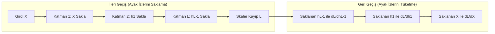

8 GPU'lu modern bir kümede büyük ölçekli bir model eğitimi başlattığınızda donanım izleme panellerinde çok çarpıcı bir olgu dikkat çeker. İleri geçiş (forward pass) sırasında GPU yüksek bant genişlikli belleği (VRAM) her katmanda adım adım artar; ancak nihai kayıp (loss) hesaplanıp geriye yayılım (backward pass) başladığı anda bellek kullanımı aniden tepe noktasına fırlar ve sıklıkla ölümcül Bellek Yetersizliği (OOM - Out of Memory) çöküşlerini tetikler.

İleri geçiş yalnızca veriyi katmanlar boyunca ileriye taşımaksa, geriye yayılım neden GPU belleğini adeta rehin alır?

Bu sorunun cevabı çok değişkenli zincir kuralının (multivariable chain rule) temel cebirsel şartında gizlidir: **Bir katmanın ağırlıklarına göre gradyan hesaplayabilmek için, o katmana ileri geçiş sırasında giren tam aktivasyon değerlerini bilmek zorundasınız.** $Z = X W + b$ doğrusal katmanında ağırlık gradyanı $\frac{\partial \mathcal{L}}{\partial W} = X^T \frac{\partial \mathcal{L}}{\partial Z}$ formülüyle hesaplanır. İleri geçiş aktivasyon tensörü $X$ silinemez, üzerine yazılamaz veya bellekten atılamaz; geriye yayılım o katmana geri dönene kadar GPU belleğinde saklanmak (stashed) zorundadır.

Geriye Yayılım (Backpropagation) ve Otomatik Türev (Autodiff), modern yapay sinir ağlarını ayakta tutan iki temel mühendislik motorudur. Onlar olmasaydı, milyarlarca parametreli derin ağlarda gradyan hesaplamak ya sayısal türevin (numerical differentiation) sonsuz hesaplama girdabına ya da sembolik türevin (symbolic differentiation) bellek patlamasına saplanırdı. Bu yazı, ters-yönlü otomatik türevin hesaplama çizgesi (DAG) temellerini inceliyor; yoğun katmanları yöneten matris kalkülüsünü adım adım türetiyor; Gradient Checkpointing tekniğinin %30 hesaplama maliyeti karşılığında bellek tüketimini nasıl %70 azalttığını çözümlüyor ve elle yapılan tam bir tensör geri yayılımını doğrulanabilir kodlarla sunuyor.

**Bu yazıda**

- [1. En yalın hâliyle temel sezgi: Geri geçiş neden iki kat bellek tüketir?](#1-en-yalın-hâliyle-temel-sezgi-geri-geçiş-neden-iki-kat-bellek-tüketir)
- [2. Türev alma yöntemleri: Sayısal, sembolik ve otomatik türev](#2-türev-alma-yöntemleri-sayısal-sembolik-ve-otomatik-türev)
- [3. Hesaplama çizgesi ve ters-yönlü topolojik sıralama](#3-hesaplama-çizgesi-ve-ters-yönlü-topolojik-sıralama)
- [4. Yoğun katmanların tensör kalkülüsü: Ağırlıklar, biaslar ve aktivasyonlar](#4-yoğun-katmanların-tensör-kalkülüsü-ağırlıklar-biaslar-ve-aktivasyonlar)
- [5. Bellek darboğazları ve Gradient Checkpointing](#5-bellek-darboğazları-ve-gradient-checkpointing)
- [6. Adım adım elle sayısal tensör yürüyüşü](#6-adım-adım-elle-sayısal-tensör-yürüyüşü)
- [7. İki mühendislik gözü: Eğitim ve çıkarım dinamikleri](#7-iki-mühendislik-gözü-eğitim-ve-çıkarım-dinamikleri)
- [8. Python ve PyTorch ile doğrulama](#8-python-ve-pytorch-ile-doğrulama)
- [Bütün hikâye altı satırda](#bütün-hikâye-altı-satırda)
- [Terimler sözlüğü](#terimler-sözlüğü)
- [Daha derine inmek için](#daha-derine-inmek-için)

---

## 1. En yalın hâliyle temel sezgi: Geri geçiş neden iki kat bellek tüketir?

### Dedektif ve Ayak İzleri Analojisi

Geriye yayılımın neden devasa bir bellek gerektirdiğini anlamak için bir adli tıp soruşturmasını hayal edin.

İleri geçiş sırasında veri suç mahallinden (girdi tensörü) başlar, bir dizi odadan (katmanlar) geçer ve her odada yere ayak izleri (ara aktivasyonlar) bırakarak nihai sonuca (kayıp) ulaşır.

Eğer amaç yalnızca sonucu raporlamak olsaydı (çıkarım / inference), dedektif bir odadan diğerine geçerken arkasında bıraktığı tüm odaların zeminini anında yıkayıp temizleyebilirdi. Ancak eğitimde amaç **sorumluluk tespiti (attribution)** yapmaktır: Hatanın ne kadarı hangi odadaki hangi maniveladan (ağırlıklar) kaynaklandı?

Dedektif 2. odadaki bir manivelanın nihai hataya katkısını ölçmek için 100. odadan 1. odaya doğru **geriye doğru yürümek** zorundadır. Daha da önemlisi, o manivelanın suç anındaki mekanik etkisini hesaplayabilmek için manivelaya basıldığı andaki tam ayak izini incelemesi şarttır. Eğer zemin ileri geçiş sırasında temizlendiyse sorumluluk tespiti imkânsız hale gelir.



### Doğrusal Katmanın Bellek Deposu ($X^T dZ$)

Matematiksel olarak bir mini-batch üzerinde çalışan tek bir doğrusal dönüşümü ele alalım:

$$Z = X W + b$$

Burada $X \in \mathbb{R}^{B \times d_{\text{in}}}$, $W \in \mathbb{R}^{d_{\text{in}} \times d_{\text{out}}}$ ve $b \in \mathbb{R}^{1 \times d_{\text{out}}}$.

Geriye yayılım sırasında yukarıdaki katmandan gelen hata hassasiyeti $dZ = \frac{\partial \mathcal{L}}{\partial Z}$ ulaştığında, kaybın $W$ parametre matrisine göre gradyanı şu şekilde hesaplanır:

$$\frac{\partial \mathcal{L}}{\partial W} = X^T \cdot dZ$$

Buradaki kritik mimari bağımlılığa dikkat edin:
* $\frac{\partial \mathcal{L}}{\partial W}$ gradyanı, $X^T$ ile $dZ$ tensörlerinin matris çarpımını zorunlu kılar.
* $X$ tensörü ise **ileri geçiş sırasında üretilmiş olan** aktivasyon matrisidir.
* Bu nedenle çalışma zamanı $Z$'yi ürettiği anda $X$'i bellekten silemez. $X$ tensörü, sonraki tüm katmanların ileri geçişi boyunca ve geriye yayılım tekrar o katmana dönene kadar GPU belleğinde (HBM) saklanmak zorundadır.

32 katmanlı bir modelde 1. katmanın aktivasyonları; 2'den 32'ye kadar olan tüm ileri hesaplama ve 32'den 2'ye kadar olan tüm geri hesaplama boyunca VRAM'de yer tutar. Bu zorunlu depo, model parametrelerinin kendisinden 4 ila 10 kat daha fazla bellek tüketen **aktivasyon belleği (activation memory)** darboğazının temel nedenidir.

---

## 2. Türev alma yöntemleri: Sayısal, sembolik ve otomatik türev

Ters-yönlü otomatik türev standart hale gelmeden önce bilgisayar bilimleri iki klasik yaklaşıma dayanıyordu: sayısal türev ve sembolik türev.

### Sayısal Türev (Sonlu Farklar)

En temel yöntem, türevin limit tanımını sonlu adımlarla yaklaşık olarak hesaplamaktır:

$$\frac{\partial f(x)}{\partial x_i} \approx \frac{f(x + \epsilon e_i) - f(x)}{\epsilon}$$

Burada $e_i$ ilgili parametrenin birim vektörü, $\epsilon \approx 10^{-7}$ ise küçük bir adımdır.

Basit olmasına karşın bu yöntem derin öğrenmede tamamen imkânsızdır:
1. **$O(N)$ İleri Geçiş Maliyeti:** Eğer modelde $N = 7{,}000{,}000{,}000$ (7 milyar) parametre varsa, tek bir gradyan vektörünü hesaplamak için ağın $N + 1$ kez baştan sona ileri besleme yapması gerekir. Tek bir eğitim adımı yıllar sürer.
2. **Sayısal Kararsızlık:** $\epsilon$ seçimi iki ucu keskin bir bıçaktır: büyük $\epsilon$ kesme hatası (truncation error) yaratır, küçük $\epsilon$ ise kayan noktalı sayılarda basamak silinmesi (roundoff cancellation) ile gradyanı anlamsız gürültüye boğar.

### Sembolik Türev

Sembolik türev (Mathematica veya SymPy gibi sistemlerdeki yaklaşım), cebirsel kuralları matematiksel ayrıştırma ağaçlarına uygulayarak analitik kapalı formüller türetir.

Matematiksel olarak kesin olsa da sembolik türev **ifade patlaması (expression swelling)** tuzağına düşer. 100 katmanlı iç içe geçmiş bir $f_{100}(f_{99}(\dots f_1(x)))$ fonksiyonunda türev alındığında, zincir kuralının açılımı milyonlarca yinelenen alt terim üreterek bellek ve derleyici kaynaklarını tüketir.

### Otomatik Türev (Autodiff)

Otomatik türev, fonksiyonu ne sayısal olarak yaklaştırır ne de sembolik formüllerle açar; bunun yerine **her temel kayan noktalı işlemle birlikte o işlemin analitik türev değerini de anlık olarak yürütür**.

Bir bilgisayar programı ne kadar karmaşık olursa olsun, donanım seviyesinde toplama, çarpma, üst alma ve trigonometrik işlemler gibi ilkel adımlardan oluşur. Otomatik türev her ilkel işlemde zincir kuralını yerel olarak işleterek, ileri geçişin sabit bir katı sürede ($O(1)$ çarpanıyla) makine duyarlılığında kesin türevler üretir.

| Türev Yöntemi | Matematiksel Temel | Hesaplama Karmaşıklığı ($N$ girdi, $M$ çıktı) | Sayısal Duyarlılık | Derin Öğrenmedeki Temel Engeli |
| :--- | :--- | :--- | :--- | :--- |
| **Sayısal** | Sonlu farklar bölümü | $O(N)$ ileri geçiş | Düşük (basamak silinmesi) | İmkânsız maliyet ($7\times 10^9$ ileri geçiş) |
| **Sembolik** | Cebirsel yeniden yazma | İfadeye bağlı | Kesin | İfade patlaması (bellek tükenmesi) |
| **İleri-Yönlü AD** | Dual sayılar ($\epsilon^2 = 0$) | $O(N)$ ileri geçiş | Makine duyarlılığında kesin | $N \gg M$ durumunda verimsiz ($N$ parametre, $1$ kayıp) |
| **Ters-Yönlü AD** | Hesaplama çizgesi (DAG) ters geçişi | **$O(M)$ geçiş** ($1$ geri geçiş!) | Makine duyarlılığında kesin | Yüksek bellek (aktivasyonları saklama zorunluluğu) |

### Boyutsal Asimetri: Neden Ters-Yönlü Türev Kazanır?

Otomatik türev iki simetrik çalışma biçimine sahiptir:
1. **İleri-Yönlü Otomatik Türev (Forward-Mode AD):** Fonksiyon hesaplanırken türevleri de girdiden çıktıya doğru ileri taşır. $f: \mathbb{R}^N \to \mathbb{R}^M$ fonksiyonunda tüm Jacobian matrisini çıkarmak için $O(N)$ geçiş gerekir.
2. **Ters-Yönlü Otomatik Türev (Reverse-Mode AD / Backpropagation):** Önce ileri geçiş yaparak değerleri hesaplar ve hesaplama çizgesini kurar; ardından çıktıdan girdilere doğru geriye yürür. $O(M)$ geçiş gerektirir.

Derin yapay sinir ağlarında aşırı bir boyutsal asimetri vardır:
* Girdi / Parametre sayısı: $N \approx 10^6 - 10^{11}$ (milyonlarca veya milyarlarca).
* Çıktı sayısı: $M = 1$ (tek bir skaler kayıp değeri $\mathcal{L}$).

$M = 1$ olduğu için, **ters-yönlü otomatik türev tek bir geri geçişle milyarlarca parametrenin tamamının gradyanını hesaplar**; bu işlem ileri geçişin yalnızca yaklaşık 2 katı hesaplama maliyetine denk gelir.

---

## 3. Hesaplama çizgesi ve ters-yönlü topolojik sıralama

PyTorch ve modern derin öğrenme motorları hesaplamaları bir **Yönlü Çevrimsiz Çizge (DAG - Directed Acyclic Graph)** olarak modeller.

### Düğümler ve Kenarlar

PyTorch'un dinamik hesaplama çizgesinde:
* **Kenarlar:** Çok boyutlu tensörleri temsil eder.
* **Düğümler:** İlkel matematiksel işlemleri (`grad_fn` veya `torch.autograd.Node`) temsil eder (örneğin `MmBackward0`, `AddBackward0`, `ReluBackward0`).

Kodunuzda `z = x @ w + b` yazdığınızda PyTorch ileri besleme tensör çekirdeklerini çalıştırır ve çizgeye dinamik bir işlem düğümü ekler. Bu düğüm:
1. Kendisini oluşturan $x, w$ ve $b$ tensörlerinin ebeveyn düğüm işaretçilerini tutar.
2. Matris çarpımı ve yayınlama (broadcasting) toplama işlemlerinin türev fonksiyonlarını saklar.
3. Geri geçiş için gerekli olan ara tensörleri dondurur (`node.save_for_backward`).

```
İleri Hesaplama Akışı:
  x, W  -----> [ MmBackward0 ] -----> a
  a, b  -----> [ AddBackward0 ] ----> z -----> [ ReluBackward0 ] -----> h
```

### Çok Değişkenli Zincir Kuralı ve Gradyan Birikimi

Bir tensör birden fazla yola ayrılıp nihai kaybı farklı kollardan etkilediğinde, o tensöre gelen toplam türev **tüm kolların toplamıdır**:

$$\frac{\partial \mathcal{L}}{\partial x} = \sum_{j \in \text{Çocuklar}(x)} \frac{\partial \mathcal{L}}{\partial z_j} \cdot \frac{\partial z_j}{\partial x}$$

PyTorch parametrelerinin geriye yayılım sırasında gradyanları doğrudan atamak yerine üzerine ekleyerek biriktirmesinin (`param.grad += grad`) sebebi bu çok değişkenli zincir kuralıdır.

Bunun en somut mimari örneği **Residual Bağlantıdır** ($y = x + F(x)$). $x$ tensörü hem doğrudan kimlik toplamına hem de $F(x)$ alt bloğuna girdiği için gelen gradyan iki kola ayrılır ve toplanır:

$$\frac{\partial \mathcal{L}}{\partial x} = \frac{\partial \mathcal{L}}{\partial y} \cdot \frac{\partial y}{\partial x} = \frac{\partial \mathcal{L}}{\partial y} \left( \mathbf{I} + \frac{\partial F(x)}{\partial x} \right) = \frac{\partial \mathcal{L}}{\partial y} + \frac{\partial \mathcal{L}}{\partial y} \frac{\partial F(x)}{\partial x}$$

### Ters-Yönlü Topolojik Sıralama

Çok değişkenli zincir kuralının doğru çalışabilmesi için, **bir tensöre giden tüm alt akış gradyanlarının tamamen toplanmış olması, o tensörün kendi ebeveynlerine gradyan aktarmasından önce garanti edilmelidir**.

Bunu sağlamak için autograd motoru çizge üzerinde **topolojik sıralama (topological sort)** uygular:
1. Kök düğümden ($\mathcal{L}$) başlar.
2. Derinlik öncelikli arama (DFS) ile tüm düğümleri doğrusal bir topolojik sıraya dizer.
3. Bu sırayı tersine işleterek her düğümün kendi yerel Vektör-Jacobian Çarpımını (VJP) çalıştırmasını ve gradyanları ebeveynlerine kusursuz bir sırayla dağıtmasını sağlar.

---

## 4. Yoğun katmanların tensör kalkülüsü: Ağırlıklar, biaslar ve aktivasyonlar

Autograd kütüphanelerinin motor odasında nelerin döndüğünü kavramak için standart bir mini-batch tam bağlantılı (dense) katmanın matris kalkülüsünü türetelim.

### İleri Formülasyon

Tanımlar:
* Girdi batch'i: $X \in \mathbb{R}^{B \times d_{\text{in}}}$
* Ağırlık matrisi: $W \in \mathbb{R}^{d_{\text{in}} \times d_{\text{out}}}$
* Bias vektörü: $b \in \mathbb{R}^{1 \times d_{\text{out}}}$
* Ön-aktivasyon çıktısı: $Z = X W + \mathbf{1}_B b \in \mathbb{R}^{B \times d_{\text{out}}}$
* Aktive edilmiş çıktı: $A = \phi(Z) \in \mathbb{R}^{B \times d_{\text{out}}}$

Burada $\mathbf{1}_B$, $B$ boyutunda birlerden oluşan bir sütun vektörüdür ve bias değerinin batch boyunca yayınlanmasını (broadcasting) ifade eder.

### Geri Türevler

Yukarıdaki katmandan gelen hata gradyanı:

$$dA = \frac{\partial \mathcal{L}}{\partial A} \in \mathbb{R}^{B \times d_{\text{out}}}$$

#### 1. Ön-Aktivasyon Gradyanı ($dZ$)
Aktivasyon fonksiyonu $\phi$ üzerinden eleman bazlı zincir kuralı:

$$dZ = \frac{\partial \mathcal{L}}{\partial Z} = dA \odot \phi'(Z) \in \mathbb{R}^{B \times d_{\text{out}}}$$

Burada $\odot$ Hadamard (eleman bazlı) çarpımıdır.

#### 2. Ağırlık Gradyanı ($\frac{\partial \mathcal{L}}{\partial W}$)
Skaler kaybın tek bir $W_{ij}$ ağırlığına göre türevini bulmak için $W_{ij}$'ye bağımlı olan ön-aktivasyon elemanlarına bakalım:

$$Z_{b, j} = \sum_{k=1}^{d_{\text{in}}} X_{b, k} W_{k, j} + b_j \implies \frac{\partial Z_{b, j}}{\partial W_{ij}} = X_{b, i}$$

Tüm batch örnekleri $b \in \{1, \dots, B\}$ üzerinden topladığımızda:

$$\frac{\partial \mathcal{L}}{\partial W_{ij}} = \sum_{b=1}^B \frac{\partial \mathcal{L}}{\partial Z_{b, j}} \frac{\partial Z_{b, j}}{\partial W_{ij}} = \sum_{b=1}^B X_{b, i} \cdot dZ_{b, j} = \sum_{b=1}^B (X^T)_{i, b} \cdot dZ_{b, j}$$

Kompakt matris gösterimiyle:

$$\frac{\partial \mathcal{L}}{\partial W} = X^T \cdot dZ$$

Boyut kontrolü: $(d_{\text{in}} \times B) \times (B \times d_{\text{out}}) = d_{\text{in}} \times d_{\text{out}}$. Boyutlar $W$ ile birebir eşleşir.

#### 3. Bias Gradyanı ($\frac{\partial \mathcal{L}}{\partial b}$)
$b_j$ bileşeni için:

$$\frac{\partial Z_{b, j}}{\partial b_j} = 1 \implies \frac{\partial \mathcal{L}}{\partial b_j} = \sum_{b=1}^B \frac{\partial \mathcal{L}}{\partial Z_{b, j}} \cdot 1 = \sum_{b=1}^B dZ_{b, j}$$

Matris gösterimiyle:

$$\frac{\partial \mathcal{L}}{\partial b} = \mathbf{1}_B^T \cdot dZ$$

Bias gradyanı, $dZ$ matrisinin batch ekseni boyunca sütun toplamından ibarettir.

#### 4. Girdi Gradyanı ($\frac{\partial \mathcal{L}}{\partial X}$)
Hatanın bir önceki katmana akabilmesi için:

$$Z_{b, j} = \sum_{k=1}^{d_{\text{in}}} X_{b, k} W_{k, j} + b_j \implies \frac{\partial Z_{b, j}}{\partial X_{b, i}} = W_{i, j}$$

Tüm çıktı kanalları $j \in \{1, \dots, d_{\text{out}}\}$ üzerinden toplandığında:

$$\frac{\partial \mathcal{L}}{\partial X_{b, i}} = \sum_{j=1}^{d_{\text{out}}} \frac{\partial \mathcal{L}}{\partial Z_{b, j}} \frac{\partial Z_{b, j}}{\partial X_{b, i}} = \sum_{j=1}^{d_{\text{out}}} dZ_{b, j} \cdot W_{i, j} = \sum_{j=1}^{d_{\text{out}}} dZ_{b, j} \cdot (W^T)_{j, i}$$

Matris gösterimiyle:

$$\frac{\partial \mathcal{L}}{\partial X} = dZ \cdot W^T$$

Boyut kontrolü: $(B \times d_{\text{out}}) \times (d_{\text{out}} \times d_{\text{in}}) = B \times d_{\text{in}}$. Boyutlar $X$ ile birebir eşleşir.

---

## 5. Bellek darboğazları ve Gradient Checkpointing

Geriye yayılımın matris kalkülüsü anlaşıldığında, büyük modellerdeki asıl donanım kısıtının **Aktivasyon Belleği** olduğu netleşir.

### Eğitim Belleğinin Anatomisi

Bir dil modelini veya derin görme ağını eğitirken GPU VRAM'i dört temel kategoriye ayrılır:
1. **Model Parametreleri:** $W$ (ör. FP16 formatında 8B model için 16 GB).
2. **Optimizasyon Durumları:** AdamW 1. ve 2. momentleri FP32'de tutar ($8 \times \text{parametre} = 64\text{ GB}$).
3. **Parametre Gradyanları:** $\nabla_W \mathcal{L}$ (16 GB).
4. **Aktivasyon Tensörleri:** Her katmanda geriye yayılım için saklanan ileri geçiş çıktıları ($X, Z, A$).

Parametreler, optimizer durumları ve gradyanlar bağlam uzunluğuna göre sabittir; ancak **aktivasyon belleği dizi uzunluğu ($S$) ve batch boyutu ($B$) ile doğrusal olarak büyür**:

$$\text{Bellek}_{\text{akt}} \propto L \cdot S \cdot B \cdot d_{\text{model}} \cdot \left( \text{ara tensör sayısı} \right)$$

$32\text{k}$ veya $128\text{k}$ gibi uzun bağlamlarda aktivasyon belleği VRAM'i tamamen yutarak cihaz başına $100\text{ GB}$'ın üzerine çıkar ve eğitimi imkânsız hale getirir.

### Gradient Checkpointing (Activation Checkpointing)

2016 yılında Tianqi Chen ve ekibi *"Training Deep Nets with Sublinear Memory Cost"* makalesinde bellek ile hesaplama arasındaki takas dengesini kökten değiştiren **Gradient Checkpointing** tekniğini geliştirdi.

Tüm $L$ katmanın tüm ara aktivasyonlarını VRAM'de saklamak yerine:
1. İleri geçiş yalnızca **belirli kontrol noktalarındaki aktivasyonları** (örneğin her Transformer bloğunun girişini) saklar.
2. Bloğun içindeki tüm ince taneli ara tensörler (attention matrisleri, SwiGLU kapıları, LayerNorm istatistikleri) hesaplandıktan hemen sonra bellekten silinir.
3. Geriye yayılım ilgili bloğa ulaştığında, çalışma zamanı **saklanan kontrol noktasından o tek bloğun ileri geçişini anlık olarak baştan hesaplar (recompute)**.
4. Yeniden üretilen aktivasyonlar geriye yayılımda tüketilir, parametre gradyanları hesaplanır ve aktivasyonlar tekrar anında silinir.

```
Standart Geriye Yayılım:
  [İleri L1] ---> [İleri L2] ---> [İleri L3] ---> [Kayıp]
  (Hepsini Sakla) (Hepsini Sakla) (Hepsini Sakla)
  [Geri L1]  <--- [Geri L2]  <--- [Geri L3]

Gradient Checkpointing:
  [Nokta 1] ------> [Nokta 2] ------> [Nokta 3] ------> [Kayıp]
  (İçleri Sil)      (İçleri Sil)      (İçleri Sil)
                    Tekrar Hesapla L3 -> Geri L3
  Tekrar Hesapla L2 -> Geri L2
```

### Mühendislik Takası

* **Hesaplama Maliyeti:** İleri geçişin tekrar hesaplanması toplam eğitim FLOP yükünü yaklaşık **%33** artırır.
* **Bellek Kazancı:** Aktivasyon belleğini $O(L)$'den $O(\sqrt{L})$ seviyesine veya tek bir katman boyutuna indirerek VRAM tüketimini **%60 ila %80** azaltır.
* **Net Verim:** Onlarca gigabayt VRAM boşaldığı için mühendisler batch boyutunu veya bağlam uzunluğunu büyütebilir; bu da donanımın hesaplama verimini artırarak %33'lük ek hesaplama maliyetini fazlasıyla amorti eder.

---

## 6. Adım adım elle sayısal tensör yürüyüşü

Türettiğimiz matris denklemlerini somutlaştırmak için 2 katmanlı bir Çok Katmanlı Algılayıcının (MLP) ileri ve geri geçişini elle adım adım hesaplayalım.

### Mimari ve Başlangıç Değerleri

Parametreler:
* Girdi vektörü ($B = 1, d_{\text{in}} = 2$):
  $$x = \begin{bmatrix} 1.5 & -0.5 \end{bmatrix}$$
* 1. Katman Parametreleri ($d_{\text{in}} = 2, d_{\text{hidden}} = 2$):
  $$W_1 = \begin{bmatrix} 0.5 & -1.0 \\ 1.0 & 0.5 \end{bmatrix}, \quad b_1 = \begin{bmatrix} 0.1 & -0.2 \end{bmatrix}$$
* 2. Katman Parametreleri ($d_{\text{hidden}} = 2, d_{\text{out}} = 1$):
  $$W_2 = \begin{bmatrix} 0.8 \\ -1.2 \end{bmatrix}, \quad b_2 = \begin{bmatrix} 0.5 \end{bmatrix}$$
* Gerçek hedef skaler: $y = 1.0$
* Amaç Fonksiyonu: Karesel Hata $\mathcal{L} = \frac{1}{2} (z_2 - y)^2$

---

### Adım 1: İleri Geçiş (Forward Pass)

#### 1. Katman Projeksiyonu ($z_1 = x W_1 + b_1$)
$$z_1[0] = (1.5)(0.5) + (-0.5)(1.0) + 0.1 = 0.75 - 0.50 + 0.10 = \mathbf{0.35}$$
$$z_1[1] = (1.5)(-1.0) + (-0.5)(0.5) - 0.2 = -1.50 - 0.25 - 0.20 = \mathbf{-1.95}$$
$$z_1 = \begin{bmatrix} 0.35 & -1.95 \end{bmatrix}$$

#### 1. Katman Aktivasyonu ($a_1 = \text{ReLU}(z_1)$)
$$a_1[0] = \max(0, 0.35) = \mathbf{0.35}$$
$$a_1[1] = \max(0, -1.95) = \mathbf{0.00}$$
$$a_1 = \begin{bmatrix} 0.35 & 0.00 \end{bmatrix}$$

#### 2. Katman Projeksiyonu ($z_2 = a_1 W_2 + b_2$)
$$z_2 = (0.35)(0.8) + (0.00)(-1.2) + 0.5 = 0.28 + 0.00 + 0.50 = \mathbf{0.78}$$

#### Kayıp Değerlendirmesi
$$\mathcal{L} = \frac{1}{2} (0.78 - 1.0)^2 = \frac{1}{2} (-0.22)^2 = \frac{1}{2} (0.0484) = \mathbf{0.024200}$$

---

### Adım 2: Geri Geçiş (Zincir Kuralı)

#### Adım 2.1: Çıktı Hassasiyeti ($dZ_2$)
$$\frac{\partial \mathcal{L}}{\partial z_2} = z_2 - y = 0.78 - 1.0 = \mathbf{-0.220000}$$

#### Adım 2.2: 2. Katman Gradyanları ($\frac{\partial \mathcal{L}}{\partial W_2}, \frac{\partial \mathcal{L}}{\partial b_2}$)
$$\frac{\partial \mathcal{L}}{\partial b_2} = \frac{\partial \mathcal{L}}{\partial z_2} = \mathbf{-0.220000}$$

$$\frac{\partial \mathcal{L}}{\partial W_2} = a_1^T \cdot \frac{\partial \mathcal{L}}{\partial z_2} = \begin{bmatrix} 0.35 \\ 0.00 \end{bmatrix} \cdot (-0.22) = \begin{bmatrix} 0.35 \times (-0.22) \\ 0.00 \times (-0.22) \end{bmatrix} = \begin{bmatrix} \mathbf{-0.077000} \\ \mathbf{0.000000} \end{bmatrix}$$

#### Adım 2.3: Gizli Katman Gradyanı ($da_1$)
$$\frac{\partial \mathcal{L}}{\partial a_1} = \frac{\partial \mathcal{L}}{\partial z_2} \cdot W_2^T = (-0.22) \cdot \begin{bmatrix} 0.8 & -1.2 \end{bmatrix} = \begin{bmatrix} \mathbf{-0.176000} & \mathbf{0.264000} \end{bmatrix}$$

#### Adım 2.4: Aktivasyon Türevi ($dz_1$)
ReLU üzerinden türev aldığımızda:
$$\text{ReLU}'(z_1[0]) = \text{ReLU}'(0.35) = 1.0, \quad \text{ReLU}'(z_1[1]) = \text{ReLU}'(-1.95) = 0.0$$

$$dz_1 = \frac{\partial \mathcal{L}}{\partial a_1} \odot \text{ReLU}'(z_1) = \begin{bmatrix} -0.176 \times 1.0 & 0.264 \times 0.0 \end{bmatrix} = \begin{bmatrix} \mathbf{-0.176000} & \mathbf{0.000000} \end{bmatrix}$$

İkinci boyutun aktif olmayan ReLU nedeniyle sıfırlandığına dikkat edin.

#### Adım 2.5: 1. Katman Gradyanları ($\frac{\partial \mathcal{L}}{\partial W_1}, \frac{\partial \mathcal{L}}{\partial b_1}$)
$$\frac{\partial \mathcal{L}}{\partial b_1} = dz_1 = \begin{bmatrix} \mathbf{-0.176000} & \mathbf{0.000000} \end{bmatrix}$$

$$\frac{\partial \mathcal{L}}{\partial W_1} = x^T \cdot dz_1 = \begin{bmatrix} 1.5 \\ -0.5 \end{bmatrix} \begin{bmatrix} -0.176 & 0.0 \end{bmatrix} = \begin{bmatrix} (1.5)(-0.176) & (1.5)(0.0) \\ (-0.5)(-0.176) & (-0.5)(0.0) \end{bmatrix} = \begin{bmatrix} \mathbf{-0.264000} & \mathbf{0.000000} \\ \mathbf{0.088000} & \mathbf{0.000000} \end{bmatrix}$$

#### Adım 2.6: Girdi Gradyanı ($dx$)
$$\frac{\partial \mathcal{L}}{\partial x} = dz_1 \cdot W_1^T = \begin{bmatrix} -0.176 & 0.0 \end{bmatrix} \begin{bmatrix} 0.5 & 1.0 \\ -1.0 & 0.5 \end{bmatrix} = \begin{bmatrix} (-0.176)(0.5) & (-0.176)(1.0) \end{bmatrix} = \begin{bmatrix} \mathbf{-0.088000} & \mathbf{-0.176000} \end{bmatrix}$$

---

### Adım 3: Genel Norm Gradyan Kırpma (Gradient Clipping)

Derin ağlarda patlayan gradyanları engellemek için tüm parametre gradyanları üzerinden **Genel Öklid Normu Kırpması** uygulanır:

$$\|g\|_2 = \sqrt{\sum_{p \in \Theta} \|\nabla_p \mathcal{L}\|_2^2}$$

Modelimizdeki tüm parametre gradyanlarının karelerini toplayalım:
* $\frac{\partial \mathcal{L}}{\partial W_1}$: $(-0.264)^2 + 0^2 + (0.088)^2 + 0^2 = 0.069696 + 0.007744 = 0.077440$
* $\frac{\partial \mathcal{L}}{\partial b_1}$: $(-0.176)^2 + 0^2 = 0.030976$
* $\frac{\partial \mathcal{L}}{\partial W_2}$: $(-0.077)^2 + 0^2 = 0.005929$
* $\frac{\partial \mathcal{L}}{\partial b_2}$: $(-0.220)^2 = 0.048400$
* Toplam kareler:
  $$\sum g^2 = 0.077440 + 0.030976 + 0.005929 + 0.048400 = \mathbf{0.162745}$$

$$\|g\|_2 = \sqrt{0.162745} \approx \mathbf{0.403417}$$

Eğitim konfigürasyonunda kırpma eşiğimiz $\text{clip\_norm} = 0.25$ olsun.
$\|g\|_2 = 0.403417 > 0.25$ olduğundan ölçekleme katsayısı:

$$\text{oran} = \frac{\text{clip\_norm}}{\|g\|_2} = \frac{0.25}{0.403417} \approx \mathbf{0.619707}$$

Tüm parametre gradyanları $0.619707$ katsayısıyla çarpılır:
* Kırpılmış $\frac{\partial \mathcal{L}}{\partial b_2} = -0.22 \times 0.619707 = \mathbf{-0.136336}$
* Kırpılmış $\|g_{\text{kırpılmış}}\|_2 = 0.403417 \times 0.619707 = \mathbf{0.250000}$

Gradyan kırpma, parametre uzayındaki yönü hiç bozmadan toplam adım uzunluğunu kesin olarak $0.25$ sınırına çeker.

| Parametre Tensörü | Boyut | Gerekli Olan İleri Aktivasyon | Analitik Gradyan Değeri | Kırpılmış Gradyan ($\text{clip}=0.25$) |
| :--- | :--- | :--- | :--- | :--- |
| **$W_2$** | $2 \times 1$ | $a_1 = [0.35, 0.00]$ | $[-0.077000, 0.000000]^T$ | $[-0.047717, 0.000000]^T$ |
| **$b_2$** | $1 \times 1$ | Yok | $[-0.220000]$ | $[-0.136336]$ |
| **$W_1$** | $2 \times 2$ | $x = [1.5, -0.5]$ | $[[-0.264, 0.0], [0.088, 0.0]]$ | $[[-0.1636, 0.0], [0.0545, 0.0]]$ |
| **$b_1$** | $1 \times 2$ | Yok | $[-0.176000, 0.000000]$ | $[-0.109068, 0.000000]$ |
| **$x$** (Girdi) | $1 \times 2$ | $W_1$ | $[-0.088000, -0.176000]$ | Parametre değildir |

```text
Elle Geriye Yayılım Özeti:
  Kayıp Değeri:                 0.024200
  Çıktı Hassasiyeti dL/dz2:    -0.220000
  Gizli Hassasiyet dL/dz1:     [-0.176000, 0.000000]
  Genel Gradyan Normu ||g||_2:  0.403417
  Kırpma Ölçekleme Oranı:       0.619707
  Nihai Kırpılmış Norm:         0.250000
```

---

## 7. İki mühendislik gözü: Eğitim ve çıkarım dinamikleri

Hesaplama çizgesi ve bellek yaşam döngüsü, eğitim motorları ile üretim çıkarım motorları arasında bütünüyle farklılaşır.

| Mühendislik Boyutu | Eğitim Rejimi (Autograd Devrede) | Çıkarım Rejimi (`torch.inference_mode()`) |
| :--- | :--- | :--- |
| **Çizge İnşası** | Düğümleri ve kenarları (`grad_fn`) dinamik olarak kurar | Tamamen devre dışıdır; sıfır çizge tahsisi |
| **Aktivasyon Yaşamı** | Ara tensörler geriye yayılım için VRAM'de saklanır | Geçicidir; SRAM tamponları hesap sonrası anında ezilir |
| **Bellek Ayak İzi** | Çok büyüktür ($O(L \cdot S \cdot B)$ aktivasyon deposu) | Minimaldir; VRAM'de yalnızca ağırlıklar ve KV Cache kalır |
| **Gecikme Profili** | $1\times \text{İleri} + 2\times \text{Geri} \approx 3\times$ FLOP yükü | Yalnızca $1\times \text{İleri}$ |
| **Çekirdek Optimizasyonu** | Kaynaşmış geri çekirdekler; Gradient Checkpointing | Kaynaşmış üretim çekirdekleri (FlashAttention, PagedAttention) |

### Eğitim Gözü: Dağıtık Gradyan Senkronizasyonu

Dağıtık veri paralelliğinde (DDP / FSDP / Megatron-LM), geriye yayılım doğrudan GPU'lar arası ağ iletişimiyle iç içe geçer:
1. Geriye yayılım $L$. katmandan 1. katmana doğru tersine yürürken her katmanın parametre gradyanı farklı bir zaman damgasında kesinleşir.
2. Tüm geri geçişin bitmesini beklemek yerine yüksek başarımlı sistemler **çakışan (overlapping) asenkron All-Reduce iletişim kovaları (buckets)** başlatır:
   * GPU 15. katmanın gradyanlarını hesaplarken ağ kartı (InfiniBand / NIC) eşzamanlı olarak 20. katmanın gradyanlarını küme genelinde ortalar.
3. Bu çakışma, ağ gecikmesini matris çarpımlarının arkasına gizleyerek binlerce GPU'da doğrusal ölçeklenmeyi mümkün kılar.

### Çıkarım Gözü: Çizgenin Yok Edilmesi

Üretim sunum sistemlerinde (vLLM, TensorRT-LLM), `torch.no_grad()` veya `torch.inference_mode()` açıldığında çalışma motoru kökten değişir:
* Hiçbir işlem için `grad_fn` işaretçisi tutulmaz, ana bellekte hiçbir hesaplama çizgesi kurulmaz.
* Bir katmanın çıktısı üretildiği anda girdi aktivasyonları hızlı SRAM yazmaçlarından derhal silinir.
* Bellek ihtiyacı %80'e varan oranda düşer ve açığa çıkan devasa alan yüzlerce eşzamanlı kullanıcı isteğine hizmet verecek **KV Cache havuzuna** tahsis edilir.

---

## 8. Python ve PyTorch ile doğrulama

Aşağıdaki bağımsız Python scripti ileri ve geri geçişi temel matematik kütüphanesiyle sıfırdan yürütmekte, genel norm gradyan kırpmasını işletmekte ve PyTorch'un yerel `autograd` motoruyla tam sayısal denklik sağlamaktadır:

```python
import math
import torch

# 1. Sıfırdan ileri geçiş
x = [1.5, -0.5]
W1 = [[0.5, -1.0], [1.0, 0.5]]
b1 = [0.1, -0.2]

z1 = [x[0]*W1[0][0] + x[1]*W1[1][0] + b1[0],
      x[0]*W1[0][1] + x[1]*W1[1][1] + b1[1]]
a1 = [max(0.0, z1[0]), max(0.0, z1[1])]

W2 = [[0.8], [-1.2]]
b2 = [0.5]

z2 = a1[0]*W2[0][0] + a1[1]*W2[1][0] + b2[0]
y = 1.0
loss = 0.5 * (z2 - y)**2

print("=== 1. İLERİ GEÇİŞ SONUÇLARI ===")
print(f"Girdi x:          {x}")
print(f"z1 (ön-akt):      {[round(v, 6) for v in z1]}")
print(f"a1 (ReLU çıktı):  {[round(v, 6) for v in a1]}")
print(f"z2 (nihai logit): {z2:.6f}")
print(f"Kayıp:            {loss:.6f}")

# 2. Sıfırdan geri geçiş (zincir kuralı)
dL_dz2 = z2 - y
dL_db2 = dL_dz2
dL_dW2 = [[a1[0] * dL_dz2], [a1[1] * dL_dz2]]

dL_da1 = [dL_dz2 * W2[0][0], dL_dz2 * W2[1][0]]
relu_grad_z1 = [1.0 if z1[0] > 0 else 0.0, 1.0 if z1[1] > 0 else 0.0]
dL_dz1 = [dL_da1[0] * relu_grad_z1[0], dL_da1[1] * relu_grad_z1[1]]

dL_db1 = list(dL_dz1)
dL_dW1 = [[x[0] * dL_dz1[0], x[0] * dL_dz1[1]],
          [x[1] * dL_dz1[0], x[1] * dL_dz1[1]]]
dL_dx = [dL_dz1[0]*W1[0][0] + dL_dz1[1]*W1[0][1],
         dL_dz1[0]*W1[1][0] + dL_dz1[1]*W1[1][1]]

print("\n=== 2. GERİ GEÇİŞ (ZİNCİR KURALI) ===")
print(f"dL/dz2:           {dL_dz2:.6f}")
print(f"dL/db2:           {dL_db2:.6f}")
print(f"dL/dW2:           {[[round(row[0], 6)] for row in dL_dW2]}")
print(f"dL/dz1:           {[round(v, 6) for v in dL_dz1]}")
print(f"dL/db1:           {[round(v, 6) for v in dL_db1]}")
print(f"dL/dW1:           {[[round(c, 6) for c in row] for row in dL_dW1]}")
print(f"dL/dx:            {[round(v, 6) for v in dL_dx]}")

# 3. Genel norm gradyan kırpma
all_param_grads = [
    dL_dW1[0][0], dL_dW1[0][1],
    dL_dW1[1][0], dL_dW1[1][1],
    dL_db1[0], dL_db1[1],
    dL_dW2[0][0], dL_dW2[1][0],
    dL_db2
]
global_norm = math.sqrt(sum(g**2 for g in all_param_grads))
clip_norm = 0.25
clip_coef = clip_norm / max(clip_norm, global_norm)
clipped_norm = math.sqrt(sum((g * clip_coef)**2 for g in all_param_grads))

print("\n=== 3. GRADYAN KIRPMA DOĞRULAMASI ===")
print(f"Genel Norm ||g||_2: {global_norm:.6f}")
print(f"Kırpma Eşiği:       {clip_norm}")
print(f"Kırpma Katsayısı:   {clip_coef:.6f}")
print(f"Kırpılmış Norm:     {clipped_norm:.6f}")

# 4. PyTorch Autograd Denklik Testi
t_x = torch.tensor([[1.5, -0.5]], dtype=torch.float32, requires_grad=True)
t_W1 = torch.tensor([[0.5, -1.0], [1.0, 0.5]], dtype=torch.float32, requires_grad=True)
t_b1 = torch.tensor([[0.1, -0.2]], dtype=torch.float32, requires_grad=True)
t_W2 = torch.tensor([[0.8], [-1.2]], dtype=torch.float32, requires_grad=True)
t_b2 = torch.tensor([[0.5]], dtype=torch.float32, requires_grad=True)

t_z1 = t_x @ t_W1 + t_b1
t_a1 = torch.relu(t_z1)
t_z2 = t_a1 @ t_W2 + t_b2
t_loss = 0.5 * (t_z2 - 1.0)**2
t_loss.backward()

print("\n=== 4. PYTORCH AUTOGRAD DENKLİĞİ ===")
print(f"PyTorch dL/dW1:   {t_W1.grad.numpy().round(6).tolist()}")
print(f"PyTorch dL/db1:   {t_b1.grad.numpy().round(6).tolist()}")
print(f"PyTorch dL/dW2:   {t_W2.grad.numpy().round(6).tolist()}")
print(f"PyTorch dL/db2:   {t_b2.grad.numpy().round(6).tolist()}")
print(f"PyTorch dL/dx:    {t_x.grad.numpy().round(6).tolist()}")
```

Script çalıştırıldığında analitik elle hesap ile PyTorch autograd çıktısı tüm parametrelerde birebir örtüşür:

```text
=== 1. İLERİ GEÇİŞ SONUÇLARI ===
Girdi x:          [1.5, -0.5]
z1 (ön-akt):      [0.35, -1.95]
a1 (ReLU çıktı):  [0.35, 0.0]
z2 (nihai logit): 0.780000
Kayıp:            0.024200

=== 2. GERİ GEÇİŞ (ZİNCİR KURALI) ===
dL/dz2:           -0.220000
dL/db2:           -0.220000
dL/dW2:           [[-0.077], [-0.0]]
dL/dz1:           [-0.176, 0.0]
dL/db1:           [-0.176, 0.0]
dL/dW1:           [[-0.264, 0.0], [0.088, -0.0]]
dL/dx:            [-0.088, -0.176]

=== 3. GRADYAN KIRPMA DOĞRULAMASI ===
Genel Norm ||g||_2: 0.403417
Kırpma Eşiği:       0.25
Kırpma Katsayısı:   0.619707
Kırpılmış Norm:     0.250000

=== 4. PYTORCH AUTOGRAD DENKLİĞİ ===
PyTorch dL/dW1:   [[-0.264, 0.0], [0.088, 0.0]]
PyTorch dL/db1:   [[-0.176, 0.0]]
PyTorch dL/dW2:   [[-0.077], [0.0]]
PyTorch dL/db2:   [[-0.22]]
PyTorch dL/dx:    [[-0.088, -0.176]]
```

---

## Bütün hikâye altı satırda

- Geri geçiş ağırlık gradyanlarını hesaplamak için ileri aktivasyonlara ($\nabla_W = X^T dZ$) muhtaçtır; bu durum devasa bir aktivasyon belleği yaratır.
- Ters-yönlü otomatik türev tek bir skaler kayıp üzerinden milyarlarca parametrenin tam gradyanını tek bir geri geçişte çıkarır.
- Hesaplama çizgesi (DAG) ters topolojik sıralama işleterek dallanan yolların gradyanlarını ebeveynlere geçmeden önce toplar.
- Yoğun katmanlarda ağırlık gradyanı $X^T dZ$, bias gradyanı batch toplamı, girdi gradyanı ise $dZ W^T$ matris çarpımıdır.
- Gradient Checkpointing ara aktivasyonları silip geri geçişte anlık baştan üreterek %33 ek hesapla %80 VRAM tasarrufu sağlar.
- Genel Öklid normu gradyan kırpma, optimizasyon yönünü bozmadan gradyan büyüklüğünü güvenli bir tavan değerine çeker.

---

## Terimler sözlüğü

- **Otomatik Türev (Autodiff)** — Fonksiyonun kaynak kodundaki ilkel işlemlerle eşzamanlı olarak zincir kuralını işletip makine duyarlılığında türev üreten yöntem.
- **Ters-Yönlü Otomatik Türev (Reverse-Mode AD)** — Değerleri ileri hesaplayıp gradyanları çıktıdan girdilere geriye doğru yürüten, $N \gg 1$ durumunda optimal türev mimarisi.
- **Hesaplama Çizgesi (DAG)** — Düğümlerin matematiksel işlemleri, kenarların ise tensörleri temsil ettiği yönlü çevrimsiz veri yapısı.
- **Topolojik Sıralama (Topological Sort)** — Çizgedeki her $u \to v$ yönlü kenarı için $u$'nun $v$'den önce işlenmesini garanti eden doğrusal dizilim.
- **Aktivasyon Belleği (Activation Memory)** — Geri yayılımda parametre gradyanı hesaplamak için GPU belleğinde zorunlu olarak tutulan ileri geçiş tensörleri.
- **Gradient Checkpointing** — Yalnızca blok sınırlarını saklayıp ara aktivasyonları geriye yayılım anında tekrar hesaplayan bellek optimizasyon tekniği.
- **Vektör-Jacobian Çarpımı (VJP)** — Bir satır vektörünün yerel Jacobian matrisiyle çarpılması işlemi; devasa Jacobian matrislerini bellekte açmadan gradyan taşır.
- **Gradyan Kırpma (Gradient Clipping)** — Gradyan patlamalarını önlemek için parametre gradyan vektörünü $\min(1, \text{eşik} / \|g\|_2)$ ile yeniden ölçekleme işlemi.

---

## Daha derine inmek için

- [Rumelhart, Hinton, & Williams (Nature 1986): Learning representations by back-propagating errors](https://www.nature.com/articles/323533a0) — Geriye yayılımı yapay sinir ağlarına kazandıran dönüm noktası makale.
- [Tianqi Chen et al. (arXiv:1604.06174, 2016): Training Deep Nets with Sublinear Memory Cost](https://arxiv.org/abs/1604.06174) — Gradient Checkpointing mimarisini kuran seminal çalışma.
- [Adam Paszke et al. (NeurIPS 2017 Autodiff Workshop): Automatic differentiation in PyTorch](https://openreview.net/forum?id=BJJsrmfCZ) — PyTorch'un dinamik autograd motorunun iç sistem tasarımı.
- [Griewank & Walther (SIAM 2008): Evaluating Derivatives: Principles and Techniques of Algorithmic Differentiation](https://epubs.siam.org/doi/book/10.1137/1.9780898717761) — Algoritmik türev teorisinin temel el kitabı.
- Bu blogda: [Sinir Ağlarının Yapı Taşları (2): Kayıp Fonksiyonları](post.html?slug=kayip-fonksiyonlari-derinlemesine) — Skaler kaybın ve geriye yayılımı başlatan $dZ = \hat{y} - y$ tetikleyicisinin nasıl türetildiği.
