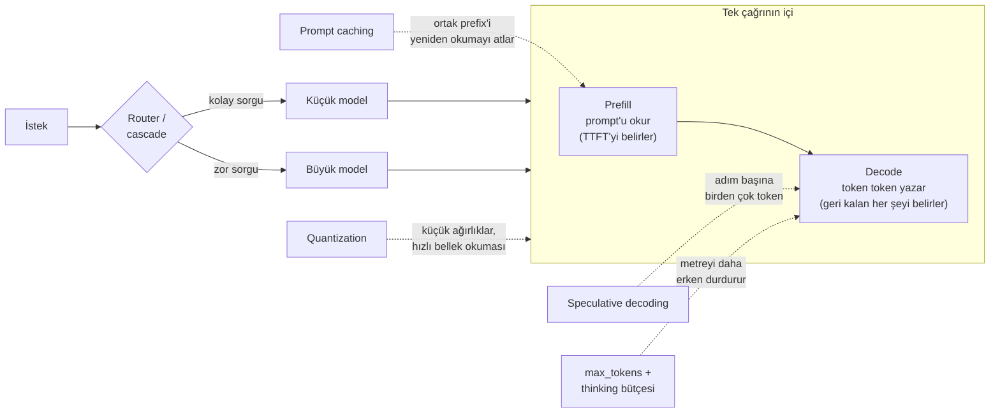

Özellik demoda harika çalışıyordu. Tek kullanıcı, kısa prompt'lar,
bir iki saniyede gelen yanıtlar, sentlerle ölçülen bir fatura. Sonra
yayına çıktı. Üç hafta sonra masanıza iki grafik geliyor: bütçede
olmayan bir eğimle tırmanan API faturası ve kullanıcıların bir
diliminin, ikinci cümlesinden sonrasını okumayacakları bir yanıt için
sekiz saniye beklediğini gösteren p95 gecikme grafiği. Modelde hiçbir
şey değişmedi. Değişen şey, production trafiğinin demonun görmezden
gelmenize izin verdiği her şeyi çarpmasıydı.

İki grafiği de okunur kılan mercek şu: bir LLM çağrısı, tuhaf bir
taksimetreye sahip bir taksi yolculuğudur. Arabanın kapıya gelmesini
beklemek TTFT'nizdir (time to first token — ilk token'a kadar geçen
süre). Prompt'unuzun okunması ucuz açılış ücretidir. Ama metre asıl
*output* üzerinden işler: modelin yazdığı her token bir tık daha, ve
output token'ları hem parada hem milisaniyede input token'larının
birkaç katına mal olur. Bu makaledeki hemen her optimizasyon,
yolculuğu kısaltmanın, paylaşmanın, hiç yapmamanın ya da market
alışverişine limuzin çağırmamanın bir yoludur. Yığını risk sırasıyla
gezeceğiz: önce faturayı açıklayan metrikler, sonra kayıpsız
kazanımlar (caching, batching, bütçeler), sonra model seçimi ve
routing (yönlendirme), sonra serving odası, sonra doğruluktan
çalmaya başlayabilen teknikler ve en sonda ajanların kendi
taksilerini çağırmaya başladığında olanlar.

**Bu yazıda**

- [1. Taksimetre output'ta işler](#1-taksimetre-outputta-işler)
  - [Prefill ve decode](#prefill-ve-decode)
  - [Fiyat asimetrisi](#fiyat-asimetrisi)
  - [Streaming algılanan hızı satın alır](#streaming-algılanan-hızı-satın-alır)
- [2. Önce kayıpsız kazanımlar: caching, batching, bütçeler](#2-önce-kayıpsız-kazanımlar-caching-batching-bütçeler)
  - [Prompt caching: aynı prefix'e iki kez ödeme](#prompt-caching-aynı-prefixe-iki-kez-ödeme)
  - [Batch API: sabra yarı fiyat](#batch-api-sabra-yarı-fiyat)
  - [Output ve thinking bütçeleri](#output-ve-thinking-bütçeleri)
  - [Kuyruk ve retry vergisi](#kuyruk-ve-retry-vergisi)
- [3. Daha küçük bir beyin seçin: routing, cascade ve model ekonomisi](#3-daha-küçük-bir-beyin-seçin-routing-cascade-ve-model-ekonomisi)
  - [Rakamlarla fiyat uçurumu](#rakamlarla-fiyat-uçurumu)
  - [Cascade'ler ve router'lar](#cascadeler-ve-routerlar)
  - [Routing nerede kırılır](#routing-nerede-kırılır)
  - [Küçük modeller neden bu kadar iyileşti](#küçük-modeller-neden-bu-kadar-iyileşti)
  - [Damıtma ve küçük uzman](#damıtma-ve-küçük-uzman)
- [4. Serving odası: self-host edenlerin kazandığı yer](#4-serving-odası-self-host-edenlerin-kazandığı-yer)
  - [Continuous batching ve PagedAttention](#continuous-batching-ve-pagedattention)
  - [Speculative decoding](#speculative-decoding)
  - [Serving yığını seçimi](#serving-yığını-seçimi)
- [5. Sıkıştırma: doğruluğu ilk zedeleyebilecek teknikler](#5-sıkıştırma-doğruluğu-ilk-zedeleyebilecek-teknikler)
  - [Quantization](#quantization)
  - [KV cache'i küçültmek](#kv-cachei-küçültmek)
  - [Prompt compression ve semantic caching](#prompt-compression-ve-semantic-caching)
  - [Uzun context de bedava değil](#uzun-context-de-bedava-değil)
- [6. Ajanlar taksimetreyi çarpar](#6-ajanlar-taksimetreyi-çarpar)
- [7. Bütün alet çantası tek sayfada](#7-bütün-alet-çantası-tek-sayfada)
  - [Karar tablosu](#karar-tablosu)
  - [Tek iş yükü, uçtan uca](#tek-iş-yükü-uçtan-uca)
  - [Aşamalı yol haritası](#aşamalı-yol-haritası)
  - [Belirtiden çözüme](#belirtiden-çözüme)
- [Bütün hikâye altı satırda](#bütün-hikâye-altı-satırda)
- [Terimler sözlüğü](#terimler-sözlüğü)
- [Daha derine inmek için](#daha-derine-inmek-için)

## 1. Taksimetre output'ta işler

### Prefill ve decode

Her LLM çağrısının iki fazı vardır ve ikisi birbirine hiç benzemez.

> **Prefill (ön doldurma)** = modelin prompt'unuzun tamamını tek bir
> paralel geçişte okuması ve KV cache'ini onunla doldurması. İlk
> token görünmeden önce ne kadar bekleyeceğinizi bu faz belirler.

> **Decode (çözümleme)** = modelin yanıtı token token yazması; her
> yeni token ağın içinden tam bir geçiş gerektirir. İlk token'dan
> sonraki her şeyi bu faz belirler.

Prefill, taksinin kapınıza gelmesidir: bir kez olur, binlerce
token'ı tek süpürüşte işler ve modern GPU'lar bu işte son derece
iyidir. Decode ise yolculuğun kendisidir ve inatla sıralıdır —
500'üncü token, 499'uncu yazılmadan yazılamaz, çünkü her yeni token
kendinden öncekilerin hepsine bağlıdır. (Üretimin neden token token
ilerlemek zorunda olduğu ve KV cache'in sizi hangi yeniden
hesaplamadan kurtardığı, bu blogdaki
[LLM makalesinin](post.html?slug=llm-nasil-calisir) konusu.)

İki fazdan iki metrik doğrudan düşer:

> **TTFT (time to first token — ilk token'a kadar geçen süre)** =
> ilk output token'ının gelmesine kadar geçen zaman. Kuyruğa girme
> artı prefill tarafından belirlenir.

> **TPOT (time per output token — token başına süre)**, diğer adıyla
> inter-token latency = ilk token'dan sonraki token'ların temposu.
> Decode tarafından belirlenir.

Şimdi gecikme şikâyetlerinin çoğunu açıklayan aritmetiği yapalım.
TTFT 200 milisaniye, TPOT 80 milisaniye olsun — gayet saygın
rakamlar. 500 token'lık bir yanıt bu durumda prefill'de 0,2 saniye,
decode'da **40 saniye** geçirir. Taksiyi beklemek yuvarlama
hatasıydı; yolculuk, seyahatin tamamıydı. Yanıtı kısaltan her
optimizasyon baskın terime saldırır. Yalnızca prefill'i parlatan her
optimizasyon, yuvarlama hatasına saldırır.

### Fiyat asimetrisi

Sağlayıcılar iki fazı farklı fiyatlandırır ve asimetri büyüktür:
büyük API'lerde output token'ları tipik olarak input token'larının
dört-beş katına mal olur (kesin çarpan sağlayıcıya ve modele göre
değişir). Fiyatlandırma fiziği yansıtır — bin input token'ı tek bir
ucuz paralel geçiştir, bin output token'ı bin sıralı geçiştir.
Dolayısıyla maliyet profilinizdeki en belirleyici sayı prompt
uzunluğunuz değildir. Ortalama yanıt uzunluğunuzun istek hacminizle
çarpımıdır.

Bir LLM maliyet incelemesindeki en yüksek kaldıraçlı sorunun
utandırıcı derecede basit olmasının nedeni budur: *model,
kullanıcının ihtiyacından fazlasını mı yazıyor?* Tek paragrafın
yeteceği yerde üç paragraf yazan bir chatbot, kimsenin okumadığı
metin için hem parada hem saniyede üç kat ödüyordur.

### Streaming algılanan hızı satın alır

Streaming (akış) decode'u hızlandırmaz — bekleyişi dürüst kılar.
Kullanıcı 40 saniye boyunca dönen bir simgeye bakmak yerine,
token'lar geldikçe onlarla birlikte okur. Ve burada insan bant
genişliği size iyilik yapar: yetişkinlerin ortalama sessiz okuma
hızı dakikada yaklaşık 240 kelimedir (Brysbaert'in 190 çalışmayı
kapsayan 2019 meta-analizi), yani saniyede kabaca 4 kelime. Saniyede
20 token'lık bir akış hemen her okuyucuyu rahatça geçer. Bu noktadan
sonra TPOT'u daha da düşürmenin bir sohbet deneyimine katkısı tam
olarak sıfırdır — darboğaz model değil, okuyucudur.

Uyarı: bu rahatlık, metnin gelişini izleyen insanlar için geçerli.
Bir pipeline'da ya da ajan döngüsünde hiçbir şey "birlikte okumaz" —
her adım harekete geçmeden önce yanıtın *tamamını* bekler; önemli
olan uçtan uca süredir ve uzun output'lar tam ağırlığıyla acıtır.
Birisi size saniyede token sayısı söylediğinde iki durumu ayrı
tutun.

İşte bütün muharebe alanı tek haritada — bir isteğin yaşamı ve her
optimizasyon ailesinin ona nereden saldırdığı:

## 2. Önce kayıpsız kazanımlar: caching, batching, bütçeler

Bu bölümdeki tekniklerin ortak bir özelliği var ve başlamak için
doğru yer olmalarının nedeni bu: ödediğinizi ve beklediğinizi
değiştirirler, başka hiçbir şeyi değil. Yanıtın baytları aynıdır ya
da kaliteye dokunulmamıştır. Doğruluktan ödün veren herhangi bir
şeyden önce bunlara uzanın.

### Prompt caching: aynı prefix'e iki kez ödeme

İsteklerinizin gerçekte ne içerdiğine bakın. Bir sistem prompt'u,
tool tanımları, belki uzun bir doküman ya da birkaç işlenmiş örnek —
ve en sonda, değişen tek parça: kullanıcının sorusu. Çoğu production
iş yükünde prompt'un ilk %90'ı binlerce istek boyunca bayt bayt
aynıdır ve caching olmadan, modelin onu her seferinde yeniden
okuması için tam prefill fiyatı ödersiniz. Bu, aynı ofise her
yolculukta güzergâhın baştan anlatılmasını isteyen taksi şoförüdür.

Prompt caching, sağlayıcının işlenmiş prefix'i (önek) saklayıp
oradan devam etmesini sağlar. Rakamlar çarpıcıdır, çünkü uzun bir
prefix üzerinde prefill gerçekten pahalıdır. Anthropic uzun
prompt'larda %90'a varan maliyet ve %85'e varan gecikme düşüşü
bildirir; işlenmiş örnekleri — cache'lenmiş 100.000 token'lık bir
kitapla sohbet — ilk token süresini 11,5 saniyeden 2,4 saniyeye
indirir. Fiyat mekaniği (4 Eylül 2026 itibarıyla): cache'e yazmak
taban input fiyatının 1,25 katı, cache'ten okumak 0,1 katıdır. OpenAI'nin caching'i belli
bir prefix uzunluğunun üzerinde otomatiktir (güncel modellerde
1.024 token) ve en yeni modellerinde cache okumalarında %90'a varan
indirim uygular. Google ve AWS aynı fikri kendi adlarıyla sunar.

Tek bir mimari kural her şeyi belirler: **caching prefix'i bayt bayt
eşleştirir; statik içerik başa, dinamik içerik sona.** Sistem
prompt'unuzun tepesine zaman damgası, kullanıcı adı ya da istek
kimliği koyarsanız, her istek için cache'i geçersiz kılmış
olursunuz. Bu beş dakikalık bir prompt yerleşim incelemesidir ve
düzenli olarak bütün yığındaki en yüksek getirili tek değişiklik
çıkar.

*Nasıl kullanılır: Anthropic'te isteğinizin statik bloklarının
sonuna `cache_control` işaretleri ekleyin; OpenAI'de prompt'u
statik-önce sıralamanız yeterlidir, cache kendiliğinden devreye
girer. Sonra yanıtlardaki `cached_tokens` alanını izleyin — hit
oranınız düşükse, neden neredeyse her zaman prefix'e sızmış dinamik
bir değerdir.*

### Batch API: sabra yarı fiyat

Bütün büyük sağlayıcılar aynı takası satar: istekleri asenkron
gönderin, sonuçları geniş bir pencere içinde alın (24 saate kadar,
genellikle çok daha hızlı), normal fiyatın %50'sini ödeyin. Bir
işin öbür ucunda bekleyen bir insan yoksa — gece özetleme,
embedding doldurma, eval koşuları, rapor üretimi — onu interaktif
çalıştırmak, kimsenin açmak için acele etmediği bir pakete acele
ücreti ödemektir. Batch indirimi, ortak prefix üzerindeki prompt
caching ile üst üste biner; ağır sistem prompt'lu offline
pipeline'ların naif fiyatın küçük bir kesrini ödemesi böyle olur.

### Output ve thinking bütçeleri

Taksimetre output'ta işlediğine göre, output'a tavan koyun. İncelik
sırasına göre üç düğme:

**max_tokens** sert durdurmadır. Modele bir öneri değildir — API
tarafından zorlanır — ve bu onu, ara sıra normalin on katına
gevezelik eden yanıta karşı devre kesiciniz (circuit breaker) yapar.

**Talimatlar ve yapı**, tavan hiç devreye girmeden yanıtı
şekillendirir. "En fazla üç cümleyle yanıtla", bir JSON şeması,
zorunlu bir çıktı formatı — bunlar decode süresini, kestikleri
token'la kabaca orantılı düşürür. Laf kalabalığı bir alışkanlıktır
ve faturası size kesilen bir alışkanlıktır.

**Thinking bütçeleri** yeni ağır siklettir. Reasoning modelleri
(akıl yürüten modeller) yanıtlamadan önce düşünmeye token harcar ve
harcama devasadır: aynı fizik soruları üzerinde bir ölçüm,
DeepSeek-R1'in ortalama 14.698 output token'ı ürettiğini, akıl
yürütmeyen DeepSeek-V3'ün ise 4.035'te kaldığını buldu — yanıt
kalitesi tartışmaya girmeden önce yaklaşık 3,6 kat. Bu token'ların
getirisi düzleşir: thinking bütçesi çalışmaları, ötesinde ek
düşünmenin ölçülebilir hiçbir şey satın almadığı bir plato bulmakta
tutarlıdır. Ve modelin görgüsüne güvenemezsiniz — reasoning
modellerinin kibarca rica edilen token limitlerini deldiği
belgelenmiştir; bütçe prompt'la değil, API parametresiyle (ya da
max_tokens ile) zorlanmalıdır. Hangi görevlerin uzun düşünmeyi hak
ettiği — ve reasoning modellerinin hangi teknikleri içine çektiği —
[prompting teknikleri makalesinde](post.html?slug=prompting-teknikleri)
işleniyor.

Reasoning kuşağıyla birlikte dördüncü bir düğme geldi: **effort
(çaba seviyesi)**. Modern API'ler, modelin ne kadar düşüneceğini
ölçekleyen istek düzeyinde bir effort parametresi sunar (low'dan
high'a kademeler) — düşünme derinliğini, tool çağrısı gevezeliğini
ve yanıt uzunluğunu tek elden ayarlayan bir düğme. Bedava
kazanımlardan sonra uzanılacak ilk kaldıraç budur: derin akıl
yürütme gerektirmeyen bir akışı high'dan low effort'a indirmek,
*aynı* modelde hem harcamayı hem gecikmeyi keser — yeniden prompt
yazmadan, işletilecek ikinci bir sistem kurmadan. Bunu global
değil akış başına ayarlayın — yüksek effort'un karşılığını veren
iş yükleri (kod, uzun agentic görevler), SSS trafiğini yanıtlayan
iş yükleri değildir.

### Kuyruk ve retry vergisi

Bir kayıpsız aile daha düpedüz güvenilirlik mühendisliğinde yaşar
ve girişteki p95 grafiğinin, ortalamalarınız iyi görünürken neden
huysuzlandığını açıklar. TTFT'nin kuyruğa girme *artı* prefill
olduğunu hatırlayın — yük altında büyüyen kısım kuyruktur. Medyan
kullanıcınız 300 milisaniye görür; p95 kullanıcınız bir trafik
patlamasının, bir rate limit'in (hız sınırı) ve birinin retry
fırtınasının arkasında bekliyordur. Üç gösterişsiz pratik kendini
fazlasıyla öder:

- **Retry'lar iki kez ödetir.** Uzun bir üretimde timeout, zaten
  satın aldığınız token'ları yakar; körlemesine bir retry hepsini
  yeniden satın alır. Beklemek yerine stream edin (yarıda ölen bir
  akış, ucuza kurtarma ya da vazgeçme şansı verir), istemci
  timeout'larını gerçek p99 üretim sürenizden uzun tutun ve
  yalnızca gerçekten yeniden denenebilir hataları — rate limit ve
  sunucu hataları — backoff ile yeniden deneyin.
- **Kuyruğun ucu uzun output'lardan yapılmıştır.** p95 ve p99, çok
  uzun süren küçük yanıt kesri ve onların tetiklediği retry'larla
  şişer. Bu, max_tokens tavanları için bir argüman daha — ve
  ortalamaları değil yüzdelikleri izlemek için: sağlıklı bir
  ortalamayla çürük bir p99, anomali değil olağan arıza modudur.
- **Sabit yük, kuyruksuz bir şerit satın alabilir.** Öngörülebilir
  ve sürekli trafik için sağlayıcılar sabit fiyatla provisioned
  (ayrılmış) throughput satar: esnekliği, sizi şaşırtmayı bırakan
  bir gecikme dağılımıyla takas edersiniz. Sıçramalı offline işler
  içinse basınç vanası batch API'dir.

## 3. Daha küçük bir beyin seçin: routing, cascade ve model ekonomisi

Frontier modellerle küçük modeller arasında token başına fiyat farkı
kabaca iki büyüklük mertebesidir. Bu bölümün bütün ekonomik
gerekçesi o uçurumdur: trafiğinizin yarısı bile küçük bir modelin
doğru yanıtladığı sorulardan oluşuyorsa, her şeyi frontier modele
göndermek kolay yarı için 100 kat prim ödemektir. Market alışverişi
için limuzin çağırmazsınız.

### Rakamlarla fiyat uçurumu

Uçurumu somutlaştırmak için manzara — rakamlar **4 Eylül 2026**'da
sağlayıcıların resmî fiyat sayfalarından alındı (milyon token
başına, yuvarlanmış; fiyatlar hızla eskir, production kararından
önce yeniden doğrulayın):

| Katman | Örnek | Input $/M | Output $/M |
|---|---|---|---|
| En üst frontier | Claude Fable 5, OpenAI amiral gemisi | $10 | $50 |
| Frontier | Claude Opus 5 | $5 | $25 |
| Orta | Claude Sonnet 5 | $2 | $10 |
| Orta | Gemini 3.1 Pro (≤200K prompt) | $2 | $12 |
| Küçük | Claude Haiku 4.5 | $1 | $5 |
| Küçük-hızlı | Gemini 3.8 Flash | $0,75 | $3,75 |
| API üzerinden açık ağırlıklı | DeepSeek-R1 (OpenRouter) | $0,70 | $2,50 |
| Nano | en ucuz OpenAI nano katmanı | $0,20 | $1,25 |

Bu tablodan okunacak üç şey var. Birincisi, nano'dan en üst
frontier'a açıklık input'ta kabaca 50 kat, output'ta 40 kat —
routing'i inşa etmeye değer kılan iki büyüklük mertebesi tam
olarak bu. İkincisi, her satır 1. bölümdeki aynı output primini
(input'un ~5 katı) gösteriyor. Üçüncüsü, bunlar üst üste binen
indirimlerden önceki *liste* fiyatları: batch API'ler her şeyi
yarılar ve cache okuması input'un ~0,1 katıdır — orta katman bir
modelde cache'li ve batch'li bir istek, naif bir frontier çağrısının
yanında yuvarlama hatasına mal olur.

### Cascade'ler ve router'lar

Uçurumu iki mimari sömürür. **Cascade (kademeli deneme)** modelleri
fiyat sırasıyla dener: önce ucuz model yanıtlar, bir doğrulama
sinyali (öz-bildirimli güven, bir puanlama modeli, örneklemler
arası uyuşma) yanıtın geçerli olup olmadığına karar verir ve
yalnızca başarısızlıklar üst kata çıkar. FrugalGPT (Stanford, 2023)
kanonik çalışmadır: kendi benchmark'larında bir cascade, en iyi tek
LLM'in performansını %98'e varan maliyet düşüşüyle yakaladı —
manşet rakamı en elverişli veri setinden gelir ama desen genelde
tuttu.

**Router (yönlendirici)** ise kararı çağrıdan *önce* verir: sorguyu
sınıflandırır ve doğrudan doğru katmana gönderir — boşa giden ilk
deneme yok, zor sorgulara eklenen gecikme yok. RouteLLM
(Berkeley/LMSYS, ICLR 2025) router'ları insan tercih verisiyle
eğitti ve GPT-4'ün benchmark performansının %95'ini korurken
maliyeti MT-Bench'te %85, MMLU'da %45, GSM8K'da %35 düşürdüğünü
bildirir; en iyi router'ı MT-Bench sorgularının yalnızca %14'ü için
pahalı modele ihtiyaç duydu.

[RAG desenleri makalesini](post.html?slug=hangi-rag-deseni)
okuduysanız bu eski bir dost: sorguyu doğru dizine yönlendirmekle
doğru beyne yönlendirmek aynı reflekstir — önce sınıflandır, sonra
harca.

### Routing nerede kırılır

Routing'in toplam rakamları bir arıza modunu gizler: bir
benchmark'ın zorluk karışımı üzerinden ortalama alırlar ve sizin
trafiğiniz o karışım değildir. Sağlamlık üzerine yapılan takip
çalışmaları, neredeyse her sorgunun gerçekten güçlü modele ihtiyaç
duyduğu kategoriler buldu — kod bunlardan biri — ve genel tercih
verisiyle eğitilmiş bir router tam da orada sessizce bozulur. Pratik
savunma gösterişsizdir: bilinen zor kategorileri (kod, matematik,
uyumluluk açısından kritik ne varsa) koşulsuz güçlü modele
sabitleyin, router'a yalnızca ortayı hakem yaptırın ve kaliteyi
toplamda değil kategori başına izleyin.

Ve bunların hiçbirini kurmadan önce sıfır hipotezini koşun: aynı
trafikte, en yeni güçlü model *daha düşük effort'ta*. Çoğu zaman
bir önceki kuşağın tam effort kalitesini maliyetin küçük bir
kesriyle yakalar; üstelik tek model, tek cache alanı demektir — bir
cascade, katmanları arasında prompt cache paylaşımından vazgeçer ve
bu, router'ın kazandırdığı tasarrufu sessizce geri yiyebilir.
Router karmaşıklığını ancak tek-model-düşük-effort taban çizgisi
bütçenizi hâlâ aşıyorsa hak eder.

### Küçük modeller neden bu kadar iyileşti

Ucuz katmanın yönlendirmeye değmesini iki araştırma damarı açıklar.
İlki inference'ı hesaba katan ölçekleme. Chinchilla sonucu (2022),
daha çok veriyle eğitilmiş 70B'lik bir modelin daha az veriyle
eğitilmiş 175B'lik bir modeli geçtiğini gösterdi — compute-optimal
eğitim, parametre başına kabaca 20 token ister. Ama "Beyond
Chinchilla-Optimal" (2024) production bükümünü ekledi: bir model
milyarlarca isteğe hizmet edecekse ömür boyu maliyetine inference
hâkimdir ve rasyonel seçim, compute-optimal'den *daha küçük* ama
çok *daha uzun* eğitilmiş bir modele kayar. Boyutunun üstünde
yumruk atan modern küçük model kuşağının reçetesi tam olarak budur —
aşırı eğitim, işin özüdür.

İkinci damar mixture-of-experts (MoE — uzman karışımı): modelin
bildiğiyle token başına ödediğinizi birbirinden ayırır. Mixtral
8x7B toplamda 46,7B parametre taşır ama token başına yaklaşık 13B
etkinleştirir ve bu kesirle Llama 2 70B'yi kabaca 6 kat daha hızlı
inference ile geride bırakır; DeepSeek-V3 aynı fikri 671B toplam,
37B aktif ölçeğine taşır. İnce yazı: bütün parametreler yine GPU
belleğinde oturmak zorundadır ve MoE'yi iyi servis etmek, dense bir
modeli servis etmekten operasyonel olarak zordur. Token başına
hesaptan kazandığınızı bellek ve karmaşıklıkla ödersiniz.

### Damıtma ve küçük uzman

Dar ve yüksek hacimli bir görev için routing'in bir adım ötesi var:
büyüğü taklit eden kendi küçük modelinizi yapmak. Fikrin soyağacı
eskiye gider. DistilBERT (2019), %40 daha küçük ve %60 daha hızlı
bir modelin BERT'in dil anlama yeteneğinin %97'sini koruyabildiğini
gösterdi — neredeyse hiçbir şey kaybetmeden sıkıştırma, çünkü büyük
bir modelin kapasitesinin çoğu tek bir görev için gerekli değildir.
Modern versiyonu daha da çarpıcı: distilled direct preference
optimization (dDPO — damıtılmış doğrudan tercih optimizasyonu) ile
yapay zekâ üretimi geri bildirim üzerinde eğitilen Zephyr-7B,
MT-Bench'te kendisinin on katı büyüklükteki Llama2-Chat-70B'yi
geçti — birkaç saatlik eğitimle ve hiç insan anotasyonu olmadan.

Döngüyü ekonomik olarak fine-tuning (ince ayar) kapatır. QLoRA bunu
ucuzlattı — 65B'lik bir modeli tek bir 48GB GPU'da, 16-bit tam ince
ayarın kalitesini koruyarak eğitti; 7B'lik bir uzman çok daha azını
ister. Başabaş aritmetiği basittir: eğitim tek seferlik bir
maliyettir; istek başına tasarruf (frontier API fiyatı eksi küçük
model serving maliyeti) ise sonsuza kadar hacimle çarpılır.
Mütevazı bir ölçeğin ötesinde, eğitim verisine sığacak kadar dar
bir görevde küçük uzman ezici biçimde kazanır — ve router'ın
aksine, yanlış yönlendiremez.

Karar vermeden önce deftere dürüst bir satır daha: eğitim
compute'u, uzmanın maliyetleri içinde *en küçüğüdür*. Eğitim
verisini derlemek, uzmanın sizin görevinizde frontier'la başa baş
olduğunu kanıtlayacak eval düzeneğini kurmak ve bakım — görev
kaydığında ya da bir sonraki base model kuşağı çıtayı sıfırladığında
yeniden eğitmek — başabaş hesabının taşıması gereken yinelenen
maliyetlerdir. İnce ayarlı bir model, artık yaptığınız bir çağrı
değil, sahibi olduğunuz bir üründür.

## 4. Serving odası: self-host edenlerin kazandığı yer

Bir sağlayıcının API'sini çağırıyorsanız bu bölüm arka plan
bilgisidir — hepsini sağlayıcınız yapar ve fiyatlarının nereden
geldiğini açıklar. Self-host ediyorsanız (modeli kendi sunucunuzda
barındırıyorsanız) en büyük çarpanlar burada yaşar ve hepsi
kayıpsızdır.

### Continuous batching ve PagedAttention

Tek seferde tek isteğe hizmet eden bir GPU, tek yolcuyla sefer
yapan bir otobüstür: decode onun hesap gücüne zar zor dokunur. Çok
isteği gruplamak (batching) işlem hacmini geri kazandırır, ama naif
*statik* batching'in bir kusuru vardır — bütün grup, en uzun yanıt
bitene kadar bekler; kısa yanıtlı yolcular hattın tamamını gezer.
**Continuous batching (kesintisiz gruplama)** (Orca makalesi, OSDI
2022) bunun yerine her decode adımında yeniden planlar: biten
diziler gruptan anında iner, bekleyen istekler anında biner, otobüs
asla boş koltukla gitmez.

Eşlik eden sorun bellektir. Her isteğin KV cache'i geleneksel
olarak, olası en büyük uzunluğa göre boyutlanmış tek bir bitişik
blok hâlinde ayrılırdı; parçalanma artı fazladan rezervasyon,
alanın çoğunu israf ediyordu. **PagedAttention** (vLLM'in çekirdek
fikri, SOSP 2023) KV belleğini, bir işletim sisteminin RAM'i
yönettiği gibi küçük sayfalarla yönetir — israf sıfıra yakındır ve
özdeş prefix'ler sayfaları doğrudan paylaşabilir. vLLM makalesi,
aynı gecikmede bir önceki en iyi sistemlere göre 2-4 kat işlem
hacmi ölçer; gerçekten naif statik kurulumlara karşı vendor
ölçümleri çift haneye uzanır. Tabloyu bir incelik tamamlar:
**chunked prefill** (parçalı ön doldurma — Sarathi-Serve fikri),
çok uzun bir prefill'i parçalara bölüp decode adımlarının arasına
dokur; böylece bir kullanıcının dev prompt'u diğer herkesin token
akışını durdurmaz — karışık trafikte TTFT ile TPOT'u dengeleyen
düğme budur. 2026'da açık ağırlıklı bir model servis ediyor ve
sayfalı KV belleğiyle continuous batching kullanmıyorsanız,
serving'deki en büyük tekil kazanımı masada bırakıyorsunuz.

### Speculative decoding

Decode'un trajedisi, dev bir modelin tek token üretmek için tam bir
ileri geçiş yapması ve token'ların çoğunun kolay olmasıdır —
"the"ler, kapanan parantezler, herhangi bir küçük modelin
tamamlayabileceği bariz sonraki kelimeler. Speculative decoding
(taslaklı çözümleme) bunu sömürür: küçük ve hızlı bir taslak model
birkaç token ilerisini önerir, büyük model önerinin tamamını tek
bir paralel geçişte doğrular ve kendisinin üreteceğiyle eşleşen
kısmı kabul eder. Matematiksel garanti işin güzel tarafıdır: çıktı
dağılımının, büyük modelin tek başına ürettiğiyle *kanıtlanabilir
biçimde özdeş* olması. Kalite takası sıfır olan bir hızlanmadır —
taksinin, güzergâhı bir scooter'a keşfettirip yalnızca scooter'ın
yanıldığı bölümleri kendisinin sürmesi.

Soyağacı kısadır ve bilinmeye değer. 2023'te iki makale (ICML'de
Leviathan ve ark. ile Chen ve ark.) tekniği formüle etti ve
kayıpsızlığı kanıtladı. Medusa, ayrı bir taslak model çalıştırmak
yerine hedef modelin üzerine ek decode kafaları vidalayarak
dağıtımı basitleştirdi. Alanın bugünkü zirvesi EAGLE serisi ise
hafif bir taslak kafayı hedef modelin kendi iç temsilleri üzerinde
eğitir ve vanilla otoregresif decode'a göre 6,5 kata varan hızlanma
bildirir (EAGLE-3, NeurIPS 2025); kod gibi öngörülebilir
metinlerde en güçlüdür. Dürüst uyarı: bedava öğle yemeği, gruplar büyüdükçe
küçülür. Doğrulama boştaki hesap gücünü harcar ve meşgul bir
sunucuda o güç azdır — 64'lük batch boyutunda ölçülen kazanç
1,4 kat civarına iner. Speculative decoding, gecikmeye duyarlı ve
düşük eşzamanlılıklı serving'de parlar; yüksek dolulukta nötre
yaklaşır.

**FlashAttention** hakkında da kısa bir not, çünkü her serving
yığınının sürüm notlarında görünür: attention'ı tam olarak hesaplar
(yaklaşıklama yok) ama hesabı, asıl darboğaz olan GPU belleğine
büyük attention matrisini taşımaktan kaçınacak biçimde yeniden
düzenler. Ardışık sürümleri bunu her yeni GPU kuşağına yeniden
ayarlar. Kullanıcı olarak çoğunlukla tek istediğiniz açık olması —
modern motorlar varsayılan olarak açar.

### Serving yığını seçimi

Açık kaynak serving alanı, seçimin okunur olacağı kadar oturdu:

| Motor | Süper gücü | Ne zaman uzanmalı |
|---|---|---|
| vLLM | PagedAttention, en geniş model/donanım desteği, hızlı iterasyon | Varsayılan seçim; karışık modeller, hızlı değişen ihtiyaçlar |
| SGLang | RadixAttention — istekler arası ortak prefix'lerin otomatik yeniden kullanımı | Çok isteğin uzun prefix paylaştığı ajan ve RAG trafiği |
| TensorRT-LLM | Derlenmiş motorlar, NVIDIA'da en yüksek ham işlem hacmi | Tek model, azami ölçek, derleme adımına ayrılacak mühendislik bütçesi |
| llama.cpp | Her yerde çalışır — CPU, dizüstü, edge | Yerel ve edge dağıtım; datacenter işlem hacmi değil |

(Eski HuggingFace varsayılanı TGI bakım modunda; platformun kendisi
artık modelleri altta vLLM ile servis ediyor.)

## 5. Sıkıştırma: doğruluğu ilk zedeleyebilecek teknikler

Buraya kadar her şey kayıpsızdı. Bu bölüm bir çizgiyi geçer:
buradaki teknikler bir şeyi küçültür — ağırlıkları, KV cache'i,
prompt'un kendisini — ve her biri fazla zorlanırsa yanıtları
ölçülebilir biçimde bozabilir. Onları güvenli tutan disiplin
hepsinde aynıdır: **önce kayıpsız kazanımları tüketin, muhafazakâr
sıkıştırın ve liderlik tablosunda değil kendi görevinizde benchmark
yapın.**

### Quantization

Bir modelin ağırlıkları 16-bit sayılar olarak gelir; quantization
(nicemleme) onları 8 ya da 4 bitte saklar. Decode hızını,
ağırlıkların GPU belleğinden ne hızla aktığı sınırladığından,
baytları yarılamak bellek ayak izini kabaca yarılar ve akışı
hızlandırır — çoğu zaman iki GPU'ya ihtiyaç duymakla tek GPU'ya
ihtiyaç duymak arasındaki farktır.

Doğruluk tablosu, 405B parametreye kadar talimatla ince ayarlı
modellerin geniş ve sistematik bir değerlendirmesine dayanan birkaç
güvenilir kurala oturdu:

1. Quantize edilmiş büyük bir model, genellikle yarı boyutundaki
   tam hassasiyetli modeli hâlâ geçer — bit düşürmek, katman
   düşürmekten çoğunlukla iyidir.
2. Ama açıklar tam da production'ın en çok önemsediği yerde
   toplanır: talimat takibi ve halüsinasyona duyarlı görevler,
   manşet benchmark'lardan önce bozulur; aynı değerlendirmenin
   LLM hakemli testlerinde en büyük düşüş kod ve STEM'de görüldü.
3. Yöntem seçimi önemlidir: FP8 (modern GPU'larda donanım destekli)
   görevler arasında en dayanıklı seçenektir; yalnızca ağırlıkları
   quantize eden yöntemler arasında aktivasyona duyarlı AWQ, daha
   eski GPTQ'yu geçme eğilimindedir. Aktivasyonları da quantize
   eden aile (SmoothQuant) bir miktar doğruluk pahasına ek
   inference hızı satın alır — kaliteyi en iyi weight-only korur.
4. En çok küçük modeller zarar görür. Qwen3 quantization çalışması
   bunu somutlaştırır: 0,6B modelin MMLU skoru FP16'da 52,3 iken
   AWQ 4-bit ile 47,3'e, GPTQ 4-bit ile 40,4'e düştü. Büyük bir
   model, küçüğünü sakatlayan şeyi silkeleyip atar.

Operasyonel kural doğrudan bunlardan çıkar: varsayılan 8-bit (FP8
ya da AWQ) — bedavaya yakın bir kazanım sayın; 4-bit yalnızca büyük
modellerde, yalnızca aktivasyona duyarlı bir yöntemle ve yalnızca
düşüşün kabul edilebilir olduğunu *sizin* görevinizde gösteren bir
benchmark'la.

### KV cache'i küçültmek

Uzun context'li ve ajan tipi iş yüklerinde bellek darboğazı
ağırlıklar değil KV cache olur: context'in her token'ıyla büyür ve
batch boyutunuza tavanı o koyar. KV cache quantization onu
ağırlıklardan bağımsız sıkıştırır. KIVI (ICML 2024) cache'i
ayarsız, asimetrik bir şemayla 2 bit'e indirir ve 2,6 kat düşük
tepe bellek bildirir; bu, 4 kata kadar büyük batch'lere ve
karşılaştırılabilir kalitede 2,35-3,47 kat işlem hacmine olanak
verir. KVQuant, ihmal edilebilir perplexity değişimiyle 3-bit'e
ulaşır ve milyon token'lık context'leri tek GPU'da servis etmeyi
raporlar. İş yükünüz uzun konuşmalar ya da büyük erişilmiş
context'lerse ilk değerlendirilecek sıkıştırma budur — gerçekten
kıt olduğunuz kaynağa saldırır.

### Prompt compression ve semantic caching

Aileyi, ikisi de pazarlamasının ima ettiğinden keskin kenarlı iki
uygulama düzeyi teknik tamamlar.

**Prompt compression (prompt sıkıştırma)** (LLMLingua çizgisi),
büyük modelin gereksiz bulacağı token'ları küçük bir modele
sildirir — benchmark görevlerinde az kayıpla 20 kata varan oranlar
raporlanır. Keskin kenar: bağımsız değerlendirmeler, agresif
oranlarda doğruluğun uçurumdan düştüğünü, en kötü durumlarda
modelin hiç context'siz aldığı skora yaklaştığını bulur — taşıması
gereken bilgiyi imha eden bir sıkıştırma. Oranları muhafazakâr
tutun (2-3 kat), sıkıştırırken sorunun ne olduğunu bilen
query-aware (sorguya duyarlı) türevleri yeğleyin ve kendi
görevinizde yeniden doğrulayın.

**Semantic caching (anlamsal önbellek)**, tekrarlanan soruları tam
eşleşme yerine embedding benzerliğiyle anahtarlanmış bir cache'ten
yanıtlar — "şifremi nasıl sıfırlarım" ile "parola sıfırlama nasıl"
aynı kayda düşer. Destek ve SSS gibi yüksek tekrarlı trafikte
çalışmalar, çağrıların yarısından fazlasının sıfıra yakın marjinal
maliyet ve gecikmeyle cache'ten karşılandığını raporlar. Buradaki
keskin kenar yanlış isabettir: benzerlik eşiğini gevşek ayarlarsanız
*farklı* bir soru soran kullanıcı, kendinden emin ama yanlış bir
cache yanıtı alır — onun gözünde bunun halüsinasyondan farkı
yoktur. İkinci keskin kenar bayatlamadır: doğru eşleşen bir yanıt
*bugün* yine de yanlış olabilir — fiyat değişti, politika değişti —
bu yüzden kayıtlara bir TTL (yaşam süresi) ve türetildikleri
içeriğe bağlı bir geçersizleştirme kancası gerekir. Üstelik cache
paylaşılan bir yüzeydir: güvenlik
araştırmacıları, özel hazırlanmış sorguların başka kullanıcılara
ait kayıtlara isabet edebildiği — ya da onları zehirleyebildiği —
çarpışma tarzı saldırılar gösterdi. Sıkı bir eşikle, TTL ile,
kiracı başına izolasyonla ve yanlış pozitif izlemesiyle çalıştırın;
aynı soruların gerçekten yinelendiği trafiğe saklayın.

### Uzun context de bedava değil

Uzun prompt'ların prefill faturasından daha sessiz bir bedeli var:
model, verdiğinizi eşit okumaz. "Lost in the Middle" çalışması
(TACL 2024) altı model ailesini test etti ve U biçimli bir eğri
buldu — doğruluk, ilgili bilgi context'in başında ya da sonunda
dururken en yüksektir ve bilgi ortada kaldığında sert düşer. Daha
yeni uzun context'li modeller kısmen iyileşti; ama 18 modeli
kapsayan 2025 tarihli bir değerlendirme ("context rot" raporu),
girdi uzadıkça performansın basit görevlerde bile hâlâ
güvenilmezleştiğini buldu.

Pratik sonuçlar, "context'e daha çok şey tıkalım" içgüdüsünün tam
tersine işler. Erişim hassasiyeti context hacmini yener: özenle
seçilmiş on chunk, iyileri ortaya gömen elli vasat chunk'tan daha
iyi sonuç verir. Sıra önemlidir: en alakalı malzemeyi prompt'un
kenarlarına koyun, ortasına değil. Ve her gereksiz chunk üç kez
maliyet yazar — prefill parası, TTFT ve ölçülebilir bir doğruluk
vergisi. Erişim tarafındaki çözümler (hybrid search, yeniden
sıralama, yeniden yerleştirme)
[RAG desenleri makalesinde](post.html?slug=hangi-rag-deseni)
işleniyor.

## 6. Ajanlar taksimetreyi çarpar

Yukarıdaki her şey tek istek, tek yanıt varsayıyordu. Bir ajan bu
varsayımı bozar: döner — düşün, tool çağır, sonucu oku, yeniden
düşün — ve döngünün her turu, biriken context'in *tamamını* taşıyan
yepyeni bir LLM çağrısıdır. Taksi artık kendi taksilerini
çağırıyordur ve her yeni taksi, o âna kadarki güzergâhın tamamını
baştan sürer.

Anthropic çarpan hakkında ender bulunur production rakamları
yayımladı: ajanlar bir sohbet etkileşiminin yaklaşık 4 katı,
multi-agent araştırma sistemleri ise yaklaşık 15 katı token
tüketir. Sistem primini hak etti — kendi araştırma
değerlendirmelerinde tek ajanlı taban çizgisini %90,2 geçti ve bir
tarama benchmark'ında performans varyansının %80'ini tek başına
token harcaması açıkladı — ama dersin yönü nettir: multi-agent,
gerçekten paralelleşen görevler için bilinçli bir lükstür,
varsayılan mimari değil. Kendi rehberlikleri de bunu söylüyor.

Tavanın neye benzediğini görmek için, Anthropic'in yayımlanmış en
uç deneyi (Şubat 2026): 16 Claude ajanı, sıfırdan bir C compiler
yazmak için yaklaşık iki hafta paralel çalıştı — 2.000'e yakın
oturum, 2 milyar input token'ı, 140 milyon output token'ı ve
20.000 doların hemen altında API maliyeti; karşılığında Linux
6.9'u üç mimaride derleyen 100.000 satırlık bir Rust compiler'ı.
Aynı rakamların iki okuması var: kötümser 20.000 dolarlık faturayı
görür; iyimser, bir mühendis-ay fiyatına bir compiler görür. Ama
orana dikkat edin — input token'ları output'u 14'e 1 geçiyor,
çünkü her ajanın döngüsünün her turu, biriken context'i baştan
okuyor. O oran, agentic maliyet probleminin tek sayıdaki hâlidir
ve prompt caching'in saldırdığı şey tam olarak odur.

Çarpan sıradan arızalarla bileşik büyür: özyinelemeli bir alt ajan,
context'e 50.000 token'lık bir JSON yığını döndüren bir tool, durma
koşulu olmadan yeniden deneyen bir döngü. Tek kötü gidişat, bin
normal gidişattan pahalıya patlayabilir. Savunmalar sıkıcı ve
vazgeçilmezdir:

- **Koşu başına sert bütçeler** — adım limiti ve token/maliyet
  tavanı, beklenen bütçenin belli bir katını (örneğin 3 katını)
  aşan her gidişatı durduran bir devre kesiciyle birlikte.
  Prompt'ta rica edilerek değil, kodunuzla zorlanır.
- **Cache dostu döngü yerleşimi** — ajanın sistem prompt'u ve tool
  tanımları her turda özdeştir; bu, ajan döngüsünü prompt
  caching'in en iyi müşterisi yapar. Ama yalnızca prefix bayt bayt
  sabit kalırsa: her adımda değişen çalışma hafızası, cache'lenen
  prefix'in *dışında* yaşamalıdır. Bir ekibin dinamik hafızayı
  sistem prompt'undan çıkarma düzeltmesi, cache isabet oranını tek
  haneden %80'in üzerine taşıdı ve harcamayı yarıdan fazla düşürdü.
- **Tool sonucu hijyeni** — büyük tool çıktılarını context'e olduğu
  gibi yapıştırmak yerine kısaltın, özetleyin ya da kimlikle
  referans verin. (Tool kullanım politikası ve çıktı disiplini, tam
  da [ajan promptu anatomisi
  makalesinin](post.html?slug=ajan-promptunun-anatomisi) burada
  ekmeğini çıkaran bölümleridir.)

## 7. Bütün alet çantası tek sayfada

### Karar tablosu

Ezberlenmeye değer tablo — makaledeki her teknik, onları sıralayan
iki soruyla birlikte: ne kazandırır ve neyi bozabilir?

| Teknik | Maliyet etkisi | Gecikme etkisi | Doğruluk riski | Katman |
|---|---|---|---|---|
| Prompt caching | Cache okuması ~0,1x input fiyatı | TTFT ~%80'e varan düşüş | **Yok** | API / prompt yerleşimi |
| Batch API | %50 indirim | Saat ölçeğinde dönüş — interaktif akışa göre değil | **Yok** | İş akışı |
| max_tokens + kısa çıktı | Kesilen token'la orantılı | Orantılı | Yanıt eksiksiz kaldıkça yok | Prompt |
| Thinking bütçesi / effort tavanı | Reasoning modellerde büyük (~3-4x token söz konusu) | Orantılı | Gerçekten zor görevlerde orta | API parametresi |
| Routing / cascade | Elverişli karışımlarda %85-98'e kadar | Kolay sorgularda hızlanır | Düşük-orta; kod/matematikte kırılgan | Gateway |
| Continuous batching + PagedAttention | GPU başına 2-4x+ işlem hacmi | Daha iyi p50 | **Yok** | Serving |
| Speculative decoding | — | ~6x'e kadar, yüksek batch'te söner | **Yok** (kanıtlanabilir kayıpsız) | Serving |
| 8-bit quantization | ~2x bellek | Ilımlı hızlanma | Düşük | Model |
| 4-bit quantization | ~4x bellek | Hızlanma | **Orta** — görev başına doğrulayın | Model |
| KV cache quantization | 2,6x+ bellek, büyük batch'ler | 2-3x işlem hacmi | Makalelere göre 2-3 bit'te düşük | Serving |
| Prompt compression | Token oranına kadar | ~2-6x'e kadar | **Agresif oranda yüksek** | Prompt |
| Semantic caching | İsabet oranına kadar | İsabette ânında | **Orta** — yanlış isabetler | Uygulama |
| Küçük model + fine-tuning | Hacimde büyük | Küçük model hızı | Dar görevde düşük | Model stratejisi |

### Tek iş yükü, uçtan uca

Kaldıraçların üst üste binişini görmek için somut bir iş yükünü
fiyatlandıralım: günde 100.000 istek karşılayan bir destek
asistanı. Her istek 6.000 token'lık bir prompt taşıyor — 5.000
token sabit sistem prompt'u, tool tanımları ve ürün dokümantasyonu,
artı 1.000 token kullanıcı sorusu ve geçmişi — ve milyon token
başına $2/$10'luk orta katman bir modelden 800 token'lık yanıt
dönüyor.

- **Naif fatura:** günde 600 milyon input token'ı ($1.200) artı 80
  milyon output token'ı ($800) — günde $2.000, ayda kabaca
  $60.000.
- **Prompt caching:** sabit 5.000 token, input fiyatının ~0,1
  katına cache okuması olur. Input kalemi günde $1.200'den yaklaşık
  $300'a düşer.
- **Output bütçesi:** daha sıkı format talimatları yanıtları
  800'den 500 token'a indirir. Output kalemi $800'den $500'a düşer.
- **Routing:** sorguların %60'ı SSS düzeyindedir ve yarı fiyatına
  küçük bir modele taşınır; bütün fatura 0,7 ile çarpılır — günde
  yaklaşık $560.

Toplam: ayda $60.000'den kabaca $17.000'a — %72 kesinti — ve
kaliteye dokunan tek adım, tam da 3. bölümdeki kategori başına
izlemenin koruduğu routing payıydı. Aritmetiğin ne kadar
gösterişsiz olduğuna dikkat edin: quantization yok, sıkıştırma yok,
keskin kenarlar rafından hiçbir şey yok. Mesele de bu. Paranın
çoğu ilk iki aşamada, bir prompt yerleşim incelemesini ve daha kısa
bir yanıtı bekleyerek duruyordu.

### Aşamalı yol haritası

Teknikler kendilerini bir devreye alma sırasına dizer; her aşamanın,
bir sonrakine geçmeden önce aşılması gereken bir eşiği var:

**Aşama 0 — Ölçün (1. hafta).** Input/output/cached ayrımlı token
muhasebesi, istek başına (ajanlarınız varsa ajan başına da) maliyet
atfı, TTFT/TPOT/işlem hacmi panoları — OpenTelemetry'nin GenAI
sözleşmeleri, bir LLM gözlemlenebilirlik platformu (Langfuse,
LangSmith) ya da self-host'ta vLLM'in yerleşik metrikleriyle.
FinOps zemini budur: o
olmadan bu makaledeki hiçbir şeyin işe yaradığı kanıtlanamaz.
*Eşik: input/output/cached oranlarınızı ve p95 TTFT'nizi bilmeden
ilerlemeyin.*

**Aşama 1 — Kayıpsız kazanımlar (2-4. hafta).** Prompt caching'i
açın ve prompt'ları cache-önce yapılandırın (statik yukarıda,
dinamik sonda). Output uzunluğuna tavan koyun (max_tokens, format
talimatları). Thinking bütçesini platoda, API eliyle sınırlayın.
İnteraktif olmayan işleri batch API'ye taşıyın. Self-host
yığınlarda modern serving (vLLM ya da SGLang). *Eşik: cache isabet
oranınız ~%50'nin altındaysa, başka bir şey eklemeden önce prompt
yerleşimini düzeltin.*

**Aşama 2 — Routing (1-2. ay).** Gateway'de bir router ya da
cascade; zor kategoriler güçlü modele sabitli, kalite kategori
başına izleniyor. *Eşik: herhangi bir kategorinin kalitesi
çıtanızın altına düşerse, router'ın yetkisini genişletmeden önce o
kategoriyi sabitleyin ve yeniden ölçün.*

**Aşama 3 — Agentic kontroller (2-3. ay).** Adım ve bütçe
tavanları, devre kesiciler, cache açısından sabit döngü
prefix'leri, tool sonucu hijyeni. *Eşik: beklenen bütçesini 3 kat
aşan her gidişat otomatik durmalı — ajanlara hacim emanet etmeden
önce bunun ateşlendiğini doğrulayın.*

**Aşama 4 — Sıkıştırma ve uzmanlar (3. ay ve sonrası).** Bellek
darboğazında 8-bit quantization; uzun context'lerde KV cache
quantization; dar ve yüksek hacimli görevler için QLoRA ile küçük
bir uzmanın ince ayarı (başabaşı gerçek hacminizle hesaplayın).
*Eşik: görev benchmark'ında %1-2'yi aşan her düşüşte bit
genişliğini ya da sıkıştırma oranını geri yükseltin.*

**Aşama 5 — Keskin kenarlar (opsiyonel).** Uzun context'li RAG'de
muhafazakâr oranlarla prompt compression; yüksek tekrarlı trafikte
sıkı eşikli semantic caching. *Eşik: ölçülebilir yanlış isabet ya
da context'siz taban çizgisine yaklaşan doğruluk, derhâl geri
çekilin demektir.*

### Belirtiden çözüme

Kapıdan belirli bir belirti girdiğinde buradan başlayın:

| Belirti | Uzanılacak araç | Neden işler |
|---|---|---|
| Fatura yüksek, yanıtlar uzun | Output limitleri, format talimatları, thinking bütçesi | Taksimetre output'ta işler; baskın terimi kesin |
| Fatura yüksek, prompt'lar tekrarlı | Prompt caching, prompt yerleşim incelemesi | Değişmeyen prefix'in prefill'ini yeniden ödemeyi bırakın |
| Fatura yüksek, sorgular çoğunlukla kolay | Router ya da cascade, zor kategorileri sabitle | Model katmanları arasında iki büyüklük mertebesi var |
| TTFT yavaş | Caching, kısa prompt'lar, chunked prefill | TTFT, kuyruk artı prefill'dir |
| ~20 token/sn üstünde akış yavaş geliyor | Hiçbir şey — yayınlayın | Okuyucu saniyede ~4 kelime işler; onu zaten geçiyorsunuz |
| Self-host GPU âtıl | vLLM/SGLang, continuous batching | Decode tek başına GPU'yu doyuramaz; batching doyurur |
| Uzun context'te GPU belleği bitiyor | KV cache quantization, sayfalı KV | Uzun context darboğazı ağırlıklar değil cache'tir |
| Ajan maliyetleri düzensiz ve sıçramalı | Adım/token tavanı, devre kesici, cache-sabit prefix | Döngüler bileşik büyür; tek kötü gidişat bin iyisinden pahalıdır |

## Bütün hikâye altı satırda

1. Bir LLM çağrısının faturasını ve gecikmesini çoğunlukla output
   token'ları belirler — decode sıralıdır, dolayısıyla yanıt
   uzunluğu hem faturayı hem bekleyişi sürükler.
2. Prompt caching, batch API'ler ve output/thinking bütçeleri,
   sıfır doğruluk riskiyle maliyeti büyük ölçüde keser; her zaman
   önce onlar gelir.
3. Model katmanları fiyatta ~100 kat ayrışır; kolay sorguları ucuz
   modele yönlendirin — ama kodu, matematiği ve kritik kategorileri
   güçlü modele sabitleyin.
4. Self-host kazanımları serving odasından gelir: continuous
   batching, sayfalı KV belleği ve speculative decoding'in üçü de
   kayıpsız çarpandır.
5. Quantization, prompt compression ve semantic caching gerçek para
   kazandırır ama yanıtları bozabilir — muhafazakâr sıkıştırın ve
   kendi görevinizde benchmark yapın.
6. Ajanlar her maliyeti döngü sayısıyla çarpar; sert bütçeler,
   devre kesiciler ve cache açısından sabit bir prompt prefix'i
   çarpanı medeni tutar.

## Terimler sözlüğü

Makalenin temel sözlüğü, her biri birer satır:

- **prefill** — modelin prompt'un tamamını okuduğu paralel geçiş;
  ilk token süresini belirler.
- **decode** — modelin ileri geçiş başına bir token yazdığı sıralı
  faz; toplam süreye ve maliyete hâkimdir.
- **TTFT** — ilk token'a kadar geçen süre; "uygulama geç başlıyor"
  hissinin ölçtüğü şey.
- **TPOT / inter-token latency** — ilk token'dan sonraki token
  temposu; "metin sürünüyor" hissinin ölçtüğü şey.
- **KV cache** — modeli her yeni token için bütün context'i baştan
  okumaktan kurtaran, saklanmış attention anahtar/değerleri.
- **effort** — reasoning modelinin ne kadar düşüneceğini ayarlayan
  istek düzeyinde düğme; bedava kazanımlardan sonraki ilk maliyet
  kaldıracı.
- **prompt caching** — özdeş bir prompt prefix'inin sağlayıcı
  tarafında yeniden kullanımı; prefill'ini ve fiyatının çoğunu
  atlar.
- **semantic caching** — bir sorguyu, tam metin yerine embedding
  benzerliğiyle eşlenen önceki yanıtlar cache'inden yanıtlamak.
- **speculative decoding** — küçük bir taslağın birden çok token
  önermesi, büyük modelin tek geçişte doğrulaması; kanıtlanabilir
  özdeş çıktı, daha hızlı decode.
- **continuous batching** — GPU grubunun her decode adımında
  yeniden planlanması; biten istekler ânında iner, yenileri ânında
  biner.
- **chunked prefill** — uzun bir prefill'i decode adımlarının
  arasına dokunan parçalara bölmek; dev bir prompt, diğer herkesin
  token'larını durdurmasın diye.
- **PagedAttention** — KV cache belleğini, işletim sisteminin
  RAM'i yönettiği gibi küçük sayfalarla yönetmek; sıfıra yakın
  israf, paylaşılabilir prefix'ler.
- **quantization** — belleği kesmek ve inference'ı hızlandırmak
  için ağırlıkları (ya da KV cache'i) daha az bitte saklamak; bir
  miktar doğruluk riskiyle.
- **MoE (mixture of experts — uzman karışımı)** — token başına
  parametrelerinin yalnızca bir kesrini etkinleştiren mimari;
  kapasiteyi token başına hesaptan ayırır.
- **cascade / router** — modelleri ucuzdan pahalıya eskalasyonla
  denemek, ya da sorguyu baştan sınıflandırıp doğru katmana
  göndermek.
- **distillation (damıtma)** — küçük bir modeli büyüğünü taklit
  edecek şekilde eğitmek; tek seferlik maliyeti kalıcı ucuz
  inference ile takas eder.

## Daha derine inmek için

- Chen, Zaharia &amp; Zou,
  [FrugalGPT](https://arxiv.org/abs/2305.05176) (2023) — cascade
  makalesi; en iyi modelin performansını %98'e varan maliyet
  düşüşüyle yakalamak.
- Ong vd., [RouteLLM](https://arxiv.org/abs/2406.18665) (ICLR
  2025) — tercih verisiyle eğitilmiş router'lar; çağrıların küçük
  bir kesriyle GPT-4 performansının %95'i.
- Kwon vd., [Efficient Memory Management for LLM Serving with
  PagedAttention](https://arxiv.org/abs/2309.06180) (SOSP 2023) —
  vLLM makalesi.
- Li vd., [EAGLE-3](https://arxiv.org/abs/2503.01840) (NeurIPS
  2025) — speculative decoding'in son durumu, 6,5 kata kadar.
- Liu vd., [KIVI: 2-bit KV cache
  quantization](https://arxiv.org/abs/2402.02750) (ICML 2024) —
  2,6 kat bellek, 2,35-3,47 kat işlem hacmi.
- Jiang vd., [LLMLingua](https://arxiv.org/abs/2310.05736) (EMNLP
  2023) — prompt sıkıştırma ve sınırları.
- Sardana vd., [Beyond
  Chinchilla-Optimal](https://arxiv.org/abs/2401.00448) (2024) —
  inference ağırlıklı dağıtımların neden daha küçük, daha uzun
  eğitilmiş model istediği.
- Liu vd., [Lost in the
  Middle](https://arxiv.org/abs/2307.03172) (TACL 2024) —
  modellerin context'i gerçekte nereden okuduğunun U eğrisi.
- Dettmers vd., [QLoRA](https://arxiv.org/abs/2305.14314)
  (NeurIPS 2023) — 65B'lik bir modelin tek 48GB GPU'da ince ayarı.
- Tunstall vd., [Zephyr](https://arxiv.org/abs/2310.16944) (2023)
  — insan anotasyonu olmadan MT-Bench'te 70B'yi geçen damıtılmış
  7B.
- [Symbolic or Numerical?](https://arxiv.org/abs/2507.01334)
  (2025) — 14.698'e karşı 4.035 reasoning token farkının ölçümü.
- [A Comprehensive Evaluation of Quantized Instruction-Tuned
  LLMs](https://arxiv.org/abs/2409.11055) (IJCAI 2025) — 405B'ye
  kadar quantization pratik kuralları.
- Anthropic, [Building a C compiler with a team of parallel
  Claudes](https://www.anthropic.com/engineering/building-c-compiler)
  (2026) — 20.000 dolarlık, 2 milyar input token'lık agentic tavan
  vakası.
- Anthropic, [Prompt caching](https://claude.com/blog/prompt-caching)
  ve [How we built our multi-agent research
  system](https://www.anthropic.com/engineering/built-multi-agent-research-system)
  — caching mekaniği ve 4x/15x ajan token ölçümleri.
- Bu blogda: [LLM'ler nasıl
  çalışır](post.html?slug=llm-nasil-calisir) — decode neden sıralı
  ve KV cache ne saklar — [Prompting
  teknikleri](post.html?slug=prompting-teknikleri) — thinking
  bütçeleri ve reasoning modellerinin içine çektikleri — [Hangi RAG
  desenine ihtiyacınız var](post.html?slug=hangi-rag-deseni) —
  refleks olarak routing ve tıka basa context'in zararı — [Ajan
  promptunun anatomisi](post.html?slug=ajan-promptunun-anatomisi) —
  ajan döngülerini ödenebilir tutan tool ve çıktı disiplini.
