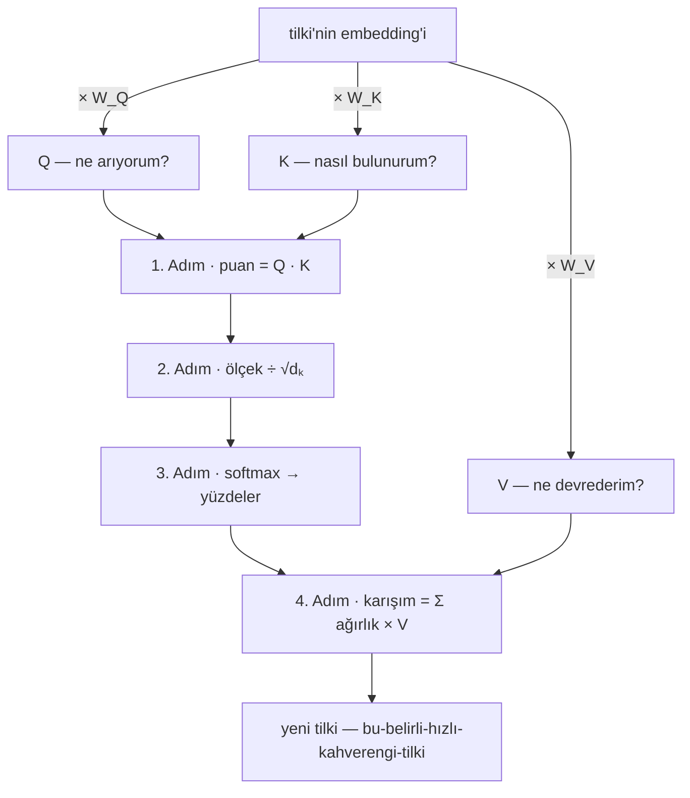
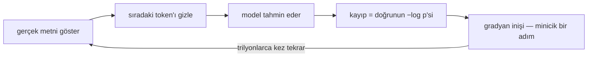
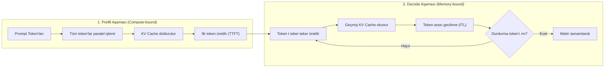

Bu cümleyi bitirmeden zihniniz sıradaki kelimeyi tahmin etmeye başladı
bile. Kanıt mı? "Bir varmış, bir ___." Durduramadınız: boşluk, sizden
izin almadan kendini doldurdu.

O refleksin bir adı var — sıradaki-token tahmini (next-token prediction)
— ve bu yazının tek bir iddiası: bir dil modelinin size yazdığı her
cümle, her deneme, her kod parçası, az önce yaptığı bir hata için
dilediği her özür, aynı refleksin milyarlarca kat büyütülmüşüdür.
Telefon klavyeniz "görüşürüz"den sonra *yarın* önerdiğinde bu oyunun
cep boyunu oynuyor. Peki bu kadar basit bir oyun nasıl sınav geçer,
nasıl yazılım yazar? Çünkü talebi acımasızdır: insan metninde sıradaki
kelimeyi *iyi* tahmin etmek için dil bilgisini, olguları, üslubu ve
akıl yürütmenin işleyen bir taklidini özümsemek zorundasınızdır.
Aşağıdaki her şey bu fikrin dipnotudur.

**Bu yazıda**

- [1. Metin sayıya dönüşür](#1-metin-sayıya-dönüşür)
- [2. Anlam taşıyan sayılar](#2-anlam-taşıyan-sayılar)
- [3. Transformer: bir bağlam makinesi](#3-transformer-bir-bağlam-makinesi)
  - [Q, K, V — mekanizma, sayılarla](#q-k-v-mekanizma-sayılarla)
  - [Tek yön ve causal mask](#tek-yön-ve-causal-mask)
  - [Birçok kafa](#birçok-kafa)
  - [Model aileleri: Neden herkes decoder-only?](#model-aileleri-neden-herkes-decoder-only)
- [4. Katmanlar: bilgi nerede yaşıyor](#4-katmanlar-bilgi-nerede-yaşıyor)
- [5. Eğitim ve ölçek](#5-eğitim-ve-ölçek)
- [6. Otomatik tamamlamadan asistana](#6-otomatik-tamamlamadan-asistana)
- [7. Çıkarım ve üretim: iki aşamalı döngü](#7-çıkarım-ve-üretim-iki-aşamalı-döngü)
  - [Prefill: paralel hesaplama ve TTFT](#prefill-paralel-hesaplama-ve-ttft)
  - [Decode: seri döngü ve ITL](#decode-seri-döngü-ve-itl)
  - [KV cache'in gerçek boyutu ve bellek duvarı](#kv-cachein-gerçek-boyutu-ve-bellek-duvarı)
  - [Prefill ve decode'un çakışması: disaggregation](#prefill-ve-decodeun-çakışması-disaggregation)
  - [Çekilişi yöneten üç kadran: temperature, top-k, top-p](#çekilişi-yöneten-üç-kadran-temperature-top-k-top-p)
- [8. Sizi hatırlamaz: bağlam penceresi](#8-sizi-hatırlamaz-bağlam-penceresi)
- [9. Neden uyduruyor](#9-neden-uyduruyor)
- [10. Otoregresyonun ötesi: Difüzyon LLM'leri (dLLM)](#10-otoregresyonun-ötesi-difüzyon-llmleri-dllm)
- [Bütün hikâye altı satırda](#bütün-hikâye-altı-satırda)
- [Daha derine inmek için](#daha-derine-inmek-için)

---

## 1. Metin sayıya dönüşür

Bir sinir ağı matris çarpar; harflerle veya kelimelerle doğrudan işlem
yapamaz. Bu yüzden her girdi, ağa ulaşmadan önce **tokenizasyon**
aşamasından geçer. Bir **token**, bir dil modelinin metni işlemek için
kullandığı en küçük yapı taşıdır: yerine göre bir kelime, bir ek, bir hece
ya da tek bir karakter olabilir.

Her LLM'in eğitim öncesinde dondurulmuş sabit bir kelime dağarcığı
(**vocabulary**) vardır. Bu sözlükteki her bir token, benzersiz bir
tamsayıya (**token ID**) eşlenir. Metin modele girdiğinde harfler hemen
bu tamsayı dizilerine dönüştürülür. Örneğin `The quick brown fox jumps
over the lazy dog.` cümlesi modern bir tokenizer'dan geçtiğinde şu
parçalara ve kimlik numaralarına ayrılır:

- **Token'lar:** `"The"`, `" quick"`, `" brown"`, `" fox"`, `" jumps"`, `" over"`, `" the"`, `" lazy"`, `" dog"`, `"."`
- **Token ID'leri:** `[976, 4853, 19705, 68347, 65613, 1072, 290, 29082, 6446, 13]`

Bu parçalama işini standart olarak **Byte-Pair Encoding (BPE)** algoritması
yapar. Tıpkı LEGO gibi: dil, en sık yeniden kullanılan tuğlalarına
ayrılır; yaygın kelimeler tek parça kalırken, nadir kelimeler kök ve
eklerine bölünür. Pratik kural: 100 token kabaca 75 İngilizce kelime
eder.

Model harfleri değil yalnızca bu tamsayı damgalarını gördüğü için
"strawberry" kelimesindeki r'leri saymak meşhur biçimde zordu. Bir akıl
yürütme kusuru gibi görünen bu durumun sebebi basittir: kelime modele
ulaştığında çoktan üç bağımsız tamsayıya (`str`, `aw`, `berry`)
dönüşmüştü ve model harfleri hiç görmedi. Sözlük boyutunun parametre
sayısına ve dizi uzunluğuna etkisini daha ayrıntılı incelemek için
[Tokenizasyon nasıl çalışır](post.html?slug=tokenizasyon-nasil-calisir)
yazısına bakabilirsiniz.

## 2. Anlam taşıyan sayılar

Tamsayılar da tek başına yeterli değildir; `4853` sayısının `68347` ile
anlamsal bir benzerliği matematiksel olarak kurulamaz. Bu yüzden her token
ID, modelin ilk katmanında devasa bir ağırlık tablosundan satır çekilerek
bir **embedding** vektörüne dönüştürülür.

Girdi anında bu işlem tek bir aritmetik çarpma bile gerektirmez; sadece
bellekten satır okumaktır (sıfır FLOP). Detaylarını
[Embedding katmanı derinlemesine](post.html?slug=embedding-katmani-derinlemesine)
yazısında ele aldığımız bu lookup mekanizması, ayrık sayıları binlerce
boyutlu sürekli bir anlam uzayındaki geometrik koordinatlara yerleştirir.

Bu uzayı binlerce kadran olarak düşünebilirsiniz: biri resmiyet derecesi,
biri canlılık, biri zaman kipi için... Bu haritada benzer anlamdaki
kelimeler birbirine yakın durur: *kral (king)*, *kraliçe (queen)*
kelimesinin yakınına, *elektronik tablo (spreadsheet)* kelimesinin ise
uzağına düşer. Daha da önemlisi, uzaydaki **yönler** anlamsal ilişkileri
temsil eder. Bunu sadece iki kadranlı sembolik bir haritada dört kelimeyle
görebiliriz: **(2, 1) konumunda *erkek (man)***, **(5, 4) konumunda *kadın
(woman)***, **(3, 6) konumunda *kral (king)*** ve **(6, 9) konumunda
*kraliçe (queen)***:

<svg viewBox="0 0 480 320" role="img" aria-label="İki kadran üzerinde dört kelime: erkek 2,1; kadın 5,4; kral 3,6; kraliçe 6,9. Düz paralel oklar erkek-kadın ve kral-kraliçe cinsiyet yönünü (+3,+3), kesikli paralel oklar erkek-kral ve kadın-kraliçe kraliyet yönünü (+1,+5) gösterir" style="max-width:100%;height:auto;display:block;margin:var(--sp-5) auto;font-family:var(--font-sans)">
<defs>
<marker id="emb-arr" viewBox="0 0 10 10" refX="8" refY="5" markerWidth="7" markerHeight="7" orient="auto-start-reverse"><path d="M0 0 L10 5 L0 10 z" style="fill:var(--c-accent)"/></marker>
<marker id="emb-arr2" viewBox="0 0 10 10" refX="8" refY="5" markerWidth="7" markerHeight="7" orient="auto-start-reverse"><path d="M0 0 L10 5 L0 10 z" style="fill:var(--c-accent-2)"/></marker>
</defs>
<line x1="40" y1="280" x2="460" y2="280" style="stroke:var(--c-border);stroke-width:1.5"/>
<line x1="40" y1="280" x2="40" y2="20" style="stroke:var(--c-border);stroke-width:1.5"/>
<g style="stroke:var(--c-border);stroke-width:1">
<line x1="120" y1="280" x2="120" y2="285"/><line x1="200" y1="280" x2="200" y2="285"/><line x1="280" y1="280" x2="280" y2="285"/><line x1="360" y1="280" x2="360" y2="285"/><line x1="440" y1="280" x2="440" y2="285"/>
<line x1="35" y1="228" x2="40" y2="228"/><line x1="35" y1="176" x2="40" y2="176"/><line x1="35" y1="124" x2="40" y2="124"/><line x1="35" y1="72" x2="40" y2="72"/><line x1="35" y1="20" x2="40" y2="20"/>
</g>
<g style="fill:var(--c-text-mute);font-size:11px" text-anchor="middle">
<text x="120" y="297">2</text><text x="200" y="297">4</text><text x="280" y="297">6</text><text x="360" y="297">8</text><text x="440" y="297">10</text>
</g>
<g style="fill:var(--c-text-mute);font-size:11px" text-anchor="end">
<text x="30" y="232">2</text><text x="30" y="180">4</text><text x="30" y="128">6</text><text x="30" y="76">8</text><text x="30" y="24">10</text>
</g>
<text x="455" y="311" text-anchor="end" style="fill:var(--c-text-mute);font-size:12px">kadran 1</text>
<text x="18" y="150" transform="rotate(-90 18 150)" text-anchor="middle" style="fill:var(--c-text-mute);font-size:12px">kadran 2</text>
<line x1="120" y1="254" x2="160" y2="124" marker-end="url(#emb-arr2)" style="stroke:var(--c-accent-2);stroke-width:1.8;stroke-dasharray:6 5"/>
<line x1="240" y1="176" x2="280" y2="46" marker-end="url(#emb-arr2)" style="stroke:var(--c-accent-2);stroke-width:1.8;stroke-dasharray:6 5"/>
<line x1="120" y1="254" x2="240" y2="176" marker-end="url(#emb-arr)" style="stroke:var(--c-accent);stroke-width:2"/>
<line x1="160" y1="124" x2="280" y2="46" marker-end="url(#emb-arr)" style="stroke:var(--c-accent);stroke-width:2"/>
<circle cx="120" cy="254" r="4.5" style="fill:var(--c-text)"/>
<circle cx="240" cy="176" r="4.5" style="fill:var(--c-text)"/>
<circle cx="160" cy="124" r="4.5" style="fill:var(--c-text)"/>
<circle cx="280" cy="46" r="4.5" style="fill:var(--c-text)"/>
<text x="120" y="272" text-anchor="middle" style="fill:var(--c-text);font-size:13px;font-style:italic">erkek (2, 1)</text>
<text x="252" y="182" text-anchor="start" style="fill:var(--c-text);font-size:13px;font-style:italic">kadın (5, 4)</text>
<text x="148" y="118" text-anchor="end" style="fill:var(--c-text);font-size:13px;font-style:italic">kral (3, 6)</text>
<text x="280" y="32" text-anchor="middle" style="fill:var(--c-text);font-size:13px;font-style:italic">kraliçe (6, 9)</text>
<line x1="300" y1="116" x2="318" y2="116" style="stroke:var(--c-accent);stroke-width:2"/>
<text x="324" y="120" text-anchor="start" style="fill:var(--c-text-mute);font-size:12px">cinsiyet yönü (+3, +3)</text>
<line x1="300" y1="226" x2="318" y2="226" style="stroke:var(--c-accent-2);stroke-width:1.8;stroke-dasharray:6 5"/>
<text x="324" y="230" text-anchor="start" style="fill:var(--c-text-mute);font-size:12px">kraliyet yönü (+1, +5)</text>
</svg>

Vektör aritmetiği bu paralelkenarda kendini kanıtlar:

> kadın − erkek = (5, 4) − (2, 1) = **(+3, +3)** — *cinsiyet* yönü  
> kraliçe − kral = (6, 9) − (3, 6) = **(+3, +3)** — aynı ok, haritanın yukarısında  
> kral − erkek = kraliçe − kadın = **(+1, +5)** — *kraliyet* yönü, iki kez  

Okları birleştirdiğinizde meşhur denklem ortaya çıkar:

> kral − erkek + kadın = (3, 6) − (2, 1) + (5, 4) = **(6, 9) = kraliçe**

Gerçek embedding uzayları binlerce boyutta bu anlamsal geometriyi inşa eder
(anlamsal arama ve kosinüs benzerliği ayrıntıları için bkz:
[Embedding'ler derinlemesine](post.html?slug=embeddingler-derinlemesine)).

Ancak transformer mimarisinin temelinde önemli bir kör nokta vardır:
kelime sırasından habersizdir. Vektörleri torbaya atılmış gibi algılar.
"Köpek adamı ısırdı" ile "adam köpeği ısırdı" cümlelerinin aynı anlama
gelmemesi için modele **konum bilgisi (positional encoding)** verilmek
zorundadır. GPT-2 gibi eski modeller öğrenilmiş mutlak pozisyon vektörlerini
kelime embedding'ine eklerken, günümüz modern LLM'leri (Llama 3, Gemma 3)
**RoPE (Rotary Position Embedding)** kullanır; pozisyon bilgisini doğrudan
attention iç çarpımında vektörleri karmaşık düzlemde döndürerek işler.

## 3. Transformer: bir bağlam makinesi

Embedding tek başına "yüz" kelimesinin ne anlama geldiğini bilemez:
çehre olan yüz mü, sayı olan yüz mü, yoksa yüzmek fiili mi? Anlam ancak
bağlamda netleşir ve **transformer** — GPT'deki T — tam olarak bu bağlamı
çözmek için inşa edilmiş bir makinedir.

Modern bir LLM omurgası üç ana parçadan oluşur:
1. **Girdi temsili:** Token ID'lerinin embedding vektörlerine ve RoPE ile
   konumsal koordinatlara dönüştürülmesi.
2. **Transformer katmanları kulesi:** Bilgiyi token'lar arasında harmanlayan
   self-attention mekanizması ile her token'ı tek başına dönüştüren ileri
   beslemeli ağların (FFN) üst üste istiflenmesi.
3. **Çıktı başlığı (`lm_head`):** Son katmandaki vektörlerin sözlük
   boyutuna izdüşürülerek aday token puanlarına (logits) çevrilmesi.

Eski dil modelleri metni soldan sağa, mesafeyle solan dar bir hafıza
hücresinden (RNN/LSTM) geçirirdi. 2017 tarihli *Attention Is All You Need*
makalesi bu kısıtı çöpe attı ve tek bir çekirdek ilkeye dayandı:
**attention (dikkat)**. Her token, dizideki diğer her token'a doğrudan ve
aynı anda bakar; kimin ne kadar önemli olduğuna kendisi karar verir.

Makalenin ünlü örneğinde izleyin:

> Hayvan caddeyi geçmedi, çünkü **o** çok *yorgundu*.  
> Hayvan caddeyi geçmedi, çünkü **o** çok *genişti*.

Tek bir sıfat değişir ve "o" zamiri taraf değiştirir: birinde hayvandır,
ötekinde cadde. Siz bunu anında çözersiniz; attention ise modelin bu kararı
verme mekanizmasıdır: **bir kelimenin yeni anlamı, diğer kelimelerin
ağırlıklı karışımıdır — ve attention'ın tek işi bu ağırlıkları seçmektir.**

### Q, K, V — mekanizma, sayılarla

Her katmanda model, her token'ın embedding'inden öğrenilmiş üç ağırlık
matrisi ($W_Q, W_K, W_V$) çarparak üç ayrı vektör üretir:

- **Sorgu (Query, Q):** "Ben ne tür bir bilgi arıyorum?"
- **Anahtar (Key, K):** "Ben hangi bilgiyi sunuyorum, başkaları beni nasıl bulur?"
- **Değer (Value, V):** "Bana dikkat edilirse, aktaracağım asıl içerik nedir?"

YouTube aramasıyla düşünün: arama çubuğuna yazdığınız metin sorgudur (Q),
videoların başlık ve etiketleri anahtardır (K), videonun asıl içeriği ise
değerdir (V). Ham embedding'ler yetersiz kalırdı; çünkü arama tek bir
özelliğe odaklanmak ister — "k ile başlar" üzerinden değil, "yorgun
olabilir" üzerinden eşleşme gibi.

Attention mekanizması dört adımdan oluşur:

**1. Adım — Puanla:** Hedef token'ın sorgusu ile diğer kelimelerin
anahtarları iç çarpıma girer: $\text{puan}_i = Q \cdot K_i$.  
**2. Adım — Ölçekle:** Puanlar anahtar vektörünün boyutu $\sqrt{d_k}$'ye
bölünür. Bu bölme işlemi, büyük boyutlu vektörlerin iç çarpımlarının aşırı
büyüyüp softmax gradyanlarını sıfırlamasını engeller:
$\text{ölçekli}_i = \text{puan}_i \div \sqrt{d_k}$.  
**3. Adım — Softmax:** Üstel fonksiyon alınarak puanlar toplamı 1 olan
yüzdelere dönüştürülür.  
**4. Adım — Karıştır:** Değer (V) vektörleri bu yüzdelerle çarpılıp
toplanır.

> [!IMPORTANT]
> **Değer (V) vektörleri puanlama aşamasında kesinlikle hiçbir rol oynamaz.**
> Kimin kime ne kadar dikkat edeceği yalnızca Sorgu (Q) ve Anahtar (K)
> vektörlerinin iç çarpımıyla belirlenir. Değer (V), ağırlıklar
> kesinleştikten sonra taşınacak olan yükün ta kendisidir.

Modelin "Hızlı kahverengi tilki" cümlesinde *tilki* kelimesi üzerindeki
puanlamasını izleyin:

| çift | puan | e^puan | pay (ağırlık) |
|---|---|---|---|
| Q(tilki) · K(hızlı) | 2,1 | 8,2 | **%3** |
| Q(tilki) · K(kahverengi) | 4,0 | 54,6 | **%19** |
| Q(tilki) · K(tilki) | 5,4 | 221,4 | **%78** |

Softmax liderleri ödüllendirir: 5,4 puanı 4,0'dan çok büyük görünmez ama
üstel büyüme sayesinde %78, %19'un dört katı ağırlık kapar. Sonuçta yeni
vektör şudur:

$$\text{tilki}_{\text{yeni}} = 0{,}03 \cdot V(\text{hızlı}) + 0{,}19 \cdot V(\text{kahverengi}) + 0{,}78 \cdot V(\text{tilki})$$

Artık o sözlükteki soyut *tilki* değildir; *bu-belirli-hızlı-kahverengi-tilki*dir.
Formülün meşhur tek satırlık özeti:

$$\text{Attention}(Q, K, V) = \text{softmax}\left(\frac{QK^\top}{\sqrt{d_k}}\right)V$$

### Tek yön ve causal mask

Self-attention mimari olarak dizideki bütün token'lara aynı anda bakma
yeteneğine sahiptir. Ancak otoregresif bir üretimde modelin sıradaki
kelimeyi tahmin edebilmesi için **gelecekteki kelimeleri görmemesi şarttır**.
Aksi takdirde sınavda cevabı önceden görmek gibi hile yapar ve üretim
yeteneği kazanamaz.

Bu sınır **causal mask (nedensel maske / look-ahead mask)** ile çizilir.
Dizideki her $t$ pozisyonu için, kendisinden sonra gelen ($> t$) tüm
pozisyonların attention puanları softmax öncesinde eksi sonsuza ($-\infty$)
eşitlenir:

$$e^{-\infty} = 0$$

Böylece gelecekteki token'ların ağırlığı sıfıra kilitlenir; bilgi akışı
sadece geçmişten bugüne doğru tek yönlü akar. Causal mask eğitimde ve
çıkarımın ilk aşamasında (prefill) tüm token'lar paralel işlenirken hayati
bir emniyet kemeridir. Tekil üretimde (decode) ise gelecek token'lar henüz
ortada olmadığı için maske doğası gereği sağlanır. Maskeler aynı zamanda
farklı uzunluktaki cümleleri gruplarken eklenen dolgu (padding) token'larını
gizlemek için de kullanılır.

### Birçok kafa

Tek bir attention gözlüğü kaba kalırdı: bir kelimenin bir komşusundan dil
bilgisi uyumunu, kilometrelerce ötedeki bir isimden ise zamir referansını
aynı anda çekmesi gerekir.

Bu nedenle her katmanda birden fazla **kafa (attention head)** paralel
çalışır (Multi-Head Attention). Vektör boyutu kafa sayısına bölünür; örneğin
4096 boyut 32 kafaya bölündüğünde her kafa 128 boyutluk bir alt uzayda
uzmanlaşır. Biri özne-yüklem ilişkisini izlerken, diğeri zaman kipini, bir
başkası sıfat tamlamasını takip eder.

### Model aileleri: Neden herkes decoder-only?

Transformer mimarisi farklı görevler için üç ana çatallaşma yaşadı:

| Mimari | Temsilciler | Prefill ve Decode Aşamaları | Temel Görev Alanı |
|---|---|---|---|
| **Encoder-only** | BERT, RoBERTa | Yok. Tek bir ileri geçişte tüm girdiyi çift yönlü işler; üretim yapmaz. | Sınıflandırma, arama, embedding modelleri |
| **Encoder-decoder** | T5, FLAN-T5, BART | Kısmen. Encoder girdiyi çift yönlü okur; decoder otoregresif üretir. | Erken dönem çeviri ve özetleme |
| **Decoder-only** | GPT, Llama, Qwen, DeepSeek, Claude | Var. Causal maskeli paralel prefill ve ardından token token otoregresif decode. | Modern üretken yapay zekânın mutlak standardı |

Bugün LLM denildiğinde neredeyse istisnasız **decoder-only** modellerden
bahsedilmesinin üç somut mühendislik nedeni vardır:
1. **Tek bir hedef fonksiyonu:** Tüm veri tipleri (kod, sohbet, akıl yürütme)
   sıradaki token tahminine dönüştürülebilir; mimari ayrımına gerek kalmaz.
2. **Sıfır sürtünmeli KV cache:** Prefill'de hesaplanan tüm anahtar ve
   değerler tek bir tensör bloğunda saklanır ve üretim boyunca kesintisiz
   kullanılır.
3. **Ölçekleme verimliliği:** Milyarlarca parametreye çıkıldığında donanım
   üzerinde en kararlı ve en yüksek FLOPS verimini decoder-only yapılar
   sağlamıştır.

## 4. Katmanlar: bilgi nerede yaşıyor

Bir attention katmanı ile bir ileri beslemeli ağ (FFN), birlikte bir
**transformer bloğunu (layer)** oluşturur. Modern bir dil modeli bu
bloklardan onlarcasının (32, 80, hatta 120 kat) üst üste konmasıyla
kurulur:

- **Self-Attention (Kütüphaneci):** Diğer token'lardan bağlamı toplar,
  vektörleri birbiriyle kaynaştırır.
- **İleri Beslemeli Ağ / FFN (Ambar):** Toplanan bağlamı her token için tek
  başına sindirir ve dönüştürür.
- **Residual Bağlantı (Bina Kuralı):** Katmanın çıktısı girdisinin üstüne
  eklenir ($x + \text{Katman}(x)$); böylece katmanlar derinleştikçe sinyalin
  ve gradyanların sönümlenmesi engellenir.
- **Normalizasyon (RMSNorm / LayerNorm):** Tensörlerin sayısal normunu
  sabitleyerek katmanlar arası patlamaları önler.

Modelin öğrendiği olgusal bilgilerin (örneğin "Fransa'nın başkenti Paris'tir")
neredeyse üçte ikisi bu **ileri beslemeli ağların (FFN)** ağırlıklarında
depolanır. **Mixture of Experts (MoE)** mimarileri (örneğin Mixtral veya
DeepSeek), her kata tek bir devasa ambar koymak yerine onlarca küçük ambar
yerleştirir ve her token için en uygun 1-2 tanesini dinamik olarak seçer.

Kulenin en tepesinde borç ödenir: **Çıktı Başlığı (`lm_head`)**. Son
katmandan çıkan gizli durum vektörü, kelime dağarcığındaki tüm token'larla
çarpılarak her bir aday için ham logit puanı üretir:

$$\text{puan}(\text{aday}) = \text{son\_vektör} \cdot W_{\text{lm\_head}}(\text{aday})$$

Bu matris çoğu zaman girdi aşamasındaki `embed_tokens` tablosuyla aynı
ağırlıkları paylaşır (weight tying).

## 5. Eğitim ve ölçek

Makinedeki tüm sayılar rastgele gürültü olarak başlar. Onları hizalayan
süreç **ön eğitimdir (pretraining)**: modele internetten toplanan trilyonlarca
token metin gösterilir, sıradaki kelime gizlenir ve tahmin etmesi istenir.
Veri kendi kendini notlandırır; doğru token bellidir.

Hata **çapraz entropi kaybı (cross-entropy loss)** ile ölçülür:

$$\text{Loss} = -\log p(\text{doğru token})$$

Doğru cevaba %90 olasılık vermek $\approx 0{,}10$ kayba, %20 olasılık
vermek $\approx 1{,}60$ kayba yol açar. **Gradyan inişi (gradient descent)**
her parametreyi yokuş aşağı minicik bir adım kaydırarak modeli eğitir.

Ölçeğin getirisi tahmin edilebilir yasalara tabidir. Kaplan ve Chinchilla
**ölçekleme yasaları (scaling laws)**, model parametresi ile eğitim verisi
arasındaki optimum dengeyi parametre başına kabaca **20 token** olarak
sabitledi. 70 milyar parametreli Llama 2'nin 280 milyarlık Gopher'ı geride
bırakabilmesinin sırrı budur.

## 6. Otomatik tamamlamadan asistana

Ön eğitimin çıktısı bir **taban modeldir (base model)**: metin tamamlama
makinesi, o kadar. "Fransa'nın başkenti nedir?" yazdığınızda "Paris" cevabını
verebileceği gibi, arkasından dokuz farklı quiz sorusu da dizebilir; çünkü
eğitim verisinde soru listeleri de vardır.

Onu güvenilir bir asistana çevirmek iki aşamalı bir tornadan geçirir:
1. **Talimatla İnce Ayar (SFT - Supervised Fine-Tuning):** Yüz binlerce
   özenle yazılmış soru-cevap çiftiyle modele bir yardımcının nasıl
   davranması gerektiği öğretilir.
2. **İnsan Geri Bildirimiyle Pekiştirmeli Öğrenme (RLHF / DPO):** İnsanların
   tercih ettiği cevaplar üzerinden modelin üslubu, güvenliği ve dürüstlüğü
   pekiştirilir.

Parametrelerin tamamını eğitmek yerine kenara küçük adaptör matrisleri
ekleyen **LoRA**, bu ince ayar sürecini tek bir GPU'da bile yapılabilir kılar.

## 7. Çıkarım ve üretim: iki aşamalı döngü

Bir model eğitildikten sonra kullanıcı isteklerine cevap verirken çalışan
sürece **çıkarım (inference)** denir. Çıkarım, donanım kaynaklarını tüketim
biçimi açısından birbirine zıt **iki ayrı aşamadan** oluşur.

### Prefill: paralel hesaplama ve TTFT

Kullanıcı uzun bir metin gönderdiğinde, girdinin tamamı modelin elindedir.
Model bu token'ların tamamını devasa tensör matrisleriyle **aynı anda
(paralel)** işler.

- **Donanım karakteri:** Bu aşama **hesaplama-bağımlıdır (compute-bound)**.
  GPU'nun tensör çekirdekleri (Tensor Cores) sonuna kadar zorlanır; işlemci
  neredeyse hiç beklemez.
- **Kritik metrik:** **Time to First Token (TTFT)** — Kullanıcının enter'a
  bastığı andan ilk kelimenin ekranda belirdiği ana kadar geçen milisaniye.
- **Hayati görevi:** Prefill, prompt'taki bütün token'ların Anahtar (K) ve
  Değer (V) vektörlerini hesaplar ve bir sonraki aşama için **KV cache**
  alanına kaydeder.

### Decode: seri döngü ve ITL

İlk token ekrana düştükten sonra model **decode** aşamasına geçer. Burada
artık paralel üretim imkânsızdır; çünkü 50. kelimenin ne olacağını bilmek
için 49. kelimenin üretilmiş olması gerekir. Üretim otoregresif olarak,
**teker teker ve seri** akar.

- **Donanım karakteri:** Bu aşama **bellek-bant-genişliği bağımlıdır
  (memory-bandwidth bound)**. Her tek bir token üretilirken, GPU'nun tüm
  ağırlık matrisleri ve büyüyen KV cache belleği (HBM) baştan sona okunmak
  zorundadır. GPU'nun devasa hesaplama birimleri çoğu zaman bellekten verinin
  gelmesini bekleyerek boş yatar.
- **Kritik metrik:** **Inter-Token Latency (ITL)** — Art arda gelen iki token
  arasında geçen süre (kullanıcının hissettiği akış hızı).

### KV cache'in gerçek boyutu ve bellek duvarı

Attention mekanizmasında her yeni token geçmişteki tüm token'lara bakmak
zorundadır. Eğer bir önbellek olmasaydı, 1000. token üretilirken önceki 999
kelimenin K ve V vektörleri sıfırdan tekrar hesaplanacaktı ($O(n^2)$ işlem
faturası).

**KV Cache**, hesaplanan K ve V vektörlerini GPU belleğinde saklar. Yeni
adımda yalnızca son token için Q, K, V hesaplanır; Q geçmişteki önbellek ile
karşılaştırılır ve yeni K, V önbelleğe eklenir ($O(1)$ hesaplama).

Ancak bu hızın bedeli çok ağırdır: **VRAM tüketimi**. KV cache boyutu şu
formülle hesaplanır:

$$\text{Boyut} = 2 \times \text{katman} \times \text{kafa}_{\text{kv}} \times d_{\text{kafa}} \times \text{bağlam} \times \text{bayt}$$

Somut bir veri merkezi örneğiyle hesaplayalım: **Llama-3-8B (FP16)**:
- Model ağırlıkları GPU'da $\approx 16\text{ GB}$ yer tutar.
- 8.000 token'lık (8K) tek bir sohbetin KV cache'i $\approx 1\text{ GB}$
  tüketir.
- 80 GB'lık bir NVIDIA A100/H100 GPU'da ağırlıklar ve sistem çıktıktan sonra
  geriye yaklaşık 64 GB KV cache alanı kalır.
- **Sonuç:** 80 GB'lık dev bir GPU, 8K bağlam kullanan **en fazla ~60
  eşzamanlı kullanıcıya** hizmet verebilir!

Bir sunucunun kapasite tavanını belirleyen şey model ağırlıkları değil,
**KV cache'in ta kendisidir**. Bu darboğazı aşmak için modern çıkarım
sistemleri üç büyük teknik geliştirmiştir:
1. [vLLM ve PagedAttention](post.html?slug=vllm-derinlemesine): Belleği
   sanal sayfalar halinde yöneterek parçalanmayı (fragmentation) sıfırlar
   ve eşzamanlılığı 2-4 katına çıkarır.
2. **Prefix Caching:** Ortak sistem prompt'larının KV bloklarını hafızada
   tutup yeniden hesaplamayı önler (ayrıntılar için bkz:
   [LLM maliyet ve gecikme optimizasyonu](post.html?slug=llm-maliyet-ve-gecikme-optimizasyonu)).
3. [Quantization (Nicemleme)](post.html?slug=post-training-quantization-llm-cikarim):
   Ağırlıkları ve KV cache'i FP8 veya INT4 formatına indirerek bellek
   ihtiyacını yarıya böler.

### Prefill ve decode'un çakışması: disaggregation

Geleneksel sunucularda prefill ile decode aynı GPU üzerinde yan yana
koşturulur. Ancak ağır bir prefill isteği geldiğinde GPU'nun işlem
çekirdeklerini kilitler; bu sırada milisaniyelerle token yazmakta olan decode
istekleri donar ve kullanıcı tarafında kekeleme (ITL sıçraması) yaşanır.

Modern büyük sistemler bu sorunu **Prefill-Decode Disaggregation (Ayrık
Mimari)** ile çözer: prefill istekleri işlemci gücü yüksek ayrı GPU'larda
yapılır; oluşturulan KV cache blokları ultra hızlı ağlar üzerinden decode
GPU'larına aktarılır. Böylece iki aşama birbirini ezmez.

### Çekilişi yöneten üç kadran: temperature, top-k, top-p

Model son katmanda sözlükteki her kelime için bir logit puanı üretir. Bu
puanların gerçek bir kelimeye dönüşmesini üç parametre yönetir:

- **Temperature (Sıcaklık):** Logit'leri softmax öncesinde $T$'ye böler
  ($z_i \div T$). Düşük sıcaklık ($T \to 0$) dağılımı aşırı sivrileştirir; en
  yüksek puanlı kelimeyi zorunlu kılar (deterministik / greedy — kod ve SQL
  için ideal). Yüksek sıcaklık dağılımı yayvanlaştırır; sürpriz kelimelere şans
  tanır (yaratıcı yazım).
- **Top-k:** En olası $k$ kelimeyi tutar, geriye kalan tüm alternatifleri
  kesip atar.
- **Top-p (Nucleus Sampling):** Kümülatif olasılık toplamı $p$'ye (örneğin
  %90) ulaşana kadar en olası token'ları sepete atar; model kendinden çok
  eminse iki token, kararsızsa seksen token arasından seçim yapar.

## 8. Sizi hatırlamaz: bağlam penceresi

Eğitim bittiğinde modelin ağırlıkları **tamamen donar**. Bir model API'sine
"Benim adım neydi?" diye sorduğunuzda model dünkü konuşmayı hatırlamaz;
çünkü bir iç hafızası yoktur.

Sohbetin sürmesini sağlayan şey, arayüzün her yeni mesajda geçmiş konuşma
dökümünü prompt'un başına ekleyerek modele tekrar göndermesidir. Hafıza
sandığınız şey, **bağlam penceresidir (context window)**. Modelin bir görevi
tek satır kod değiştirmeden prompt içindeki örneklerden öğrenmesine ise
**bağlam içi öğrenme (in-context learning)** denir.

## 9. Neden uyduruyor

2023 yılında *Mata v. Avianca* davasının avukatları, ChatGPT'nin uydurduğu
altı hayali mahkeme kararını yargıca sundular ve 5.000 dolar ceza aldılar.

Bu durum bir hata değil, mimarinin doğasıdır: **LLM bir arama motoru veya
veritabanı değil, bir olasılık motorudur.** Model doğruluğu değil, eğitim
verisine göre *en makul görünen* devamı optimize eder. Verinin bol olduğu
yerde makul olan genellikle doğrudur; bilginin az olduğu yerde ise model
doğruyu bilmediği için değil, cümleyi kurallara uygun tamamlamak zorunda
olduğu için uydurur.

Çözüm adımları bir maliyet merdivenidir:
1. **Prompt Mühendisliği:** Cevap sınırlarını bağlamda çizmek.
2. **RAG (Retrieval-Augmented Generation):** Doğru bilgiyi harici bir
   vektör veritabanından alıp prompt'a eklemek.
3. **Fine-Tuning:** Özel alan terminolojisini modelin kalıcı ağırlıklarına
   işlemek.

## 10. Otoregresyonun ötesi: Difüzyon LLM'leri (dLLM)

Otoregresif decoder-only mimarinin temel bir tavanı vardır: token'ları
teker teker üretmek, kaçınılmaz bir seri hesaplama ve bellek bant genişliği
darboğazı yaratır.

Bu kısıtı kırmak için ortaya çıkan en umut verici yeni paradigma **Difüzyon
LLM'leridir (dLLM - Diffusion LLMs)**. Görsel üretimindeki (Stable
Diffusion) gürültü giderme mantığını metne uyarlarlar:
1. Model, hedef yanıt uzunluğunda rastgele bir gürültü tensörüyle başlar.
2. Birkaç adımda bu gürültüyü paralel olarak rafine eder ve tutarlı metne
   dönüştürür.
3. Yanıt teker teker değil, sisin dağılması gibi **bütün halinde ve aynı anda**
   ortaya çıkar.

Bu paralel süreç token-başına gecikme duvarını yıkar ve modelin üretim
sırasında geriye dönüp kendi kendini düzeltmesine (öz-düzeltme / global
editing) olanak tanır. Inception AI'ın **Mercury** modeli ve Google
DeepMind'ın **Gemini Diffusion** araştırması bu alandaki ilk güçlü
adımlardır. Bugün üretim sistemlerinde otoregresif modeller hâlâ mutlak
hâkimdir; ancak difüzyon mimarileri geleceğin çıkarım sistemleri için en
büyük adaylardan biridir.

## Bütün hikâye altı satırda

1. Metin $\to$ **token** $\to$ **embedding** (ayrık sayılardan sürekli
   geometriye; RoPE ile içe işlenen sıra).
2. **Attention** (Q, K, V) bağlamı toplar (V puanlamaya girmez, sadece
   taşınır); causal mask geleceğe bakışı kilitler; bilgiyi FFN katmanları
   saklar.
3. Mimari standart **decoder-only**'dir; **ön eğitim** ölçekli sıradaki-token
   tahminidir; Chinchilla yasası parametre başına ~20 token önerir.
4. Çıkarım iki fazlıdır: **Prefill** paralel ve hesaplama-bağımlıdır (TTFT);
   **Decode** seri ve bellek-bağımlıdır (ITL).
5. **KV cache** geçmiş K ve V'leri saklayarak çıkarımı mümkün kılar, ancak
   VRAM'i tüketerek sunucunun eşzamanlılık tavanını belirler.
6. Ağırlıklar donuktur, hafıza bağlam penceresidir; model doğruyu değil
   *makul olanı* optimize ettiği için uydurur.

Ve bir dahaki sefere biri bu modellerin nasıl çalıştığını sorduğunda — bir
mülakatçı, bir öğrenci ya da içinizdeki meraklı ses — modelin başladığı
yerden başlayın: sıradaki token'dan.

## Daha derine inmek için

- Vaswani vd., [Attention Is All You Need](https://arxiv.org/abs/1706.03762) (2017) — orijinal Transformer makalesi.
- Modular, [How does an LLM work?](https://handbook.modular.com/llms.txt) — çıkarım fazları ve sistem mimarisi el kitabı.
- Jay Alammar, [The Illustrated Transformer](https://jalammar.github.io/illustrated-transformer/) — klasikleşmiş görsel anlatım.
- Andrej Karpathy, [Let's build GPT from scratch](https://www.youtube.com/watch?v=kCc8FmEb1nY) — bütün makinenin sıfırdan Python ile inşası.
- Bu blogda birbiriyle konuşan diğer derinlemesine incelemeler:
  - [Bir Prompt'un Yolculuğu (1): Tokenizasyon](post.html?slug=tokenizasyon-nasil-calisir) — metinden token ID'sine uzanan BPE masası.
  - [Bir Prompt'un Yolculuğu (2): Embedding Katmanı](post.html?slug=embedding-katmani-derinlemesine) — ayrık sayılardan sürekli geometriye ve $\sqrt{d_{\text{model}}}$ ölçeklemesine.
  - [Bir Prompt'un Yolculuğu (3): Anlamsal Embedding'ler](post.html?slug=embeddingler-derinlemesine) — anlamsal arama ve çok boyutlu vektör uzayları.
  - [vLLM derinlemesine](post.html?slug=vllm-derinlemesine) — PagedAttention, blok tabloları ve KV cache yönetimi.
  - [LLM maliyet ve gecikme optimizasyonu](post.html?slug=llm-maliyet-ve-gecikme-optimizasyonu) — TTFT, ITL, bellek duvarı ve prefix caching.
  - [Post-training quantization](post.html?slug=post-training-quantization-llm-cikarim) — FP16'dan INT4'e ağırlık ve KV cache sıkıştırması.
