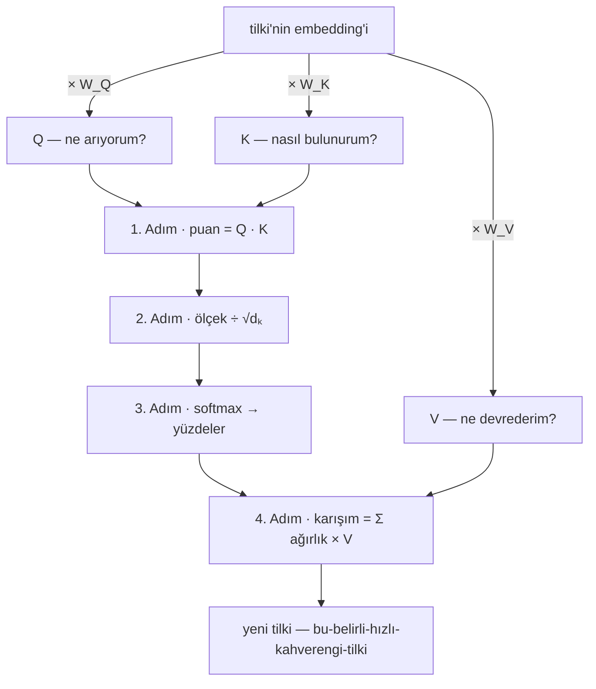
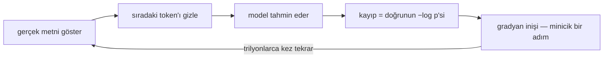

Bu cümleyi bitirmeden zihniniz sıradaki kelimeyi tahmin etmeye başladı
bile. Kanıt mı? "Bir varmış, bir ___." Durduramadınız: boşluk, sizden izin
almadan kendini doldurdu.

O refleksin bir adı var — sıradaki-token tahmini (next-token prediction) — ve bu yazının tek bir
iddiası: bir dil modelinin size yazdığı her cümle, her deneme, her kod
parçası, az önce yaptığı hata için her özür, aynı refleksin milyarlarca
kat büyütülmüşüdür. Telefon klavyeniz "görüşürüz"den sonra *yarın*
önerdiğinde bu oyunun cep boyunu oynuyor. Peki bu kadar basit bir oyun
nasıl sınav geçer, nasıl yazılım yazar? Çünkü talebi acımasızdır: insan
metninde sıradaki kelimeyi *iyi* tahmin etmek için dil bilgisini,
olguları, üslubu ve akıl yürütmenin işleyen bir taklidini özümsemek
zorundasınızdır. Aşağıdaki her şey bu fikrin dipnotudur.

**Bu yazıda**

- [1. Metin sayıya dönüşür](#1-metin-sayıya-dönüşür)
- [2. Anlam taşıyan sayılar](#2-anlam-taşıyan-sayılar)
- [3. Transformer: bir bağlam makinesi](#3-transformer-bir-bağlam-makinesi)
  - [Q, K, V — mekanizma, sayılarla](#q-k-v-mekanizma-sayılarla)
  - [Tek yön](#tek-yön)
  - [Birçok kafa](#birçok-kafa)
- [4. Katmanlar: bilgi nerede yaşıyor](#4-katmanlar-bilgi-nerede-yaşıyor)
- [5. Eğitim ve ölçek](#5-eğitim-ve-ölçek)
- [6. Otomatik tamamlamadan asistana](#6-otomatik-tamamlamadan-asistana)
- [7. Üretim: plan değil, döngü](#7-üretim-plan-değil-döngü)
- [8. Sizi hatırlamaz](#8-sizi-hatırlamaz)
- [9. Neden uyduruyor](#9-neden-uyduruyor)
- [Bütün hikâye beş satırda](#bütün-hikâye-beş-satırda)
- [Daha derine inmek için](#daha-derine-inmek-için)

## 1. Metin sayıya dönüşür

**Tokenizer**, metni **token** denen parçalara böler ve her birine bir
kimlik numarası verir — "için" tek parça, "inanılmaz" belki
"inan + ılmaz". LEGO gibi: dil, en çok yeniden kullanılan parçalarına
ayrılır — yaygın kelimeler bütün kalır, nadirler parçalardan kurulur
(standart algoritma: **byte-pair encoding**, BPE). Pratik kural:
100 token ≈ 75 İngilizce kelime; "128K bağlam penceresi" (context window) kabaca bir roman eder. Model harfleri değil yalnız token kimliklerini gördüğü için
"strawberry"deki r'leri saymak meşhur biçimde zordu — bir tablonun
*fotoğrafındaki* fırça darbelerini saymak gibi.

## 2. Anlam taşıyan sayılar

Her bir token daha sonra bir **gömmeye (embedding)** dönüşür: uzun bir sayı listesi, yani bir anlam haritasındaki koordinatları. Bunları binlerce kadran olarak düşünün — biri resmiyet için, biri zaman kipi için, çoğu ise hiçbir insanın adlandırmadığı nitelikler için. Bu haritada birbiriyle ilişkili kelimeler birbirine yakın durur: *kral (king)*, *kraliçe (queen)* kelimesinin yakınına, *elektronik tablo (spreadsheet)* kelimesinin ise uzağına düşer. Daha da iyisi, *yönler* bir anlam ifade eder. Bunu görmek için, sadece iki kadranlı bir haritaya aşağıdaki çizimden alınan **örnek koordinatları** kullanarak dört kelime yerleştirelim: **(2, 1) konumunda *erkek (man)***, **(5, 4) konumunda *kadın (woman)***, **(3, 6) konumunda *kral (king)*** ve **(6, 9) konumunda *kraliçe (queen)***:

<svg viewBox="0 0 480 320" role="img" aria-label="İki kadran üzerinde dört kelime: erkek 2,1; kadın 5,4; kral 3,6; kraliçe 6,9. Düz paralel oklar erkek-kadın ve kral-kraliçe cinsiyet yönünü (+3,+3), kesikli paralel oklar erkek-kral ve kadın-kraliçe kraliyet yönünü (+1,+5) gösterir" style="max-width:100%;height:auto;display:block;margin:var(--sp-5) auto;font-family:var(--font-sans)">
<defs>
<marker id="emb-arr" viewBox="0 0 10 10" refX="8" refY="5" markerWidth="7" markerHeight="7" orient="auto-start-reverse"><path d="M0 0 L10 5 L0 10 z" style="fill:var(--c-accent)"/></marker>
<marker id="emb-arr2" viewBox="0 0 10 10" refX="8" refY="5" markerWidth="7" markerHeight="7" orient="auto-start-reverse"><path d="M0 0 L10 5 L0 10 z" style="fill:var(--c-accent-2)"/></marker>
</defs>
<line x1="40" y1="280" x2="460" y2="280" style="stroke:var(--c-border);stroke-width:1.5"/>
<line x1="40" y1="280" x2="40" y2="20" style="stroke:var(--c-border);stroke-width:1.5"/>
<g style="stroke:var(--c-border);stroke-width:1">
<line x1="120" y1="280" x2="120" y2="285"/><line x1="200" y1="280" x2="200" y2="285"/><line x1="280" y1="280" x2="280" y2="285"/><line x1="360" y1="280" x2="360" y2="285"/><line x1="440" y1="280" x2="440" y2="285"/>
<line x1="35" y1="228" x2="40" y2="228"/><line x1="35" y1="176" x2="40" y2="176"/><line x1="35" y1="124" x2="40" y2="124"/><line x1="35" y1="72" x2="40" y2="72"/><line x1="35" y1="20" x2="40" y2="20"/>
</g>
<g style="fill:var(--c-text-mute);font-size:11px" text-anchor="middle">
<text x="120" y="297">2</text><text x="200" y="297">4</text><text x="280" y="297">6</text><text x="360" y="297">8</text><text x="440" y="297">10</text>
</g>
<g style="fill:var(--c-text-mute);font-size:11px" text-anchor="end">
<text x="30" y="232">2</text><text x="30" y="180">4</text><text x="30" y="128">6</text><text x="30" y="76">8</text><text x="30" y="24">10</text>
</g>
<text x="455" y="311" text-anchor="end" style="fill:var(--c-text-mute);font-size:12px">kadran 1</text>
<text x="18" y="150" transform="rotate(-90 18 150)" text-anchor="middle" style="fill:var(--c-text-mute);font-size:12px">kadran 2</text>
<line x1="120" y1="254" x2="160" y2="124" marker-end="url(#emb-arr2)" style="stroke:var(--c-accent-2);stroke-width:1.8;stroke-dasharray:6 5"/>
<line x1="240" y1="176" x2="280" y2="46" marker-end="url(#emb-arr2)" style="stroke:var(--c-accent-2);stroke-width:1.8;stroke-dasharray:6 5"/>
<line x1="120" y1="254" x2="240" y2="176" marker-end="url(#emb-arr)" style="stroke:var(--c-accent);stroke-width:2"/>
<line x1="160" y1="124" x2="280" y2="46" marker-end="url(#emb-arr)" style="stroke:var(--c-accent);stroke-width:2"/>
<circle cx="120" cy="254" r="4.5" style="fill:var(--c-text)"/>
<circle cx="240" cy="176" r="4.5" style="fill:var(--c-text)"/>
<circle cx="160" cy="124" r="4.5" style="fill:var(--c-text)"/>
<circle cx="280" cy="46" r="4.5" style="fill:var(--c-text)"/>
<text x="120" y="272" text-anchor="middle" style="fill:var(--c-text);font-size:13px;font-style:italic">erkek (2, 1)</text>
<text x="252" y="182" text-anchor="start" style="fill:var(--c-text);font-size:13px;font-style:italic">kadın (5, 4)</text>
<text x="148" y="118" text-anchor="end" style="fill:var(--c-text);font-size:13px;font-style:italic">kral (3, 6)</text>
<text x="280" y="32" text-anchor="middle" style="fill:var(--c-text);font-size:13px;font-style:italic">kraliçe (6, 9)</text>
<line x1="300" y1="116" x2="318" y2="116" style="stroke:var(--c-accent);stroke-width:2"/>
<text x="324" y="120" text-anchor="start" style="fill:var(--c-text-mute);font-size:12px">cinsiyet yönü (+3, +3)</text>
<line x1="300" y1="226" x2="318" y2="226" style="stroke:var(--c-accent-2);stroke-width:1.8;stroke-dasharray:6 5"/>
<text x="324" y="230" text-anchor="start" style="fill:var(--c-text-mute);font-size:12px">kraliyet yönü (+1, +5)</text>
</svg>

Çizim hilesizdir — koordinatlarla sağlamasını yapın:

> kadın − erkek = (5, 4) − (2, 1) = **(+3, +3)** — *cinsiyet* yönü
> kraliçe − kral = (6, 9) − (3, 6) = **(+3, +3)** — aynı ok, haritanın yukarısında
> kral − erkek = kraliçe − kadın = **(+1, +5)** — *kraliyet* yönü, iki kez

Okları üst üste koyun, ünlü denklem kendiliğinden çıkar:

> kral − erkek + kadın = (3, 6) − (2, 1) + (5, 4) = **(6, 9) = kraliçe**

Bunu haritada yol tarifi gibi okuyun: *kral*dan başlayın, erkek adımını
geri yürüyün, kadın adımını ileri yürüyün — *kraliçe*ye varırsınız. Dört
nokta bir paralelkenara kapanır ve o kapanış, denklemin ta kendisidir.
Gerçek embedding'ler aynı oyunu binlerce kadran üzerinde ve yalnızca yaklaşık oynar — toplam, kraliçenin tam üstüne değil *yakınına* düşer — ama mekanizma budur.

Cinsiyetin bir ayrıcalığı da yok: *Paris*ten *Fransa*ya giden ok, *Roma*dan *İtalya*ya giden okla paraleldir — bir "başkenti-olmak" yönü. Verinin öğretebildiği her ilişki, bu haritada bir yöne dönüşür.

Haritayı kimse çizmedi — öğrenildi. Bir de her token'ın **konumu** işlenir, çünkü "köpek adamı
ısırdı", "adam köpeği ısırdı"dan farklı kalmalıdır.

## 3. Transformer: bir bağlam makinesi

Embedding tek başına "yüz"ün ne olduğunu söyleyemez — surattaki yüz mü,
sayı olan yüz mü? Anlam bağlamda yaşar ve **transformer** — GPT'deki
T — onu okumak için kurulmuş makinedir. Eski tasarımlar metni soldan
sağa, mesafeyle solan tek bir dar hafızadan geçirirdi. 2017 tarihli
*Attention Is All You Need* makalesi bunu atıp tek bir mekanizma tuttu:
**attention** — her token, diğer her token'a *doğrudan* ve aynı anda
bakar, neyin önemli olduğuna kendisi karar verir.

Bu kararı makalenin kendi örneğinde izleyin:

> Hayvan caddeyi geçmedi, çünkü **o** çok *yorgundu*.
> Hayvan caddeyi geçmedi, çünkü **o** çok *genişti*.

Tek kelime değişir, "o" taraf değiştirir. Siz bunu anında çözdünüz;
attention, modelin çözme biçimidir. Bütün numara tek cümledir: **bir
kelimenin yeni anlamı, diğer kelimelerin ağırlıklı karışımıdır — ve
attention'ın bütün işi ağırlıkları seçmektir.** Doğru ağırlık mesafeden
gelemez ("o"yu çözen kelime yirmi token geride olabilir); *içerikten*
hesaplanır — ve öğrenilir.

Makine, üst üste katmanlardan oluşur; her katmanda iki alt katman
vardır: her kelimenin vektörünü diğerlerinin ışığında yeniden yazdığı
**self-attention** ve sonra her kelimeyi tek başına sindiren küçük bir
**ileri beslemeli ağ**. Önce birlikte topla, sonra yalnız sindir. Bu
bölüm birinciyi açar; ikincisi 4. bölümün konusu.

### Q, K, V — mekanizma, sayılarla

Ağırlıklarını seçmek için her token aynı anda üç rol oynar — kendi embedding'inin öğrenilmiş üç küçük kılığı:

- **sorgu (Q)** — ne arıyorum?
- **anahtar (K)** — başkaları beni nasıl bulur?
- **değer (V)** — seçilirsem ne devrederim?

YouTube aynı üçlüyle çalışır: yazdığınız metin sorgudur, her videonun
başlığı anahtardır, videoların kendisi değerdir. Modelde üçü de
token'ın embedding'inden gelir: üç öğrenilmiş tabloyla çarpım — **W_Q,
W_K, W_V** — aynı kelime, üç kıyafet, üçü de aynı anda üstünde. Ham
embedding'ler yetmezdi: embedding kelimenin her şeyini karıştırır,
oysa arama tek seferde tek yön ister — "yorgun olabilir" üzerinden
eşleşen bir sorgu-anahtar çifti, "f ile başlar" üzerinden değil. Sonuç bir **yumuşak sözlüktür** (soft dictionary): her anahtar *kısmen* eşleşir, her değerden
orantılı bir dilim alınır.

Aritmetik iki hamledir: **iç çarpım** (dot product: iki vektörü konum konum çarpıp topla — ne kadar hizalıysa o kadar büyük: bir benzerlik ölçer) ve
**ağırlıklı toplam** (weighted sum: vektörleri yüzdelerle karıştır, tarif gibi).
Bunları dört adım çalıştırır. "Hızlı kahverengi tilki"yi, model
*tilki* üzerinde çalışırken izleyin:

**1. Adım — Puanla.** *Tilki*nin sorgusu her kelimenin anahtarıyla
buluşur: puanᵢ = Q(tilki) · K(kelimeᵢ).

**2. Adım — Ölçekle.** Her puan, anahtar vektörünün boyutu **√dₖ**'ye
bölünür; büyük vektörlerin softmax'ı ya-hep-ya-hiç ağırlıklara
kilitlemesi böyle önlenir: ölçekliᵢ = puanᵢ ÷ √dₖ.

**3. Adım — Softmax'la.** Her puan için *e* üssü alınır, toplama
bölünür; puanlar yüzdeye dönüşür: ağırlıkᵢ = e^puanᵢ ÷ (e^puan₁ + …).

| çift | puan | e^puan | pay |
|---|---|---|---|
| Q(tilki) · K(hızlı) | 2,1 | 8,2 | **%3** |
| Q(tilki) · K(kahverengi) | 4,0 | 54,6 | **%19** |
| Q(tilki) · K(tilki) | 5,4 | 221,4 | **%78** |

Son satırı doğrulayın: 221,4 ÷ 284,2 ≈ %78. Üstel fonksiyonun yaptığına bakın: 5,4, 4,0'ın yalnızca biraz üstünde; ama %78, %19'un dört katı — softmax liderleri ödüllendirir.

**4. Adım — Karıştır.** Yeni *tilki*, değerlerin ağırlıklı toplamıdır:
tilki_yeni = 0,03·V(hızlı) + 0,19·V(kahverengi) + 0,78·V(tilki) —
artık sözlükteki *tilki* değil, *bu-belirli-hızlı-kahverengi-tilki*.

Yukarıdaki her şey tek ünlü satırdır:

> **Attention(Q, K, V) = softmax(QKᵀ / √dₖ) · V**

1. Adım QKᵀ, 2. Adım bölme, 3. Adım softmax, 4. Adım V ile çarpım.
Öğrenilen *tek* parça üç tablodur; gerisi sabit aritmetik — ve tüm
token'lar matris olarak üst üste konduğundan bu tek satır bütün
aramaları aynı anda koşturur: GPU'ların bayıldığı iş. Bedeli **O(n²)**: herkes herkesi puanlar — bağlamı ikiye katlayın, maliyet dörde katlanır.

Bütün mekanizma, tek resimde:

### Tek yön

Üretim sırasında token yalnızca *geriye* bakar: *tilki*, *kahverengi*yi
görür; *kahverengi*, *tilki*yi asla. Modeli *sıradaki*-token tahmincisi
yapan bu maskedir — ve geçmiş bir token'ın anahtarıyla değeri, bir kez
hesaplanınca bir daha değişmez. Bir kenara yazın; 7. bölümde KV cache
olacak. Maske aynı zamanda model ailelerinin anahtarıdır: maske*yle*
kurulan model yazar — **decoder** ailesi: GPT ve neredeyse tüm modern
LLM'ler; maske*siz* kurulan iki yönü görür ve sınıflandırır —
**encoder** ailesi: BERT.

### Birçok kafa

Katman başına tek ağırlıklama kaba kalırdı — kelimenin bir komşudan dil
bilgisine, başkasından göndergeye ihtiyacı var. Bu yüzden her katman,
her biri kendi Q/K/V mercekli, vektörün ince bir dilimiyle çalışan
birçok **kafa** koşturur (orijinal tasarımda 512 ÷ 8 kafa = 64; sekiz
kafa, kabaca tek kafa fiyatına). "O" kodlanırken bir kafa *hayvan*a,
öteki *yorgun*a kilitlenir — gönderge ve gerekçe, aynı anda.

Bütün 3. bölüm, tek kartta:

| soru | cevap |
|---|---|
| Self-attention nedir? | Cümlenin kendine dikkat etmesi: her token, vektörünü diğerlerinin ışığında yeniden yazar |
| Q, K, V nedir? | Token başına üç rol — sorgu: *ne arıyorum?* · anahtar: *nasıl bulunurum?* · değer: *ne devrederim?* |
| Neden üç ayrı vektör? | Embedding her yönü karıştırır; her rol yalnızca kendi işinin yönünü çeker |
| Hesap hangi sırayla akar? | puanla (Q·K) → ölçekle (÷√dₖ) → softmax'la → karıştır (×V) |
| İleri beslemeli ağ nedir? | Her token'ı tek başına sindiren ağ — 4. bölümün bilgi ambarı |

## 4. Katmanlar: bilgi nerede yaşıyor

Bir attention alt katmanıyla bir ileri beslemeli alt katman, birlikte bir **katman** oluşturur; transformer, bu katlardan örülü bir kuledir — onlarca, kimi zaman yüzü aşkın kat. Her katta aynı rutin işler:

- **Attention** — kütüphaneci — diğer token'lardan bağlamı toplar.
- **İleri beslemeli ağ** — ambar — onu tek başına sindirir; "Paris, Fransa ile eşleşir" gibi öğrenilmiş örüntüleri taşır.
- **Residual bağlantı** — bina kuralı — katın çıktısını girdisinin üstüne *ekler*; alttaki hiçbir şey silinmez.

*Tilki* kat kat *kahverengi-hızlı-tilki*ye, sonra *harekete geçmek üzere olan özne*ye büyür; alt katlar yazım ve dil bilgisini, üst katlar olguları ve mantığı üstlenir. Bilgi de çoğunlukla ambarlarda yaşar — tüm **parametrelerin**
kabaca üçte ikisi — cümle olarak değil, milyarlarca ağırlığa yayılmış
halde. Modeli büyütmek çoğunlukla ambarı büyütmektir: GPT-2'nin meşhur
1,5 milyar parametresi (2019) bugün trilyonlara vardı; **mixture of
experts (MoE)** ise her kata birçok ambar koyar, her token en iyi
bir-iki tanesine yönlendirilir.

Çatıda kule borcunu öder: bir *tahmin*. Son token'ın nihai vektörü — artık
bağlamın tamamını kodlar — modelin bildiği her token'la iç çarpıma
girer (GPT-2'de ~50.000):

> puan(aday) = son vektör · adayın embedding'i

**Softmax** puanları olasılığa çevirir. "Bir varmış bir"den sonra kütle
"yokmuş"a yığılır; "En sevdiğim şehir"den sonra yüzlerce şehre dağılır.
İki durumda da model tek sorusunu cevaplar: *sırada ne gelmesi muhtemel?*

## 5. Eğitim ve ölçek

Makinedeki her sayı rastgele gürültü olarak başlar. Onları **ön eğitim** (pretraining) ayarlar: modele trilyonlarca token gerçek metin gösterin,
sıradakini gizleyin, tahmin ettirin. Cevap anahtarı bedavadır — metinde
gerçekten sonra gelen token'dır; veri kendi kendini notlandırır. Her tahmini **kayıp** (loss) puanlar: kayıp = −log p(doğru token) — doğruya %90
vermek ≈ 0,1'e, %20 vermek ≈ 1,6'ya mal olur (karne: **perplexity** =
e^(ortalama kayıp)). **Gradyan inişi** (gradient descent) her parametreyi yokuş aşağı
minicik bir adım kaydırır — sisli bir iniş, trilyonlarca kez — ta ki model, eğitim verisinin JPEG gibi sıkıştırılmışı olana dek: resim kalır, pikseller kalmaz.

Ölçeğin getirisi öngörülebilirdir. **Ölçekleme yasaları** (scaling laws) — kayıp ≈
a · C^(−α), log-log kâğıdında düz çizgi — OpenAI'ın GPT-4'ün nihai
kaybını 10.000 kat küçük denemelerden öngörmesini sağladı; DeepMind'ın
**Chinchilla**sı tarifi parametre başına ~20 token'a sabitledi — 70
milyarlığı, 280 milyarlık Gopher'ı geçti. İki şerh: beceriler yine de
sıçramayla gelebilir (**beliren yetenekler**, emergent abilities) ve kaliteli açık metin
tükeniyor — hesap, cevap anına kayıyor: 7. bölümün akıl yürüten
modelleri.

## 6. Otomatik tamamlamadan asistana

Ön eğitimin ürünü bir **taban modeldir** (base model): metni sürdüren bir makine, o
kadar. "Fransa'nın başkenti nedir?" deyin; "Paris." alabilirsiniz — ya
da dokuz quiz sorusu daha — ya da "diye sordu öğretmen; kimse parmak
kaldırmadı." Hepsi sadık devamlardır; cevabı çekip çıkarmak bir
zamanlar başına kendiniz "S: … C:" yazmayı gerektirirdi — prompt
mühendisliği orada doğdu. İki ucuz aşama asistan yapar:

- **Talimatla ince ayar** (instruction tuning) — on binlerce soru → ideal cevap çiftiyle eğitime devam edilir; ta ki yardımcı cevap en olası devam olana dek.
- **RLHF** — insanlar aday cevapları karşılaştırır, bir ödül modeli (reward model) zevklerini öğrenir, LLM ona doğru ayarlanır: ton, dürüstlük, ret — örneklerin yazamadığı. (Daha da ucuzu **LoRA**: modeli dondurup yanına minik adaptör matrisleri eğitir.)

Vurucu son: GPT-3, ChatGPT'den iki yılı aşkın süre önce
vardı. Devrim bu aşamalardı, daha büyük ağ değil.

## 7. Üretim: plan değil, döngü

Model olasılıkları hesaplar, bir token **örnekler** (sampling), ekler ve özel bir durdurma token'ına (stop token) dek tekrarlar — her yeni token, anında bir sonraki
tahminin girdisidir. Çekilişi üç kadran yönetir. "Gökyüzü ...ydi"den
sonra: *mavi* %60, *karanlık* %10, …, *patates* %0,0001.

- **Temperature**, softmax'tan önce her puanı T'ye böler — T = 0, açgözlü (greedy) ve neredeyse deterministik seçimdir; yüksek T, *karanlık* ile *gri*yi
  yarıştırır. SQL için düşük, beyin fırtınası için yüksek.
- **Top-k**, en olası k token'ı tutar — *patates* silindi.
- **Top-p**, olasılığın örneğin %90'ını örten en küçük kümeyi tutar —
  model eminse iki token, kararsızsa seksen.

Önce buda, sonra çek: cevaplar bu yüzden günden güne değişir ve gökyüzü bu yüzden asla patates olmaz.

Döngü, "adım adım düşün"ün sırrını da açıklar — sayfa, modelin tek
karalama defteridir. 17 × 24 tek hamlede istenirse cevabı tek tahminde
tutturmak zorundadır; 17 × 24 = 340 + 68 = 408 yazmasına izin verilirse
her ara adım bağlama katılır ve sonraki tahmini keskinleştirir. Akıl
yürüten modeller tam bunu sanayileştirir.

Tabloyu ekonomik bir gerçek tamamlar. Eğitim, belgeleri paralel işler;
sohbet, token'ları teker teker üretir — ve bu seri döngüyü ucuz tutan
**KV cache**, 3. bölümün verdiği sözü tahsil eder: geçmiş anahtarlarla
değerler hiç değişmez, bir kez hesaplanır ve saklanır. "Ben seni" bağlamıyla tek tur:

1. "Ben" ile "seni"nin önbellekteki K, V'leri taze sorgu Q₃ ile buluşur — ağırlıklar %30 / %70 düşer.
2. Karışım kulede yükselir; softmax *seviyorum* der (%85); çekiliş onu seçer.
3. "seviyorum" için K₃, V₃ hesaplanır ve önbelleğe katılır; döngü yeniden başlar. **Q hep taze hesaplanır; K ile V hep önbellekten
gelir** — bütün hikâye bu cümledir. Bunu siz de hissettiniz: uzun bir
istemin ilk kelimesinden önceki duraklama, önbelleği kuran
**prefill**'dir; sonrası akar. Fatura bellektir:

> cache = 2 × katman × bağlam × genişlik × bayt ≈ 2 × 32 × 100.000 × 4.096 × 2 ≈ **52 GB** — tek uzun sohbet

— önbelleğe alınmış girdinin daha ucuz fiyatlanması bundandır; öbür
büyük kaldıraç **quantization**'dır: ağırlıkları daha az bitle sakla
(16 → 8 → 4). Çıkarım matematikten çok bayt taşımaya takılır; küçük
ağırlık, hızlı ve ucuz cevap demektir.

## 8. Sizi hatırlamaz

Eğitimden sonra parametreler **donar**. Her mesaj, tüm konuşmayı ağdan
yeniden geçirir — uzun süreli hafızası olmayan, her sabah dosyanın
tamamı eline verilen parlak bir danışman. Hafıza sandığınız, bağlam
penceresidir. Öbür yüzü **bağlam içi öğrenmedir** (in-context learning): "deniz → mer, ev →
maison, kedi → ?" gösterin; *chat* çıkar — görev yalnızca istemden
öğrenildi, tek parametre değişmedi. Pratik prompt mühendisliği tam
budur: bağlamı, istenen devam en olası olacak şekilde dizmek.

## 9. Neden uyduruyor

2023'te *Mata v. Avianca* davasının avukatları, ChatGPT'nin uydurduğu
altı emsal kararı mahkemeye sundu — model, "gerçekler mi?" sorusuna
"evet" demişti. 5.000 dolarlık ceza, "yapay zekâ halüsinasyonu"nu
meşhur etti. Sır yok: model bir olasılık motorudur, veritabanı değil.
Eğitim verisinin zengin olduğu yerde en olası devam genellikle
doğrudur; ince olduğu yerde model yine de cevap *biçiminde* bir şey
üretir — optimize ettiği, doğru değil makuldür. Bu yalan değildir —
yalan, doğruyu bilmeyi gerektirir. Bu, cümleyi tamamlamaktır. Çözümler bir merdivendir — sırayla tırmanın, her basamak daha pahalı:

- **prompting** davranışı bağlamda biçimler;
- **RAG** taze bilgiyi cevap anında getirir;
- **fine-tuning** kalıcı olması gerekeni içine işler.

Ve kaynakları kendiniz kontrol edin: avukatların atladığı adım.

## Bütün hikâye beş satırda

1. Metin → **token** → **embedding** (anlamın koordinatları, konum dahil).
2. **Attention** (sorgu·anahtar·değer) her token'ın vektörünü bağlamıyla
   karıştırır — yalnızca geriye bakarak; bilgiyi ileri beslemeli katmanlar
   depolar.
3. **Ön eğitim** = ölçekli sıradaki-token tahmini; ölçekleme yasaları kazancı
   öngörülebilir kılar; talimatla ince ayar + RLHF taban modeli asistana çevirir.
4. Üretim = örnekle, ekle, tekrarla — temperature, top-k, top-p çekilişi
   ayarlar; KV cache bunu ödenebilir kılar.
5. Donmuş ağırlıklar; hafıza bağlam penceresidir; akıcıdır çünkü *makul*ü
   optimize eder — uydurmasının sebebi de aynıdır.

Ve bir dahaki sefere biri bu modellerin nasıl çalıştığını sorduğunda — bir
mülakatçı, bir öğrenci ya da içinizdeki meraklı ses — modelin başladığı
yerden başlayın: sıradaki token'dan.

Son bir şey. Bu yazının ilk satırında zihniniz boşluğa "yokmuş" yazdı —
anında, emin, saf örüntüden. Artık bir makinenin aynısını nasıl yaptığını
tam olarak biliyorsunuz. Bütün hikâye bu.

## Daha derine inmek için

- Vaswani vd., [Attention Is All You Need](https://arxiv.org/abs/1706.03762) (2017) — orijinal Transformer makalesi; yorgundu/genişti örneği onlarındır.
- Jay Alammar, [The Illustrated Transformer](https://jalammar.github.io/illustrated-transformer/) — klasikleşmiş görsel anlatım.
- Ebrahim Pichka, [What are Query, Key, and Value in the Transformer Architecture?](https://medium.com/data-science/what-are-query-key-and-value-in-the-transformer-architecture-and-why-are-they-used-acbe73f731f2) — QKV sezgisinin, yumuşak sözlük bakışı dahil, özenli bir açılımı.
- Andrej Karpathy, [Let's build GPT from scratch](https://www.youtube.com/watch?v=kCc8FmEb1nY) — bütün makinenin gözünüzün önünde kodla inşası.
