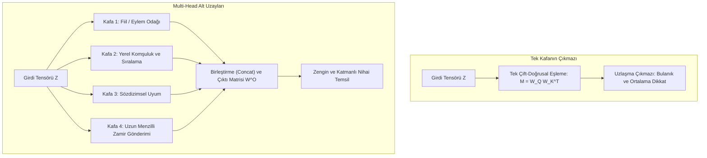
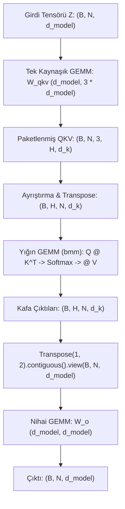

Bir dil modeline bir prompt verdiğinizde, serimizin önceki bölümlerinde izlediğimiz temel aşamalar metni çoktan geometriye dönüştürmüştür:
1. [Tokenizasyon](post.html?slug=tokenizasyon-nasil-calisir) masasında metin ayrık tamsayılara (`[1054, 492, 281]`) bölünür.
2. [Embedding Katmanı](post.html?slug=embedding-katmani-derinlemesine), bu tamsayıları sözlük tablosundan okuyarak sürekli vektörlere çevirir ve döner konumsal kodlama (RoPE) ile dizilim geometrisini hazırlar.
3. [Self-Attention Mekanizması](post.html?slug=self-attention-derinlemesine), token'ların Query, Key ve Value izdüşümleriyle birbirine bakmasını ve cümlenin anlık bağlamıyla zenginleşmiş dinamik temsil vektörleri üretmesini sağlar.

Serimizin 4. bölümünde incelediğimiz somut üç kelimelik cümleyi hatırlayalım: **`["köpek", "kediyi", "kovaladı"]`** (özne, nesne ve eylem). Orada tek bir projeksiyon seti ($W_Q, W_K, W_V$) kullanarak her kelimenin Query fenerini Key rozetlerine tutmuş ve tüm token'ların ağırlıklı olarak fiile ("kovaladı") odaklandığı fiil-merkezli bir dikkat matrisi elde etmiştik.

Ancak bu noktada tek-başlıklı (single-head) dikkat mekanizmasının aşamayacağı çok temel bir kısıtla karşılaşırız: doğal dilde hiçbir zaman tek bir ilişki türü yaşanmaz. Aynı cümlenin içinde, aynı anda birbiriyle çakışan ve bağımsız çalışan birden çok dilbilgisel eksen mevcuttur:
- Özne–fiil bağımlılığı ("köpek" $\to$ "kovaladı")
- Nesne–fiil bağımlılığı ("kediyi" $\to$ "kovaladı")
- Yerel sözcük sırası ve komşuluk bağı ("köpek" kelimesinin hemen ardından "kediyi" gelmesi)
- Sözdizimsel bağlar, niteleme ilişkileri ve zamir gönderimleri

Tek-başlıklı dikkat mekanizmasında tüm $d_{\text{model}}$ boyutu, tek bir çift-doğrusal benzerlik matrisi ($M = W_Q W_K^T$) öğrenmek için kullanılır. Tek bir matris uzayda yalnızca tek bir geometrik yönelim yakalayabileceğinden, dildeki tüm bu farklı ilişkileri aynı anda temsil etmek zorunda kaldığında **"ortalama bir uzlaşma çıkmazına"** saplanır: ya fiile odaklanıp yerel sözcük sırasına körleşir ya da yanındaki komşuya odaklanıp cümlenin yüklemini kaçırır.

Bu yazı, serimizin 5. adımı olarak **Multi-Head Attention (Çok Başlıklı Dikkat)** mimarisinin bu uzlaşma çıkmazını nasıl kırdığını açıyor. Gizli boyutu bağımsız alt uzaylara ($d_k = d_{\text{model}} / H$) bölmenin getirdiği sıfır ekstra parametre avantajını, Bölüm 4'teki somut tensörlerimiz üzerinde iki kafanın tamamen zıt iki perspektife (fiil-merkezli ve komşuluk-merkezli) yerleştiği adım adım sayısal hesap yürüyüşünü, rastgele ağırlık başlangıcından doğan simetri kırılması ve pozitif geri besleme dinamiklerini, literatürdeki çığır açıcı kafa budama araştırmalarını (Michel, Voita, Anthropic'in indüksiyon kafaları), GPU'ların bu işlemi tek bir kaynaşık GEMM ve sıfır bellek kopyalamalı reshape hilesiyle nasıl koşturduğunu ve çıkarımda bellek bant genişliğini kilitleyen devasa KV cache faturasının modern mimarileri neden MQA ve GQA'ya zorladığını berrak ve bütüncül bir dille ortaya koyuyor.

**Bu yazıda**

- [1. Tek projektörden çoklu merceklere: Multi-Head sezgisi ve tek kafanın çıkmazı](#1-tek-projektörden-çoklu-merceklere-multi-head-sezgisi-ve-tek-kafanın-çıkmazı)
- [2. Multi-Head Attention matematiği: Alt uzaylar, Concat ve WO izdüşümü](#2-multi-head-attention-matematiği-alt-uzaylar-concat-ve-wo-izdüşümü)
- [3. Adım adım sayısal hesap: İki kafa, iki bağımsız bakış açısı](#3-adım-adım-sayısal-hesap-iki-kafa-iki-bağımsız-bakış-açısı)
- [4. Donanım gerçeği: GPU üzerinde Multi-Head hesaplama ve tensör hileleri](#4-donanım-gerçeği-gpu-üzerinde-multi-head-hesaplama-ve-tensör-hileleri)
- [5. Eğitim dinamiği: Rastgele başlangıçtan simetri kırılmasına](#5-eğitim-dinamiği-rastgele-başlangıçtan-simetri-kırılmasına)
- [6. Uzmanlaşma garanti midir? Kafa budama ve indüksiyon kafaları](#6-uzmanlaşma-garanti-midir-kafa-budama-ve-indüksiyon-kafaları)
- [7. İki mühendislik gözü: Training vs Inference ve MHAnın evrimi](#7-iki-mühendislik-gözü-training-vs-inference-ve-mhanın-evrimi)
- [8. PyTorch ile adım adım tam doğrulama](#8-pytorch-ile-adım-adım-tam-doğrulama)
- [Bütün hikâye altı satırda](#bütün-hikâye-altı-satırda)
- [Terimler sözlüğü](#terimler-sözlüğü)
- [Daha derine inmek için](#daha-derine-inmek-için)

---

## 1. Tek projektörden çoklu merceklere: Multi-Head sezgisi ve tek kafanın çıkmazı

Multi-Head Attention mekanizmasının varlık sebebini kavramak için bir tiyatro sahnesi veya fotoğraf stüdyosu hayal edelim.

Tavanda asılı tek bir devasa beyaz projektör olduğunu düşünün. Bu projektörü sahneye doğru açtığınızda tüm alanı tekdüze, ortalama bir beyaz ışıkla aydınlatır. Işığı başroldeki oyuncuya doğrultabilirsiniz; ancak bunu yaptığınızda arka plandaki ayrıntılar sert gölgelerin ardında kaybolur. Işığın açısını genişletip hem oyuncuyu hem de arkadaki dekoru aydınlatmaya çalıştığınızda ise ışık yoğunluğu her yerde düşer; ne oyuncunun yüz ifadeleri belirginleşir ne de arka plandaki dokular net seçilebilir. Tek bir ışık kaynağıyla aynı anda hem oyuncunun yüzüne yüksek kontrastlı bir portre ışığı, hem dekorlara yumuşak bir dolgu ışığı, hem de oyuncuların silüetini arka plandan ayıran keskin bir kontur ışığı veremezsiniz.

Profesyonel bir tiyatro sahnesi bu sorunu tek bir dev ampulü imkânsız biçimlerde bükerek çözmez. Bunun yerine tavana **birbirinden bağımsız çok sayıda spot lamba** yerleştirir; her lambanın kendi odak açısı, kendi konumu ve kendi renk filtresi vardır:
- **Spot 1:** Doğrudan başrol oyuncusunun mimiklerine kilitlenen dar, sıcak tonlu bir huzme.
- **Spot 2:** Sahnenin geneline yayılan ve atmosferi kuran soğuk tonlu yumuşak dolgu ışığı.
- **Spot 3:** Karakterlerin hatlarını arkadaki dekordan ayıran keskin ters ışık (kontur ışığı).



İnsan dilindeki her cümle de böylesine katmanlı bir sahnedir. Aynı anda gerçekleşen ilişki ağlarını düşünün:
- **Özne–fiil ilişkisi:** Eylemi kimin gerçekleştirdiğini tespit etme ("köpek" $\to$ "kovaladı").
- **Nesne–fiil ilişkisi:** Eylemin kime/neye yöneldiğini tespit etme ("kediyi" $\to$ "kovaladı").
- **Yerel konum ve komşuluk:** Kelimelerin hemen bitişiğindeki sözcükle kurduğu öbek bağları.
- **Sözdizimsel bağlar:** Dilbilgisel cinsiyet, sayı veya durum eki uyumu.
- **Anlamsal niteleme:** Sıfatların ait olduğu isimlere bağlanması ("kara" $\to$ "kedi").
- **Uzun menzilli zamir bağı:** Cümlenin başındaki bir isme üç cümle sonraki "o" zamirinin bağlanması.

Bölüm 4'te ispatladığımız üzere, Query ve Key arasındaki iç çarpım temelde şu çift-doğrusal (bilinear) harita tarafından yönetilir:

$$M = W_Q W_K^T \in \mathbb{R}^{d_{\text{model}} \times d_{\text{model}}}$$

Bu $M$ matrisi, iki token arasındaki etkileşimin geometrik kuralını koyar. Ancak tek bir $M$ matrisinin uzayda yalnızca tek bir baskın yönelimi olabilir. Eğer optimizasyon süreci $W_Q$ ve $W_K$'yi fiil ilişkisini yakalayacak biçimde eğitirse, $q_i^T k_j$ çarpımı $j$ token'ı bir fiil olduğunda tepe noktasına ulaşır. Fakat bunu yaptığı anda, aynı token'ın hemen solundaki komşusuyla olan yerel bağını ölçecek geometrik serbestliği kaybeder. Cümledeki tüm ilişkileri tek bir $M$ matrisine sıkıştırmak, onu **"herkese az çok uyan ama hiçbirine tam oturmayan"** silik bir uzlaşmaya zorlar.

Multi-Head Attention, bu kısıtı modele $H$ adet bağımsız çift-doğrusal harita vererek çözer:

$$M^{(h)} = W_Q^{(h)} \left(W_K^{(h)}\right)^T, \quad h \in \{1, 2, \dots, H\}$$

Tıpkı bir evrişimli sinir ağında (CNN) tek bir filtrenin tüm resmi okumaya çalışmaması; 1. filtrenin yatay kenarlara, 2. filtrenin dairesel köşelere, 3. filtrenin ise doku desenlerine duyarlı hâle gelmesi gibi, her dikkat kafası da kendi alt uzayında dilin bambaşka bir eksenine uzmanlaşır.

> [!NOTE]
> **Tek Merceğin Bütçe Paradoksu (%131 İkilemi):** Bir cümledeki *"kovaladı"* kelimesinin bağlamını tam olarak yakalayabilmek için yapay zekanın iki farklı şeye odaklanması gerekir: eylemin ne olduğuna (kendi kelimesine: %56,1 oranında) ve eylemin kime yapıldığına (nesneye, yani *"kediyi"* kelimesine: %75,0 oranında). Ancak Softmax kuralı gereği tek bir dikkat başının toplam bütçesi her zaman tam olarak %100'dür. İki hedefin ihtiyaç duyduğu odaklanma toplandığında %131,1 ettiği için, tek bir %100'lük bütçe ile bu iki güçlü ilişki aynı anda temsil edilemez; puanlar ortak paydayı şişirerek birbirini seyreltir. Multi-Head Attention, her bir anlamsal ilişkiye kendi bağımsız %100 bütçesini tahsis eden mimaridir.

---

## 2. Multi-Head Attention matematiği: Alt uzaylar, Concat ve WO izdüşümü

Multi-Head Attention'ın matematiksel yapısı, toplam tensör boyutunu şişirmeden hesaplama uzayını $H$ paralel alt uzaya bölmesi bakımından son derece zariftir.

$N$ token'dan oluşan ve her token'ın $d_{\text{model}}$ boyutlu bir vektörle temsil edildiği girdi matrisimizi $Z \in \mathbb{R}^{N \times d_{\text{model}}}$ olarak tanımlayalım. $Z$'yi doğrudan tek bir $d_{\text{model}}$ uzayına yansıtmak yerine, her kafa için bağımsız projeksiyon ağırlıkları tanımlanır.

Her $h \in \{1, 2, \dots, H\}$ kafası için:

$$Q_h = Z W_Q^{(h)}, \quad K_h = Z W_K^{(h)}, \quad V_h = Z W_V^{(h)}$$

Buradaki ağırlık matrislerinin boyutları:

$$W_Q^{(h)} \in \mathbb{R}^{d_{\text{model}} \times d_k}, \quad W_K^{(h)} \in \mathbb{R}^{d_{\text{model}} \times d_k}, \quad W_V^{(h)} \in \mathbb{R}^{d_{\text{model}} \times d_v}$$

Standart Transformer mimarilerinde her kafanın boyutu model boyutunun kafa sayısına eşit bölünmesiyle elde edilir:

$$d_k = d_v = \frac{d_{\text{model}}}{H}$$

Her kafa, kendi alt uzayında bağımsız scaled dot-product attention işlemini çalıştırır:

$$\text{head}_h = \text{softmax}\left(\frac{Q_h K_h^T}{\sqrt{d_k}}\right) V_h \in \mathbb{R}^{N \times d_v}$$

Elde edilen $H$ adet kafa çıktısı, özellik ekseni boyunca yan yana eklenir (concatenate edilir):

$$\text{Concat}(\text{head}_1, \text{head}_2, \dots, \text{head}_H) \in \mathbb{R}^{N \times (H \cdot d_v)} = \mathbb{R}^{N \times d_{\text{model}}}$$

Son olarak, bu birleştirilmiş blok $W^O$ çıktı matrisi ile çarpılarak model boyutuna geri indirgenir:

$$\text{MultiHead}(Z) = \text{Concat}(\text{head}_1, \text{head}_2, \dots, \text{head}_H) W^O$$

Burada:

$$W^O \in \mathbb{R}^{d_{\text{model}} \times d_{\text{model}}}$$

### Sembol sembol okuma:

- $Z \in \mathbb{R}^{N \times d_{\text{model}}}$: Modele giren $N$ token'lık gömme matrisi.
- $H$: Paralel çalışan bağımsız dikkat kafası sayısı (örneğin orijinal Transformer Base'de 8, LLaMA-3 8B'de 32).
- $d_k, d_v$: Her bir dikkat kafasının alt uzay boyutu ($d_{\text{model}} / H$).
- $W_Q^{(h)}, W_K^{(h)}, W_V^{(h)}$: $d_{\text{model}}$ boyutundaki girdiyi $h$. kafanın dar alt uzayına indiren öğrenilebilir projeksiyon matrisleri.
- $Q_h K_h^T / \sqrt{d_k}$: $h$. kafanın kendi alt uzayındaki benzerlik matrisi.
- $\text{head}_h$: $h$. kafanın ürettiği, Value vektörlerinin ağırlıklı harmanı olan $d_v$ boyutlu bağlam temsili.
- $\text{Concat}(\dots)$: Tüm alt uzay çıktılarının yan yana dizilerek yeniden $d_{\text{model}}$ genişliğine ulaştığı birleştirme adımı.
- $W^O$: Yan yana dizilen farklı bakış açılarını harmanlayıp residual akışa aktaran nihai doğrusal dönüşüm matrisi.

### Parametre ve FLOP nötrlüğü paradoksu

İlk bakışta $H$ tane paralel kafa çalıştırmanın parametre sayısını ve hesaplama karmaşıklığını $H$ kat artıracağı düşünülebilir. Oysa Multi-Head Attention, tek-başlıklı dikkat mekanizmasına kıyasla **neredeyse sıfır ekstra parametre ve sıfır ekstra projeksiyon FLOP'u** harcar.

Parametre matematiğini yan yana inceleyelim:

| Bileşen | Tek Başlıklı Dikkat ($d_k = d_{\text{model}}$) | Multi-Head Attention ($H$ kafa, $d_k = d_{\text{model}}/H$) |
| :--- | :--- | :--- |
| **Query Projeksiyonları** | $W_Q \in \mathbb{R}^{d_{\text{model}} \times d_{\text{model}}} \implies d_{\text{model}}^2$ | $H \times \left(d_{\text{model}} \times \frac{d_{\text{model}}}{H}\right) = d_{\text{model}}^2$ |
| **Key Projeksiyonları** | $W_K \in \mathbb{R}^{d_{\text{model}} \times d_{\text{model}}} \implies d_{\text{model}}^2$ | $H \times \left(d_{\text{model}} \times \frac{d_{\text{model}}}{H}\right) = d_{\text{model}}^2$ |
| **Value Projeksiyonları** | $W_V \in \mathbb{R}^{d_{\text{model}} \times d_{\text{model}}} \implies d_{\text{model}}^2$ | $H \times \left(d_{\text{model}} \times \frac{d_{\text{model}}}{H}\right) = d_{\text{model}}^2$ |
| **Çıktı Projeksiyonu $W^O$** | $W^O \in \mathbb{R}^{d_{\text{model}} \times d_{\text{model}}} \implies d_{\text{model}}^2$ | $W^O \in \mathbb{R}^{d_{\text{model}} \times d_{\text{model}}} \implies d_{\text{model}}^2$ |
| **Toplam Projeksiyon Parametresi** | $\mathbf{4 d_{\text{model}}^2}$ | $\mathbf{4 d_{\text{model}}^2}$ |

Toplam projeksiyon parametre sayısı iki tarafta da kuruşu kuruşuna $4 d_{\text{model}}^2$'dir.

Hesaplama işleminde de durum farksızdır: Tek-başlıklı dikkatte $Q K^T$ çarpımı $N \times d_{\text{model}} \times N = N^2 d_{\text{model}}$ çarpma-toplama işlemi gerektirir. Multi-head yapıda ise her kafa $d_k = d_{\text{model}} / H$ boyutunda $N^2 (d_{\text{model}} / H)$ işlem yapar. $H$ kafa boyunca topladığınızda:

$$H \times \left(N^2 \frac{d_{\text{model}}}{H}\right) = N^2 d_{\text{model}}$$

Hesap yükü birebir aynı kalır. Multi-Head Attention hesaplama bütçesini artırmaz; mevcut bütçeyi tek bir hantal uzaydan $H$ adet kıvrak alt uzaya paylaştırır.

---

## 3. Adım adım sayısal hesap: İki kafa, iki bağımsız bakış açısı

İki kafanın dildeki çelişen ilişkileri nasıl ayrıştırdığını somutlaştırmak için Bölüm 4'teki oyuncak modelimiz üzerinden elle tam bir hesaplama yürüyüşü yapalım.

Bölüm 4'teki değişkenlerimizi koruyoruz:
- Token sayısı: $N = 3$ (`["köpek", "kediyi", "kovaladı"]`, yani özne, nesne ve fiil).
- Toplam model boyutu: $d_{\text{model}} = 4$.
- Kafa sayısı: $H = 2$.
- Alt uzay boyutu: $d_k = d_v = d_{\text{model}} / H = 4 / 2 = 2$.

Girdi matrisimiz $Z \in \mathbb{R}^{3 \times 4}$, Bölüm 4'teki değerlerle tamamen aynıdır:

$$Z = \begin{bmatrix} 0,21 & 0,82 & 0,13 & 0,44 \\ 0,95 & 0,16 & 0,37 & 0,28 \\ 0,19 & 0,40 & 1,01 & 0,82 \end{bmatrix} \quad \begin{matrix} \text{token 1 (köpek — özne)} \\ \text{token 2 (kediyi — nesne)} \\ \text{token 3 (kovaladı — fiil)} \end{matrix}$$

### Kafa 1: Fiil-merkezli kafa

Bölüm 4'te elle hesapladığımız tek-kafa dikkat matrisini hatırlayalım:

$$A^{(1)} = \begin{bmatrix} 0,266 & 0,280 & 0,454 \\ 0,232 & 0,273 & 0,495 \\ 0,193 & 0,246 & 0,561 \end{bmatrix}$$

Bu desene dikkatle bakın: her satırda en yüksek dikkat ağırlığı 3. token olan fiile ("kovaladı") verilmiştir: $\%45,4$, $\%49,5$ ve $\%56,1$. Kafa 1, cümlenin ana yüklemine kilitlenen **fiil-merkezli bir kafa** olarak uzmanlaşmıştır.

Kafa 1'in Value ağırlık matrisi $W_V^{(1)} \in \mathbb{R}^{4 \times 2}$ olarak Bölüm 4'teki $W_V$'nin ilk iki sütununu alalım:

$$W_V^{(1)} = \begin{bmatrix} 1,0 & 0,0 \\ 0,0 & 1,0 \\ 1,0 & 1,0 \\ 0,0 & 0,0 \end{bmatrix}$$

$V_1 = Z W_V^{(1)} \in \mathbb{R}^{3 \times 2}$ matrisini çarpalım:
- Token 1: $[0,21(1) + 0,13(1), \; 0,82(1) + 0,13(1)] = [0,34, 0,95]$
- Token 2: $[0,95(1) + 0,37(1), \; 0,16(1) + 0,37(1)] = [1,32, 0,53]$
- Token 3: $[0,19(1) + 1,01(1), \; 0,40(1) + 1,01(1)] = [1,20, 1,41]$

```text
V_1 Matrisi:
  token 1 (köpek):    [0.340, 0.950]
  token 2 (kediyi):   [1.320, 0.530]
  token 3 (kovaladı): [1.200, 1.410]
```

Şimdi bu alt uzaydaki bağlam çıktısını ($\text{head}_1 = A^{(1)} V_1$) hesaplayalım:
- Satır 1: $0,266 [0,34, 0,95] + 0,280 [1,32, 0,53] + 0,454 [1,20, 1,41] = [1,005, 1,041]$
- Satır 2: $0,232 [0,34, 0,95] + 0,273 [1,32, 0,53] + 0,495 [1,20, 1,41] = [1,033, 1,063]$
- Satır 3: $0,193 [0,34, 0,95] + 0,246 [1,32, 0,53] + 0,561 [1,20, 1,41] = [1,064, 1,105]$

$$\text{head}_1 = \begin{bmatrix} 1,005 & 1,041 \\ 1,033 & 1,063 \\ 1,064 & 1,105 \end{bmatrix}$$

Gördüğünüz gibi bu sayılar, Bölüm 4'te elde ettiğimiz 4 boyutlu bağlam vektörlerinin ilk iki sütununa birebir eşittir.

### Kafa 2: Yerel komşuluk ve konum kafası

Şimdi tamamen bağımsız başlatılmış ikinci bir ağırlık üçlüsü $(W_Q^{(2)}, W_K^{(2)}, W_V^{(2)})$ düşünelim. Eğitim süreci boyunca bu ikinci kafa bambaşka bir örüntüye oturmuş olsun: **yerel komşuluk**.

Eğitilmiş Kafa 2'nin dikkat dağılımı şöyle gerçekleşmiş olsun:

$$A^{(2)} = \begin{bmatrix} 0,85 & 0,10 & 0,05 \\ 0,15 & 0,80 & 0,05 \\ 0,05 & 0,75 & 0,20 \end{bmatrix}$$

Bu matrisi birlikte okuyalım:
- "köpek" en çok kendine bakıyor ($\%85$).
- "kediyi" en çok kendine bakıyor ($\%80$).
- "kovaladı" ise fiil odağı yerine, hemen solundaki komşusu olan "kediyi" kelimesine ($\%75$) bakıyor!

Kafa 1 cümlenin geneline ve eyleme bakarken, Kafa 2 doğrudan yerel sözcük sırasına ve hemen önceki kelimeye odaklanmaktadır.

Kafa 2'nin Value ağırlık matrisi $W_V^{(2)} \in \mathbb{R}^{4 \times 2}$ şöyle olsun:

$$W_V^{(2)} = \begin{bmatrix} 0,0 & 1,0 \\ 1,0 & 0,0 \\ 0,0 & 0,0 \\ 1,0 & 1,0 \end{bmatrix}$$

$V_2 = Z W_V^{(2)} \in \mathbb{R}^{3 \times 2}$ matrisini çarpalım:
- Token 1: $[0,82(1) + 0,44(1), \; 0,21(1) + 0,44(1)] = [1,26, 0,65]$
- Token 2: $[0,16(1) + 0,28(1), \; 0,95(1) + 0,28(1)] = [0,44, 1,23]$
- Token 3: $[0,40(1) + 0,82(1), \; 0,19(1) + 0,82(1)] = [1,22, 1,01]$

```text
V_2 Matrisi:
  token 1 (köpek):    [1.260, 0.650]
  token 2 (kediyi):   [0.440, 1.230]
  token 3 (kovaladı): [1.220, 1.010]
```

Şimdi Kafa 2'nin bağlam çıktısını ($\text{head}_2 = A^{(2)} V_2$) hesaplayalım:
- Satır 1: $0,85 [1,26, 0,65] + 0,10 [0,44, 1,23] + 0,05 [1,22, 1,01] = [1,176, 0,726]$
- Satır 2: $0,15 [1,26, 0,65] + 0,80 [0,44, 1,23] + 0,05 [1,22, 1,01] = [0,602, 1,132]$
- Satır 3: $0,05 [1,26, 0,65] + 0,75 [0,44, 1,23] + 0,20 [1,22, 1,01] = [0,637, 1,157]$

$$\text{head}_2 = \begin{bmatrix} 1,176 & 0,726 \\ 0,602 & 1,132 \\ 0,637 & 1,157 \end{bmatrix}$$

### Birleştirme (Concat) ve WO ile harmanlama

Şimdi bu iki bağımsız bakış açısını sütun bazında yan yana yapıştırıyoruz:

$$\text{Concat}(\text{head}_1, \text{head}_2) = \begin{bmatrix} 1,005 & 1,041 & 1,176 & 0,726 \\ 1,033 & 1,063 & 0,602 & 1,132 \\ 1,064 & 1,105 & 0,637 & 1,157 \end{bmatrix} \in \mathbb{R}^{3 \times 4}$$

Çıktı projeksiyon matrisimiz $W^O \in \mathbb{R}^{4 \times 4}$ şu şekilde tanımlansın:

$$W^O = \begin{bmatrix} 1,0 & 0,0 & 0,5 & 0,0 \\ 0,0 & 1,0 & 0,0 & 0,5 \\ 0,5 & 0,0 & 1,0 & 0,0 \\ 0,0 & 0,5 & 0,0 & 1,0 \end{bmatrix}$$

Birleştirilmiş matrisi $W^O$ ile çarparak nihai çıktı tensörünü ($O \in \mathbb{R}^{3 \times 4}$) elde ederiz:

$$O = \text{Concat}(\text{head}_1, \text{head}_2) W^O$$

- **Token 1:**
  - Sütun 1: $1,005(1,0) + 1,176(0,5) = 1,005 + 0,588 = 1,593$
  - Sütun 2: $1,041(1,0) + 0,726(0,5) = 1,041 + 0,363 = 1,404$
  - Sütun 3: $1,005(0,5) + 1,176(1,0) = 0,5025 + 1,176 = 1,678$
  - Sütun 4: $1,041(0,5) + 0,726(1,0) = 0,5205 + 0,726 = 1,247$
- **Token 2:**
  - Sütun 1: $1,033(1,0) + 0,602(0,5) = 1,033 + 0,301 = 1,334$
  - Sütun 2: $1,063(1,0) + 1,132(0,5) = 1,063 + 0,566 = 1,629$
  - Sütun 3: $1,033(0,5) + 0,602(1,0) = 0,5165 + 0,602 = 1,119$
  - Sütun 4: $1,063(0,5) + 1,132(1,0) = 0,5315 + 1,132 = 1,664$
- **Token 3:**
  - Sütun 1: $1,064(1,0) + 0,637(0,5) = 1,064 + 0,3185 = 1,382$
  - Sütun 2: $1,105(1,0) + 1,157(0,5) = 1,105 + 0,5785 = 1,683$
  - Sütun 3: $1,064(0,5) + 0,637(1,0) = 0,532 + 0,637 = 1,169$
  - Sütun 4: $1,105(0,5) + 1,157(1,0) = 0,5525 + 1,157 = 1,709$

$$O = \begin{bmatrix} 1,593 & 1,404 & 1,678 & 1,247 \\ 1,334 & 1,629 & 1,119 & 1,664 \\ 1,382 & 1,683 & 1,169 & 1,709 \end{bmatrix}$$

### Sayılarla neler oldu? (%131 paradoksu)

"kovaladı" token'ının nihai çıktısına ($O[3] = [1,382, \; 1,683, \; 1,169, \; 1,709]$) bakın. Multi-Head mekanizmasının tüm zarafeti, bu dört sayının nasıl üretildiğinde gizlidir:

**1. Yüzdelik değerler nereden geldi? (Dikkat satırları):**

Bölüm 3.1 ve 3.2'de hesapladığımız dikkat matrislerinin 3. satırına ("kovaladı" satırına) bakalım:

- **Kafa 1 ($A^{(1)}$ matrisinin 3. satırı — Fiil odağı):**

$$A^{(1)}[3, :] = [\underbrace{0,193}_{\text{köpek (\%19,3)}}, \; \underbrace{0,246}_{\text{kediyi (\%24,6)}}, \; \underbrace{\mathbf{0,561}}_{\text{kovaladı (\%56,1)}}]$$

Softmax çıktısı olan $0,561$ değerini $100$ ile çarptığımızda Kafa 1'in bütçesinin **$\%56,1$**'ini kendisine (eyleme) ayırdığını görürüz. $V_1$ matrisiyle ağırlıklı ortalama alındığında:

$$0,193 \begin{bmatrix} 0,34 \\ 0,95 \end{bmatrix} + 0,246 \begin{bmatrix} 1,32 \\ 0,53 \end{bmatrix} + \mathbf{0,561} \begin{bmatrix} 1,20 \\ 1,41 \end{bmatrix} = \begin{bmatrix} 1,064 \\ 1,105 \end{bmatrix}$$

Burada fiilin kendi payı $0,561 \times [1,20, \; 1,41] = [0,673, \; 0,791]$'dir. Yani $[1,064, \; 1,105]$ vektörünün yarıdan fazlası doğrudan eylemden gelir. Bu ilk çekmece modele şunu söyler: *"Bu cümlede hangi eylem gerçekleşti?"*

- **Kafa 2 ($A^{(2)}$ matrisinin 3. satırı — Nesne odağı):**

$$A^{(2)}[3, :] = [\underbrace{0,05}_{\text{köpek (\%5,0)}}, \; \underbrace{\mathbf{0,75}}_{\text{kediyi (\%75,0)}}, \; \underbrace{0,20}_{\text{kovaladı (\%20,0)}}]$$

İkinci kafa bağımsız bir uzayda çalışmış ve 2. token olan nesneye ("kediyi") $0,75$ ağırlık vermiştir ($0,75 \times 100 = \mathbf{\%75,0}$). $V_2$ matrisiyle çarpıldığında:

$$0,05 \begin{bmatrix} 0,62 \\ 0,65 \end{bmatrix} + \mathbf{0,75} \begin{bmatrix} 0,44 \\ 1,23 \end{bmatrix} + 0,20 \begin{bmatrix} 1,22 \\ 1,01 \end{bmatrix} = \begin{bmatrix} 0,637 \\ 1,157 \end{bmatrix}$$

Burada $[0,637, \; 1,157]$ çıktısının tam dörtte üçü ($0,75 \times [0,44, \; 1,23] = [0,330, \; 0,923]$) nesneden pompalanmıştır. Bu ikinci çekmece modele şunu söyler: *"Eylemin doğrudan nesnesi kim?"*

**2. Çekmecelerin birleşimi (Concat) ve $W^O$:**

İki kafa bağımsız çalıştığı için iki bilgi birbirini ezmeden yan yana dizilir:

$$\text{Concat}(\text{head}_1, \text{head}_2)[3] = [\underbrace{1,064, \; 1,105}_{\text{Fiil Çekmecesi}}, \quad \underbrace{0,637, \; 1,157}_{\text{Nesne Çekmecesi}}]$$

Ardından $W^O$ projeksiyonu bu iki çekmeceyi harmanlayarak residual stream'e gidecek nihai $O[3] = [1,382, \; 1,683, \; 1,169, \; 1,709]$ vektörünü üretir.

Metnin başından beri izlediğimiz bu mekanizmanın özünü, okurun zihninde hiçbir belirsizlik bırakmayacak netlikte üç temel adımda özetleyelim:

**1. Yüzde 131 Paradoksu (Bütçe Sorunu):**

Bir cümledeki "kovaladı" kelimesinin bağlamını tam olarak anlamak için yapay zekanın iki farklı şeye aynı anda odaklanması gerekir:
- Eylemin ne olduğuna (kendi kelimesine: **$\%56,1$** oranında).
- Eylemin kime yapıldığına (nesneye, yani "kediyi" kelimesine: **$\%75,0$** oranında).

Eğer modelde sadece tek bir dikkat başı (single-head) olsaydı, matematiksel olarak (Softmax fonksiyonunun kuralı gereği) bir token'ın dağıtabileceği toplam odaklanma bütçesi her zaman **tam olarak $\%100$ ($1,0$)** olmak zorundadır:

$$\sum_{j=1}^N A_{i, j} = 1 \quad (\%100)$$

İki hedefin ihtiyaç duyduğu odaklanma oranı toplandığında:

$$\%56,1 + \%75,0 = \mathbf{\%131,1} > \%100$$

Toplam bütçe $\%100$ ile sınırlı olduğu için, tek bir $\%100$'lük bütçe ile bu iki güçlü ilişki aynı anda temsil edilemez!

**2. Tek Başlı Sistem Neden Çuvallar? (Matematiksel Çöküş ve Payda Yamyamlaşması):**

Tek bir baş, her iki önemli kelimeye de yüksek benzerlik puanı vermeye çalıştığında Softmax formülündeki ortak payda (denominator) ne yapar?

$$A_{3, j} = \frac{e^{s_j}}{e^{s_1} + e^{s_2} + e^{s_3}}$$

Model tek bir kafada hem eylemi hem nesneyi güçlü görmek istediğinde ($s_2 \approx 2,5$ nesne, $s_3 \approx 2,5$ fiil ve $s_1 \approx 0,5$ özne):
- **Üstel değerler fırlar:** $e^{0,5} \approx 1,65$, $e^{2,5} \approx 12,18$, $e^{2,5} \approx 12,18$.
- **Ortak payda (denominator) iki katına çıkar:**

$$\text{Payda} = 1,65 + \underbrace{12,18}_{\text{nesne}} + \underbrace{12,18}_{\text{fiil}} = 26,01$$

İki yüksek puan, aynı paydayı paylaştığı için birbirinin yüzdesini düşürür (literatürde buna **payda yamyamlaşması / cannibalization** denir).
- **Her iki ağırlık da vasat bir orana çöker:**

$$A_{3, 2} = \frac{12,18}{26,01} \approx \mathbf{\%46,8}, \quad A_{3, 3} = \frac{12,18}{26,01} \approx \mathbf{\%46,8}$$

Sonuç olarak "kediyi" kelimesi $\%75$'e, "kovaladı" kelimesi $\%56$'ya ulaşamaz; ikisi de $\%46$ civarında vasat bir oranda kalır ve sistemin eylem-nesne ilişkisini anlama netliği bulanıklaşır.

**3. Çoklu Başlı Dikkat (Multi-Head Attention) Çözümü:**

Sistem, işlemi farklı alt uzmanlıklara (başlara) bölerek bu sorunu üç adımda aşar:

- **Bağımsız Bütçeler:** Model, her başa kendi bağımsız $\%100$'lük bütçesini verir. Birinci baş sadece "eyleme" odaklanıp rakipsiz bir şekilde bütçesinin **$\%56,1$**'ini harcarken ($A^{(1)}[3, 3] = 0,561$), ikinci baş sadece "nesneye" odaklanıp bütçesinin **$\%75,0$**'ını ona ayırır ($A^{(2)}[3, 2] = 0,750$).
- **Çekmeceler (`Concat`):** Bu iki başın elde ettiği yüksek oranlı ve net bilgiler, birbirlerinin alanına girmeden yan yana ayrı "çekmecelere" (vektörlere) konur:

$$\text{Concat}(\text{head}_1, \text{head}_2)[3] = [\underbrace{1,064, \; 1,105}_{\text{1. Çekmece: Eylem (\%56,1)}}, \quad \underbrace{0,637, \; 1,157}_{\text{2. Çekmece: Nesne (\%75,0)}}]$$

- **Harmanlama ($W^O$):** Son aşamada bu bağımsız çekmeceler $W^O$ matrisiyle harmanlanır ve eylemin tüm özelliklerini barındıran nihai vektör ($O[3] = [1,382, \; 1,683, \; 1,169, \; 1,709]$) oluşturulur.

> [!IMPORTANT]
> **Özetlenen Ana Fikir:** Tek bir dikkat mekanizması birden fazla görevi aynı anda yapmaya çalışırsa kelimelerin önem dereceleri ortak paydada çatışıp seyreltilir. Çoklu baş (Multi-Head) mekanizması ise her bir anlamsal ilişkiye kendi bağımsız $\%100$ bütçesini tahsis eder; elde edilen net bilgileri ayrı çekmecelerde (`Concat`) saklayıp en sonda ($W^O$) harmanlayarak tüm dilbilgisel zenginliği tam gücünde korur.

---

## 4. Donanım gerçeği: GPU üzerinde Multi-Head hesaplama ve tensör hileleri

Multi-Head Attention'ın teorik formülasyonunu okuyan bir mühendis, kütüphanelerde şöyle bir kod arayabilir:

```python
# Naif döngü: GPU üzerinde korkunç bir performans felaketi!
outputs = []
for h in range(num_heads):
    q_h = torch.matmul(Z, W_q[h])
    k_h = torch.matmul(Z, W_k[h])
    v_h = torch.matmul(Z, W_v[h])
    att_h = torch.softmax(torch.matmul(q_h, k_h.T) / math.sqrt(d_k), dim=-1)
    outputs.append(torch.matmul(att_h, v_h))
output = torch.matmul(torch.cat(outputs, dim=-1), W_o)
```

Böyle bir döngüyü modern bir GPU'da çalıştırmak tam anlamıyla bir sistem mühendisliği felaketidir. GPU'da $3 \times H$ adet küçük çekirdek (CUDA kernel) art arda başlatmak, çekirdek fırlatma gecikmesine (kernel launch overhead) yol açar, Tensor Core donanımını aç bırakır ve bellek bant genişliğini paramparça eder.

Üretim seviyesindeki motorlarda (PyTorch, Hugging Face, vLLM), Multi-Head Attention **tek bir kaynaşık matris çarpımı (fused GEMM) ve sıfır bellek kopyalamalı tensör görünümü (view/transpose)** manipülasyonlarıyla koşturulur.



### Üretim kodunun üç kritik tensör hilesi:

1. **Kaynaşık QKV GEMM Matrisi:**
   Query, Key ve Value için $H$ tane ayrı ağırlık tutmak yerine tüm kafa projeksiyonları tek bir dev matriste birleştirilir:
   $$W_{QKV} \in \mathbb{R}^{d_{\text{model}} \times (3 \cdot d_{\text{model}})}$$
   GPU, girdiyi ($Z \in \mathbb{R}^{B \times N \times d_{\text{model}}}$) tek bir donanımsal GEMM çağrısıyla çarparak $(B, N, 3 \cdot d_{\text{model}})$ tensörünü üretir. Tensor Core işlemcileri tam kapasiteye ulaşır.

2. **Sıfır Bellek Kopyalamalı View ve Transpose:**
   Kafaları ayrıştırmak için bellekte yeni bir alan tahsis edilmez. Sadece işaretçi adımları (stride) değiştirilir:
   $$(B, N, 3 \cdot d_{\text{model}}) \xrightarrow{\text{view}} (B, N, 3, H, d_k)$$
   Ardından boyutlar yer değiştirilerek kafa ekseni dizi uzunluğunun önüne alınır:
   $$\xrightarrow{\text{permute}} (3, B, H, N, d_k)$$
   Artık $Q, K, V$ dilimleri $(B, H, N, d_k)$ şeklindedir. Attention hesaplaması, tüm kafalar ve tüm batch elemanları üzerinde tek bir yığın matris çarpımı (`torch.bmm`) ile eşzamanlı icra edilir:
   $$S = \frac{Q K^T}{\sqrt{d_k}} \in \mathbb{R}^{B \times H \times N \times N}$$

3. **Adım Düzleştirme ile Bedava Birleştirme (Concat):**
   Attention skoru ile $V$ çarpıldıktan sonra kafa çıktısı $(B, H, N, d_k)$ şeklindedir. Bunları yan yana eklemek için ekstra bir tahsis yapılmaz; yalnızca boyutlar eski yerine çekilip düzleştirilir:
   $$\text{tensor}.\text{transpose}(1, 2).\text{contiguous}().\text{view}(B, N, d_{\text{model}})$$
   Bu işlem, kafaların çıktı koordinatlarını bellekte yan yana yerleştirir ve doğrudan $W^O$ çarpımına sokar.

Modern uç sistemlerde **FlashAttention** (Dao ve ark., 2022; 2023) bu optimizasyonu bir adım ileri taşır: $Q, K, V$ tensörlerini GPU'nun süper hızlı SRAM önbelleğine (Streaming Multiprocessor başına $192\text{ KB}$) döşeme döşeme (tile) yükler; softmax normalizasyonunu çevrimiçi (online) algoritmayla önbellekte tamamlar ve genel HBM belleğine devasa $N \times N$ attention matrislerini hiçbir zaman yazmaz.

---

## 5. Eğitim dinamiği: Rastgele başlangıçtan simetri kırılmasına

Peki Kafa 1 ve Kafa 2 nasıl olup da birbirinden bu kadar farklı iki desene oturur? Neden tüm kafalar aynı fonksiyonu öğrenip birbirini tekrar etmez?

Bu uzmanlaşma, derin öğrenmenin en temel dinamiklerinden birine dayanır: **simetri kırılması (symmetry breaking)** ve ardından gelen **pozitif geri besleme (positive feedback)** döngüsü.

### Simetri tuzağı: Rastgele başlatma neden mecburidir?

Diyelim ki bir deney yapalım ve tüm dikkat kafalarını birebir aynı ağırlıklarla başlatalım:

$$W_Q^{(1)} = W_Q^{(2)} = \dots = W_Q^{(H)}$$
$$W_K^{(1)} = W_K^{(2)} = \dots = W_K^{(H)}$$
$$W_V^{(1)} = W_V^{(2)} = \dots = W_V^{(H)}$$

Bu senaryoda model matematiksel bir simetri kapanına kısılır:
1. İki kafa da birebir aynı girdi $Z$'yi görür.
2. Ağırlıkları özdeş olduğu için ürettikleri Query, Key ve Value vektörleri tamamen aynıdır ($Q_1 = Q_2$, $K_1 = K_2$, $V_1 = V_2$).
3. Ürettikleri attention matrisi ve kafa çıktısı özdeştir ($\text{head}_1 = \text{head}_2$).
4. Geriye yayılımda (backpropagation) zincir kuralı $W^O$'dan geriye doğru aktığında, her iki kafa da birebir aynı gradyanı alır:
   $$\frac{\partial \mathcal{L}}{\partial W_Q^{(1)}} = \frac{\partial \mathcal{L}}{\partial W_Q^{(2)}} = \dots = \frac{\partial \mathcal{L}}{\partial W_Q^{(H)}}$$
5. Gradyan inişi her iki kafanın parametrelerini aynı miktarda ve aynı yönde günceller.

Kafalar eğitim boyunca sonsuza dek birbirinin karbon kopyası olarak kalır. İşte nöral ağlarda Xavier veya He gibi yöntemlerle yapılan bağımsız rastgele ağırlık başlatmasının temel nedeni budur: **Rastgelelik, simetriyi ilk adımda kırar ve kafaları parametre uzayında birbirinden bağımsız patikalara savurur.**

### Farklı hesaplama yolları ve gradyan ayrışması

Eğitim başladığında, her kafanın ürettiği $\text{head}_h$ çıktısı yan yana dizilir:

$$\text{Concat}(\text{head}_1, \dots, \text{head}_H)$$

Burada Kafa 1'in çıktısı $W^O$'nun üstteki $d_v$ satırıyla çarpılırken, Kafa 2'nin çıktısı alttaki $d_v$ satırıyla çarpılır.

Loss fonksiyonu geriye aktığında, zincir kuralı $W^O$'nun bu farklı alt blokları üzerinden akar. Dolayısıyla:

$$\frac{\partial \mathcal{L}}{\partial W_Q^{(1)}} \neq \frac{\partial \mathcal{L}}{\partial W_Q^{(2)}}$$

Gradyanlar farklı yönlere işaret eder ve kafaların parametrelerini uzayın farklı bölgelerine doğru iter.

### Kar topu etkisi: Pozitif geri besleme

Buradan itibaren süreç kendi kendini besleyen bir hal alır:

Diyelim ki rastgele başlangıç anında Kafa 1'in ağırlıkları saf şans eseri özne-fiil ilişkisini yakalamaya biraz daha elverişli dursun. Bu küçük avantaj, yüklem tahminindeki kaybı (loss) bir miktar azaltır. Gradyan inişi (gradient descent), loss'u en hızlı düşüren bu yönü "ödüllendirir" ve $W_Q^{(1)}$ ile $W_K^{(1)}$ matrislerini o ilişkiyi daha da güçlendirecek şekilde günceller.

Bir sonraki adımda Kafa 1 bu ilişkiyi daha net yakalar; bu da o yöndeki gradyan baskısını daha da artırır. Bir tepeciğin yamacından yuvarlanan kar topunun git gide büyümesi gibi, başlangıçtaki küçücük rastgele fark, eğitimin sonunda kararlı ve derin bir dilbilgisel uzmanlaşmaya dönüşür.

> [!NOTE]
> **Biyolojik Analoji: Embriyolojide Simetri Kırılması**
> Bu mekanizma, gelişim biyolojisindeki embriyonik hücre farklılaşmasına çarpıcı derecede benzer. Başlangıçta döllenmiş bir yumurtadan çoğalan kök hücrelerin genetik dizilimi ve fiziksel yapısı tamamen özdeştir. Ancak hücreler arasındaki mikroskobik bir kimyasal yoğunluk farkı, hücrelerden birinde belirli bir transkripsiyon faktörünü tetikler. Pozitif geri besleme mekanizması bu farkı hızla derinleştirir; bir hücre sinir hücresine dönüşürken hemen yanındaki hücre deri hücresi hâline gelir. Multi-Head Attention'da rastgele başlatma o ilk kimyasal farkı sağlar; gradyan inişi ise kafaları farklı dilbilgisel işlevlere kanalize eden gelişimsel güçtür.

---

## 6. Uzmanlaşma garanti midir? Kafa budama ve indüksiyon kafaları

Peki bu uzmanlaşma mekanizması her zaman kusursuz mu işler? Her kafa mutlaka benzersiz ve hayati bir işlev mi öğrenir?

Cevap kesin bir **hayırdır**.

Standart dil modelleme kaybında (cross-entropy), "her kafa birbirinden farklı bir şey öğrensin" diyen açık bir çeşitlilik (diversity) cezası yoktur. Optimizasyon algoritmasının tek derdi toplam loss'u düşürmektir. Eğer iki kafanın birbirine çok yakın desenler öğrenmesi loss'u yeterince azaltıyorsa, optimizasyon bu israfı cezalandırmaz.

Gerçekte eğitilmiş büyük bir Transformer modelinin dikkat kafaları incelendiğinde şu üç durum bir arada gözlenir:
1. **Uzmanlaşmış kafalar:** Belirli bir göreve keskin biçimde kilitlenen kafalar (doğrudan bir önceki kelimeye bakanlar, özne-fiil bağını takip edenler, tırnak işaretlerini eşleştirenler).
2. **Gereksiz (redundant) kafalar:** Aynı katmanda birbirinin neredeyse tıpatıp aynısı dikkat haritaları üreten kafalar.
3. **Düz (uniform / ölü) kafalar:** Attention ağırlıklarını cümlenin tamamına düz ve anlamsız bir biçimde yayan, ayırt edici hiçbir temsil üretmeyen kafalar.

### Deneysel kanıt: On altı kafa gerçekten tek kafadan iyi midir?

2019 yılında Paul Michel, Omer Levy ve Graham Neubig, NeurIPS'te çığır açan bir makale yayımladı: **"Are Sixteen Heads Really Better Than One?"** (On Altı Kafa Gerçekten Bir Kafadan İyi midir?)

Yazarlar, eğitilmiş Transformer modellerinde hiçbir ek eğitim yapmadan, çıkarım anında dikkat kafalarını katman katman budamayı (pruning) denediler. Elde edilen bulgular yapay zekâ dünyasını sarstı:
- Birçok katmanda, **dikkat kafalarının $\%20$ ila $\%40$'ı tamamen silindiğinde** modelin test başarısında (BLEU skoru veya doğruluk) hiçbir düşüş yaşanmıyordu.
- Hatta bazı katmanlarda kafaların **$\%90$'ı budanabiliyor**, geriye sadece tek bir kafa kaldığında dahi katman görevini yapmayı sürdürüyordu.
- Yalnızca az sayıda "çekirdek kafa" silindiğinde modelin performansı çöküyordu.

Aynı yıl Voita ve ark. (ACL 2019) **"Analyzing Multi-Head Self-Attention: Specialized Heads Do the Heavy Lifting, the Rest Can Be Pruned"** çalışmasında L0-regularization ile budama yaparak hayatta kalan uzman kafaları üç gruba ayırdı:
1. **Konumsal kafalar (Positional heads):** Yalnızca $i-1$ veya $i+1$ bağıl komşuluklarına bakan kafalar.
2. **Sözdizimsel kafalar (Syntactic heads):** Cümledeki dilbilgisel bağımlılık ağaçlarını (örneğin nesne-yüklem ilişkisini) takip eden kafalar.
3. **Nadir kelime kafaları (Rare-word heads):** Cümle içindeki düşük frekanslı sözcükleri işaretleyen kafalar.

Voita ve ekibi, ağır işi bu az sayıdaki uzman kafanın sırtlandığını, geriye kalan kafaların çoğunun ise performanstan taviz vermeden budanabileceğini kanıtladı.

### Anthropic'in indüksiyon kafaları: Bağlam içi öğrenmenin devresi

2022'de Anthropic araştırmacıları (Olsson ve ark.) **"In-context Learning and Induction Heads"** başlıklı çalışmalarında dikkat kafalarının iç mekaniğinde kendiliğinden beliren muazzam bir devreyi ortaya çıkardı.

Bir **indüksiyon kafası (induction head)**, iki katmanlı bir Transformer devresinde şu algoritmik kopyalamayı yapan mekanizmadır:
- 1. Katmandaki kafa, bir önceki token'ın kimliğini mevcut token'ın temsiline yazar.
- 2. Katmandaki indüksiyon kafası, geçmiş bağlamı tarar; daha önce $[A]$ token'ının geçtiği yeri bulur, onun ardından hangi $[B]$ token'ının geldiğine bakar ve dikkatini doğrudan $[B]$'yi üretmeye yönlendirir.

$$\text{Bağlam: } \dots [A][B] \dots [A] \longrightarrow \text{Tahmin: } [B]$$

Anthropic, modellerin eğitiminde indüksiyon kafalarının belirdiği an ile modelin **bağlam içi öğrenme (in-context learning / few-shot prompting)** yeteneği kazandığı anın birebir örtüştüğünü gösterdi.

Bu bulgu, loss fonksiyonunda açık bir kural olmasa dahi, derinlik, ölçek ve veri baskısının bazı dikkat kafalarını kendiliğinden çalışan ileri düzey algoritmalara dönüştürdüğünün en somut kanıtıdır.

---

## 7. İki mühendislik gözü: Training vs Inference ve MHAnın evrimi

Derin öğrenmedeki her mimari yenilik, mühendislik masasında iki farklı dünya üzerinden tartılır: eğitim sırasındaki davranış ve üretim çıkarımı (inference) sırasındaki davranış.

| Mühendislik Boyutu | Eğitim Tarafı (Training) | Üretim Çıkarımı Tarafı (Inference) |
| :--- | :--- | :--- |
| **Birincil Bellek Darboğazı** | Ağırlıklar + Gradyanlar + AdamW Durumları ($16\text{ B}$/parametre) | GPU HBM belleğindeki **KV Cache yükü** |
| **Donanım Hesap Rejimi** | **Compute-bound** (Büyük GEMM'ler Tensor Core'ları doldurur) | Üretim aşamasında **Memory-bandwidth-bound** (GEMV) |
| **Kafa Paralelliği Avantajı** | $N$ dizi uzunluğu boyunca tam donanımsal paralellik | Düşük aritmetik yoğunluk (adım başına $1$ token üretimi) |
| **İletişim Faturası** | GPU'lar arası Tensor Parallel all-reduce ($8\text{ B}$/token) | Dağıtık servis düğümleri arasında KV cache transferi |
| **Temel Arıza Türleri** | Loss fırlamaları, gradyan çöküşü, ölü kafalar | KV Cache bellek taşması (OOM), gecikme patlaması |

### Multi-Head Attention'ın KV Cache krizi

Multi-Head Attention eğitim tarafında donanımı tam kapasite çalıştırıp hesaplama bütçesini şişirmezken, çıkarım tarafında **büyük bir üretim krizine** yol açar.

Üretken bir dil modeli metin üretirken her adımda tek bir token üretir (otoregresif kod çözme). Her adımda geçmiş token'ların Key ve Value değerlerini baştan hesaplamamak için bunları GPU belleğinde saklar; buna **KV Cache** denir.

Standart Multi-Head Attention'da (MHA), her katmandaki her bir kafa ($H$ adet), dizideki her token için kendine ait $d_k$ boyutunda bağımsız bir Key ve bir Value vektörü saklamak zorundadır.

Token başına düşen KV Cache bellek faturası şu formülle hesaplanır:

$$\text{Token Başına Bellek} = 2 \times 2 \times n_{\text{layers}} \times d_{\text{model}} \quad \text{bayt}$$

Burada:
- İlk $2$ çarpanı: Hem Key hem Value saklanması ($K$ ve $V$).
- İkinci $2$ çarpanı: FP16 veya BF16 formatı (eleman başına $2$ bayt).
- $n_{\text{layers}} \times d_{\text{model}}$: Tüm katmanlardaki kafa çıktılarının toplam boyutu ($H \times d_k = d_{\text{model}}$).

Şimdi $80$ katmanlı ve $d_{\text{model}} = 8.192$ olan 70B ölçeğinde bir modeli ele alalım:

$$\text{Token Başına Bellek} = 2 \times 2 \times 80 \times 8.192 = 2.621.440 \text{ bayt} \approx 2,62 \text{ MB / token!}$$

Aynı anda yalnızca $100$ kullanıcının sisteme bağlandığını ve her birinin $4.096$ token'lık bir bağlam penceresi kullandığını varsayalım:

$$\text{Toplam KV Cache} = 100 \times 4.096 \times 2,62 \text{ MB} \approx 1.073 \text{ GB} = 1,07 \text{ TB VRAM!}$$

Yalnızca KV Cache belleği, 8 adet NVIDIA H100 GPU'dan oluşan devasa bir sunucunun tüm fiziksel belleğini ($8 \times 80\text{ GB} = 640\text{ GB}$) katbekat aşar!

Dahası, tek bir token üretmek için GPU bu devasa $1\text{ TB}$'lık önbelleği HBM'den Tensor Core'lara taşımak zorundadır. Kod çözme fazı tamamen **bellek bant genişliğine (memory-bandwidth-bound)** kilitlenir; GPU çekirdekleri veri beklerken atıl kalır.

### MHA'dan MQA, GQA ve MLA'ya kaçınılmaz evrim

MHA'nın her kafa için ayrı Key ve Value saklayarak bellek bant genişliğini tüketmesi gerçeği, modern mimarileri üç kuşaklık bir dönüşüme zorlamıştır:

```mermaid
flowchart TD
    subgraph MHA["1. MHA (Vaswani 2017)"]
        Q1["Q Kafaları: 32"] --- K1["K Kafaları: 32"] --- V1["V Kafaları: 32"]
    end

    subgraph MQA["2. MQA (Shazeer 2019)"]
        Q2["Q Kafaları: 32"] --- K2["K Kafası: 1"] --- V2["V Kafası: 1"]
    end

    subgraph GQA["3. GQA (Ainslie 2023 - LLaMA 3)"]
        Q3["Q Kafaları: 32 (8 grup)"] --- K3["K Kafaları: 8"] --- V3["V Kafaları: 8"]
    end

    subgraph MLA["4. MLA (DeepSeek V2/V3)"]
        Q4["Q Kafaları: 128"] --- SikistirilmisKV["Sıkıştırılmış Gizil Vektör c_t"]
    end
```



1. **Multi-Query Attention (MQA - Shazeer 2019):**
   Noam Shazeer, $H$ adet Query kafasını korurken, Key ve Value projeksiyonlarını katman genelinde **tek bir ortak kafaya** ($n_{\text{kv\_heads}} = 1$) indirmeyi önerdi. Bu buluş KV cache boyutunu $H$ kat (örneğin $32\times$) küçülttü; ancak karmaşık akıl yürütme görevlerinde model kalitesinde kısmi aşınmalara neden oldu.

2. **Grouped-Query Attention (GQA - Ainslie ve ark. 2023):**
   LLaMA-2/3, Gemma-2 ve Mistral tarafından standartlaştırılan altın denge. GQA, $H$ Query kafasını $G$ gruba böler (örneğin 32 Query kafası için $G = 8$ grup). Her grup tek bir Key ve tek bir Value kafasını paylaşır ($n_{\text{kv\_heads}} = 8$). GQA, MHA'nın yüksek model kalitesini korurken çıkarımdaki KV cache bellek faturasını $4\times$ ila $8\times$ oranında düşürür.

3. **Multi-Head Latent Attention (MLA - DeepSeek V2/V3 2024):**
   DeepSeek'in geliştirdiği mimari, Key ve Value vektörlerini yüksek boyutta saklamak yerine düşük rank'lı bir sıkıştırma matrisiyle dar bir gizil uzaya ($c_t \in \mathbb{R}^{d_c}$, $d_c \ll d_{\text{model}}$) sıkıştırır. KV cache'te yalnızca bu ufacık gizil vektör saklanır; vektörler yalnızca GPU SRAM önbelleği içinde dikkat işlemine girerken açılır.

---

## 8. PyTorch ile adım adım tam doğrulama

Bölüm 3'te elle yürüttüğümüz tüm sayısal hesabı doğrulayan, bağımsız çalıştırılabilir minimal PyTorch kodu:

```python
import math
import torch

# 1. Girdi tensörü Z (3 token, d_model = 4)
Z = torch.tensor([
    [0.21, 0.82, 0.13, 0.44],  # token 1 (köpek - özne)
    [0.95, 0.16, 0.37, 0.28],  # token 2 (kediyi - nesne)
    [0.19, 0.40, 1.01, 0.82]   # token 3 (kovaladı - fiil)
], dtype=torch.float32)

# 2. Alt uzay Value projeksiyon matrisleri (d_model = 4 -> d_v = 2)
W_V1 = torch.tensor([
    [1.0, 0.0],
    [0.0, 1.0],
    [1.0, 1.0],
    [0.0, 0.0]
], dtype=torch.float32)

W_V2 = torch.tensor([
    [0.0, 1.0],
    [1.0, 0.0],
    [0.0, 0.0],
    [1.0, 1.0]
], dtype=torch.float32)

# 3. Value temsillerinin hesaplanması
V1 = torch.matmul(Z, W_V1)
V2 = torch.matmul(Z, W_V2)

# 4. Dikkat ağırlık matrisleri
A1 = torch.tensor([
    [0.266, 0.280, 0.454],
    [0.232, 0.273, 0.495],
    [0.193, 0.246, 0.561]
], dtype=torch.float32)

A2 = torch.tensor([
    [0.85, 0.10, 0.05],
    [0.15, 0.80, 0.05],
    [0.05, 0.75, 0.20]
], dtype=torch.float32)

# 5. Bağımsız kafa çıktılarının hesaplanması
head1 = torch.matmul(A1, V1)
head2 = torch.matmul(A2, V2)

# 6. Kafaların yan yana birleştirilmesi (Concat)
concat_heads = torch.cat([head1, head2], dim=-1)

# 7. Çıktı projeksiyon matrisi W^O (4 x 4)
W_O = torch.tensor([
    [1.0, 0.0, 0.5, 0.0],
    [0.0, 1.0, 0.0, 0.5],
    [0.5, 0.0, 1.0, 0.0],
    [0.0, 0.5, 0.0, 1.0]
], dtype=torch.float32)

# 8. Nihai Multi-Head Attention çıktısı
O = torch.matmul(concat_heads, W_O)

print("V1 Alt Uzay Matrisi:\n", torch.round(V1, decimals=3))
print("V2 Alt Uzay Matrisi:\n", torch.round(V2, decimals=3))
print("Kafa 1 Çıktısı (head1):\n", torch.round(head1, decimals=3))
print("Kafa 2 Çıktısı (head2):\n", torch.round(head2, decimals=3))
print("Birleştirilmiş Kafalar (Concat):\n", torch.round(concat_heads, decimals=3))
print("Nihai MultiHead(Z) Çıktısı (O):\n", torch.round(O, decimals=3))
```

Konsol çıktısı:

```text
V1 Alt Uzay Matrisi:
 tensor([[0.340, 0.950],
         [1.320, 0.530],
         [1.200, 1.410]])
V2 Alt Uzay Matrisi:
 tensor([[1.260, 0.650],
         [0.440, 1.230],
         [1.220, 1.010]])
Kafa 1 Çıktısı (head1):
 tensor([[1.005, 1.041],
         [1.033, 1.063],
         [1.064, 1.105]])
Kafa 2 Çıktısı (head2):
 tensor([[1.176, 0.726],
         [0.602, 1.132],
         [0.637, 1.157]])
Birleştirilmiş Kafalar (Concat):
 tensor([[1.005, 1.041, 1.176, 0.726],
         [1.033, 1.063, 0.602, 1.132],
         [1.064, 1.105, 0.637, 1.157]])
Nihai MultiHead(Z) Çıktısı (O):
 tensor([[1.593, 1.404, 1.678, 1.247],
         [1.334, 1.629, 1.119, 1.664],
         [1.382, 1.683, 1.169, 1.709]])
```

---

## Bütün hikâye altı satırda

- Tek-başlıklı dikkat mekanizması tüm modeli tek bir $M = W_Q W_K^T$ matrisine zorlayarak dildeki çakışan bağımlılıkları silikleştiren bir ortalama uzlaşma çıkmazına saplanır.
- Multi-Head Attention, gizli boyutu $H$ bağımsız alt uzaya ($d_k = d_{\text{model}} / H$) bölerek modelin aynı anda hem özne-fiil hem de yerel komşuluk eksenlerini eşzamanlı izlemesini sağlar.
- $H$ kafanın tüm projeksiyon matrisleri toplamda yine $4 d_{\text{model}}^2$ parametre tutar; mimari sıfır ek parametre ve sıfır ek projeksiyon FLOP'u ile çoklu bakış açısı sunar.
- Rastgele ağırlık başlatması matematiksel simetri tuzağını sıfırıncı adımda kırar; pozitif geri besleme mekanizması başlangıçtaki küçük rastlantısal eğilimleri kararlı dilbilgisel uzmanlaşmalara dönüştürür.
- Michel ve Voita'nın deneysel budama çalışmaları, kafaların ciddi bir kısmının gereksiz (redundant) kaldığını ve test anında performans kaybetmeden silinebileceğini kanıtlamıştır.
- Çıkarım anında her kafa için ayrı Key ve Value saklamak GPU bellek bant genişliğini kilitler; bu kriz modern mimarileri Grouped-Query Attention (GQA) ve Multi-Head Latent Attention (MLA) tasarımlarına yöneltmiştir.

---

## Terimler sözlüğü

- **Multi-Head Attention (Çok Başlıklı Dikkat)** — token vektörlerini $H$ bağımsız geometrik alt uzaya yansıtarak dildeki birden fazla anlamsal ilişkiyi paralel izleyen dikkat mekanizması.
- **Subspace Dimension ($d_k, d_v$)** — her bir dikkat kafasına tahsis edilen daraltılmış vektör boyutu ($d_{\text{model}} / H$).
- **Bilinear Compromise Trap (Çift-Doğrusal Uzlaşma Çıkmazı)** — tek bir $M = W_Q W_K^T$ matrisinin dildeki farklı ve çakışan ilişki yönelimlerini aynı anda temsil edemeyip ortalama bir dağılıma sıkışması.
- **Output Projection ($W^O$)** — tüm kafaların yan yana dizilmiş çıktılarını harmanlayıp model boyutuna ($d_{\text{model}}$) geri indirgeyen doğrusal projeksiyon katmanı.
- **Symmetry Breaking (Simetri Kırılması)** — bağımsız rastgele ağırlık başlatması sayesinde kafaların özdeş gradyanlar almaktan kurtulup farklı yönlere ayrışması.
- **Positive Feedback Loop (Pozitif Geri Besleme)** — bir kafanın rastlantısal olarak yakaladığı dilbilgisel avantajın gradyan inişi adımlarıyla katlanarak kararlı bir uzmanlaşmaya dönüşmesi.
- **Head Pruning (Kafa Budama)** — eğitilmiş bir modeldeki gereksiz veya etkisiz dikkat kafalarının çıkarım anında silinerek modelin hafifletilmesi.
- **Induction Head (İndüksiyon Kafası)** — iki katmanlı Transformer devrelerinde kendiliğinden beliren ve bağlamdaki $[A][B] \dots [A]$ örüntüsünü $[B]$ olarak tamamlayan bağlam içi öğrenme devresi.
- **Fused QKV GEMM** — GPU'da çekirdek başlatma gecikmesini önlemek amacıyla $Q, K, V$ matrislerinin tek bir büyük tensörde paketlenip tek adımda çarpılması.
- **KV Cache** — otoregresif metin üretiminde geçmiş token'ların Key ve Value değerlerini saklayarak tekrar hesaplamayı önleyen GPU önbelleği.
- **Grouped-Query Attention (GQA)** — birden fazla Query kafasının tek bir Key ve Value kafasını paylaştığı ve KV cache yükünü büyük ölçüde hafifleten modern dikkat mimarisi.
- **Multi-Query Attention (MQA)** — tüm Query kafalarının katman genelinde yalnızca tek bir ortak Key ve Value kafası kullandığı radikal sıkıştırma mimarisi.
- **Multi-Head Latent Attention (MLA)** — DeepSeek tarafından geliştirilen ve Key/Value değerlerini dar bir gizil vektöre sıkıştırarak çıkarım belleğini rahatlatan ileri seviye dikkat tasarımı.

---

## Daha derine inmek için

- Vaswani et al., [Attention Is All You Need](https://arxiv.org/abs/1706.03762) (2017) — Orijinal Transformer makalesi, ölçeklenmiş iç çarpım ve Multi-Head Attention alt uzaylarının temelleri.
- Michel, Levy & Neubig, [Are Sixteen Heads Really Better Than One?](https://arxiv.org/abs/1905.10650) (NeurIPS 2019) — Çıkarım anında dikkat kafalarının büyük bir bölümünün kalite kaybı olmadan budanabileceğini kanıtlayan çığır açıcı çalışma.
- Voita et al., [Analyzing Multi-Head Self-Attention: Specialized Heads Do the Heavy Lifting, the Rest Can Be Pruned](https://arxiv.org/abs/1905.09418) (ACL 2019) — Konumsal, sözdizimsel ve nadir kelime kafalarının varlığını ve işlevsel hiyerarşisini gösteren araştırma.
- Olsson et al., [In-context Learning and Induction Heads](https://arxiv.org/abs/2209.11895) (Anthropic, 2022) — İndüksiyon kafalarının mekanistik yapısını ve bağlam içi öğrenmenin ardındaki devreleri ortaya koyan çalışma.
- Shazeer, [Fast Transformer Decoding: One Write-Head is All You Need](https://arxiv.org/abs/1911.02150) (2019) — KV cache bellek darboğazını kırmak için önerilen ilk Multi-Query Attention (MQA) makalesi.
- Ainslie et al., [GQA: Training Generalized Multi-Query Transformer Models from Multi-Head Checkpoints](https://arxiv.org/abs/2305.13245) (2023) — Günümüz açık kaynaklı modellerinin (LLaMA, Gemma) standardı hâline gelen Grouped-Query Attention makalesi.
- Dao et al., [FlashAttention: Fast and Memory-Efficient Exact Attention with IO-Awareness](https://arxiv.org/abs/2205.14135) (NeurIPS 2022) — GPU SRAM önbelleği üzerinde dikkat matrislerini HBM'e yazmadan hesaplayan donanım farkındalıklı algoritma.
- Bu blogda: [Bir Prompt'un Yolculuğu (1): Tokenizasyon](post.html?slug=tokenizasyon-nasil-calisir) — metinden tamsayılara BPE mekaniği —, [Bir Prompt'un Yolculuğu (2): Embedding Katmanı](post.html?slug=embedding-katmani-derinlemesine) — sürekli geometri, lookup tablosu ve RoPE —, [Bir Prompt'un Yolculuğu (3): Anlamsal Embedding'ler](post.html?slug=embeddingler-derinlemesine) — anlamın koordinatları ve arama uzayı — ve [Bir Prompt'un Yolculuğu (4): Self-Attention](post.html?slug=self-attention-derinlemesine) — Query, Key, Value mantığı ve adım adım matris matematiği.
