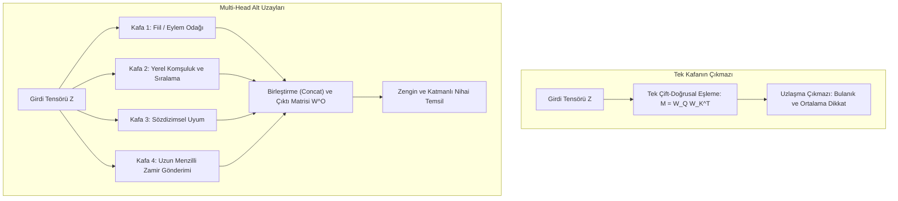
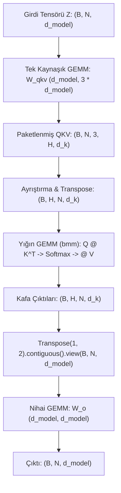
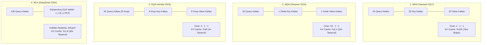

Bir dil modeline bir prompt verdiğinizde, serimizin önceki bölümlerinde izlediğimiz temel aşamalar metni çoktan geometriye dönüştürmüştür:
1. [Tokenizasyon](post.html?slug=tokenizasyon-nasil-calisir) masasında metin ayrık tamsayılara (`[1054, 492, 281]`) bölünür.
2. [Embedding Katmanı](post.html?slug=embedding-katmani-derinlemesine), bu tamsayıları sözlük tablosundan okuyarak sürekli vektörlere çevirir ve döner konumsal kodlama (RoPE) ile dizilim geometrisini hazırlar.
3. [Semantik Vektör Uzayı](post.html?slug=embeddingler-derinlemesine), kelimelerin geometrik yakınlık ve yönelimlerle anlam kazandığı koordinat sistemini kurar.
4. [Self-Attention Mekanizması](post.html?slug=self-attention-derinlemesine), token'ların Query, Key ve Value izdüşümleriyle birbirine bakmasını ve cümlenin anlık bağlamıyla zenginleşmiş dinamik temsil vektörleri üretmesini sağlar.
5. [Causal Attention](post.html?slug=causal-attention-derinlemesine), zamanın okunu dayatarak gelecekteki token'ları alt üçgensel maskeyle karartır ve her token'ın yalnızca geçmişe ve kendine bakmasını güvenceye alarak KV cache'in temelini kurar.

Serimizin 4. ve 5. bölümlerinde incelediğimiz somut üç kelimelik cümleyi hatırlayalım: **`["köpek", "kediyi", "kovaladı"]`** (özne, nesne ve eylem). Orada tek bir projeksiyon seti ($W_Q, W_K, W_V$) kullanarak her kelimenin Query fenerini Key rozetlerine tutmuş, fiil-merkezli bir dikkat matrisi elde etmiş ve 5. bölümde bu etkileşimi zamanın okuyla maskelemiştik.

Ancak bu noktada tek-başlıklı (single-head) dikkat mekanizmasının aşamayacağı çok temel bir kısıtla karşılaşırız: doğal dilde hiçbir zaman tek bir ilişki türü yaşanmaz. Aynı cümlenin içinde, aynı anda birbiriyle çakışan ve bağımsız çalışan birden çok dilbilgisel eksen mevcuttur:
- Özne–fiil bağımlılığı ("köpek" $\to$ "kovaladı")
- Nesne–fiil bağımlılığı ("kediyi" $\to$ "kovaladı")
- Yerel sözcük sırası ve komşuluk bağı ("köpek" kelimesinin hemen ardından "kediyi" gelmesi)
- Sözdizimsel bağlar, niteleme ilişkileri ve zamir gönderimleri

Tek-başlıklı dikkat mekanizmasında tüm $d_{\text{model}}$ boyutu, tek bir çift-doğrusal benzerlik matrisi ($M = W_Q W_K^T$) öğrenmek için kullanılır. Tek bir matris uzayda yalnızca tek bir geometrik yönelim yakalayabileceğinden, dildeki tüm bu farklı ilişkileri aynı anda temsil etmek zorunda kaldığında **"ortalama bir uzlaşma çıkmazına"** saplanır: ya fiile odaklanıp yerel sözcük sırasına körleşir ya da yanındaki komşuya odaklanıp cümlenin yüklemini kaçırır.

Bu yazı, serimizin 6. adımı olarak **Multi-Head Attention (Çok Başlıklı Dikkat)** mimarisinin bu uzlaşma çıkmazını nasıl kırdığını açıyor. Gizli boyutu bağımsız alt uzaylara ($d_k = d_{\text{model}} / H$) bölmenin getirdiği sıfır ekstra parametre avantajını, Bölüm 4'teki somut tensörlerimiz üzerinde iki kafanın tamamen zıt iki perspektife (fiil-merkezli ve komşuluk-merkezli) yerleştiği adım adım sayısal hesap yürüyüşünü, rastgele ağırlık başlangıcından doğan simetri kırılması ve pozitif geri besleme dinamiklerini, literatürdeki çığır açıcı kafa budama araştırmalarını (Michel, Voita, Anthropic'in indüksiyon kafaları), GPU'ların bu işlemi tek bir kaynaşık GEMM ve sıfır bellek kopyalamalı reshape hilesiyle nasıl koşturduğunu ve çıkarımda bellek bant genişliğini kilitleyen devasa KV cache faturasının modern mimarileri neden MQA ve GQA'ya zorladığını berrak ve bütüncül bir dille ortaya koyuyor.

**Bu yazıda**

- [1. Tek projektörden çoklu merceklere: Multi-Head sezgisi ve tek kafanın çıkmazı](#1-tek-projektörden-çoklu-merceklere-multi-head-sezgisi-ve-tek-kafanın-çıkmazı)
- [2. Multi-Head Attention matematiği: Alt uzaylar, Concat ve WO izdüşümü](#2-multi-head-attention-matematiği-alt-uzaylar-concat-ve-wo-izdüşümü)
- [3. Adım adım sayısal hesap: İki kafa, iki bağımsız bakış açısı](#3-adım-adım-sayısal-hesap-iki-kafa-iki-bağımsız-bakış-açısı)
- [4. Donanım gerçeği: GPU üzerinde Multi-Head hesaplama ve tensör hileleri](#4-donanım-gerçeği-gpu-üzerinde-multi-head-hesaplama-ve-tensör-hileleri)
- [5. Eğitim dinamiği: Rastgele başlangıçtan simetri kırılmasına](#5-eğitim-dinamiği-rastgele-başlangıçtan-simetri-kırılmasına)
- [6. Uzmanlaşma garanti midir? Kafa budama ve indüksiyon kafaları](#6-uzmanlaşma-garanti-midir-kafa-budama-ve-indüksiyon-kafaları)
- [7. İki mühendislik gözü: Training vs Inference ve MHAnın evrimi](#7-iki-mühendislik-gözü-training-vs-inference-ve-mhanın-evrimi)
- [8. PyTorch ile adım adım tam doğrulama](#8-pytorch-ile-adım-adım-tam-doğrulama)
- [Bütün hikâye altı satırda](#bütün-hikâye-altı-satırda)
- [Terimler sözlüğü](#terimler-sözlüğü)
- [Daha derine inmek için](#daha-derine-inmek-için)

---

## 1. Tek projektörden çoklu merceklere: Multi-Head sezgisi ve tek kafanın çıkmazı

### Günlük hayattan bir benzetmeyle iki temel dikkat türü

Transformer mimarisinin kalbini oluşturan bu iki yapıyı, teknik detaylardan uzak, günlük hayattan bir benzetmeyle en baştan ele alalım.

Bir kitaptan şu tek cümleyi incelediğimizi düşünelim:  
**`"Ahmet, dün çok yağmur yağdığı için şemsiyesini yanına aldı."`**

Bu cümleyi işlerken yapay zekanın önünde iki temel çalışma modu bulunur:

#### 1. Normal Multi-Head Attention (Çift Yönlü Dikkat)
Bu mekanizma, bir metnin tamamını aynı anda masaya yatırıp okumak ve anlamlandırmak istediğimizde kullanılır. Transformer mimarisinin **Encoder (Kodlayıcı)** kısmında yer alır (en bilinen örneği: **BERT** ve **RoBERTa** modelleri). Ayrıca özgün Transformer ve **T5** gibi mimarilerde Decoder'ın ikinci dikkat katmanında (**Encoder-Decoder / Cross-Attention / Çapraz Dikkat**) da çift yönlü olarak işletilir.

* **Nasıl Çalışır?** Cümledeki her bir kelime, kendisinden önce gelen kelimelere de, sonra gelen kelimelere de aynı anda bakar (çift yönlü / bidirectional).
* **Benzetme:** Kitaptaki cümlenin tamamı önünüzde açıktır. *"Şemsiyesini"* kelimesine geldiğinizde, geriye dönüp *"Ahmet"* ve *"yağmur"* kelimelerine bakarsınız; ileriye bakıp *"aldı"* kelimesini de görürsünüz. Kelimeler arasındaki tüm bağlantıları tek seferde çözersiniz.
* **Amacı:** Metnin bütünsel anlamını ve bağlamını kusursuz şekilde kavramaktır (temsil ve analiz görevi).

#### 2. Multi-Head Causal Self-Attention (Nedensel / Maskelenmiş Dikkat)
Bu mekanizma ise sıfırdan yeni bir metin üretirken (kelime kelime yazı yazarken) kullanılır. Transformer mimarisinin **Decoder (Çözücü)** kısmının giriş katmanında yer alır (modern büyük dil modellerinin neredeyse tamamı: **GPT-4**, **LLaMA 3**, **Mistral**, **Gemma**).

* **Nasıl Çalışır?** Model bir sonraki kelimeyi tahmin etmeye çalışırken, henüz yazmadığı (gelecekteki) kelimeleri göremez. Bu yüzden gelecekteki kelimelerin üzeri matematiksel bir maskeyle kapatılır. Kelimeler sadece solundaki (geçmişteki) kelimelere ve kendine bakabilir.
* **Benzetme:** Telefonunuzda mesaj yazarken çıkan kelime tahminleri (otomatik tamamlama) gibidir. Siz sırayla *"Ahmet"*, *"dün"*, *"çok"* yazarsınız. Model bir sonraki kelimeyi tahmin ederken sağ tarafta ne yazacağını (geleceği) göremez. Sadece o ana kadar yazılmış olan sol tarafa bakarak bir sonraki kelime olarak *"yağmur"* kelimesini tahmin eder.
* **Amacı:** Modelin metin üretirken "geleceğe bakıp hile yapmasını" engellemek ve sırayla mantıklı, tutarlı cümleler kurmasını sağlamaktır.

#### 3. Multi-Head Cross-Attention (Çapraz Dikkat)
Orijinal Transformer (Vaswani 2017) ve T5 gibi iki gövdeli mimarilerde Decoder bloğunun ikinci katmanında yer alır. Burada Query vektörleri Decoder'daki hedef kelimelerden üretilirken, Key ve Value vektörleri Encoder'ın ürettiği kaynak metin temsillerinden beslenir. Model hedef dilde (örneğin Türkçe) kelime kelime çıktı üretirken, kaynak cümlenin (örneğin İngilizce metnin) tamamına maskesiz ve çift yönlü olarak dikkat eder.

Aşağıdaki tablo, bu mekanizmalar arasındaki mimari sınırları özetlemektedir:

| Özellik | Normal Multi-Head Attention (Çift Yönlü) | Maskelenmiş (Causal) Multi-Head Attention | Multi-Head Cross-Attention (Çapraz Dikkat) |
| :--- | :--- | :--- | :--- |
| **Görüş Yönü** | Çift Yönlü (Geçmiş ve Gelecek) | Tek Yönlü (Sadece Geçmiş ve Şimdiki An) | Çift Yönlü (Tüm Kaynak Dizi) |
| **Maskeleme** | Yoktur (Yalnızca padding maskesi) | Vardır ($j > i$ için $-\infty$ nedensel maske) | Yoktur (Encoder çıktısının tamamı açıktır) |
| **Mimari Konum** | Encoder bloğu (Tüm katmanlar) | Decoder bloğu (Giriş / İlk katman) | Decoder bloğu (İkinci / Üst katman) |
| **Q, K, V Kaynağı** | $Q, K, V$ aynı diziden (Self-Attention) | $Q, K, V$ aynı diziden (Causal Self-Attention) | $Q$ Decoder'dan; $K, V$ Encoder'dan |
| **Temel Görev** | Metni eksiksiz anlamak (Analiz & Temsil) | Sırayla ve tutarlı metin üretmek (Yazma) | Üretilen metni kaynak metinle hizalamak (Çeviri/Özet) |
| **Örnek Modeller** | BERT, RoBERTa, DeBERTa, ViT | GPT-4, Llama 3, Mistral, Gemma | Orijinal Transformer (Vaswani 2017), T5, BART |

### Tek projektörden çoklu merceklere: Tiyatro analojisi ve tek kafanın çıkmazı

Peki bu iki mekanizmanın içinde neden tek bir dikkat kafasıyla yetinemeyiz de **"Multi-Head (Çok Başlıklı)"** bir mimariye ihtiyaç duyarız? Bunu kavramak için bir tiyatro sahnesi veya fotoğraf stüdyosu hayal edelim.

Tavanda asılı tek bir devasa beyaz projektör olduğunu düşünün. Bu projektörü sahneye doğru açtığınızda tüm alanı tekdüze, ortalama bir beyaz ışıkla aydınlatır. Işığı başroldeki oyuncuya doğrultabilirsiniz; ancak bunu yaptığınızda arka plandaki ayrıntılar sert gölgelerin ardında kaybolur. Işığın açısını genişletip hem oyuncuyu hem de arkadaki dekoru aydınlatmaya çalıştığınızda ise ışık yoğunluğu her yerde düşer; ne oyuncunun yüz ifadeleri belirginleşir ne de arka plandaki dokular net seçilebilir. Tek bir ışık kaynağıyla aynı anda hem oyuncunun yüzüne yüksek kontrastlı bir portre ışığı, hem dekorlara yumuşak bir dolgu ışığı, hem de oyuncuların silüetini arka plandan ayıran keskin bir kontur ışığı veremezsiniz.

Profesyonel bir tiyatro sahnesi bu sorunu tek bir dev ampulü imkânsız biçimlerde bükerek çözmez. Bunun yerine tavana **birbirinden bağımsız çok sayıda spot lamba** yerleştirir; her lambanın kendi odak açısı, kendi konumu ve kendi renk filtresi vardır:
- **Spot 1:** Doğrudan başrol oyuncusunun mimiklerine kilitlenen dar, sıcak tonlu bir huzme.
- **Spot 2:** Sahnenin geneline yayılan ve atmosferi kuran soğuk tonlu yumuşak dolgu ışığı.
- **Spot 3:** Karakterlerin hatlarını arkadaki dekordan ayıran keskin ters ışık (kontur ışığı).


```mermaid
flowchart TD
    subgraph TekKafaDarboğazi["Tek Kafanın Çıkmazı"]
        Z1["Girdi Tensörü Z"] --> M1["Tek Çift-Doğrusal Eşleme: M = W_Q W_K^T"]
        M1 --> Uzlasma["Uzlaşma Çıkmazı: Bulanık ve Ortalama Dikkat"]
    end

    subgraph CokluBaslikUzaylari["Multi-Head Alt Uzayları"]
        Z2["Girdi Tensörü Z"] --> H1["Kafa 1: Fiil / Eylem Odağı"]
        Z2 --> H2["Kafa 2: Yerel Komşuluk ve Sıralama"]
        Z2 --> H3["Kafa 3: Sözdizimsel Uyum"]
        Z2 --> H4["Kafa 4: Uzun Menzilli Zamir Gönderimi"]
        H1 & H2 & H3 & H4 --> Birlestir["Birleştirme (Concat) ve Çıktı Matrisi W^O"]
        Birlestir --> Cikti["Zengin ve Katmanlı Nihai Temsil"]
    end
```

İnsan dilindeki her cümle de böylesine katmanlı bir sahnedir. Aynı anda gerçekleşen ilişki ağlarını düşünün:
- **Özne–fiil ilişkisi:** Eylemi kimin gerçekleştirdiğini tespit etme ("köpek" $\to$ "kovaladı").
- **Nesne–fiil ilişkisi:** Eylemin kime/neye yöneldiğini tespit etme ("kediyi" $\to$ "kovaladı").
- **Yerel konum ve komşuluk:** Kelimelerin hemen bitişiğindeki sözcükle kurduğu öbek bağları.
- **Sözdizimsel bağlar:** Dilbilgisel cinsiyet, sayı veya durum eki uyumu.
- **Anlamsal niteleme:** Sıfatların ait olduğu isimlere bağlanması ("kara" $\to$ "kedi").
- **Uzun menzilli zamir bağı:** Cümlenin başındaki bir isme üç cümle sonraki "o" zamirinin bağlanması.

Bölüm 4'te ispatladığımız üzere, Query ve Key arasındaki iç çarpım temelde şu çift-doğrusal (bilinear) harita tarafından yönetilir:

$$M = W_Q W_K^T \in \mathbb{R}^{d_{\text{model}} \times d_{\text{model}}}$$

Bu $M$ matrisi, iki token arasındaki etkileşimin geometrik kuralını koyar. Ancak tek bir $M$ matrisinin uzayda yalnızca tek bir baskın yönelimi olabilir. Eğer optimizasyon süreci $W_Q$ ve $W_K$'yi fiil ilişkisini yakalayacak biçimde eğitirse, $q_i^T k_j$ çarpımı $j$ token'ı bir fiil olduğunda tepe noktasına ulaşır. Fakat bunu yaptığı anda, aynı token'ın hemen solundaki komşusuyla olan yerel bağını ölçecek geometrik serbestliği kaybeder. Cümledeki tüm ilişkileri tek bir $M$ matrisine sıkıştırmak, onu **"herkese az çok uyan ama hiçbirine tam oturmayan"** silik bir uzlaşmaya zorlar.

Multi-Head Attention, bu kısıtı modele $H$ adet bağımsız çift-doğrusal harita vererek çözer:

$$M^{(h)} = W_Q^{(h)} \left(W_K^{(h)}\right)^T, \quad h \in \{1, 2, \dots, H\}$$

Tıpkı bir evrişimli sinir ağında (CNN) tek bir filtrenin tüm resmi okumaya çalışmaması; 1. filtrenin yatay kenarlara, 2. filtrenin dairesel köşelere, 3. filtrenin ise doku desenlerine duyarlı hâle gelmesi gibi, her dikkat kafası da kendi alt uzayında dilin bambaşka bir eksenine uzmanlaşır.

> [!NOTE]
> **Tek Merceğin Bütçe Paradoksu (%131 İkilemi):** Bir cümledeki *"kovaladı"* kelimesinin bağlamını tam olarak yakalayabilmek için yapay zekanın iki farklı şeye odaklanması gerekir: eylemin ne olduğuna (kendi kelimesine: %56,1 oranında) ve eylemin kime yapıldığına (hemen önceki nesneye, yani *"kediyi"* kelimesine: %75,0 oranında). Ancak Softmax kuralı gereği tek bir dikkat başının toplam bütçesi her zaman tam olarak %100'dür. İki hedefin ihtiyaç duyduğu odaklanma toplandığında %131,1 ettiği için (%56,1 + %75,0), tek bir %100'lük bütçe ile bu iki güçlü ilişki aynı anda temsil edilemez; puanlar ortak paydayı şişirerek birbirini seyreltir. Multi-Head Attention, her bir anlamsal ilişkiye kendi bağımsız %100 bütçesini tahsis eden mimaridir.

---

## 2. Multi-Head Attention matematiği: Alt uzaylar, Concat ve WO izdüşümü

Multi-Head Attention'ın matematiksel yapısı, toplam tensör boyutunu şişirmeden hesaplama uzayını $H$ paralel alt uzaya bölmesi bakımından son derece zariftir.

$N$ token'dan oluşan ve her token'ın $d_{\text{model}}$ boyutlu bir vektörle temsil edildiği girdi matrisimizi $Z \in \mathbb{R}^{N \times d_{\text{model}}}$ olarak tanımlayalım. $Z$'yi doğrudan tek bir $d_{\text{model}}$ uzayına yansıtmak yerine, her kafa için bağımsız projeksiyon ağırlıkları tanımlanır.

Her $h \in \{1, 2, \dots, H\}$ kafası için:

$$Q_h = Z W_Q^{(h)}, \quad K_h = Z W_K^{(h)}, \quad V_h = Z W_V^{(h)}$$

Buradaki ağırlık matrislerinin boyutları:

$$W_Q^{(h)} \in \mathbb{R}^{d_{\text{model}} \times d_k}, \quad W_K^{(h)} \in \mathbb{R}^{d_{\text{model}} \times d_k}, \quad W_V^{(h)} \in \mathbb{R}^{d_{\text{model}} \times d_v}$$

Standart Transformer mimarilerinde her kafanın boyutu model boyutunun kafa sayısına eşit bölünmesiyle elde edilir:

$$d_k = d_v = \frac{d_{\text{model}}}{H}$$

Her kafa, kendi alt uzayında bağımsız scaled dot-product attention işlemini çalıştırır:

$$\text{head}_h = \text{softmax}\left(\frac{Q_h K_h^T}{\sqrt{d_k}}\right) V_h \in \mathbb{R}^{N \times d_v}$$

Elde edilen $H$ adet kafa çıktısı, özellik ekseni boyunca yan yana eklenir (concatenate edilir):

$$\text{Concat}(\text{head}_1, \text{head}_2, \dots, \text{head}_H) \in \mathbb{R}^{N \times (H \cdot d_v)} = \mathbb{R}^{N \times d_{\text{model}}}$$

Son olarak, bu birleştirilmiş blok $W^O$ çıktı matrisi ile çarpılarak model boyutuna geri indirgenir:

$$\text{MultiHead}(Z) = \text{Concat}(\text{head}_1, \text{head}_2, \dots, \text{head}_H) W^O$$

Burada:

$$W^O \in \mathbb{R}^{d_{\text{model}} \times d_{\text{model}}}$$

### Matematiksel maskeleme matrisi: -∞ ve Softmax anatomisi

Causal Attention'ın arkasındaki matematiksel maskeleme operasyonu, yapay zekanın "geleceği görerek hile yapmasını" kesin olarak engelleyen zarif bir sıfırlama mekanizmasıdır.

Her bir kafa $h$, kendi alt uzayında ham ölçeklenmiş iç çarpım skorlarını ($S$) hesaplar:

$$S_{ij} = \frac{q_i k_j^T}{\sqrt{d_k}}$$

Ardından bu matrisin üzerine katı bir nedensel maskeleme matrisi ($M$) eklenir:

$$S^{\text{masked}}_{ij} = S_{ij} + M_{ij}, \quad \text{burada } M_{ij} = \begin{cases} 0, & j \le i \text{ (geçmiş ve şimdiki an)} \\ -\infty, & j > i \text{ (gelecek zaman)} \end{cases}$$

Bu toplama işleminin ardından Softmax fonksiyonu devreye girdiğinde üstel dönüşüm gerçekleşir:

$$A_{ij} = \text{softmax}(S^{\text{masked}})_{ij} = \frac{\exp(S_{ij} + M_{ij})}{\sum_{k=1}^N \exp(S_{ik} + M_{ik})}$$

Buradaki can alıcı nokta, $-\infty$ değerinin üstel fonksiyon altındaki limit davranışıdır:

$$\lim_{x \to -\infty} \exp(x) = 0$$

Gelecekteki herhangi bir token için ($j > i$):
1. **Pay sıfır olur:** $\exp(S_{ij} - \infty) = 0$.
2. **Paydada elenir:** Paydadaki toplamda da geleceğe ait tüm terimler sıfır katkı sağlar; böylece payda yalnızca geçmiş ve şimdiki token'ların ($k=1 \dots i$) üstel toplamından ibaret kalır:

$$A_{ij} = \begin{cases} \frac{\exp(S_{ij})}{\sum_{k=1}^i \exp(S_{ik})}, & j \le i \\ 0, & j > i \end{cases}$$

Sonuç olarak her bir dikkat kafasının çıktısı strictly geçmiş Value vektörlerinin harmanı hâline gelir:

$$\text{head}_h = A^{(h)} V_h = \text{softmax}\left(\frac{Q_h K_h^T}{\sqrt{d_k}} + M\right) V_h \in \mathbb{R}^{N \times d_v}$$

Donanım seviyesindeki hesaplama sırası şu şekilde akar:


```mermaid
flowchart LR
    Z["Girdi Z"] --> Proj["Q, K, V İzdüşümleri"]
    Proj --> Split["H Kafaya Ayrıştırma (Q_h, K_h, V_h)"]
    Split --> Dot["1. Skorlar: S_h = Q_h K_h^T / sqrt(d_k)"]
    Dot --> Mask["2. MASKELEME: S_h + M (Geleceğe -inf)"]
    Mask --> Smax["3. SOFTMAX: A_h = softmax(S_h + M)"]
    Smax --> WSum["4. Bağlam: head_h = A_h V_h"]
    WSum --> Concat["5. Birleştirme: Concat(head_1, ..., head_H)"]
    Concat --> Out["6. Çıktı: Concat * W^O -> O"]
```

> [!IMPORTANT]
> **Gradyan Kalkanı:** Softmax çıktısı $A_{ij} \equiv 0$ olduğunda, geriye yayılım (backpropagation) zincir kuralı uyarınca gelecekteki token'lardan geçmişe akan gradyan da tam olarak sıfırdır ($\frac{\partial \mathcal{L}}{\partial S_{ij}} = 0$). Bu matematiksel kalkan olmasaydı model eğitim sırasında gelecek kelimeyi doğrudan kopyalayarak **kestirme yol çöküşüne (shortcut collapse)** uğrar ve çıkarım anında sonsuz döngüye girerdi.

### Modern LLM'ler neden sadece Causal MHA mimarisini seçti?

Transformer ilk yayımlandığında (Vaswani 2017) çift gövdeli bir Encoder-Decoder mimarisiydi. 2018'de Google BERT ile yalnızca Encoder (Normal MHA) yolunu seçti; OpenAI ise GPT-1 ile yalnızca Decoder (Causal MHA) yoluna girdi. Günümüzde üretim dünyasını domine eden modern büyük dil modellerinin (GPT-4, Llama 3, Mistral, Gemma) istisnasız **yalnızca Decoder (Causal MHA)** yapısında birleşmesinin üç temel donanımsal ve algoritmik sebebi vardır:

1. **Evrensel Ön Eğitim Hedefi (Next-Token Prediction):**
   BERT'in kullandığı Masked Language Modeling (kelimelerin %15'ini rastgele gizleyip tahmin etme), sınıflandırma veya anlamsal arama için mükemmeldir; ancak serbest metin üretimi yapamaz. Sıradaki token'ı tahmin etme (Causal MHA) hedefi ise internetteki trilyonlarca token'lık ham metne hiçbir insan etiketi gerekmeden uygulanabilir. Model bir sonraki kelimeyi tahmin edebilmek için dilbilgisini, mantıksal akıl yürütmeyi, dünya bilgisini ve kodlama kurallarını kendiliğinden öğrenmek zorunda kalır.

2. **Çıkarım Hızı ve KV Cache Tasarrufu ($O(1)$ Değişmezlik):**
   Normal (çift yönlü) bir dikkat modelinde metnin sonuna tek bir yeni kelime eklendiğinde, cümlenin en başındaki kelime de bu yeni kelimeye bakmak zorundadır. Bu durum, her yeni kelimede **tüm cümlenin baştan hesaplanmasını** gerektirir ($O(N^2)$ gecikme patlaması).  
   Causal Attention'da ise zamanın oku geriye doğru bükülemez: $t$. token asla $t+1$. token'dan etkilenemez. Bu sayede geçmişteki tüm token'ların Key ve Value tensörleri donar ve değişmez kalır. Model her yeni kelime üretiminde geçmişi yeniden hesaplamaz; doğrudan bellekten (KV Cache) okur ve tek adımda ($O(1)$ projeksiyon, $O(N)$ bellek bant genişliği) yeni kelimeyi üretir.

3. **Eğitimde Donanımsal Paralellik (Teacher Forcing):**
   Autoregressive üretim çıkarım anında sıralı olmak zorundadır. Ancak eğitim anında, nedensel maskeleme sayesinde $N$ uzunluğundaki bir cümlenin tüm adımları tek bir matris çarpımıyla (GEMM) GPU'da aynı anda paralel olarak koşturulur. Model geleceği görmeden tüm cümle üzerindeki kaybı (loss) tek bir ileri geçişte (forward pass) hesaplar.

### Sembol sembol okuma:

- $Z \in \mathbb{R}^{N \times d_{\text{model}}}$: Modele giren $N$ token'lık gömme matrisi.
- $H$: Paralel çalışan bağımsız dikkat kafası sayısı (örneğin orijinal Transformer Base'de 8, LLaMA-3 8B'de 32).
- $d_k, d_v$: Her bir dikkat kafasının alt uzay boyutu ($d_{\text{model}} / H$).
- $W_Q^{(h)}, W_K^{(h)}, W_V^{(h)}$: $d_{\text{model}}$ boyutundaki girdiyi $h$. kafanın dar alt uzayına indiren öğrenilebilir projeksiyon matrisleri.
- $Q_h K_h^T / \sqrt{d_k}$: $h$. kafanın kendi alt uzayındaki benzerlik matrisi.
- $\text{head}_h$: $h$. kafanın ürettiği, Value vektörlerinin ağırlıklı harmanı olan $d_v$ boyutlu bağlam temsili.
- $\text{Concat}(\dots)$: Tüm alt uzay çıktılarının yan yana dizilerek yeniden $d_{\text{model}}$ genişliğine ulaştığı birleştirme adımı.
- $W^O$: Yan yana dizilen farklı bakış açılarını harmanlayıp residual akışa aktaran nihai doğrusal dönüşüm matrisi.

### Parametre ve FLOP nötrlüğü paradoksu

İlk bakışta $H$ tane paralel kafa çalıştırmanın parametre sayısını ve hesaplama karmaşıklığını $H$ kat artıracağı düşünülebilir. Oysa Multi-Head Attention, tek-başlıklı dikkat mekanizmasına kıyasla **neredeyse sıfır ekstra parametre ve sıfır ekstra projeksiyon FLOP'u** harcar.

Parametre matematiğini yan yana inceleyelim:

| Bileşen | Tek Başlıklı Dikkat ($d_k = d_{\text{model}}$) | Multi-Head Attention ($H$ kafa, $d_k = d_{\text{model}}/H$) |
| :--- | :--- | :--- |
| **Query Projeksiyonları** | $W_Q \in \mathbb{R}^{d_{\text{model}} \times d_{\text{model}}} \implies d_{\text{model}}^2$ | $H \times \left(d_{\text{model}} \times \frac{d_{\text{model}}}{H}\right) = d_{\text{model}}^2$ |
| **Key Projeksiyonları** | $W_K \in \mathbb{R}^{d_{\text{model}} \times d_{\text{model}}} \implies d_{\text{model}}^2$ | $H \times \left(d_{\text{model}} \times \frac{d_{\text{model}}}{H}\right) = d_{\text{model}}^2$ |
| **Value Projeksiyonları** | $W_V \in \mathbb{R}^{d_{\text{model}} \times d_{\text{model}}} \implies d_{\text{model}}^2$ | $H \times \left(d_{\text{model}} \times \frac{d_{\text{model}}}{H}\right) = d_{\text{model}}^2$ |
| **Çıktı Projeksiyonu $W^O$** | $W^O \in \mathbb{R}^{d_{\text{model}} \times d_{\text{model}}} \implies d_{\text{model}}^2$ | $W^O \in \mathbb{R}^{d_{\text{model}} \times d_{\text{model}}} \implies d_{\text{model}}^2$ |
| **Toplam Projeksiyon Parametresi** | $\mathbf{4 d_{\text{model}}^2}$ | $\mathbf{4 d_{\text{model}}^2}$ |

Toplam projeksiyon parametre sayısı iki tarafta da kuruşu kuruşuna $4 d_{\text{model}}^2$'dir.

Hesaplama işleminde de durum farksızdır: Tek-başlıklı dikkatte $Q K^T$ çarpımı $N \times d_{\text{model}} \times N = N^2 d_{\text{model}}$ çarpma-toplama işlemi gerektirir. Multi-head yapıda ise her kafa $d_k = d_{\text{model}} / H$ boyutunda $N^2 (d_{\text{model}} / H)$ işlem yapar. $H$ kafa boyunca topladığınızda:

$$H \times \left(N^2 \frac{d_{\text{model}}}{H}\right) = N^2 d_{\text{model}}$$

Hesap yükü birebir aynı kalır. Multi-Head Attention hesaplama bütçesini artırmaz; mevcut bütçeyi tek bir hantal uzaydan $H$ adet kıvrak alt uzaya paylaştırır.

---

## 3. Adım adım sayısal hesap: İki kafa, iki bağımsız bakış açısı

Bölüm 5'te ([Causal Attention](post.html?slug=causal-attention-derinlemesine)) öğrendiğimiz en kritik mühendislik ilkesini hatırlayalım: **Özbağlanımlı üretim yapan bir decoder modelinde geleceğe bakmak kesinlikle yasaktır.** Eğer model gelecekteki token'ları görürse, projeksiyon matrisleri kestirme çöküşüne (shortcut collapse) uğrar ve çıkarım anında sonsuz döngüye kilitlenir.

Bu yüzden üretimdeki gerçek bir LLM'de Multi-Head Attention, çift yönlü ham matrislerle değil; **her kafanın alt üçgensel nedensel maskeyi ($M$) bağımsız uyguladığı Multi-Head Causal Attention** olarak çalışır. Şimdi, serimizin 4. ve 5. bölümlerindeki aynı tensörleri alarak iki nedensel kafanın ($H=2$) hesap adımlarını adım adım elle yürütelim.

Bölüm 4 ve 5'teki temel değişkenlerimizi koruyoruz:
- Token sayısı: $N = 3$ (`["köpek", "kediyi", "kovaladı"]`, yani özne, nesne ve fiil).
- Toplam model boyutu: $d_{\text{model}} = 4$.
- Kafa sayısı: $H = 2$.
- Alt uzay boyutu: $d_k = d_v = d_{\text{model}} / H = 4 / 2 = 2$.

Girdi matrisimiz $Z \in \mathbb{R}^{3 \times 4}$, önceki bölümlerle birebir aynıdır:

$$Z = \begin{bmatrix} 0,21 & 0,82 & 0,13 & 0,44 \\ 0,95 & 0,16 & 0,37 & 0,28 \\ 0,19 & 0,40 & 1,01 & 0,82 \end{bmatrix} \quad \begin{matrix} \text{token 1 (köpek — özne)} \\ \text{token 2 (kediyi — nesne)} \\ \text{token 3 (kovaladı — fiil)} \end{matrix}$$

### Kafa 1: Fiil-merkezli nedensel kafa

Bölüm 5'te scaled dot-product skorlarına ($S$) alt üçgensel nedensel maske ($M$) uygulayarak elde ettiğimiz ve Softmax'tan geçirdiğimiz nedensel dikkat matrisini ($A^{(1)}$) hatırlayalım:

$$A^{(1)} = \begin{bmatrix} 1,000 & 0,000 & 0,000 \\ 0,459 & 0,541 & 0,000 \\ 0,193 & 0,246 & 0,561 \end{bmatrix}$$

Bu matrisin geometrisini okuyalım:
- **Satır 1 ("köpek"):** Henüz cümlede başka kelime olmadığı için bütçesinin $\%100$'ünü kendine ayırır; gelecekteki "kediyi" ve "kovaladı" $-\infty$ ile karartılmıştır ($0,000$).
- **Satır 2 ("kediyi"):** Geçmişteki "köpek" (\%45,9) ile kendisi (\%54,1) arasında dengelenir; henüz gelmemiş olan fiile sızıntı kesinlikle sıfırdır ($0,000$).
- **Satır 3 ("kovaladı"):** Artık tüm geçmişi görür ve en yüksek dikkat ağırlığını (\%56,1) eylemin kendisine verir. Kafa 1, cümlenin ana yüklemine odaklanan **fiil-merkezli bir nedensel kafa** olarak uzmanlaşmıştır.

Kafa 1'in Value ağırlık matrisi $W_V^{(1)} \in \mathbb{R}^{4 \times 2}$ olarak Bölüm 4'teki $W_V$'nin ilk iki sütununu alalım:

$$W_V^{(1)} = \begin{bmatrix} 1,0 & 0,0 \\ 0,0 & 1,0 \\ 1,0 & 1,0 \\ 0,0 & 0,0 \end{bmatrix}$$

$V_1 = Z W_V^{(1)} \in \mathbb{R}^{3 \times 2}$ matrisini çarpalım:
- Token 1: $[0,21(1) + 0,13(1), \; 0,82(1) + 0,13(1)] = [0,34, 0,95]$
- Token 2: $[0,95(1) + 0,37(1), \; 0,16(1) + 0,37(1)] = [1,32, 0,53]$
- Token 3: $[0,19(1) + 1,01(1), \; 0,40(1) + 1,01(1)] = [1,20, 1,41]$

```text
V_1 Matrisi:
  token 1 (köpek):    [0.340, 0.950]
  token 2 (kediyi):   [1.320, 0.530]
  token 3 (kovaladı): [1.200, 1.410]
```

Şimdi bu alt uzaydaki nedensel bağlam çıktısını ($\text{head}_1 = A^{(1)} V_1$) hesaplayalım:
- Satır 1: $1,000 [0,34, 0,95] = [0,340, 0,950]$
- Satır 2: $0,459 [0,34, 0,95] + 0,541 [1,32, 0,53] = [0,870, 0,723]$
- Satır 3: $0,193 [0,34, 0,95] + 0,246 [1,32, 0,53] + 0,561 [1,20, 1,41] = [1,064, 1,105]$

$$\text{head}_1 = \begin{bmatrix} 0,340 & 0,950 \\ 0,870 & 0,723 \\ 1,064 & 1,105 \end{bmatrix}$$

> [!NOTE]
> Bu sayılara dikkatle bakın: Elde ettiğimiz $\text{head}_1$ matrisi, Bölüm 5'te tek-kafa Causal Attention ile hesapladığımız 4 boyutlu çıktı matrisinin ($O$) ilk iki sütununa **kuruşu kuruşuna eşittir!**

### Kafa 2: Yerel komşuluk ve konum kafası

Şimdi tamamen bağımsız başlatılmış ikinci bir ağırlık kümesi $(W_Q^{(2)}, W_K^{(2)}, W_V^{(2)})$ düşünelim. Eğitim süreci boyunca bu ikinci kafa bambaşka bir göreve uzmanlaşmış olsun: **yerel komşuluk (önceki kelimeye / $i-1$ pozisyonuna odaklanma).**

Bu kafa da nedensel kurala uymak zorundadır; dolayısıyla üst üçgeni kesinlikle $0,000$'dır:

$$A^{(2)} = \begin{bmatrix} 1,000 & 0,000 & 0,000 \\ 0,800 & 0,200 & 0,000 \\ 0,050 & 0,750 & 0,200 \end{bmatrix}$$

Bu matrisi birlikte okuyalım:
- **"köpek":** Öncesi olmadığı için mecburen kendine bakar (\%100). Gelecek görünmezdir ($0,000$).
- **"kediyi":** Kendisinden hemen önceki özneye ("köpek") ezici bir oranla (\%80,0) odaklanır!
- **"kovaladı":** Kafa 1 gibi eyleme değil; kendisinden hemen önceki doğrudan nesneye ("kediyi") tam **$\%75,0$** oranında kilitlenir!

Kafa 1 cümlenin eylemine ve özneye bakarken, Kafa 2 doğrudan yerel sözcük sırasına ve hemen önceki tamamlayıcıya ($i-1$) odaklanmaktadır.

Kafa 2'nin Value ağırlık matrisi $W_V^{(2)} \in \mathbb{R}^{4 \times 2}$ olarak Bölüm 4'teki $W_V$'nin son iki sütununu alalım:

$$W_V^{(2)} = \begin{bmatrix} 0,0 & 1,0 \\ 1,0 & 0,0 \\ 0,0 & 0,0 \\ 1,0 & 1,0 \end{bmatrix}$$

$V_2 = Z W_V^{(2)} \in \mathbb{R}^{3 \times 2}$ matrisini çarpalım:
- Token 1: $[0,82(1) + 0,44(1), \; 0,21(1) + 0,44(1)] = [1,26, 0,65]$
- Token 2: $[0,16(1) + 0,28(1), \; 0,95(1) + 0,28(1)] = [0,44, 1,23]$
- Token 3: $[0,40(1) + 0,82(1), \; 0,19(1) + 0,82(1)] = [1,22, 1,01]$

```text
V_2 Matrisi:
  token 1 (köpek):    [1.260, 0.650]
  token 2 (kediyi):   [0.440, 1.230]
  token 3 (kovaladı): [1.220, 1.010]
```

Şimdi Kafa 2'nin nedensel bağlam çıktısını ($\text{head}_2 = A^{(2)} V_2$) hesaplayalım:
- Satır 1: $1,000 [1,26, 0,65] = [1,260, 0,650]$
- Satır 2: $0,800 [1,26, 0,65] + 0,200 [0,44, 1,23] = [1,008 + 0,088, \; 0,520 + 0,246] = [1,096, 0,766]$
- Satır 3: $0,050 [1,26, 0,65] + 0,750 [0,44, 1,23] + 0,200 [1,22, 1,01] = [0,063 + 0,330 + 0,244, \; 0,033 + 0,923 + 0,202] = [0,637, 1,157]$

$$\text{head}_2 = \begin{bmatrix} 1,260 & 0,650 \\ 1,096 & 0,766 \\ 0,637 & 1,157 \end{bmatrix}$$

### Birleştirme (Concat) ve WO ile harmanlama

Şimdi bu iki bağımsız nedensel bakış açısını sütun bazında yan yana ekliyoruz (Concat):

$$\text{Concat}(\text{head}_1, \text{head}_2) = \begin{bmatrix} 0,340 & 0,950 & 1,260 & 0,650 \\ 0,870 & 0,723 & 1,096 & 0,766 \\ 1,064 & 1,105 & 0,637 & 1,157 \end{bmatrix} \in \mathbb{R}^{3 \times 4}$$

Çıktı projeksiyon matrisimiz $W^O \in \mathbb{R}^{4 \times 4}$ şu şekilde tanımlansın:

$$W^O = \begin{bmatrix} 1,0 & 0,0 & 0,5 & 0,0 \\ 0,0 & 1,0 & 0,0 & 0,5 \\ 0,5 & 0,0 & 1,0 & 0,0 \\ 0,0 & 0,5 & 0,0 & 1,0 \end{bmatrix}$$

Birleştirilmiş matrisi $W^O$ ile çarparak nihai çıktı tensörünü ($O \in \mathbb{R}^{3 \times 4}$) elde ederiz:

$$O = \text{Concat}(\text{head}_1, \text{head}_2) W^O$$

- **Token 1 ("köpek"):**
  - Sütun 1: $0,340(1,0) + 1,260(0,5) = 0,340 + 0,630 = 0,970$
  - Sütun 2: $0,950(1,0) + 0,650(0,5) = 0,950 + 0,325 = 1,275$
  - Sütun 3: $0,340(0,5) + 1,260(1,0) = 0,170 + 1,260 = 1,430$
  - Sütun 4: $0,950(0,5) + 0,650(1,0) = 0,475 + 0,650 = 1,125$
- **Token 2 ("kediyi"):**
  - Sütun 1: $0,870(1,0) + 1,096(0,5) = 0,870 + 0,548 = 1,418$
  - Sütun 2: $0,723(1,0) + 0,766(0,5) = 0,723 + 0,383 = 1,106$
  - Sütun 3: $0,870(0,5) + 1,096(1,0) = 0,435 + 1,096 = 1,531$
  - Sütun 4: $0,723(0,5) + 0,766(1,0) = 0,3615 + 0,766 = 1,128$
- **Token 3 ("kovaladı"):**
  - Sütun 1: $1,064(1,0) + 0,637(0,5) = 1,064 + 0,3185 = 1,382$
  - Sütun 2: $1,105(1,0) + 1,157(0,5) = 1,105 + 0,5785 = 1,683$
  - Sütun 3: $1,064(0,5) + 0,637(1,0) = 0,532 + 0,637 = 1,169$
  - Sütun 4: $1,105(0,5) + 1,157(1,0) = 0,5525 + 1,157 = 1,709$

$$O = \begin{bmatrix} 0,970 & 1,275 & 1,430 & 1,125 \\ 1,418 & 1,106 & 1,531 & 1,128 \\ 1,382 & 1,683 & 1,169 & 1,709 \end{bmatrix}$$

### Sayılarla neler oldu? (%131 bütçe paradoksu)

"kovaladı" token'ının nihai çıktısına ($O[3] = [1,382, \; 1,683, \; 1,169, \; 1,709]$) bakın. Nedensel Multi-Head mekanizmasının tüm gücü, bu dört sayının nasıl üretildiğinde gizlidir:

**1. Yüzdelik değerler nereden geldi? (Nedensel dikkat satırları):**

Hesapladığımız dikkat matrislerinin 3. satırına ("kovaladı" satırına) bakalım:

- **Kafa 1 ($A^{(1)}$ matrisinin 3. satırı — Fiil odağı):**

$$A^{(1)}[3, :] = [\underbrace{0,193}_{\text{köpek (\%19,3)}}, \; \underbrace{0,246}_{\text{kediyi (\%24,6)}}, \; \underbrace{\mathbf{0,561}}_{\text{kovaladı (\%56,1)}}]$$

Softmax çıktısı olan $0,561$ değerini $100$ ile çarptığımızda Kafa 1'in bütçesinin **$\%56,1$**'ini eyleme ayırdığını görürüz. $V_1$ matrisiyle ağırlıklı ortalama alındığında $[1,064, \; 1,105]$ üretilir. Bu ilk çekmece modele şunu söyler: *"Bu cümlede hangi eylem gerçekleşti?"*

- **Kafa 2 ($A^{(2)}$ matrisinin 3. satırı — Nesne odağı):**

$$A^{(2)}[3, :] = [\underbrace{0,050}_{\text{köpek (\%5,0)}}, \; \underbrace{\mathbf{0,750}}_{\text{kediyi (\%75,0)}}, \; \underbrace{0,200}_{\text{kovaladı (\%20,0)}}]$$

İkinci kafa bağımsız bir uzayda çalışmış ve hemen önceki nesneye ("kediyi") $0,750$ ağırlık vermiştir ($0,750 \times 100 = \mathbf{\%75,0}$). $V_2$ matrisiyle çarpıldığında $[0,637, \; 1,157]$ üretilir. Bu ikinci çekmece modele şunu söyler: *"Eylemin doğrudan nesnesi kim?"*

**2. Çekmecelerin birleşimi (Concat) ve $W^O$:**

İki kafa bağımsız çalıştığı için iki bilgi birbirini ezmeden yan yana dizilir:

$$\text{Concat}(\text{head}_1, \text{head}_2)[3] = [\underbrace{1,064, \; 1,105}_{\text{Fiil Çekmecesi}}, \quad \underbrace{0,637, \; 1,157}_{\text{Nesne Çekmecesi}}]$$

Ardından $W^O$ projeksiyonu bu iki çekmeceyi harmanlayarak residual stream'e gidecek nihai $O[3] = [1,382, \; 1,683, \; 1,169, \; 1,709]$ vektörünü üretir.

Metnin başından beri izlediğimiz bu mekanizmanın özünü üç temel adımda özetleyelim:

**1. Yüzde 131 Paradoksu (Bütçe Sorunu):**

Bir cümledeki "kovaladı" kelimesinin bağlamını tam olarak anlamak için yapay zekanın iki farklı şeye aynı anda odaklanması gerekir:
- Eylemin ne olduğuna (kendi kelimesine: **$\%56,1$** oranında).
- Eylemin kime yapıldığına (hemen önceki nesneye, yani "kediyi" kelimesine: **$\%75,0$** oranında).

Eğer modelde sadece tek bir dikkat başı (single-head) olsaydı, matematiksel olarak (Softmax fonksiyonunun kuralı gereği) bir token'ın dağıtabileceği toplam odaklanma bütçesi her zaman **tam olarak $\%100$ ($1,0$)** olmak zorundadır:

$$\sum_{j=1}^N A_{i, j} = 1 \quad (\%100)$$

İki hedefin ihtiyaç duyduğu odaklanma oranı toplandığında:

$$\%56,1 + \%75,0 = \mathbf{\%131,1} > \%100$$

Toplam bütçe $\%100$ ile sınırlı olduğu için, tek bir $\%100$'lük bütçe ile bu iki güçlü ilişki aynı anda temsil edilemez!

**2. Tek Başlı Sistem Neden Çuvallar? (Matematiksel Çöküş ve Payda Yamyamlaşması):**

Tek bir baş, her iki önemli kelimeye de yüksek benzerlik puanı vermeye çalıştığında Softmax formülündeki ortak payda (denominator) şişer:

$$A_{3, j} = \frac{e^{s_j}}{e^{s_1} + e^{s_2} + e^{s_3}}$$

Model tek bir kafada hem eylemi hem nesneyi güçlü görmek istediğinde ($s_2 \approx 2,5$ nesne, $s_3 \approx 2,5$ fiil ve $s_1 \approx 0,5$ özne):
- **Üstel değerler fırlar:** $e^{0,5} \approx 1,65$, $e^{2,5} \approx 12,18$, $e^{2,5} \approx 12,18$.
- **Ortak payda (denominator) iki katına çıkar:**

$$\text{Payda} = 1,65 + \underbrace{12,18}_{\text{nesne}} + \underbrace{12,18}_{\text{fiil}} = 26,01$$

İki yüksek puan, aynı paydayı paylaştığı için birbirinin yüzdesini düşürür (literatürde buna **payda yamyamlaşması / cannibalization** denir).
- **Her iki ağırlık da vasat bir orana çöker:**

$$A_{3, 2} = \frac{12,18}{26,01} \approx \mathbf{\%46,8}, \quad A_{3, 3} = \frac{12,18}{26,01} \approx \mathbf{\%46,8}$$

Sonuç olarak "kediyi" kelimesi $\%75$'e, "kovaladı" kelimesi $\%56$'ya ulaşamaz; ikisi de $\%46$ civarında vasat bir oranda kalır ve sistemin eylem-nesne ilişkisini anlama netliği bulanıklaşır.

**3. Çoklu Başlı Dikkat (Multi-Head Attention) Çözümü:**

Sistem, işlemi farklı alt uzmanlıklara (başlara) bölerek bu sorunu üç adımda aşar:

- **Bağımsız Bütçeler:** Model, her başa kendi bağımsız $\%100$'lük bütçesini verir. Birinci baş sadece "eyleme" odaklanıp rakipsiz bir şekilde bütçesinin **$\%56,1$**'ini harcarken ($A^{(1)}[3, 3] = 0,561$), ikinci baş sadece "nesneye" odaklanıp bütçesinin **$\%75,0$**'ını ona ayırır ($A^{(2)}[3, 2] = 0,750$).
- **Ayrı Çekmeceler (`Concat`):** Bu iki başın elde ettiği yüksek oranlı ve net bilgiler, birbirlerinin alanına girmeden yan yana ayrı "çekmecelere" (vektörlere) konur:

$$\text{Concat}(\text{head}_1, \text{head}_2)[3] = [\underbrace{1,064, \; 1,105}_{\text{1. Çekmece: Eylem (\%56,1)}}, \quad \underbrace{0,637, \; 1,157}_{\text{2. Çekmece: Nesne (\%75,0)}}]$$

- **Harmanlama ($W^O$):** Son aşamada bu bağımsız çekmeceler $W^O$ matrisiyle harmanlanır ve eylemin tüm özelliklerini barındıran nihai vektör ($O[3] = [1,382, \; 1,683, \; 1,169, \; 1,709]$) oluşturulur.
- **Sıfır Gelecek Sızıntısı:** Ve en önemlisi, her iki kafa da alt üçgensel nedensel maskeye ($M$) sadık kaldığı için hiçbir adımda geleceğe ait bilgi geçmişe sızmamıştır.

> [!IMPORTANT]
> **Özetlenen Ana Fikir:** Tek bir dikkat mekanizması birden fazla görevi aynı anda yapmaya çalışırsa kelimelerin önem dereceleri ortak paydada çatışıp seyreltilir. Çoklu baş (Multi-Head) mekanizması ise her bir anlamsal ilişkiye kendi bağımsız $\%100$ bütçesini tahsis eder; elde edilen net bilgileri ayrı çekmecelerde (`Concat`) saklayıp en sonda ($W^O$) harmanlayarak tüm dilbilgisel zenginliği tam gücünde korur.

---

## 4. Donanım gerçeği: GPU üzerinde Multi-Head hesaplama ve tensör hileleri

Multi-Head Attention'ın teorik formülasyonunu okuyan bir mühendis, kütüphanelerde şöyle bir kod arayabilir:

```python
# Naif döngü: GPU üzerinde korkunç bir performans felaketi!
outputs = []
for h in range(num_heads):
    q_h = torch.matmul(Z, W_q[h])
    k_h = torch.matmul(Z, W_k[h])
    v_h = torch.matmul(Z, W_v[h])
    att_h = torch.softmax(torch.matmul(q_h, k_h.T) / math.sqrt(d_k), dim=-1)
    outputs.append(torch.matmul(att_h, v_h))
output = torch.matmul(torch.cat(outputs, dim=-1), W_o)
```

Böyle bir döngüyü modern bir GPU'da çalıştırmak tam anlamıyla bir sistem mühendisliği felaketidir. GPU'da $3 \times H$ adet küçük çekirdek (CUDA kernel) art arda başlatmak, çekirdek fırlatma gecikmesine (kernel launch overhead) yol açar, Tensor Core donanımını aç bırakır ve bellek bant genişliğini paramparça eder.

Üretim seviyesindeki motorlarda (PyTorch, Hugging Face, vLLM), Multi-Head Attention **tek bir kaynaşık matris çarpımı (fused GEMM) ve sıfır bellek kopyalamalı tensör görünümü (view/transpose)** manipülasyonlarıyla koşturulur.


```mermaid
flowchart TD
    Z["Girdi Tensörü Z: (B, N, d_model)"] --> GEMM1["Tek Kaynaşık GEMM: W_qkv (d_model, 3 * d_model)"]
    GEMM1 --> QKV["Paketlenmiş QKV: (B, N, 3, H, d_k)"]
    QKV --> Split["Ayrıştırma & Transpose: (B, H, N, d_k)"]
    Split --> BatchedAttn["Yığın GEMM (bmm): Q @ K^T -> Softmax -> @ V"]
    BatchedAttn --> Context["Kafa Çıktıları: (B, H, N, d_k)"]
    Context --> Permute["Transpose(1, 2).contiguous().view(B, N, d_model)"]
    Permute --> GEMM2["Nihai GEMM: W_o (d_model, d_model)"]
    GEMM2 --> Out["Çıktı: (B, N, d_model)"]
```

### Üretim kodunun dört kritik tensör hilesi:

1. **Kaynaşık QKV GEMM Matrisi:**
   Query, Key ve Value için $H$ tane ayrı ağırlık tutmak yerine tüm kafa projeksiyonları tek bir dev matriste birleştirilir:
   $$W_{QKV} \in \mathbb{R}^{d_{\text{model}} \times (3 \cdot d_{\text{model}})}$$
   GPU, girdiyi ($Z \in \mathbb{R}^{B \times N \times d_{\text{model}}}$) tek bir donanımsal GEMM çağrısıyla çarparak $(B, N, 3 \cdot d_{\text{model}})$ tensörünü üretir. Tensor Core işlemcileri tam kapasiteye ulaşır.

2. **Sıfır Bellek Kopyalamalı View ve Transpose:**
   Kafaları ayrıştırmak için bellekte yeni bir alan tahsis edilmez. Sadece işaretçi adımları (stride) değiştirilir:
   $$(B, N, 3 \cdot d_{\text{model}}) \xrightarrow{\text{view}} (B, N, 3, H, d_k)$$
   Ardından boyutlar yer değiştirilerek kafa ekseni dizi uzunluğunun önüne alınır:
   $$\xrightarrow{\text{permute}} (3, B, H, N, d_k)$$
   Artık $Q, K, V$ dilimleri $(B, H, N, d_k)$ şeklindedir. Attention hesaplaması, tüm kafalar ve tüm batch elemanları üzerinde tek bir yığın matris çarpımı (`torch.bmm`) ile eşzamanlı icra edilir:
   $$S = \frac{Q K^T}{\sqrt{d_k}} \in \mathbb{R}^{B \times H \times N \times N}$$

3. **Adım Düzleştirme ile Bedava Birleştirme (Concat):**
   Attention skoru ile $V$ çarpıldıktan sonra kafa çıktısı $(B, H, N, d_k)$ şeklindedir. Bunları yan yana eklemek için ekstra bir tahsis yapılmaz; yalnızca boyutlar eski yerine çekilip düzleştirilir:
   $$\text{tensor}.\text{transpose}(1, 2).\text{contiguous}().\text{view}(B, N, d_{\text{model}})$$
   Bu işlem, kafaların çıktı koordinatlarını bellekte yan yana yerleştirir ve doğrudan $W^O$ çarpımına sokar.

4. **Sıfır Ek Yüklü Causal Maske Yayınlama (Broadcasting):**
   Alt üçgensel nedensel maske matrisi $M \in \mathbb{R}^{1 \times 1 \times N \times N}$ olarak tek bir kopya halinde bellekte tutulur. PyTorch veya CUDA çekirdeği, bu maskeyi $(B, H, N, N)$ boyutundaki $S$ tensörüne eklerken bellekte $B \times H$ kez kopyalamaz; tek bir donanımsal yayınlama (broadcasting) ile sıfır ek bellek tahsisiyle tüm batch ve kafalara eşzamanlı uygular.

Modern uç sistemlerde **FlashAttention** (Dao ve ark., 2022; 2023) bu optimizasyonu bir adım ileri taşır: $Q, K, V$ tensörlerini GPU'nun süper hızlı SRAM önbelleğine (Streaming Multiprocessor başına $192\text{ KB}$) döşeme döşeme (tile) yükler; softmax normalizasyonunu çevrimiçi (online) algoritmayla önbellekte tamamlar ve genel HBM belleğine devasa $N \times N$ attention matrislerini hiçbir zaman yazmaz.

---

## 5. Eğitim dinamiği: Rastgele başlangıçtan simetri kırılmasına

Peki Kafa 1 ve Kafa 2 nasıl olup da birbirinden bu kadar farklı iki desene oturur? Neden tüm kafalar aynı fonksiyonu öğrenip birbirini tekrar etmez?

Bu uzmanlaşma, derin öğrenmenin en temel dinamiklerinden birine dayanır: **simetri kırılması (symmetry breaking)** ve ardından gelen **pozitif geri besleme (positive feedback)** döngüsü.

### Simetri tuzağı: Rastgele başlatma neden mecburidir?

Diyelim ki bir deney yapalım ve tüm dikkat kafalarını birebir aynı ağırlıklarla başlatalım:

$$W_Q^{(1)} = W_Q^{(2)} = \dots = W_Q^{(H)}$$
$$W_K^{(1)} = W_K^{(2)} = \dots = W_K^{(H)}$$
$$W_V^{(1)} = W_V^{(2)} = \dots = W_V^{(H)}$$

Bu senaryoda model matematiksel bir simetri kapanına kısılır:
1. İki kafa da birebir aynı girdi $Z$'yi görür.
2. Ağırlıkları özdeş olduğu için ürettikleri Query, Key ve Value vektörleri tamamen aynıdır ($Q_1 = Q_2$, $K_1 = K_2$, $V_1 = V_2$).
3. Ürettikleri attention matrisi ve kafa çıktısı özdeştir ($\text{head}_1 = \text{head}_2$).
4. Geriye yayılımda (backpropagation) zincir kuralı $W^O$'dan geriye doğru aktığında, her iki kafa da birebir aynı gradyanı alır:
   $$\frac{\partial \mathcal{L}}{\partial W_Q^{(1)}} = \frac{\partial \mathcal{L}}{\partial W_Q^{(2)}} = \dots = \frac{\partial \mathcal{L}}{\partial W_Q^{(H)}}$$
5. Gradyan inişi her iki kafanın parametrelerini aynı miktarda ve aynı yönde günceller.

Kafalar eğitim boyunca sonsuza dek birbirinin karbon kopyası olarak kalır. İşte nöral ağlarda Xavier veya He gibi yöntemlerle yapılan bağımsız rastgele ağırlık başlatmasının temel nedeni budur: **Rastgelelik, simetriyi ilk adımda kırar ve kafaları parametre uzayında birbirinden bağımsız patikalara savurur.**

### Farklı hesaplama yolları ve gradyan ayrışması

Eğitim başladığında, her kafanın ürettiği $\text{head}_h$ çıktısı yan yana dizilir:

$$\text{Concat}(\text{head}_1, \dots, \text{head}_H)$$

Burada Kafa 1'in çıktısı $W^O$'nun üstteki $d_v$ satırıyla çarpılırken, Kafa 2'nin çıktısı alttaki $d_v$ satırıyla çarpılır.

Loss fonksiyonu geriye aktığında, zincir kuralı $W^O$'nun bu farklı alt blokları üzerinden akar. Dolayısıyla:

$$\frac{\partial \mathcal{L}}{\partial W_Q^{(1)}} \neq \frac{\partial \mathcal{L}}{\partial W_Q^{(2)}}$$

Gradyanlar farklı yönlere işaret eder ve kafaların parametrelerini uzayın farklı bölgelerine doğru iter.

### Kar topu etkisi: Pozitif geri besleme

Buradan itibaren süreç kendi kendini besleyen bir hal alır:

Diyelim ki rastgele başlangıç anında Kafa 1'in ağırlıkları saf şans eseri özne-fiil ilişkisini yakalamaya biraz daha elverişli dursun. Bu küçük avantaj, yüklem tahminindeki kaybı (loss) bir miktar azaltır. Gradyan inişi (gradient descent), loss'u en hızlı düşüren bu yönü "ödüllendirir" ve $W_Q^{(1)}$ ile $W_K^{(1)}$ matrislerini o ilişkiyi daha da güçlendirecek şekilde günceller.

Bir sonraki adımda Kafa 1 bu ilişkiyi daha net yakalar; bu da o yöndeki gradyan baskısını daha da artırır. Bir tepeciğin yamacından yuvarlanan kar topunun git gide büyümesi gibi, başlangıçtaki küçücük rastgele fark, eğitimin sonunda kararlı ve derin bir dilbilgisel uzmanlaşmaya dönüşür.

> [!NOTE]
> **Biyolojik Analoji: Embriyolojide Simetri Kırılması**
> Bu mekanizma, gelişim biyolojisindeki embriyonik hücre farklılaşmasına çarpıcı derecede benzer. Başlangıçta döllenmiş bir yumurtadan çoğalan kök hücrelerin genetik dizilimi ve fiziksel yapısı tamamen özdeştir. Ancak hücreler arasındaki mikroskobik bir kimyasal yoğunluk farkı, hücrelerden birinde belirli bir transkripsiyon faktörünü tetikler. Pozitif geri besleme mekanizması bu farkı hızla derinleştirir; bir hücre sinir hücresine dönüşürken hemen yanındaki hücre deri hücresi hâline gelir. Multi-Head Attention'da rastgele başlatma o ilk kimyasal farkı sağlar; gradyan inişi ise kafaları farklı dilbilgisel işlevlere kanalize eden gelişimsel güçtür.

---

## 6. Uzmanlaşma garanti midir? Kafa budama ve indüksiyon kafaları

Peki bu uzmanlaşma mekanizması her zaman kusursuz mu işler? Her kafa mutlaka benzersiz ve hayati bir işlev mi öğrenir?

Cevap kesin bir **hayırdır**.

Standart dil modelleme kaybında (cross-entropy), "her kafa birbirinden farklı bir şey öğrensin" diyen açık bir çeşitlilik (diversity) cezası yoktur. Optimizasyon algoritmasının tek derdi toplam loss'u düşürmektir. Eğer iki kafanın birbirine çok yakın desenler öğrenmesi loss'u yeterince azaltıyorsa, optimizasyon bu israfı cezalandırmaz.

Gerçekte eğitilmiş büyük bir Transformer modelinin dikkat kafaları incelendiğinde şu üç durum bir arada gözlenir:
1. **Uzmanlaşmış kafalar:** Belirli bir göreve keskin biçimde kilitlenen kafalar (doğrudan bir önceki kelimeye bakanlar, özne-fiil bağını takip edenler, tırnak işaretlerini eşleştirenler).
2. **Gereksiz (redundant) kafalar:** Aynı katmanda birbirinin neredeyse tıpatıp aynısı dikkat haritaları üreten kafalar.
3. **Düz (uniform / ölü) kafalar:** Attention ağırlıklarını cümlenin tamamına düz ve anlamsız bir biçimde yayan, ayırt edici hiçbir temsil üretmeyen kafalar.

### Deneysel kanıt: On altı kafa gerçekten tek kafadan iyi midir?

2019 yılında Paul Michel, Omer Levy ve Graham Neubig, NeurIPS'te çığır açan bir makale yayımladı: **"Are Sixteen Heads Really Better Than One?"** (On Altı Kafa Gerçekten Bir Kafadan İyi midir?)

Yazarlar, eğitilmiş Transformer modellerinde hiçbir ek eğitim yapmadan, çıkarım anında dikkat kafalarını katman katman budamayı (pruning) denediler. Elde edilen bulgular yapay zekâ dünyasını sarstı:
- Birçok katmanda, **dikkat kafalarının $\%20$ ila $\%40$'ı tamamen silindiğinde** modelin test başarısında (BLEU skoru veya doğruluk) hiçbir düşüş yaşanmıyordu.
- Hatta bazı katmanlarda kafaların **$\%90$'ı budanabiliyor**, geriye sadece tek bir kafa kaldığında dahi katman görevini yapmayı sürdürüyordu.
- Yalnızca az sayıda "çekirdek kafa" silindiğinde modelin performansı çöküyordu.

Aynı yıl Voita ve ark. (ACL 2019) **"Analyzing Multi-Head Self-Attention: Specialized Heads Do the Heavy Lifting, the Rest Can Be Pruned"** çalışmasında L0-regularization ile budama yaparak hayatta kalan uzman kafaları üç gruba ayırdı:
1. **Konumsal kafalar (Positional heads):** Yalnızca $i-1$ veya $i+1$ bağıl komşuluklarına bakan kafalar.
2. **Sözdizimsel kafalar (Syntactic heads):** Cümledeki dilbilgisel bağımlılık ağaçlarını (örneğin nesne-yüklem ilişkisini) takip eden kafalar.
3. **Nadir kelime kafaları (Rare-word heads):** Cümle içindeki düşük frekanslı sözcükleri işaretleyen kafalar.

Voita ve ekibi, ağır işi bu az sayıdaki uzman kafanın sırtlandığını, geriye kalan kafaların çoğunun ise performanstan taviz vermeden budanabileceğini kanıtladı.

### Anthropic'in indüksiyon kafaları: Bağlam içi öğrenmenin devresi

2022'de Anthropic araştırmacıları (Olsson ve ark.) **"In-context Learning and Induction Heads"** başlıklı çalışmalarında dikkat kafalarının iç mekaniğinde kendiliğinden beliren muazzam bir devreyi ortaya çıkardı.

Bir **indüksiyon kafası (induction head)**, iki katmanlı bir Transformer devresinde şu algoritmik kopyalamayı yapan mekanizmadır:
- 1. Katmandaki kafa, bir önceki token'ın kimliğini mevcut token'ın temsiline yazar.
- 2. Katmandaki indüksiyon kafası, geçmiş bağlamı tarar; daha önce $[A]$ token'ının geçtiği yeri bulur, onun ardından hangi $[B]$ token'ının geldiğine bakar ve dikkatini doğrudan $[B]$'yi üretmeye yönlendirir.

$$\text{Bağlam: } \dots [A][B] \dots [A] \longrightarrow \text{Tahmin: } [B]$$

Anthropic, modellerin eğitiminde indüksiyon kafalarının belirdiği an ile modelin **bağlam içi öğrenme (in-context learning / few-shot prompting)** yeteneği kazandığı anın birebir örtüştüğünü gösterdi.

Bu bulgu, loss fonksiyonunda açık bir kural olmasa dahi, derinlik, ölçek ve veri baskısının bazı dikkat kafalarını kendiliğinden çalışan ileri düzey algoritmalara dönüştürdüğünün en somut kanıtıdır.

---

## 7. İki mühendislik gözü: Training vs Inference ve MHAnın evrimi

Derin öğrenmedeki her mimari yenilik, mühendislik masasında iki farklı dünya üzerinden tartılır: eğitim sırasındaki davranış ve üretim çıkarımı (inference) sırasındaki davranış.

| Mühendislik Boyutu | Eğitim Tarafı (Training) | Üretim Çıkarımı Tarafı (Inference) |
| :--- | :--- | :--- |
| **Birincil Bellek Darboğazı** | Ağırlıklar + Gradyanlar + AdamW Durumları ($16\text{ B}$/parametre) | GPU HBM belleğindeki **KV Cache yükü** |
| **Donanım Hesap Rejimi** | **Compute-bound** (Büyük GEMM'ler Tensor Core'ları doldurur) | Üretim aşamasında **Memory-bandwidth-bound** (GEMV) |
| **Kafa Paralelliği Avantajı** | $N$ dizi uzunluğu boyunca tam donanımsal paralellik | Düşük aritmetik yoğunluk (adım başına $1$ token üretimi) |
| **İletişim Faturası** | GPU'lar arası Tensor Parallel all-reduce ($8\text{ B}$/token) | Dağıtık servis düğümleri arasında KV cache transferi |
| **Temel Arıza Türleri** | Loss fırlamaları, gradyan çöküşü, ölü kafalar | KV Cache bellek taşması (OOM), gecikme patlaması |

### Multi-Head Attention'ın KV Cache krizi

Multi-Head Attention eğitim tarafında donanımı tam kapasite çalıştırıp hesaplama bütçesini şişirmezken, çıkarım tarafında **büyük bir üretim krizine** yol açar.

Serimizin 5. bölümünde ([Causal Attention Derinlemesine](post.html?slug=causal-attention-derinlemesine)) geçmiş temsillerin değişmezliği ($\frac{\partial h_i}{\partial x_j} = \mathbf{0.0}$) formülüyle neden KV Cache'in mümkün ve matematiksel olarak kusursuz olduğunu görmüştük. Ancak Multi-Head Attention katmanına gelindiğinde bu mekanizma devasa bir donanım krizine çarpar.

Standart Multi-Head Attention'da (MHA), her katmandaki her bir kafa ($H$ adet), dizideki her token için kendine ait $d_k$ boyutunda bağımsız bir Key ve bir Value vektörü saklamak zorundadır.

Token başına düşen KV Cache bellek faturası şu formülle hesaplanır:

$$\text{Token Başına Bellek} = 2 \times 2 \times n_{\text{layers}} \times d_{\text{model}} \quad \text{bayt}$$

Burada:
- İlk $2$ çarpanı: Hem Key hem Value saklanması ($K$ ve $V$).
- İkinci $2$ çarpanı: FP16 veya BF16 formatı (eleman başına $2$ bayt).
- $n_{\text{layers}} \times d_{\text{model}}$: Tüm katmanlardaki kafa çıktılarının toplam boyutu ($H \times d_k = d_{\text{model}}$).

Şimdi $80$ katmanlı ve $d_{\text{model}} = 8.192$ olan 70B ölçeğinde bir modeli ele alalım:

$$\text{Token Başına Bellek} = 2 \times 2 \times 80 \times 8.192 = 2.621.440 \text{ bayt} \approx 2,62 \text{ MB / token!}$$

Aynı anda yalnızca $100$ kullanıcının sisteme bağlandığını ve her birinin $4.096$ token'lık bir bağlam penceresi kullandığını varsayalım:

$$\text{Toplam KV Cache} = 100 \times 4.096 \times 2,62 \text{ MB} \approx 1.073 \text{ GB} = 1,07 \text{ TB VRAM!}$$

Yalnızca KV Cache belleği, 8 adet NVIDIA H100 GPU'dan oluşan devasa bir sunucunun tüm fiziksel belleğini ($8 \times 80\text{ GB} = 640\text{ GB}$) katbekat aşar!

Dahası, tek bir token üretmek için GPU bu devasa $1\text{ TB}$'lık önbelleği HBM'den Tensor Core'lara taşımak zorundadır. Kod çözme fazı tamamen **bellek bant genişliğine (memory-bandwidth-bound)** kilitlenir; GPU çekirdekleri veri beklerken atıl kalır.

### MHA'dan MQA, GQA ve MLA'ya kaçınılmaz evrim

MHA'nın her dikkat kafası için bağımsız bir Key ve bir Value saklaması, eğitimde kusursuz çalışsa da üretim aşamasında GPU'ların en kırılgan noktasına çarpar: **HBM bellek bant genişliği (memory bandwidth).**

Kod çözme (decode) aşamasında GPU, her yeni token üretirken modelin devasa KV Cache geçmişini HBM'den yonga üstündeki ultra hızlı SRAM'e taşımak zorundadır. Tek bir token üretilirken yapılan hesap çok azdır ($\approx 1\text{ FLOP/bayt}$); dolayısıyla GPU Tensor Core'ları işlem yapmak için veri beklerken saniyelerce atıl kalır (**memory-bandwidth-bound GEMV rejimi**).

Yapay zekâ endüstrisi, bu donanımsal tıkanıklığı aşmak için MHA'dan başlayıp MLA'ya uzanan dört kuşaklık bir mimari devrim gerçekleştirdi:


```mermaid
flowchart TD
    subgraph MHA["1. MHA (Vaswani 2017)"]
        Q1["32 Query Kafası"] --- K1["32 Key Kafası"] --- V1["32 Value Kafası"]
        MHA_Note["Oran: 1 : 1 : 1\nKV Cache: %100 (Tam Bütçe)"]
    end

    subgraph MQA["2. MQA (Shazeer 2019)"]
        Q2["32 Query Kafası"] --- K2["1 Ortak Key Kafası"] --- V2["1 Ortak Value Kafası"]
        MQA_Note["Oran: 32 : 1 : 1\nKV Cache: %3,1 (32x Tasarruf)"]
    end

    subgraph GQA["3. GQA (Ainslie 2023)"]
        Q3["32 Query Kafası (8 Grup)"] --- K3["8 Grup Key Kafası"] --- V3["8 Grup Value Kafası"]
        GQA_Note["Oran: 4 : 1 : 1\nKV Cache: %25 (4x Tasarruf)"]
    end

    subgraph MLA["4. MLA (DeepSeek 2024)"]
        Q4["128 Query Kafası"] --- SikistirilmisKV["Sıkıştırılmış Gizil Vektör: c_t (d_c=512)"]
        MLA_Note["Kafaları Budama, Sıkıştır!\nKV Cache: %1,8 (56x Tasarruf)"]
    end
```

#### 1. MHA (Multi-Head Attention - Vaswani ve ark., 2017)
* **Temel Felsefe:** "Her Query kafasına kendine ait bir Key ve Value kafası ver."
* **Mimarisi:** $H$ adet Query kafasına karşılık tam $H$ adet Key ve $H$ adet Value kafası bulunur ($1:1:1$ oranı).
* **Token Başına KV Boyutu:** Her katmanda $2 \times H \times d_k$ parametre saklanır:
$$\text{KV}_{\text{MHA}} = 2 \times H \times d_k$$
* **Sezgisel Benzetme:** Bir araştırma enstitüsünde 32 farklı uzman (Query kafası) çalışıyor ve her birinin odasında yalnızca kendisine ait bağımsız bir kütüphane/arşiv dolabı (Key/Value kafaları) var. 32 uzman için 32 ayrı arşiv dolabı tutulur.
* **Güçlü Yönü:** Maksimum anlamsal temsil serbestliği. Her kafa bağımsız bir dilbilgisel eksene (özne-fiil, zamir, yerel sıra) odaklanır.
* **Ölümcül Kusuru:** 70B bir modelde 100 kullanıcıya hizmet vermek bile $1\text{ TB}$'ın üzerinde VRAM gerektirir. Çıkarım throughput'u (saniye başına üretilen token) bellek darboğazında boğulur.

#### 2. MQA (Multi-Query Attention - Noam Shazeer, 2019)
* **Temel Felsefe:** "Tüm Query kafaları tek bir ortak Key ve Value kafasını paylaşsın."
* **Mimarisi:** $H$ adet Query kafası korunurken, Key ve Value projeksiyonları katman genelinde **yalnızca tek bir kafaya** ($n_{\text{kv\_heads}} = 1$) indirilir ($H:1:1$ oranı).
* **Token Başına KV Boyutu:** KV Cache boyutu doğrudan $H$ kat (örneğin 32 kafalı bir modelde $32\times$, yani $\%96,9$) küçülür:
$$\text{KV}_{\text{MQA}} = 2 \times 1 \times d_k$$
* **Sezgisel Benzetme:** 32 uzman çalışmaya devam eder; ancak odalarındaki tüm kişisel arşiv dolapları kaldırılır. Koridorun ortasına **tek bir ortak arşiv dolabı** konur. 32 uzmanın tamamı aynı ortak dolaptan dosya okumak zorundadır.
* **Güçlü Yönü:** KV Cache bellek bant genişliği dramatik biçimde düşer; çıkarım hızı ve eşzamanlı kullanıcı kapasitesi tavan yapar (Google PaLM ve Falcon modellerinde kullanıldı).
* **Ödenen Bedel (Kapasite Tıkanması):** Tüm Query kafaları aynı Key ve Value uzayına baktığı için modelin çok adımlı karmaşık akıl yürütme, bağlam içi öğrenme ve ayrıntılı sözdizim takip yeteneğinde gözle görülür kalite aşınmaları yaşanır.

#### 3. GQA (Grouped-Query Attention - Ainslie ve ark., 2023)
* **Temel Felsefe:** "MHA'nın yüksek zekâsı ile MQA'nın hızını birleştiren altın dengeyi kur."
* **Mimarisi:** $H$ adet Query kafası $G$ adet gruba ayrılır. Her gruptaki $H/G$ adet Query kafası, o gruba tahsis edilmiş tek bir Key ve tek bir Value kafasını paylaşır ($H:G:G$ oranı).
* **Token Başına KV Boyutu:** MHA'ya kıyasla $H/G$ kat (örneğin 32 Query, 8 KV kafası için $4\times$) tasarruf sağlanır:
$$\text{KV}_{\text{GQA}} = 2 \times G \times d_k$$
* **Sezgisel Benzetme:** 32 uzman, dörder kişilik 8 departmana ayrılır. Her departmanın kendi ortak bir arşiv dolabı vardır. Toplamda 32 dolap yerine 8 dolap tutulur.
* **Endüstri Standardı:** LLaMA-2/3, Mistral, Gemma 2 ve modern açık kaynaklı modellerin tamamı GQA kullanır. MHA'nın yüksek model kalitesini $\%99+$ oranında korurken, KV Cache yükünü $4\times$ ila $8\times$ azaltır.

#### 4. MLA (Multi-Head Latent Attention - DeepSeek-V2 / V3, 2024)
* **Temel Felsefe:** "Kafaları budamayı bırak! Tüm kafaları koru, ancak Key ve Value vektörlerini ortak bir gizil uzaya sıkıştırarak sakla."
* **Mimarisi:** MQA ve GQA bellek kazanmak için kafa sayısını ($K$ ve $V$) azaltırken, MLA tam $H = 128$ kafayı korur. Ancak her token için devasa Key ve Value tensörlerini saklamak yerine, onları düşük rank'lı bir sıkıştırma matrisiyle dar bir gizil vektöre ($c_t^{KV} \in \mathbb{R}^{d_c}$) indirger:
$$c_t^{KV} = X_t W_{DKV} \in \mathbb{R}^{d_c}, \quad \text{KV}_{\text{MLA}} = d_c + d_R$$
* **RoPE Ayrıştırması (Decoupled RoPE):** Konumsal kodlama (RoPE) matris çarpımlarıyla gizil sıkıştırmaya doğrudan girerse rotasyon yapısı bozulur. DeepSeek bu engeli aşmak için RoPE'yi içerikten ayırır: $c_t^{KV}$ ($512$ boyut) yalnızca içerik bilgisini taşırken, yanına ufacık $64$ boyutlu paylaşımlı bir döner anahtar ($k_t^R$) ekler.
* **Sıfır Ekstra Çıkarım Maliyeti:** Matris çarpımının birleşme özelliği sayesinde ($Q (W_{UK} c_t) = (Q W_{UK}) c_t$), açma matrisi ($W_{UK}$) çıkarım anında Query projeksiyonunun içine katlanır! Yani GPU HBM'de hiçbir zaman 128 Key kafasını açık hâlde saklamaz veya açmak için fazladan FLOP harcamaz.
* **Sezgisel Benzetme:** Uzmanların elindeki yüzlerce sayfalık ansiklopedileri dolaplara yığmak yerine, tüm metinleri ultra yüksek çözünürlüklü tek bir mikrofilme / QR koda ($c_t^{KV}$) dönüştürürsünüz. Uzmanlar veriyi GPU SRAM'ine çekerken tek hamlede okur.
* **Sonuç:** MHA'ya kıyasla tam **$\%93,3$ ila $\%98,2$ KV Cache tasarrufu** (DeepSeek-V2/V3). GQA'dan dahi katbekat az bellek harcarken, 128 bağımsız kafanın sunduğu olağanüstü akıl yürütme gücünü eksiksiz korur.

Aşağıdaki karşılaştırma tablosu, bu dört mimari neslin mühendislik profilini özetlemektedir:

| Mimari Özellik | MHA (Vaswani 2017) | MQA (Shazeer 2019) | GQA (Ainslie 2023) | MLA (DeepSeek 2024) |
| :--- | :--- | :--- | :--- | :--- |
| **Kafa Oranı ($Q : K : V$)** | $H : H : H$ ($32 : 32 : 32$) | $H : 1 : 1$ ($32 : 1 : 1$) | $H : G : G$ ($32 : 8 : 8$) | $H : H : H$ (Gizil $c_t^{KV}$ ile sıkıştırılmış) |
| **Token Başına Bellek** | $2 \times H \times d_k$ ($1\times$ referans) | $2 \times 1 \times d_k$ ($H\times$ daha küçük) | $2 \times G \times d_k$ ($4\times - 8\times$ daha küçük) | $d_c + d_R$ ($56\times$ daha küçük, $\%98$ tasarruf) |
| **Model Zekâsı / Temsil** | Eksiksiz ve kusursuz (%100) | Kısmi aşınma (Akıl yürütme kaybı) | MHA ile neredeyse farksız (%99+) | MHA seviyesinde veya daha üstün |
| **Donanım Rejimi** | Bellek bant genişliği krizinde | En yüksek decoding throughput | Dengeli ve yüksek throughput | Ultra düşük bellek + devasa bağlam (128K+) |
| **RoPE Entegrasyonu** | Standart (Her kafaya ayrı) | Standart (Tek kafaya) | Standart (Grup kafalarına) | Ayrık RoPE anahtarı ($k_t^R$) ile çözülür |
| **Örnek Amiral Gemileri** | Orijinal Transformer, GPT-3 | PaLM, Falcon, StarCoder | LLaMA 2/3, Mistral, Gemma 2 | DeepSeek-V2, DeepSeek-V3, DeepSeek-R1 |

---

## 8. PyTorch ile adım adım tam doğrulama

Bölüm 3'te kâğıt üzerinde adım adım yürüttüğümüz iki başlıklı Causal Multi-Head Attention hesaplamasını, şimdi PyTorch üzerinde tensör tensör inşa edeceğiz. Bu bölümün amacı, soyut formüllerin ve el hesaplarının gerçek kod dünyasında nasıl birebir karşılık bulduğunu göstermek; tensör boyutlarının, nedensel maskelemenin ve alt uzay çekmecelerinin nasıl çalıştığını tane tane ortaya koymaktır.

Hesaplamayı 6 temel aşamaya böleceğiz ve en sonda tüm adımları tek parça hâlinde çalıştırabileceğiniz tam bir Python betiği sunacağız.

### Adım 1: Girdi tensörü ve alt uzay projeksiyon matrisleri

İlk olarak cümlemizi temsil eden $Z$ girdi matrisini tanımlıyoruz. Cümlemiz 3 token'dan oluşur (`["köpek", "kediyi", "kovaladı"]`) ve model boyutumuz $d_{\text{model}} = 4$'tür.

Multi-Head Attention mimarisinde toplam $d_{\text{model}}$ boyutu, kafa sayısı olan $H = 2$'ye paylaştırılır:

$$\text{shape}(Z) = (3, 4), \quad \text{shape}(W_{V1}) = (4, 2), \quad \text{shape}(V_1) = (3, 2)$$

Her bir kafanın değer projeksiyon matrisi ($W_{V1}$ ve $W_{V2}$), 4 boyutlu girdi uzayını 2 boyutlu bağımsız bir anlamsal alt uzaya ($d_v = 2$) indirger. Bu iki matrisin farklı ağırlıklara sahip olması, her iki kafanın cümleden tamamen farklı anlamsal nitelikleri çekip çıkarmasını sağlar:

```python
import torch

# Ondalık gösterim ayarı: Sayıları temiz ve virgülden sonra 3 basamakla görelim
torch.set_printoptions(precision=3, sci_mode=False)

# 1. Girdi tensörü Z (3 token, d_model = 4)
Z = torch.tensor([
    [0.21, 0.82, 0.13, 0.44],  # köpek (t=0)
    [0.95, 0.16, 0.37, 0.28],  # kediyi (t=1)
    [0.19, 0.40, 1.01, 0.82]   # kovaladı (t=2)
], dtype=torch.float32)

# 2. Alt uzay Value projeksiyon matrisleri (d_model = 4 -> d_v = 2)
W_V1 = torch.tensor([
    [1.0, 0.0],
    [0.0, 1.0],
    [1.0, 1.0],
    [0.0, 0.0]
], dtype=torch.float32)

W_V2 = torch.tensor([
    [0.0, 1.0],
    [1.0, 0.0],
    [0.0, 0.0],
    [1.0, 1.0]
], dtype=torch.float32)

# Değer tensörleri (V = Z @ W_V)
V1 = torch.matmul(Z, W_V1)
V2 = torch.matmul(Z, W_V2)

print("V1 (Kafa 1 Değer Tensörü - Eylem Uzayı):\n", V1)
print("\nV2 (Kafa 2 Değer Tensörü - Nesne Uzayı):\n", V2)
```

Konsol çıktısı:

```text
V1 (Kafa 1 Değer Tensörü - Eylem Uzayı):
 tensor([[0.340, 0.950],
         [1.320, 0.530],
         [1.200, 1.410]])

V2 (Kafa 2 Değer Tensörü - Nesne Uzayı):
 tensor([[1.260, 0.650],
         [0.440, 1.230],
         [1.220, 1.010]])
```

**Ne gördük?** Her token artık iki farklı 2 boyutlu kimliğe sahiptir: Örneğin ilk token olan `"köpek"`, Kafa 1 uzayında $[0,340, \; 0,950]$ koordinatına taşınırken, Kafa 2 uzayında tamamen bağımsız $[1,260, \; 0,650]$ koordinatına izdüşürülmüştür. Bu iki uzay birbirinin değerlerini kirletmez.

### Adım 2: Ham dikkat skorları ve nedensel maskeleme (Causal Masking)

Query ve Key çarpımları ($Q K^T / \sqrt{d_k}$) sonucunda her kafa için $3 \times 3$ boyutunda ölçeklenmiş ham dikkat skorları matrisi ($S_1$ ve $S_2$) elde edilir. Peki bu sayılar nereden gelmektedir? Dikkat mekanizmasında hiçbir sayı rastgele veya gökten inme değildir:

1. **$S_1$ Matrisinin Kaynağı (Bölüm 4 ve 5 ile Tam Köprü):**
   Kafa 1, cümlenin ana yüklemine odaklanan fiil kafasıdır. Girdi matrisimiz $Z$, Bölüm 4'teki $W_Q$ ve $W_K$ ağırlık matrisleriyle çarpılarak $Q = Z W_Q$ ve $K = Z W_K$ üretilir. Ardından $Q K^T$ iç çarpımı alınıp $\sqrt{d_k} = \sqrt{4} = 2,0$ ile ölçeklenir:
   - 3. token ("kovaladı") için $q_2 \cdot k_0 / 2 = 1,900$ (köpek), $q_2 \cdot k_1 / 2 = 2,141$ (kediyi), $q_2 \cdot k_2 / 2 = 2,968$ (kovaladı).
   - Bu skorlar Softmax'e girdiğinde $e^{2,968} = 19,453$ en yüksek payı alarak Kafa 1'in eyleme tam $\%56,1$ oranında kilitlenmesini sağlar.

2. **$S_2$ Matrisinin Kaynağı (Logit Matematiği ve Nesne Odaklı Geometri):**
   Kafa 2 ise bağımsız olarak eğitilmiş ve doğrudan nesneye (hemen önceki kelimeye, $i-1$) odaklanan kafadır. Bu matristeki $1,386$ ve $2,708$ gibi ondalıklar, Softmax'ın ters fonksiyonu olan logit matematiğinden tam bir mühendislik kesinliğiyle doğar ($s_j - s_k = \ln(A_j / A_k)$):
   - 2. satırda ("kediyi") model kendisinden önceki kelimeye ("köpek") $\%80$, kendine $\%20$ dikkat vermek ister. Oran $0,80 / 0,20 = 4$ olduğundan logit farkı $\ln(4) \approx 1,386$'dır ($s_{10} = 1,386, s_{11} = 0,0$).
   - 3. satırda ("kovaladı") model nesneye ("kediyi") tam $\%75$, fiilin kendisine $\%20$, uzaktaki özneye $\%5$ dikkat vermek ister. Oranlar $15 : 4 : 1$ olduğundan logitler $\ln(15) \approx 2,708$, $\ln(4) \approx 1,386$ ve $\ln(1) = 0,000$ olarak belirlenir.
   - Böylece $Q_2 K_2^T / \sqrt{d_k}$ işlemi bu skorları ürettiğinde, Kafa 2 tavizsiz biçimde $\%75,0$ nesne odağına ulaşır.

Ancak kritik bir tehlike vardır: **Bu aşamada üst üçgen henüz açıktır!** Yani ilk kelime olan `"köpek"` ($t=0$), henüz cümlede var olmayan `"kediyi"` ($t=1$) ve `"kovaladı"` ($t=2$) kelimeleri için pozitif ham puanlara sahiptir ($1,389$ ve $1,871$). Eğer doğrudan Softmax uygularsak model geleceği okuyarak kuralı çiğner.

Bu nedenle Softmax'ten hemen önce üst üçgen hücrelerine $-\infty$ ekleyen nedensel maskemizi ($M$) devreye sokarız:

$$S_{\text{masked}} = S_{\text{scaled}} + M$$

```python
# Kafa 1 Projeksiyon Ağırlıkları (Bölüm 4 ve 5'teki fiil-merkezli kafa)
W_Q1 = torch.tensor([
    [1.0, 0.0, 1.0, 0.0],
    [0.0, 1.0, 0.0, 1.0],
    [1.0, 0.0, 0.0, 1.0],
    [0.0, 1.0, 1.0, 0.0]
], dtype=torch.float32)

W_K1 = torch.tensor([
    [1.0, 1.0, 0.0, 0.0],
    [0.0, 1.0, 1.0, 0.0],
    [0.0, 0.0, 1.0, 1.0],
    [1.0, 0.0, 0.0, 1.0]
], dtype=torch.float32)

# Kafa 2 Projeksiyon Ağırlıkları (Nesne ve yerel komşuluk i-1 kafası)
W_Q2 = torch.tensor([
    [ 3.118, -2.194,  0.015, 0.0],
    [ 1.883, -0.148, -0.428, 0.0],
    [-1.270,  3.834,  2.015, 0.0],
    [-0.076,  2.463,  1.104, 0.0]
], dtype=torch.float32)

W_K2 = torch.tensor([
    [-0.015,  1.136, -0.402, 0.0],
    [ 1.238, -0.214, -0.256, 0.0],
    [-0.613, -0.016,  0.821, 0.0],
    [ 0.154, -0.139,  0.426, 0.0]
], dtype=torch.float32)

# Query ve Key tensörleri üretilir (Q = Z @ W_Q, K = Z @ W_K)
Q1 = torch.matmul(Z, W_Q1)
K1 = torch.matmul(Z, W_K1)
Q2 = torch.matmul(Z, W_Q2)
K2 = torch.matmul(Z, W_K2)

# Ham skorlar doğrudan iç çarpımla hesaplanır ve sqrt(d_k) = 2.0 ile ölçeklenir
S1_scaled = torch.matmul(Q1, K1.T) / 2.0
S2_scaled = torch.matmul(Q2, K2.T) / 2.0

# Üst üçgeni -inf yapan nedensel maske (diagonal=1: ana köşegenin hemen üstü)
mask = torch.triu(torch.full((3, 3), float("-inf")), diagonal=1)

# Maskeleme: Geleceğe bakan tüm hücreler -inf kuyusuna atılır
S1_masked = S1_scaled + mask
S2_masked = S2_scaled + mask

print("Maskelenmiş Skorlar Kafa 1 (S1_masked):\n", S1_masked)
print("\nMaskelenmiş Skorlar Kafa 2 (S2_masked):\n", S2_masked)
```

Konsol çıktısı:

```text
Maskelenmiş Skorlar Kafa 1 (S1_masked):
 tensor([[1.339,  -inf,  -inf],
         [1.391, 1.554,  -inf],
         [1.900, 2.141, 2.968]])

Maskelenmiş Skorlar Kafa 2 (S2_masked):
 tensor([[1.000,  -inf,  -inf],
         [1.386, 0.000,  -inf],
         [0.000, 2.708, 1.386]])
```

**Ne gördük?** Ana köşegenin üstünde kalan tüm hücreler ($j > i$) kesin olarak `-inf` değerine bürünmüştür. Geleceğin kapıları ardına kadar kilitlenmiştir.

### Adım 3: Softmax normalizasyonu ve %131 ikileminin tensörlerde görünümü

Maskelenmiş matrisleri son eksen (`dim=-1`) boyunca Softmax fonksiyonundan geçiririz. Matematiksel olarak $e^{-\infty} = 0,0$ olduğu için üst üçgendeki tüm hücreler tam olarak $0,000$ olasılık ağırlığına çöker:

$$A = \text{Softmax}(S_{\text{masked}})$$

```python
# Softmax normalizasyonu: e^-inf = 0.000, her satırın toplamı = 1.0 (100%)
A1 = torch.softmax(S1_masked, dim=-1)
A2 = torch.softmax(S2_masked, dim=-1)

print("Kafa 1 Dikkat Ağırlıkları (A1 - Eylem Odaklı):\n", A1)
print("\nKafa 2 Dikkat Ağırlıkları (A2 - Nesne Odaklı):\n", A2)
```

Konsol çıktısı:

```text
Kafa 1 Dikkat Ağırlıkları (A1 - Eylem Odaklı):
 tensor([[1.000, 0.000, 0.000],
         [0.459, 0.541, 0.000],
         [0.193, 0.246, 0.561]])

Kafa 2 Dikkat Ağırlıkları (A2 - Nesne Odaklı):
 tensor([[1.000, 0.000, 0.000],
         [0.800, 0.200, 0.000],
         [0.050, 0.750, 0.200]])
```

**Tensörlerdeki %131 İkilemi:**
Ekrana basılan bu iki matris, makalenin kalbindeki tezin matematiksel kanıtıdır. 3. satırı (`"kovaladı"`, $t=2$) inceleyin:
- **Kafa 1 ($A_1[2]$):** Eylemin kendisine tam olarak **$\%56,1$** ($0,561$) dikkat ayırmıştır.
- **Kafa 2 ($A_2[2]$):** Doğrudan nesneye (`"kediyi"`) tam olarak **$\%75,0$** ($0,750$) dikkat ayırmıştır.
- **Tek Kafa Neden Yetersizdi?** Eğer tek bir kafa kullansaydık, satır toplamı $\%100$ ile sınırlı olduğu için $\%56,1 + \%75,0 = \mathbf{\%131,1}$ toplamını tek bir satıra sığdıramayacaktık. Multi-Head Attention, iki kafaya iki bağımsız $\%100$ bütçe vererek her iki kritik bağımlılığı da tavizsiz yakalamıştır.

### Adım 4: Değerlerin harmanlanması ve kafa çıktılarının üretimi (head = AV)

Artık her kafa, hesapladığı dikkat olasılıklarıyla ($A$) kendi değer vektörlerini ($V$) çarparak cümlenin bağlamsal özetini üretir:

$$\text{head}_1 = A_1 V_1, \quad \text{head}_2 = A_2 V_2$$

Bu işlem bir matris çarpımıdır (`(3, 3) @ (3, 2) -> (3, 2)`). Her token, geçmişteki değer vektörlerinin kendi dikkat ağırlıklarına göre ağırlıklı ortalamasını toplar:

```python
# Bağımsız kafa çıktılarının hesaplanması (head = A @ V)
head1 = torch.matmul(A1, V1)
head2 = torch.matmul(A2, V2)

print("Kafa 1 Çıktısı (head1 - 1. Çekmece: Eylem Özeti):\n", head1)
print("\nKafa 2 Çıktısı (head2 - 2. Çekmece: Nesne Özeti):\n", head2)
```

Konsol çıktısı:

```text
Kafa 1 Çıktısı (head1 - 1. Çekmece: Eylem Özeti):
 tensor([[0.340, 0.950],
         [0.870, 0.723],
         [1.064, 1.105]])

Kafa 2 Çıktısı (head2 - 2. Çekmece: Nesne Özeti):
 tensor([[1.260, 0.650],
         [1.096, 0.766],
         [0.637, 1.157]])
```

**Ne gördük?** Bölüm 3'teki el hesaplamalarımızla birebir aynı sayıları elde ettik:
- `"kovaladı"` token'ı için Kafa 1 çıktısı: $[1,064, \; 1,105]$ (eylem bağlamı).
- `"kovaladı"` token'ı için Kafa 2 çıktısı: $[0,637, \; 1,157]$ (nesne bağlamı).

### Adım 5: Çekmecelerin yan yana birleştirilmesi (Concat)

Model iki kafanın ürettiği bu zengin ve birbirinden bağımsız bilgileri kaybetmeden tek bir tensörde bir araya getirmelidir. Bunun en zarif yolu, iki çıktıyı özellik ekseni boyunca yan yana yapıştırmaktır (`dim=-1`):

$$\text{Concat} = [\text{head}_1 \; \| \; \text{head}_2] \in \mathbb{R}^{3 \times 4}$$

```python
# Kafaların yan yana birleştirilmesi (dim=-1 boyunca Concat)
concat_heads = torch.cat([head1, head2], dim=-1)

print("Birleştirilmiş Kafalar (Concat):\n", concat_heads)
```

Konsol çıktısı:

```text
Birleştirilmiş Kafalar (Concat):
 tensor([[0.340, 0.950, 1.260, 0.650],
         [0.870, 0.723, 1.096, 0.766],
         [1.064, 1.105, 0.637, 1.157]])
```

**Çekmece Metaforunun Kod Karşılığı:**
Bu tensörün her satırı 4 elemandan oluşur:
- İlk 2 sütun ($[:, 0:2]$): Kafa 1'in sakladığı saf eylem bilgisidir (`[1.064, 1.105]`).
- Sonraki 2 sütun ($[:, 2:4]$): Kafa 2'nin sakladığı saf nesne bilgisidir (`[0.637, 1.157]`).
Bu aşamada henüz hiçbir sayı birbirinin üstüne yazılmamış (overwrite), hiçbir bilgi seyreltilmemiştir. İki ayrı çekmecedeki bilgiler yan yana masaya konmuştur.

### Adım 6: Çıktı projeksiyonu (WO) ve nihai çok başlıklı temsil (O)

Son adım, bu yan yana duran iki çekmeceyi $W^O \in \mathbb{R}^{4 \times 4}$ projeksiyon matrisiyle çarparak birbirine kaynaştırmaktır:

$$O = \text{Concat} \times W^O \in \mathbb{R}^{3 \times 4}$$

```python
# Çıktı projeksiyon matrisi W^O (4 x 4)
W_O = torch.tensor([
    [1.0, 0.0, 0.5, 0.0],
    [0.0, 1.0, 0.0, 0.5],
    [0.5, 0.0, 1.0, 0.0],
    [0.0, 0.5, 0.0, 1.0]
], dtype=torch.float32)

# Nihai Multi-Head Attention çıktısı (O = Concat @ W_O)
O = torch.matmul(concat_heads, W_O)

print("Nihai MultiHead(Z) Çıktısı (O):\n", O)
```

Konsol çıktısı:

```text
Nihai MultiHead(Z) Çıktısı (O):
 tensor([[0.970, 1.275, 1.430, 1.125],
         [1.418, 1.106, 1.531, 1.128],
         [1.382, 1.683, 1.169, 1.709]])
```

**Bölüm 3 ile Tam Örtüşme:**
3. token olan `"kovaladı"` için üretilen nihai vektöre bakın:
$$O[2] = [1,382, \quad 1,683, \quad 1,169, \quad 1,709]$$
Bölüm 3'teki elle yaptığımız skaler çarpımların toplamıyla kuruşu kuruşuna, virgülden sonraki üçüncü basamağa kadar aynıdır! $W^O$, hem eylem hem de nesne çekmecesini tek bir dengeli temsil vektörüne dönüştürmüştür.

### Adım 7: Bağımsız çalıştırılabilir tam PyTorch betiği

Yukarıdaki tüm adımları tek bir dosyada birleştiren, kopyalayıp doğrudan terminalde veya bir Python dosyasında çalıştırabileceğiniz eksiksiz betik:

```python
import torch

# Ondalık gösterim ayarı
torch.set_printoptions(precision=3, sci_mode=False)

# 1. Girdi tensörü Z (3 token, d_model = 4)
Z = torch.tensor([
    [0.21, 0.82, 0.13, 0.44],  # köpek (t=0)
    [0.95, 0.16, 0.37, 0.28],  # kediyi (t=1)
    [0.19, 0.40, 1.01, 0.82]   # kovaladı (t=2)
], dtype=torch.float32)

# 2. Alt uzay Value projeksiyon matrisleri (d_model = 4 -> d_v = 2)
W_V1 = torch.tensor([
    [1.0, 0.0],
    [0.0, 1.0],
    [1.0, 1.0],
    [0.0, 0.0]
], dtype=torch.float32)

W_V2 = torch.tensor([
    [0.0, 1.0],
    [1.0, 0.0],
    [0.0, 0.0],
    [1.0, 1.0]
], dtype=torch.float32)

# Value tensörlerini hesapla (V = Z @ W_V)
V1 = torch.matmul(Z, W_V1)
V2 = torch.matmul(Z, W_V2)

# 3. Query ve Key projeksiyon ağırlıkları
W_Q1 = torch.tensor([
    [1.0, 0.0, 1.0, 0.0],
    [0.0, 1.0, 0.0, 1.0],
    [1.0, 0.0, 0.0, 1.0],
    [0.0, 1.0, 1.0, 0.0]
], dtype=torch.float32)

W_K1 = torch.tensor([
    [1.0, 1.0, 0.0, 0.0],
    [0.0, 1.0, 1.0, 0.0],
    [0.0, 0.0, 1.0, 1.0],
    [1.0, 0.0, 0.0, 1.0]
], dtype=torch.float32)

W_Q2 = torch.tensor([
    [ 3.118, -2.194,  0.015, 0.0],
    [ 1.883, -0.148, -0.428, 0.0],
    [-1.270,  3.834,  2.015, 0.0],
    [-0.076,  2.463,  1.104, 0.0]
], dtype=torch.float32)

W_K2 = torch.tensor([
    [-0.015,  1.136, -0.402, 0.0],
    [ 1.238, -0.214, -0.256, 0.0],
    [-0.613, -0.016,  0.821, 0.0],
    [ 0.154, -0.139,  0.426, 0.0]
], dtype=torch.float32)

# Query ve Key tensörleri üretilir (Q = Z @ W_Q, K = Z @ W_K)
Q1 = torch.matmul(Z, W_Q1)
K1 = torch.matmul(Z, W_K1)
Q2 = torch.matmul(Z, W_Q2)
K2 = torch.matmul(Z, W_K2)

# Ham skorlar doğrudan iç çarpımla hesaplanır ve sqrt(d_k) = 2.0 ile ölçeklenir
S1_scaled = torch.matmul(Q1, K1.T) / 2.0
S2_scaled = torch.matmul(Q2, K2.T) / 2.0

# 4. Nedensel maskeleme (Causal Masking)
mask = torch.triu(torch.full((3, 3), float("-inf")), diagonal=1)
S1_masked = S1_scaled + mask
S2_masked = S2_scaled + mask

# 5. Softmax normalizasyonu
A1 = torch.softmax(S1_masked, dim=-1)
A2 = torch.softmax(S2_masked, dim=-1)

# 6. Kafa çıktılarının hesaplanması (head = A @ V)
head1 = torch.matmul(A1, V1)
head2 = torch.matmul(A2, V2)

# 7. Çekmecelerin birleştirilmesi (Concat)
concat_heads = torch.cat([head1, head2], dim=-1)

# 8. Çıktı projeksiyonu (O = Concat @ W_O)
W_O = torch.tensor([
    [1.0, 0.0, 0.5, 0.0],
    [0.0, 1.0, 0.0, 0.5],
    [0.5, 0.0, 1.0, 0.0],
    [0.0, 0.5, 0.0, 1.0]
], dtype=torch.float32)

O = torch.matmul(concat_heads, W_O)

# Sonuçları ekrana yazdır
print("=== Causal Multi-Head Attention Doğrulama ===")
print("\nA1 (Kafa 1 Dikkat Ağırlıkları):\n", A1)
print("\nA2 (Kafa 2 Dikkat Ağırlıkları):\n", A2)
print("\nhead1 (Kafa 1 Çıktısı):\n", head1)
print("\nhead2 (Kafa 2 Çıktısı):\n", head2)
print("\nConcat (Birleştirilmiş Çekmeceler):\n", concat_heads)
print("\nO (Nihai Multi-Head Çıktısı):\n", O)
```

Konsol çıktısı:

```text
=== Causal Multi-Head Attention Doğrulama ===

A1 (Kafa 1 Dikkat Ağırlıkları):
 tensor([[1.000, 0.000, 0.000],
         [0.459, 0.541, 0.000],
         [0.193, 0.246, 0.561]])

A2 (Kafa 2 Dikkat Ağırlıkları):
 tensor([[1.000, 0.000, 0.000],
         [0.800, 0.200, 0.000],
         [0.050, 0.750, 0.200]])

head1 (Kafa 1 Çıktısı):
 tensor([[0.340, 0.950],
         [0.870, 0.723],
         [1.064, 1.105]])

head2 (Kafa 2 Çıktısı):
 tensor([[1.260, 0.650],
         [1.096, 0.766],
         [0.637, 1.157]])

Concat (Birleştirilmiş Çekmeceler):
 tensor([[0.340, 0.950, 1.260, 0.650],
         [0.870, 0.723, 1.096, 0.766],
         [1.064, 1.105, 0.637, 1.157]])

O (Nihai Multi-Head Çıktısı):
 tensor([[0.970, 1.275, 1.430, 1.125],
         [1.418, 1.106, 1.531, 1.128],
         [1.382, 1.683, 1.169, 1.709]])
```

---

## Bütün hikâye altı satırda

- Tek-başlıklı dikkat mekanizması tüm modeli tek bir $M = W_Q W_K^T$ matrisine zorlayarak dildeki çakışan bağımlılıkları silikleştiren bir ortalama uzlaşma çıkmazına saplanır.
- Multi-Head Attention, gizli boyutu $H$ bağımsız alt uzaya ($d_k = d_{\text{model}} / H$) bölerek modelin aynı anda hem özne-fiil hem de yerel komşuluk eksenlerini eşzamanlı izlemesini sağlar.
- $H$ kafanın tüm projeksiyon matrisleri toplamda yine $4 d_{\text{model}}^2$ parametre tutar; mimari sıfır ek parametre ve sıfır ek projeksiyon FLOP'u ile çoklu bakış açısı sunar.
- Rastgele ağırlık başlatması matematiksel simetri tuzağını sıfırıncı adımda kırar; pozitif geri besleme mekanizması başlangıçtaki küçük rastlantısal eğilimleri kararlı dilbilgisel uzmanlaşmalara dönüştürür.
- Michel ve Voita'nın deneysel budama çalışmaları, kafaların ciddi bir kısmının gereksiz (redundant) kaldığını ve test anında performans kaybetmeden silinebileceğini kanıtlamıştır.
- Çıkarım anında her kafa için ayrı Key ve Value saklamak GPU bellek bant genişliğini kilitler; bu kriz modern mimarileri Grouped-Query Attention (GQA) ve Multi-Head Latent Attention (MLA) tasarımlarına yöneltmiştir.

---

## Terimler sözlüğü

- **Multi-Head Attention (Çok Başlıklı Dikkat)** — token vektörlerini $H$ bağımsız geometrik alt uzaya yansıtarak dildeki birden fazla anlamsal ilişkiyi paralel izleyen dikkat mekanizması.
- **Subspace Dimension ($d_k, d_v$)** — her bir dikkat kafasına tahsis edilen daraltılmış vektör boyutu ($d_{\text{model}} / H$).
- **Bilinear Compromise Trap (Çift-Doğrusal Uzlaşma Çıkmazı)** — tek bir $M = W_Q W_K^T$ matrisinin dildeki farklı ve çakışan ilişki yönelimlerini aynı anda temsil edemeyip ortalama bir dağılıma sıkışması.
- **Output Projection ($W^O$)** — tüm kafaların yan yana dizilmiş çıktılarını harmanlayıp model boyutuna ($d_{\text{model}}$) geri indirgeyen doğrusal projeksiyon katmanı.
- **Symmetry Breaking (Simetri Kırılması)** — bağımsız rastgele ağırlık başlatması sayesinde kafaların özdeş gradyanlar almaktan kurtulup farklı yönlere ayrışması.
- **Positive Feedback Loop (Pozitif Geri Besleme)** — bir kafanın rastlantısal olarak yakaladığı dilbilgisel avantajın gradyan inişi adımlarıyla katlanarak kararlı bir uzmanlaşmaya dönüşmesi.
- **Head Pruning (Kafa Budama)** — eğitilmiş bir modeldeki gereksiz veya etkisiz dikkat kafalarının çıkarım anında silinerek modelin hafifletilmesi.
- **Induction Head (İndüksiyon Kafası)** — iki katmanlı Transformer devrelerinde kendiliğinden beliren ve bağlamdaki $[A][B] \dots [A]$ örüntüsünü $[B]$ olarak tamamlayan bağlam içi öğrenme devresi.
- **Fused QKV GEMM** — GPU'da çekirdek başlatma gecikmesini önlemek amacıyla $Q, K, V$ matrislerinin tek bir büyük tensörde paketlenip tek adımda çarpılması.
- **KV Cache** — otoregresif metin üretiminde geçmiş token'ların Key ve Value değerlerini saklayarak tekrar hesaplamayı önleyen GPU önbelleği.
- **Grouped-Query Attention (GQA)** — birden fazla Query kafasının tek bir Key ve Value kafasını paylaştığı ve KV cache yükünü büyük ölçüde hafifleten modern dikkat mimarisi.
- **Multi-Query Attention (MQA)** — tüm Query kafalarının katman genelinde yalnızca tek bir ortak Key ve Value kafası kullandığı radikal sıkıştırma mimarisi.
- **Multi-Head Latent Attention (MLA)** — DeepSeek tarafından geliştirilen ve Key/Value değerlerini dar bir gizil vektöre sıkıştırarak çıkarım belleğini rahatlatan ileri seviye dikkat tasarımı.

---

## Daha derine inmek için

- Vaswani et al., [Attention Is All You Need](https://arxiv.org/abs/1706.03762) (2017) — Orijinal Transformer makalesi, ölçeklenmiş iç çarpım ve Multi-Head Attention alt uzaylarının temelleri.
- Michel, Levy & Neubig, [Are Sixteen Heads Really Better Than One?](https://arxiv.org/abs/1905.10650) (NeurIPS 2019) — Çıkarım anında dikkat kafalarının büyük bir bölümünün kalite kaybı olmadan budanabileceğini kanıtlayan çığır açıcı çalışma.
- Voita et al., [Analyzing Multi-Head Self-Attention: Specialized Heads Do the Heavy Lifting, the Rest Can Be Pruned](https://arxiv.org/abs/1905.09418) (ACL 2019) — Konumsal, sözdizimsel ve nadir kelime kafalarının varlığını ve işlevsel hiyerarşisini gösteren araştırma.
- Olsson et al., [In-context Learning and Induction Heads](https://arxiv.org/abs/2209.11895) (Anthropic, 2022) — İndüksiyon kafalarının mekanistik yapısını ve bağlam içi öğrenmenin ardındaki devreleri ortaya koyan çalışma.
- Shazeer, [Fast Transformer Decoding: One Write-Head is All You Need](https://arxiv.org/abs/1911.02150) (2019) — KV cache bellek darboğazını kırmak için önerilen ilk Multi-Query Attention (MQA) makalesi.
- Ainslie et al., [GQA: Training Generalized Multi-Query Transformer Models from Multi-Head Checkpoints](https://arxiv.org/abs/2305.13245) (2023) — Günümüz açık kaynaklı modellerinin (LLaMA, Gemma) standardı hâline gelen Grouped-Query Attention makalesi.
- DeepSeek-AI, [DeepSeek-V2: A Strong, Economical, and Efficient Mixture-of-Experts Language Model](https://arxiv.org/abs/2405.04434) (2024) — Multi-Head Latent Attention (MLA) mimarisinin matematiksel ayrıntıları ve KV cache sıkıştırma mekanizması.
- Dao et al., [FlashAttention: Fast and Memory-Efficient Exact Attention with IO-Awareness](https://arxiv.org/abs/2205.14135) (NeurIPS 2022) — GPU SRAM önbelleği üzerinde dikkat matrislerini HBM'e yazmadan hesaplayan donanım farkındalıklı algoritma.
- Bu blogda: [Bir Prompt'un Yolculuğu (1): Tokenizasyon](post.html?slug=tokenizasyon-nasil-calisir) — metinden tamsayılara BPE mekaniği —, [Bir Prompt'un Yolculuğu (2): Embedding Katmanı](post.html?slug=embedding-katmani-derinlemesine) — sürekli geometri, lookup tablosu ve RoPE —, [Bir Prompt'un Yolculuğu (3): Anlamsal Embedding'ler](post.html?slug=embeddingler-derinlemesine) — anlamın koordinatları ve arama uzayı — ve [Bir Prompt'un Yolculuğu (4): Self-Attention](post.html?slug=self-attention-derinlemesine) — Query, Key, Value mantığı ve adım adım matris matematiği —, [Bir Prompt'un Yolculuğu (5): Causal Attention](post.html?slug=causal-attention-derinlemesine) — zamanın oku, alt üçgensel matris ve yokluğun matematiği.
