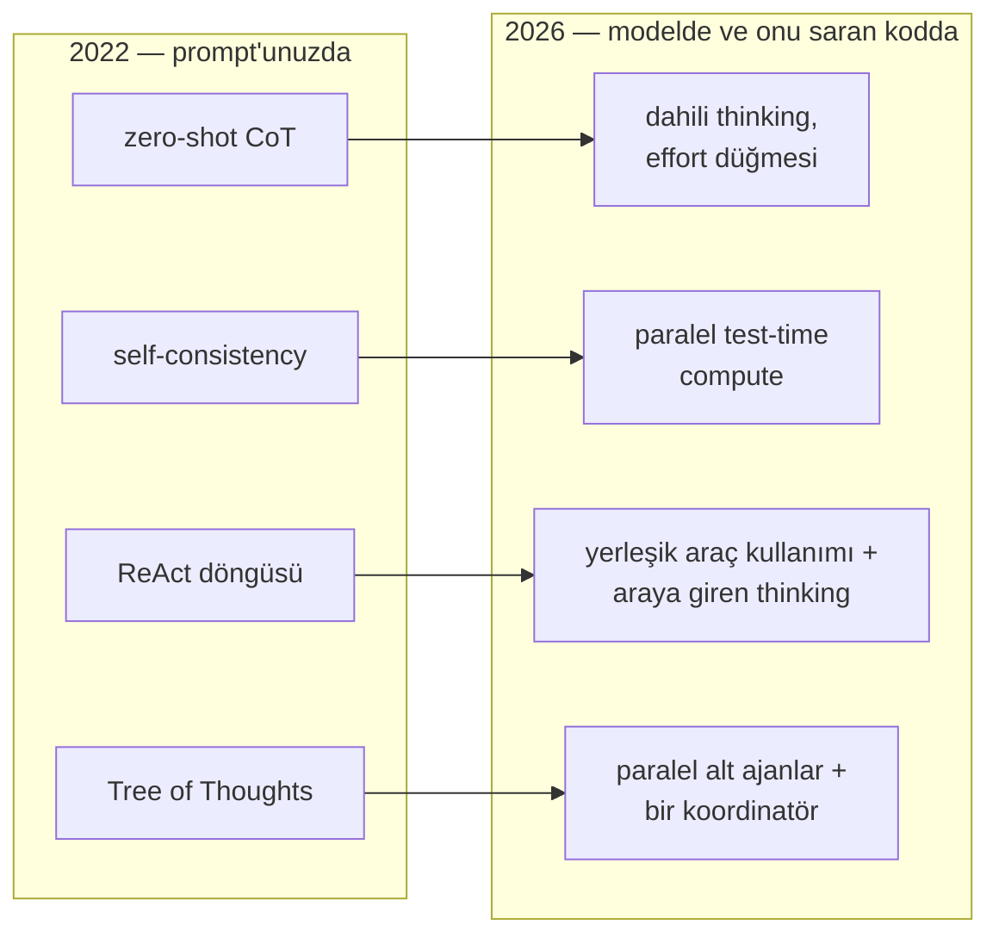

Alanın en ünlü prompt tavsiyesi tek cümledir: prompt'a "think step by
step" — adım adım düşün — ekleyin. 2022'de bu cümle büyüye yakındı;
bir aritmetik benchmark'ında en iyi modelin doğruluğunu %17,7'den
%78,7'ye çıkardı — tek bir ağırlığa dokunmadan. Peşinden bir akraba
ailesi geldi: düşünce zincirleri, düşünce ağaçları, çok zincir
üzerinde çoğunluk oyları, akıl yürütme ile eylemin döngüleri.

Sonra modeller değişti. Bugünün akıl yürüten modelleri, siz isteseniz
de istemeseniz de cevaptan önce düşünüyor; Anthropic'in güncel
rehberi elle yazılan adım adım prompt'lamayı "fallback" (yedek
yöntem) rafına kaldırmış durumda. Peki tavsiye nereye gitti? Ölmedi:
yer değiştirdi. Bu yazı taşınmanın izini sürüyor — cümle neden
işledi, ezbere bilinmeye değer teknikler, modellerin hangilerini
yuttuğu, prompt'unuzda hâlâ ne olması gerektiği ve belirtiden çözüme
üç soruluk teşhis.

**Bu yazıda**

- [1. Tek cümle neden mucize yarattı](#1-tek-cümle-neden-mucize-yarattı)
- [2. Klasik alet çantası](#2-klasik-alet-çantası)
- [3. Akıl yürüten modellerin yuttukları](#3-akıl-yürüten-modellerin-yuttukları)
- [4. Prompt'unuzda hâlâ ne olmalı](#4-promptunuzda-hâlâ-ne-olmalı)
- [5. Belirtiden tekniğe, tek sayfada](#5-belirtiden-tekniğe-tek-sayfada)
- [Bütün hikâye altı satırda](#bütün-hikâye-altı-satırda)
- [Terimler sözlüğü](#terimler-sözlüğü)
- [Daha derine inmek için](#daha-derine-inmek-için)

## 1. Tek cümle neden mucize yarattı

Çok adımlı bir matematik problemine *yalnızca* son sayıyı yazarak
cevap vermeye zorlanan bir öğrenci düşünün — müsvedde kâğıdı yasak.
2022 öncesi her LLM böyleydi. [LLM
yazısı](post.html?slug=llm-nasil-calisir) nedenini anlatmıştı: bir
transformer, token başına kabaca sabit miktarda hesap harcar. Cevap
hemen bir sonraki token'da belirecekse bütün akıl yürütme tek
**ileri geçişe** — ağın içinden tek seferlik yolculuğa — sığmak
zorundadır. Çok adımlı bir iş için tek yolculuk yetmez.

> **Chain-of-thought (CoT — düşünce zinciri)** = modelden, son
> cevaptan önce ara akıl yürütme adımlarını yazmasını istemek;
> böylece hesap tek token'a sıkışmak yerine birçok token'a yayılır.
> Kısacası: modelin eline müsvedde kâğıdı vermek.

Müsvedde işe yarar, çünkü üretim otoregresiftir — her token,
kendinden öncekileri görerek üretilir: yazılan her adım, bir sonraki
adımın girdisine dönüşür. Wei ve arkadaşları
**few-shot CoT**'yi gösterdi — cevapları *akıl yürütme içeren*
çözülmüş örnekler. Sekiz örnek, 540 milyar parametrelik bir modelin
GSM8K matematik puanını kabaca üçe katladı — yaklaşık %18'den
%57'ye — ve o görev için özel eğitilmiş modelleri geçti. Kojima ve
arkadaşları örnekleri de attı: çıplak *"Let's think step by step"*
tetikleyicisi — **zero-shot CoT (örneksiz)** — GPT-3'ün talimatla ince ayarlı
sürümünü sözel aritmetikte %17,7'den %78,7'ye taşıdı. Rehberin elma
problemi bütün etkiyi gösteriyor:

```text
Markete gidip 10 elma aldım. 2 elmayı komşuya, 2'sini tamirciye
verdim. Sonra 5 elma daha alıp 1 tanesini yedim. Kaç elmam kaldı?

Tetikleyici olmadan:        11 elma        ✗
"Adım adım düşünelim" ile:  10 → 2+2 verdim → 6 kaldı
                            → 5 aldım → 11 → 1 yedim
                            → 10 elma      ✓
```

Kullanmak için tetikleyiciyi kullanıcı mesajının son satırı olarak
ekleyin; başka hiçbir şey değişmez. İki makalenin de taşıdığı uyarı:
CoT **emergent (ölçekle beliren)** bir yetenektir. Küçük bir model
adım biçiminde saçmalık üretir — müsvedde, ancak adımları gerçekten
yapabilen öğrenciye yarar.

## 2. Klasik alet çantası

CoT'nin başarısı bir aile doğurdu. Her teknik gerçek bir hata
türünün adıdır ve hata türleri ortadan kalkmadı. Önce iki tek
cümlelik alet: **role prompting (rol verme)** — "Yirmi yıllık SaaS
deneyimli kıdemli bir büyüme pazarlamacısısın" — kelime seçimini ve
varsayımları olasılıkları kaydırarak yönlendirir, tiyatroyla değil
([ajan prompt yazısı](post.html?slug=ajan-promptunun-anatomisi)
derinlemesine anlatıyor); Salesforce'un kontrol listesi de iyi bir
uçuş öncesi kontroldür: talimat, bağlam, persona, format.

**Few-shot prompting (az örnekle gösterim)** — çözülmüş girdi–çıktı
çiftleri gösterin; model taklit eder. Min ve arkadaşlarının tuhaf bulgusu: *etiketleri
rastgeleleştirin*, performans neredeyse düşmez. Örnekler görevin
doğrusundan çok *şeklini* öğretir; emeği gerçekçi girdilere ve katı
tutarlı formata harcayın, etiket cilalamaya değil. Tekrarlanan
görevde örnekler sistem prompt'unda yaşar.

**Self-consistency (öz-tutarlılık)** — tek zincir herhangi bir
adımda uçurumdan yuvarlanabilir. O hâlde **sıcaklık (temperature)**
— rastgelelik düğmesi; her koşuyu farklı yola sokar — açıkken birkaç
zincir örnekleyin ve çoğunluk oyunu alın:

```text
S: Ben 6 yaşındayken kız kardeşim yaşımın yarısıydı.
   Şimdi 70'im, kardeşim kaç yaşında?

Koşu 1: 6 yaşındayken kardeş 3'tü → üç yaş küçük → 67
Koşu 2: "yaşımın yarısı" → 70 / 2 → 35
Koşu 3: 6 yaşındayken kardeş 3'tü → 67

Çoğunluk oyu: 67 ✓   (tek koşu 35 demişti)
```

Koşu 1 ile 3 işi baştan yürütür; koşu 2 yüzeydeki kalıba yapışıp
70'i böler. Wang ve arkadaşları GSM8K'da +17,9 puan ölçtü. Bu bir
prompt değil, kodunuzdaki bir döngüdür — ve on oy, on kat token
demektir; bugün çoğunlukla eval'lerde — çevrimdışı test
koşularında — yaşamasının nedeni bu.

**Prompt chaining (prompt zincirleme)** — görevi ardışık çağrılara
bölün: önce "soruyla ilgili alıntıları çıkar", sonra "döküman ve
alıntılardan cevabı yaz". İki API çağrısı; aradaki ek yerini
kodunuz denetler. İlk çağrı alıntı bulamazsa durup "bulunamadı"
deyin — ikinci çağrının uydurmasına izin vermeyin. Ek yerinin amacı
budur: test edilir, önbelleğe alınır, gözden geçirilir.

**ReAct** — akıl yürütmeyi eylemle iç içe örün: `Thought → Action →
Observation`, model cevap verebilene dek döner. 2022 tekniklerinin
düpedüz kazananı budur — çevrim, bugün her modern ajanın içinde
dönen döngünün ta kendisidir. Değişen yalnızca tesisat: araç çağırma
API'leri döngüyü sizin yerinize koşar; `Action:` satırı ayrıştırmak
yerine araç tanımlarsınız. Zayıflığı da hayatta: arama çöp
döndürürse akıl yürütme çöpün peşinden gider.

**Reflexion** — başarısız denemeden sonra bir değerlendirici olanı
puanlar ve belleğe *sözlü* bir ders yazılır ("yanlış odayı arayarak
tur harcadım"); bir sonraki deneme onu okur. ReAct ile eşleşince
AlfWorld ev görevlerinin 134'ünden 130'unu çözdü. Bugün bu döngü
ajan çerçevelerinin içinde geliyor; taşınan şey fikirdir.

**Tree of Thoughts (ToT — düşünce ağacı)** — akıl yürütmeyi arama
olarak kurun: dallan, modele kendi adaylarını puanlat, çıkmazdan
geri dön. Game of 24'te (dört sayıyı +−×÷ ile 24 yap) GPT-4, CoT ile
%4'ten ağaçla %74'e sıçradı. Ama laboratuvardan çıkamadı: yüksek
`effort`'lu bir akıl yürüten model, ağacın icat edildiği işlerin
çoğunu çözüyor; dallanma hâlâ gerekiyorsa **iskelet (scaffold)** —
modeli saran orkestrasyon kodu — paralel alt ajanlarla yapıyor
(3. bölüm).

| Teknik | Hamle | Bedel | 2026 durumu |
|---|---|---|---|
| few-shot | çözülmüş örnek göster | her çağrıda token | dimdik ayakta |
| zero-shot CoT | "adım adım düşün" | daha uzun çıktı | thinking modellere yutuldu |
| self-consistency | N zincir, çoğunluk oyu | N kat maliyet | niş: eval, yüksek risk |
| prompt chaining | tek iş, birkaç çağrı | gecikme, tesisat | ek yeri gerekince yaşıyor |
| ReAct | düşün ↔ eyle döngüsü | araç turları | ajan döngüsüne dönüştü |
| Reflexion | belleğe sözlü ders | değerlendir/yansıt çağrıları | ajan öz-düzeltmesi oldu |
| Tree of Thoughts | dallan, puanla, geri dön | patlayan çağrılar | paralel alt ajanlara dönüştü |

## 3. Akıl yürüten modellerin yuttukları

2022 alet çantası, modele hesap süresi almak için *sizin*
prompt'unuzu ve bütçenizi kullanıyordu. OpenAI'ın o1'iyle ve
Claude'un extended thinking'iyle (genişletilmiş düşünme) başlayan
kuşak aynı alışverişi eğitim zamanında yaptı: **pekiştirmeli
öğrenme (reinforcement learning)**, doğru cevaba çıkan akıl
yürütmeyi ödüllendirdi — uzun dahili zincirler refleks olana dek.



- **Zero-shot CoT → dahili thinking.** Model ne zaman ve ne kadar
  düşüneceğine kendisi karar verir, `effort` ile ayarlanır — çitin
  iki yanında da aynı isim: Anthropic'te `effort`, OpenAI'da
  `reasoning.effort` (minimal / low / medium / high gibi düzeyler).
  En yeni modellerde düşünme kapatılamaz bile.
- **Self-consistency → test-time compute (test anı hesabı).**
  Premium akıl yürütme katmanları paralel yollar örnekleyip API'nin
  arkasında uzlaştırıyor — çoğunluk oyunun sanayileşmiş hâli.
- **ReAct → yerleşik araç kullanımı**, çağrıların arasına giren
  thinking'le.
- **ToT → iskelet:** modeli saran kod, paralel alt
  ajanlar başlatır ve bir koordinatör sonuçları birleştirir — aynı
  ağaç, metne değil altyapıya çizilmiş.

Göç, eski tavsiyeyi tersine çevirdi: **buyurgan adım listeleri
yerine genel talimatlar**. "Cevaplamadan önce iyice düşün" artık
elle yazılmış planı çoğu zaman yener, çünkü modelin kendi akıl
yürütmesi insanın reçetesini sık sık aşar. Erken bir işaret de
vardı: 2022'de APE projesi, bir modele daha iyi bir tetikleyici
cümle *arattı* — bulduğu cümle, matematik benchmark'larında insan
yazımı "Let's think step by step"i geçti. Prompt engineering'in en
ünlü cümlesi, uğruna yazıldığı şey tarafından daha iyisiyle
değiştirildi.

## 4. Prompt'unuzda hâlâ ne olmalı

Yutulmak yok olmak değildir. Dört hamle kaldı.

**Yedek CoT.** Thinking kapalıysa ya da model küçükse 2022 hamlesi
hâlâ işler — müsveddeyi cevaptan ayırarak:

```text
Önce problemi <thinking> etiketleri içinde düşün.
Sonra yalnızca son cevabı <answer> etiketleri içinde ver.
```

Bu iki satır sistem prompt'una girer; kodunuz yalnızca `<answer>`
içini ayrıştırır. (Lehçe notu: GPT ailesi yapı için Markdown'a
yaslanır, Claude XML etiketlerine.)

**Akıl yürütme taşıyan örnekler.** Few-shot örneklerinizin içine
`<thinking>` koyun — Anthropic'in kendi rehberi — model kelimeleri
değil, thinking'in *neye baktığını* kopyalar:

```text
S: Talep: "Mart ayında iki kez ücret kesildi ve faturalama
   sayfasını açınca uygulama B-114 hatası veriyor."
<thinking>İki sinyal var: mükerrer ücret ve bir hata kodu. Eyleme
dönüşecek sorun ücret; B-114 onun belirtisi, ayrı bir hata değil.
Para sorunları arayüz sorunlarından önce gelir.</thinking>
<answer>kategori: faturalama · önem: yüksek</answer>
```

**Senaryo değil dürtme.** Derinliği, modeli kendi tavanınızla
sınırlayan numaralı bir plan yerine effort düğmesiyle ayarlayın —
OpenAI API'sinde kelimesi kelimesine `reasoning={"effort": "low"}`.
Ezberlemeye değer iki kaynaklı satır: matematik ve kod için sona
*"Bitirmeden önce cevabını [test ölçütlerine] karşı doğrula"*
ekleyin; kendi kararlarının etrafında dönen model içinse
Anthropic'in aşırı-düşünme kalıbını — *"bir yaklaşım seç ve ona
bağlı kal"* — sistem prompt'una koyup düşük `effort` ile eşleştirin.

**Adımları görmeniz gereken ek yerleri.** Self-consistency,
eval'lerde güvenilirlik kontrolü olarak yaşıyor: N kez örnekleyin,
uyuşmazlıkta alarm verin — düşük tutarlılık, modelin tahmin
yürüttüğü anlamına gelir. Prompt chaining ise bir aşamanın
denetlenmesi ya da onaylanması gereken her yerde yaşıyor; dahili
bir zincir test edilemez, denetlenemez.

## 5. Belirtiden tekniğe, tek sayfada

Belirtiden yola çıkın ve sırayla üç soru sorun. **Birincisi: sorun
gerçekten düşünme mi?** Yanlış bağlam, kusursuz akıl yürütmeyi bile
boşa çıkarır — [erişimi düzeltin](post.html?slug=hangi-rag-deseni);
çıktının *şekli* yanlışsa bu bir biçim sorunudur, örnekler daha
hızlı düzeltir. **İkincisi: az mı düşünüyor, çok mu?** Sığ ya da
kararsız cevaplar az; önemsiz işte yanan token'lar çok demektir.
İkisi de aynı düğmedir: `effort`'u yükseltin ya da düşürün.
**Üçüncüsü: adımları *görmeniz* gerekiyor mu?** O zaman etiketler,
bir zincir ya da tam bir
[ajan döngüsü](post.html?slug=ajan-promptunun-anatomisi). Ve
pratisyen rehberlerin birleştiği deneysel kural: aynı prompt farklı
modellerde farklı davranır — *gönderdiğiniz* modelde doğrulayın.

| Belirti | Uzanacağınız | Neden işler |
|---|---|---|
| matematik/mantık yanlış — thinking kapalı ya da model küçük | zero-shot CoT, `<thinking>`/`<answer>` ayrımı | adımları yazdırmak, modelin içeride harcamadığı hesabı satın alır |
| biçim doğru, akıl yürütme deseni yanlış | içinde `<thinking>` olan few-shot örnekler | örnekler işin şeklini öğretir; desen aktarılır |
| aynı soru, her koşuda farklı cevap | self-consistency kontrolü; `effort` yükselt | uyuşmazlık tahmini açığa çıkarır; oylar doğru zincirlerde birleşir |
| gerçekten zor problemlerde sığ cevaplar | `effort` yükselt; "iyice düşün" dürtmesi | model düşünme bütçesini az tutmuştur |
| önemsiz işler yavaş ve pahalı | `effort` düşür; akıl yürütmeyi sınırla | düşünme bir harcamadır ve burada hiçbir şey satın almaz |
| model sizin adımlarınızı izleyip uçuruma gidiyor | senaryoyu sil, hedefi söyle | elle yazılmış plan, modeli sizin tavanınızla sınırlar |
| ara sonuçları denetlemek/onaylamak gerek | prompt chaining | yalnızca çağrılar arasındaki ek yeri test edilir ve gözden geçirilir |
| gerçek sistemlere karşı çok adımlı iş | araçlı ajan döngüsü | akıl yürütme tek başına veri getiremez, eyleme geçemez |
| cevaplar yanlış çünkü bağlam yanlış | [erişimi düzelt](post.html?slug=hangi-rag-deseni) | yanlış sayfa üzerinde kusursuz akıl yürütme yine yanlıştır |

## Bütün hikâye altı satırda

1. Model token başına sabit miktarda iş yapar; çok adımlı bir
   problemi tek sıçrayışta çözemez. Önce akıl yürütmesini yazmasını
   istemek işi birçok token'a yayar — chain-of-thought budur ve tek
   cümle matematik doğruluğunu yaklaşık dörde katladı.
2. Her klasik teknik somut bir hatayı düzeltir: örnekler çıktı
   biçimini düzeltir (few-shot), birkaç koşu üzerinde oylama tek
   şanssız zinciri yakalar (self-consistency), çağrılara bölmek her
   adımı kontrol edilebilir yapar (chaining), araç döngüsü tahmin
   yerine gerçek veri getirir (ReAct), arama ise kötü bir ilk
   adımın her şeyi bozduğu bulmacalarda işe yarar (ToT).
3. Akıl yürüten modeller bunların çoğunu eğitim sırasında içeride
   yapmayı öğrendi: cevaptan önce düşünüyor, paralel yollar
   örnekliyor, araç döngülerini kendileri koşuyorlar.
4. Bu yüzden tavsiye tersine döndü: hedefi söyleyin, planı model
   yapsın. Elle yazılmış adım listesi artık sonucu çoğu zaman
   kötüleştirir, çünkü modelin kendi planı genellikle daha iyidir.
5. Prompt'ta hâlâ sizin yazdıklarınız: yerleşik düşünmesi olmayan
   modeller için thinking/answer etiketleri, *nasıl* akıl
   yürütüleceğini gösteren örnekler, daha çok ya da daha az düşünme
   satın alan effort ayarı ve bir adımı insan ya da test gözden
   geçirecekse ayrı çağrılar.
6. Hatayı teknik listesinden değil belirtiden başlayarak ayıklayın —
   ve modele yanlış bilgi verildiyse daha fazla düşünme cevabı asla
   düzeltmez.

Peki, "adım adım düşün" nereye gitti? Modelin içine — yapıştırılmadı,
eğitimle işlendi. Artık size ait olan düşünmenin kendisi değil,
düşünme *hakkındaki kararlardır*: ne zaman daha fazlasını satın
alacağınız, ne zaman tavan koyacağınız, ne zaman kâğıt üstünde
isteyeceğiniz.

## Terimler sözlüğü

Yazının temel sözcük dağarcığı, birer satırla:

- **chain-of-thought (CoT)** — modelden cevaptan önce ara akıl yürütme yazmasını istemek; transformer'a müsvedde kâğıdı.
- **forward pass (ileri geçiş)** — girdinin ağın içinden tek seferlik yolculuğu; üretilen her token'ın arkasındaki sabit iş birimi.
- **zero-shot / few-shot CoT** — akıl yürütmeyi çıplak bir talimatla / akıl yürütme içeren çözülmüş örneklerle tetiklemek.
- **temperature (sıcaklık)** — örneklemeye rastgelelik katan düğme; yükseldikçe koşular birbirinden ayrışır.
- **self-consistency** — birden çok akıl yürütme zinciri örnekleyip çoğunluk oyundaki cevabı almak.
- **prompt chaining** — görevi ardışık model çağrılarına bölmek; her ek yeri denetlenebilir.
- **ReAct** — araçlar üzerinde düşün-eyle-gözle döngüsü; bugünkü ajan döngüsünün atası.
- **Reflexion** — hatadan sonra yazılan, bir sonraki denemeden önce okunan sözlü ders.
- **Tree of Thoughts (ToT)** — ağaç araması olarak akıl yürütme: dallan, değerlendir, geri dön.
- **reasoning model (akıl yürüten model)** — görünür cevabından önce içeride düşünecek şekilde pekiştirmeli öğrenmeyle eğitilmiş model.
- **effort** — modelin dahili akıl yürütmeye ne harcayacağını ölçekleyen API düğmesi; Anthropic API'sinde `effort`, OpenAI'da `reasoning.effort` (minimal → high).
- **test-time compute** — doğruluğu daha büyük ağırlıklar yerine cevap anında daha çok hesapla satın almak.
- **scaffold (iskelet)** — modelin etrafını saran, neyi ne zaman çağıracağına karar veren kod.

## Daha derine inmek için

- Wei ve ark., [Chain-of-Thought Prompting Elicits Reasoning in Large Language Models](https://arxiv.org/abs/2201.11903) (2022) — her şeyi başlatan makale.
- Kojima ve ark., [Large Language Models are Zero-Shot Reasoners](https://arxiv.org/abs/2205.11916) (2022) — "Let's think step by step".
- Wang ve ark., [Self-Consistency Improves Chain of Thought Reasoning](https://arxiv.org/abs/2203.11171) (2022) — örneklenmiş zincirlerde çoğunluk oyu.
- Yao ve ark., [ReAct](https://arxiv.org/abs/2210.03629) (2022) — ajan desenine büyüyen düşün-eyle döngüsü.
- Yao ve ark., [Tree of Thoughts](https://arxiv.org/abs/2305.10601) (2023) — arama olarak akıl yürütme.
- Min ve ark., [Rethinking the Role of Demonstrations](https://arxiv.org/abs/2202.12837) (2022) — rastgele etiket bulgusu.
- Shinn ve ark., [Reflexion](https://arxiv.org/abs/2303.11366) (2023) — sözlü pekiştirme ve AlfWorld sonuçları.
- Zhou ve ark., [Large Language Models are Human-Level Prompt Engineers](https://arxiv.org/abs/2211.01910) (2022) — APE'nin makine buluşu tetikleyicisi.
- Anthropic, [Prompting best practices](https://platform.claude.com/docs/en/build-with-claude/prompt-engineering/claude-prompting-best-practices) — yazının 2026 yarısının kaynağı.
- OpenAI, [Reasoning guide](https://developers.openai.com/api/docs/guides/reasoning) — `reasoning.effort` parametresi ve düzeyleri.
- [The Prompting Guide](https://www.promptingguide.ai/techniques) — buradaki çözülmüş örneklerin arkasındaki güncel teknik kataloğu.
- Salesforce, [Prompt engineering techniques](https://www.salesforce.com/artificial-intelligence/prompt-engineering/techniques/) ve IBM, [Prompt engineering techniques](https://www.ibm.com/think/topics/prompt-engineering-techniques) — pratisyen bakışı: role prompting, dörtlü kontrol listesi, model başına test.
- Bu blogda: [Ajan prompt'unun anatomisi](post.html?slug=ajan-promptunun-anatomisi) — bu tekniklerin tam bir sistem prompt'undaki yeri — [LLM'ler gerçekte nasıl çalışır?](post.html?slug=llm-nasil-calisir) — CoT'nin neden işlediği — ve [Hangi RAG desenine gerçekten ihtiyacınız var?](post.html?slug=hangi-rag-deseni) — düşünmenin düzeltemeyeceği hatalar.
