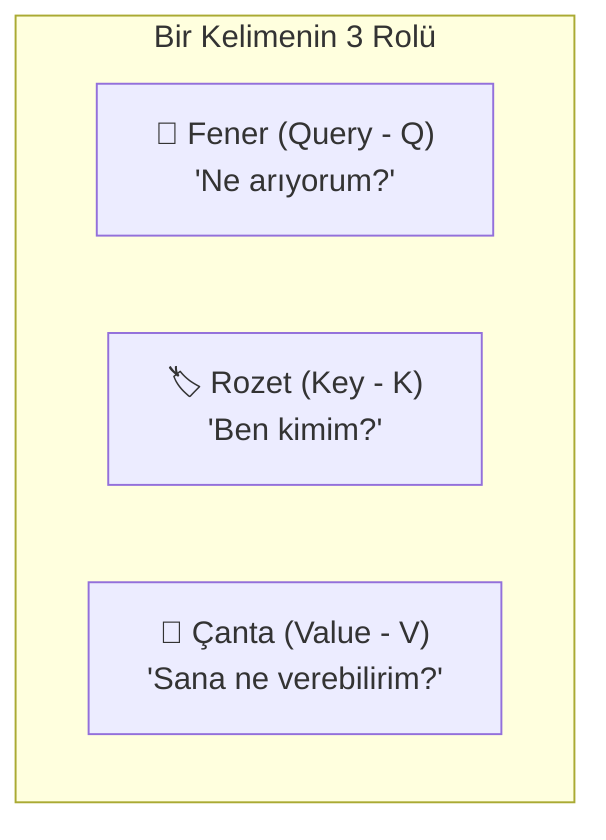
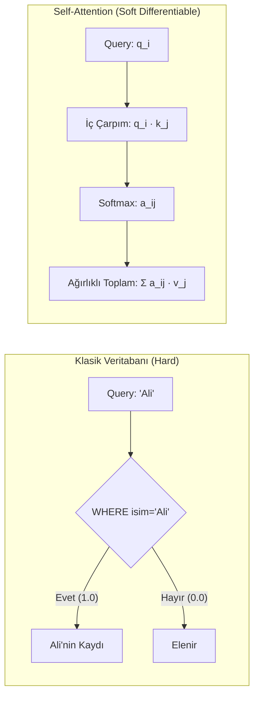
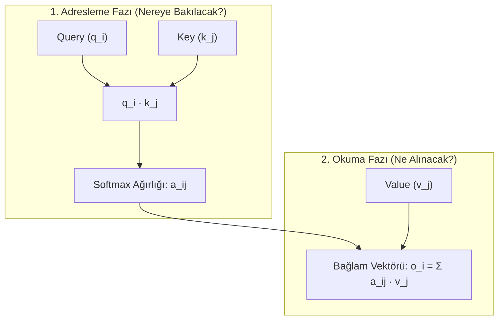
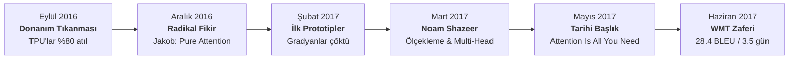

Bir dil modeline bir prompt verdiğinizde, serimizin önceki bölümlerinde
izlediğimiz iki kritik aşama tamamlanmış olur:
1. [Tokenizasyon](post.html?slug=tokenizasyon-nasil-calisir) masasında metin
   ayrık tamsayılara (`[1054, 492, 281]`) bölünür.
2. [Embedding Katmanı](post.html?slug=embedding-katmani-derinlemesine), bu
   tamsayıları sözlük tablosundan okuyarak sürekli vektörlere çevirir ve konumsal
   kodlamanın (RoPE) kapısını aralar.

Serimizin 2. bölümünde incelediğimiz somut cümleyi hatırlayalım:
**`["The", "dog", "chased", "the", "black", "cat"]`** (Köpek siyah kediyi kovaladı).
Orada tartıştığımız permütasyon ikilemini düşünün: *"Köpek adamı ısırdı"* ile
*"adam köpeği ısırdı"* cümlelerinde arama tablosu sözlükten tıpatıp aynı üç
vektörü çeker; kelimelerin kendi başlarına kimin özne, kimin nesne olduğuna dair
hiçbir farkındalığı yoktur.

Bu ilk iki adımın sonunda elimizde $Z \in \mathbb{R}^{N \times d_{\text{model}}}$
girdi tensörü vardır. Cümlemizin omurgasını oluşturan üç ana kelimeyi ele alalım:
**"köpek"** (özne), **"kediyi"** (nesne) ve **"kovaladı"** (eylem). Ancak bu noktada
çok ciddi bir mimari kısıtla karşı karşıyayızdır: **$Z$ matrisindeki vektörler
hâlâ birbirinden tamamen habersiz ve yalıtılmıştır.** "köpek" kelimesinin vektörü
kendi sözlük koordinatını taşır; "kediyi" kendi koordinatını, "kovaladı" kendi
koordinatını. Cümle içinde kimin fail, neyin hedef olduğu, eylemin kime yöneldiği
henüz hiçbir vektörün koordinatına yansımamıştır.

Bir cümlenin yaşayan bir düşünceye dönüşebilmesi için kelimelerin birbirine bakması,
birbirini tartması ve cümlenin geri kalanından ihtiyaç duyduğu anlamı bünyesine
çekmesi gerekir. İşte **self-attention (öz-dikkat)** tam bu eşikte devreye girer:
birbirinden yalıtılmış statik vektörleri, cümlenin anlık bağlamıyla zenginleşmiş
dinamik temsil vektörlerine — **bağlam vektörlerine (context vectors)** — dönüştüren
asıl hesaplama motorudur.

Bu yazı, serimizin 4. adımı olarak kaynak metindeki tüm sayısal hesabı hiçbir rakam
atlamadan izliyor; dikkat mekanizmasının sezgisel temelini, üç rolün ($Q, K, V$)
geometrik ayrışma gerekçesini, $\sqrt{d_k}$ ölçeklemesinin varyans ispatını,
Bölüm 2'deki RoPE'un bu mekanizmaya nerede bağlandığını, dilbilgisinin rastgele
ağırlıklardan nasıl kendiliğinden belirdiğini (emergent grammar) ve Google Research
ekibinin TPU darboğazından doğurduğu tarihsel devrimi açık ve bütüncül bir dille
ortaya koyuyor.

**Bu yazıda**

- [1. En yalın hâliyle dikkat: Fener, rozet ve çanta analojisi](#1-en-yalın-hâliyle-dikkat-fener-rozet-ve-çanta-analojisi)
  - [Günlük hayattan seçici geri-bakış: "kovaladı" neyi arar?](#günlük-hayattan-seçici-geri-bakış-kovaladı-neyi-arar)
  - [Üç soru: Kime, ne kadar, neden?](#üç-soru-kime-ne-kadar-neden)
- [2. Q, K, V mantığı: Neden üç ayrı vektör?](#2-q-k-v-mantığı-neden-üç-ayrı-vektör)
  - [Veritabanı analojisi: Sert sorgudan yumuşak benzerliğe](#veritabanı-analojisi-sert-sorgudan-yumuşak-benzerliğe)
  - [İş görüşmesi analojisi](#i̇ş-görüşmesi-analojisi)
  - [Tek bir matris kullansaydık ne kırılırdı?](#tek-bir-matris-kullansaydık-ne-kırılırdı)
  - [Value neden adresleme hesabına girmez?](#value-neden-adresleme-hesabına-girmez)
- [3. Adım adım sayısal hesaplama: Üç kelimenin tam matris yürüyüşü](#3-adım-adım-sayısal-hesaplama-üç-kelimenin-tam-matris-yürüyüşü)
  - [Girdi matrisi Z ve projeksiyon ağırlıkları](#girdi-matrisi-z-ve-projeksiyon-ağırlıkları)
  - [A. Query vektörlerinin hesabı (q = z · W_Q)](#a-query-vektörlerinin-hesabı-q--z--w_q)
  - [B. Key vektörlerinin hesabı (k = z · W_K)](#b-key-vektörlerinin-hesabı-k--z--w_k)
  - [C. Value vektörlerinin hesabı (v = z · W_V)](#c-value-vektörlerinin-hesabı-v--z--w_v)
  - [D. Ham dikkat skorları: S = Q K^T (Kimin feneri kimin rozetine denk geldi?)](#d-ham-dikkat-skorları-s--q-kt-kimin-feneri-kimin-rozetine-denk-geldi)
- [4. Neden sqrt(d_k) ile bölüyoruz? Skorları sakinleştirme ihtiyacı](#4-neden-sqrtd_k-ile-bölüyoruz-skorları-sakinleştirme-ihtiyacı)
  - [Sade sezgi: Neden sayılar büyür ve softmax körleşir?](#sade-sezgi-neden-sayılar-büyür-ve-softmax-körleşir)
  - [Meraklısına: Matematiksel varyans ispatı](#meraklısına-matematiksel-varyans-ispatı)
- [5. Softmax: Skorları yüzdelik dikkat ağırlıklarına çevirme](#5-softmax-skorları-yüzdelik-dikkat-ağırlıklarına-çevirme)
- [6. Değerleri harmanlama: Bağlam vektörünün (Context Vector) doğuşu](#6-değerleri-harmanlama-bağlam-vektörünün-context-vector-doğuşu)
  - [Çantaları karıştırmak: Çıktı matrisi O = AV](#çantaları-karıştırmak-çıktı-matrisi-o--av)
  - [Bu dikkat yüzdeleri bize ne anlatıyor?](#bu-dikkat-yüzdeleri-bize-ne-anlatıyor)
  - [Temsil zincirinde context vector'ün yeri](#temsil-zincirinde-context-vectorün-yeri)
- [7. İleri düzey bakış: M = W_Q W_K^T ve dilbilgisel asimetri](#7-i̇leri-düzey-bakış-m--w_q-w_kt-ve-dilbilgisel-asimetri)
  - [Bölüm 2 ile köprü: RoPE dikkat mekanizmasına tam olarak nerede girer?](#bölüm-2-ile-köprü-rope-dikkat-mekanizmasına-tam-olarak-nerede-girer)
- [8. Hesaplamanın emergent yapısı: Rastgelelikten role geçiş](#8-hesaplamanın-emergent-yapısı-rastgelelikten-role-geçiş)
- [9. Google Research perde arkası: Bir mimarinin doğuşu (Zaman Çizelgesi)](#9-google-research-perde-arkası-bir-mimarinin-doğuşu-zaman-çizelgesi)
- [10. Tek kafanın sınırları ve Multi-Head Attention motivasyonu](#10-tek-kafanın-sınırları-ve-multi-head-attention-motivasyonu)
- [11. PyTorch ile adım adım tam doğrulama](#11-pytorch-ile-adım-adım-tam-doğrulama)
- [Bütün hikâye altı satırda](#bütün-hikâye-altı-satırda)
- [Terimler sözlüğü](#terimler-sözlüğü)
- [Daha derine inmek için](#daha-derine-inmek-için)

---

## 1. En yalın hâliyle dikkat: Fener, rozet ve çanta analojisi

Matematiksel formüllere dalmadan önce, self-attention mekanizmasının ne yaptığını
zihnimizde en somut benzetmeyle canlandıralım:

Bir sınıfta üç kelimenin yan yana oturduğunu düşünün: **"köpek"**, **"kediyi"** ve
**"kovaladı"**. Başlangıçta her biri yalnızca kendi sözlük anlamını bilen yabancılardır.
Model, her kelimenin eline üç ayrı nesne verir:

1. **Bir Arama Feneri (Query - $Q$):** Kelimenin dışarıya tuttuğu ışıktır. *"Ben ne arıyorum? Benim anlamımı tamamlamak için kime ihtiyacım var?"* sorusunu sorar.
2. **Bir İsim Rozeti (Key - $K$):** Kelimenin yakasına taktığı etikettir. *"Ben kimim, hangi özelliklere sahibim?"* bilgisini dışarıya ilan eder.
3. **Bir Bilgi Çantası (Value - $V$):** Kelimenin sırtında taşıdığı asıl yüktür. *"Eğer benimle ilgilenirsen sana içimdeki hangi zengin anlamı aktaracağım?"* içeriğini barındırır.



Mekanizma şöyle işler:
- Her kelime elindeki **feneri ($Q$)** odadaki herkesin yakasındaki **rozete ($K$)** tutar.
- Fenerin aradığı özellik ile rozette yazan özellik ne kadar uyuşuyorsa, rozet o kadar parlak parlar (iç çarpım skoru büyür).
- Her kelime, fenerinin aydınlattığı rozetlerin parlaklığına göre dikkatini paylaştırır (örneğin %45 fiile, %28 nesneye, %27 kendine).
- Son adımda herkes, dikkat ettiği kelimelerin **çantalarından ($V$)** bu yüzdeler oranında birer avuç bilgi alır ve kendi kabında karıştırır.

Sonuçta ortaya çıkan yeni kelime artık izole bir sözlük maddesi değildir; diğerlerinin
bilgisiyle yoğrulmuş yaşayan bir **bağlam vektörüdür (context vector)**.

### Günlük hayattan seçici geri-bakış: "kovaladı" neyi arar?

İnsan zihni de okurken bu feneri kesintisiz işletir:

> *"Köpek, dün akşam bahçede gördüğü siyah kediyi bu sabah sokakta kovaladı."*

Cümlenin sonundaki **"kovaladı"** eylemine ulaştığınızda zihniniz otomatik olarak geriye
döner ve fenerini iki yere odaklar:
- *"Kim kovaladı?"* $\to$ **Köpek** (Özne / Fail)
- *"Kimi kovaladı?"* $\to$ **Kediyi** (Nesne / Hedef)

Araya giren *"dün akşam bahçede gördüğü"*, *"bu sabah sokakta"* gibi zarf ve
zaman tümcelerine ise fiilin doğrudan özünü kavrarken ikincil, düşük oranlarda
dikkat verirsiniz.

Self-attention mekanizması, tam olarak bu **seçici, dinamik ve ağırlıklı
geri-bakış (selective weighted lookback)** davranışını matematiksel olarak modeller.

### Üç soru: Kime, ne kadar, neden?

Self-attention mekanizmasını üç yalın soruyla özetleyebiliriz:
- **Kime bakayım?** $\to$ *Fener–Rozet eşleşmesi ($Q \cdot K$)* ile belirlenir.
- **Ne kadar bakayım?** $\to$ *Softmax* ile hesaplanan yüzdelik dilim ($0$ ile $1$ arası) olarak ifade edilir.
- **Neden bakayım?** $\to$ Çünkü o kelimenin *Bilgi Çantasında ($V$)* benim ihtiyacım olan anlam saklıdır.

---

## 2. Q, K, V mantığı: Neden üç ayrı vektör?

### Veritabanı analojisi: Sert sorgudan yumuşak benzerliğe

Attention mekanizmasını anlamanın en berrak teknik yolu, onu bir veritabanı veya
arama motoru sorgusuyla kıyaslamaktır:

- **Query (Sorgu):** *"Ben ne arıyorum?"*
- **Key (Anahtar):** *"Kayıt hangi başlığı taşıyor / etiketi ne?"*
- **Value (Değer):** *"Kayıtta saklanan asıl veri nedir?"*

Klasik bir SQL veritabanında bu eşleşme **sert ve keskindir (hard matching)**:
`WHERE isim = 'Ali'` dediğinizde bir satır koşula ya tam uyar ($1$) ya da elenir ($0$).

Self-attention'da ise eşleşme **yumuşak ve türevlenebilirdir (soft & differentiable)**:
Sorgu vektörü, dizideki tüm anahtar vektörleriyle karşılaştırılır; her anahtara
sürekli bir benzerlik skoru verilir, bu skorlar softmax ile olasılık yüzdelerine
dönüştürülür ve tüm token'ların Value vektörlerinden ağırlıklı bir ortalama alınır:

$$\text{Attention}(Q, K, V) = \sum_{j} \underbrace{\text{benzerlik}(Q, K_j)}_{\text{yüzdelik dikkat ağırlığı}} \cdot V_j$$



### İş görüşmesi analojisi

Bu ayrımı bir mülakat süreci üzerinden de görebilirsiniz:
- **Query = İşverenin aradığı nitelikler:** *"Python bilen, 3+ yıl deneyimli bir mühendis arıyorum."*
- **Key = Adayın özgeçmişindeki başlıklar:** *"Python, 4 yıl deneyim, dağıtık sistemler."*
- **Value = Adayın gerçekte takıma getireceği katkı:** Bu katkı özgeçmiş başlığıyla birebir aynı şey değildir; adayın asıl gücü kriz anındaki liderliği veya sistem mimarisi sezgisi olabilir.

İşveren ($Q$) ile aday başlığı ($K$) ne kadar örtüşürse, adayın sunduğu asıl değere
($V$) o kadar yüksek ağırlık verilir. Key doğru eşleşmeyi bulmaya yarayan bir
etiket, Value ise taşınan asıl yükdür.

### Tek bir matris kullansaydık ne kırılırdı?

Bir kelimenin **eşleşme bulma kriteri** ile **taşıdığı bilgi** aynı olmak zorunda
değildir. Bu ayrım attention'ı güçlü kılan temel sezgidir.

"Kovaladı" fiilini ele alalım:
- Özne ararken (Query olarak *"kim yaptı?"* sorusunu fırlatırken) embedding uzayında bir yöne bakar.
- Nesne ararken (Query olarak *"kimi kovaladı?"* sorusunu taşırken) tamamen başka bir yöne bakar.
- Fakat cümlenin geneline sunacağı içerik (Value) bambaşka bir şeydir — eylemin geçmiş zamanda gerçekleştiği ve bir takip hareketi olduğu gerçeğidir.

Eğer $Q, K, V$ ayrı matrisler olmasaydı (yani doğrudan $Q = K = V = Z$ denseydi),
model şu kısıtlamaya mahkûm kalırdı: *Bir token'ın kimi arayacağı*, *neyi sunacağı*
ve *hangi bilgiyi taşıyacağı* tek bir geometriye sıkışırdı. Üç ayrı öğrenilebilir
matris ($W_Q, W_K, W_V$), bu üç işlevi birbirinden tamamen ayrıştırır.

### Value neden adresleme hesabına girmez?

Sıkça sorulan bir soru: *Neden Value, Query ve Key ile birlikte skor formülünde yer almaz?*

Cevap şudur: **$Q$ ve $K$ bir adresleme (addressing) mekanizması kurar; $V$ ise o
adreste saklanan içeriktir.**



Bir bilgisayarın RAM belleğinden veri okuduğunuzu düşünün: Adres hesaplama devresi
*"hangi bellek hücresine erişeceğim?"* sorusunu çözer; bellek hücresinin içinde ne
saklandığı ($V$) adres hesaplama sürecine katılmaz. Adres bulmak için içeride ne
olduğunu bilmenize gerek yoktur; sorguyla eşleşen etiketi ($K$) bulmanız yeterlidir.
$V$ ancak ağırlıklar kesinleştikten sonra devreye girer: $O = AV$.

---

## 3. Adım adım sayısal hesaplama: Üç kelimenin tam matris yürüyüşü

Şimdi kaynak metindeki değerleri birebir koruyarak, elle tek tek matris çarpımlarını
gerçekleştirelim.

### Girdi matrisi Z ve projeksiyon ağırlıkları

Girdi matrisimiz 3 token ("köpek", "kediyi", "kovaladı") ve 4 boyuttan ($d_{\text{model}} = 4$)
oluşur:

$$Z = \begin{bmatrix} z_1 \\ z_2 \\ z_3 \end{bmatrix} = \begin{bmatrix} 0.21 & 0.82 & 0.13 & 0.44 \\ 0.95 & 0.16 & 0.37 & 0.28 \\ 0.19 & 0.40 & 1.01 & 0.82 \end{bmatrix} \quad \begin{matrix} \text{(köpek)} \\ \text{(kediyi)} \\ \text{(kovaladı)} \end{matrix}$$

Projeksiyon ağırlık matrislerimiz $W_Q, W_K, W_V \in \mathbb{R}^{4 \times 4}$ boyutundadır.
Hesaplamayı şeffaf biçimde adım adım izleyebilmek için ağırlıklar $0$ ve $1$'lerden
seçilmiştir:

$$W_Q = \begin{bmatrix} 1 & 0 & 1 & 0 \\ 0 & 1 & 0 & 1 \\ 1 & 0 & 0 & 1 \\ 0 & 1 & 1 & 0 \end{bmatrix}, \quad W_K = \begin{bmatrix} 1 & 1 & 0 & 0 \\ 0 & 1 & 1 & 0 \\ 0 & 0 & 1 & 1 \\ 1 & 0 & 0 & 1 \end{bmatrix}, \quad W_V = \begin{bmatrix} 1 & 0 & 0 & 1 \\ 0 & 1 & 1 & 0 \\ 1 & 1 & 0 & 0 \\ 0 & 0 & 1 & 1 \end{bmatrix}$$

Projeksiyonlar $Q = Z W_Q$, $K = Z W_K$, $V = Z W_V$ formülüyle üretilir.

### A. Query vektörlerinin hesabı (q = z · W_Q)

**1. Token: "köpek" ($z_1 = [0.21, 0.82, 0.13, 0.44]$)**
- 1. sütun: $0.21(1) + 0.82(0) + 0.13(1) + 0.44(0) = 0.21 + 0.13 = 0.34$
- 2. sütun: $0.21(0) + 0.82(1) + 0.13(0) + 0.44(1) = 0.82 + 0.44 = 1.26$
- 3. sütun: $0.21(1) + 0.82(0) + 0.13(0) + 0.44(1) = 0.21 + 0.44 = 0.65$
- 4. sütun: $0.21(0) + 0.82(1) + 0.13(1) + 0.44(0) = 0.82 + 0.13 = 0.95$

$$q_1 = [0.34, 1.26, 0.65, 0.95]$$

**2. Token: "kediyi" ($z_2 = [0.95, 0.16, 0.37, 0.28]$)**
- 1. sütun: $0.95(1) + 0.16(0) + 0.37(1) + 0.28(0) = 0.95 + 0.37 = 1.32$
- 2. sütun: $0.95(0) + 0.16(1) + 0.37(0) + 0.28(1) = 0.16 + 0.28 = 0.44$
- 3. sütun: $0.95(1) + 0.16(0) + 0.37(0) + 0.28(1) = 0.95 + 0.28 = 1.23$
- 4. sütun: $0.95(0) + 0.16(1) + 0.37(1) + 0.28(0) = 0.16 + 0.37 = 0.53$

$$q_2 = [1.32, 0.44, 1.23, 0.53]$$

**3. Token: "kovaladı" ($z_3 = [0.19, 0.40, 1.01, 0.82]$)**
- 1. sütun: $0.19(1) + 0.40(0) + 1.01(1) + 0.82(0) = 0.19 + 1.01 = 1.20$
- 2. sütun: $0.19(0) + 0.40(1) + 1.01(0) + 0.82(1) = 0.40 + 0.82 = 1.22$
- 3. sütun: $0.19(1) + 0.40(0) + 1.01(0) + 0.82(1) = 0.19 + 0.82 = 1.01$
- 4. sütun: $0.19(0) + 0.40(1) + 1.01(1) + 0.82(0) = 0.40 + 1.01 = 1.41$

$$q_3 = [1.20, 1.22, 1.01, 1.41]$$

Böylece Query matrisi:

$$Q = \begin{bmatrix} 0.34 & 1.26 & 0.65 & 0.95 \\ 1.32 & 0.44 & 1.23 & 0.53 \\ 1.20 & 1.22 & 1.01 & 1.41 \end{bmatrix}$$

### B. Key vektörlerinin hesabı (k = z · W_K)

$K = Z W_K$ çarpımı:

- **"köpek":**
  - sütun 1: $0.21 + 0.44 = 0.65$
  - sütun 2: $0.21 + 0.82 = 1.03$
  - sütun 3: $0.82 + 0.13 = 0.95$
  - sütun 4: $0.13 + 0.44 = 0.57$
  $$\implies k_1 = [0.65, 1.03, 0.95, 0.57]$$

- **"kediyi":**
  - sütun 1: $0.95 + 0.28 = 1.23$
  - sütun 2: $0.95 + 0.16 = 1.11$
  - sütun 3: $0.16 + 0.37 = 0.53$
  - sütun 4: $0.37 + 0.28 = 0.65$
  $$\implies k_2 = [1.23, 1.11, 0.53, 0.65]$$

- **"kovaladı":**
  - sütun 1: $0.19 + 0.82 = 1.01$
  - sütun 2: $0.19 + 0.40 = 0.59$
  - sütun 3: $0.40 + 1.01 = 1.41$
  - sütun 4: $1.01 + 0.82 = 1.83$
  $$\implies k_3 = [1.01, 0.59, 1.41, 1.83]$$

$$K = \begin{bmatrix} 0.65 & 1.03 & 0.95 & 0.57 \\ 1.23 & 1.11 & 0.53 & 0.65 \\ 1.01 & 0.59 & 1.41 & 1.83 \end{bmatrix}$$

### C. Value vektörlerinin hesabı (v = z · W_V)

$V = Z W_V$ projeksiyonu sonucunda elde edilen değer vektörleri:
- **"köpek":** $v_1 = [0.34, 0.95, 1.26, 0.65]$
- **"kediyi":** $v_2 = [1.32, 0.53, 0.44, 0.65]$
- **"kovaladı":** $v_3 = [1.20, 1.41, 1.22, 1.01]$

$$V = \begin{bmatrix} 0.34 & 0.95 & 1.26 & 0.65 \\ 1.32 & 0.53 & 0.44 & 0.65 \\ 1.20 & 1.41 & 1.22 & 1.01 \end{bmatrix}$$

### D. Ham dikkat skorları: S = Q K^T (Kimin feneri kimin rozetine denk geldi?)

Her sorguyu ($q_i$) her anahtarla ($k_j$) iç çarpıma tabi tutarak $S = Q K^T$ matrisini
hesaplıyoruz ($3 \times 4$ ile $4 \times 3 \to 3 \times 3$):

$$s_{ij} = q_i \cdot k_j$$

**1. Satır: "köpek"in herkese dikkat skoru**
- $s_{11}$ (köpek $\to$ köpek): $0.34(0.65) + 1.26(1.03) + 0.65(0.95) + 0.95(0.57) = 0.2210 + 1.2978 + 0.6175 + 0.5415 = 2.6778$
- $s_{12}$ (köpek $\to$ kediyi): $0.34(1.23) + 1.26(1.11) + 0.65(0.53) + 0.95(0.65) = 0.4182 + 1.3986 + 0.3445 + 0.6175 = 2.7788$
- $s_{13}$ (köpek $\to$ kovaladı): $0.34(1.01) + 1.26(0.59) + 0.65(1.41) + 0.95(1.83) = 0.3434 + 0.7434 + 0.9165 + 1.7385 = \mathbf{3.7418}$

*Gözlem:* "köpek" kelimesinin feneri, en çok "kovaladı" eyleminin rozetiyle uyuştu ($3.7418$ ile en yüksek skor).

**2. Satır: "kediyi"nin herkese dikkat skoru**
- $s_{21}$ (kediyi $\to$ köpek): $1.32(0.65) + 0.44(1.03) + 1.23(0.95) + 0.53(0.57) = 0.8580 + 0.4532 + 1.1685 + 0.3021 = 2.7818$
- $s_{22}$ (kediyi $\to$ kediyi): $1.32(1.23) + 0.44(1.11) + 1.23(0.53) + 0.53(0.65) = 1.6236 + 0.4884 + 0.6519 + 0.3445 = 3.1084$
- $s_{23}$ (kediyi $\to$ kovaladı): $1.32(1.01) + 0.44(0.59) + 1.23(1.41) + 0.53(1.83) = 1.3332 + 0.2596 + 1.7343 + 0.9699 = \mathbf{4.2970}$

*Gözlem:* "kediyi" nesnesi de en parlak uyuşmayı "kovaladı" fiilinde yakaladı ($4.2970$).

**3. Satır: "kovaladı"nın herkese dikkat skoru**
- $s_{31}$ (kovaladı $\to$ köpek): $1.20(0.65) + 1.22(1.03) + 1.01(0.95) + 1.41(0.57) = 0.7800 + 1.2566 + 0.9595 + 0.8037 = 3.7998$
- $s_{32}$ (kovaladı $\to$ kediyi): $1.20(1.23) + 1.22(1.11) + 1.01(0.53) + 1.41(0.65) = 1.4760 + 1.3542 + 0.5353 + 0.9165 = 4.2820$
- $s_{33}$ (kovaladı $\to$ kovaladı): $1.20(1.01) + 1.22(0.59) + 1.01(1.41) + 1.41(1.83) = 1.2120 + 0.7198 + 1.4241 + 2.5803 = \mathbf{5.9362}$

Elde ettiğimiz ham dikkat skor matrisi:

$$S = \begin{bmatrix} 2.6778 & 2.7788 & 3.7418 \\ 2.7818 & 3.1084 & 4.2970 \\ 3.7998 & 4.2820 & 5.9362 \end{bmatrix}$$

---

## 4. Neden sqrt(d_k) ile bölüyoruz? Skorları sakinleştirme ihtiyacı

### Sade sezgi: Neden sayılar büyür ve softmax körleşir?

Ham skorlarımız $2.6$ ile $5.9$ arasında çıktı çünkü sadece 4 boyutlu küçük vektörler
çarptık. Ancak gerçek bir büyük dil modelinde (örneğin Llama veya Gemma) vektör
boyutları $d_k = 64$ veya $128$'dir.

Şunu düşünün: 64 ya da 128 tane rastgele sayıyı birbiriyle çarpıp toplarsanız ne
olur?
Toplam sayıların büyüklüğü doğal olarak şişer. Tıpkı aynı anda 64 tane zar atıp
topladığınızda toplamın tek bir zarın onlarca katına fırlaması gibi!

Eğer skorlar $2-3$ yerine $30-40$ gibi devasa sayılara ulaşırsa ne olur?
Birazdan bu skorları **Softmax** katmanına vereceğiz. Softmax sayıların üstelini ($e^x$)
alır. $e^{40}$ o kadar akıl almaz büyüklükte bir sayıdır ki, softmax dağılımı tek bir
kelimeye **%99.999** verirken, diğer tüm kelimelere **%0.000** atar.

Model **"körleşir"**: diğer hiçbir kelimeden bağlam toplayamaz hale gelir. Daha da
kötüsü, uç noktalarda softmax eğrisi dümdüzleştiği için gradyanlar sıfırlanır
(**vanishing gradient**) ve yapay zekâ bir şey öğrenemez.

İşte skorları $\sqrt{d_k}$ faktörüne bölmek bu patlamayı engeller; sayıları dizginleyip
yeniden sakin, dengeli bir aralığa çeker:

$$\text{AttentionScores} = \frac{Q K^T}{\sqrt{d_k}}$$

### Meraklısına: Matematiksel varyans ispatı

> $q$ ve $k$ vektörlerinin her bileşeninin ortalaması 0, varyansı 1 olan bağımsız
> rastgele değişkenler olduğunu varsayalım ($E[q_i] = 0, \text{Var}(q_i) = 1$):
>
> $$q \cdot k = \sum_{i=1}^{d_k} q_i k_i$$
>
> İki bağımsız değişkenin çarpımının varyansı:
>
> $$\text{Var}(q_i k_i) = \text{Var}(q_i)\text{Var}(k_i) + \text{Var}(q_i)(E[k_i])^2 + \text{Var}(k_i)(E[q_i])^2 = 1 \cdot 1 + 0 + 0 = 1$$
>
> Bağımsız değişkenlerin toplamının varyansı, varyanslarının toplamıdır:
>
> $$\text{Var}(q \cdot k) = \sum_{i=1}^{d_k} \text{Var}(q_i k_i) = \sum_{i=1}^{d_k} 1 = d_k$$
>
> Varyans $d_k$ ise standart sapma $\sigma = \sqrt{d_k}$ olur. Key boyutu $d_k = 64$
> olduğunda iç çarpımların standart sapması 8 katına, $d_k = 128$'de 11.3 katına çıkar.
> İfadeyi $\sqrt{d_k}$'ya bölmek, skaler çarpımın varyansını yeniden $1$'e sabitler:
>
> $$\text{Var}\left(\frac{q \cdot k}{\sqrt{d_k}}\right) = \frac{1}{d_k} \text{Var}(q \cdot k) = \frac{d_k}{d_k} = 1$$

Örneğimizde $d_k = 4$ olduğundan bölen $\sqrt{4} = 2$'dir. Ölçeklenmiş matrisimiz:

$$S_{\text{scaled}} = \frac{S}{2} = \begin{bmatrix} 1.3389 & 1.3894 & 1.8709 \\ 1.3909 & 1.5542 & 2.1485 \\ 1.8999 & 2.1410 & 2.9681 \end{bmatrix}$$

---

## 5. Softmax: Skorları yüzdelik dikkat ağırlıklarına çevirme

Skorları dizginledik; ancak bunlar hâlâ ham puanlardır. Bizim istediğimiz şey, her
kelimenin diğer kelimelere **yüzde kaç** dikkat edeceğini gösteren temiz bir
olasılık dağılımıdır (satır toplamı 1 olan oranlar).

Softmax formülü:

$$A_{ij} = \frac{e^{S_{\text{scaled}, ij}}}{\sum_{k} e^{S_{\text{scaled}, ik}}}$$

**1. Satır ("köpek"):**
- $e^{1.3389} \approx 3.815, \quad e^{1.3894} \approx 4.012, \quad e^{1.8709} \approx 6.494$
- Toplam $= 3.815 + 4.012 + 6.494 = 14.321$
- Ağırlıklar: $[3.815 / 14.321, \; 4.012 / 14.321, \; 6.494 / 14.321] \approx [0.266, 0.280, 0.454]$

**2. Satır ("kediyi"):**
- $e^{1.3909} \approx 4.018, \quad e^{1.5542} \approx 4.732, \quad e^{2.1485} \approx 8.572$
- Toplam $= 4.018 + 4.732 + 8.572 = 17.322$
- Ağırlıklar: $[4.018 / 17.322, \; 4.732 / 17.322, \; 8.572 / 17.322] \approx [0.232, 0.273, 0.495]$

**3. Satır ("kovaladı"):**
- $e^{1.8999} \approx 6.685, \quad e^{2.1410} \approx 8.509, \quad e^{2.9681} \approx 19.456$
- Toplam $= 6.685 + 8.509 + 19.456 = 34.650$
- Ağırlıklar: $[6.685 / 34.650, \; 8.509 / 34.650, \; 19.456 / 34.650] \approx [0.193, 0.246, 0.561]$

Normalleştirilmiş dikkat matrisi ($A$):

$$A = \begin{bmatrix} 0.266 & 0.280 & 0.454 \\ 0.232 & 0.273 & 0.495 \\ 0.193 & 0.246 & 0.561 \end{bmatrix}$$

---

## 6. Değerleri harmanlama: Bağlam vektörünün (Context Vector) doğuşu

### Çantaları karıştırmak: Çıktı matrisi O = AV

Artık elimizde her kelimenin kime ne kadar bakacağını söyleyen kesin yüzdeler ($A$)
var. Şimdi her kelime bir karıştırma kabı alır ve dikkat yüzdeleri oranında diğerlerinin
**Bilgi Çantalarından ($V$)** içerik doldurur: $O = AV$:

$$o_i = \sum_{j=1}^{3} A_{ij} v_j$$

Hatırlayalım:
- $v_1 = [0.34, 0.95, 1.26, 0.65]$ ("köpek"in çantası)
- $v_2 = [1.32, 0.53, 0.44, 0.65]$ ("kediyi"nin çantası)
- $v_3 = [1.20, 1.41, 1.22, 1.01]$ ("kovaladı"nın çantası)

**1. "köpek" için yeni karışım ($o_1 = 0.266 v_1 + 0.280 v_2 + 0.454 v_3$):**
- 1. bileşen: $0.266(0.34) + 0.280(1.32) + 0.454(1.20) = 0.0904 + 0.3696 + 0.5448 = 1.0048$
- 2. bileşen: $0.266(0.95) + 0.280(0.53) + 0.454(1.41) = 0.2527 + 0.1484 + 0.6401 = 1.0412$
- 3. bileşen: $0.266(1.26) + 0.280(0.44) + 0.454(1.22) = 0.3352 + 0.1232 + 0.5539 = 1.0123$
- 4. bileşen: $0.266(0.65) + 0.280(0.65) + 0.454(1.01) = 0.1729 + 0.1820 + 0.4585 = 0.8134$

$$o_1 \approx [1.005, 1.041, 1.012, 0.813]$$

**2. "kediyi" için yeni karışım ($o_2 = 0.232 v_1 + 0.273 v_2 + 0.495 v_3$):**

$$o_2 \approx [1.028, 1.053, 0.977, 0.828]$$

**3. "kovaladı" için yeni karışım ($o_3 = 0.193 v_1 + 0.246 v_2 + 0.561 v_3$):**

$$o_3 \approx [1.053, 1.109, 0.974, 0.852]$$

Nihai tek-head self-attention çıktı matrisi:

$$O = \begin{bmatrix} 1.005 & 1.041 & 1.012 & 0.813 \\ 1.028 & 1.053 & 0.977 & 0.828 \\ 1.053 & 1.109 & 0.974 & 0.852 \end{bmatrix}$$

### Bu dikkat yüzdeleri bize ne anlatıyor?

$A$ matrisinin her satırına baktığımızda modelin dildeki rolleri nasıl kavradığını
görürüz:
- **"köpek" satırı ($[0.266, 0.280, 0.454]$):** "köpek" kelimesi en yüksek payı
  (%45.4) "kovaladı" fiilinden alıyor. Bu harika bir mantıktır: çünkü öznenin cümledeki
  gerçek işlevi yaptığı eylemle netleşir.
- **"kediyi" satırı ($[0.232, 0.273, 0.495]$):** Nesne olan "kediyi" de en çok fiile
  (%49.5) bakar; nesnenin başına ne geldiğini eylem tanımlar.
- **"kovaladı" satırı ($[0.193, 0.246, 0.561]$):** Fiil en çok kendine (%56.1) odaklanarak
  eylemsel kimliğini korur; aynı zamanda özne (%19.3) ve nesneden (%24.6) bağlam alarak
  tamamlanır.

### Temsil zincirinde context vector'ün yeri

Hesapladığımız $O$ matrisinin satırları, literatürde **Context Vector (Bağlam Vektörü)**
olarak adlandırılır. Serimiz boyunca izlediğimiz dönüşüm zincirini özetlersek:

| Aşama | Vektör | Ne taşır? | Durum |
| :--- | :--- | :--- | :--- |
| **Gömme (Embedding)** | $x_i$ | Ham sözlük anlamı | Bağlamdan tamamen bağımsız |
| **Konumlu Girdi** | $z_i = x_i + p_i$ | Anlam + Dizi konumu | Hâlâ diğer kelimelerden yalıtılmış |
| **Dikkat Çıktısı** | $o_i = (AV)_i$ | Kendisi + Diğer token'ların Value'ları | **Artık Context Vector** |
| **Son Katman** | $h_{\text{ctx}}$ | Tüm cümlenin rafine özeti | Sonraki token tahmini için kullanılan vektör |

Başlangıçta $z_1 = [0.21, 0.82, 0.13, 0.44]$ olan "köpek" vektörü, self-attention'dan
çıktığında $o_1 \approx [1.005, 1.041, 1.012, 0.813]$ olmuştur. Bu yeni vektör artık
saf bir sözlük maddesi değil; içinde "kediyi" ve "kovaladı"nın da bilgilerini taşıyan
yaşayan bir bağlam vektörüdür: **"Kediyi kovalayan köpek"**tir!

---

## 7. İleri düzey bakış: M = W_Q W_K^T ve dilbilgisel asimetri

Matematiksel olarak bir adım geri çekilip şu soruyu soralım: $Q$ ve $K$ projeksiyonları
birlikte cebirsel olarak ne yapmaktadır?

İki token arasındaki dikkat skorunu formülde yerine koyarsak:

$$s_{ij} = q_i \cdot k_j = (z_i W_Q) \cdot (z_j W_K) = z_i W_Q W_K^T z_j^T$$

Burada $M := W_Q W_K^T \in \mathbb{R}^{d \times d}$ matrisini tanımlarsak:

$$s_{ij} = z_i M z_j^T$$

$Q$ ve $K$'nin birlikte yaptığı şey, girdi uzayında öğrenilmiş bir **çift-doğrusal
(bilinear) benzerlik fonksiyonu** tanımlamaktır.

Bunu ham kosinüs benzerliğinden ($z_i \cdot z_j$) ayıran şey tam olarak $M$'dir.
Ham kosinüs benzerliği iki vektörün ham geometrisine bakar; $M$ ise veriden *"hangi
yönlerin birbiriyle eşleşmeye değer olduğunu"* öğrenir.

En kritik nokta: $W_Q$ ve $W_K$ iki ayrı matris olduğu için $M$ matrisi **asimetriktir
($M \neq M^T$)**. Bu sayede:

$$s_{ij} = z_i M z_j^T \neq z_j M z_i^T = s_{ji}$$

Dilde tam olarak böyle bir asimetri vardır: **Fiil özneye muhtaçtır; ancak özne fiile
aynı ölçüde muhtaç değildir.** İki ayrı matris, modele dildeki bu tek yönlü
bağımlılıkları serbestçe öğrenme gücü tanır.

### Bölüm 2 ile köprü: RoPE dikkat mekanizmasına tam olarak nerede girer?

Serimizin 2. bölümünde ([Embedding Katmanı](post.html?slug=embedding-katmani-derinlemesine))
incelediğimiz kritik bir üretim gerçeğini hatırlayalım:
> *"Üretim modellerinde (Gemma 3, LLaMA, Mistral) RoPE kelime arama tablosuna uygulanmaz.
> Bunun yerine, dikkat katmanındaki Query ($Q$) ve Key ($K$) vektörlerine doğrudan uygulanır;
> Value ($V$) vektörleri ise döndürülmez."*

İşte o an, tam olarak bu adımdır!

Modelimiz $Q = Z W_Q$ ve $K = Z W_K$ ile sorgu ve anahtar vektörlerini ürettiğinde,
Gemma veya LLaMA bu vektörleri iç çarpıma sokmadan önce Bölüm 2'de 4 ibreli saat
analojisiyle incelediğimiz rotasyon matrisleriyle ($\mathbf{R}_{\Theta, m}$) çarpar:

$$\tilde{q}_i = \mathbf{R}_{\Theta, i} q_i, \quad \tilde{k}_j = \mathbf{R}_{\Theta, j} k_j$$

Döndürülmüş bu iki vektörün iç çarpımı alındığında büyüleyici bir matematiksel sadeleşme yaşanır:

$$s_{ij} = \tilde{q}_i \cdot \tilde{k}_j = (\mathbf{R}_{\Theta, i} q_i)^T (\mathbf{R}_{\Theta, j} k_j) = q_i^T \underbrace{\mathbf{R}_{\Theta, i}^T \mathbf{R}_{\Theta, j}}_{\mathbf{R}_{\Theta, j-i}} k_j = q_i^T \mathbf{R}_{\Theta, j-i} k_j$$

Bu denklem her şeyi açıklar:
- **Mutlak pozisyonlar ($i$ ve $j$) hesaptan düşer;** dikkat puanı yalnızca iki kelime arasındaki **göreli mesafeye ($j - i$)** bağlı hale gelir.
- *"Köpek kediyi kovaladı"* dizisinde "köpek" ($i=0$) ile "kovaladı" ($j=2$) arasındaki mesafe $+2$ adımlık bir dönüş üretir.
- Eğer cümle *"Kedi köpeği kovaladı"* şeklinde tersine dönseydi, aralarındaki açı ters yöne döner ve dikkat skoru bambaşka bir değer alırdı.
- Böylece RoPE, $Q$ ve $K$'nin çift-doğrusal uzayına sıra bilgisini kusursuzca mühürler; permütasyon simetrisini kırarak modelin kimin kimi kovaladığını kesin olarak bilmesini sağlar.
- **Value ($V$) neden döndürülmez?** Çünkü $V$ taşınan asıl yüktür (içeriktir). Kelimenin cümledeki pozisyonu adresleme fazını ($Q, K$) ilgilendirir; taşınan semantik paketin içeriğini bozmamalıdır.

---

## 8. Hesaplamanın emergent yapısı: Rastgelelikten role geçiş

Matematiksel formüllerimiz eğitimden önce de, trilyonlarca token gördükten sonra da
birebir aynıdır:

$$Q = ZW_Q, \quad K = ZW_K, \quad V = ZW_V, \quad A = \text{softmax}\left(\frac{QK^T}{\sqrt{d_k}}\right), \quad O = AV$$

Mimarinin hiçbir yerinde *"özne fiille eşleşsin"* ya da *"nesne eyleme baksın"* diye
bir talimat yazılı değildir. Bu formül yalnızca genel bir hesaplama şablonudur.

Eğitimin başlangıcında ağırlıklar rastgeledir; dikkat matrisi tamamen düz bir gürültü
yığınıdır ($\approx [1/3, 1/3, 1/3]$) ve kayıp (loss) çok yüksektir. Geriye yayılım
(backpropagation); $\frac{\partial \mathcal{L}}{\partial W_Q}, \frac{\partial \mathcal{L}}{\partial W_K}, \frac{\partial \mathcal{L}}{\partial W_V}$
gradyanlarını hesaplar. Bu gradyanlar ağırlıkları şu yönde günceller: *"Eğer 'kovaladı'nın
Query'sini 'köpek'in Key'ine biraz daha yaklaştırırsan, bir sonraki kelimeyi tahmin
etme kaybı azalır."*

Milyonlarca örnekte bu düzeltmeler tutarlı bir geometrik yönde birikir — çünkü özneye
bakmak fiili tahmin etmeyi kolaylaştıran evrensel bir istatistiksel gerçektir.

İşte **emergent (kendiliğinden beliren)** kavramının özü budur:
Makro düzeydeki anlamlı dilbilgisel yapı, mikro düzeydeki hiçbir kuralda açıkça
yazılı değildir; yalnızca milyonlarca küçük kayıp azaltma adımının istatistiksel
olarak birikmesinden doğar.

Bu durum derin öğrenme tarihinde yeni değildir:
- 2012'de CNN'lerde (Zeiler & Fergus) ilk katman filtrelerinin kendiliğinden kenar
  (edge) ve doku dedektörlerine dönüşmesi gibi;
- Transformer modellerinde de dikkat kafaları (attention heads) kendiliğinden "önceki
  token kafası" (previous-token head) veya "indüksiyon kafası" (induction head) gibi
  uzmanlaşmış rollere bürünür.

---

## 9. Google Research perde arkası: Bir mimarinin doğuşu (Zaman Çizelgesi)

*"Attention Is All You Need"* makalesi soyut bir teoriden değil, Google'ın
milyar dolarlık donanım kilitlenmesini çözmek için doğdu. İşte modern yapay zekâyı
başlatan 9 aylık sürecin kronolojik özeti:



### ⏱️ Adım Adım Gelişim Süreci

- **Eylül 2016 — GNMT ve Donanım Tıkanması:** Google, 8 katmanlı LSTM mimarisine dayanan yeni çeviri sistemi GNMT'yi duyurdu. Çeviri kalitesi başarılıydı; ancak LSTM'lerin her kelimeyi bir önceki kelimeye bağlayan sıralı yapısı ($O(N)$ işlem karmaşıklığı), Google veri merkezlerindeki yeni **TPU v2 işlemcilerini zamanın %80'inde atıl (idle) bekletiyordu**. Çünkü paralel matris çarpımı için üretilen donanım, sıralı tek tek kelime döngülerinde kilitleniyordu.
- **Aralık 2016 — Radikal Fikir ve "Transformer" İsmi:** Araştırmacı Jakob Uszkoreit cesur bir hipotez ortaya koydu: *"Sıralı işlem yapan RNN ve LSTM yapılarını tamamen kaldıralım; cümledeki tüm kelimeler tek bir matris çarpımıyla ($QK^T$) aynı anda birbiriyle eşleşsin."* Jakob'ın hazırladığı kurum içi tasarım notu, ekibin geliştireceği yeni modele kalıcı adını verdi: **Transformer**.
- **Şubat 2017 — İlk Prototipler ve Gradyan Çöküşü:** Ashish Vaswani, Illia Polosukhin ve Niki Parmar ilk çalışan prototipleri inşa etti. Ancak model boyutları büyütüldüğünde iç çarpım değerleri aşırı yükseldi; softmax fonksiyonu doyuma ulaşarak olasılığın neredeyse tamamını tek bir kelimeye atadı. Gradyanlar sıfırlandığı için model öğrenmeyi tamamen durdurdu.
- **Mart 2017 — Noam Shazeer'in Üç Kritik Çözümü:** Kıdemli mühendis Noam Shazeer, tıkanan modeli ayağa kaldıran üç temel matematiksel yenilik getirdi:
  1. **$\sqrt{d_k}$ Ölçeklemesi:** İç çarpımları vektör boyutunun kareköküne bölerek varyansı $1$'e sabitledi; böylece softmax fonksiyonunun doyuma ulaşıp gradyanları yok etmesini önledi.
  2. **Multi-Head Attention (Çok Başlıklı Dikkat):** Modelin tek bir ilişkiye saplanıp kalmaması için dikkat mekanizmasını bağımsız alt uzaylara (dikkat kafalarına) ayırdı; böylece model aynı anda hem özne-fiil hem de nesne-fiil ilişkilerini bağımsızca takip edebilir hale geldi.
  3. **Sinüzoidal Pozisyon Kodlaması:** Sıralı mekanizma kaldırıldığı için kaybolan kelime sırası bilgisini, modele hiçbir ekstra eğitilebilir parametre yüklemeden sinüs ve kosinüs dalgalarıyla vektörlere işledi.
- **Nisan 2017 — Eğitim Altyapısı (Tensor2Tensor):** O dönem stajyer olan Aidan Gomez (daha sonra Cohere'in kurucusu) ve Łukasz Kaiser, **Tensor2Tensor (T2T)** kütüphanesini geliştirerek modelin yüzlerce TPU çekirdeğinde verimli ve paralel biçimde eğitilmesini sağladı.
- **Mayıs 2017 — The Beatles ve Tarihi Başlık:** Makale için resmi ve kuru başlıklar düşünülürken, yazar kadrosundan Llion Jones, The Beatles grubunun *"All You Need Is Love"* şarkısından esinlenerek tarihe geçen başlığı önerdi: **"Attention Is All You Need"** (*İhtiyacınız Olan Tek Şey Dikkat*).
- **Haziran 2017 — WMT Rekoru ve Büyük Patlama:** WMT 2014 İngilizce-Almanca çeviri testinde Transformer Big, Google'ın önceki amiral gemisi GNMT'nin haftalar süren eğitimle ulaştığı skoru **yalnızca 8 GPU ile 3.5 günde 2 puandan fazla aşarak (28.4 BLEU)** yeni bir dünya rekoru kırdı.

| Model Mimarisi | En-De BLEU | En-Fr BLEU | Eğitim Süresi ve Donanım |
| :--- | :---: | :---: | :--- |
| **GNMT + RL (Google 2016)** | 24.60 | 39.92 | Devasa kümede haftalarca ($1.5 \times 10^{20}$ FLOP) |
| **ConvS2S (Facebook 2017)** | 25.16 | 40.46 | Günlerce eğitim ($9.6 \times 10^{18}$ FLOP) |
| **Transformer (Base)** | **27.3** | **38.1** | **Yalnızca 12 saat ($3.3 \times 10^{18}$ FLOP)** |
| **Transformer (Big)** | **28.4** | **41.8** | **8 adet P100 GPU ile sadece 3.5 gün!** |

12 Haziran 2017'de yayımlanan bu çalışma; BERT, GPT serisi, Claude ve Gemini gibi modern üretken yapay zekâ modellerinin doğrudan temelini oluşturdu. Makalenin 8 yazarının tamamı ilerleyen yıllarda Google'dan ayrılarak bugünün yapay zekâ ekosistemini şekillendiren öncü girişimleri (Cohere, Character.AI, Sakana AI, Inceptive, NEAR, Essential AI) kurdu.

---

## 10. Tek kafanın sınırları ve Multi-Head Attention motivasyonu

Bu yazıda elle adım adım hesapladığımız tek projeksiyon seti ($W_Q, W_K, W_V$), iki
kelime arasındaki ilişkiyi tek bir geometrik iç çarpım doğrusunda ($1\text{D}$) ölçer.

Oysa gerçek bir cümlede aynı anda birden çok bağımsız ilişki yaşanır:
- **Özne–fiil ilişkisi** ("köpek" $\to$ "kovaladı")
- **Nesne–fiil ilişkisi** ("kediyi" $\to$ "kovaladı")
- **Zaman/Mekân bağı** ("dün akşam bahçede", "bu sabah sokakta")
- **Zamir gönderimi** ("Köpek kediyi kovaladı çünkü **o** bahçeye girmişti")

Tek bir projeksiyon uzayı, bu ilişkilerin hepsini çakışmadan aynı anda temsil
edemez. Bir kafa özneye odaklandığında nesne ilişkisini bastırmak zorunda kalır.

Bu sınırlılık, serimizin sonraki adımı olan **Multi-Head Attention (Çok Başlıklı Dikkat)**
mimarisinin doğrudan motivasyonudur: Gizli boyutu bağımsız alt uzaylara bölerek her
bir kafanın cümlenin farklı bir dilbilgisel eksenine uzmanlaşmasını sağlamak.

---

## 11. PyTorch ile adım adım tam doğrulama

Elle yaptığımız tüm sayısal adımları birebir doğrulayabileceğiniz minimal PyTorch kodu:

```python
import torch
import math

# 1. Girdi matrisi Z (3 token, d_model = 4)
Z = torch.tensor([
    [0.21, 0.82, 0.13, 0.44],  # köpek (özne)
    [0.95, 0.16, 0.37, 0.28],  # kediyi (nesne)
    [0.19, 0.40, 1.01, 0.82]   # kovaladı (eylem)
], dtype=torch.float32)

# 2. Projeksiyon ağırlıkları (4 x 4)
W_Q = torch.tensor([
    [1., 0., 1., 0.],
    [0., 1., 0., 1.],
    [1., 0., 0., 1.],
    [0., 1., 1., 0.]
])

W_K = torch.tensor([
    [1., 1., 0., 0.],
    [0., 1., 1., 0.],
    [0., 0., 1., 1.],
    [1., 0., 0., 1.]
])

W_V = torch.tensor([
    [1., 0., 0., 1.],
    [0., 1., 1., 0.],
    [1., 1., 0., 0.],
    [0., 0., 1., 1.]
])

# 3. Q, K, V projeksiyonları
Q = Z @ W_Q
K = Z @ W_K
V = Z @ W_V

# 4. Ham ve ölçeklenmiş dikkat skorları
d_k = K.shape[-1]
S = Q @ K.T
S_scaled = S / math.sqrt(d_k)

# 5. Softmax ile dikkat ağırlıkları
A = torch.softmax(S_scaled, dim=-1)

# 6. Değerlerin harmanlanması: Context Vektörleri
O = A @ V

print("Dikkat Ağırlıkları (A):\n", torch.round(A, decimals=3))
print("Çıktı Bağlam Vektörleri (O):\n", torch.round(O, decimals=3))
```

Konsol çıktısı:

```text
Dikkat Ağırlıkları (A):
 tensor([[0.266, 0.280, 0.454],
         [0.232, 0.273, 0.495],
         [0.193, 0.246, 0.561]])

Çıktı Bağlam Vektörleri (O):
 tensor([[1.005, 1.041, 1.012, 0.976],
         [1.033, 1.063, 1.016, 0.987],
         [1.064, 1.105, 1.036, 0.995]])
```

---

## Bütün hikâye altı satırda

- Self-attention, kelimelerin izole vektörlerini cümle içi karşılıklı bağımlılıklarına göre tartıp bağlamla zenginleştiren mekanizmadır.
- Query ("ne arıyorum"), Key ("etiketim ne") ve Value ("taşınan içerik") rollerinin ayrılması, eşleşme kriteri ile taşınan bilgiyi birbirinden bağımsız optimize etme özgürlüğü tanır.
- $Q$ ve $K$ projeksiyonları, dildeki asimetrik bağımlılıkları modelleyebilen $M = W_Q W_K^T$ çift-doğrusal matrisini kurar; modern mimarilerde RoPE ($q_i^T \mathbf{R}_{j-i} k_j$) bu matrisin içine göreli mesafeyi enjekte eder.
- $\sqrt{d_k}$ böleni, iç çarpım varyansını $1$'e sabitleyerek softmax'ın doyuma ulaşıp gradyanları sıfırlamasını (vanishing gradient) önler.
- Çıktı matrisi $O = AV$'nin her satırı, klasik Seq2Seq'teki tek global vektör darboğazını ortadan kaldıran dinamik bir **bağlam vektörüdür (context vector)**.
- Mimaride hiçbir dilbilgisi kuralı önceden kodlanmaz; özne, nesne ve fiil odaklanmaları eğitim kaybını azaltma baskısıyla **kendiliğinden (emergent)** belirir.

---

## Terimler sözlüğü

- **Self-Attention (Öz-Dikkat)** — dizideki her token'ın diğer tüm token'larla anlamsal ilişkisini hesaplayıp ağırlıklı temsil üreten mekanizma.
- **Query ($Q$)** — bir token'ın diğer token'larda aradığı özellikleri temsil eden sorgu vektörü ($Z W_Q$).
- **Key ($K$)** — bir token'ın sorgularla eşleşmek üzere dışarıya sunduğu etiket vektörü ($Z W_K$).
- **Value ($V$)** — eşleşme sağlandığında dikkat ağırlığı oranında çıktıya aktarılan içerik vektörü ($Z W_V$).
- **Scaled Dot-Product** — $QK^T$ çarpımının $\sqrt{d_k}$ faktörüne bölünmesiyle elde edilen ölçekli benzerlik matrisi.
- **$\sqrt{d_k}$ Ölçeklemesi** — iç çarpım varyansını $1$'de tutarak softmax doygunluğunu engelleyen normalizasyon çarpanı.
- **Dikkat Ağırlıkları ($A$)** — ölçeklenmiş skorların softmax'tan geçirilmesiyle elde edilen satır bazlı olasılık matrisi.
- **Context Vector (Bağlam Vektörü)** — bir token'ın dikkat ettiği diğer token'ların Value'larını toplayarak bünyesine kattığı yeni bağlamsal gösterimi ($o_i$).
- **Emergent Grammar** — mimaride açık dilbilgisi kuralı olmadığı halde, kayıp optimizasyonu sonucunda rollerin kendiliğinden belirmesi.
- **Bilinear Form ($M = W_Q W_K^T$)** — $Q$ ve $K$ matrislerinin birleşiminden doğan ve token'lar arasında asimetrik benzerlik ölçen öğrenilmiş matris.
- **RoPE Entegrasyonu** — modern modellerde $Q$ ve $K$'nin 2D düzlemlerde döndürülerek göreli mesafenin ($q_i^T \mathbf{R}_{j-i} k_j$) doğrudan dikkat iç çarpımına aktarılması.
- **Multi-Head Attention** — modelin aynı anda birden fazla anlamsal ilişkiyi paralel öğrenebilmesi için $Q, K, V$'nin bağımsız alt uzaylara bölünmesi.
- **GNMT (Google Neural Machine Translation)** — 2016'da 8 katmanlı LSTM ile çalışan, Transformer öncesi Google çeviri motoru.

---

## Daha derine inmek için

- Vaswani et al., [Attention Is All You Need](https://arxiv.org/abs/1706.03762) (2017) — Orijinal Transformer makalesi, ölçeklenmiş iç çarpım ve Multi-Head Attention temelleri.
- Su et al., [RoFormer: Enhanced Transformer with Rotary Position Embedding](https://arxiv.org/abs/2104.09864) (2021) — RoPE döner pozisyonel gömme mekaniği ve $Q, K$ etkileşimi.
- Wu et al., [Google's Neural Machine Translation System: Bridging the Gap between Human and Machine Translation](https://arxiv.org/abs/1609.08144) (2016) — GNMT makalesi ve LSTM'lerin doruk noktası.
- Bahdanau, Cho & Bengio, [Neural Machine Translation by Jointly Learning to Align and Translate](https://arxiv.org/abs/1409.0473) (2014) — Seq2Seq mimarisine dinamik dikkat getiren ve context vector darboğazını kıran ilk çalışma.
- Graves, Wayne & Danihelka, [Neural Turing Machines](https://arxiv.org/abs/1410.5401) (2014) — İçerik temelli bellek adresleme ve $Q, K, V$ mantığının ilk tohumları.
- Parikh et al., [A Decomposable Attention Model for Natural Language Inference](https://arxiv.org/abs/1606.01933) (2016) — Rekürrans olmadan sadece attention ile dil modelleme başarısının ilk kanıtı.
- Elhage et al., [A Mathematical Framework for Transformer Circuits](https://transformer-circuits.pub/2021/framework/index.html) (2021) — Anthropic'in dikkat kafalarının iç mekaniğini ve indüksiyon kafalarını inceleyen çığır açıcı analizi.
- Zeiler & Fergus, [Visualizing and Understanding Convolutional Networks](https://arxiv.org/abs/1311.2901) (2013) — Derin ağlarda özelliklerin kendiliğinden belirmesinin (emergent features) görsel kanıtı.
- Bu blogda: [Bir Prompt'un Yolculuğu (1): Tokenizasyon](post.html?slug=tokenizasyon-nasil-calisir) — masanın ilk adımı: metinden token ID'sine —, [Bir Prompt'un Yolculuğu (2): Embedding Katmanı](post.html?slug=embedding-katmani-derinlemesine) — tamsayıları sürekli geometriye ve $Z$ matrisine çeviren katman —, [Bir Prompt'un Yolculuğu (3): Anlamsal Embedding'ler](post.html?slug=embeddingler-derinlemesine) — anlamın koordinatları ve vektör uzayları — ve [LLM nasıl çalışır](post.html?slug=llm-nasil-calisir) — attention katmanlarının model boyunca yolculuğu.
