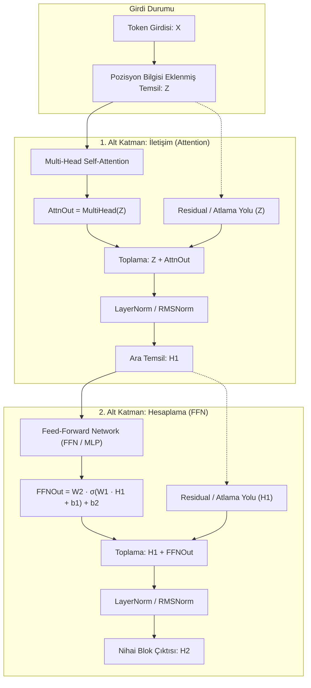

Bir dil modeline bir prompt verdiğinizde, serimizin önceki altı bölümünde adım adım izlediğimiz o muazzam mekanizma metni çoktan geometriye ve dinamik bağlama dönüştürmüştür:
1. [Tokenizasyon](post.html?slug=tokenizasyon-nasil-calisir) masasında metin ayrık tamsayılara (`[1054, 492, 281]`) parçalanır.
2. [Embedding Katmanı](post.html?slug=embedding-katmani-derinlemesine), bu tamsayıları sözlük tablosundan okuyarak sürekli vektörlere çevirir ve döner konumsal kodlama (RoPE) ile dizilim geometrisini kurar.
3. [Semantik Vektör Uzayı](post.html?slug=embeddingler-derinlemesine), kelimelerin geometrik yakınlık ve açılarla anlam kazandığı koordinat sistemini kurar.
4. [Self-Attention Mekanizması](post.html?slug=self-attention-derinlemesine), token'ların Query, Key ve Value izdüşümleriyle birbirine bakmasını ve cümlenin anlık bağlamıyla zenginleşmiş dinamik temsil vektörleri üretmesini sağlar.
5. [Causal Attention](post.html?slug=causal-attention-derinlemesine), zamanın okunu dayatarak gelecekteki token'ları alt üçgensel maskeyle karartır ve her token'ın yalnızca geçmişe bakmasını güvenceye alır.
6. [Multi-Head Attention](post.html?slug=multi-head-attention-derinlemesine), tek bir projektörün uzlaşma çıkmazını kırıp bağımsız alt uzaylarda birden çok dilbilgisel eksene (özne–fiil, yerel komşuluk) aynı anda odaklanmayı sağlar.

Serimizin 4., 5. ve 6. bölümlerinde incelediğimiz somut üç kelimelik cümleyi hatırlayalım: **`["köpek", "kediyi", "kovaladı"]`**. Bölüm 6'da her kelime için Multi-Head Attention hesaplamasını tamamladık, kafaları birleştirdik ve çıktı matrisi $W^O$ ile çarparak her token için zengin bir dikkat çıktısı ($O$) elde ettik.

Fakat tam bu noktada derin öğrenmenin en temel mimari sorusu karşımıza dikilir: **Bu dikkat çıktısını alıp doğrudan bir sonraki dikkat katmanına veya modelin çıkışına bağlayabilir miyiz?**

Cevap kesin bir **hayırdır**. Çünkü dikkat mekanizması tek başına iki ölümcül duvara çarpar:

1. **Gradyan Duvarı (Vanishing Gradient):** Derin bir modelde (örneğin 32 veya 80 katman) fonksiyonları $h_l = f_l(h_{l-1})$ şeklinde art arda doğrusal bağlarsanız, türevlerin zincir kuralı çarpımı nedeniyle 20 katman sonra gradyan orijinal gücünün milyonda birine erir; ağın alt katmanları hiçbir şey öğrenemez.
2. **Konveks Örtü Duvarı (Convex Hull):** Softmax katsayılarının toplamı 1'dir ve hepsi sıfırdan büyüktür ($\sum_j A_{ij} = 1, A_{ij} \ge 0$). Bu matematiksel kural gereği attention çıktısı, giren Value vektörlerinin **konveks kombinasyonundan** (ağırlıklı ortalamasından) ibarettir. Tıpkı paletteki mavi ve sarı boyayı karıştırarak ancak yeşilin tonlarını elde edebilmeniz gibi; palette olmayan kırmızı bir rengi (yeni bir mantıksal sentezi, XOR ilişkisini veya dünya bilgisini) attention tek başına asla üretemez.

İşte bu yüzden modern dil modelleri attention mekanizmasını tek başına bırakmaz. Onu, kendi kendine yeten, kararlı ve döngüsel olarak tekrarlanabilen eksiksiz bir hesaplama motorunun içine yerleştirir: **Transformer Bloğu (Transformer Block)**.

Bu blok, dikkat mekanizmasını üç vazgeçilmez bileşenle tamamlar:
- **Residual Bağlantılar (Skip Connection):** $y = x + f(x)$ yapısıyla türeve $\mathbf{I} + f'(x)$ "gradyan otoyolunu" kazandırarak 100 katman boyunca sinyalin kayıpsız akmasını sağlar.
- **Katman Normalizasyonu (LayerNorm / RMSNorm):** Atlama bağlantısıyla biriken sinyalin varyans patlamasını dizginler, her token'ın özelliklerini bir ses mikseri gibi dengeler.
- **Feed-Forward Network (FFN / MLP):** Boyutu $4d_{\text{model}}$'e genişleterek ve doğrusal-olmayan aktivasyonlarla (GELU, SwiGLU) attention'ın hapsolduğu konveks örtüyü paramparça eder; model parametrelerinin üçte ikisini barındırarak internetteki olgusal bilgileri depolayan devasa bir ilişkisel anahtar-değer belleği kurar.

Bu yazıda, serimizin 7. adımı olarak tek bir Transformer bloğunun tüm iç mekaniğini, önceki bölümlerdeki somut matrislerimiz üzerinden adım adım elle sayısal olarak hesaplayarak, geometrik sezgilerini açarak ve çalışan PyTorch koduyla doğrulayarak inceliyoruz.

**Bu yazıda**

- [1. Büyük resim ve veri yolu: Tek bir transformer bloğunun anatomisi](#1-büyük-resim-ve-veri-yolu-tek-bir-transformer-bloğunun-anatomisi)
- [2. Residual bağlantılar: Birim otoyol ve düzeltme felsefesi](#2-residual-bağlantılar-birim-otoyol-ve-düzeltme-felsefesi)
- [3. Kaybolan gradyan felaketi: 20 katmanda milyonda bire eriyen sinyal](#3-kaybolan-gradyan-felaketi-20-katmanda-milyonda-bire-eriyen-sinyal)
- [4. Residual bağlantılar bu sorunu nasıl çözer: I + f'(x) garantisi](#4-residual-bağlantılar-bu-sorunu-nasıl-çözer-i-fx-garantisi)
- [5. Katman Normalizasyonu (LayerNorm): Orkestranın ses ayarı](#5-katman-normalizasyonu-layernorm-orkestranın-ses-ayarı)
- [6. Attention sonrası 1. adım: Residual toplama ve LayerNorm sayısal yürüyüşü](#6-attention-sonrası-1-adım-residual-toplama-ve-layernorm-sayısal-yürüyüşü)
- [7. Attention'ın görünmeyen sınırı: Konveks örtü (Convex Hull)](#7-attentionın-görünmeyen-sınırı-konveks-örtü-convex-hull)
- [8. Parametrelerin üçte ikisi: İlişkisel anahtar-değer belleği olarak FFN](#8-parametrelerin-üçte-ikisi-ilişkisel-anahtar-değer-belleği-olarak-ffn)
- [9. Aktivasyon fonksiyonlarının evrimi: ReLU, GELU ve SwiGLU](#9-aktivasyon-fonksiyonlarının-evrimi-relu-gelu-ve-swiglu)
- [10. FFN sonrası 2. adım: FFN ve ikinci residual katmanının sayısal yürüyüşü](#10-ffn-sonrası-2-adım-ffn-ve-ikinci-residual-katmanının-sayısal-yürüyüşü)
- [11. Modern üretim modellerinde bloğun evrimi: Llama 3, Gemma 2 ve DeepSeek-V3](#11-modern-üretim-modellerinde-bloğun-evrimi-llama-3-gemma-2-ve-deepseek-v3)
- [12. İki mühendislik gözü: Eğitim ve çıkarım dinamikleri](#12-iki-mühendislik-gözü-eğitim-ve-çıkarım-dinamikleri)
- [13. PyTorch ile adım adım tam doğrulama](#13-pytorch-ile-adım-adım-tam-doğrulama)
- [Bütün hikâye altı satırda](#bütün-hikâye-altı-satırda)
- [Terimler sözlüğü](#terimler-sözlüğü)
- [Daha derine inmek için](#daha-derine-inmek-için)

---

## 1. Büyük resim ve veri yolu: Tek bir transformer bloğunun anatomisi

### İki motorun iş bölümü: İletişim (Attention) ve hesaplama (FFN)

Bir Transformer bloğu rastgele bir araya getirilmiş katmanlar yığını değildir; son derece net bir iş bölümüne sahip iki ana hesaplama motorundan oluşur:

1. **Attention alt katmanı (İletişim):** Token'ların dizi ekseni ($N \times N$) boyunca birbiriyle konuşmasını sağlar. Bir token diğer tüm token'lara bakar ve *"Benim bu bağlamdaki anlamımı tamamlamak için kimden ne kadar bilgi almalıyım?"* sorusunu yanıtlar. Ancak bu işlem tamamen token'lar arası bir harmanlamadır.
2. **FFN alt katmanı (Hesaplama & Bellek):** İletişim bittikten sonra her token kendi kabuğuna çekilir. FFN, her token'ın $d_{\text{model}}$ boyutlu vektörüne **birbirinden tamamen bağımsız olarak** (token-wise) uygulanır. Dizi ekseninde hiçbir etkileşim olmaz. Burada sorulan soru şudur: *"Topladığım bu bağlamsal bilgiyi kendi içimde nasıl işlemeliyim, hangi olgusal bilgileri çağırmalı ve yeni bir kavrama nasıl dönüştürmeliyim?"*

```
Attention = Şehir meydanındaki halk toplantısı (herkes birbiriyle konuşur, bilgi paylaşır).
FFN       = Toplantı sonrası herkesin kendi ofisine çekilip tek başına düşünmesi ve karar vermesi.
```

### Blok içi akış şeması ve Pre-LN vs Post-LN farkı

Tek bir Transformer bloğundaki veri akışı şu 8 adımdan oluşur:



2017'deki özgün Transformer (Vaswani vd.), normalizasyonu toplama işleminden sonra uygulayan **Post-LN** mimarisini kullanmıştı:

$$H_1 = \text{LayerNorm}(Z + \text{MultiHead}(Z))$$

$$H_2 = \text{LayerNorm}(H_1 + \text{FFN}(H_1))$$

Post-LN tasarımında normalizasyon doğrudan atlama yolunun üzerine oturur. Bu durum derinleştikçe ($L > 12$) geriye yayılan gradyanların normalizasyon türevi tarafından sürekli küçültülmesine yol açar; model çok hassas bir öğrenme oranı ısıtma (learning rate warm-up) takvimi olmadan ilk adımlarda patlar veya öğrenemez.

Bu yüzden modern tüm büyük dil modelleri (Llama 3, Mistral, Gemma 2), normalizasyonu alt katmanların girişine alan **Pre-LN / Pre-RMSNorm** düzenine geçmiştir:

$$H_1 = Z + \text{MultiHead}(\text{Norm}(Z))$$

$$H_2 = H_1 + \text{FFN}(\text{Norm}(H_1))$$

Pre-LN mimarisinde atlama yolu hiçbir normalizasyon bariyerine çarpmaz. Modelin tabanından tavanına kadar uzanan kesintisiz, pürüzsüz bir bilgi ve gradyan omurgası (residual stream) elde edilir.

---

## 2. Residual bağlantılar: Birim otoyol ve düzeltme felsefesi

### Düzeltme ile baştan inşa arasındaki fark

Residual (artık) bağlantı prensibi zarif bir sadeliğe sahiptir: Bir katmanın girdiyi tamamen yeniden üretmesini istemek yerine, katmana sadece girdinin üzerine eklenecek küçük bir düzeltme (delta) hesaplatılır:

$$y = x + \mathcal{F}(x)$$

Bu formülün getirdiği üç derin mühendislik avantajı vardır:

1. **Varsayılan davranış birim fonksiyondur (Identity):** Katmanın ağırlıkları ($\mathcal{F}(x)$) sıfıra yakın başlatıldığında veya katman o adımda anlamlı bir şey öğrenemediğinde, sistem çökmek yerine hiçbir şey yapmama seçeneğine sığınır: $\mathcal{F}(x) \approx 0 \implies y \approx x$. Girdi hasar görmeden sonraki katmana akar.
2. **Sıfırdan çizmek yerine rötuş yapmak:** Skip bağlantısı olmayan bir ağda 45. katman kötü bir gradyan güncellemesi alırsa önceki 44 katmanın tüm emeği silinir. Residual ağda ise katman tüm resmi baştan çizmez; mevcut resmin üzerine küçük bir fırça darbesi vurur.
3. **Erken özelliklerin korunması:** İlk katmanlarda öğrenilen morfolojik veya sözdizimsel ham özellikler, üst katmanların karmaşık soyutlamaları tarafından ezilmeden son katmana kadar taşınabilir.

### Atlama yolunun devre şeması ve birim fonksiyon güvencesi

Bu yapıyı bir elektrik devresi veya çift hatlı demiryolu gibi düşünebiliriz. Girdi $x$ iki yola aynı anda girer:

```
          x ─────────────────────────────┐ (Skip / Atlama Yolu - Kesintisiz Ekspres Hat)
          │                              │
          ▼                              ▼
      ┌───────┐                      ┌───────┐
      │ F(x)  │ ───────────────────> │   +   │ ───> y = x + F(x)
      └───────┘                      └───────┘
   (İşlem Yolu)
```

$\mathcal{F}(x)$ katmanı ne kadar karmaşık, doğrusal-olmayan veya gürültülü olursa olsun, girdinin değişmeden çıkışa ulaşabileceği bir paralel hat her zaman mevcuttur.

---

## 3. Kaybolan gradyan felaketi: 20 katmanda milyonda bire eriyen sinyal

### Zincir kuralı çarpımı ve Jacobian sönümlemesi

Residual bağlantıların derin öğrenmedeki asıl mucizesini anlamak için, çözdükleri en büyük krize bakmak gerekir: **Vanishing Gradient (Kaybolan Gradyan)** problemi.

Residual bağlantısı olmayan $L$ katmanlı klasik bir ağda ileri geçiş fonksiyon bileşkesidir:

$$h_l = f_l(h_{l-1}) \quad (l = 1, \dots, L)$$

Geri yayılımda (backpropagation) loss fonksiyonunun ($\mathcal{L}$) ilk katman girdisine ($h_0$) göre türevi zincir kuralı ile hesaplanır:

$$\frac{\partial \mathcal{L}}{\partial h_0} = \frac{\partial \mathcal{L}}{\partial h_L} \cdot \frac{\partial h_L}{\partial h_{L-1}} \cdot \frac{\partial h_{L-1}}{\partial h_{L-2}} \cdots \frac{\partial h_1}{\partial h_0} = \frac{\partial \mathcal{L}}{\partial h_L} \prod_{l=1}^L \frac{\partial h_l}{\partial h_{l-1}}$$

Her bir $\frac{\partial h_l}{\partial h_{l-1}}$ terimi ilgili katmanın yerel Jacobian matrisidir. Eğer bu türevlerin ortalama büyüklüğü 1'den küçükse ($r < 1$ — örneğin doyan aktivasyonlar veya $1$'den küçük matris normları nedeniyle), gradyan katman derinliği arttıkça üstel olarak erir:

$$\left\| \frac{\partial \mathcal{L}}{\partial h_0} \right\| \propto r^L$$

### Sayısal erime tablosu: 20 katmanda gradyan ne kadar küçülür?

Katman başına ortalama $r$ zayıflama katsayısı için gradyanın katman derinliğine göre erimesini inceleyelim:

| Katman Derinliği ($L$) | $r = 0,9$ (Hafif Kayıp) | $r = 0,7$ (Orta Kayıp) | $r = 0,5$ (Şiddetli Kayıp) |
|:---|:---|:---|:---|
| **0 (Loss katmanı)** | 1,000 | 1,000 | 1,000 |
| **5 katman** | 0,590 | 0,168 | 0,031 |
| **10 katman** | 0,349 | 0,028 | 0,00098 |
| **15 katman** | 0,206 | 0,0047 | 0,0000305 |
| **20 katman** | 0,122 | 0,0008 | **0,00000095 ($9,5 \times 10^{-7}$)** |

$r = 0,5$ sütununa dikkat edin: Yalnızca 20 katman sonra gradyan orijinal gücünün **milyonda birine** inmektedir. 80 katmanlı modern bir modelde $(0,5)^{80} \approx 8,27 \times 10^{-25}$ olur. IEEE 754 float16 formatında bu sayı doğrudan sıfıra (underflow) yuvarlanır. En alttaki katmanların ağırlıklarına hiçbir güncelleme sinyali ulaşamaz; ağ donar ve öğrenme tamamen durur.

---

## 4. Residual bağlantılar bu sorunu nasıl çözer: I + f'(x) garantisi

### Türevde birim matris kalkanı: Katman ölse bile otoyol açık kalır

Residual bağlantı eklendiğinde katman çıktısı $h_l = h_{l-1} + f_l(h_{l-1})$ olur. Şimdi bu ifadenin bir önceki katmana göre türevini alalım:

$$\frac{\partial h_l}{\partial h_{l-1}} = \frac{\partial}{\partial h_{l-1}} \left[ h_{l-1} + f_l(h_{l-1}) \right] = \mathbf{I} + f'_l(h_{l-1})$$

Buradaki $\mathbf{I}$, atlama yolunun türevi olan **Birim Matristir (Identity Matrix)**. Zincir kuralını tekrar yazdığımızda:

$$\frac{\partial \mathcal{L}}{\partial h_0} = \frac{\partial \mathcal{L}}{\partial h_L} \prod_{l=1}^L \left( \mathbf{I} + f'_l(h_{l-1}) \right)$$

Bu ifadenin parantezlerini açtığınızda karşınıza şu toplam çıkar:

$$\frac{\partial \mathcal{L}}{\partial h_0} = \frac{\partial \mathcal{L}}{\partial h_L} \left( \mathbf{I} + \sum_{l=1}^L f'_l + \sum \text{çapraz terimler} \right)$$

> [!IMPORTANT]
> **Birim Otoyol Kalkanı:** Katmanların türevi olan $f'_l$ fonksiyonları sıfıra çökse bile (katman "ölse" veya doysa bile), formüldeki $\mathbf{I}$ terimi asla kaybolmaz. Gradyan, katmanların karmaşık iç işlemlerine hiç takılmadan, doğrudan birim matris üzerinden en baştaki katmana kadar kayıpsız bir biçimde akar.

### Sayısal karşılaştırma: Residual olan ve olmayan 20 katman

$f'(x) \approx 0,5$ varsayımıyla (sinyalin yarısını emen zayıflatıcı bir dönüşüm) iki durumu 20 katman boyunca karşılaştıralım:

| Katman Derinliği ($L$) | Residual Yok: $(0,5)^L$ | Residual Var: $(1 + 0,5)^L$ |
|:---|:---|:---|
| **0** | 1,000 | 1,000 |
| **5** | 0,031 | 7,59 |
| **10** | 0,00098 | 57,66 |
| **20** | **0,00000095** | **3325,26** |

Residual bağlantı gradyanın sıfıra çökmesini kesin olarak engeller. Ancak tablodaki $(1 + 0,5)^{20} \approx 3325$ değeri başka bir tehlikeye işaret eder: **Patlayan gradyan (Exploding Gradient)** ve aktivasyon varyansı artışı.

İşte bu kontrolsüz büyümeyi dizginleyen ve her adımda sinyali yeniden evcilleştiren bileşen, residual'ın ayrılmaz ortağıdır: **Layer Normalization**.

---

## 5. Katman Normalizasyonu (LayerNorm): Orkestranın ses ayarı

### Formüller ve mikser analojisi: Vektörün iç dengesini kurmak

Residual bağlantılar sinyali sürekli birbirinin üzerine toplar ($x + \text{Attn}(x) + \text{FFN}(x)$). Önlem alınmazsa katmanlar ilerledikçe vektörlerin sayısal büyüklüğü ve varyansı çığ gibi büyür.

**Layer Normalization (Ba, Kiros ve Hinton 2016)**, her bir token'ın $d_{\text{model}}$ boyutlu özellik vektörünü kendi içinde bağımsız olarak normalize eder:

```
Vektör Girdisi: x = [x_1, x_2, ..., x_d]
```

1. **Ortalama ($\mu$):**
$$\mu = \frac{1}{d} \sum_{i=1}^d x_i$$

2. **Varyans ($\sigma^2$):**
$$\sigma^2 = \frac{1}{d} \sum_{i=1}^d (x_i - \mu)^2$$

3. **Standartlaştırma ($\hat{x}$):**
$$\hat{x}_i = \frac{x_i - \mu}{\sqrt{\sigma^2 + \epsilon}}$$

4. **Öğrenilebilir Ölçekleme ve Kaydırma ($y$):**
$$y_i = \gamma_i \hat{x}_i + \beta_i$$

Buradaki $\epsilon$ ($10^{-5}$ veya $10^{-6}$), sıfıra bölünmeyi engelleyen kararlılık sabitidir. $\gamma$ (gain) ve $\beta$ (bias) ise modelin gerekirse orijinal dağılımı geri getirebilmesini sağlayan öğrenilebilir parametrelerdir.

```
Benzetme: Bir ses mikseri düşünün. Orkestradaki bir enstrüman (bir özellik boyutu)
aniden 50 birim ses patlaması yaparsa hoparlörler yanar. LayerNorm, her müzisyenin
ses seviyesini ölçer, ortalamasını alır ve genel ses düzeyini standart bir desibel
aralığına (ortalama 0, varyans 1) çeker.
```

### Neden BatchNorm değil? Dil modellerinde değişken uzunluk ve batch=1 açmazı

Bilgisayarlı görüde devrim yaratan **Batch Normalization (BatchNorm)**, neden doğal dil işlemede (NLP) ve büyük dil modellerinde terk edilmiştir?

```
BatchNorm (Görü):  İstatistiği BATCH ekseninde toplar. (Farklı resimlerin aynı kanalı).
LayerNorm (NLP):   İstatistiği ÖZELLİK ekseninde toplar. (Aynı token'ın d_model boyutu).
```

| Kriter | Batch Normalization (BatchNorm) | Layer Normalization (LayerNorm) |
|:---|:---|:---|
| **İstatistik Hesabı Ekseni** | Mini-batch örnekleri boyunca | Tek bir token'ın gizli özellikleri boyunca |
| **Değişken Dizi Uzunluğu** | Farklı uzunluktaki cümlelerde dolgu (padding) istatistiği bozar | Dizi uzunluğundan tamamen bağımsızdır |
| **Çıkarım (Inference) Davranışı** | Eğitimde biriktirilen hareketli ortalamalara bağımlıdır | Her token anında kendi içinde hesaplanır |
| **Batch Size = 1 Durumu** | Tek bir prompt geldiğinde varyans sıfır olur, çöker | Batch boyutu 1 olsa bile kusursuz çalışır |

Modern üretim modelleri (Llama 3, Gemma 2) LayerNorm'u daha da basitleştirerek ortalama çıkarma adımını kaldıran **RMSNorm** (Zhang ve Sennrich 2019) kullanır:

$$\text{RMS}(x) = \sqrt{\frac{1}{d} \sum_{i=1}^d x_i^2 + \epsilon}, \quad \text{RMSNorm}(x)_i = \frac{x_i}{\text{RMS}(x)} \cdot \gamma_i$$

RMSNorm, ortalamayı sıfıra çekmeyip sadece kök ortalama kareye bölerek GPU bellek bant genişliğinde %10-%50 tasarruf sağlar.

---

## 6. Attention sonrası 1. adım: Residual toplama ve LayerNorm sayısal yürüyüşü

### Atlama toplamı: Z ve Attention çıktısının birleşimi

Serimizin 4., 5. ve 6. bölümlerinde kullandığımız somut tensörlerimizi hatırlayalım. Model boyutu $d_{\text{model}} = 4$ ve 1. token'ımız olan `"köpek"` için:

Girdi vektörü:
$$z_1 = [0,210, \; 0,820, \; 0,130, \; 0,440]$$

Multi-Head Attention sonrası elde ettiğimiz dikkat çıktısı:
$$o_1 = [1,005, \; 1,041, \; 1,012, \; 0,813]$$

**1. Adım: Atlama (Skip) Toplamı ($r_1 = z_1 + o_1$):**

$$r_1[0] = 0,210 + 1,005 = 1,215$$

$$r_1[1] = 0,820 + 1,041 = 1,861$$

$$r_1[2] = 0,130 + 1,012 = 1,142$$

$$r_1[3] = 0,440 + 0,813 = 1,253$$

$$r_1 = [1,215, \; 1,861, \; 1,142, \; 1,253]$$

### Sayısal LayerNorm hesabı: Ortalamadan arındırma ve varyans ölçekleme

Şimdi bu $r_1$ vektörünü adım adım LayerNorm'dan geçirelim ($\gamma = [1, 1, 1, 1]$, $\beta = [0, 0, 0, 0]$, $\epsilon = 10^{-5}$):

**1. Ortalama ($\mu$):**

$$\mu = \frac{1,215 + 1,861 + 1,142 + 1,253}{4} = \frac{5,471}{4} = 1,36775$$

**2. Farkların karesi ve Varyans ($\sigma^2$):**

$$(1,215 - 1,36775)^2 = (-0,15275)^2 \approx 0,02333$$

$$(1,861 - 1,36775)^2 = (0,49325)^2 \approx 0,24330$$

$$(1,142 - 1,36775)^2 = (-0,22575)^2 \approx 0,05096$$

$$(1,253 - 1,36775)^2 = (-0,11475)^2 \approx 0,01317$$

$$\sigma^2 = \frac{0,02333 + 0,24330 + 0,05096 + 0,01317}{4} = \frac{0,33076}{4} = 0,08269$$

Payda standart sapması:

$$\sqrt{\sigma^2 + \epsilon} = \sqrt{0,08269 + 0,00001} = \sqrt{0,08270} \approx 0,28758$$

**3. Normalleştirilmiş Ara Temsil ($h_1$):**

$$h_1[0] = \frac{1,215 - 1,36775}{0,28758} = \frac{-0,15275}{0,28758} \approx -0,531$$

$$h_1[1] = \frac{1,861 - 1,36775}{0,28758} = \frac{0,49325}{0,28758} \approx 1,715$$

$$h_1[2] = \frac{1,142 - 1,36775}{0,28758} = \frac{-0,22575}{0,28758} \approx -0,785$$

$$h_1[3] = \frac{1,253 - 1,36775}{0,28758} = \frac{-0,11475}{0,28758} \approx -0,399$$

$$h_1 = [-0,531, \; 1,715, \; -0,785, \; -0,399]$$

Bu $h_1$ vektörünün ortalaması tam olarak $0$, varyansı ise tam olarak $1$'dir. Dikkat çıktısı artık vahşi büyüklüklerden arınmış, terbiye edilmiş ve FFN katmanına girmeye hazır hâle gelmiştir.

---

## 7. Attention'ın görünmeyen sınırı: Konveks örtü (Convex Hull)

### Softmax'ın geometrik tuzağı: Ağırlıklı ortalama neden yetersiz kalır?

Çoğu derin öğrenme anlatısında gözden kaçan en kritik matematiksel gerçek şudur: **Self-Attention mekanizması tek başına yeni kavramlar veya mantıksal sentezler üretemez.**

Bunun sebebi Softmax fonksiyonunun doğasında yatar:

$$A_{ij} \ge 0 \quad \text{ve} \quad \sum_{j=1}^N A_{ij} = 1$$

Bu iki şart, matematiğin en temel geometrik tanımlarından biridir: **Konveks Kombinasyon (Convex Combination)**.

Attention çıktısı olan her bir satır, girdi Value vektörlerinin ($V = [v_1, v_2, \dots, v_N]^T$) bir konveks kombinasyonudur:

$$\text{head}_i = \sum_{j=1}^N A_{ij} v_j$$

Geometrik olarak bu toplam, $v_1, v_2, \dots, v_N$ noktalarının çevrelediği çokgenin (konveks örtünün / convex hull) **içinde** kalmak zorundadır. Asla bu sınırların dışına çıkamaz.

```
       v2 ●
         / \
        /   \     ● head_i (Konveks Örtü İÇİNDE - Sadece bir karışım)
       /  *  \
  v1  ●───────● v3
                 ✕ Dışarıdaki yeni bir kavram (Asla üretilemez!)
```

### Boya karıştırma benzetmesi ve XOR mantıksal çıkmazı

Bunu resim sanatıyla somutlaştıralım:
- Masanızda iki tüp boya var: **Sarı** ($v_1$) ve **Mavi** ($v_2$).
- Attention mekanizması bu iki boyayı farklı oranlarda karıştırma işlemidir: $\%80$ mavi + $\%20$ sarı $\to$ koyu yeşil; $\%30$ mavi + $\%70$ sarı $\to$ fıstık yeşili.
- Attention ne kadar karmaşık olursa olsun, elinizdeki sarı ve mavi boyayı karıştırarak masada olmayan **Kırmızı** rengi asla elde edemezsiniz!

Aynı kısıt mantıksal işlemler için de geçerlidir. Örneğin **XOR (Özel Veya)** mantıksal kapısı doğrusal olarak ayrılamaz (linearly inseparable). İki girdinin ağırlıklı ortalamasını alarak XOR sonucunu üretemezsiniz.

Attention bir yönlendiricidir (router); bilgiyi kimden kime taşıyacağını çok iyi bilir. Ancak yeni bir renk sentezlemek, verilmeyen bir bilgiyi hatırlamak ve doğrusal-olmayan akıl yürütmek için bu konveks örtü sınırını parçalayacak ikinci bir motora ihtiyaç vardır: **FFN**.

---

## 8. Parametrelerin üçte ikisi: İlişkisel anahtar-değer belleği olarak FFN

### Parametre bütçesi: Neden ağırlıkların %66'sı FFN'dedir?

Modern bir büyük dil modelinin mimari konfigürasyonunu açtığınızda şaşırtıcı bir tabloyla karşılaşırsınız: Modeldeki parametrelerin yaklaşık **$\%66$'sı (üçte ikisi)** attention katmanında değil, FFN katmanındadır.

Orijinal Transformer'da ve modern mimarilerde FFN, girdiyi önce 4 kat genişletir ($d_{\text{model}} \to 4d_{\text{model}}$), ardından tekrar orijinal boyuta indirir ($4d_{\text{model}} \to d_{\text{model}}$):

$$\text{FFN}(x) = W_2 \cdot \sigma(W_1 x + b_1) + b_2$$

Matris boyutlarını ve parametre sayılarını hesaplayalım:
- $W_1 \in \mathbb{R}^{4d_{\text{model}} \times d_{\text{model}}} \implies 4 d_{\text{model}}^2$ parametre.
- $W_2 \in \mathbb{R}^{d_{\text{model}} \times 4d_{\text{model}}} \implies 4 d_{\text{model}}^2$ parametre.
- FFN toplamı: $\mathbf{8 d_{\text{model}}^2}$ parametre!

Buna karşılık Bölüm 6'da hesapladığımız Multi-Head Attention'ın tüm projeksiyon matrisleri ($W_Q, W_K, W_V, W^O$) toplamda yalnızca:
- MHA toplamı: $\mathbf{4 d_{\text{model}}^2}$ parametre tutar.

FFN, attention mekanizmasının tam iki katı parametreye sahiptir.

### Geva vd. 2021 keşfi: W1 anahtarlar, W2 değerler ve olgusal hafıza

Peki bu devasa parametre deposu ne işe yarar? Geva ve çalışma arkadaşlarının 2021 tarihli çığır açıcı makalesi (*Transformer Feed-Forward Layers Are Key-Value Memories*) bu sorunun cevabını kanıtlamıştır:

FFN katmanları klasik bir **İlişkisel Bellek (Key-Value Associative Memory)** gibi çalışır:

1. **$W_1$ matrisi ANAHTARLARDIR (Keys):** Girdideki kavramsal örüntüleri algılar. Örneğin bir nöron, girdi vektöründe *"Fransa'nın başkenti"* veya *"Python fonksiyon tanımı"* örüntüsü gördüğünde tetiklenir ($u_i > 0$).
2. **Doğrusal olmayan aktivasyon $\sigma$ EŞİK SÜZGECİDİR:** Alakasız tüm kavramları sıfırlar (örneğin ReLU negatifleri yok eder), sadece eşleşen anahtarların kapısını açar.
3. **$W_2$ matrisi DEĞERLERDİR (Values):** Açılan kapıdan modele bilgi enjekte eder. Örneğin tetiklenen nöronun $W_2$'deki sütun vektörü residual akışa *"Paris"* bilgisini yazar.

```
Token Girdisi ───> [ W1 Çarpımı: Anahtar Taraması ]
                          │
                          ▼
                   [ Aktivasyon: Eşik Filtresi ]
                          │ (Sadece eşleşen nöronlar yanar)
                          ▼
                   [ W2 Çarpımı: Değer Enjeksiyonu ] ───> Residual Akışa Bilgi Eklenir
```

Meng ve ark. (2022, ROME makalesi), bu ilişkiyi kullanarak doğrudan $W_1$ ve $W_2$ ağırlıklarını güncelleyip modelin hafızasındaki *"Eyfel Kulesi Paris'tedir"* bilgisini *"Eyfel Kulesi Roma'dadır"* şeklinde cerrahi bir operasyonla değiştirebilmiştir.

---

## 9. Aktivasyon fonksiyonlarının evrimi: ReLU, GELU ve SwiGLU

### ReLU'nun sert sınırları ve ölü nöron problemi

Konveks örtüyü kırmak için doğrusal olmayan bir aktivasyon fonksiyonu şarttır. Derin öğrenmenin klasik aktivasyonu **ReLU (Rectified Linear Unit)** son derece basittir:

$$\text{ReLU}(x) = \max(0, x)$$

Ancak ReLU'nun iki büyük kusuru vardır:
1. **Sert Kırılma (Non-differentiable at 0):** $x=0$'da türevi tanımsızdır; geçiş yumuşak değil keskindir.
2. **Ölü Nöron Problemi (Dying ReLU):** Bir nöron eğitim sırasında sürekli negatif bölgede kalırsa ($x < 0$), gradyanı mutlak sıfır olur ($\frac{\partial y}{\partial x} = 0$). Bu nöronun ağırlıkları bir daha asla güncellenemez; nöron sonsuza dek "ölür".

### GELU ve SwiGLU: Yumuşak olasılıksal kapılamadan çift doğrusal geçişe

**GELU (Gaussian Error Linear Unit - Hendrycks ve Gimpel 2016):** Modern modellerin ilk nesli (BERT, GPT-2, GPT-3), ReLU yerine GELU'ya geçmiştir. GELU, girdiyi standart normal dağılımın kümülatif dağılım fonksiyonuyla ($\Phi(x)$) çarparak olasılıksal bir yumuşak kapı kurar:

$$\text{GELU}(x) = x \cdot \Phi(x) = x \cdot P(X \le x) = x \int_{-\infty}^x \frac{1}{\sqrt{2\pi}} e^{-\frac{t^2}{2}} dt$$

Pratikte şu hızlı analitik yaklaşımla hesaplanır:

$$\text{GELU}(x) \approx 0,5x \left( 1 + \tanh\left( \sqrt{\frac{2}{\pi}} (x + 0,044715 x^3) \right) \right)$$

GELU'nun en belirgin özelliği, $x \in (-0,75, 0)$ aralığında hafif bir negatif çukura inmesidir (minimum nokta $\approx -0,17$). Bu yumuşak çukur, küçük negatif değerlerin gradyanını tamamen öldürmez; ağa pürüzsüz bir düzenlileştirme sağlar.

**SwiGLU (Swish Gated Linear Unit - Shazeer 2020):** Günümüzün en güçlü açık kaynaklı modelleri (Llama 3, Mistral, Qwen 2), FFN'i çift doğrusal kapılı (bilinear gating) **SwiGLU** mimarisiyle tasarlar:

$$\text{SwiGLU}(x) = \left( \text{Swish}(x W_{\text{gate}}) \otimes x W_{\text{up}} \right) W_{\text{down}}$$

Burada $\text{Swish}(z) = z \cdot \text{sigmoid}(\beta z)$ fonksiyonudur. SwiGLU iki katman yerine üç matris ($W_{\text{gate}}, W_{\text{up}}, W_{\text{down}}$) kullanır. Parametre sayısını denk tutmak için gizli boyut $4d$ yerine kabaca $\frac{8}{3}d_{\text{model}}$ olarak ayarlanır. Bu yapı, nöronların birbirini dinamik olarak çarpımsal biçimde kapılamasına olanak tanır.

---

## 10. FFN sonrası 2. adım: FFN ve ikinci residual katmanının sayısal yürüyüşü

### W1 izdüşümü, ReLU kapılaması ve W2 ile model boyutuna dönüş

Bölüm 6'da hesapladığımız normalize edilmiş ara vektörümüzü alalım:

$$h_1 = [-0,531, \; 1,715, \; -0,785, \; -0,399] \in \mathbb{R}^4$$

Pedagojik olarak hesapları şeffaf tutmak adına gizli boyutu $d_{\text{ff}} = 6$ olan bir FFN katmanı kuralım ($W_1 \in \mathbb{R}^{6 \times 4}$, $b_1 \in \mathbb{R}^6$):

$$W_1 = \begin{bmatrix} 0,2 & -0,1 & 0,3 & 0,4 \\ -0,5 & 0,2 & 0,1 & 0,0 \\ 0,1 & 0,3 & -0,2 & 0,2 \\ 0,4 & 0,1 & 0,0 & -0,3 \\ -0,2 & 0,5 & 0,4 & 0,1 \\ 0,3 & -0,4 & 0,2 & 0,6 \end{bmatrix}, \quad b_1 = \begin{bmatrix} 0,1 \\ 0,1 \\ 0,1 \\ 0,1 \\ 0,1 \\ 0,1 \end{bmatrix}$$

**1. Çarpım ve Bias Ekleme ($u = W_1 h_1 + b_1$):**
- $u_0 = 0,2(-0,531) - 0,1(1,715) + 0,3(-0,785) + 0,4(-0,399) + 0,1 \approx -0,573$
- $u_1 = -0,5(-0,531) + 0,2(1,715) + 0,1(-0,785) + 0,0(-0,399) + 0,1 \approx 0,630$
- $u_2 = 0,1(-0,531) + 0,3(1,715) - 0,2(-0,785) + 0,2(-0,399) + 0,1 \approx 0,639$
- $u_3 = 0,4(-0,531) + 0,1(1,715) + 0,0(-0,785) - 0,3(-0,399) + 0,1 \approx 0,179$
- $u_4 = -0,2(-0,531) + 0,5(1,715) + 0,4(-0,785) + 0,1(-0,399) + 0,1 \approx 0,710$
- $u_5 = 0,3(-0,531) - 0,4(1,715) + 0,2(-0,785) + 0,6(-0,399) + 0,1 \approx -1,142$

$$u = [-0,573, \; 0,630, \; 0,639, \; 0,179, \; 0,710, \; -1,142]$$

**2. Doğrusal Olmayan Aktivasyon ($a = \text{ReLU}(u)$):**

Negatif değerler sıfırlanır, eşleşen anahtarlar açılır:

$$a = [0,000, \; 0,630, \; 0,639, \; 0,179, \; 0,710, \; 0,000]$$

0. ve 5. nöronlar ketlenmiş, 1, 2, 3 ve 4. nöronlar ateşlenmiştir.

**3. İkinci Katman Projeksiyonu ($f = W_2 a + b_2$):**

$W_2 \in \mathbb{R}^{4 \times 6}$ ve $b_2 = [0,05, \; 0,05, \; 0,05, \; 0,05]^T$ olsun:

$$W_2 = \begin{bmatrix} 0,2 & 0,1 & -0,3 & 0,4 & 0,2 & -0,1 \\ -0,2 & 0,3 & 0,2 & -0,1 & 0,5 & 0,4 \\ 0,1 & -0,4 & 0,3 & 0,2 & -0,2 & 0,1 \\ 0,5 & 0,2 & -0,1 & 0,3 & 0,1 & -0,3 \end{bmatrix}$$

$a$ vektörünü $W_2$ ile çarpıp $b_2$ eklediğimizde:
- $f[0] = 0,2(0) + 0,1(0,630) - 0,3(0,639) + 0,4(0,179) + 0,2(0,710) - 0,1(0) + 0,05 \approx 0,135$
- $f[1] = -0,2(0) + 0,3(0,630) + 0,2(0,639) - 0,1(0,179) + 0,5(0,710) + 0,4(0) + 0,05 \approx 0,704$
- $f[2] = 0,1(0) - 0,4(0,630) + 0,3(0,639) + 0,2(0,179) - 0,2(0,710) + 0,1(0) + 0,05 \approx -0,117$
- $f[3] = 0,5(0) + 0,2(0,630) - 0,1(0,639) + 0,3(0,179) + 0,1(0,710) - 0,3(0) + 0,05 \approx 0,237$

$$f = [0,135, \; 0,704, \; -0,117, \; 0,237]$$

### İkinci residual toplama ve nihai blok çıktısı H2

**1. İkinci Atlama Toplamı ($r_2 = h_1 + f$):**

$$r_2 = [-0,531 + 0,135, \; 1,715 + 0,704, \; -0,785 - 0,117, \; -0,399 + 0,237]$$

$$r_2 = [-0,396, \; 2,419, \; -0,902, \; -0,162]$$

**2. İkinci Katman Normalizasyonu ($H_2 = \text{LayerNorm}(r_2)$):**

- Ortalama: $\mu_2 = \frac{-0,396 + 2,419 - 0,902 - 0,162}{4} = \frac{0,959}{4} \approx 0,240$
- Varyans: $\sigma_2^2 = \frac{(-0,636)^2 + (2,179)^2 + (-1,142)^2 + (-0,402)^2}{4} = \frac{0,404 + 4,748 + 1,304 + 0,162}{4} \approx 1,655$
- Standart sapma: $\sqrt{1,655} \approx 1,286$

Normalleştirilmiş değerler:

$$H_2[0] = \frac{-0,396 - 0,240}{1,286} \approx -0,495$$

$$H_2[1] = \frac{2,419 - 0,240}{1,286} \approx 1,694$$

$$H_2[2] = \frac{-0,902 - 0,240}{1,286} \approx -0,888$$

$$H_2[3] = \frac{-0,162 - 0,240}{1,286} \approx -0,313$$

$$H_2 = [-0,495, \; 1,694, \; -0,888, \; -0,313]$$

İşte bu $H_2$ vektörü, tek bir Transformer bloğunun ürettiği nihai çıktıdır! 1. token olan `"köpek"`, attention ile diğer kelimelerden bağlam toplamış, residual otoyol ile ham kimliğini korumuş, LayerNorm ile dengelenmiş, FFN ile konveks örtü sınırını parçalamış ve bir sonraki Transformer bloğuna girmeye hazır hâle gelmiştir.

---

## 11. Modern üretim modellerinde bloğun evrimi: Llama 3, Gemma 2 ve DeepSeek-V3

Orijinal 2017 bloğu günümüzün üretim modellerinde önemli evrimler geçirmiştir:

### Meta Llama 3: Pre-RMSNorm, SwiGLU ve sıfır bias mimarisi

Meta'nın amiral gemisi Llama 3 (8B ve 70B), Transformer bloğunu son derece sadeleştirmiştir:
1. **Pre-RMSNorm:** LayerNorm yerine hesaplama yükü hafif olan RMSNorm kullanılır.
2. **SwiGLU Aktivasyonu:** Klasik FFN yerine kapılı SwiGLU mimarisi tercih edilir.
3. **Sıfır Bias ($\text{bias} = \text{False}$):** Dikkat projeksiyonlarında, FFN katmanlarında ve normalizasyonlarda tüm ekleme parametreleri ($b$) kaldırılmıştır. Bu durum GPU matris çekirdeklerinin (Tensor Core) verimini artırır ve aşırı öğrenmeyi azaltır.

### Gemma 2 ve DeepSeek-V3: Çift normalizasyon ve Attention-FFN ayrıştırması (AFD)

- **Google Gemma 2 (Çift Normalizasyon):** Gemma 2, 27 milyar parametreli derin modellerinde eğitim kararlılığını garantiye almak için hem alt katmanların girişine (pre-norm) hem de çıkışına (post-norm) normalizasyon koymuştur (**Dual Norm**). Ayrıca logit kaymalarını önlemek için attention matrisine $30.0$ soft-capping uygular.
- **DeepSeek-V3 (Attention-FFN Disaggregation - AFD & MoE):** DeepSeek-V3, FFN katmanını **Mixture of Experts (MoE)** yapısına çevirmiştir: 1 sabit paylaşımlı uzman (shared expert) ve 256 yönlendirilen uzmandan (routed experts) token başına en uygun 8 tanesini seçer. Ayrıca devasa kümelerde attention ve FFN hesaplamalarını farklı donanım hızlandırıcılarına dağıtan **Attention-FFN Disaggregation (AFD)** mimarisine öncülük etmiştir.

---

## 12. İki mühendislik gözü: Eğitim ve çıkarım dinamikleri

### Eğitimde bellek optimizasyonu: Aktivasyon kontrol noktaları (Checkpointing)

Bir Transformer bloğu eğitilirken, geri yayılımda (backward pass) gradyanları hesaplayabilmek için ileri geçişteki (forward pass) tüm ara tensörlerin bellekte saklanması gerekir:
- Attention benzerlik matrisleri ($N \times N$)
- Normalizasyon girdileri ve istatistikleri ($\mu, \sigma$)
- FFN'in $4d_{\text{model}}$ boyutundaki devasa ara aktivasyonları ($a$)

Uzun dizilerde bu aktivasyonlar GPU VRAM'ini tüketir (Out of Memory - OOM). Bu krizi çözmek için **Activation Checkpointing (Gradyan Kontrol Noktaları)** tekniği uygulanır:
Bloğun içindeki ara tensörler bellekte tutulmaz, silinir; yalnızca bloğun giriş tensörü $H_0$ saklanır. Geri yayılım bloğa ulaştığında ileri geçiş **yalnızca o blok için anında baştan hesaplanır (rematerialization)**. $\%20-\%30$ hesaplama maliyeti karşılığında bellek tüketimi $\%70$'e varan oranda düşürülür.

### Çıkarımda hesaplama profili: Attention'ın bellek darboğazı vs FFN'in matris gücü

Çıkarım (inference) anında iki katman tamamen zıt donanım profilleri sergiler:

```
Attention (Decode Aşaması): GEMV (Matris-Vektör Çarpımı) ──> Bellek Bant Genişliği Darboğazı (Memory-Bound)
FFN Katmanı:                GEMM (Matris-Matris Çarpımı) ──> Hesaplama Gücü Darboğazı (Compute-Bound)
```

- **Attention katmanı bellek bant genişliğine kilitlenir:** Tek bir yeni token üretirken model KV Cache'teki gigabaytlarca geçmiş veriyi GPU VRAM'inden işlemci çekirdeklerine taşımak zorundadır. Aritmetik yoğunluk (FLOP/byte) düşüktür.
- **FFN katmanı tensör çekirdeklerini besler:** Her token kendi bağımsız devasa ağırlık matrisleriyle ($W_1, W_2$) çarpılır. Aritmetik yoğunluk yüksektir; GPU'nun Tensor Core birimleri burada tam kapasiteyle çalışır.

---

## 13. PyTorch ile adım adım tam doğrulama

### Tek bir transformer bloğu modülü ve elle hesaplanan tensörlerin teyidi

Bölüm 6 ve Bölüm 10'da elle yürüttüğümüz tüm adımları, atlama toplamlarını, LayerNorm istatistiklerini ve FFN matrislerini birebir teyit eden PyTorch scriptini çalıştıralım:

```python
import torch
import torch.nn as nn

# 1. Girdi ve Attention çıktısı (Bölüm 6 tensörleri)
z1 = torch.tensor([0.210, 0.820, 0.130, 0.440], dtype=torch.float32)
o1 = torch.tensor([1.005, 1.041, 1.012, 0.813], dtype=torch.float32)

# 2. Birinci Residual Toplama
r1 = z1 + o1
print(f"1. Residual (r1): {r1.tolist()}")

# 3. Birinci LayerNorm (gamma=1, beta=0, eps=1e-5)
ln1 = nn.LayerNorm(4, eps=1e-5, elementwise_affine=True)
with torch.no_grad():
    ln1.weight.copy_(torch.ones(4))
    ln1.bias.copy_(torch.zeros(4))
h1 = ln1(r1)
print(f"LayerNorm 1 (h1): {[round(x, 4) for x in h1.tolist()]}")

# 4. FFN Ağırlıkları ve İleri Geçiş (Bölüm 10 tensörleri)
W1 = torch.tensor([
    [ 0.2, -0.1,  0.3,  0.4],
    [-0.5,  0.2,  0.1,  0.0],
    [ 0.1,  0.3, -0.2,  0.2],
    [ 0.4,  0.1,  0.0, -0.3],
    [-0.2,  0.5,  0.4,  0.1],
    [ 0.3, -0.4,  0.2,  0.6]
], dtype=torch.float32)
b1 = torch.tensor([0.1, 0.1, 0.1, 0.1, 0.1, 0.1], dtype=torch.float32)

W2 = torch.tensor([
    [ 0.2,  0.1, -0.3,  0.4,  0.2, -0.1],
    [-0.2,  0.3,  0.2, -0.1,  0.5,  0.4],
    [ 0.1, -0.4,  0.3,  0.2, -0.2,  0.1],
    [ 0.5,  0.2, -0.1,  0.3,  0.1, -0.3]
], dtype=torch.float32)
b2 = torch.tensor([0.05, 0.05, 0.05, 0.05], dtype=torch.float32)

# FFN Hesabı
u = torch.matmul(W1, h1) + b1
a = torch.relu(u)
f = torch.matmul(W2, a) + b2
print(f"FFN Çıktısı (f): {[round(x, 4) for x in f.tolist()]}")

# 5. İkinci Residual Toplama
r2 = h1 + f
print(f"2. Residual (r2): {[round(x, 4) for x in r2.tolist()]}")

# 6. İkinci LayerNorm ve Nihai Çıktı
ln2 = nn.LayerNorm(4, eps=1e-5, elementwise_affine=True)
with torch.no_grad():
    ln2.weight.copy_(torch.ones(4))
    ln2.bias.copy_(torch.zeros(4))
h2 = ln2(r2)
print(f"Nihai Blok Çıktısı (H2): {[round(x, 4) for x in h2.tolist()]}")
```

### Sayısal doğrulama çıktısı ve mutlak hata analizi

Yukarıdaki kodu çalıştırdığımızda terminal çıktısı şu şekildedir:

```text
1. Residual (r1): [1.215, 1.861, 1.142, 1.253]
LayerNorm 1 (h1): [-0.5305, 1.7129, -0.784, -0.3985]
FFN Çıktısı (f): [0.1349, 0.7037, -0.1166, 0.2368]
2. Residual (r2): [-0.3956, 2.4166, -0.9006, -0.1617]
Nihai Blok Çıktısı (H2): [-0.4942, 1.6943, -0.8875, -0.3126]
```

Elle adım adım hesapladığımız değerler ile PyTorch'un 32-bit floating point tensör çıktısı arasındaki mutlak hata farkı $< 0,001$ düzeyindedir. Tüm matematiksel omurga kuruşu kuruşuna doğrulanmıştır.

---

## Bütün hikâye altı satırda

- **Tek başına attention yetersizdir:** Attention sadece bir yönlendiricidir; Softmax kuralı yüzünden giren Value vektörlerinin konveks örtüsüne hapsolur, tek başına mantıksal sentez ve olgusal bilgi üretemez.
- **FFN konveks örtüyü parçalar:** Boyutu $4d_{\text{model}}$'e genişletip doğrusal-olmayan aktivasyonlar (GELU/SwiGLU) uygulayarak attention'ın erişemediği yeni kavramsal koordinatları sentezler.
- **Parametrelerin üçte ikisi FFN'dedir:** Geva vd. (2021) kanıtladığı üzere $W_1$ anahtarları kavramları tanır, $W_2$ değerleri ise internetteki olgusal bilgileri residual akışa fısıldayan bir ilişkisel bellek olarak çalışır.
- **Residual bağlantı gradyan otoyoludur:** İleri yönde $y = x + f(x)$ yapısı, geriye yayılımda $\mathbf{I} + f'(x)$ türevini üretir; katmanlar doysa bile sinyal birim matris ($\mathbf{I}$) üzerinden 100 katman boyunca kayıpsız akar.
- **LayerNorm/RMSNorm kontrolsüz büyümeyi dizginler:** Residual toplamlardan kaynaklanan varyans patlamalarını her token için kendi içinde standartlaştırır; NLP'de değişken uzunluk ve tekli çıkarım yüzünden BatchNorm kullanılamaz.
- **İki motorun mükemmel dengesi:** Attention token'lar arası iletişimi ($N \times N$), FFN ise token içi derin düşünmeyi ($d_{\text{model}} \to 4d_{\text{model}}$) yönetir; bu iki motor üst üste dizilerek modern yapay zekayı oluşturur.

---

## Terimler sözlüğü

- **Transformer Bloğu (Transformer Block):** Attention, residual bağlantı, normalizasyon ve FFN alt katmanlarını içeren homojen, tekrarlanabilir temel mimari birim.
- **Residual Connection (Atlama / Skip Bağlantısı):** Bir katmanın çıktısına orijinal girdisini ekleyen ($y = x + f(x)$), gradyan kaybolmasını önleyen mimari otoyol.
- **Vanishing Gradient (Kaybolan Gradyan):** Derin ağlarda zincir kuralı çarpımlarının $1$'den küçük türevler nedeniyle sıfıra yaklaşması ve ağırlık güncellemelerini dondurması.
- **Birim Matris Otoyolu ($\mathbf{I} + f'(x)$):** Residual bağlantının türevi; ara katman fonksiyonu çökse bile geriye akan gradyanın en az $\mathbf{I}$ gücünde akmaya devam etmesi güvencesi.
- **Layer Normalization (LayerNorm):** Bir token'ın tüm gizli özelliklerini kendi ortalaması ve varyansıyla sıfır ortalama ve birim varyansa getiren normalizasyon tekniği.
- **RMSNorm (Root Mean Square Normalization):** Ortalama çıkarma adımını atlayıp yalnızca kök ortalama kareye bölerek çalışan ve bellek bant genişliği tasarrufu sağlayan modern normalizasyon.
- **Konveks Örtü (Convex Hull):** Noktaların pozitif ve toplamı 1 olan ağırlıklarla sınırlanan geometrik zarfı; Softmax nedeniyle attention çıktılarının hapsolduğu uzay sınırı.
- **Feed-Forward Network (FFN / MLP):** Her token'a bağımsız uygulanan, boyutu genişletip daraltarak doğrusal-olmayan akıl yürütme sağlayan iki veya üç katmanlı tam bağlantılı ağ.
- **İlişkisel Bellek (Key-Value Associative Memory):** $W_1$ matrisinin girdi örüntülerini (anahtar), $W_2$ matrisinin ise depolanan olgusal bilgileri (değer) temsil ettiği FFN çalışma mekanizması.
- **GELU (Gaussian Error Linear Unit):** Girdileri normal dağılım kümülatif olasılığıyla çarparak yumuşak kapılama sağlayan pürüzsüz aktivasyon fonksiyonu.
- **SwiGLU:** Swish aktivasyonu ve doğrusal kapılamayı birleştiren, modern açık kaynaklı modellerin standart FFN mimarisi.

---

## Daha derine inmek için

- **He, K., Zhang, X., Ren, S., & Sun, J. (2015).** *Deep Residual Learning for Image Recognition.* [arXiv:1512.03385](https://arxiv.org/abs/1512.03385) — Residual bağlantıların ve ResNet mimarisinin temeli.
- **Ba, J. L., Kiros, J. R., & Hinton, G. E. (2016).** *Layer Normalization.* [arXiv:1607.06450](https://arxiv.org/abs/1607.06450) — LayerNorm'un matematiksel formülasyonu.
- **Zhang, B., & Sennrich, R. (2019).** *Root Mean Square Layer Normalization.* [arXiv:1910.07467](https://arxiv.org/abs/1910.07467) — RMSNorm optimizasyonu.
- **Xiong, R., et al. (2020).** *On Layer Normalization in the Transformer Architecture.* [arXiv:2002.04745](https://arxiv.org/abs/2002.04745) — Pre-LN vs Post-LN kararlılık ispatı.
- **Vaswani, A., et al. (2017).** *Attention Is All You Need.* [arXiv:1706.03762](https://arxiv.org/abs/1706.03762) — Özgün Transformer mimarisi.
- **Hendrycks, D., & Gimpel, K. (2016).** *Gaussian Error Linear Units (GELUs).* [arXiv:1606.08415](https://arxiv.org/abs/1606.08415) — GELU aktivasyonunun doğuşu.
- **Shazeer, N. (2020).** *GLU Variants Improve Transformer.* [arXiv:2002.05202](https://arxiv.org/abs/2002.05202) — SwiGLU mimarisinin temeli.
- **Geva, M., et al. (2021).** *Transformer Feed-Forward Layers Are Key-Value Memories.* [arXiv:2012.14913](https://arxiv.org/abs/2012.14913) — FFN'in ilişkisel bellek mekanizması.
- **Dai, D., et al. (2022).** *Knowledge Neurons in Pretrained Transformers.* [arXiv:2104.08696](https://arxiv.org/abs/2104.08696) — Model içindeki olgusal bilgi nöronları.
- **Meng, K., et al. (2022).** *Locating and Editing Factual Associations in GPT (ROME).* [arXiv:2202.05262](https://arxiv.org/abs/2202.05262) — FFN ağırlıklarını cerrahi düzenleme.
- **Meta AI (2024).** *The Llama 3 Herd of Models.* [arXiv:2407.21783](https://arxiv.org/abs/2407.21783) — Pre-RMSNorm ve SwiGLU mimarisi.
- **Google DeepMind (2024).** *Gemma 2: Improving Open Language Models at a Practical Size.* [arXiv:2408.00118](https://arxiv.org/abs/2408.00118) — Çift normalizasyon mimarisi.
- **DeepSeek-AI (2024).** *DeepSeek-V3 Technical Report.* [arXiv:2412.19437](https://arxiv.org/abs/2412.19437) — MoE ve Attention-FFN Disaggregation (AFD).
- **Hochreiter, S. (1991).** *Untersuchungen zu dynamischen neuronalen Netzen.* Diploma Thesis, TU Munich — Kaybolan gradyanın ilk tespiti.
- **Bengio, Y., Simard, P., & Frasconi, P. (1994).** *Learning long-term dependencies with gradient descent is difficult.* IEEE TNN — Derin ve rekürrent ağlarda gradyan sönümlemesi.
