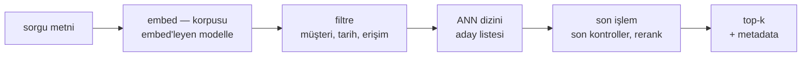

Dizüstü bilgisayarda vektör araması yirmi satırlık iştir. FAISS'i
yükleyin, bir milyon embedding ekleyin, sorgulayın — birkaç
milisaniyede kusursuz komşular gelir ve problemin çözüldüğüne inanmak
işten değildir. Sonra üretim ortamı, üç gayet sıradan istekle kapıyı
çalar: bir müşteri verilerinin silinmesini talep eder, ürün ekibi
"arama olsun ama yalnızca bu müşterinin dökümanlarında" der ve biri,
dün yüklenen dosyanın bugün hâlâ bulunamadığını fark eder. Bunların
hiçbiri arama problemi değildir. Üçü birden demoyu dağıtır.

Bu boşluğun bir biçimi var. Bir ANN dizini, harikulade düzenlenmiş
bir *raftır*; üretimin ihtiyacı ise rafın etrafındaki *kütüphane
binasının* tamamıdır — ödünç verme ve iade, katalog, üye kartları,
her gün rafa dizilen yeni kitaplar. Bu yazı binayı kat kat geziyor:
dizini veritabanından ayıran nedir, tek bir sorgunun başına gelişten
top-k'ye ne olur, hangi dizin ailesi hangi bedeli öder, filtreler
demoları neden bozar, canlı veri ne ister, ölçek neye benzer — ve en
sonda, bütün bunlara gerçekten ihtiyacınız var mı?

**Bu yazıda**

- [1. Dizin bir veritabanı değildir](#1-dizin-bir-veritabanı-değildir)
- [2. Bir sorgunun hayatı](#2-bir-sorgunun-hayatı)
- [3. Dizin aileleri](#3-dizin-aileleri)
- [4. Filtre: demoları bozan soru](#4-filtre-demoları-bozan-soru)
- [5. Canlı veri: upsert, silme, tazelik](#5-canlı-veri-upsert-silme-tazelik)
- [6. Ölçek ve operasyon](#6-ölçek-ve-operasyon)
- [7. Gerçekten gerekli mi?](#7-gerçekten-gerekli-mi)
- [Bütün hikâye altı satırda](#bütün-hikâye-altı-satırda)
- [Terimler sözlüğü](#terimler-sözlüğü)
- [Daha derine inmek için](#daha-derine-inmek-için)

## 1. Dizin bir veritabanı değildir

[Embedding yazısı](post.html?slug=embeddingler-derinlemesine) HNSW
turunu bir uyarıyla bitirmişti: *dizin bir evdir, beyaz tahta değil*.
FAISS ve hnswlib gibi kütüphaneler o evi çok güzel inşa eder — önüne
bir vektör yığını koyduğunuzda "buna en yakın olanlar hangileri?"
sorusunu, çalıştırabileceğiniz her şeyden hızlı cevaplar. Raf budur:
kusursuz düzenli, şaşırtıcı derecede hızlı ve gerçek bir sistemin
ihtiyaç duyduğu diğer her şeye tamamen kayıtsız.

> **Vektör veritabanı** = yüksek boyutlu embedding vektörlerini
> ölçekte saklamak, dizinlemek ve sorgulamak için kurulmuş bir veri
> deposu: bir ANN dizini artı onu güvenle işletilebilir kılan
> mekanizma — ekleme/güncelleme/silme, metadata ve filtreler,
> replikasyon, yedekler, erişim kontrolü.

Fark, en kolay, rafın yapmadıklarının listesinde görünür:

| Binanın sağladığı | Pratikte anlamı |
|---|---|
| Veri yönetimi | tek vektörü, gerisine dokunmadan ekle, güncelle, sil |
| Metadata | her vektör kaynağını, müşterisini, tarihini, izinlerini taşır |
| Filtreleme | "buna benzer ama yalnızca B müşterisi, yalnızca 2025 sonrası" |
| Canlı güncelleme | yeni döküman, baştan inşa olmadan aranabilir hâle gelir |
| Ölçekleme | veri makinelere yayılır; kapasite kesintisiz büyür |
| Yedekleme | kötü bir deploy'dan sonra dönebileceğiniz anlık görüntüler |
| Multitenancy | A müşterisi B müşterisinin dökümanını asla getiremez |

Geleneksel veritabanı da cevap değildir; problemin ayna görüntüsüdür.
Postgres, tam eşleşmede ve yapısal filtrelerde (`WHERE tenant_id =
'b7'`) mükemmeldir; "bu paragrafa anlamca en çok benzeyen 10 satır"
karşısında ise kutudan çıktığı hâliyle çaresizdir. Vektör veritabanı
ikisinin evliliğidir — yüksek boyutlu uzayda benzerlik araması *ve*
yapısal filtreler, birlikte çalışır hâlde. Nasıl birlikte
çalıştıkları sonraki üç bölümün hikâyesi ve hikâye, tek bir sorgunun
izlediği yolla başlıyor.

## 2. Bir sorgunun hayatı

Logosu ne olursa olsun her vektör veritabanı, sorguyu aynı üç
aşamadan geçirir: korpus önceden **dizinlenmiştir**, sorgu o dizinle
**eşleştirilir** ve ham adaylar **son işlemden** geçip cevaba
dönüşür.

Embed adımı, korpusu embed'leyen modelin tıpatıp aynısını kullanır —
[embedding yazısı](post.html?slug=embeddingler-derinlemesine) farklı
modellerin puanlarının neden karşılaştırılamayacağını anlatmıştı;
veritabanı bu kuralı koleksiyon başına sessizce uygular. Filtre
adımı, aday evrenini metadata ile daraltır (tuzaklar 4. bölümde).
ANN adımı, rafın en iyi yaptığı iştir. Son işlem ise aday listesinin
cevaba dönüştüğü yerdir: filtrenin yakalamış olması gerekenler
atılır, istenirse daha pahalı bir puanlayıcıyla rerank yapılır ve
uygulamanın gerçekte ekrana bastığı metadata — kaynak URL, başlık,
izinler — sonuca iliştirilir.

Bunların tamamı, bir sohbet isteğinin içine sığacak kadar hızlıdır.
Kamuya açık ANN benchmark'larında iyi ayarlanmış bir kurulum **p95'te
10–50 ms** bandında cevap verir; Qdrant medyanda 4 ms, p99'da 25 ms
civarı rapor eder, Milvus GPU hızlandırmalı dizinlerle ~6 ms medyan
bildirir. Bir RAG boru hattının gecikme bütçesi neredeyse tamamen
LLM'e gider; doğru kurulmuş erişim, yuvarlama hatasıdır.

## 3. Dizin aileleri

Hız dizinden gelir ve her dizin onu aynı para birimiyle satın alır —
inşa süresi, bellek ve bir parça recall. Üretimde karşılaşacağınız
neredeyse her şeyi dört aile kapsar.

**HNSW** varsayılandır ve derinlemesine anlamaya değer olandır —
[embedding yazısı](post.html?slug=embeddingler-derinlemesine) katmanlı
otoyol–cadde–sokak çizgesini adım adım gezdiriyor. Kısa özet: tepeden
açgözlülükle inilen çok katmanlı bir çizge, bir milyon vektörde sorgu
başına yaklaşık bir milisaniye, recall `efSearch` düğmesiyle ayarlı.
Bedeli bellek ve inşa süresidir: çizge, vektörlerin yanında RAM'de
yaşar ve gerçek ölçekte inşası gerçek saatler alır.

**IVF** haritayı k-means ile kümelere böler ve yalnızca sorguya en
yakın birkaç kümede arar. HNSW'den çok daha hızlı kurulur ve bellekte
daha az yer tutar; ama bir eğitim geçişi ister ve canlı eklemeler
özgün kümelerden uzaklaştıkça bozulur. pgvector ayarı somutlaştırır:
bir milyon satıra kadar kabaca `satır / 1000` küme kurun (üstünde
`sqrt(satır)`), sonra sorgu başına yaklaşık `sqrt(küme)` kümeye
bakın — tek küme hızlı ama kördür, küme sayısı arttıkça recall
gecikme karşılığında yükselir.

**Quantization** rakip bir dizin değil, ikisinin de altına serilen
bir sıkıştırma katmanıdır. Scalar quantization (float32 → int8)
vektör depolamayı yaklaşık %75, product quantization — her vektörü
parçalara bölüp her parçayı öğrenilmiş bir kod defterindeki kodla
değiştirmek — %90'dan fazla küçültür; recall bedeli mütevazıdır.
Bunlar embedding yazısının ölçtüğü düğmelerin aynısıdır (~%96–99
kalite korunumu); veritabanı düğmeleri sizin yerinize çevirir.
Benzer vektörleri ortak kovalara karma yöntemiyle atan **LSH** aile
albümünü tamamlar ama bugün benchmark'larda nadiren kazanır.

Bu menünün büyümeye devam etmesinin nedeni, peçeteye sığan bir duvar
hesabıdır. Bir milyon 1.024 boyutlu float32 vektör ≈ 4,1 GB — sorun
yok. Yüz milyon ≈ **400 GB RAM** — bu artık bir makine değil, bir
bütçedir. İki kaçış yolu önemlidir: **DiskANN** çizgenin çoğunu NVMe
SSD'de tutar ve yine tek haneli milisaniyelerde cevap verir; **CAGRA**
gibi GPU çizge dizinleri ise parayı devasa paralel aramayla takas
eder. Üretim hedefi, embedding yazısının bıraktığı yerde durur:
recall kabaca %95–99'a ayarlanır; hızın son birkaç komşudan kıymetli
olduğu yerlerde ara sıra daha aşağıya inilir.

| Aile | İnşa | Bellek | Sorgu | Canlı veri |
|---|---|---|---|---|
| HNSW | yavaş | yüksek — çizge RAM'de | ~1 ms, en iyi recall/hız | ekleme iyi, silme tembel |
| IVF | hızlı | orta | yeterli kümeyle iyi | veri değiştikçe kayar |
| + quantization | eğitim geçişi ekler | −%75 ile −%90+ | küçük recall bedeli | değişmez |
| DiskANN | yavaş | düşük — dizin SSD'de | ~2–3 ms | yeniden inşa odaklı |

## 4. Filtre: demoları bozan soru

Demo, her ürün yöneticisinin eninde sonunda kuracağı cümlede ölür:
"bu destek kaydına benzeyenler; ama yalnızca B müşterisi ve yalnızca
2025'ten sonrası." Benzerlik araması ile yapısal filtre zıt yönlere
çeker ve ikisini birleştirmenin yalnızca üç yolu vardır.

> **Pre-filtering (ön filtre)** = önce metadata filtresini uygula,
> sonra yalnızca kalanlar içinde ara. **Post-filtering (son filtre)**
> = önce ara, sonra filtreye takılan adayları at. **Filtre-farkındalı
> arama** = eşleşmeyen vektörleri atlamayı dizinin kendisine, yürüyüş
> sırasında öğret.

Çoğu sistemin varsayılanı post-filtering'dir ve aritmetik olarak
başarısız olur. Sayılar pgvector'ün kendi dökümantasyonundan: HNSW
varsayılan olarak `ef_search = 40` aday döndürür; filtreniz
satırların yalnızca %10'unu geçiriyorsa hayatta kalan kabaca **4
sonuçtur** — on istediniz, dört geldi ve hiçbir yerde hata
yükselmedi. Pre-filtering recall'u düzeltir ama bu kez dizini bozar:
aday kümesi dağınık bir alt kümeye inince HNSW çizgesi, üzerinde
gezindiği bağlantılılığı kaybeder ve yüksek seçicilikte dürüst
seçenek, kalanları kaba kuvvetle taramaktır.

Yetişkin cevap filtre-farkındalı aramadır ve bu bir kütüphane değil,
veritabanı özelliğidir. Qdrant, filtreleyeceğiniz alanlar — müşteri,
tarih, kategori — için veri yüklemeden *önce* **payload index**
bildirmenizi ister; sonra istediğiniz kadar iç içe `must` / `should`
/ `must_not` koşulunu çizge yürüyüşü *sırasında* değerlendirir.
pgvector benzer sona iteratif dizin taramasıyla varır: yeterli sayıda
hayatta kalan birikene dek dizinin derinlerine taramayı sürdürür. Her
iki yolda da ders aynıdır: hangi alanlara filtre uygulayacağınıza
veri yüklemeden önce karar verin ve bunu veritabanına söyleyin —
filtreyi dolu koleksiyona sonradan eklemek, aynı işin pahalı
sürümüdür.

## 5. Canlı veri: upsert, silme, tazelik

Raf, kitapların hiç değişmeyeceğini varsayar. HNSW yeni vektörleri
seve seve kabul eder; ama birini silmek başka iştir — bir düğümü
dikkatsizce sökerseniz üzerinden geçen rotalar çöker; bu yüzden
kütüphaneler silmeyi ya yasaklar ya da düğümü sessizce ölü işaretleyip
etrafından dolaşır. IVF farklı yaşlanır: kümeleri geçen ayın verisine
oturtulmuştur ve o günden beri her ekleme, onlardan biraz daha
uzaklaşır. Bağımsız dizinler iki derde de aynı cevabı verir — baştan
inşa — ki bu gece yarısı için makul, öğleden sonra ortası için kabul
edilemezdir.

Veritabanları tam bu iş için üç mekanizma taşır:

- **Tombstone (mezar taşı kaydı).** Silme, vektörü çizgeden sökmek
  yerine ölü işaretler; aramalar cesetleri atlar ve arka plandaki
  birleştirme, etkilenen parçaları kendi takvimince yeniden kurar.
  Silme, çağıran için anlıktır; bedeli taksitle ödenir.
- **Freshness layer (tazelik katmanı).** Yeni vektörler,
  dizinlenmemiş küçük bir tampona iner ve orada kaba kuvvetle aranır;
  her sorgu hem tampona hem ana dizine gider, tamponun içeriği arka
  planda dizine katılır. Dünkü yüklemenin, hiçbir yeniden inşadan
  önce bugün bulunabilmesi böyle olur.
- **Upsert.** Kaynak döküman değiştiğinde vektörü çoğaltmak değil,
  değiştirmek gerekir — kendi döküman kimliğinize bağlı bir upsert,
  bilgiyi güncellemekle, tazesinin önüne geçen bayat kopyalar
  biriktirmek arasındaki farktır.

Bir operasyon tuzağı kalın harfleri hak ediyor, çünkü ona işaret eden
bir hata mesajı asla gelmeyecek: **embedding modelinin sürümü,
şemanızın parçasıdır**. v1 modelin vektörleriyle v2'ninkiler farklı
haritalarda yaşar — aralarındaki kosinüs puanları gürültüdür;
[embedding yazısı](post.html?slug=embeddingler-derinlemesine) bunu
göstermişti. Modeli yükseltmek, koleksiyonun tamamını yeniden
embed'lemek demektir; aklı başında desen, koleksiyon başına tek model
sürümüdür — metadata'ya yazılır, veritabanı şeması taşır gibi
taşınır, asla yerinde karıştırılmaz.

## 6. Ölçek ve operasyon

Buraya kadarki her şey tek makineye sığar. O noktanın ötesinde vektör
veritabanı, API'si olan bir dizin olmaktan çıkıp dağıtık bir sisteme
dönüşür — Milvus mimariyi dört katman olarak anlatır ve tarif
genelleşir: vektörlerle metadata'yı kalıcılaştıran bir **depolama**
katmanı, ANN yapılarını ayakta tutan bir **dizin** katmanı, aramaları
planlayıp yürüten bir **sorgu** katmanı ve istemcileri, güvenliği,
kiracıları karşılayan bir **servis** katmanı. Ayrımın amacı,
katmanların bağımsız ölçeklenmesidir: okuma ağırlıklı yük sorgu
düğümlerini, yazma ağırlıklı yük dizin düğümlerini büyütür.

Ağır işi iki mekanizma kaldırır. **Sharding (parçalama)** koleksiyonu
düğümlere böler; sorgu bütün parçalarda paralel koşar ve sonuçlar
birleştirilir — scatter-gather (dağıt-topla) — böylece on parça, bir
milyar vektörü, tek parçanın yüz milyonu taradığı sürede tarar.
**Replikasyon** her parçanın kopyalarını birden çok düğümde tutar —
hayatta kalmak ve okuma kapasitesi için — ve tek gerçek tercihi
dayatır:

| Tutarlılık | Okuduğunuz | Bedeli |
|---|---|---|
| Eventual (nihai) | belki saniyeler eski veri | en düşük gecikme, en yüksek erişilebilirlik |
| Strong (güçlü) | tam olarak son yazılan | her okuma replikaları bekler |

Erişim yükleri için doğru cevap çoğunlukla eventual consistency'dir —
bir dökümanın birkaç saniye geç görünmesi görünmezdir, ikiye katlanan
p99 gecikmesi değildir. **Multitenancy (çok kiracılılık)** aynı
mekanizmanın üstünde gider: namespace'ler kiracıları koleksiyon
içinde yalıtır; yönetilen platformlar sıcak kiracıları hızlı donanıma
yerleştirip soğukları ucuz depolamada paylaştırır — yalıtım korunur,
kiracı başına maliyet korunmaz.

Neyi izleyeceğiniz mimariden çıkar: p50, p95 ve p99 gecikme
(kullanıcılar kuyrukta yaşar), saniyedeki sorgu sayısı, kesin aramaya
karşı çevrimdışı örneklenen **recall@k** — sessiz olan budur, çünkü
dizin hiçbir hata vermeden recall kaybedebilir — ve dizin tazeliği,
yani bir yazmayla aranabilir olması arasındaki gecikme.

## 7. Gerçekten gerekli mi?

Altı bölüm makineden sonra dürüst soru. Cevap bir merdivendir —
yalnızca belirtilerinizin zorladığı kadar tırmanın.

| Basamak | Durumunuz | Uzanacağınız |
|---|---|---|
| Kütüphane | statik korpus, batch işler, tek makine | FAISS, hnswlib |
| Zaten çalışan Postgres | < ~1M vektör, filtreler SQL'de | pgvector |
| Gömülü | büyüyen tek uygulama, ops ekibi yok | Milvus Lite, Qdrant local, Chroma |
| Adanmış | on milyonlarca vektör, kiracılar, canlı veri | Milvus, Qdrant, Weaviate, Pinecone |

pgvector basamağı somut bir cümleyi hak ediyor, çünkü çoğu projenin
başlaması gereken yer orasıdır: 16.000 boyuta kadar vektör (dizinli
vektörlerde 2.000 — [512–1.024 tatlı
noktası](post.html?slug=embeddingler-derinlemesine) düşünülünce
fazlasıyla yeterli), depolamayı yarılayan `halfvec`, hem HNSW hem
IVFFlat, `<=>` operatörü olarak kosinüs — hepsi, uygulama verinizi
zaten tutan veritabanının içinde; güvendiğiniz JOIN'ler, transaction
ve yedeklerle birlikte. Adanmış basamak, karmaşıklığını
belirtileriniz 4–6. bölümlerdekiler olduğu gün hak eder: recall'u
kesen filtreler, çoğalan kiracılar, aralıksız gelen silme ve
upsert'ler, gecikmenin yerini acı olarak alan RAM faturası.

En üst basamakta adayları karşılaştırırken Milvus'un seçim çerçevesi
doğru üç soruyu sorar: **işlevsellik** (dizin menüsü,
filtreli/hybrid/gruplu arama, multitenancy), **performans**
(p50/p95/p99, QPS, recall@k — benchmark setlerinde değil, üretime
benzeyen yüklerde ölçülmüş) ve **ekosistem** (entegrasyonlar,
operasyon araçları, üç yıl sonra da var olacak bir topluluk).
Kapanış tavsiyeleri olduğu gibi taşınır: çerçeveyle kısa listeyi
çıkarın, sonra **kendi verinizle** bir kavram kanıtı koşun — her
benchmark korpusu, başkasının dağılımıdır.

## Bütün hikâye altı satırda

1. ANN dizini bir raftır; vektör veritabanı, etrafına kurulmuş
   kütüphane binasıdır — aramayı altyapıya çeviren şey CRUD,
   metadata, replikasyon ve erişim kontrolüdür.
2. Her sorgu aynı hayatı yaşar: korpusun modeliyle embed, filtre,
   ANN yürüyüşü, son işlem — p95'te onlarca milisaniye, LLM'in
   yanında yuvarlama hatası.
3. Dizinler inşa süresi, RAM ve recall takas eder: HNSW varsayılan,
   IVF tutumlu alternatif, quantization ikisini de küçültür; 400 GB
   RAM duvarına cevap DiskANN ya da GPU'dur.
4. Filtreler demoları aritmetikle bozar — post-filtering top-k'nizi
   aç bırakır; filtrelenecek alanları baştan bildirin, işi
   filtre-farkındalı dizin yürüyüş sırasında yapsın.
5. Canlı veri tombstone, tazelik katmanı ve upsert'le döner — ve
   embedding modelinin sürümü şemadır: koleksiyon başına tek sürüm,
   taşınır, asla karıştırılmaz.
6. Merdiveni yalnızca belirtilerinizin zorladığı kadar tırmanın:
   kütüphane → pgvector → gömülü → adanmış; finalistleri kendi
   verinizle kavram kanıtında ayırın.

Demoyu bozan üç isteğe dönelim: silme talebi bir tombstone'a, kiracı
filtresi bir payload index'e, dünkü yükleme tazelik katmanına düşer.
Hiçbiri hiçbir zaman arama problemi değildi — binanın kendisiydiler
ve artık kat planını gördünüz.

## Terimler sözlüğü

Yazının temel sözcük dağarcığı, birer satırla:

- **vektör veritabanı** — embedding vektörlerini ölçekte saklayan, dizinleyen ve sorgulayan veri deposu; dizinin etrafında CRUD, filtre ve replikasyon.
- **ANN** — yaklaşık en yakın komşu araması: neredeyse kesin en yakın noktalar, kesin aramanın maliyetinin kesriyle.
- **recall@k** — gerçek top-k'nin dizin tarafından fiilen döndürülen payı; sessizce bozulan metrik.
- **HNSW** — otoyoldan sokağa inilerek aranan katmanlı çizge dizini; sektör varsayılanı.
- **IVF** — kümeleme alternatifi: haritayı k-means ile böl, yalnızca en yakın kümelerde ara.
- **product quantization** — vektör parçalarını öğrenilmiş kod defterine karşı kodlayarak sıkıştırma; %90+ küçülme, küçük recall bedeli.
- **DiskANN** — çoğunlukla NVMe SSD'de yaşayan çizge dizini; RAM'i birkaç milisaniyeyle takas eder.
- **pre- / post-filtering** — filtreyi aramadan önce uygulamak (çizgeyi bozar) ya da sonra (top-k'yi aç bırakır).
- **filtre-farkındalı arama** — metadata koşullarını dizin yürüyüşü sırasında değerlendirmek; alanların baştan bildirilmesini ister.
- **payload index** — filtreyi vektör araması sırasında ucuzlatan metadata dizini (müşteri, tarih, kategori).
- **upsert** — kendi döküman kimliğinize bağlı ekle-ya-da-değiştir; değişen dökümanın çoğalmak yerine güncellenme yolu.
- **tombstone** — silme işareti; aramalar vektörü hemen atlar, birleştirme onu sonra kaldırır.
- **freshness layer** — yeni vektörler için ana dizinle birlikte aranan küçük kaba kuvvet tamponu; içerik sonradan dizine katılır.
- **sharding** — koleksiyonu düğümlere bölmek; sorgu bütün parçalara dağılır, birleşik top-k toplanır.
- **replikasyon** — parça kopyalarını dayanıklılık ve okuma kapasitesi için birden çok düğümde tutmak.
- **eventual / strong consistency** — okumalar yazmaların kısa süre gerisinde kalabilir (hızlı) / okumalar hep son yazılanı görür (yavaş).
- **multitenancy** — tek kurulumun içinde müşteriler arası sert yalıtım; çoğunlukla namespace'lerle.

## Daha derine inmek için

- Inkeep, [Vector database](https://inkeep.com/glossary/vector-database) — bu yazının yola çıktığı pratisyen sözlüğü: tanımlar, gecikme rakamları ve operasyon kontrol listesi.
- Milvus, [What is a vector database?](https://milvus.io/blog/what-is-a-vector-database.md) — dört katmanlı mimari, DiskANN ile CAGRA ve RAM peçete hesabı.
- Milvus, [Choosing the right vector database](https://milvus.io/blog/choosing-the-right-vector-database-for-your-ai-apps.md) — işlevsellik / performans / ekosistem çerçevesi ve kendi verinizle PoC savunusu.
- Pinecone, [What is a vector database?](https://www.pinecone.io/learn/vector-database/) — dizin-veritabanı ayrımı, sorgu boru hattı ve serverless fikirleri (tazelik katmanı, depolama–hesap ayrımı).
- [pgvector](https://github.com/pgvector/pgvector) — README, dizin ayarında yoğunlaştırılmış bir ders: `lists`, `probes`, `ef_search`, iteratif taramalar ve burada alıntılanan filtre uyarıları.
- Qdrant, [Filtering](https://qdrant.tech/documentation/concepts/filtering/) — payload index'ler ve must/should/must_not filtre cebiri.
- [ANN Benchmarks](https://ann-benchmarks.com) — ANN algoritmalarının recall–hız eğrilerinin ayakta duran kamusal karşılaştırması.
- Microsoft, [DiskANN](https://github.com/microsoft/DiskANN) — milyar ölçekli sayıların arkasındaki SSD'de oturan çizge dizini.
- Bu blogda: [embedding'ler derinlemesine](post.html?slug=embeddingler-derinlemesine) — bu veritabanlarının hizmet ettiği geometri, HNSW katman katman dahil — ve [hangi RAG desenine ihtiyacınız var](post.html?slug=hangi-rag-deseni) — iyi erişim yine de yanlış şeyi getirdiğinde ne ekleyeceğiniz.
