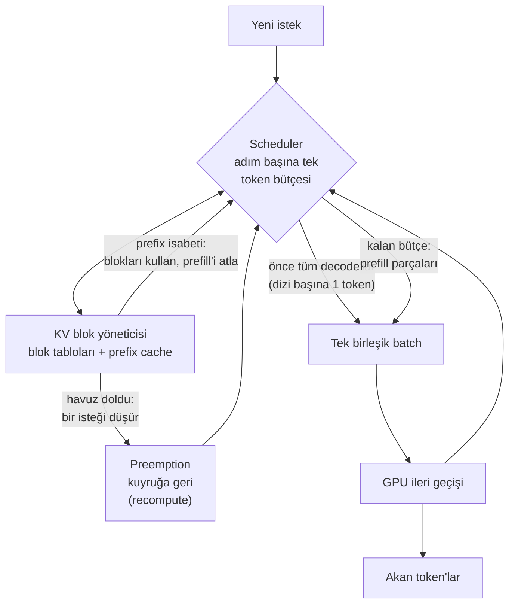

Pano GPU belleğinin %92'sinin tahsis edildiğini söylüyor, ama işlem
hacmi (throughput) açılış benchmark'ının vaat ettiğinin üçte biri.
p95 TTFT bütün sabah gayet iyi seyrediyor; sonra biri 30 sayfalık
bir doküman yapıştırıyor ve diğer bütün kullanıcıların akışı bir
saniyeliğine donuyor. Bir de hiç alarm kurmadığınız bir sayaç var —
`vllm:num_preemptions_total` — salı gününden beri sessizce
tırmanıyor. Bunların hiçbiri bug değil. Hepsi, serving motorunun
henüz ayarlamadığınız bir zamanlama kararı vermesi.

Bu yazı, vLLM'in serving yarışını *neden* kazandığını zaten
bildiğinizi varsayıyor — kesintisiz gruplama (continuous batching)
artı sayfalı KV belleği, bu blogdaki
[maliyet ve gecikme rehberinde](post.html?slug=llm-maliyet-ve-gecikme-optimizasyonu)
anlatılmıştı — ve bunun yerine motorun içine giriyor: blok tablosu
ile prefix cache gerçekte nasıl çalışır, scheduler her adımda ne
yapar, V1 yeniden yazımında ne değişti, onca bayraktan hangileri
önemlidir ve üretimde ne izlenir. Baştan sona tek bir imge bize
eşlik edecek: bir otel olarak vLLM. Naif motor her misafire koca
bir kat rezerve eder; vLLM ise çok iyi bir resepsiyon işletir.

**Bu yazıda**

- [1. Üzerinde durduğunuz zemin](#1-üzerinde-durduğunuz-zemin)
- [2. Bellek resepsiyonu: blok tablosu, prefix caching, preemption](#2-bellek-resepsiyonu-blok-tablosu-prefix-caching-preemption)
  - [Blok tablosu](#blok-tablosu)
  - [Prefix caching: misafirlerin paylaştığı odalar](#prefix-caching-misafirlerin-paylaştığı-odalar)
  - [Preemption: otel fazla rezervasyon alınca](#preemption-otel-fazla-rezervasyon-alınca)
- [3. Scheduler ve V1 motoru](#3-scheduler-ve-v1-motoru)
  - [Tek token bütçesi, tek batch](#tek-token-bütçesi-tek-batch)
  - [V1 neden var](#v1-neden-var)
  - [CUDA graph'lar tek tabloda](#cuda-graphlar-tek-tabloda)
- [4. Hızlandırıcılar: speculative, structured, quantized](#4-hızlandırıcılar-speculative-structured-quantized)
- [5. Tek GPU'dan kümeye](#5-tek-gpudan-kümeye)
- [6. Ayar üçgeni](#6-ayar-üçgeni)
- [7. Üretimde çalıştırmak](#7-üretimde-çalıştırmak)
- [8. vLLM cevap olmadığında](#8-vllm-cevap-olmadığında)
- [Bütün hikâye altı satırda](#bütün-hikâye-altı-satırda)
- [Terimler sözlüğü](#terimler-sözlüğü)
- [Daha derine inmek için](#daha-derine-inmek-için)

## 1. Üzerinde durduğunuz zemin

Kısa bir tekrar — fikir başına bir paragraf, çünkü yazının geri
kalanı bunun üzerine kurulu. Her LLM çağrısının iki fazı vardır:
**prefill (ön doldurma)** prompt'un tamamını tek paralel geçişte
okur ve KV cache'i doldurur; **decode (çözümleme)** yanıtı ileri
geçiş başına bir token yazar ve her seferinde o cache'i yeniden
okur. Üretimin her token'da kuadratik yeniden hesaba mal
olmamasının nedeni KV cache'tir — ve context'in her token'ıyla
büyür. (Mekaniğin tamamını
[LLM'ler nasıl çalışır](post.html?slug=llm-nasil-calisir) yazısı
ağır ağır anlatıyor; bu yazıyı izlemek için yukarıdaki iki cümle
yeter.)

Bu cümle çiftinin içinde iki asimetri saklı ve serving
mühendisliğinin yarısı bu ikisinden türer. Birincisi: cache'te
key'ler ve value'lar var ama query yok — geçmiş bir token'ın K ve
V'si gelecekteki her token tarafından yeniden okunur, query'si ise
tam bir kez lazımdı; saklamak hiçbir şey kazandırmazdı. İkincisi:
iki faz farklı donanımı zorlar. Prefill, dokunduğu her byte
ağırlık başına çok matematik yapar — binlerce prompt token'ı tek
geçişte her matrisle çarpılır — yani **compute-bound**'dur
(hesap gücüyle sınırlı). Decode ise dizi başına tek token üretmek
için *modelin bütün ağırlıklarını* GPU'dan akıtmak zorundadır;
yani **memory-bandwidth-bound**'dur (bellek bant genişliğiyle
sınırlı) ve hesap birimleri yarı yarıya boş oturur. Batching'in
geri sattığı da tam o boşluktur: batch'te ister bir dizi olsun
ister iki yüz, ağırlıklar adım başına bir kez akar; decode'ları
üst üste yığmak sistemdeki en pahalı okumayı amorti eder. Bu
çifti cebinizde taşıyın — "neden batch", "prefill neden herkesin
gecikmesini sıçratır" ve "hangi GPU'yu almalıyım" sorularının
üçünü birden cevaplar.

İki gecikme terimi bundan sonraki her sayfada geçecek; bir kez
sabitleyelim:

> **TTFT (time to first token — ilk token'a kadar geçen süre)** =
> kullanıcının ekranda bir şey görene dek beklediği süre; kuyruk
> artı prefill. **ITL (inter-token latency — token arası
> gecikme)**, diğer adıyla TPOT = yanıt akarken token'lar
> arasındaki boşluk; decode belirler. Bir serving motoru bu ikisi
> ile toplam işlem hacmi arasında bitmeyen bir pazarlık yürütür.

vLLM'den önce serving sistemleri her isteğin KV cache'ini,
*mümkün olan en uzun* context'e göre boyutlanmış tek bir bitişik
blok olarak tahsis ederdi — misafir ne kadar kalırsa kalsın bütün
katı rezerve eden bir otel. vLLM ekibi mevcut sistemlerin KV
belleğinin %60–80'ini parçalanmaya ve aşırı rezervasyona harcadığını
ölçtü. **PagedAttention** (SOSP 2023) bu düzeni bitiren resepsiyondur:
KV belleği küçük sabit bloklara bölünür — varsayılan blok 16
token'dır — ve misafir odaları, konaklaması uzadıkça teker teker
alır. İsraf %4'ün altına iner ve boşalan alan batch kapasitesine
dönüşür; makalenin aynı gecikmede FasterTransformer ve Orca'ya
karşı 2–4 kat işlem hacmi raporlamasının nedeni budur.

Zeminin ikinci yarısı **kesintisiz gruplama** — Orca makalesinin
katkısı (OSDI 2022), vLLM makalesinin bellek yöneticisini
getirmesinden bir yıl önce; mülakatçılar bu ikisinin ayrı
tutulmasını sever. Statik gruplama
bir istek grubunu tur otobüsü gibi taşır: en uzun yanıt bitene
kadar kimse inemez, kısa istekler koltuklarında boş boş oturur.
Kesintisiz gruplama ise batch'i *her decode adımında* yeniden
kurar — biten diziler anında iner, kuyruktakiler anında biner,
GPU hiç boş koltukla gitmez. Binişi ucuzlatan da sayfalı
bellektir: bir isteği kabul etmek artık bitişik bir blok bulmayı
değil, herhangi boş odaları gerektirir. Bu ikili, sizin zaten
çalıştırdığınız zemindir. Şimdi resepsiyon görevlisiyle
tanışalım.

## 2. Bellek resepsiyonu: blok tablosu, prefix caching, preemption

### Blok tablosu

> **Block table (blok tablosu)** = istek başına tutulan, mantıksal
> KV bloklarını ("benim 3. on altılık bloğum") GPU belleğinin
> herhangi bir yerindeki fiziksel bloklara eşleyen harita — bir
> işletim sistemindeki sürecin sayfa tablosunun, inference motoru
> içinde yeniden doğmuş hali.

Bir isteğin bloklarının bitişik olması gerekmez; dolayısıyla
parçalanacak bir şey de yoktur: oteldeki herhangi bir boş oda iş
görür, resepsiyon defteri kimin nerede kaldığını yazar ve attention
kernel'i defteri blok blok gezer. İşletim sistemi benzetmesi
tahsisten de derine iner. Tek prompt'tan birden çok paralel yanıt
üretildiğinde ya da beam search dallar açtığında, ortak prefix tüm
dizilerin referans verdiği *tek* fiziksel kopyada durur. Bir dizi
paylaşılan bloğa yazmak zorunda kaldığı anda vLLM **copy-on-write
(yazarken kopyala)** uygular — odayı klonla, kendi kopyanı
düzenle — bir işletim sisteminin `fork()` için kullandığı
semantiğin aynısı. İlk tanıtım yazısı bu paylaşımın beam search
tarzı yüklerde bellek kullanımını %55'e varan oranda kırptığını
ölçmüştü.

### Prefix caching: misafirlerin paylaştığı odalar

Tek istek içindeki paylaşım otomatiktir. İstekler *arasındaki*
paylaşım ise **automatic prefix caching (APC — otomatik prefix
önbelleği)**, ve mekaniği bilinmeye değer çünkü sınırlarını da
açıklıyor. Dolan her blok, zincir halinde hesaplanan bir hash alır:
ebeveyn bloğun hash'i, artı bu bloğun token ID'leri, artı "ekstra
anahtarlar" — LoRA adapter ID'si, varsa görsel girdilerin hash'i ve
kiracıları birbirinden yalıtan opsiyonel bir **cache salt**.
Zincirleme, doğruluk garantisinin ta kendisidir: *n*. blokta isabet,
*n*'ye kadarki bütün prefix'in token token aynı olduğunu kanıtlar;
yalnızca o bloğun benzediğini değil. İsabet, fiziksel bloğun
referans sayacını artırır; yalnızca `ref_cnt = 0` olan bloklar
tahliye edilebilir, en eski kullanılmayandan başlanır. İki pratik
sonuç: caching blok sınırlarında çalışır (15 token'lık ortak prefix
hiçbir şey paylaşmaz) ve çok kiracılı serving'de cache salt bir
optimizasyon değil, güvenlik kontrolüdür. v0.11'den beri varsayılan
hash sha256'dır; süreçler ve diller arasında yeniden üretilebilir
hash gerektiğinde CBOR ile serileştiren bir varyant vardır.

Peki hiç prefix paylaşmayan iş yükleri de varken bu neden varsayılan
açık? Çünkü V1 defter tutmayı sabit zamanlı veri yapılarıyla
yeniden kurdu: %0 isabet oranında ölçülen işlem hacmi kaybı %1'in
altında. Her isteğin önünde sabit bir sistem prompt'u varsa — ajan
ve RAG trafiğinin normali — ortak prefix'in prefill maliyeti sıfıra
doğru çöker. Sistem prompt'unuz otelin lobisidir: bir kez inşa
edilir, herkes içinden geçer. (Bu, API sağlayıcılarının fiyat
listesindeki "prompt caching" satırının altındaki makinedir de —
onlardan kiraladığınız indirim, kendiniz barındırdığınızda
kendiniz işlettiğiniz mekanizmadır.)

### Preemption: otel fazla rezervasyon alınca

Kesintisiz gruplama, boş blok oldukça istek kabul eder. Er ya da
geç bir uzun-üretim dalgası havuzu tüketir ve resepsiyon bir
misafirden dışarıda beklemesini rica etmek zorunda kalır.

> **Preemption (isteği geçici düşürme)** = çalışan bir isteğin KV
> bloklarını diğerlerine yer açmak için boşaltıp isteği sonra
> yeniden kabul etmek. İki tarzı var: **recompute** (blokları at,
> dönüşte prefill'i baştan yap) ve **swap** (blokları PCIe
> üzerinden CPU RAM'ine park et, dönüşte geri yükle).

V1'in varsayılanı recompute'tur; yeni mimaride daha düşük ek yük
taşır — ve asimetriye dikkat: yeniden prefill maliyeti dizi
uzunluğunun kabaca *karesiyle*, swap ise doğrusal büyür; swap'ın
PCIe faturasını hak ettiği yer çok uzun dizilerdir. Mekanizmadan
önemlisi operasyonel mesaj: her preemption iki kez yapılan iştir.
Normal yük altında istikrarla tırmanan bir `num_preemptions_total`
sayacı, motorun size KV havuzunun trafiğinize göre küçük kaldığını
söylemesidir — `gpu_memory_utilization`'ı yükseltin,
`max_model_len`'i isteklerin gerçekten kullandığı uzunluğa çekin ya
da kapasite ekleyin. Ani yük patlamalarında tek tük preemption
normaldir; istikrarlı tırmanış bir kapasite sinyalidir ve bu
sayaçta, kullanıcılarınız p99'da hissetmeden önce görünür.

## 3. Scheduler ve V1 motoru

### Tek token bütçesi, tek batch

Eski scheduler'lar (vLLM V0 dahil) prefill ile decode'u farklı iş
türleri sayardı: prefill-önce politikaları TTFT'yi parlatır, akan
yanıtları kekeletirdi. V1 scheduler'ı bu ayrımı eritir. Her adımda
verdiği kararın tamamı bir sözlüktür — `{istek_id: kaç_token}` —
ve adımın aşamayacağı tek bir bütçe: `max_num_batched_tokens`.
Decode'lar ucuzdur (çalışan dizi başına bir token) ve önce onlar
gelir; kalan bütçe prefill'lere verilir ve uzun bir prefill,
bütçeye sığan parçalara dilimlenir — **chunked prefill (parçalı ön
doldurma)**, varsayılan açık.

Kuyruk başı tıkanmasının (head-of-line blocking) ilacı bu tek
mekanizmadır: 32 bin token'lık bir prompt artık GPU'yu yüzlerce
milisaniye işgal edip diğer herkesin akışını durdurmaz; onların
decode'larının yanına damla damla sızar. Ve bu bütçe, elinizdeki
en doğrudan gecikme koludur. Küçük bütçe (mesela 2.048 token)
decode'ların her adımı az prefill işiyle paylaşması demektir —
pürüzsüz token arası gecikme, daha yavaş ilk token. Büyük bütçe
(dokümantasyon büyük GPU'larda işlem hacmi için 8.192 üstünü
öneriyor) prompt'ları hızla yutar — daha iyi TTFT ve işlem hacmi,
adım başına daha çok prefill karışması. Varsayılanın nereye
düştüğü ise donanıma ve giriş noktasına bağlıdır; güncel kod
H100'de online serving için 8.192, daha küçük GPU'larda 2.048
seçiyor — blog yazılarına değil (buna da), çalıştırdığınız sürüme
bakmak için bir neden daha.



Diyagramı tek bir isteğin yaşamı olarak okuyun, çünkü "bir
isteğin yolculuğunu anlat" prova edilmeye değer bir sorudur: bir
API sunucu süreci isteği tokenize edip ZeroMQ üzerinden devreder;
istek, blok yöneticisi ona yer açana kadar kuyrukta bekler —
varsa prefix isabeti şimdiden lehine sayılmıştır; prefill'i ortak
bütçenin içinde parçalar halinde koşar; bitene kadar — ya da
preemption'la kuyruğa geri düşene kadar — adım başına bir
token'la decode kalabalığına katılır; tamamlanınca blokları
cache'e geri akar ve tahliye edilene dek yeniden kullanılabilir
kalır. Bu yazının sonundaki belirti tablosunun her satırı, bu beş
duraktan birindeki bir arızadır.

### V1 neden var

2024'e gelindiğinde GPU'lar, çevrelerindeki herkesi ele verecek
kadar hızlanmıştı. H100 üzerinde bir Llama-8B ileri geçişi kabaca
5 milisaniye sürer; tokenization, zamanlama, de-tokenization ve
streaming — hepsi CPU işi — birkaç milisaniye daha alıyorsa,
Python düşünürken hızlandırıcı boş oturur. V1 (v0.8.0'dan, Mart
2025'ten beri varsayılan) neredeyse tamamen bu ek yüke nişan almış
bir yeniden yazımdır: zamanlama ve yürütmeden başka hiçbir şey
yapmayan yalıtılmış bir `EngineCore` süreci, API sunucusuyla
ZeroMQ üzerinden konuşur ve CPU işi GPU işiyle örtüşür (dört GPU'lu
tensor-parallel bir dağıtım altı süreçtir: bir API sunucusu, bir
engine core, dört GPU worker'ı — istek ayrıştırma yoğunlaşınca API
sunucusunun kendisi de `--api-server-count` ile çoğaltılabilir);
girdi tensörlerini adımlar
arasında saklayıp yalnızca farkları uygulayan bir **persistent
batch**; kernel üretimi için `torch.compile`. Sonuç, *aynı* GPU
kernel'leriyle V0'a göre 1,7 kata varan işlem hacmi — kazancın
tamamı CPU ek yükünün sökülmesinden geliyor, ki bu da eski motorun
masada ne bıraktığını tam olarak söylüyor. V0 2025 ortasında
donduruldu ve kodu kaldırıldı; bir rehber `--num-scheduler-steps`
ya da varsayılan-swap'tan bahsediyorsa, bir müze parçasını tarif
ediyordur.

### CUDA graph'lar tek tabloda

Son CPU ek yükü kernel *fırlatmaktır*: decode adımları çok sayıda
küçük kernel çalıştırır ve her birini Python'dan göndermek, kimi
kernel'in kendisinden pahalıdır. CUDA graph'lar bütün diziyi bir
kez kaydeder ve tek parça halinde tekrar oynatır. V1 stratejiyi
bir mod olarak sunar:

| Mod | Ne yapar | Ne zaman |
|---|---|---|
| `FULL_AND_PIECEWISE` (varsayılan) | Decode adımlarında tam graph, gerisinde parçalı | En iyi performans, en çok bellek |
| `PIECEWISE` | Attention hariç her şeyi graph'lar | En geniş uyumluluk |
| `FULL_DECODE_ONLY` | Yalnız saf-decode batch'lerinde tam graph | Decode tarafı instance'ları |
| `NONE` | Graph yok | Hata ayıklama |

İki uyarı. Karışık batch'lerde tam graph'ı yalnızca FlashAttention
3 kaldırır; diğer attention backend'leri modu sessizce kısıtlar.
Ve her hızlı-başlangıç rehberinin bir şey çökünce sarıldığı bayrak
olan `enforce_eager=True`, graph'ları *ve* derlemeyi birlikte
kapatır: en hızlı açılış, en düşük bellek ve sonrasında her
token'da ödeyeceğiniz kalıcı bir decode cezası. Hata ayıklamak
için uygun, serving için yanlış.

## 4. Hızlandırıcılar: speculative, structured, quantized

**Speculative decoding.** Decode'un sıkıntısı, dev bir modelin
token başına tam bir ileri geçiş yapması ve token'ların çoğunun
kolay olmasıdır. Bu yüzden ucuz bir taslakçı birkaç token ilerisini
önerir ve büyük model önerinin tamamını *tek* paralel geçişte
doğrulayıp hemfikir olduğu ön parçayı kabul eder — çıktı, büyük
modelin tek başına üreteceğiyle kanıtlanabilir biçimde özdeştir,
yalnızca daha az geçişte gelir (teorinin tamamı ve soyağacı
[maliyet rehberinde](post.html?slug=llm-maliyet-ve-gecikme-optimizasyonu)).
vLLM'de tek bayraktır, `--speculative-config`, ve bir
yöntem seçimi: **n-gram** taslağı prompt'un kendisinden üretir
(sıfır ek VRAM — düzenleme ve veri çıkarımı gibi girdiyi kopyalayan
işlerde çok iyi), **EAGLE** ailesi kafalar en yüksek kabul oranını
verir, **Medusa** arada durur. Metriklerde her şeyden önce ortalama
kabul uzunluğu τ'ya bakın: model taslakların çoğunu reddediyorsa
boşuna hesap yakıyorsunuz. Ve bedava öğlenin yükle küçüldüğünü
unutmayın — yüksek batch boyutlarında doğrulama, gerçek trafikle
hesap gücü için yarışır ve sabit bir spekülasyon uzunluğu toplam
işlem hacmini *aşağı* itebilir. 2026'nın cevabı uyarlanabilir
doğrulama (DSpark hattı): bir güven kafası her adımda kaç taslak
token'ın doğrulamaya değdiğine karar verir; motor boşken uzun,
doymuşken kısa bir spekülatör gibi davranır.

**Structured output (yapılandırılmış çıktı).** Kısıtlı decode,
JSON şemanızı ya da gramerinizi her adımda kelime dağarcığının
üzerine binen bir bitmask'e derler — model geçersiz token'ı
düpedüz *üretemez*. Varsayılan backend XGrammar'dır ve derlenmiş
gramerleri önbelleğe alır; tekrarlanan şemalar ilk istekten sonra
neredeyse bedavadır. Bilinmeye değer V1 notu: V0'da tek bir
kısıtlı istek, maskesi kurulurken bütün batch'i durdurabiliyordu;
V1 maskeleri scheduler'da, kritik yolun dışında kurar. Ürününüz
model çıktısını regex'le ayrıştırıyorsa, bu özellik koca bir
yeniden-deneme döngüsü sınıfının yerini alır.

**Ağırlıkları değil, cache'i nicemlemek.** Quantization
(nicemleme) sayıları daha az bit'te saklar — 16-bit değerler 8'e
ya da 4'e sıkışır — küçük bir hassasiyet payına karşılık bellek ve
bant genişliği kazanılır. *Ağırlıklara* uygulanınca modeli
küçültür ve decode'u hızlandırır (yöntem seçimi ve doğruluk
bedelleri
[kendi başına bir konu](post.html?slug=llm-maliyet-ve-gecikme-optimizasyonu));
serving'e özgü kol `--kv-cache-dtype fp8`'dir: KV cache'i yarıya
indirir, dolayısıyla havuza sığan context token'ı kabaca ikiye
katlanır. Uzun context ve reasoning trafiğinde çoğu zaman en ucuz
kapasite kazancı budur: GQA'lı bir 70B modelde 30 bin token'lık
bir akıl yürütme izi 16-bit'te yaklaşık 9 GB cache tutar, FP8'de
bunun yarısını (aritmetik 7. bölümde). Katman türleri farklı tepki
verir — kayan pencereli katmanlar daha hassastır ve tam da bu
yüzden katman-atlama bayrağı vardır. Her kayıplı sıkıştırmada
olduğu gibi: güvenmeden önce kendi görevinizde benchmark yapın.

## 5. Tek GPU'dan kümeye

Paralellikler farklı kıtlıklara cevap verir; belirtiyle seçmek
akılda tutmayı kolaylaştırır. **Tensor parallelism (tensör
paralelliği)** her katmanın ağırlık matrislerini GPU'lara böler —
model tek GPU'ya sığmadığında ya da sığıp KV cache'e yer
bırakmadığında uzanın; bedeli her katmanda bir all-reduce
senkronizasyonudur, o yüzden yeri hızlı interconnect'li tek
node'un içidir. **Pipeline parallelism (boru hattı paralelliği)**
modeli katman aşamalarına böler — çok-node standart tarifi TP =
node başına GPU, PP = node sayısıdır (iki adet 8 GPU'lu node için:
`--tensor-parallel-size 8 --pipeline-parallel-size 2`). MoE
modellerinde roller ters döner: **expert parallelism** uzmanları
dağıtırken attention çoğu zaman data-parallel koşar; DeepSeek
sınıfı MLA'lı modeller ölçekte böyle sunulur. 2026'nın eklediği
parça ise TP'nin hiç kapatamadığı bir açığı kapatıyor: **decode
context parallelism**, KV cache'i *dizi* boyunca parçalar — az KV
head'li modellerde TP bütün cache'i her GPU'da kopyalıyordu — ve
vLLM ekibi uzun context'li ajan trafiğinde yalnız bundan kabaca
3 kat GPU başına işlem hacmi raporluyor.

Küme serving'inin ufku **prefill/decode ayrıştırması (P/D
disaggregation)**: iki faz için ayrı vLLM instance'ları ve KV
bloklarını prefill node'larından decode node'larına akıtan bir
bağlayıcı — otelin nihayet check-in bankosunu oda servisinden
ayırması. Mantık faz fiziğinden çıkar: prefill hesap gücünü,
decode bellek bant genişliğini doyurur; ikisini aynı yere koymak,
her fazın dalgasının ötekinin gecikmesini kirletmesi demektir.
Ayırmak TTFT ile token arası gecikmeyi bağımsız ayarlamanızı, iki
havuzu bağımsız ölçeklemenizi, hatta farklı donanıma koymanızı
sağlar. Bedeli cache'i taşımaktır: GQA'lı bir 70B'de 4 bin
token'lık prompt, aktarılacak bir gigabayttan fazla KV demektir;
mühendisliğin bağlayıcı katmanda (llm-d, NVIDIA Dynamo ve üretici
fabric'leri) yaşamasının nedeni bu. Meta, vLLM'i üretimde ayrışık
çalıştırıyor ve kendi iç stack'ine karşı hem TTFT hem token arası
gecikmede iyileşme raporluyor. Tek node işletiyorsanız bunu "var
olduğunu bil" rafına koyun: tek tip replika havuzu TTFT ve ITL
hedeflerinizi aynı anda tutamaz hale geldiğinde gündeme gelir.

## 6. Ayar üçgeni

Aşağıdaki her bayrak sizi tek bir üçgenin içinde gezdirir: ilk
token süresi, token arası gecikme, toplam işlem hacmi. Hiçbiri
üçünü birden satın almaz; ayar, ürününüzün hangi köşede yaşadığına
karar vermektir.

| Parametre | Ne yapar | Rehber |
|---|---|---|
| `gpu_memory_utilization` (0.90) | vLLM'in sahiplendiği GPU bellek oranı; önce ağırlıklar, kalan KV havuzu | Ayrılmış GPU'da 0.92–0.95; preemption tırmanınca ilk hamle |
| `max_num_batched_tokens` | Adım başına token bütçesi | ~2 bin ITL'yi, 8–16 bin TTFT/işlem hacmini kayırır; varsayılan donanıma bağlı |
| `max_num_seqs` | Adım başına azami eşzamanlı dizi | Eşzamanlılık tavanı; önemsediğiniz gecikmeyi izleyerek tarayın |
| `max_model_len` | Azami context uzunluğu | Trafiğin gerçekten kullandığına çekin — kullanılmayan her token payı, parasını ödediğiniz KV havuzudur |
| `enable_prefix_caching` | APC (V1'de varsayılan açık) | Açık bırakın; çok kiracılı serving'de cache salt ekleyin |
| `kv_cache_dtype` | FP8 KV cache | ~2 kat context kapasitesi; kaliteyi kendi görevinizde ölçün |
| `tensor_parallel_size` / `pipeline_parallel_size` | Ağırlık / aşama bölme | TP node içinde (KV'ye de yer açar); PP node'lar arasında |
| `--speculative-config` | Speculative decoding | Kabul uzunluğu τ'yu izleyin; yüksek eşzamanlılıkta kısaltın ya da kapatın |
| `enforce_eager` | Derleme + CUDA graph'ı kapatır | Yalnız hata ayıklama — kalıcı decode hızından yer |
| `block_size` (16) | KV bloğu başına token | Nadiren dokunulur; caching yalnız tam blokları paylaşır |

**VRAM gerçekte nereye gidiyor.** Yukarıdaki her bayrak aslında
GPU belleğinin üç bölgesinden birini itip kakıyor:

| Bölge | Onu ne doldurur | Hangi bayrak yönetir |
|---|---|---|
| Model ağırlıkları (sabit) | parametre sayısı × değer başına byte | `dtype`, ağırlık nicemlemesi |
| KV cache havuzu (dinamik) | context uzunluğu × eşzamanlı dizi | `max_model_len`, `max_num_seqs`, `kv_cache_dtype` |
| Aktivasyon tezgâhı (geçici) | tek ileri geçişin çalışma belleği | `max_num_batched_tokens` |

Açılışta vLLM ağırlıkları yükler, aktivasyon tezgâhını (artı CUDA
graph belleğini) ayırmak için bir ileri geçişin profilini çıkarır
ve `gpu_memory_utilization` sınırı içinde *kalan her şeyi* KV
havuzuna verir. Sonucu da açılış log'una yazar — "KV cache size:
N tokens" — ve o N, gerçek eşzamanlılık bütçenizdir; herhangi bir
benchmark'tan önce okumaya değer. (Varsayılan neden 1.0 değil de
0.90'da durur? Çünkü GPU hiçbir zaman tam olarak yalnız sizin
değildir — CUDA context'i, ayırıcı parçalanması ve aktivasyon
sıçramalarının hepsi pay ister. Ayrılmış bir kartta 0.95'e
çıkın; 1.0, dolambaçlı yoldan bir OOM'dur.) Yerleşik rekabete dikkat: büyük
adım bütçesi geçici tezgâhı, büyük eşzamanlılık KV havuzunu
şişirir ve ikisi de aynı sabit VRAM'den oyulur. İkisini birden
yükseltirseniz açılış başarılı olur, OOM ise ilk uzun-prompt
dalganızı bekler.

**Aritmetik, bir kez elle.** Tek bir 80 GB H100 üzerinde
bfloat16 Llama-3-8B alalım. Token başına KV cache maliyeti:
2 (K ve V) × 32 katman × 8 KV head × 128 head boyutu × 2 byte =
0,125 MB. Şimdi bütçeyi yürüyelim:

- Ağırlıklar: 8 milyar parametre × 2 byte ≈ **16 GB**, sabit.
- Havuz: 80 GB × 0.90 kullanım = 72 GB sahiplenilir; ağırlıklar
  ve kabaca 2 GB aktivasyon tezgâhı ile CUDA graph'ları düşülünce
  ≈ **KV cache için 54 GB**.
- Kapasite: 54 GB ÷ 0,125 MB ≈ uçuşta **~430 bin token** —
  örneğin her biri 4 bin token context'li ~100 eşzamanlı istek.
- Talep kontrolü: `max_model_len 8192 × max_num_seqs 256`,
  ~2,1 milyon token'a *izin verir* — arzın beş katı. Gerçek
  istekler kısa kaldıkça sorun yok; kalmadıkları gün preemption
  fırtınası.
- Tek bayrak, `--kv-cache-dtype fp8`, ağırlıklara dokunmadan
  kapasiteyi ~860 bin token'a katlar.

Aynı yürüyüş OOM olaylarının ve "eşzamanlılığım neden bu kadar
düşük" biletlerinin çoğunu açıklar: arzdan fazlasına izin
verirseniz fark preemption olarak ödenir; adım bütçesini aşırı
büyütürseniz tezgâh, havuzun belleğini alır. Kopyalanmak için
değil, kendi SLO'larınıza karşı ayarlanmak üzere iki başlangıç
noktası:

```bash
# Sohbet: akışı koru (ITL köşesi)
vllm serve MODEL \
  --max-num-batched-tokens 2048 \
  --max-num-seqs 64 \
  --gpu-memory-utilization 0.90

# Batch / RAG beslemesi: GPU'yu doldur (işlem hacmi köşesi)
vllm serve MODEL \
  --max-num-batched-tokens 16384 \
  --max-num-seqs 256 \
  --gpu-memory-utilization 0.95 \
  --kv-cache-dtype fp8
```

## 7. Üretimde çalıştırmak

**Metrikler.** vLLM, `/metrics` ucunda Prometheus metrikleri
sunar; altısı kalıcı bir panoyu hak eder:
`time_to_first_token_seconds`, `inter_token_latency_seconds`,
`e2e_request_latency_seconds`, `num_requests_running` ile
`_waiting` (kuyruk derinliği), `gpu_cache_usage_perc` (KV havuz
basıncı) ve `num_preemptions_total`. Alarmı p95/p99'a kurun, asla
p50'ye değil — bir sunucu bütün sağlık kontrollerini geçerken
kuyruk gecikmesi ürünü mahvedebilir. Metrik *adlarını* da sürüme
özgü sayın: sürümler arasında yeniden adlandırıldılar; alarmları
gerçekten çalıştırdığınız build'in `/metrics` çıktısına karşı
doğrulayın.

**Kapasite his değil, aritmetiktir.** 6. bölüm token başına
formülü — 2 × katman × KV head × head boyutu × byte — tek model
için yürüdü; mimariler arasında ölçeklenince kapasite planlama
tablonuza dönüşür ve attention tasarımının parametre sayısından
neden daha önemli olduğunu söyler. Tablodaki kısaltmalar tek
tanım uzağınızda:

> **MHA / GQA / MLA** = attention'ın kaç key-value head'i
> tuttuğu. Multi-head attention (MHA) her query head'ine kendi
> K/V çiftini verir. Grouped-query attention (GQA) query head
> gruplarına bir tanesini *paylaştırır* — Llama-3'ün 64 query
> head'i yalnızca 8 KV head'inden okur. Multi-head latent
> attention (MLA, DeepSeek) hepsini küçük bir latent vektöre
> sıkıştırır. Daha az KV head, parametre sayısından hiç
> vermeden token başına daha küçük cache demektir — modern her
> açık modelin GQA ya da daha iyisiyle gelmesinin nedeni bu.

| Model | Token başına KV (16-bit) | 4 bin context | 128 bin context |
|---|---|---|---|
| Llama-2-70B (MHA, 64 KV head) | ~2,5 MB | ~10 GB | ~320 GB |
| Llama-3-70B (GQA, 8 KV head) | ~0,31 MB | ~1,25 GB | ~40 GB |
| DeepSeek sınıfı (MLA) | sıkıştırılmış latent, çok daha küçük | — | — |

Aynı katman sayısı, aynı boyut sınıfı — yalnız attention
tasarımından 8 kat fark, FP8 bunu bir daha yarılamadan önce.
Ağırlıklar önce gelir (16-bit bir 70B ~140 GB'dir — tek token
cache'ten önce iki adet 80 GB'lık GPU) ve aktivasyonlarla CUDA
context'i için %15–20 pay bırakın. Bu tablo aynı zamanda GPU
alışveriş rehberinizdir: prefill FLOPS ister, decode bellek bant
genişliği; hangisinin kıt olduğunu girdi/çıktı uzunluk karışımınız
belirler.

**İşlem hacmini değil goodput'u optimize edin.**

> **Goodput** = *SLO'larınızı karşılayan* saniye başına istek
> (örn. TTFT 500 ms, ITL 50 ms altında) — ürününüzün gerçekten
> yaşadığı tek işlem hacmi sayısı.

Ham token/s, deneyim çoktan çöktükten sonra da eşzamanlılıkla
tırmanmaya devam eder. `vllm bench serve` goodput'u doğrudan
ölçer: SLO eşiklerinizi verin, gerçekçi prompt/yanıt uzunluk
dağılımlarını oynatın (sabit uzunluklu sentetikler değil —
uzunluk karışımı her sonucu değiştirir) ve goodput tepe yapana
dek eşzamanlılığı tarayın. Bir replikanın gerçek kapasitesi işlem
hacmi platosu değil o tepedir; autoscaler'ınızın hedeflemesi
gereken sayı da odur. Kubernetes'te vLLM production-stack, KServe
ve Ray Serve bunu hazır bağlar; bir router özelliği ayrıca anılmayı
hak ediyor: **prefix-aware routing (prefix'e duyarlı
yönlendirme)** — aynı prefix'i paylaşan istekleri aynı replikaya
gönderir ki 2. bölümün cache'i havuza saçılacağına gerçekten
isabet alsın.

**Endüstrinin üzerinde buluştuğu kontrol listesi.** Metriklerin
ve aritmetiğin ötesinde, ciddi her vLLM dağıtım anlatısında aynı
bir avuç operasyonel pratik karşınıza çıkar:

- **Açılışa saygılı probe'lar.** Bir vLLM pod'u `/health`
  yeşillenmeden önce dakikalarca ağırlık yükler, derler ve CUDA
  graph yakalar — Kubernetes'e cömert bir startup probe verin ve
  liveness'ı readiness'tan ayırın; yoksa orkestratör, birazdan
  düzelecek pod'ları öldürür.
- **Trafikten önce ısıtın.** Açılıştan sonraki ilk istekler
  derleme ve cache ısınma bedelini öder; replika load balancer'a
  katılmadan önce birkaç temsili ısınma prompt'u gönderin.
- **Ağırlıkları önceden indirin.** Model dosyalarını sunucunun
  içinde indirmek yerine bir init container ile volume'e çekin —
  yeniden başlatmalar yeniden indirmeye mal olmasın.
- **Hepsini birden değil, sırayla güncelleyin.** Her replika
  sıcak bir prefix cache ve bir kuyruk taşır; `maxUnavailable: 0`
  tarzı kademeli dağıtımlarla güncelleyin ki kapasite ve cache
  aynı anda buharlaşmasın.
- **Kullanım oranına değil kuyruk derinliğine göre ölçekleyin.**
  İstekler yığılırken CPU %5'te oturur ve motor bellek açlığı
  çekerken bile "GPU kullanımı" yüksek okunur;
  `num_requests_waiting` üzerinden (KEDA bunu doğrudan
  `/metrics`ten okur) ve KV havuz basıncına göre ölçekleyin.
- **Sırayla ayarlayın.** Pratisyenlerin önerdiği sıra: önce
  replika-GPU topolojisi, sonra `gpu_memory_utilization` yukarı
  (0.90 → 0.95), sonra kalite kontrolüyle FP8 KV cache, sonra
  SLO'larınıza karşı `max_num_seqs` taraması — her seferinde tek
  değişiklik, her adımda yeniden benchmark.
- **Sürümleri sabitleyin.** Varsayılanlar, bayraklar ve metrik
  adları sürümler arasında oynar; minör yükseltme rutin bir bump
  değil, bir konfigürasyon incelemesidir.

**Multi-LoRA, kısaca.** Tek base model artı istek başına
adapter'lar (`--enable-lora`, `--max-loras`), tek GPU'dan çok
sayıda ince ayarlı varyant sunar — standart çok kiracılı
özelleştirme deseni. Prefix cache hash'i adapter ID'sini zaten
içerir; kiracılar önbellekli blok paylaşmaz. Tek uyarı: çalışma
anında adapter yükleme (`VLLM_ALLOW_RUNTIME_LORA_UPDATING`),
"dosya yükle"yi bir API çağrısına çevirir — yalıtılmış ortamlar
dışında kapalı tutun.

## 8. vLLM cevap olmadığında

Artık iç mekaniği bildiğinize göre,
[önceki karşılaştırmanın](post.html?slug=llm-maliyet-ve-gecikme-optimizasyonu)
keskinleştirilmiş, dürüst hali:

| Motor | Nerede kazanır | Bedeli |
|---|---|---|
| vLLM | Üretime en hızlı yol, en geniş model/donanım desteği, derleme adımı yok | Tekil benchmark'larda zirve sayı nadiren onundur |
| TensorRT-LLM | Üçüncü taraf testlerin çoğunda NVIDIA üzerinde en yüksek sürekli ham işlem hacmi (tek haneli ile ~%10'lu farklar) | Engine derlemeleri, yavaş iterasyon, üreticiye kilitlenme |
| SGLang | RadixAttention ile prefix-yoğun trafik (ajanlar, RAG) — KV cache üzerinde canlı bir prefix *ağacı*; ortak context'i vLLM'in blok hash'lerinden ince granülaritede paylaşır; çok büyük modellerde fark daralır | vLLM'den küçük ekosistem |

Motorlar arası yüzdeleri hava durumu raporu gibi okuyun: kazananı
model, GPU, eşzamanlılık ve prompt karışımı belirler; yayımlanmış
benchmark'ların birbiriyle çelişmesinin nedeni tam da bu — iyi
kurulmuş en az bir test, üçünün her birine taç giydiriyor. Karar
vermeden önce kendi donanımınızda, kendi trafiğinizle ölçün;
6. bölümdeki bayraklar sonuçları motorlar arası farktan daha çok
oynatır.

Değişim hızı da gerçek bir karar girdisidir. Kabaca bir yılda: V0
tamamen kaldırıldı; FP4 ağırlıklı Blackwell GPU'ları benzer
gecikmede Hopper'ın ~4 katına varan işlem hacmiyle raporlandı;
ayrışık GB200 raflarında öncü MoE modellerde GPU başına 20 bin
token/s aşıldı; uyarlanabilir spekülatif doğrulama ve decode
context parallelism geldi. Motor seçimi, bugünün benchmark'ı kadar
projenin hızına oynanan bir bahistir.

Döngüyü motorun kendisi gibi kapatalım — önce belirti:

| Belirti | Hamle | Neden işler |
|---|---|---|
| `num_preemptions_total` istikrarla tırmanıyor | `gpu_memory_utilization`'ı yükselt; `max_model_len`'i kıs; kapasite ekle | KV talebi havuzu aşıyor; preemption iki kez yapılan iştir |
| p95 TTFT SLO üstünde, ITL iyi | `max_num_batched_tokens`'ı yükselt | Prompt'lar adım bütçesini bekliyor; büyük bütçe onları erken yutar |
| p95 ITL bozuluyor, TTFT iyi | `max_num_batched_tokens`'ı düşür | Her decode adımının içine daha az prefill karışır |
| Her yerde aynı sistem prompt'u, cache isabeti düşük | Prefix-aware routing'i ve blok sınırı hizasını kontrol et | APC, replika başına, özdeş prefix'lerde tam blok paylaşır |
| Speculative decoding açık, yük altında işlem hacmi düştü | Spekülasyonu kısalt ya da uyarlanabilire geç; τ'ya bak | Doğrulama, gerçek trafikle hesap gücü için yarışır |
| Prefix-yoğun ajan trafiği hâlâ beklentinin altında | SGLang'ı değerlendir | RadixAttention prefix'leri ağaç granülaritesinde kullanır |
| Tek model, yalnız NVIDIA, zirve token/s peşinde | TensorRT-LLM'i değerlendir | Derlenmiş engine'ler sürekli yük benchmark'larını kazanır |

## Bütün hikâye altı satırda

1. PagedAttention, KV cache'i sayfa tablosu üzerinden 16 token'lık
   bloklarla tahsis eder; bellek israfı %60–80'den %4'ün altına
   iner — boşalan bellek batch kapasitesi, kapasite işlem hacmi
   olur.
2. Prefix caching blok zincirlerini hash'ler; özdeş prefix'ler bir
   kez saklanır. V1 ek yükünü sıfıra yaklaştırdı, o yüzden hep
   açıktır ve sistem prompt'unuzun prefill'i neredeyse bedavadır.
3. V1 scheduler'ı adım başına tek token bütçesi işletir — önce
   decode'lar, kalanla parçalı prefill — ve o bütçe,
   `max_num_batched_tokens`, ana TTFT-ITL düğmesidir.
4. V1'in V0'a karşı 1,7 katı hızlı kernel'den değil, CPU ek
   yükünün sökülmesinden geldi; `enforce_eager` bunun bir kısmını
   geri verir, hata ayıklamaya saklayın.
5. Kapasite aritmetiktir: token başına KV byte'ı × context ×
   eşzamanlı dizi, havuza sığmak zorundadır; sığmazsa bedel
   preemption'dır — ve `num_preemptions_total` sizi
   kullanıcılarınızdan önce uyarır.
6. Goodput için ayarlayın — TTFT ve ITL SLO'larını karşılayan
   istekler — kendi donanımınızda, kendi trafiğinizle;
   başkalarının benchmark yüzdeleri size taşınmaz.

## Terimler sözlüğü

- **PagedAttention** — KV cache'in, istek başına blok tabloları
  üzerinden küçük sabit bloklarla yönetimi; işletim sistemi sanal
  belleğinin serving'e uyarlanması.
- **block table (blok tablosu)** — bir isteğin mantıksal KV
  bloklarını fiziksel GPU bloklarına eşleyen defter; bitişik
  olmayan tahsisi ve paylaşımı mümkün kılar.
- **copy-on-write (yazarken kopyala)** — paylaşılan KV bloğunun
  yalnızca bir dizi yazmak istediğinde klonlanması; paralel
  örneklemenin prefix'i güvenle paylaşma yolu.
- **automatic prefix caching (APC)** — zincirli hash'lerle
  istekler arası KV bloğu paylaşımı; isabet, prefix'in tamamının
  eşleştiğini kanıtlar.
- **cache salt** — çok kiracılı dağıtımlarda kiracıların
  cache'lerini birbirinden yalıtan ek hash anahtarı.
- **preemption (isteği geçici düşürme)** — bellek baskısında
  çalışan isteğin KV bloklarının boşaltılması; V1 dönüşte
  prefill'i yeniden yapar (recompute).
- **chunked prefill (parçalı ön doldurma)** — uzun prompt'u,
  decode'larla adım paylaşan parçalara dilimleme; kuyruk başı
  tıkanmasının ilacı.
- **CUDA graph** — önceden kaydedilip tek seferde oynatılan
  kernel dizisi; decode'daki kernel başına CPU fırlatma maliyetini
  siler.
- **kabul uzunluğu (τ)** — speculative decoding'de adım başına
  kabul edilen ortalama taslak token; ilk bakılacak metrik.
- **goodput** — yalnızca gecikme SLO'larını karşılayan istekleri
  sayan işlem hacmi.
- **P/D disaggregation (prefill/decode ayrıştırması)** — iki fazı
  ayrı instance'larda koşturup KV'yi aralarında akıtmak; her fazın
  bağımsız ayarı.
- **GQA (grouped-query attention)** — query head'lerinin daha
  küçük bir KV head kümesini paylaşması; token başına cache'i
  küçültür (Llama-3: 64 query head'e 8 KV head).
- **MLA** — DeepSeek'in latent'e sıkıştırılmış attention'ı; KV
  cache'i MHA/GQA'ya göre çarpıcı biçimde küçültür.

## Daha derine inmek için

- Kwon vd., *Efficient Memory Management for LLM Serving with
  PagedAttention* (SOSP 2023) —
  [arxiv.org/abs/2309.06180](https://arxiv.org/abs/2309.06180)
- vLLM: *Easy, fast, and cheap LLM serving* (2023 tanıtımı) —
  [vllm.ai/blog/2023-06-20-vllm](https://vllm.ai/blog/2023-06-20-vllm)
- *vLLM V1: a major upgrade to the core architecture* —
  [vllm.ai/blog/2025-01-27-v1-alpha-release](https://vllm.ai/blog/2025-01-27-v1-alpha-release)
- vLLM dokümanları: [optimizasyon ve
  ayar](https://docs.vllm.ai/en/stable/configuration/optimization/),
  [prefix caching
  tasarımı](https://docs.vllm.ai/en/stable/design/prefix_caching/),
  [CUDA graph'lar](https://docs.vllm.ai/en/stable/design/cuda_graphs/)
- RFC: *Deprecating vLLM V0* —
  [github.com/vllm-project/vllm/issues/18571](https://github.com/vllm-project/vllm/issues/18571)
- Red Hat Developer, *Practical strategies for vLLM performance
  tuning* —
  [developers.redhat.com](https://developers.redhat.com/articles/2026/03/03/practical-strategies-vllm-performance-tuning)
- *Disaggregated inference at scale with PyTorch & vLLM* (Meta) —
  [pytorch.org/blog](https://pytorch.org/blog/disaggregated-inference-at-scale-with-pytorch-vllm/)
- Aleksa Gordić, *Inside vLLM: anatomy of a high-throughput
  inference system* —
  [aleksagordic.com/blog/vllm](https://www.aleksagordic.com/blog/vllm)
- Bu blogda: [LLM maliyet ve gecikme
  optimizasyonu](post.html?slug=llm-maliyet-ve-gecikme-optimizasyonu)
  — bu yazının içini açtığı serving odası —
  [LLM'ler nasıl çalışır](post.html?slug=llm-nasil-calisir) —
  prefill, decode ve KV cache'in sakladığı şey —
  [Ajan prompt'unun anatomisi](post.html?slug=ajan-promptunun-anatomisi)
  — prefix caching'in ödüllendirdiği sabit-prefix trafiği —
  [Hangi RAG desenine ihtiyacınız var](post.html?slug=hangi-rag-deseni)
  — uzun ortak context'lerin geldiği yer.
